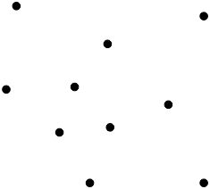

> [Algorithme, code et théorie]() / [algorithmie]() / [étude : voyageur de commerce]()
>
> **prérequis :**
>
> * [algorithmes gloutons]()
> * [projet : exponentiation]()
>
{: .chemin}

Nous allons étudier ici un problème d'intérêt pratique nommé le [problème du voyageur de commerce](https://fr.wikipedia.org/wiki/Probl%C3%A8me_du_voyageur_de_commerce). On peut le formuler ainsi :

*"un voyageur de commerce doit visiter $n$ villes dans la journée. Il veut donc partir de chez lui, parcourir toutes les villes puis revenir chez lui en ayant parcouru le minimum de distance"*.

L'étude de ce problème (ainsi que le problème associé traitant des graphes connexe) nous permettra d'utiliser des techniques de design d'algorithmes connus comme les algorithmes gloutons ou d'en découvrir d'autres comme la programmation dynamique.

En plus d'être des problèmes courants, ils sont très jolis algorithmiquement. On espère que vous aimerez la ballade.

## graphes connexes

Les problèmes que nous allons étudier dans cette partie sont tous plus ou moins reliés à la notion de **graphe**. Nous n'allons pas faire un cours de graphe ici (une introduction est disponible [ici]() pour les personnes intéressées), juste donner quelques définitions et propriétés utiles :

> Un **graphe** $G = (V, E)$ est un couple où $E$ est un ensemble de sous-ensembles à 2 éléments de $V$. $E$ est l'ensemble des **sommets** de $G$ et $E$ l'ensemble des **arêtes** (on notera les arêtes $xy$ plutôt que $\{x, y\}$ pour rendre les notations plus digestes).
>
> Une **valuation** d'un graphe $G = (V, E)$ est une fonction $\omega: E \rightarrow \mathbb{R}^+$
{: .note}

Nous allons en particulier nous intéresser aux problématiques de chemins et cycles dans un graphe, que l'on peut définir ainsi :

> Pour un graphe $G=(V, E)$ :
>
> * un **chemin** est une suite de sommets $v_1,\dots, v_i, \dots, v_m$ tels que $v_iv_{i+1} \in E$ pour tout $1\leq i < m$.
> * un **cycle** est un chemin dont le premier et le dernier élément sont identiques.
>
{: .note}

Enfin, nous introduisons la notion de connexité d'un graphe :

> **Problème de connexité d'un graphe** :
>
> * **Données** :
>   * un graphe $G = (V, E)$ à $n$ sommets
> * **question** :
>   * peut-on trouver un chemin entre $x$ et $y$, quelque soient $x, y \in V$ ?
>
{: .note}

Les graphes qui répondent OUI à cette question sont dit **connexes**.

Remarquez que le problème de connexité est équivalent au problème suivant (pour un graphe donné, les réponses aux deux problèmes sont identiques), alors qu'il semble pourtant plus simple :

> **Problème des chemins à partir d'un sommet** :
>
> * **Données** :
>   * un graphe $G = (V, E)$ à $n$ sommets
>   * un sommet $x \in V$
> * **question** :
>   * peut-on trouver un chemin entre $x$ et $y$, quelque soit $xy \in V$ ?
>
{: .note}


Soit $G = (V, E)$ un graphe. Il est clair que s'il est connexe, le *problème des chemins à partir d'un sommet* est aussi vrai, $\forall x \in V$

Réciproquement, supposons que le *problème des chemins à partir d'un sommet* est vrai pour $G$ et un sommet $x^\star$

Soient alors $x \neq y \in V$. Il existe :

* un chemin $u_1\dots u_k$ entre $x^\star$ et $x$ ($u_1 = x^\star$ et $u_k = x$)
* un chemin $v_1\dots v_l$ entre $y$ et $x^\star$ ($v_l = y$ et $v_l = x^\star$)

On peut alors noter $i^\star$ le plus grand indice tel qu'il existe $j^\star$ avec : $u_{i^\star} = v_{j^\star}$. Comme $u_1 = v_l$, $i^\star$ existe.

La suite $v_1 \dots v_{j^\star} u_{i^\star+1} \dots u_k$ est alors un chemin entre $x$ et $y$. 

Comme $x$ et $y$ ont été pris au hasard, on en conclut que $G$ est connexe.



La preuve de l'équivalence entre ces deux problèmes nous donne une propriété fondamentale de la connexité :

> Soit $G=(V, E)$ un graphe. S'il existe un chemin allant de $x$ à $y$ et un chemin allant de $y$ à $z$ dans $G$, alors il existe un chemin allant de $x$ à $z$.
{: .note}

De là, la propriété suivante :

> Soit $G=(V, E)$ un graphe. Une **composante connexe** de $G$ est un sous-ensemble $A$ de sommets de $G$, maximal pour l'inclusion, tel que le graphe $G \vert_A = (A, \\{ uv \in E \mid u, v \in A\\})$, restriction de $G$ à $A$, est connexe.
>
> En ajoutant à $G$ une arête $xy$ où $x$ et $y$ sont dans des composantes connexes différentes, l'union de ces deux ensembles forme une unique composante connexe dans le nouveau graphe.
{: .note}

Il faut donc un petit nombre d'arête à un graphe pour qu'il soit connexe :

> Si $G=(V, E)$ est un graphe connexe, alors $\vert E \vert \geq \vert V \vert -1$.
{: .note}


On le prouve par récurrence sur $\vert V \vert$. Si le graphe contient 1 sommet, la propriété est vérifiée. Supposons la propriété vrai pour $n-1$ sommet et considérons un graphe connexe à $n > 1$ sommet.

Choisissons un sommet $x$ du graphe et supprimons le de $G$. La restriction de $G$ contient alors $k$ composantes connexes à $n_i$ sommets ($1 \leq i \leq k$), contenant (par hypothèse de récurrence) chacune au moins $n_i -1$ arêtes.

Comme $G$ était connexe, $x$ était relié à chacune des composantes connexes par une arête, c'est à dire au moins $k$. De là, le nombre d'arête de $G$ est :

$$
\vert E\vert \geq \sum_{i=1}^k (n_i -1) + k = \sum_{i=1}^k n_i = n - 1
$$



> La réciproque est cependant fausse... Il existe des graphes $G=(V, E)$ non connexes ayant plus de $\vert V\vert -1$ arêtes.
{: .attention}

Ces diverses propriétés vont nous permettre de créer à coût min un réseau routier entre villes.

## Relier des villes entre elles

Avant de voyager de ville en ville, commençons par nous mettre dans la peau d'une entreprise de travaux public dont le but est de construire un réseau routier :

> **réseau routier à coût min**
>
> * **Données** :
>   * $V$, un ensemble de $n$ villes
>   * $c: V \times V \rightarrow \mathbb{R}^+$ une fonction de coût pour créer une route à double sens entre 2 villes.
> * **question** :
>   * donnez un graphe $G=(V, E)$ connexe telle que $\sum_{xy \in E} c(x, y)$  soit minimum parmi tous les graphes connexes.
>
{: .note}

On peut utiliser un algorithme glouton pour résoudre ce problème. Comme tout algorithme glouton, on peut le réduire à :

1. $E = \emptyset$
2. pour chaque couple $xy$ : si le graphe $G=(V, E \cup \{xy\})$ a moins de composantes connexes que $G=(V, E)$ alors $E = E \cup \{ xy \}$

> Combien d'arêtes aura $E$ à la fin de l'algorithme ?
{: .a-faire}


Lorsque l'on ajoute une arête, on diminue de 1 le nombre de composantes connexes de $G$. Comme au départ il y en a $n$, $E$ aura exactement $n-1$ arêtes : ce sera un graphe connexe avec un nombre minimum d'arêtes.


Il reste deux inconnues :

1. dans quel ordre parcourir les différents couples ?
2. comme vérifier efficacement qu'un graphe a moins de composantes connexes qu'un autre

En répondant à la première question, on démontrera que notre algorithme glouton est optimal et en répondant à la seconde question, on le fera rapidement.

> Montrer qu'en parcourant les arêtes par coût croissant, on obtient un graphe connexe de coût minimum.
{: .a-faire}


Soit $E^\star$ une solution optimale et considérons le déroulement de l'algorithme étape par étape. On suppose que $E \neq E^\star$. On s'arrête alors à la **première** étape telle que soit :

1. l'algorithme rejette $xy$ alors qu'il est dans $E^\star$
2. l'algorithme accepte $xy$ alors qu'il n'est pas $E^\star$

On peut même sans perte de généralité considérer que parmi toutes les solutions optimales, $E^\star$ est celle qui coïncide le plus longtemps avec $E$.

Le premier cas est impossible car si l'algorithme rejette $xy$, c'est que cette arête ne diminue pas le nombre de composantes connexes, on pourrait donc la supprimer de $E^\star$ sans altérer le nombre de composantes connexes du graphe.

Dans le deuxième cas. Si $xy$ n'est pas dans $E^\star$ c'est qu'il existe un chemin allant de $x$ à $y$ dans $E^\star$ dont au moins une arête, disons $uv$ n'est pas dans $E$. Cette arête est de coût supérieur à celui de $xy$ ($xy$ est la première arête qui diffère entre $E$ et $E^\star$, donc on a pas encore vu $uv$ lorsque l'on examine $xy$).

L'ensemble $E^\star \backslash \{ uv \} \cup \{ xy \}$ serait alors encore connexe, mais de coût inférieur. Ceci est doublement impossible car on aurait une solution optimale qui coïnciderait plus longtemps avec $E$ que $E^\star$ ce qui est impossible par hypothèse.



> Soit $G=(V, E)$. Supposons que l'on ait une fonction $f: V \rightarrow V$ telle que $f(x) = f(y)$ si et seulement si il existe un chemin entre $x$ et $y$.
>
> * quand est-ce que $x$ est dans la même composante connexe que $y$ ?
> * comment mettre à jour $f$ si on ajoute l'arête $xy$ à $G$ ?
{: .a-faire}


Le sommet $x$ est dans la même composante connexe que $y$ si et seulement si $f(x) == f(y)$

La mise à jour se fait ainsi :

```python
c = f(x)
for z in V:
    if f(z) == c:
        f(z) = f(y)
```

> la variable `c` est **indispensable**. Si on fait le fest `if f(z) == f(x):` à la place, une fois qu'on a examiné $x$, son $f$ aura changé et le test ne fonctionnera plus...
{: .attention}



> Déduire de tout ce qu'on a fait précédemment un algorithme en $\mathcal{O}(n^2\log(n))$ permettant de résoudre le problème du **réseau routier à coût min** pour $n$ villes.
{: .a-faire}


```text
def reseau(V, d):
    Soit E l'ensemble vide

    Soit F l'ensemble des couples (x, y) avec x ≠ y triés par ordre croissant
    pour chaque x de V:
        f(x) = x
    
    pour chaque xy de F:
        si f(x) ≠ f(y):
            ajoute xy à E
            c = f(x)
            pour chaque z de V:
                si f(z) == c:
                    f(z) = f(y)
            
    rendre E
```

Cet algorithme s'appelle l'algorithme de Kruskal dans le cadre de la théorie des graphes.

Sa complexité est la suivante :

* tris de $\frac{n(n-1)}{2}$ couples : $\mathcal{O}(n^2\log(n^2)) = \mathcal{O}(n^2 \cdot2\cdot \log(n)) = \mathcal{O}(n^2\log(n))$
* assignation d'une valeur à $f$ pour chaque élément de $V$ : $\mathcal{O}(n)$
* parcours de tous les couples ($\frac{n(n-1)}{2}$ couples), et on met à jour $f$ en $\mathcal{O}(n)$ opérations. Comme on ne fait la modification de $f$ que si le nombre de composantes connexes diminue, c'est à dire au maximum $n$ fois,  la complexité totale de cette partie est en $\mathcal{O}(n^2)$



## Voyageur de commerce

Il existe de nombreuses formalisation du problème du voyageur de commerce, nous allons en donner la version euclidienne qui est la plus utilisée car elle s'applique directement aux villes sur une carte (la distance routière entre 2 villes étant une distance) :

> **Voyageur de commerce (euclidien)** : Soit $V$ un ensemble de $n$ éléments et $d: V \times V \rightarrow \mathbb{R}^+$ une distance (donc symétrique et respectant l'inégalité triangulaire) sur $V$.
>
> Donnez un ordre $v_1, \dots, v_n$ entre les villes minimisant :
>
> $$
> \sum_{i=1}^{i=n-1} d(v_i, v_{i+1}) + d(v_n, v_1)
> $$
>
{: .note}

## résolution exacte

Nous n'allons pas chercher à résoudre par un algorithme polynomial le problème du voyageur de commerce, car c'est un problème NP-difficile et que beaucoup (tous ?) les informaticiens ont tenté au moins une fois de le faire sans y parvenir. En revanche, on peut trouver une solution exacte à notre problème en utilisant un algorithme exponentiel.

> Le problème du voyageur de commerce fait parti des problèmes NP-difficiles (une variante des problèmes [NP complets](https://fr.wikipedia.org/wiki/Probl%C3%A8me_NP-complet)) : on ne connait pas d'algorithmes polynomial pour le résoudre.
>
> Ces problèmes sont théoriquement intéressants car ce sont des **problèmes universels** : si on sait résoudre un seul problème NP-difficile avec un algorithme polynomial, le même algorithme permettrait de résoudre non seulement tous les problèmes NP-difficiles mais également tous les problèmes résolubles par un ordinateur.
>
{: .note}

### énumération de tous les cycles

On peut tenter d'énumérer tous les cycles possibles et en garder le minimum.

> Combien de cycles différents faut-il examiner ?
>
> Donnez un algorithme pour les générer.
{: .a-faire}

Comme le cycle doit passer par tous les sommets, je peux considérer que je commence toujours en $v_1$, il faut donc ensuite passer par $n-1$ autres villes, dans un ordre donné (il y en a $(n-1)!$).

De plus, un cycle peut être parcouru dans 2 sens différents, un cycle donné correspond ainsi à 2 ordres différents ($v_1v_2\dots v_n$ et $v_n v_{n-1}\dots v_2$ correspondent au même cycle parcouru dans un sens ou dans l'autre).

Il faut donc générer $\frac{(n-1)!}{2}$ cycles différents.

Pour ne générer qu'une seule fois chaque ordre on peut considérer tous les cycles :

$$
v_1v_{\sigma(1)}\dots v_{\sigma(n-1)}v_1
$$

Avec :

* $\sigma$ une permutation de $[2..n]$
* $\sigma(1) < \sigma(n-1)$

On peut alors utiliser l'algorithme `permutation(T)` de l'[étude sur les mélanges](#algo-toutes-permutations) :

```text

Cycles = [] 
de i allant de 2 à n-1:
    de j allant de i+1 à n:
        L = l'ensemble des permutation de la liste contenant tous les entiers de de 2 à n sans i ni j
        pour chaque P de L:
            ajouter [1] + [i] + L + [j] + [1] à Cycles
```



> Ecrivez l'algorithme qui énumère tous les cycles et en garde le minimum.
>
> Montrez que sa complexité peut être estimée à $\mathcal{O}(n!)$.
>
{: .a-faire}


```text
cycle_min = [1, 2, 3, ..., n, 1]
valeur_min = somme des couts de cycle_min

pour chaque cycle de n villes:
    si la valeur du cycle est plus petite strictement que valeur_min:
        cycle_min = cycle
        valeur_min = somme des couts de cycle_min
```

Il faut parcourir les $\frac{(n-1)!}{2}$ cycles et pour chacun calculer son cout (ce qui peut se faire en $\mathcal{O}(n)$ opérations). La complexité totale de l'algorithme est donc de $\mathcal{O}(n!)$ opérations.



### résolution par programmation dynamique

Générer tous les cycles prend énormément de temps. On va de plus refaire plein de fois les mêmes erreurs (faire plein de fois Brest -> Marseille -> Rennes -> Paris par exemple alors qu'on peut localement faire bien mieux) : on va utiliser une méthode de programmation appelé **programmation dynamique** qui va nous permettre de factoriser des résultats.

> La [**programmation dynamique**](https://fr.wikipedia.org/wiki/Programmation_dynamique) est une méthode de création d'algorithme basée sur le fait qu'une solution minimale est composée de sous-solutions elles-mêmes minimales.
{: .note}

L'exemple classique donné pour expliquer la programmation dynamique est : si un chemin $\mathcal{C}$ le plus court entre 2 points $A$ et $B$ passe par le point $C$, alors le chemin de $A$ vers $C$ et le chemin de $C$ vers $B$ dans $\mathcal{C}$ sont tous deux minimaux (s'il existait par exemple un chemin plus court entre $A$ et $C$ il suffirait de l'emprunter et $\mathcal{C}$ ne serait plus minimal).

Le principe de création d'algorithme utilisant la programmation dynamique est alors le suivant : on essaie de créer des solution optimales avec des solutions partielles elles-même optimales.

Ceci se concrétise souvent par une équation récurrente à vérifier. Dans le cas du voyageur de commerce à $n$ villes $(v_i)_{1\leq i \leq n}$ et avec $c$ comme fonction de coût, on peut construire un algorithme de programmation dynamique en remarquant que :

> Soit $I$ un sous ensemble de $[1 \mathrel{ {.}\,{.} } n]$ contenant $1$, et $j\notin I$.
>
> Si l'on note $C(I, j)$ le coût d'un plus court chemin allant de $v_1$ à $v_j$ en utilisant que des villes de $\{ v_i \mid i \in I \}$, on peut écrire :
>
> $$
> C(I, j) = \min_{k \in I \backslash \{ 1 \}} (C(I \backslash \{ k\}, k) + c(v_k, v_j))
> $$
>
{: .note}

L'équation ci-dessous nous donne un moyen de construire itérativement des chemins minimaux jusqu'à arriver au calcul final :

$$
\min_{k \in [1 \mathrel{ {.}\,{.} } n] \backslash \{ 1 \}} (C([1 \mathrel{ {.}\,{.} } n] \backslash \{ k\}, k) + c(v_k, v_1))
$$

Qui est le coût minimal du voyageur de commerce.

> En supposant que l'on connaisse $C(I, j)$ pour tous les sous-ensembles $I$ à $k$ éléments et tous les $j$, écrivez l'algorithme qui calcule tous les $C(I', j)$ pour tous les sous-ensembles $I'$ à $k+1$ éléments.
{: .a-faire}


On a :

$$
C(I', j) =  \min_{k \in I' \backslash \{ 1 \}} (C(I' \backslash \{ k\}, k) + c(v_k, v_j))
$$

Comme j n'est pas dans $I'$, ceci est équivalent à :

$$
C(I', j) = \min_{I \cup \{ \{ k\}\} = I'} (C(I, k) + c(v_k, v_j))
$$

On peut donc écrire :

```text
    pour chaque I de E:
        pour chaque l de [1..n] qui n'est pas dans I:
            pour chaque j de [1..n] qui n'est pas dans I et qui n'est pas l:                        
                m = C(I, l) + c(v_l, v_j)
                si C(I + {l}, j) n'existe pas:
                    C(I + {l}, j) = m
                sinon:
                    C(I + {l}, j) = min(C(I + {l}, j), m)
```

La complexité de cet algorithme est en $\mathcal{O}((n-k)(n-k-1))$ pour chaque élément de $E$ et comme il y en a $2^k$ éléments, la complexité totale de cet algorithme est :
$$
\mathcal{O}(2^k(n-k)^2)
$$


> Ecrivez l'algorithme de résolution du problème du voyageur de commerce itérativement en partant de l'ensemble $E = \{\{1\}\}$.
>
>Montrez que sa complexité peut être estimée à $\mathcal{O}(n^22^n)$.
{: .a-faire}


Il suffit d'appliquer itérativement l'algorithme précédent jusqu'à obtenir $C(I, k)$ pour tous les sous-ensembles à $n-1$ éléments contenant 1.

La complexité totale est donc : $\mathcal{O}(\sum_{k=1}^{n-1}2^k \cdot (n-k)^2) = \mathcal{O}(n^22^n)$



Cette complexité est importante, mais tout de même plus petite que l'énumération de tous les cycles : on ne garde qu'une solution pour un sous-ensemble donné et pas tous les cycles possibles.

## heuristiques

Les deux algorithmes exacts sont impossibles à mettre en pratique pour un nombre de villes plus grand que 10 environ. Il y a tout simplement trop d'opérations à effectuer.

Nous allons montrer ici quelques algorithmes approchés (appelées [heuristiques](https://fr.wikipedia.org/wiki/Heuristique)) permettant de trouver une solution acceptable au problème du voyageur de commerce.

### aléatoire

> Créez un algorithme permettant de résoudre le problème du voyageur de commerce en donnant un cycle aléatoire.
{: .a-faire}

Cet algorithme n'est pas du tout performant, mais va servir de base à d'autres algorithmes.

### gloutons

> Créez un algorithme glouton permettant de résoudre le problème du voyageur de commerce.
>
> Montrez qu'il existe des cas où votre algorithme glouton ne trouvera pas la solution.
{: .a-faire}


On commence par une ville au hasard, puis on prend à chaque étape la ville la pus proche de la dernière ville choisie.

Il ne sera jamais optimal pour le graphe suivant :

{:style="margin: auto;display: block;"}



## raffinage de solutions

L'algorithme glouton et l'algorithme aléatoire ne produisent pas vraiment de bons résultats. L'idée est alors :

1. de relancer plusieurs fois l'algorithmes (en particulier celui qui rend des cycles aléatoires) et de prendre la meilleure solution
2. de raffiner la solution pour en trouver une meilleure

Nous allons montrer deux idées pour mettre en œuvre la deuxième idée. Ces méthodes sont génériques et peuvent être appliquées à de nombreux problèmes, on les appelles des [méta-heuristiques](https://fr.wikipedia.org/wiki/M%C3%A9taheuristique), et dans notre cas font toutes deux parties des méthodes dites de [recherche locale](https://fr.wikipedia.org/wiki/M%C3%A9taheuristique) où l'on optimise localement une solution admissible.

Ces procédures d'optimisation dépendent de paramètres qui dépendent des données : il faut donc en essayer plusieurs...

### 2-opt

La méthode couramment utilisée est appelée [2-opt](https://fr.wikipedia.org/wiki/2-opt) :

> L'algorithme 2-opt consiste à itérativement modifier localement une solution en échangeant 2 arêtes du cycle $c$ à optimiser.
>
> 1. on commence par choisir une ville $v_1$ comme début du cycle : $c = v_1 \dots v_n v_1$
> 2. on choisit ensuite une ville $v_i$ telle que $2 < i < n$
> 3. on considère le cycle $c' = v_1v_{i} v_{i-1}\dots v_{2} v_{i+1}\dots v_n v_1$
> 4. si le coût de $c'$ est inférieure strictement au coût de $c$ on le conserve, sinon on le rejette et on conserve $c$.
>
{: .note}

L'algorithme 2-opt permet de *décroiser* localement les cycles, comme dans l'exemple suivant :

{:style="margin: auto;display: block;"}

On peut alors exécuter cet algorithme de 2 façons différentes :

* on regarde exhaustivement toutes les possibilités et on continue tant qu'il existe une amélioration possible (tant que tous les couples n'ont pas été examinés sans aucune amélioration).
* on exécute le 2-opt un nombre fixé de fois pour des couples pris aléatoirement.

L'inconvénient de cette méthode est qu'elle peut durer longtemps sans garantir que l'optimum local trouvé soit pertinent. C'est pourquoi on a coutume de favoriser la seconde façon de faire.

### recuit simulé

Le problème de n'accepter la modification que lorsque l'on améliore la solution est que l'on est souvent bloqué dans des minima locaux :

{:style="margin: auto;display: block;"}

Pour trouver la solution en ne faisant que des changements locaux, il faut parfois accepter une solution moins bonne de temps en temps :

{:style="margin: auto;display: block;"}

pour trouver le minimum global :

{:style="margin: auto;display: block;"}

Il existe plusieurs techniques pour faire cela, la méthode du [recuit simulé](https://fr.wikipedia.org/wiki/Recuit_simul%C3%A9) accepte une solution moins bonne avec une probabilité qui va diminuer avec le nombre d'itérations.

L'algorithme du recuit simulé appliqué au voyageur de commerce est alors (avec `P()` un réel aléatoire entre 0 et 1) :

```text

c = cycle initial
cycle_min = c

pour k allant de 1 à n:
    c' = 2-opt-aléatoire(c)
    si le coût de c' est inférieur au cout de c ou si P() ≤ P_k:
        c = c'
    
    si le cout de c est strictement inférieur au cout de cycle_min:
        cycle_min = c

rendre cycle_min
```

Dans le recuit simulé, la probabilité de choisir une solution moins bonne est égale à :

$$
P_k = e^\frac{-(C'-C)}{T_k}
$$

Où :

* $C'$ et $C$ sont les cout du circuit $c'$ et $c$ respectivement
* $T_k = \lambda T_{k-1}$ avec $\lambda < 1$

## algorithmes à performances garanties

Pour résoudre le problème du voyageur de commerce on a pour l'instant vu deux méthodes :

* un calcul optima, mais qui prend trop de temps pour être utilisé en pratique
* un calcul par heuristique, mais qui rend une solution dont on ne sait pas si elle est correcte ou non

Il existe une troisième voie, qui consiste à créer des algorithmes qui vont trouver une solution dont on peut garantir la performance.

On va montrer dans ce qui suit que l'on peut forger une solution qui sera au pire 2 fois moins bonne que la solution optimale. On ne rentrera cependant pas dans les détails algorithmiques de cet algorithme qui nécessiterait un cours supplémentaire de théorie des graphes.

Le principe est le suivant :

1. on crée le réseau routier minimum
2. on voyage sur le réseau routier minimum
3. on optimise pour ne pas repasser 2 fois par la même ville.

Pour voir ce qu'il se passe regardons ce qu'il se passe avec l'exemple suivant :

{:style="margin: auto;display: block;"}

Créons le réseau routier :

{:style="margin: auto;display: block;"}

On parcours ensuite toute les villes sur ce réseau routier (on utilise un [parcours en profondeur](https://fr.wikipedia.org/wiki/Algorithme_de_parcours_en_profondeur) c'est à dire qu'on part le plus loin possible avant de revenir)

{:style="margin: auto;display: block;"}

Puis on supprime les villes par lesquelles on est déjà passé pour créer le cycle final :

{:style="margin: auto;display: block;"}

Ce qui est beau, c'est que la longueur de ce cycle est au pire 2 fois plus longueur que la longueur du cycle optimal.

> Prouvez-le.
{: .a-faire}

Le cycle optimal est un graphe connexe. Il est donc de cout plus grand que la somme de toutes les arêtes de notre réseau routier.

Lorsque l'on suit le parcours sur le réseau routier, on passe exactement 2 fois par chaque arête, le coût de ce parcours est donc exactement 2 fois le coût du réseau qui est plus petit ou égal à 2 fois le coût du cycle minimal.

Enfin, le coût du cycle final ne peut être plus grand que le coût du parcours sur le réseau routier car les distances respectent l'inégalité triangulaire.



> On peut faire mieux en utilisant l'[algorithme de Christofides](https://fr.wikipedia.org/wiki/Algorithme_de_Christofides) qui est au pire 1.5 fois plus long que la longueur minimale,  mais cela nous mènerait encore trop loin. Mais jetez-y un coup d'oeil si cela vous intéresse, l'algorithme est superbe et combine de nombreuses techniques informatiques et de théorie des graphes en un tout élégant et performant.

## code

### génération de villes

Nous allons ici générer des villes aléatoires dans un carré unité.

> Créez un fonction `villes_aleatoires(n)` qui rend un tableau de `n` couples `(x, y)` où `x` et `y` sont des nombres réels aléatoires entre 0 et 1.
{: .a-faire}

En utilisant ce que vous avez vu dans le [projet : exponentiation]() :

> Représentez graphiquement avec matplotlib la liste de villes crée par la fonction `villes_aleatoires(n)`.
{: .a-faire}

### réseau routier

> A partir d'une liste de villes (représentées chacune par un couple de coordonnées) rendez une liste d'arêtes représentant le réseau routier de valuation minimal reliant toutes les villes entre elles
{: .a-faire}


Vous pourrez utiliser un dictionnaire pour gérer la marque `f(x)` associée à chaque ville.

Pour le tri des arêtes selon leur valuation (ici la distance), vous pourrez utiliser l'argument `key` de la méthode `sort` des listes.

La commande `l.sort(key=f)` permet de trier la liste `l`  par rapport à l'ordre $x < y$ si  $f(x) < f(y)$.

Le code suivant est un exemple concret de comment tout ça fonctionne :

```python
ma_liste = ["1001", "0011111", "000"]

ma_liste.sort()
print(ma_liste)

def nombre_de_1(x):
    return x.count("1")

ma_liste.sort(key=nombre_de_1)
print(ma_liste)
```



Une fois l'algorithme crée et testé vous pourrez :

> Représentez graphiquement avec matplotlib le réseau routier d'une liste de villes.
{: .a-faire}

### glouton

> Créez l'algorithme glouton qui permet de créer de proche en proche un cycle.
{: .a-faire}

Une fois crée et testé vous pourrez :

> Représentez graphiquement avec matplotlib le cycle issu de l'algorithme glouton pour une liste de villes.
{: .a-faire}

### recuit simulé

> Implémentez l'algorithme du recuit simulé qui , à partir d'un cycle aléatoire le raffine pendant $k$ itérations.
{: .a-faire}

### algorithme exact

> Implémentez l'algorithme exact qui, à partir d'une liste de ville rend le cycle optimal.
{: .a-faire}
