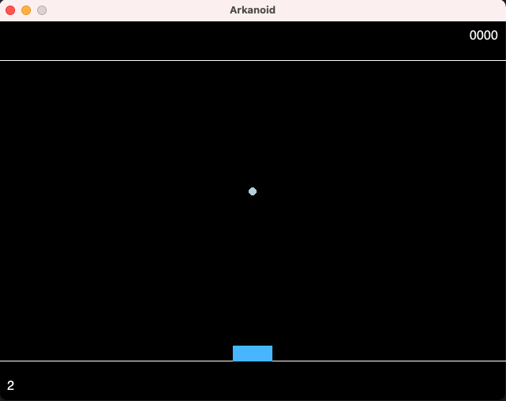

> [Algorithme, code et théorie]() / [algorithmie]() / [projet : programmation événementielle]()
>
> prérequis :
>
>* [projet : héritage]()
>
{: .chemin}

## mise en place

Nous utiliserons la bibliothèque [pyglet](http://pyglet.org/) pour ce projet. Commencez par l'installer :

```shell
python -m pip install pyglet
```

### structures

> 1. créez un dossier nommé *"arkanoid"* où vous placerez vos fichiers
> 2. créez un projet vcode dans ce dossier
>
{: .a-faire}

### vérifications

>
> * on vérifie que python est ok avec le terminal et avec vscode
> * on vérifie que le linter est actif dans vscode
>* on vérifie que les tests fonctionnent (en créant un test bidon dans *"tests_tris"* et en vérifiant que `pytest` et vscode le trouvent)
>
{: .a-faire}

## programmation événementielle

La [programmation événementielle](https://fr.wikipedia.org/wiki/Programmation_%C3%A9v%C3%A9nementielle) est un paradigme de programmation très utiliser dans les interfaces graphiques. Cette méthode consiste à réagir à des événements issus du programme comme de cliquer sur un bouton, appuyer sur une touche, etc.

Le principe est le suivant :

1. on inscrit une fonction $f$ à un type d'événement $e$
2. lorsque l'événement $e$ arrive, la fonction $f(e)$  est exécutée

Dans ce projet, les événements que nous aurons à manipuler seront les appuies sur les touches du clavier, le dessin de notre interface, la taille des fenêtres, etc, etc.

Cette méthode de programmation est basée sur le patron de conception [observateur](https://refactoring.guru/fr/design-patterns/observer).

## introduction à pyglet

[pyglet](http://pyglet.org/) est une bibliothèque permettant de créer des interfaces. Nous ne rentrerons pas dans tous les détails de son implémentation (utilisation d'[opengl](https://fr.wikipedia.org/wiki/OpenGL), la gesion du son, etc) mais nous utiliserons assez de ses fonctionnalits pour que vous puissiez aller plus loin de votre côté.

La [documentation de pyglet](https://pyglet.readthedocs.io/en/latest/) est très bien faite et fourmille d'[exemples](https://github.com/pyglet/pyglet/tree/master/examples).

Nous allons placer les différents essais de pyglet dans un sous-dossier de notre projet. Créer un dossier *"essais-pyglet"* dans votre projet *"arkanoid"*.

### hello world

Il y a plusieurs moyen me mettre en place une fenêtre pyglet. Nous allons utiliser la méthode la plus proche de la programmation objet (voir [subclassing window](https://pyglet.readthedocs.io/en/latest/programming_guide/windowing.html#subclassing-window)).

#### une fenêtre

Fichier : *"arkanoid/essais-pyglet/fenetre.py"* :

```python
import pyglet


class HelloWorldWindow(pyglet.window.Window):
    def __init__(self):
        super().__init__(400, 200, "texte")

        self.label = pyglet.text.Label("Hello, world!")

    def on_draw(self):
        self.clear()
        self.label.draw()


window = HelloWorldWindow()
print(window.get_size())

pyglet.app.run()
print("c'est fini !")

```

> Exécutez le programme précédent.
{: .a-faire}

Vous devriez voir apparaitre une fenêtre avec écrit "Hello, world!" en blanc sur fond noir en bas à gauche de la fenêtre. Vous devriez aussi voir dans le terminal le texte : `(400, 200)` qui est la taille de la fenêtre.
En revanche, le texte `c'est fini !` ne devrait apparaître dans le terminal que lorsque la fenêtre se ferme.

> Comprenez :
>
> * comment fonctionne le programme
> * l'héritage de la classe `Window` de pyglet
> * la fonction de la ligne `pyglet.app.run()`
>
{: .a-faire}

#### une fenêtre redimensionnable

La méthode `on_draw` est une méthode spéciale. A chaque fois que l'événement `draw` est activé, cette méthode est exécutée. Pour le voir concrètement, modifiez le code précédent avec :

```python
import pyglet


class HelloWorldWindow(pyglet.window.Window):
    def __init__(self):
        super().__init__(400, 200, "texte", resizable=True)

        self.label = pyglet.text.Label("Hello, world!")

    def on_draw(self):
        print("draw:", self.get_size())
        self.clear()
        self.label.draw()


window = HelloWorldWindow()
print(window.get_size())

pyglet.app.run()
print("c'est fini !")

```

> Comprenez :
>
> * l'ajout d'un paramètre lors de l'appel au construction de `Window` qui rend la fenêtre redimensionnable
> * l'ajout d'un `print` dans la méthode `on_draw`
> * lorsque l'on change la taille de la fenêtre, la méthode `on_draw` est exécutée
>
{: .a-faire}

#### texte au milieu de la fenêtre

Un [label](https://pyglet.readthedocs.io/en/latest/modules/text/index.html#pyglet.text.Label) est un objet non modifiable qui peut-être affiché (dans la méthode `on_draw`.)

Remplacez sa création dans le fichier *"arkanoid/essais-pyglet/fenetre.py"* par :

```python
        self.label = pyglet.text.Label(
            "Hello, world!",
            x=self.width // 2,
            y=self.height // 2,
            anchor_x="center",
            anchor_y="center",
        )

```

En exécutant le code, le texte est placé au milieu de l'écran ! En revanche, lorsque vous modifiez la taille de la fenêtre, la position ne change pas.

>
> * déduire l'origine de la fenêtre en utilisant le redimensionnement de la fenêtre.
> * utiliser l’événement `on_resize(width, height)` pour replacer le label à la bonne position après chaque redimensionnement en modifiant ses attributs `x` et `y`.
>
> Attention, `on_resize` est utilisée par `Window`, n’oubliez pas de l’appeler avec un `super`.
>
{: .a-faire}

l'origine est en bas à gauche de la fenêtre.

```python
class HelloWorldWindow(pyglet.window.Window):
    #...

    def on_resize(self, width, height):
        super().on_resize(width, height)
        self.label.x = width // 2
        self.label.y = height // 2

    # ...

```



### gestion du clavier

La [gestion du clavier sous pyglet](https://pyglet.readthedocs.io/en/latest/programming_guide/keyboard.html) se fait avec deux événements :

* `on_key_press(symbol, modifiers)` qui s'active lorsque qu'une touche est appuyée
* `on_key_release(symbol, modifiers)` qui s'active lorsque qu'une touche est relâchée

Le paramètre `symbol` est un entier qui correspond au code de la touche et `modifiers` gère les touches comme *shift*, *control* ou encore *alt*.

Ajoutons une gestion basique du clavier dans le programme :

```python
class HelloWorldWindow(pyglet.window.Window):
    #...

    def on_key_press(self, symbol, modifiers):
        print("press:", symbol, modifiers)

    def on_key_release(self, symbol, modifiers):
        print("release:", symbol, modifiers)

    # ...

```

Nous n'avons pas utilisé de `super` pour appeler la méthode de la classe mère, car `Window` ne gère pas le clavier par défaut.

> Exécutez le code précédent et remarquez :
>
> * que chaque touche a bien un code, ainsi que les touche de modification
> * shift gauche et shift droit sont discernables
> * qu'après chaque touche appuyée ou relâchée l'évènement `on_draw` est lancé
> * que même si on laisse appuyé la touche longtemps, il n'y a qu'un seul événement `on_key_press` qui est lancé.
>
{: .a-faire}

#### flèches gauche et droite

Les code des différentes touches est disponible dans l'objet [pyglet.window.key](https://pyglet.readthedocs.io/en/latest/modules/window_key.html#module-pyglet.window.key). Chaque touche est une constante dont le nom correspond à la la touche et sa valeur au code. Par exemple, la constante `pyglet.window.key.SPACE` correspond au nombre 32.

> Vérifiez que lorsque vous appuyez sur la touche espace de votre clavier, c'est bien le symbole 32 qui et affiché
{: .a-faire}

Nous allons maintenant faire bouger d'un cran notre texte lorsque l'on appuie sur les touches "flèche gauche" et "flèche droite".

> En utilisant le fait que les deux attributs `x` et `y` contiennent la position du label : faite en sorte que lorsque l'on appuie sur une flèche du clavier (le nom des constantes de  `pyglet.window.key` correspondant aux flèches sont disponible [là](https://pyglet.readthedocs.io/en/latest/modules/window_key.html#cursor-control-and-motion)), le texte se déplace de 10pixel vers la direction de la flèche.
{: .a-faire}


```python
# ...

from pyglet.window import key

# ...

class HelloWorldWindow(pyglet.window.Window):
    # ...
    
    def on_key_press(self, symbol, modifiers):
        if symbol == key.UP:
            self.label.y += 10
        elif symbol == key.DOWN:
            self.label.y -= 10
        elif symbol == key.LEFT:
            self.label.x -= 10
        elif symbol == key.RIGHT:
            self.label.x += 10

    # ...

```



Avec cette technique, on ne peut se déplacer que d'un cran par appui sur la touche. Pour gérer les déplacements continus, il faut prendre en compte le temps d'appui sur la touche. C'est le boulot de la partie suivante.

### gestion du temps

[La gestion du temps](https://pyglet.readthedocs.io/en/latest/programming_guide/time.html) se fait également par un événement. Sa mise en place est cependant différente des événements que l'on a vu jusqu'à présent :

```python
class HelloWorldWindow(pyglet.window.Window):
    # ...

    def __init__(self):
        super().__init__(400, 200, "texte", resizable=True)

        self.label = pyglet.text.Label(
            "Hello, world!",
            x=self.width // 2,
            y=self.height // 2,
            anchor_x="center",
            anchor_y="center",
        )

        pyglet.clock.schedule_interval(self.update, 1)

    def update(self, dt):
        print(dt)


    # ...
```

Le code précédent fait en sorte que la méthode `update` soit exécutée toute les secondes. Le paramètre `dt` donne le nombre de secondes exactes depuis le dernier appel de la fonction. Cela permet de gérer le lag s'il existe (remarquez qu'il vaut toujours un peut plus que 1).

>
> Faites en sorte que le texte avance de 10 pixels toutes les 0.5s si une touche est appuyée.
>
> Pour cela on ne va pas modifier la position du label dans `on_key_press` mais dans update :
>
> * créez deux attributs `dx` et `dy` à notre objet `HelloWorldWindow`. Par défaut ces deux attributs vaudront 0
> * à chaque appelle de `update`, bougez la position du label de `self.dx` et `self.dy`
> * gérez les valeurs de `self.dx` et `self.dy` dans `on_key_press` et `on_key_release` (par exemple `self.dx = -10` lorsque l'on appuie sur la flèche gauche et `self.dx = 0` lorsque la flèche gauche est relâchée)
>
{: .a-faire}


```python
# ...

class HelloWorldWindow(pyglet.window.Window):
    def __init__(self):
        # ...

        self.dx = 0
        self.dy = 0

        # ...

    def update(self, dt):
        self.label.x += self.dx
        self.label.y += self.dy

    # ...

    def on_key_press(self, symbol, modifiers):
        if symbol == key.UP:
            self.dy = 10
        elif symbol == key.DOWN:
            self.dy = -10
        elif symbol == key.LEFT:
            self.dx = -10
        elif symbol == key.RIGHT:
            self.dx = +10

    def on_key_release(self, symbol, modifiers):
        if symbol == key.UP:
            self.dy = 0
        elif symbol == key.DOWN:
            self.dy = 0
        elif symbol == key.LEFT:
            self.dx = 0
        elif symbol == key.RIGHT:
            self.dx = 0
    
    # ...

# ...
```



Avec cette méthode le texte va continuer de se déplacer tant qu'une flèche reste appuyée. On peut même taper plusieurs flèches en même temps pour se déplacer en diagonale (cool, non ?).

Il reste un problème : le texte va sortir de la fenêtre si on reste appuyé trop longtemps. Corrigez ça :

>
> Ajoutez à votre code une sentinelle qui empêche les coordonnées `x` et `y` du label de sortir hors de la fenêtre.
>
> Les dimensions de la fenêtres sont données par ses attributs `width` et `height`.
>
{: .a-faire}


```python

class HelloWorldWindow(pyglet.window.Window):
    # ...

    def update(self, dt):
        self.label.x += self.dx
        if self.label.x < 0:
            self.label.x = 0
        elif self.label.x > self.width:
            self.label.x = self.width

        self.label.y += self.dy
        if self.label.y < 0:
            self.label.y = 0
        elif self.label.y > self.height:
            self.label.y = self.height
    
    # ...
```



### gestion de la souris

[Pour gérer la souris](https://pyglet.readthedocs.io/en/latest/programming_guide/mouse.html), comme vous pouvez vous en douter, il s'agit de s'abonner à des événements. Il en existe plusieurs. Commençons par voir ce que ça donne avec les événements `on_mouse_press(x, y, button, modifiers)` et `on_mouse_release(x, y, button, modifiers)` :

```python

class HelloWorldWindow(pyglet.window.Window):
    # ...

    def on_mouse_press(self, x, y, button, modifiers):
        print("press:", x, y, button)

        if (abs(self.label.x - x) <= self.label.content_width / 2) and (
            abs(self.label.y - y) <= self.label.content_height / 2
        ):
            print("clique dans le label")

    def on_mouse_release(self, x, y, button, modifiers):
        print("release:", x, y, button)

        if (abs(self.label.x - x) <= self.label.content_width / 2) and (
            abs(self.label.y - y) <= self.label.content_height / 2
        ):
            print("relâcher le bouton dans le label")
    
    # ...
```

Lorsque vous cliquez sur un bouton de la souris puis que vous le relâchez, vous devriez voir affiché à l'écran la position du curseur ainsi que le numéro du bouton de la souris qui a servi à cliquer.

Cerise sur le gâteau, lorsque vous cliquez ou relâchez le bouton de la souris sur le label, cela devrait vous l'indiquer.

>
> En utilisant l'événement `on_mouse_motion(self, x, y, dx, dy)` repérez quand la souris rentre et sort du label. N'hésitez pas à regarder [la documentation de l'événement](https://pyglet.readthedocs.io/en/latest/modules/window.html#pyglet.window.Window.on_mouse_motion) pour comprendre la définition de chaque paramètre.
>
{: .a-faire}


```python

class HelloWorldWindow(pyglet.window.Window):
    # ...

    def on_mouse_motion(self, x, y, dx, dy):
        if (abs(self.label.x - x) <= self.label.content_width / 2) and (
            abs(self.label.y - y) <= self.label.content_height / 2
        ):
            if (abs(self.label.x - (x - dx)) > self.label.content_width / 2) or (
                abs(self.label.y - (y - dy)) > self.label.content_height / 2
            ):
                print("entre dans label")
        else:
            if (abs(self.label.x - (x - dx)) <= self.label.content_width / 2) and (
                abs(self.label.y - (y - dy)) <= self.label.content_height / 2
            ):
                print("sort du label")
    
    # ...
```



### dessiner des formes

[La documentation](https://pyglet.readthedocs.io/en/latest/programming_guide/shapes.html) permet de voir que l'on peut facilement dessiner des cercle ou des rectangles en pyglet.

De façon générale, la gestion des graphique en `pyglet` se fait directement en opengl, ce qui dépasse de loin le cadre de ce cours (même si c'est chouette de parler directement à la carte graphique). Nous allons donc uniquement nous restreindre au dessin d'un cercle et d'un rectangle ce qui sera suffisant pour notre projet.

Fichier : *"arkanoid/essais-pyglet/forme.py"* :

```python
import pyglet
from pyglet import shapes
from pyglet.window import mouse


class Formes(pyglet.window.Window):
    def __init__(self):
        super().__init__(640, 480, "formes")

        self.rectangle = shapes.Rectangle(200, 200, 200, 200, color=(55, 55, 255))
        self.circle = shapes.Circle(0, 0, 50, color=(255, 0, 0))
        self.circle.opacity = 128

    def on_mouse_drag(self, x, y, dx, dy, buttons, modifiers):
        if buttons & mouse.LEFT and (
            (self.circle.x - x) ** 2 + (self.circle.y - y) ** 2
            <= self.circle.radius ** 2
        ):
            self.circle.x += dx
            self.circle.y += dy

    def on_draw(self):
        self.clear()

        self.rectangle.draw()
        self.circle.draw()


forme = Formes()

pyglet.app.run()
print("c'est fini !")
```

> Testez l'exemple ci-dessus et comprenez ce qu'il fait.
{: .a-faire}

Les couleurs sont décrites au [format RGB](https://fr.wikipedia.org/wiki/Rouge_vert_bleu) sous la forme de 3 entiers allant de 0 à 255 en base 10 :

* le premier décrit la composante rouge
* le second la composante verte
* le dernier la composante bleue

On a souvent coutume (dans le monde du web par exemple) de représenter ces 3 nombres par un nombre hexadécimal de 6 chiffres (2 par composante, chaque composante étant codée par un nombre allant de 00 à FF). Par exemple, le nombre `#F58318` correspond à la couleur ayant F5 en rouge, 83 en vert et 18 en bleu, les 3 nombres étant en codage hexadécimal. Ce qui en python donne avec un tuple de 3 coordonnées : `(0xF5, 0x83, 0x18)`, ou `(245, 131, 24)` en base 10 (un nombre écrit en hexadécimal en python commence par `0x`).

> Pour gérer et trouver des couleurs sympathiques, utilisez une roue des couleurs, comme [celle d'adobe](https://color.adobe.com/fr/create/color-wheel) par exemple.

## arkanoïd

Le but de ce projet est que vous créiez un jeu de type [Arkanoïd](https://fr.wikipedia.org/wiki/Arkanoid). De nombreuses parties d'arkanoïd existent sur youtube, comme par exemple :


Une partie du jeu est visible. Vous devriez avoir les connaissances nécessaire en pyglet pour vous en sortir.

Pour ne pas passer des heures à coder sans résultats, découpez votre programme en plusieurs parties, toutes réalisables en environ 1/2 heure.

Prenez le temps de modéliser proprement vos objets et classes pour que tout votre programme ne soit qu'une imbrication de classes qui interagissent les unes avec les autres.

Pour chaque classe il faudra bien sur ses tests qui permettent de certifier que les méthodes fonctionnent. Il faut faire en sorte que chaque méthode soit testable sans `pyglet`, juste en simulant une partie.

### entités du projet

A priori, les objets dont vous aurez besoin sont :

* la fenêtre qui gère les différents événements du projet.
* le vaisseau qui doit pouvoir bouger de gauche à droite sans dépasser les limites de la fenêtre
* la balle qui doit vérifier à chaque déplacement qu'elle ne touche pas le bord de la fenêtre, une brique ou le vaisseau
* les briques qui peuvent être détruites par la balle et lâcher un bonus en mourant
* les bonus qui tombent de l'écran et qui peuvent être récupéré par le vaisseau( s'il y a collision) ou disparaissent en bas de l'écran
* le score
* ... ?

> Lister les différentes classes et événements que vous devrez gérer pour mener à bien le projet. et essayer de construire un premier jet du modèle UML du projet. Ce modèle n'a pas besoin d'être précis, il doit servir de guide à votre découpage en tâche.
{: .a-faire}

### découpage du projet en tâche

Commencez par découper le projet en classes et déterminez leurs attributs et méthodes. Une fois ceci fait, décrivez votre 1ère tâche : quelle fonctionnalité du jeu est la plus simple à créer tout en ayant un jeu fonctionnel (même incomplet)

> chaque tâche doit correspondre à une fonctionnalité que vous ajoutez à votre jeu. Cette tâche doit :
>
> * être constituée de méthodes et ou attributs à ajouter à une ou plusieurs classes
> * aux tests de ces méthodes
> * à l'ajoute de cette fonctionnalité au programme
>
{: .note}

Pour que votre première tâche ne soit pas *"faire un jeu arkanoïd"* on ajoute les contraintes :

> La fonctionnalité doit pouvoir être ajoutée en 1/2 heure.
{: .note}

Enfin :

> On vous demande de garder dans un fichier markdown les différentes taches que vous avez effectuées avec votre projet.
{: .a-faire}

Si vous suivez ce principe, toutes les 1/2 heure votre jeu sera plus complet. **Ne passez pas 1 heure à coder quelque chose sans l'utiliser !**

### déroulé

Conservez en plus de votre projet un fichier markdown dans le quel vous décrirez chaque tâche que vous voulez implémenter, ainsi que l'heure de début et l'heure de fin de la tâche. Si vous voyez que votre tâche prend trop de temps à être créer, scindez votre tâche en tâches plus petites. Au bout de quelques tâches vous devriez être rodé.

> Au début de chaque étape :
>
> 1. demandez l'aval de votre encadrant avant de commencer l'implémentation de la tâche
> 2. conservez dans le fichier markdown de votre projet la fonctionnalité que vous allez ajouter
>
{: .a-faire}

N'oubliez pas :

> Les tests et l'utilisation de tâches ne font pas perdre de temps à votre projet, il en font **gagner**.
{: .attention}

## exemple de déroulé

Pour débuter le projet, si vous n'avez pas d'idée de déroulé, vous pouvez suivre celui-ci. Il vous mènera jusqu'au début de l'implémentation des briques.

Ici nous créerons une classe `Fenetre` qui contiendra notre interface. On ne testera pas l'interface (donc la classe `Fenetre`), mais tout le reste devra être testé.

### tâche 1

Création d'une fenêtre de 640x480 non redimensionnable avec :

* un label du nombre de vie (2 par défaut), en bas à gauche
* un label avec le score (0 par défaut), en haut à droite


Vous créerez une classe `Fenetre` héritant de `pyglet.window.Window` contenant les différents contenus. Votre programme principal consistera à créer un objet de la classe `Fenetre` et d'exécuter pyglet avec la commande : `pyglet.app.run()`.

### tâche 2

* ajout du sol : une [ligne pyglet](https://pyglet.readthedocs.io/en/latest/modules/shapes.html#pyglet.shapes.Line) à hauteur $50$
* ajout du plafond : une [ligne pyglet](https://pyglet.readthedocs.io/en/latest/modules/shapes.html#pyglet.shapes.Line) à hauteur $480-50$
* ajout du vaisseau :
  * doit être placé sur le sol
  * un rectangle (de hauteur 20 et de longueur 50) de couleur #47B6FF


### tâche 3

Faire déplacer le vaisseau de gauche à droite sans cogner les bords.

Comme la gestion des déplacement doit être interne au vaisseau, il faut qu'il puisse avoir sa classe à lui. On va donc réaliser cette tâche en 2 temps.

#### tache 3.1

Création de la classe :

* classe : `Vaisseau` (dans le fichier *"vaisseau.py"*)
* attributs :
  * `forme` un [rectangle pyglet](https://pyglet.readthedocs.io/en/latest/modules/shapes.html#pyglet.shapes.Rectangle) de longueur 50, de hauteur 20, initialement placé au centre de la fenêtre
* méthode :
  * `__init__(sol, largeur_fenetre)` : position du sol et largeur de la fenêtre de jeu
  * `draw()`

Les tests du vaisseau seront fait dans le fichier *"arkanoid/test_vaisseau.py"*. Pour commencer les tests de cette classe, vous pourrez vérifier que le vaisseau est bien initialement placé au centre de la fenêtre en comparant :

* la valeur de `vaisseau.forme.x` à sa valeur théorique selon la taille de l'écran.
* la valeur de `vaisseau.forme.y` à la hauteur du sol

#### tâche 3.2

Ajout des méthodes et des attributs permettant de déplacer le vaisseau.

Il nous faut côté `Fenetre` :

1. modifier la classe fenêtre pour qu'elle prenne en compte les touches "flèche gauche" et "flèche droite"
2. que l'on change la position du vaisseau à au plus 60 fps (tous les 1/60 secondes)

On doit gérer les mouvement côté `Vaisseau` en ajoutant :

* un attribut `vitesse` qui donne le déplacement en pixel par seconde (500 pixel/s)
* une méthode `bouge(dt, direction)` qui déplace le curseur selon :
  * la direction (-1 à gauche, 0 on ne bouge pas et +1 à droite)
  * par défaut le déplacement sera de sa vitesse fois `dt` sauf si cela le fait dépasser l'écran à gauche ou à droite et dans ce cas là le vaisseau est collé au bord

Pour tester la méthode `bouge` vous pourrez faire 4 tests :

* `test_bouge_droite()` : qui vérifie que la position change bien lorsque l'on  veut se déplacer à droite
* `test_bouge_gauche()` : qui vérifie que la position change bien lorsque l'on  veut se déplacer à gauche
* `test_bouge_negatif()` : qui vérifie que l'on se cogne bien au bord gauche de l'écran
* `test_bouge_depasse_taille()` : qui vérifie que l'on se cogne bien au bord droit de l'écran

Pour faire passer ces tests, vous pourrez modifier à la main les différents paramètres comme la vitesse (`vaisseau.vitesse`) ou la position du vaisseau (`vaisseau.forme.x`) pour que votre test soit facile à écrire.

> Félicitations, votre programme doit pouvoir faire bouger le vaisseau ! Vérifiez le.

### tâche 4

Création et gestion de la bille :

* La bille apparaît au milieu de l'écran avec une vitesse initiale.
* si elle passe sous le sol, on perd une vie
* à 0 vie, elle réapparait avec une vitesse nulle
* elle rebondit (selon la normale de la surface) sur :
  * 3 bords de l'écran sur 4
  * sur le vaisseau

Pour réaliser tout ça on va travailler par morceaux.

#### tache 4.1

Création d'une bille et de ses bornes de jeu. Pour cela, il nous faut commencer à créer une classe bille avec un cercle comme dessin.

Création de la classe :

* classe : `Bille` (dans le fichier *"bille.py"*)
* attributs :
  * `forme` un [cercle pyglet](https://pyglet.readthedocs.io/en/latest/modules/shapes.html#pyglet.shapes.Circle) de rayon 5, initialement placé au centre de la fenêtre
* méthode :
  * `__init__(hauteur_sol, hauteur_plafond, largeur_fenetre)` : position du sol, hauteur du plafond et largeur de la fenêtre de jeu pour déterminer les bornes de déplacement possible de la bille
  * `draw()`

Les tests de la bille seront fait dans le fichier *"arkanoid/test_bille.py"*. Testez que la position initiale de la bille est bien correcte.

Ajoutez la bille à l'interface :



#### tâche 4.2

Ajoutons une première version du déplacement de la bille :

* ajoutez un attribut `vitesse` qui est un vecteur à 2 dimension à la classe `Bille`
* ajoutez une méthode : `bouge(dt)` qui déplacera la bille selon son vecteur vitesse. Pour l'instant ne prenez pas en compte les contraintes des bords et du vaisseau

Les tests de la bille seront fait dans le fichier *"arkanoid/test_bille.py"*. Pour tester la méthode `bouge`, vous pourrez faire 1 test `test_bouge()` qui vérifie que pour `dt=2` et une vitesse `(2, 5)`, le déplacement de la bille est bien correct. N'hésitez pas à changer directement les attributs dans votre test.

Ajoutez la bille dans le jeu, avec une vitesse initiale de (0, -1)

#### tâche 4.3

Ajoutons le fait que si la bille sort de la fenêtre par le bas (sa position `y` est inférieure à la hauteur du sol),  elle réapparait au milieu de l'écran avec la même vitesse.

Testez cette fonctionnalité.

#### tâche 4.4

Faite maintenant rebondir la bille sur les murs. Cela peut se faire en changeant la direction d'une des coordonnées du vecteur vitesse (cette coordonnée change selon le mur) dans `update` si la bille devait dépasser le mur.

Testez ces fonctionnalités avec un test par mur en :

1. vous plaçant juste avant l'impact
2. effectuez une méthode `update`
3. vérifier que la vitesse de la  bille a bien changé et que sa position est bien à nouveau dans les bornes de la fenêtre.

### tâche 5

Le vaisseau doit se comporter comme un mur lorsque la bille le touche. Pour cela il faut gérer les collisions entre éléments du jeu.

Nous allons gérer ceci en plusieurs temps.

#### tâche 5.1

Ajoutez une méthode `collision(bille)` au Vaisseau. Cette méthode doit répondre `True` si la bille touche le vaisseau, et `False` sinon (il faut que le centre de la bille soit dans le rectangle du vaisseau augmenté du rayon de la bille).

Testez cette méthode.

#### tâche 5.2

Après la mise à jour des position dans la méthode `update`, testez s'il y a collision entre la bille et le vaisseau. Si oui, faite rebondir la bille.

### tache 6

Gestion de la vie et du score.

#### tâche 6.1

Lorsqu'il y a collision entre le vaisseau et la bille, le score augmente de 1.

#### tâche 6.2

Lorsque la la bille tombe dans le sol, on l'a faite réapparaitre au milieu de l'écran avec la même vitesse (tâche 4.3).

Pour gérer facilement la vie vous pouvez :

* faire réapparaitre la bille avec une position nulle
* après la mise à our des positions, si la vitesse de la bille est nulle c'est que l'on est mort. Décrémentez alors le nombre de vie. Si ce nombre reste positif, redonner de la vitesse à la bille.

### tâche 7

Une brique doit se comporter comme le vaisseau lorsque la bille la touche (elle rebondit), puis disparaître. Commençons par dessiner les briques

Création de la classe :

* classe : `Brique` (dans le fichier *"brique.py"*)
* attributs :
   `forme` un [rectangle pyglet](https://pyglet.readthedocs.io/en/latest/modules/shapes.html#pyglet.shapes.Rectangle) de longueur 40, de hauteur 20
* méthode :
  * `__init__(x, y)` : création de la brique à la position `(x, y)`
  * `draw()`

Dans `Fenetre` créez une liste `self.briques` et ajoutez y un mur de briques à notre interface. On pourra créer 5 rangées de 12 briques, par exemple.

### tâche 8

Pour finir, il reste à mettre en place la gestion des collisions entre a bille et les briques. Il n'y a presque rien à faire car tout va se passer comme pour le vaisseau.

Ajoutez une méthode `collision(bille)` à la classe `Brique`. Cette méthode doit répondre `True` si la bille touche la brique, et `False` sinon (il faut que le centre de la bille soit dans le rectangle du vaisseau augmenté du rayon de la bille, tout comme pour le vaisseau).

Après la mise à jour des positions dans la méthode `update`, testez s'il y a collision entre la bille et une brique. Si oui, augmentez le score de 5, faite rebondir la bille et supprimez cette brique de la liste des briques.

## fin de projet

Le code de ce projet est disponible [à cette adresse](https://github.com/FrancoisBrucker/cours_informatique/tree/master/docs/cours/algorithme-code-theorie/code/projets-code/arkanoid).