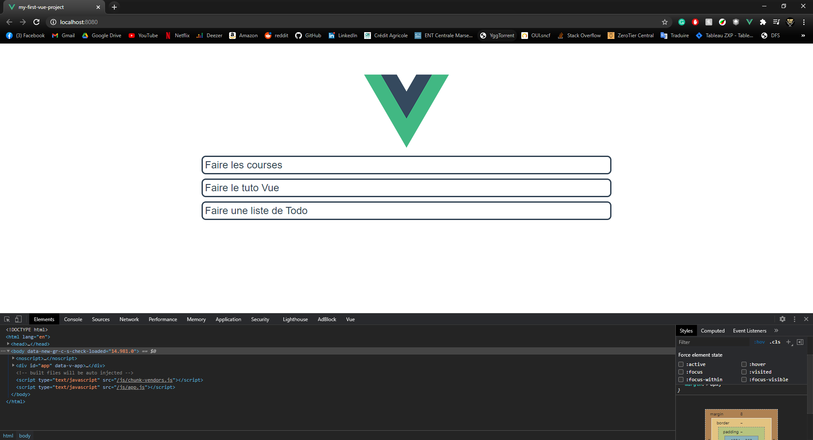

[//]: <> (TODO : Ajouter photo avec screen de l'appli finie)

Attention ce tutoriel est la suite de l'introduction à Vue 3.0 présente [ici](). Si vous êtes un débutant en Vue.js je vous conseille de passer d'abord par l'introduction.

Nous allons ici créer une application type 'TodoList' à partir d'un projet Vue.js généré avec le CLI.
Si vous comptez coder l'application en même temps que nous ici je vous conseille d'exécuter la commande `npm run serve` dans le dossier généré par le CLI pour voir l'évoution de l'app à mesure de sa création et pouvoir débuger facilement. Sinon vous pouvez accéder au repo GitHub du projet ici : [https://github.com/BaptisteMahe/vuejs-todolist](https://github.com/BaptisteMahe/vuejs-todolist) \
Si vous souhaitez utiliser le repo sachez qu'a chaque étape correspond sa branche avec le code qui va avec.

Tout d'abord il nous faut supprimer le composant `HelloWorld`. Pour cela on supprime le fichier `HelloWorld.vue` et on supprime toutes références à ce fichier and `App.vue`. \
On obtient donc un fichier `App.vue` qui doit ressembler à cela :

```vue
<template>
  
</template>

<script>
export default {
  name: "App",
};
</script>

<style>
#app {
  font-family: Avenir, Helvetica, Arial, sans-serif;
  -webkit-font-smoothing: antialiased;
  -moz-osx-font-smoothing: grayscale;
  text-align: center;
  color: #2c3e50;
  margin-top: 60px;
}
</style>
```

## 1. Affichage d'un Todo

Nous allons d'abord créer le composant `Todo.vue`. Tout d'abord il nous faut créer ce fichier dans `scr/components`.

Ensuite on va ensuite remplir ce composant comme suit :

```vue
<template>
  <div class="todo">
    {{ todo }}
  </div>
</template>

<script>
export default {
  name: "Todo",
  props: {
    todo: String,
  },
};
</script>

<style scoped>
</style>
```

Le **template** de ce composant est tout simple, il sert à afficher le contenu d'un todo. Ce contenu est un `String` qui lui a été passé par le composant parent d'où la définition d'une propriété `todo` dans le **script**.

Pour afficher ce composant il va nous falloir l'importer puis l'instancier dans le composant `App.vue` :

```vue
<template>
  
  <Todo todo="" />
</template>

<script>
import Todo from "./components/Todo.vue";

export default {
  name: "App",
  components: {
    Todo,
  },
};
</script>
```

Rien n'a changé pour l'instant sur notre browser mais si on essaie d'ajouer un string comme `"Faire les courses"` dans l'attribut `todo` de notre élément `<Todo />` and `App.vue`... Paf il s'affiche en dessus du logo ! \
Mais une todo liste avec un seul Todo c'est un peu triste... \
Ajoutons plusieurs balises `Todo` dans le template de notre `App` :

```vue
<template>
  
  <Todo todo="Faire les courses" />
  <Todo todo="Faire le tuto Vue" />
  <Todo todo="Faire une liste de Todo" />
</template>
```

Et on voit apparaitre nos todos sur l'application.

Pas soucis d'hestétique nous allons rajouter quelques **règles CSS** : \
Pour `App.vue`:

```vue
<style>
#app {
  font-family: Avenir, Helvetica, Arial, sans-serif;
  -webkit-font-smoothing: antialiased;
  -moz-osx-font-smoothing: grayscale;
  color: #2c3e50;
  margin: 60px 25% 0;
  display: flex;
  flex-direction: column;
  align-items: center;
  font-size: 1.5em;
}
</style>
```

Pour `Todo.vue`:

```vue
<style scoped>
.todo {
  padding: 5px;
  margin: 5px;
  width: 100%;
  border-radius: 10px;
  color: #2c3e50;
  border-style: solid;
}

.todo:hover {
  background-color: rgb(44, 62, 80, 0.1);
}
</style>
```



## 2. Creation d'une liste de Todos

C'est bien beau de pouvoir afficher plusieurs Todo dans notre `App` mais il serait plus simple d'avoir un **array** de todos que l'on afficherai à l'aide de plusieurs composants `Todo`.

Il nous faut d'abord déclarer les todos en tant que `data` du composant `App.vue`. Pour cela nous allons ajouter une methode `data()` qui va retourner notre **array** dans la déclaration du composant `App` :

```vue
<script>
import Todo from "./components/Todo.vue";

export default {
  name: "App",
  components: {
    Todo,
  },
  data() {
    return {
      todos: [
        "Faire les courses",
        "Faire le tuto Vue",
        "Faire une liste de Todo",
      ],
    };
  },
};
</script>
```

Maintenant nous allons utiliser une **directive** de vue pour *itérer* à travers cet array directement dans le **template**. \
Cette **directive** s'appelle `v-for` et permet de *simuler* une boucle `for` en *html* :

```vue
<template>
  
  <Todo v-for="todo in todos" :key="todo" v-bind:todo="todo" />
</template>
```

Voilà une belle ligne de html où on comprend plus rien... \
Nous allons décortiquer ce code pour comprendre à quoi servent les différents éléments :

- `v-for="todo in todos"` c'est la directive vue qui nous permet de créer cette boucle for dans le html (on reconnait la syntaxe `for element in list`). Cela instancie une nouvelle variable locale `todo` et pour chaque todo cette directive va créer un nouvel élément `Todo`.
- `:key="todo"` cela permet de dire à vue que `todo` est la variable de l'itération (elle va de paire avec `v-for`).
- `v-bind:todo="todo"` cela remplace `todo="un string affiché dans le todo"`. Cette syntaxe permet de dire à vue que l'on souhaite passer le contenu de la variable `todo` (celle en guillemets) dans la propriété `todo` (spécifiée aprés le `v-bin:`) du composant `App.vue`.

Pour résumé cette ligne créer autant d'élément `Todo` (le composant `Todo.vue`) qu'il n'y a de `todo` dans `todos` (l'array de strings instancié dans les `data()` de App) et **bind** le string `todo` à la propriété `todo` pour chaque `Todo` instancié. (ça fait beaucoup de todo...)

Une fois ces modifications appliquée on peut voir que rien n'a changé dans notre site compilé. Et c'est normal, on a simplement changer la manière dont sont récupéré les `todo`.

Nous allons maintenat transporter toute cette logique dans un nouveau composant : `TodoList.vue` :  

`TodoList.vue` (dans le dossier **components**):

```vue
<template>
  <div class="todo-list">
    <Todo v-for="todo in todos" :key="todo" v-bind:todo="todo" />
  </div>
</template>

<script>
import Todo from "./Todo.vue";

export default {
  name: "TodoList",
  components: {
    Todo,
  },
  data() {
    return {
      todos: [
        "Faire les courses",
        "Faire le tuto Vue",
        "Faire une liste de Todo",
      ],
    };
  },
};
</script>

<style scoped>
.todo-list {
  width: 100%;
}
</style>
```

`App.vue` :

```vue
<template>
  
  <TodoList />
</template>

<script>
import TodoList from "./components/TodoList.vue";

export default {
  name: "App",
  components: {
    TodoList,
  },
};
</script>
```

Pourquoi ce changement ? Me diriez vous. C'est l'esprit de frameworks tels que Vue Angular ou React, componentariser un maximum pour avoir un code flexible et scalable.

## 3. Un composant pour ajouter des Todos

Nous allons tout d'abord créer un nouveau fichier `AddTodo.vue` (toujours dans le dossier **components**) qui contiendra notre composant permettant d'ajouer des todos :

```vue
<template>
  <div>hello</div>
</template>

<script>
export default {
  name: "AddTodo",
};
</script>

<style scoped>
</style>
```

On peut maintenant l'importer et l'utiliser dans `App.vue` :

```vue
<template>
  
  <AddTodo />
  <TodoList />
</template>

<script>
import AddTodo from "./components/AddTodo.vue";
import TodoList from "./components/TodoList.vue";

export default {
  name: "App",
  components: {
    AddTodo,
    TodoList,
  },
};
</script>
```

Superbe, on a maintenant un petit **hello** afficher au dessus de notre liste de `Todos`...

Plus qu'à ajouter un `input`, et envoyer la valeur de cette `input` dans notre liste de `Todos`. \
