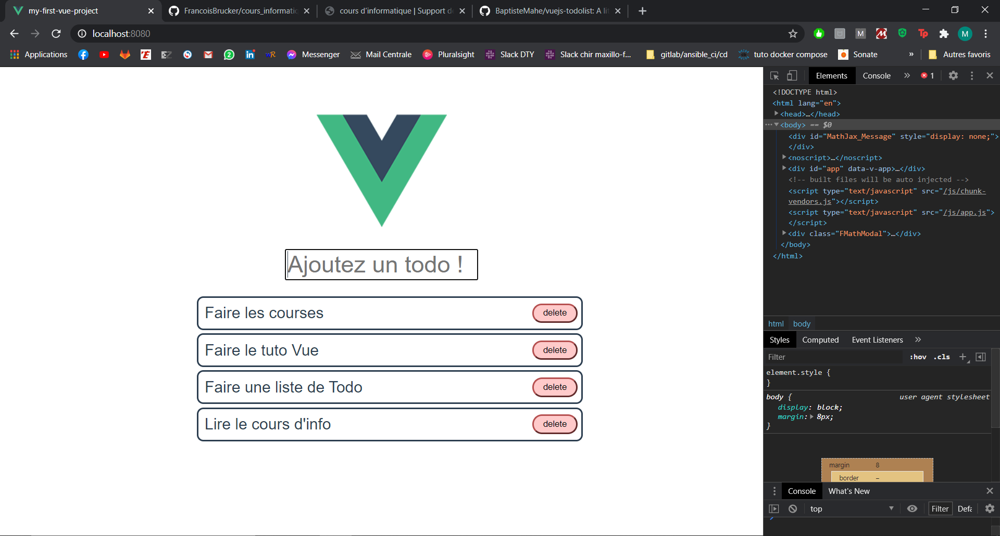
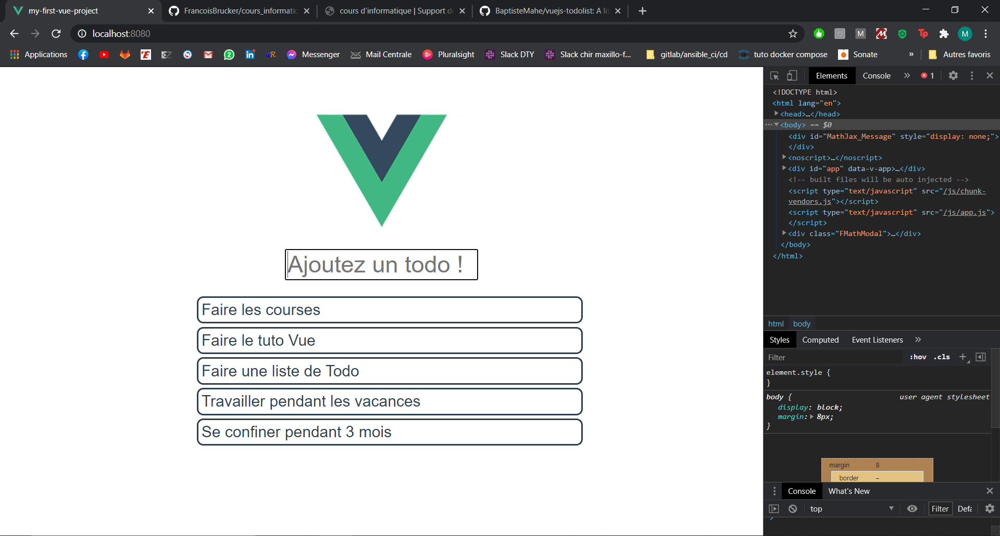

Attention ce tutoriel est la suite de l'introduction à Vue 3.0 présente [ici](). Si vous êtes un débutant en Vue.js je vous conseille de passer d'abord par l'introduction.

Nous allons ici créer une application type 'TodoList' à partir d'un projet Vue.js généré avec le CLI.
Si vous comptez coder l'application en même temps que nous ici je vous conseille d'exécuter la commande `npm run serve` dans le dossier généré par le CLI pour voir l'évoution de l'app à mesure de sa création et pouvoir débuger facilement. Sinon vous pouvez accéder au repo GitHub du projet ici : [https://github.com/BaptisteMahe/vuejs-todolist](https://github.com/BaptisteMahe/vuejs-todolist) \
Si vous souhaitez utiliser le repo sachez qu'a chaque étape correspond sa branche avec le code qui va avec.

Tout d'abord il nous faut supprimer le composant `HelloWorld`. Pour cela on supprime le fichier `HelloWorld.vue` et on supprime toutes références à ce fichier and `App.vue`. \
On obtient donc un fichier `App.vue` qui doit ressembler à cela :

```vue
<template>
  
</template>

<script>
export default {
  name: "App",
};
</script>

<style>
#app {
  font-family: Avenir, Helvetica, Arial, sans-serif;
  -webkit-font-smoothing: antialiased;
  -moz-osx-font-smoothing: grayscale;
  text-align: center;
  color: #2c3e50;
  margin-top: 60px;
}
</style>
```

## 1. Affichage d'un Todo

Nous allons d'abord créer le composant `Todo.vue`. Tout d'abord il nous faut créer ce fichier dans `scr/components`.

Ensuite on va ensuite remplir ce composant comme suit :

```vue
<template>
  <div class="todo">
    {{ todo }}
  </div>
</template>

<script>
export default {
  name: "Todo",
  props: {
    todo: String,
  },
};
</script>

<style scoped>
</style>
```

Le **template** de ce composant est tout simple, il sert à afficher le contenu d'un todo. Ce contenu est un `String` qui lui a été passé par le composant parent d'où la définition d'une propriété `todo` dans le **script**.

Pour afficher ce composant il va nous falloir l'importer puis l'instancier dans le composant `App.vue` :

```vue
<template>
  
  <Todo todo="" />
</template>

<script>
import Todo from "./components/Todo.vue";

export default {
  name: "App",
  components: {
    Todo,
  },
};
</script>
```

Rien n'a changé pour l'instant sur notre browser mais si on essaie d'ajouer un string comme `"Faire les courses"` dans l'attribut `todo` de notre élément `<Todo />` and `App.vue`... Paf il s'affiche en dessus du logo ! \
Mais une todo liste avec un seul Todo c'est un peu triste... \
Ajoutons plusieurs balises `Todo` dans le template de notre `App` :

```vue
<template>
  
  <Todo todo="Faire les courses" />
  <Todo todo="Faire le tuto Vue" />
  <Todo todo="Faire une liste de Todo" />
</template>
```

Et on voit apparaitre nos todos sur l'application.

Pas soucis d'hestétique nous allons rajouter quelques **règles CSS** : \
Pour `App.vue`:

```vue
<style>
#app {
  font-family: Avenir, Helvetica, Arial, sans-serif;
  -webkit-font-smoothing: antialiased;
  -moz-osx-font-smoothing: grayscale;
  color: #2c3e50;
  margin: 60px 25% 0;
  display: flex;
  flex-direction: column;
  align-items: center;
  font-size: 1.5em;
}
</style>
```

Pour `Todo.vue`:

```vue
<style scoped>
.todo {
  padding: 5px;
  margin: 5px;
  width: 100%;
  border-radius: 10px;
  color: #2c3e50;
  border-style: solid;
}

.todo:hover {
  background-color: rgb(44, 62, 80, 0.1);
}
</style>
```


## 2. Creation d'une liste de Todos

C'est bien beau de pouvoir afficher plusieurs Todo dans notre `App` mais il serait plus simple d'avoir un **array** de todos que l'on afficherai à l'aide de plusieurs composants `Todo`.

Il nous faut d'abord déclarer les todos en tant que `data` du composant `App.vue`. Pour cela nous allons ajouter une methode `data()` qui va retourner notre **array** dans la déclaration du composant `App` :

```vue
<script>
import Todo from "./components/Todo.vue";

export default {
  name: "App",
  components: {
    Todo,
  },
  data() {
    return {
      todos: [
        "Faire les courses",
        "Faire le tuto Vue",
        "Faire une liste de Todo",
      ],
    };
  },
};
</script>
```

Maintenant nous allons utiliser une **directive** de vue pour *itérer* à travers cet array directement dans le **template**. \
Cette **directive** s'appelle `v-for` et permet de *simuler* une boucle `for` en *html* :

```vue
<template>
  
  <Todo v-for="todo in todos" :key="todo" v-bind:todo="todo" />
</template>
```

Voilà une belle ligne de html où on comprend plus rien... \
Nous allons décortiquer ce code pour comprendre à quoi servent les différents éléments :

- `v-for="todo in todos"` c'est la directive vue qui nous permet de créer cette boucle for dans le html (on reconnait la syntaxe `for element in list`). Cela instancie une nouvelle variable locale `todo` et pour chaque todo cette directive va créer un nouvel élément `Todo`.
- `:key="todo"` cela permet de dire à vue que `todo` est la variable de l'itération (elle va de paire avec `v-for`).
- `v-bind:todo="todo"` cela remplace `todo="un string affiché dans le todo"`. Cette syntaxe permet de dire à vue que l'on souhaite passer le contenu de la variable `todo` (celle en guillemets) dans la propriété `todo` (spécifiée aprés le `v-bin:`) du composant `App.vue`.

Pour résumé cette ligne créer autant d'élément `Todo` (le composant `Todo.vue`) qu'il n'y a de `todo` dans `todos` (l'array de strings instancié dans les `data()` de App) et **bind** le string `todo` à la propriété `todo` pour chaque `Todo` instancié. (ça fait beaucoup de todo...)

Une fois ces modifications appliquée on peut voir que rien n'a changé dans notre site compilé. Et c'est normal, on a simplement changer la manière dont sont récupéré les `todo`.

Nous allons maintenat transporter toute cette logique dans un nouveau composant : `TodoList.vue` :  

`TodoList.vue` (dans le dossier **components**):

```vue
<template>
  <div class="todo-list">
    <Todo v-for="todo in todos" :key="todo" v-bind:todo="todo" />
  </div>
</template>

<script>
import Todo from "./Todo.vue";

export default {
  name: "TodoList",
  components: {
    Todo,
  },
  data() {
    return {
      todos: [
        "Faire les courses",
        "Faire le tuto Vue",
        "Faire une liste de Todo",
      ],
    };
  },
};
</script>

<style scoped>
.todo-list {
  width: 100%;
}
</style>
```

`App.vue` :

```vue
<template>
  
  <TodoList />
</template>

<script>
import TodoList from "./components/TodoList.vue";

export default {
  name: "App",
  components: {
    TodoList,
  },
};
</script>
```

Pourquoi ce changement ? Me diriez vous. C'est l'esprit de frameworks tels que Vue Angular ou React, componentariser un maximum pour avoir un code flexible et scalable.

## 3. Un composant pour ajouter des Todos

Nous allons tout d'abord créer un nouveau fichier `AddTodo.vue` (toujours dans le dossier **components**) qui contiendra notre composant permettant d'ajouer des todos :

```vue
<template>
  <div>hello</div>
</template>

<script>
export default {
  name: "AddTodo",
};
</script>

<style scoped>
</style>
```

On peut maintenant l'importer et l'utiliser dans `App.vue` :

```vue
<template>
  
  <AddTodo />
  <TodoList />
</template>

<script>
import AddTodo from "./components/AddTodo.vue";
import TodoList from "./components/TodoList.vue";

export default {
  name: "App",
  components: {
    AddTodo,
    TodoList,
  },
};
</script>
```

Superbe, on a maintenant un petit **hello** afficher au dessus de notre liste de `Todos`...

Plus qu'à ajouter un `input`, et envoyer la valeur de cette `input` dans notre liste de `Todos`. \
Dans notre `AddTodo.vue` :

```vue
<template>
  <input class="todo-input" v-model="todo" placeholder="Ajoutez un todo !" />
</template>

<script>
export default {
  name: "AddTodo",
  data() {
    return {
      todo: "",
    };
  },
};
</script>
```

Comme on peut le voir au dessus, on va utiliser une autre directive spéciale de vue : `v-model`. \
Cette directive permet de binder le string contenu dans l'`input` (les données rentrées par l'utilisateur) diretement à une variable de notre composant, ici la variable `todo`. \
Et si l'on rajoute une ligne du style `<div> {{ todo }} </div>`  en dessous de l'`input` on peut voir que cette variable est updatée à chaque nouvel input de l'utilisateur !

Nous allons donc maintenant ajouter un event listener sur cette input pour executer une action quand l'utilisateur appui sur la touche entrée :

```vue
<template>
  <input
    class="todo-input"
    v-on:keyup.enter="onSubmit"
    v-model="todo"
    placeholder="Ajoutez un todo !"
  />
</template>

<script>
export default {
  name: "AddTodo",
  methods: {
    onSubmit: function () {
      console.log(this.todo);
    },
  },
  data() {
    return {
      todo: "",
    };
  },
};
</script>

<style scoped>
.todo-input {
  width: 50%;
  font-size: 1.5em;
  margin: 20px;
  color: #2c3e50;
}
</style>
```

On voit ici deux choses en même temps :

- `v-on:keyup.enter="onSubmit"` : Une nouvelle directive de vue `v-on`, c'est le raccourci pour créer un **event listener**. L'event que l'on recherche est précisé aprés les deux points, ici on a pris `keyup.enter` qui correspond à quand l'utilisateur relâche la touche entrée (après l'avoir enfoncée au préalable). Derrière le `=` se trouve la **référence de la méthode** que l'on souhaite appeler quand l'event est détecté.
- `methods: {onSubmit: function () {...}}` : Il s'agit de la déclaration d'une **méthode** pour le composant `AddTodo`. Ici ce sera cette fonction qui va être exécutée quand l'event est détecté. Notez que pour accéder aux données (contenu de `data()`) du composant dans une méthode il faut utiliser le préfixe `this`.

Pour l'instant `onSubmit` ne fait qu'afficher la valeur de l'input de l'utilsateur dans la console du navigateur, il va falloir réussir à faire passer le string au composant `TodoList`...


## 4. Passer le todo à TodoList

Maintenant que nous avons avons créé le composant permettant de demander l'input de l'utilisateur, il faut utiliser la donnée que l'utilisateur nous donne. Au même titre que nous avons utilisé un event listener pour repérer l'event `keyup.enter`, nous allons créer un event personnalisé et mettre en place un event listener pour celui-ci. L'event personnalisé est trigger dans le composant enfant, `addTodo.vue` ici. Il est écouté par le composant parent, `App.vue` ici.

Ceci est la deuxième méthode pour passer de l'information d'un composant à un autre. La prmeière était les props pour passer de la donnée depuis un composant parent à un composant enfant. Maintenant la deuxième est de passer de la donnée depuis le composant enfant vers le composant parent.

Mettons en place l'emission d'un event personnalisé dans `AddTodo.vue`:
```vue
<!-- AddTodo.vue -->
<template>
  <input
    class="todo-input"
    v-on:keyup.enter="onSubmit"
    v-model="todo"
    placeholder="Ajoutez un todo !"
  />
</template>

<script>
export default {
  name: "AddTodo",
  methods: {
    onSubmit: function () {
      // ------------------- Début changements --------------------
      if (!(this.todo === '')) {
        // Si une todo est non vide on émet un event 
        this.$emit('add-to-do', this.todo);
        // On peut spécifier de la donnée que l'on veut passer en même temps en 2ème argument
        this.todo = '';
        // On reset l'input à un string vide après avoir rajouté la todo à la liste
      } else {
        // S'il n'y a rien marqué on n'ajoute rien, sinon on va ajouter des cases vides
        console.log('There is no todo to add');
        
      }
      // -------------------- Fin changements ---------------------
    },
  },
  data() {
    return {
      todo: '',
    };
  },
};
</script>

<style scoped>
.todo-input {
  width: 50%;
  font-size: 1.5em;
  margin: 20px;
  color: #2c3e50;
}
</style>
```
Maintenant que nous émettons l'event, il est nécessaire de le capter et récupérer la donnée qui lui est associée.
`v-on:add-to-do="addToDo"` est ce qu'il faut préciser en attribu de la balise du composant `AddTodo`. `v-on` signifie qu'on écoute l'événement qui est spécifié juste après. `add-to-do` est le nom de l'événement qu'on a configuré dans `AddTodo`. Et enfin le `addToDo` est le nom de la méthode qui est trigger lorsque l'événement est capté.

```vue
<!-- App.vue -->
<template>
  
  <!-- Ajout de l'event listener dans le composant App.vue sur le composant AddTodo -->
  <AddTodo
    v-on:add-to-do="addToDo"
  />
  <!-- fin ajout -->
  <TodoList/>
</template>

<script>
import AddTodo from "./components/AddTodo.vue";
import TodoList from "./components/TodoList.vue";

export default {
  name: "App",
  components: {
    AddTodo,
    TodoList,
  },
  // Ajout option methods pour créer la fonction addToDo
  // Elle est trigger losque l'event add-to-do est repéré
  methods: {
    addToDo: function (todo) {
      // faire qqch de todo
    }
  }
  // Fin ajout
};
</script>
```

Mais pour l'instant on a encore rien fait de la string de la nouvelle todo, il faut l'afficher. Pour cela il faut l'ajouter à l'array todos du composant TodoList. Nous allons faire cela dans la méthode `addToDo`.
```vue
<template>
  
  <AddTodo
    v-on:add-to-do="addToDo"
  />
  <TodoList ref="todoListComp"/>
  <!-- On référence le composant pour pouvoir l'utiliser dans les méthodes -->
</template>

<script>
import AddTodo from "./components/AddTodo.vue";
import TodoList from "./components/TodoList.vue";

export default {
  name: "App",
  components: {
    AddTodo,
    TodoList,
  },
  methods: {
    addToDo: function (todo) {
      // On attrape le composant dans le DOM grâce à la référence
      // Avec ceci on peut accéder à l'array todos du comosant enfant
      // On peut donc le modifier en ajoutant le todo
      this.$refs.todoListComp.todos.push(todo);
    }
  }
};
</script>

<style>
#app {
  font-family: Avenir, Helvetica, Arial, sans-serif;
  -webkit-font-smoothing: antialiased;
  -moz-osx-font-smoothing: grayscale;
  color: #2c3e50;
  margin: 60px 25% 0;
  display: flex;
  flex-direction: column;
  align-items: center;
  font-size: 1.5em;
}
</style>

```

Avec ces dernières modifs le tour est joué et on peut ajouter des todo à notre liste.



## 5. Supprimer un todo

Finalement une todolist où on peut ajouter des éléments c'est cool parce qu'on doit souvent faire des nouveaux trucs. Mais une fois qu'on a fait une tâche c'est mieux si on peut la retirer de cette liste. Et voilà la dernière feature que nous allons créer ici.

Pour cela il faut trouver un moyen dans le composant todolist de repérer l'élément à retirer pour le supprimer de la list de todos. La manière de faire ceci est de s'aider de l'index de l'élément. Une fois qu'on a l'index dans le composant enfant Todo, on refait un event personnalisé pour prévenir le composant parent quand on désire supprimer tel élément.

`v-on:click="$emit('delete-todo', index)"` : avec ceci on émet l'événement. En l'associant à l'événement click d'un bouton on s'assure de lancer l'événement `'delete-todo'` lorsque l'on clique sur le bouton.

`emits: ["delete-todo"]` La version Vue 3.0 conseille de lister les event custom dans l'options `emits` maintenant que c'est possible.

```vue
<!-- Todo.vue -->
<template>
  <div class="todo">
    <p>{{ todo }}</p>
    <!-- On émet tout simplement un événement à l'aide d'un bouton et d'un click event sur celui-ci -->
    <!-- On notera que l'on peut simplifier l'écriture en implémentant directement l'émission dans l'attribut -->
    <!-- Et on passe l'index de l'élément que l'on désire supprimer -->
    <button v-on:click="$emit('delete-todo', index)">delete</button>
  </div>
</template>

<script>
export default {
  name: "Todo",
  props: {
    todo: String,
    // On se fait passer la props index qui donne l'index de l'élément dans l'array todos
    index: Number,
  }, 
  emits: ["delete-todo"]
};
</script>

<style scoped>
.todo {
  padding: 5px;
  margin: 5px;
  width: 100%;
  border-radius: 10px;
  color: #2c3e50;
  border-style: solid;
  display: flex;
  justify-content: space-between;
  align-items: center;
}

.todo:hover {
  background-color: rgb(44, 62, 80, 0.1);
}

button {
  width: 70px;
  height: 30px;
  border-radius: 15px;
  border-color: rgb(182, 80, 80);
  border-width: 3px;
  background-color: rgb(255, 202, 202);
}

p {
  margin: 5px;
}
</style>
```
La pochiane et dernière étape est de mettre en place l'event listener et l'associer à la fonction qui va supprimer l'élément de la liste.

`v-on:delete-todo="deleteThisTodo"` event listener qui trigger `deleteThisTodo` quand `delete-todo` est capté.

`v-bind:index="index"` passe index en props au composant enfant Todo.

```vue
<!-- TodoList.vue -->
<template>
  <div class="todo-list">
    <!-- On remarquera la syntaxe particulière ici dela boucle for -->
    <!-- On spécifie un deuxième argument qui nous permet de sortir l'index lié à un élément -->
    <!-- On le passe en props ce qui nous permet de l'utiliser dans l'event qu'on l'on envoie -->
    <!-- Enfin on spécifie un event listener ici pour trigger deleteThisTodo sur l'event delete-todo -->
    <Todo
      v-for="(todo, index) in todos"
      :key="todo"
      v-bind:todo="todo"
      v-bind:index="index"
      v-on:delete-todo="deleteThisTodo"
    />
  </div>
</template>

<script>
import Todo from "./Todo.vue";

export default {
  name: "TodoList",
  components: {
    Todo,
  },
  // On crée un méthode deleteThisTodo qui est appelé lorsque l'event delete-todo est capté
  // La méthode splice permet de retirer l'élément d'index todoIndex de la liste todos
  methods: {
    deleteThisTodo: function (todoIndex) {
      console.log(todoIndex);
      this.todos.splice(todoIndex, 1);
    }
  },
  data() {
    return {
      todos: [
        "Faire les courses",
        "Faire le tuto Vue",
        "Faire une liste de Todo",
      ],
    };
  }
};
</script>

<style scoped>
.todo-list {
  width: 100%;
}
</style>
```

Et voilà!!

