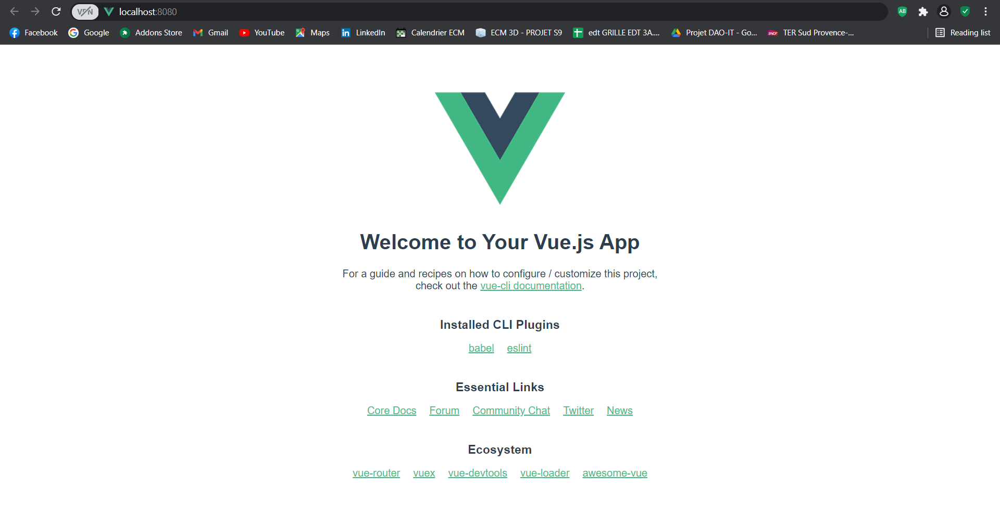
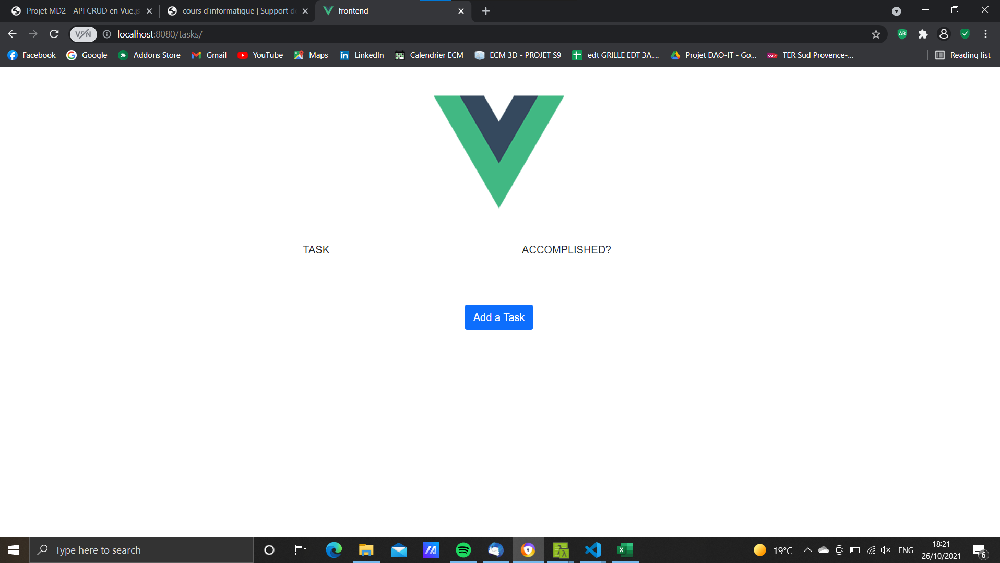

Voici un mini-projet permettant de voir une structure simpliste d'app full-stack en Vue.js + Django Rest Framework.

## Introduction

Le backend est géré par Django, un framework web en Python. 
Django est un outil puissant qui peut réaliser des apps à lui tout seul (Instagram est codé en Django) et peut nécessiter du temps pour en comprendre le fonctionnement. L'idée ici étant simplement de comprendre comment frontend & backend peuvent communiquer entre eux au travers d'API qu'on générera également dans ce tuto, nous ne nous servirons pas de Django dans son entiereté, mais d'un toolkit appelé Django Rest Framework qui permet de faire des petites apps sympathiques et ludiques, et qu'on utilisera pour créer une API CRUD (Create, Read, Update, Delete).
Cette API sera exploitée par notre partie frontend, gérée par Vue.js, une librairie JS très en vogue aujourd'hui.

## Technologies utilisées

### frontend

- [Vue 3](https://v3.vuejs.org/) 
- [Axios](https://axios-http.com/docs/intro)

### backend

- [Django Rest Framework](https://www.django-rest-framework.org/)
- [Python](https://www.python.org/)
- [SQLite3](https://docs.python.org/3/library/sqlite3.html)

## Pré-requis
 
### frontend
Il vous faudra avoir Vue installé sur votre machine. Il existe différentes manières (via [CDN](https://vuejs.org/v2/guide/installation.html#CDN), [npm](https://vuejs.org/v2/guide/installation.html#NPM), ou installer la CLI de Vue, [Vue-CLI](https://cli.vuejs.org/guide/installation.html)). Personnellement, j'utilise Vue-CLI.

### backend
Il vous faudra Django Rest Framework installé. Pour cela, il vous faudra Django. Et pour cela, il vous faudra Python.
- Pour Python, vous pouvez récupérer la dernière version [ici](https://www.python.org/).
- Python installé, on passe à Django. Ouvrez votre terminal et lancez la commande suivante : 
~~~shell
python -m pip install django
~~~
- Finalement, vous pouvez installer DRF, toujours dans le terminal :
~~~shell
pip install djangorestframework
~~~

## Lancement du projet

le projet consiste en une simple To-Do List. Les tâches seront enregistrées en base de données et affichées avec Vue par appels d'API.

Vous pouvez retrouver le repo du projet ici : [TODOLIST](https://github.com/simsimdrobs/api-vuejs-drf)

### backend

On commence par la partie backend.

Créez un dossier qui sera la racine de notre projet là où vous le voulez. On pourra l'appeler "api-vue-drf" pour être original. 
~~~shell
mkdir api-vue-drf
~~~
Rentrez dans le projet et créez un autre dossier dans lequel on mettra notre code backend :
~~~shell
cd api-vue-drf
mkdir backend
~~~
Rentrez dans le dossier "backend". On lance ensuite la commande suivante faisant appel à Django, pour initier notre backend. Comme notre projet est une To-Do List, on exécutera :
~~~shell
cd backend
django-admin startproject todolist
~~~
Et voilà ! Django a généré notre projet. Si vous exécutez un 'ls' dans le terminal vous devriez avoir :
~~~shell
ls
todolist    manage.py
~~~
Si vous entrez dans le dossier todolist, vous devriez trouver plusieurs fichiers .py. Deux vont nous intéresser : urls.py et settings.py.
Dans le fichier todolist/urls.py, nous allons légèrement modifier le contenu pré-écrit : 
~~~shell
from django.contrib import admin
from django.urls import path, include

urlpatterns = [
    path('admin/', admin.site.urls),
    path('api/', include('tasks.urls')),
]
~~~
Nous indiquons ici à Django que dès qu'une URL commençant par 'api/' sera appelée, les urls du fichier tasks/urls.py seront utilisées.

Mais où est donc ce fichier ?

Prenons un exemple pour illustrer ce qui va suivre. Vous voulez faire un blog. Dans un blog, il peut y avoir plusieurs composants essentiels à son existence, comme des articles, des utilisateurs, etc.

Dans notre projet todolist c'est pareil, il y aura des tâches, dont le modèle sera à définir. Avec Django, les composants à intégrer aux projets s'appellent les APPS. Nous allons donc créer une app 'tasks' et voir ce que cela donne avec la commande suivante :
~~~shell
backend/todolist
python manage.py startapp tasks
~~~
On voit apparaître dans notre code un nouveau dossier 'tasks'. Ce dossier servira à définir une tâche en base de données, et notre API.

Pour que notre app soit installée sur le projet Django, il faut l'intégrer dans la liste des apps installées. Et ce n'est pas automatique !

Pour cela, on va dans todolist/settings.py, à cet endroit : 
~~~shell
INSTALLED_APPS = [
    ...
    'tasks.apps.TasksConfig',
    'rest_framework',
]
~~~
Comme cela, notre app est installée ! On pourra au passage y ajouter l'app 'rest_framework' tant que l'on est là, car il faut également le préciser si l'on veut pouvoir développer notre API.

>NB : Pour des raisons de sécurité, et ce même sur notre propre machine, la communication entre applications nécessite certaines autorisations; notre backend doit pouvoir renvoyer des réponses quand notre frontend fera des requêtes. Pour cela, il faudra définir le [CORS](https://developer.mozilla.org/fr/docs/Web/HTTP/CORS) pour que l'accès aux ressources soit sans problèmes.

Nous allons installer les cors-headers de Django :
~~~shell
// backend/todolist

python -m pip install django-cors-headers
~~~

Et dans todolist/settings.py, ajoutez-les dans les apps installées. Il vous faudra aussi l'ajouter dans les middlewares pour écouter les réponses :  
~~~shell
INSTALLED_APPS = [
    ...,
    "corsheaders",
    ...,
]
~~~

~~~shell
MIDDLEWARE = [
    ...,
    "corsheaders.middleware.CorsMiddleware",
    "django.middleware.common.CommonMiddleware",
    ...,
]
~~~
Enfin, il faudra indiquer la liste des origines aui sont autorisées à lancer des requêtes HTTP croisées d'un site à l'autre. Ici, on autorisera seulement l'origine de notre serveur local frontend, qui sera sur le port 8000 :
~~~shell
CORS_ALLOWED_ORIGINS = [
    "http://localhost:8080",
]
~~~
Et voilà, tout devrait bien pouvoir communiquer quand les APIs seront utilisées.

On rappelle que dans todolist/urls.py, on renvoie toutes les URLs commençcant par 'api/' vers tasks/urls.py, or ce fichier n'est pas présent dans le dossier 'tasks'. Il faut le rajouter manuellement. On le complètera plus tard.

On passe maintenant à la partie Modèle. Elle sert à établir comment nous définissons une tâche (son contenu, si elle a été faite ou pas, etc.) dans le backend. De ces modèles, on crée nos profils de base de données, et on effectue des migrations en cas de changement.

Sans rentrer dans le détail, voici le modèle d'une tâche Task. Je vous invite à vous référer à la [doc](https://docs.djangoproject.com/en/3.2/topics/db/models/) de Django pour comprendre les modèles. 
~~~shell
tasks/models.py
from django.db import models

# Create your models here.
class Task(models.Model):
    TASK_DONE = [
        ('done', 'DONE'),
        ('not done', 'NOT DONE')
    ]
    content = models.CharField(max_length=200)
    completion = models.CharField(max_length=200, choices=TASK_DONE)
~~~
Nous avons défini le modèle d'une Task. Il reste maintenant à faire une migration en base de données, c'est à dire dire à cette dernière les modifications (nouveaux modèles, nouveaux champs, suppression de champs, etc.). 

Pour cela, taper les commandes suivantes :
~~~shell
python manage.py makemigrations
puis
python manage.py migrate
~~~
Vous devriez avoir du contenu dans le dossier 'migrations' de 'tasks'. La mise à jour de la bdd a bien été faite (on notera d'ailleurs qu'une bdd sqlite3 a été générée par défaut).

Pour notre API, nous allons avoir besoin d'un outil très important : le Serializer. Il va gérer lui-même le formattage des données récupérées en bdd pour que nous puissions faire le traitement de ces dernières dans un format plus adapté, comme JSON par exemple. Plus d'info [ici](https://hazelcast.com/glossary/serialization/).

On crée un fichier serializers.py dans 'tasks'; voici le code à mettre :
~~~shell
from django.db import models
from rest_framework import serializers
from .models import Task

class TaskSerializer(serializers.ModelSerializer):
    class Meta:
        model = Task
        fields = '__all__'
~~~
Plusieurs choses notables : on trouve une petite ressemblance avec la manière de définir notre modèle Task; Django met à disposition des classes Model et ModelSerializer qui gèrent elles-mêmes la construction d'un modèle ou d'un serializer. Ensuite, on voit que notre modèle Task est importé et utilisé par notre classe TaskSerializer : Un serializer se construit sur le modèle dont il va gérer les données.

NB : on remarque aussi l'importation du module Rest Framework.

Deux choses nous restent à faire pour le backend : écrire les fonctions de notre API CRUD qui vont manipuler les données de notre modèle Task, et faire en sorte qu'elles soient appelées lorsqu'on arrive sur une certaine URL.

Ses fonctions vont être définies dans le fichier tasks/views.py.

Voici le fichier. Pour comprendre la création d'API CRUD avec Django et DRF, allez voir [ici](https://www.bezkoder.com/django-crud-mysql-rest-framework/).
~~~shell
from rest_framework.decorators import api_view
from rest_framework.response import Response
from rest_framework import status

from .serializers import TaskSerializer

from .models import Task

# Create your views here.

#api views create a interface permitting manipulation of data through CRUD methods, and depending on the request method

@api_view(['GET', 'POST'])
def task_list(request):
    #GET request
    if request.method == 'GET':
        tasks = Task.objects.all()
        tasks_serializer = TaskSerializer(tasks, many=True)
        return Response(tasks_serializer.data)

    #POST request
    elif request.method == 'POST':
        task_serializer = TaskSerializer(data=request.data)
        if task_serializer.is_valid():
            task_serializer.save()
        return Response(task_serializer.data)

@api_view(['GET', 'PUT', 'DELETE'])
def task_detail(request, pk):
    #We check if the Task we are looking for actually exists
    try:
        task = Task.objects.get(pk=pk)
    except Task.DoesNotExist:
        return Response({'message': 'tuto does not exist'}, status=status.HTTP_404_NOT_FOUND)

    #GET request
    if request.method == 'GET':
        task_serializer = TaskSerializer(task)
        return Response(task_serializer.data)

    #PUT request
    elif request.method == 'PUT':
        task_serializer = TaskSerializer(instance=task, data=request.data)
        if task_serializer.is_valid():
            task_serializer.save()
        return Response(task_serializer.data)

    #DELETE request
    elif request.method == 'DELETE':
        task.delete()
        return Response({'message': 'tuto successfully deleted'}, status=status.HTTP_200_OK)
~~~
Maintenant, reste à définir les URLs pour lesquelles seront appelées nos fonctions.
~~~shell
from django.urls import path
from . import views

urlpatterns = [
    path('tasks/', views.task_list),
    path('tasks/<str:pk>/', views.task_detail),
]
~~~
Selon la méthode de la requête envoyée à l'URL, la fonction associée saura quoi faire.

Maintenant, essayons de lancer un serveur local avec la commande :
~~~shell
python manage.py runserver
~~~
Et tapez cette URL : [http://127.0.0.1:8000/api/tasks/](http://127.0.0.1:8000/api/tasks/), vous devriez avoir une vue de votre API (sans aucune tâche ajoutée) !

 Vous pouvez en ajouter une avec le champ du dessous; écrivez en JSON comme ceci et cliquez sur POST : 
~~~shell
{
    "content": "finir le projet MD2",
    "completion": "not done"
} 
~~~
Vous devriez avoir votre première tâche dans la liste ! Bravo ! 

Si vous ajoutez à la fin de l'URL le numéro d'ID de votre tâche (.../api/tasks/${ID de la tâche}), vous devriez avoir le détail de celle-ci et la possibilité de la modifier ou la supprimer.

Voilà, nous venons de créer une très simple API CRUD avec Django et Django Rest Framework ! 

Maintenant, si vous avez un joli site, vous voulez avoir accès à ces données depuis le frontend pour pouvoir l'inclure proprement dans le design de celui-ci. Passons donc à la deuxième partie.

### frontend

Nous passons désormais au frontend, avec Vue.js. Il existe plusieurs manières de l'installer, je vous conseille de le faire avec la CLI [Vue-CLI](https://cli.vuejs.org/guide/installation.html). Dans ce tuto nous ferons avec cela.

Remettez-vous à la racine du projet, dans le dossier "api-vue-drf", et lancez la commande suivante :
~~~shell
vue create frontend
~~~
Vous aurez le choix entre une configuration par défaut ou manuelle. Choisissez la manuelle pour installer directement [Vue-router](https://router.vuejs.org/guide/#html), qui nous sera utile par la suite.
~~~shell
? Please pick a preset: Manually select features
? Check the features needed for your project: Choose Vue version, Babel, Router
? Choose a version of Vue.js that you want to start the project with 3.x
? Use history mode for router? (Requires proper server setup for index fallback in production) Yes
? Where do you prefer placing config for Babel, ESLint, etc.? In dedicated config files
~~~
L'installation se lance... et nous avons notre frontend ! Vous noterez que les dossiers frontend et backend sont séparés, et donc initialement décorrelés.

Allez dans le dossier frontend et lancez la commande suivante pour démarrer votre serveur local (on remarquera encore que les adresses de serveurs locaux du frontend et du backend sont différentes; les 2 entités sont totalement dissociées) :
~~~shell
cd frontend
npm run serve
~~~

>Petit préambule : pour un plus joli design, ajoutez cette "petite" balise CDN dans votre fichier public/index.html pour intégrer Bootstrap :
 
~~~shell
// index.html

...

<link rel="icon" href="<%= BASE_URL %>favicon.ico">
<link href="https://cdn.jsdelivr.net/npm/bootstrap@5.1.3/dist/css/bootstrap.min.css" rel="stylesheet" integrity="sha384-1BmE4kWBq78iYhFldvKuhfTAU6auU8tT94WrHftjDbrCEXSU1oBoqyl2QvZ6jIW3" crossorigin="anonymous">

...
~~~
>L'affichage sera plus beau à voir qu'un simple html :)

On commence par créer les fichiers .vue qui nous seront utiles pour la suite. Dans le dossier 'src/views/', on crée deux fichiers : TaskList.vue et TaskDetail.vue, qui renverront la liste de toutes nos tasks, et pour chaque task ses détails. Dans le dossier 'src/components/', on crée deux autres fichiers : TaskCreate.vue et TaskUpdate.vue, qui seront intégrés dans les views.

Dans App.vue, on peut supprimer le contenu de <template> qui ne nous servira pas, et le remplacer par ceci : 
~~~shell
//App.vue

<template>
  

    

      
    

    <router-view/>
  

</template>

~~~
Cela fera que lorsque l'on démarre notre serveur local pour voir le frontend, on aura toujours le logo de Vue affiché sur toutes les pages, et la balise <router-view> sert ici de repère pour afficher toutes les views ou components selon l'URL du router.

Occupons-nous de ce dernier. Ouvrez le fichier 'router/index.js', et réécrivez-le de la sorte :
~~~shell
// router/index.js

import { createRouter, createWebHistory } from 'vue-router'
import TaskList from '../views/TaskList'
import TaskDetail from '../views/TaskDetail'

const routes = [
  {
    path: '/',
    alias: '/tasks',
    name: 'task-list',
    component: TaskList
  },
  {
    path: '/tasks/:id',
    name: 'task-detail',
    component: TaskDetail
  },
]

const router = createRouter({
  history: createWebHistory(process.env.BASE_URL),
  routes
})

export default router
~~~
On définit ici deux routes, '/' (ou '/tasks', cela donnera le même résultat) pour afficher la liste de toutes nos tasks en bdd, et '/tasks/:id' qui nous donnera le détail de la task correspondant à l'id en URL. Pour chacune de ces routes, le fichier .vue qui sera affiché sur la page sera respectivement TaskList.vue et TaskDetail.vue.

Il reste maintenant à coder nos fichiers .vue pour récupérer les informations du backend, via notre API. Avant cela, nous allons installé sur notre frontend le module [Axios](https://fr.vuejs.org/v2/cookbook/using-axios-to-consume-apis.html), utilisé pour gérer et consommer des APIs.
Toujours dans votre dossier frontend, exécutez : 
~~~shell
npm install axios --save
~~~
Et maintenant, voici nos fichiers .vue :
~~~
// TaskList.vue

<template>
  

      

          <table class="w-50 m-auto">
              <thead>
                  <td>TASK</td>
                  <td>ACCOMPLISHED?</td>
              </thead>
              <tr v-for="task in tasks" :key="task.id">
                  <td>{{ task.content }}</td>
                  <td>{{ task.completion }}</td>
                  <td><router-link class="btn btn-secondary" :to="{'name': 'task-detail', 'params': {'id': task.id}}">See Task</router-link></td>
                  <td><button class="btn btn-danger" @click="deleteTask(task.id)">Delete Task</button></td>
              </tr>
          </table>
      

        
      <button class="btn btn-primary" @click="addTask()">Add a Task</button>
        
      <task-create v-if="create"/>
  

</template>

~~~

~~~shell
// TaskDetail.vue

<template>
  

      

        <table class="w-50 m-auto">
            <thead>
                <td>TASK</td>
                <td>ACCOMPLISHED?</td>
            </thead>
            <tr>
                <td>{{ task.content }}</td>
                <td>{{ task.completion }}</td>
            </tr>
        </table>
      

        
      <button class="btn btn-primary" @click="updateTask()">Update Task</button>
      <router-link class="m-4 btn btn-secondary" :to="{'name': 'task-list'}">Back to List</router-link>
         
      <task-update :task="task" v-if="update"/>
  

</template>

~~~

~~~shell
// TaskCreate.vue

<template>
  

        <form class="input-group w-50 m-auto">
            <input class="form-control" required type="text" name="content" id="content" v-model="task.content" placeholder="content">
              
            <select class="form-control" v-model="task.completion" name="completion" id="completion">
                <option disabled value="">Choose</option>
                <option v-for="(choice, i) in task.choices" :key="i">{{ choice }}</option>
            </select>
              
            <button class="btn btn-success" @click="createTask()">create</button>
        </form>
  

</template>

~~~

~~~shell
// TaskUpdate.vue

<template>
  

        <form class="input-group w-50 m-auto">
            <input class="form-control" required type="text" name="content" id="content" v-model="task.content" placeholder="content">
            <select class="form-control" v-model="task.completion" name="completion" id="completion">
                <option disabled value="">Choose</option>
                <option v-for="(choice, i) in choices" :key="i">{{ choice }}</option>
            </select>
            <button class="btn btn-success" @click="updateTask(task.id)">update</button>
        </form>
    

</template>

~~~
Voilà ce que ça donne :

Je ne vous fait pas le détail de chaque fichier car le tuto commence à être très long, mais simplement un petit point sur Axios et les appels d'API :

Axios récupère l'URL d'API qui l'intéresse, en l'occurence ici nos URLs définies dans le backend, avec une method associée au type de requête (axios.get(), axios.post(), etc.); on peut aussi y inclure des données en paramètres si par exemple la requête est de type POST ou PUT.

Axios gère également la réponse du côté serveur, qu'on peut donc récupérer et traiter les données incluses.

Et voilà pour la partie frontend !

## Conclusion

Le projet devrait pouvoir marcher si tout s'est bien passé (ce qui n'est souvent pas le cas en général...) ! N'hésitez pas à pull le [projet](https://github.com/simsimdrobs/api-vuejs-drf) directement sur votre machine pour le tester et voir l'ensemble du code. Il vous faudra bien avoir les technologies requises installées pour le faire tourner, assurez-vous de cela en amont.

Le projet paraît conséquent pour une si petite app; j'en conviens. Le but ici est surtout de voir comment est structurée une application full-stack (frontend & backend dissociés) et comment la communication se fait entre les sous-apps du projet.

L'idée était aussi de montrer une technologie un peu moins connue mais en plein essor comme Django; toutefois n'hésitez pas à réadapter le projet à votre sauce avec un backend en Node.js !