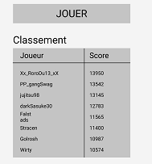
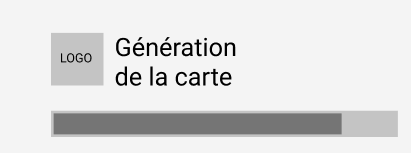
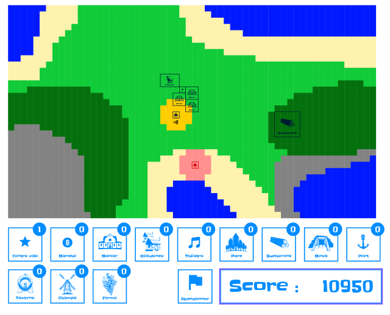

---

Présentation du projet PIXEL - Minimalist city builder

<!--more-->

## Introduction

Ce projet s'inscrit dans le cadre du premier temps de la filière Digital.e, Méthodes de Développement (ou M2D). Le but principal du projet est de créer un site permettant de jouer à un jeu solo pnp ou à un jeu à plusieurs sur un seul écran.

Nous avons fait le choix de développer un [City-Builder](https://fr.wikipedia.org/wiki/City-builder) en nous inspirant du jeu [Islanders](https://fr.wikipedia.org/wiki/Islanders_(jeu_vid%C3%A9o)) pour les mécaniques de jeu et les interactions entre les différents bâtiments proposés dans le jeu.

## Stack technique

### Front-end

- [Vue 3](https://v3.vuejs.org/) 
- [Electron](https://www.electronjs.org/)
- [Axios](https://axios-http.com/docs/intro)

### Back-end

- [Flask](https://flask.palletsprojects.com/en/2.0.x/)
- [Python](https://www.python.org/)
- [Psycopg2](https://www.psycopg.org/docs/)

### Base de données

- [PostgreSQL](https://www.postgresql.org/)

### Hébergement

- Front-end : [Vercel](https://vercel.com/)
- Back-end + Base de données : [Heroku](https://www.heroku.com/)

## Conception
Avant de lancer les développements pour ce projet, nous sommes passés par une phase de conception qui nous a permis de définir les règles du jeu, des maquettes pour chaque écran ainsi que les différents composants que nous allions utiliser.

Cette phase de maquettage nous a également permis de définir une charte graphique.  

### Définition des règles

Pour les règles, nous nous sommes grandement inspiré de celles d'[Islanders](https://fr.wikipedia.org/wiki/Islanders_(jeu_vid%C3%A9o)) en les simplifiant. 
Nous voulions 5 environnements qui intéragissent tous différemment avec 12 bâtiments.

Les environnements que nous voulions implémenter étaient les suivants : 

- Plaine
- Forêt
- Montagne
- Plage
- Mer

Les bâtiments qui seraient disponibles étaient les suivants :

- Centre-Ville
- Manoir
- Résidence
- Marché
- Théâtre
- Parc
- Atelier de bûcherons
- Mines
- Port
- Taverne
- Ferme
- Champs

Il a ensuite fallu déterminer les différentes interactions entre l'environnement et les bâtiments ainsi que l'inluence qu'un bâtiment pouvait avoir sur un autre.

Chaque bâtiment devait avoir une taille et une influence unique, nous l'avons également défini lors de cette phase de conception.

### Wireframes

Les règles du jeu définies clairement, nous pouvions passer à la phase de maquettage. Si les règles viendraient à changer lors des bêta tests du jeu, il ne serait question que d'équilibrage et non de refonte des règles. 

### Charte graphique

### Mock-ups

## Comment y jouer ?

### Version navigateur 

Le jeu est disponible en suivant cette URL : https://minimalist-city-builder.vercel.app/

>Nous recommandons d'utiliser Google Chrome, l'utilisation d'autres navigateurs peuvent amener à des problèmes d'affichage.

### Version executable (uniquement sous Windows)

Il suffit de télecharger le zip ci-dessous et d'extraire son contenu à l'emplacement de votre choix. Executez ensuite le fichier Pixel.exe pour lancer le jeu

Le lien de télechargement du setup : <a href="https://drive.google.com/file/d/1Fsi40mmmJs5ZdE53fwwwIi4KryRCb79f/view?usp=sharing" target="_blank">Setup PIXEL</a>

>Vous avez besoin d'une connexion internet pour jouer même avec l'éxecutable. Le fichier ne compile que le front-end et communique avec le back-end via des API.   

## Code source

### Repositories 

Le code source du projet est disponible dans les repository GitHub suivants :

- Front-end : https://github.com/ppernalon/minimalist-city-builder.git
- Back-end : https://github.com/rcamisard/Minimalist-city-builder-server.git

### Installation

>Il n'est nécéssaire de lancer que le front-end pour lancer le jeu sur un localhost.

#### Front-end
~~~ shell
npm install
~~~ 
Cette commande installera toutes les dépendances nécessaires pour que le programme fonctionne.

~~~ shell
npm run serve
~~~ 
Cette commande lancera un serveur local sur lequel sera deployée l'application. Il ne vous reste qu'à ouvrir votre navigateur et entrer l'URL du serveur créé.

#### Back-end

Lancez la commande suivante dans votre terminal

~~~ shell
python -m flask run
~~~ 

Vous aurez ainsi votre back-end deployé sur un serveur local.

#### Communication entre les serveurs

Dans le fichier *src\http\AbstractHttpServices.js* de votre application front-end, modifiez la valeur de la variable **API_URL** et remplacez-là par l'URL de votre serveur back-end. Sauvegardez vos changements et les deux serveurs sont maintenant reliés entre eux. 
