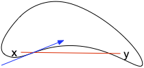
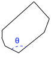
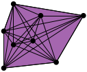
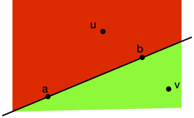
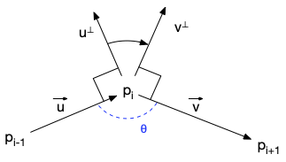
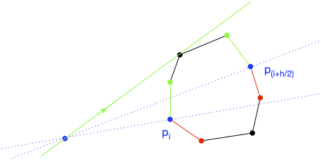
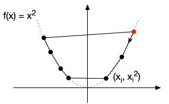
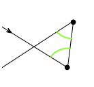
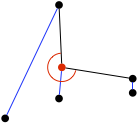

<!-- début résumé -->

Introduction aux algorithmes de recherche d'enveloppe convexe pour un ensemble de points de $\mathbb{R}^2$.

<!-- end résumé -->

> TBD : découper en fichiers séparés.

La algorithmes de recherche d'enveloppes convexes d'ensembles de points de $\mathbb{R}^2$ font partie, comme les algorithmes de tri, des problèmes qu'adorent les algorithmiciens. Il peut en effet se résoudre de multiples manières et les algorithmes résultant sont à la fois ingénieux et élégants. Ils sont cependant souvent plus compliqués que les algorithmes de tris.

Nous allons ici montrer quelques uns de ces algorithmes, les plus connus. Mais avant de rentrer dans le vif, commençons par définir le problème.


Nous nous restreignons ici à la géométrie du plan euclidien $\mathbb{R}^2$. Certaines applications (en particulier graphiques ou mécaniques) nécessitent de rechercher des enveloppes convexes de points de l'espace, mais nous n'en parlerons pas ici.


## Convexité

La notion de *convexité*, très générale, est utilisée lorsque l'on manipule des objets *pleins* et de forme *bombée*. Elle se formalise en utilisant les segments :


Soit deux points $A=(x, y)$ et $B=(x', y')$. Le ***segment $[A, B]$*** est l'ensemble des points $C$ tels que :

<div>
$$
C = \lambda \cdot A + (1-\lambda) \cdot B =
   \left(
      \begin{array}{c}
         \lambda x + (1-\lambda) x' \\
         \lambda y + (1-\lambda) y'
      \end{array}
    \right)
$$
</div>

Avec $0 \leq \lambda \leq 1$.



De nombreuses nombreux problèmes d'optimisations deviennent facile lorsque l'objet étudié (fonction, ensemble, forme géométrique, etc) est *convexe*.

### Fonction convexe


<https://fr.wikipedia.org/wiki/Fonction_convexe>



Une fonction $f: \mathbb{R} \rightarrow \mathbb{R}$ est ***convexe*** si pour tous $x, x' \in \mathbb{R}$ et $0 \leq \lambda \leq 1$ :

<div>
$$
f\left(\lambda\cdot x+(1-\lambda)\cdot x'\right)\leq \lambda\cdot f(x)+(1-\lambda)\cdot f(y)
$$
</div>


Pour une fonction convexe, pour tous couples de points $A = (x, f(x))$ et $B = (x', f(x'))$, quelque soit (u, v) \in [A, B]$ on a $v \geq f(u)$ (le segment est au dessus de la courbe) :


Les fonctions convexes sont sympathiques en optimisation car tout minimum local est un minimum global. Il est donc très facile avec une méthode de gradient de trouver son minimum.

### Ensemble convexe


<https://fr.wikipedia.org/wiki/Ensemble_convexe>



Un sous-ensemble $C \in \mathbb{R}^2$ est ***convexe*** si pour tous $A, B \in C$, $[A, B] \subseteq C$.


La première propriété que l'on peut donner est, clairement, que :


Si $f$ est une fonction convexe, alors $\\{ (x, f(x)) \mid x \in \mathbb{R}\\}$ est un ensemble convexe.


Les ensembles convexes sont en forme de patate et en tout point, la tangente est au dessus de l'intérieur de la forme géométrique formée par l'ensemble :


Les ensembles non convexes vont avoir une forme de haricot et il va exister des points où la tangente traversera la forme :



Les ensembles convexes ont de fortes propriétés de stabilité :


Si $\mathcal{C}$ est un ensemble d'ensembles convexes, alors $\cap \mathcal{C}$ est un ensemble convexe.



Soient $x, y \in \cap \mathcal{C}$, alors $[x, y] \subseteq C$ quelque soit $C \in \mathcal{C}$. Donc $[x, y] \subseteq \mathcal{C}$


Comme l'ensemble $\mathbb{R}^2$, on déduit de la proposition précédente que :


Pour tout ensemble $A \subseteq \mathbb{R}^2$, il existe $\text{Conv}(A) \subseteq \mathbb{R}^2$ le ***plus petit ensemble convexe contenant $A$*** (pour l'ordre d'inclusion $\subseteq$)


Comme $A \subseteq \mathbb{R}^2$ et que $\mathbb{R}^2$ est convexe, l'ensemble $\mathcal{A}$ de tous les convexes contenant $A$ est non vide donc :

* $A \subseteq \cap \mathcal{A}$
* tout convexe $C$ contenant $A$ étant dans $\mathcal{A}$, on a : $\cap \mathcal{A} \subseteq C$

Les deux remarques ci-dessus prouvent que $\text{Conv}(A)$ existe et qu'il vaut $\cap \mathcal{A}$.


Les ensembles convexes ont de multiples propriétés mathématiques sympathiques très utiles en topologie. Ils sont également très utiles en optimisation sous la forme particulière des polygones convexes.

### Polygone convexe


<https://fr.wikipedia.org/wiki/Polygone_convexe>


En informatique (et dans la vie réelle), les ensembles convexes se rencontrent uniquement sous la forme de polygones convexes.


Un [***polygone***](https://fr.wikipedia.org/wiki/Polygone) est une suite finie de points $[P_1, \dots, P_h]$ :


Le polygone de gauche est dit ***croisé*** ou ***complexe*** car il y a au moins un croisement de segment (deux segments non consécutifs s'intersectent) et le polygone de droite, sans croisement de segment, est [***simple***](https://fr.wikipedia.org/wiki/Polygone_simple).


Un polygone simple est une surface :



L'***intérieur*** d'un polygone simple est la surface formé par la ligne polygonale fermée.

On confond souvent intérieur et polygone simple.


Un polygone convexe est un polygone simple particulier :


Un polygone simple $A_1 \dots A_h$ est convexe si les angles intérieurs du polygone sont tous inférieurs à 180°




Quelques exemples de polygones non convexes (on simple à gauche et angle):


Bien sûr :


Un polygone simple est convexe si et seulement si l'ensemble des points qui le constituent forment un ensemble convexe.


Les polygones convexes sont très utilisé en infographie car ils permettent de calculer très rapidement des intersections entre :

* un polygone convexe et une droite, ce qui est crucial en *raytracing*
* deux polygones convexes, ce qui est indispensable pour des calculs rapides de collisions pour des jeux 2D

Enfin, les problèmes d'[optimisation linéaire](https://fr.wikipedia.org/wiki/Optimisation_lin%C3%A9aire) se résolvent facilement car cela revient à trouver un maximum dans un polygone convexe.

Par exemple :


Je veux faire le tour du monde en ballon. Il faut donc que j'emporte dans ma montgolfière le plus de nourriture possible **mais** il y a des contraintes :

* j'ai l'estomac fragile et ne mange que des noisettes ([628 calories pour 100g](https://www.infocalories.fr/calories/calories-noisettes.php)) et de la gelée de framboise ([328 calories pour 100g](https://fr.openfoodfacts.org/produit/3701164000079/gelee-de-framboise))
* je n'ai que 2000€ sur mon compte en banque et :
  * 100g de noisettes coûte 3€
  * 100g de gelée de framboise coûte 5.65€
* ma montgolfière ne peut contenir plus de 60kg de nourriture

Combien de calories puis-je emmener au maximum ?


Les contraintes de faisabilité s'écrivent comme des contraintes linéaires qui forment un polygone convexe :


Il faut de plus maximiser une fonction linéaire : $6280\cdot x + 3280 \cdot y = K$ où $K$ représente le nombre de calorie que je peux emporter pour $x$ kilogrammes de noisettes et $y$ kilogrammes de gelée de framboise.

On peut montrer que le maximum est obtenu lorsque cette droite objectif est tangente au polygone convexe. Ici cela correspond à emporter 60kg de noisettes et 0kg de gelée de framboise, pour un nombre maximum de calories valant $K^\star = 6280 \cdot 60 = 376800$.




Les résultats précédents en deux dimensions se généralisent à $\mathbb{R}^n$. On parle alors de [polytope](https://fr.wikipedia.org/wiki/Polytope) et non plus de polygone convexe, mais la résolution est identique.


### Enveloppe convexe


L'***enveloppe convexe*** d'un ensemble de points $P$ est $\text{Conv}(P)$, le plus petit ensemble convexe contenant $P$.


Lorsque l'on se place dans $\mathbb{R}^n$ (ou plus généralement dans un espace affine réel), la définition précédente est équivalente à la définition ci-dessous  :


L'***enveloppe convexe*** d'un ensemble de points $P$ de $\mathbb{R}^n$ est l'ensemble de tous les points $x$ que l'on peut écrire :

$$
x = \sum_{i=1}^m \lambda_i x_i
$$

Avec :

* $\lambda_i \geq 0$ pour $1\leq i \leq m$
* $\sum_{i=1}^m \lambda_i = 1$
* $x_i \in P$ pour tout $1\leq i \leq m$



Remarquez que $P$ n'est pas forcément fini, ni même dénombrable.



Nommons $\mathcal{P}$ l'ensemble contenant l'ensemble des points $x$ pouvant s'écrire $x = \sum_{i=1}^m \lambda_i\cdot  x_i$ avec $\sum_{i=1}^m \lambda_i = 1$ et $x_i \in P$ pour tout $1\leq i \leq m$.

Montrons que cet ensemble est un convexe contenant $P$.

1. comme $x = \sum_{i=1}^1 1 \cdot x$ pour tout $x \in P$ on a $P \subseteq \mathcal{P}$
2. soient $u = \sum_{i=1}^p \alpha_i\cdot u_i$ et $v = \sum_{i=1}^{q} {\beta_i}\cdot {v_i}$ deux points de $\mathcal{P}$. Tout élément $s$ du segment $[xx']$ s'écrit $s = \lambda \cdot u + (1-\lambda) \cdot v$ avec $0\leq \lambda \leq 1$. De là $s = \sum_{i=1}^p \lambda \cdot \alpha_i u_i + \sum_{i=1}^{q} (1-\lambda) \cdot \beta_i v_i$ et comme $\sum_{i=1}^p \lambda \cdot \alpha_i + \sum_{i=1}^{q} (1-\lambda) \cdot \beta_i = 1$, on a $s \in \mathcal{P}$

Ceci prouve que $\text{Conv}(P) \subseteq \mathcal{P}$. Prouvons la réciproque.

On montre par récurrence sur $m$ que tout point $x = \sum_{i=1}^m \lambda_i x_i$ avec $\sum_{i=1}^m \lambda_i = 1$ et $x_i \in P$ est dans $\text{Conv}(P)$.

Comme $P \subseteq \text{Conv}(P)$, la propriété est vraie pour $m=1$. Supposons la vraie pour $m-1 \geq 1$ et considérons $m$. Soit $x = \sum_{i=1}^m \lambda_i\cdot  x_i$ avec $\sum_{i=1}^m \lambda_i = 1$ et $x_i \in P$. On a :

<div>
$$
\begin{array}{ccl}
x &=& \sum_{i=1}^{m-1}\lambda_i\cdot x_i + \lambda_m \cdot x_m \\
&=&(\sum_{i=1}^{m-1}\lambda_i) \cdot \sum_{i=1}^{m-1}\frac{\lambda_i}{\sum_{i=1}^{m-1}\lambda_i}\cdot x_i + \lambda_m \cdot x_m
\end{array}
$$
</div>

Comme $\sum_{i=1}^{m-1}\frac{\lambda_i}{\sum_{i=1}^{m-1}\lambda_i} = 1$, $\sum_{i=1}^{m-1}\frac{\lambda_i}{\sum_{i=1}^{m-1}\lambda_i}\cdot x_i$ est dans $\text{Conv}(P)$ par hypothèse de récurrence.

Le point $x$ est alors sur le segment entre deux points de $\text{Conv}(P)$ : il y est  également.



On peut même aller plus loin lorsque nos points sont dans $\mathbb{R}^2$  ([dans le cas général](https://fr.wikipedia.org/wiki/Th%C3%A9or%C3%A8me_de_Carath%C3%A9odory_(g%C3%A9om%C3%A9trie)), il suffit que l'espace soit de dimension fini) :


L'***enveloppe convexe*** d'un ensemble de points $P$ de $\mathbb{R}^2$ est l'ensemble de tous les points $x$ que l'on peut écrire :

$$
x = \sum_{i=1}^{3} \lambda_i x_i
$$

Avec :

* $\lambda_i \geq 0$ pour $1\leq i \leq 3$
* $\sum_{i=1}^{3} \lambda_i = 1$
* $x_i \in P$ pour tout $1\leq i \leq 3$




La proposition précédente nous indique que les points de $\text{Conv}(P)$ s'écrivent $x = \sum_{i=1}^m \lambda_i x_i$ avec $\sum_{i=1}^{m} \lambda_i = 1$ et les $x_i$ dans $P$.

Lorsque $m \leq 3$, la proposition est clairement vérifiée :

* $x = \sum_{i=1}^3\frac{1}{3}x$
* $x = \lambda\cdot x_1 + (1-\lambda)\cdot x_2 =  \frac{\lambda}{2}\cdot x_1 + \frac{\lambda}{2}\cdot x_1 + (1-\lambda)\cdot x_2$

On va montrer que si $m > 3$ et que tous les $x_i$ sot différents, on peut re-écrire $x$ avec $m-1$ points. Ceci montrera qu'on peut toujours se ramener à 3 points, en itérant le processus de descente.

Prenons donc un point $x = \sum_{i=1}^{m} \lambda_i x_i$ avec $m > 3$ et les $\lambda_i$ positif et sommant à 1.

Prenons les 4 premiers $x_i$. On peur supposer sans perte de généralité que l'on se trouve dans le cas de la figure ci-dessous :


Le point $x_1$ est à l'intérieur du triangle formé par les trois autres points et il s'écrit :

$$
x_1 = \alpha_2 \cdot x_2 + \alpha_3 \cdot x_3 + \alpha_4 \cdot x_4
$$

Avec :

* $\alpha_i \geq 0$, pour $2 \leq i \leq 4$
* $\alpha_2 + \alpha_3 + \alpha_4 = 1$

On a alors :

<div>
$$
\begin{array}{ccl}
x &=& \sum_{i=1}^4\lambda_i \cdot x_i + \sum_{i=4}^m\lambda_i \cdot x_i \\
&=& \lambda_1\cdot \alpha_2 \cdot x_2 + \lambda_1\cdot \alpha_3 \cdot x_3 + \lambda_1\cdot \alpha_4 \cdot x_4 \sum_{i=2}^4\lambda_i \cdot x_i + \sum_{i=4}^m\lambda_i \cdot x_i \\
&=& \sum_{i=2}^4(\lambda_1\cdot \alpha_i + \lambda_i)\cdot x_i + \sum_{i=4}^m\lambda_i \cdot x_i
\end{array}
$$
</div>

Comme $\alpha_2 + \alpha_3 + \alpha_4 = 1$, en posant :

* $\lambda'_i = \lambda_1\cdot \alpha_i + \lambda_i$ pour $2\leq i \leq 4$
* $\lambda'_i = \lambda_i$ pour $i \geq 4$

On a :

* $x = \sum_{i=2}^m\lambda'_i \cdot x_i$
* $\lambda'_i \geq 0$ pour $2\leq i \leq m$
* $\sum_{i=2}^{m} \lambda'_i = 1$



L'enveloppe convexe d'un ensemble fini de points  de $\mathbb{R}^2$ comme celui-ci :


est l'union de ses triangles :



On peut maintenant conclure :


L'enveloppe convexe d'un ensemble fini $P$ de points de $\mathbb{R}^2$ est un polygone convexe formé de points de $P$


Pour l'exemple précédent :


Notez qu'une fois que l'enveloppe convexe est déterminée, il est facile de trouver un ensemble de triangles extrémaux (la solution n'est unique) en parcourant les points :


## Quelques problèmes de polygones

Avant de partir bille en tête sur les algorithmes de construction d'enveloppe convexe, commençons par résoudre quelques problèmes connexes, qui permettrons de nous échauffer et qui seront bien utile plus tard.



* on se place dans le plan (euclidien) $\mathbb{R}^2$
* tous les points sont donnés par leurs coordonnées cartésiennes
* les angles seront donnés par rapport à l'ordre trigonométrique (anti-horaire)
* les polygones simples sont donnés en suivant l'ordre horaire : l'intérieur du polygone est toujours à droite du vecteur




### Droite, points et segments



Une droite coupe l'espace en deux demi-plans (rouge et vert dans la figure ci-dessus). Comment savoir efficacement dans quel demi plan se trouve un point ?

Une possibilité efficace est de regarder l'angle fait par un vecteur directeur de la droite ($\overrightarrow{ab}$ dans la figure ci-dessous) et un autre vecteur dont une extrémité est le point dont on veut connaître le demo-plan et l'autre un point de la droite ($\overrightarrow{au}$ et $\overrightarrow{av}$ dans la figure ci-dessous) :


En considérant le sens trigonométrique (anti-horaire) et des angles entre -180 et 180 degrés, le demi-plan vert a un angle négatif et le demi-plan rouge un angle positif.

Le calcul du signe de l'angle est de plus très simple !


Le signe de l'angle dans l'intervalle $[-180, 180]$ degrés entre deux vecteurs $\overrightarrow{v_1} = (x_1, y_1)$ et $\overrightarrow{v_2} = (x_2, y_2)$ est égal au signe de :

$$
x_1 \cdot y_2 - y_1 \cdot x_2
$$




On considère le [déterminant](https://fr.wikipedia.org/wiki/D%C3%A9terminant_(math%C3%A9matiques)#D%C3%A9terminant_de_deux_vecteurs_dans_le_plan_euclidien) entre $\overrightarrow{v_1}$ et $\overrightarrow{v_2}$ qui vaut :

$$
\text{det}(\overrightarrow{v_1}, \overrightarrow{v_2}) = x_1 \cdot y_2 - y_1 \cdot x_2 = \sin(\theta)\cdot ||v_1|| \cdot ||v_2||
$$

Avec $\theta$ l'angle entre les deux vecteurs dans le sens trigonométrique (anti-horaire).



Remarquez que le calcul du signe de l'angle ne requiert que 2 multiplications et 1 soustractions, ce qui se fait donc extrêmement rapidement !


Soit $x, y, x', y' \in \mathbb{R}^2$ quatre points. Proposez une méthode permettant de déterminer si les segments $[x, y]$ et $[x', y']$ se croisent.



Il suffit de remarquer que les segments $[x, y]$ et $[x', y']$ se croisent si et seulement si les deux propositions ci-dessous sont vérifiées :

* $x'$ et $y'$ sont dans des demi-plans différents par rapport à la droite $(x, y)$
* $x$ et $y$ sont dans des demi-plans différents par rapport à la droite $(x', y')$




### Reconnaissance de polygones

Soit $P = [p_1, \dots, p_h]$ un polygone ($p_i = (p_i^x, p_i^y)$ pour tout $1\leq i \leq h$).

Est-il simple ? Convexe ?

#### Polygone simple

Nous allons dans la suite nous concentrer sur les polygones simples. Mais comment savoir si un polygone donné l'est ?


Proposez un algorithme en $\mathcal{O}(h^2)$ permettant de savoir si un polygone est simple ou non.



On vérifie que deux segments non consécutifs du polygone ne se croisent jamais :

```text
de i allant de 1 à h-2:
   de j allant de i+2 à h:
      vérifier que les segments [p[i], p[i+1]] et [p[j], p[(j+1) % h]] ne se croisent pas
```

On a utilisé l'opérateur `%`{.language-} qui est le reste de la division entière (ou modulo).



Il existe un algorithme en $\mathcal{O}(h)$ opérations pour reconnaître si un polygone est simple. En revanche l'algorithme est loin de l'être, simple (il utilise une [triangulation de Chazelle](https://www.cs.princeton.edu/~chazelle/pubs/polygon-triang.pdf)) nous ne le montrerons donc pas ici.


#### Polygone simple convexe

Supposons que le polygone $P$ est simple. Est-il convexe ?

Là encore, la solution est très simple en utilisant les vecteurs :


En utilisant la figure ci-dessous, montrez que l'angle intérieur $\theta$ est inférieur à 180 degré si et seulement si :

$$
p_{i}^x \cdot (p_{i+1}^y-p_{i-1}^y) - (p_{i+1}^x-p_{i-1}^x)\cdot p_i^y + p_{i+1}^x\cdot p_{i-1}^y - p_{i+1}^y\cdot p_{i-1}^x \geq 0$$





Le calcul résulte du fait que si $\overrightarrow{u} = (a, b)$, alors $\overrightarrow{u^\perp} = (-b, a)$ ($\overrightarrow{u} \cdot \overrightarrow{u^\perp} = a\cdot (-b) + b\cdot a = 0$).

On a alors :

* $\overrightarrow{u} = (p_i^x-p_{i-1}^x, p_i^y-p_{i-1}^y)$, donc $\overrightarrow{u^\perp} = (-p_i^y+p_{i-1}^y, p_i^x-p_{i-1}^x)$
* $\overrightarrow{v} = (p_{i+1}^x-p_{i}^x, p_{i+1}^y-p_{i}^y)$, donc $\overrightarrow{v^\perp} = (-p_{i+1}^y+p_{i}^y, p_{i+1}^x-p_{i}^x)$

D'où :

<div>
$$
\begin{array}{ccl}
\text{det}(\overrightarrow{u^\perp}, \overrightarrow{v^\perp}) &=& (-p_i^y+p_{i-1}^y)\cdot(p_{i+1}^x-p_{i}^x) - (p_i^x-p_{i-1}^x)\cdot (-p_{i+1}^y+p_{i}^y) \\
&=& p_{i}^x \cdot (p_{i+1}^y-p_{i-1}^y) - (p_{i+1}^x-p_{i-1}^x)\cdot p_i^y + p_{i+1}^x\cdot p_{i-1}^y - p_{i+1}^y\cdot p_{i-1}^x
\end{array}
$$
</div>



De la proposition précédente on peut déduire :



On peut vérifier en $\mathcal{O}(h)$ si un polygone simple est convexe.


On vérifie la proposition précédente pour les segments consécutifs $(p_{i-1}, p_i, p_{(i+1) \\% h})$


## Polygones convexes

Nous allons montrer ici quelques propriétés sympathiques des polygones convexes.

Dans toute cette partie on considère que $P = [p_1, \dots, p_h]$ est un polygone convexe ($p_i = (p_i^x, p_i^y)$ pour tout $1\leq i \leq h$) donné dans le sens horaire.


Pour ne pas alourdir les notations, on considérera que tous les indices sont modulo p.


### Min / Max


Montrez que l'on peut trouver $\min(\\{ p_i^x \mid 1 \leq i \leq h \\})$ en $\mathcal{O}(\log(h))$ opérations.



On peut procéder par dichotomie :




Tout se passe comme si les points du polygone étaient triés ! Trouver le minimum est donc très rapide.


Remarquez que l'on peut de la même manière trouver le minimum en $y$, ou le maximum en $x$ ou en $y$.


### Tangentes

À tout point extérieur à un polygone convexe passe deux tangentes :


L'une pour laquelle tous les points du polygone sont à sa droite (la droite verte), l'autre pour laquelle tous les points du polygone sont à gauche (la droite rouge).


Montrez que l'on peut trouver la tangente rouge (*resp.* verte) en $\mathcal{O}(\log(h))$ opérations.



On peut également procéder par dichotomie :





Un corollaire à cet exercice est que l'on peut déterminer si une droite intersecte un polygone convexe en $\mathcal{O}(\log(h))$ opérations. Il suffit en effet de prendre un sommet de la droite qui n'est pas sur le polygone (d’abscisse inférieure au minimum) puis de calculer les tangentes. si la pente de la droite n'est pas dans l'angle formé par les deux tangentes, elle ne coupe pas le polygone.

### Dedans ou dehors ?

Le dernier problème que nous allons aborder est de savoir si un point est dans le polygone convexe ou pas.

Commençons simplement :


Montrez que l'on peut savoir si un point est à l'intérieur d'un polygone convexe en $\mathcal{O}(h)$ opérations.



Pour qu'un point soit à l'intérieur d'un polygone convexe, il faut qu'il soit à droite de tous les segments de celui-ci, parcourut dans le sens horaire :


On peut donc cycler sur tous les triplets $(p_{i-1}, p_i, p_{i+1})$ et regarder le statut du point avec les droites $(p_{i-1}, p_i)$ et $(p_i, p_{i+1})$.



Sans surprise :


Montrez que l'on peut savoir si un point est à l'intérieur d'un polygone convexe en $\mathcal{O}(\log(h))$ opérations.




On commence par regarder les triplets $(p_{j-1}, p_{j}, p_{j +1})$ pour $j \in \\{ i, i+h/4, i + h/2\\}$ comme pour l'exercice précédent. Si cette vérification n'échoue pas, on peut supposer sans perte de généralité que le point est à gauche de la droite $(p_i, p_{i+h/2})$ et le point recherché est dans le polygone convexe vert :


On entame la dichotomie en vérifiant si le point est à gauche de$(p_i, p_{i+h/4})$ ou de $(p_{i+h/4}, p_{i+h/2})$. Remarquez qu'il ne peut être à droite des deux et s'il est à gauche des deux c'est qu'il est dans le polygone.



### Conclusion

Les polygones convexes permettent de calculer très efficacement :

* des minimaux ou des maximaux
* des intersections :
  * entre droite et polygone convexe
  * entre deux polygones convexes (au moins un sommet d'un polygone est à l'intérieur de l'autre)

Ils sont pour cela très utilisé en infographie pour :

* du raytracing : le rayon rebondi sur le polygone selon la normale du segment qu'il intersecte (remarquez que la normale pointe vers l'extérieur)
* dans les jeu car le calcul de la collision est rapide


Les calculs se généralisent en 3D lorsque chaque surface est composée de triangles.


## Problème de l'enveloppe convexe

Le vif du sujet :


Soit $\mathcal{P}$ en ensemble fini de $n$ points de $\mathcal{R}^2$.

Trouver $P = [p_1, \dots, p_h]$ l'enveloppe convexe de $\mathcal{P}$.


Pour alléger les algorithmes, on considérera que tous les points de  $\mathcal{P}$ sont [position générale](https://fr.wikipedia.org/wiki/Position_g%C3%A9n%C3%A9rale), c'est à dire que trois points de $\mathcal{P}$ ne sont pas alignés.

### Reconnaissance

En utilisant ce que nous avons fait précédemment, il est facile de savoir si un polygone convexe $P = [p_1, \dots, p_h]$ est l'enveloppe convexe de $\mathcal{P}$ :

* on vérifie pour chaque point en $\mathcal{O}(\log(h))$ s'il est dans le convexe
* lors de la vérification d'un point, on pourra également savoir si c'est un point du polygone. Si à la fin de la vérification, on a $h$ points sur l'enveloppe, tous les points de $P$ sont dans $\mathcal{P}$

On conclut de ce qui précède que :


savoir si un polygone convexe $P = [p_1, \dots, p_h]$ est l'enveloppe convexe de $\mathcal{P}$ se fait en $\mathcal{O}(n\log(h))$ opérations.


### Marche de Jarvis


[Marche de Jarvis](https://fr.wikipedia.org/wiki/Marche_de_Jarvis), 1973


Le principe de la marche de Jarvis est simple : construire l'enveloppe convexe de façon gloutonne. Il utilise pour cela la proposition suivante :


Si $P = [p_1, \dots, p_h]$ est l'enveloppe convexe de $\mathcal{P}$, alors pour tout $p_i$, les seuls points $x$ de $\mathcal{P}$ tels que la droite $(p_i, x)$ place tous les points de $\mathcal{P}$ dans le même demi plan sont $p_{i-1}$ et $p_{i+1}$.


#### Régime stable

Supposons que l'on ait déjà déjà commencé à construire l'enveloppe convexe en ayant les $i > 1$ premiers points : $[p_1, \dots, p_i]$


On balaie tous les points et le prochain élément sur l'enveloppe sera celui qui maximisera l'angle avec le point précédent. ce qui revient à trouver le point $x$ maximisant :

<div>
$$
\frac{\overrightarrow{p_{i-1}p_i} \cdot \overrightarrow{p_{i}x}}{||\overrightarrow{p_{i}x}||} = ||\overrightarrow{p_{i-1}p_i}||\cdot \cos(\alpha)
$$
</div>

Ce point $x$ est le seul point différent de $p_{i-1}$ tel que la droite $(p_i, x)$ place tous les éléments de $P$ à sa droite : c'est le prochain élément de l'enveloppe.


Trouver le prochain élément de l'enveloppe convexe prend $\mathcal{O}(n)$ opérations


#### Initialisation

On sait que les points réalisant le minimum des abscisses sont sur l'enveloppe convexe (il y en a au plus 2 si les points sont en position générale): on en prend un pour être $p_1$.


Choisir $p_2$ revient à trouver le point minimisant l'angle avec l'axe des ordonnées.


Trouver les deux premiers éléments de l'enveloppe connexe prend $\mathcal{O}(n)$ opérations.


#### Fin

L'algorithme s'arrête lorsque l'on boucle sur $p_1$

#### Complexité


L'algorithme de Jarvis trouve l'enveloppe convexe de $n$ points en $\mathcal{O}(n\cdot h)$ opérations, où $h$ est le nombre de points de l'enveloppe connexe.



Cette complexité n'est pas usuelle puisqu'elle combine à la fois une donnée liée à l'entrée (le nombre $n$ de points) et une donnée liée à la sortie (la taille $h$ de l'enveloppe convexe).

La taille de l'enveloppe convexe est très variable, elle peut aller de 3 (figure de gauche) à $n$ (figure de droite) :


On en conclut que :


L'algorithme de Jarvis trouve l'enveloppe convexe de $n$ points en $\mathcal{O}(n^2)$ opérations.



Même si souvent la taille de l'enveloppe convexe est plus petite que $n$.

### Complexité du problème

On montre que le problème du tri est un cas particulier du problème de l'enveloppe convexe.

Soit $L=[x_1, \dots, x_n]$ une liste de $n$ nombres que l'on veut trier et considérons les $n$ points $\mathcal{P} = \\{ (x_1, x_1^2), \dots, (x_i, x_i^2), \dots, (x_n, x_n^2)\\}$


Tout se passe comme si on avait placer les points à trier sur une parabole.

De là, l'enveloppe convexe des points est :



Une fois le maximum des points trouvé (en $\mathcal{O}(\log(n))$ opération), suivre l'enveloppe c'est trier les points par ordre décroissant.


Le problème du tri est un cas particulier de calcul d'enveloppe convexe, la complexité du problème de l'enveloppe convexe est plus grande que la [complexité du problème du tri](../étude-tris#complexité-problème) :

Tout algorithme trouvant l'enveloppe convexe de $n$ points est a au moins une complexité de $\mathcal{O}(n\log(n))$.


Nous allons voir avec l'algorithme ci-après que cette borne est atteinte :


La complexité du problème du calcul de l'enveloppe convexe de $n$ points est : $\mathcal{O}(n\log(n))$.


### Parcours de Graham


[Parcours de Graham](https://fr.wikipedia.org/wiki/Parcours_de_Graham), 1972.


Le parcours de Graham fonctionne en deux temps. Il commence par ordonner les points pour construire un polygone simple particulier. Ce polygone sera ensuite raffiné pour obtenir un polygone convexe.

#### Polygone simple particulier

L'algorithme commence par trouver le point d’abscisse minimum qu'on nomme $p_1$, puis il trie tous les sommets $x$ par angle $\theta$ croissant :



Remarquez que si les points sont en position générale, il n'y a que deux point par droite.


On construit ensuite le polygone simple en relier les points dans cet ordre :


Ce polygone n'est pas convexe mais :

1. il est simple
2. dans le cône formé par $p_1$ et deux sommets successifs, il n'y a aucun autre sommet

#### Simplification de Sklansky

La simplification de Sklansky procède comme sur la figure ci-dessous :


On parcours les points dans l'ordre du polygone et si l'angle intérieur $(p_{i-1}, p_i, p_{i+1})$ n'est pas bon :

1. on supprime $p_i$ du polygone
2. i = i-1
3. on continue la procédure de vérification avec le le nouveau $p_i$ (qui était $p_{i-1}$ à l'étape précédente)


Remarquez que cette procédure peut faire remonter de plusieurs étapes comme le montre la figure ci-dessous :




Au final, tout les sommets du polygone sont vérifiés et dans le cas du polygone simple obtenu par Graham on obtient :


Le polygone est bien convexe.


La marche de Sklansky ne fonctionne **que** si l'on ne produit jamais de croisement de segments.





Et on peut même créer des croisements :




Dans le cas de du polygone obtenu par l'algorithme de Graham, comme les cônes vides entre deux sommets successifs assurent qu'il n'y aura jamais de croisement de segments et donc que la simplification de Sklansky va fonctionner et donner un polygone convexe en fin de simplification.

Cette simplification va vite !


La complexité de la simplification de Sklansky est $\mathcal{O}(n)$ où $n$ est la taille du polygone simple passé en entrée.


À chaque retour, un sommet est supprimé, on ne peut donc effectuer en tout que $n$ retours. On examine donc au maximum $2\cdot n$ points et chaque examen est en $\mathcal{O}(1)$ opérations.


La simplification de Sklansky était à l'origine un algorithme proposé pour trouver l'enveloppe convexe d'un polygone simple. Il a cependant rapidement été prouvé faux. Il existe des algorithme linéaires pour trouver l'enveloppe convexe d'un polygone simple (comme [l'algorithme de Melkan](https://maxgoldste.in/melkman/)) mais ils sont bien plus ardu à implémenter. Autant s'en passer si la simplification de Sklansky fonctionne (on le rappelle, elle ne fonctionne qui si on ne produit jamais de croisements).


Si l'histoires des algorithmes linéaires pour trouver l'emveloppe convexe d'un polygone simple vous intéresse, allez jeter un coup d'oeil à ce site : <http://cgm.cs.mcgill.ca/~athens/cs601/>. C'est une histoire pleine de rebondissement.


#### <span id="graham-complexité"></span> Complexité

La complexité du parcours de Graham réside dans le tri :


Le parcours de Graham trouve l'enveloppe convexe de $n$ points en $\mathcal{O}(n\log(n))$ opérations.



Selon la taille de l'enveloppe convexe, cette complexité sera plus ou moins grande que l'algorithme de Jarvis.

Le suspens est insoutenable. Existe-t-il de meilleurs algorithmes que ces deux là ? Avant de répondre (oui) à cette épineuse question regardons un algorithme dont la complexité en moyenne est linéaire.

## Les divisions de Préa

> TBD : à coder pour exhiber la complexité en moyenne
>
> .....,,X.........
> ..c. ,/,....1-c..
> .....X,,.........
>
> et en moyenne c = n/2 de chaque côté

On doit cet algorithme à Préa, publié dans son poly d'Algorithmie de l'école centrale ~~marseille~~ méditerranée. Il ressemble à l'algorithme [Quickhull](https://fr.wikipedia.org/wiki/Quickhull) dont il partage nombre de ses propriétés. Le calcul de ses complexités est cependant plus simple.

```text
fonction diviser(P):
    soit p le point de P d'ordonnée maximum
    soit q le point de P d'ordonnée maximum
    Soient G les points de P à gauche de la droite (p, q)
    Soient D les points de P à droite de la droite (p, q)
    
    return p, q, G, D

fonction convexe(P):
    p,q, G, D = convexe(P)

    P = [p]
    Q = [q]

    Tant que D est non vide:
        p,q, G, D = convexe(D)
        ajoute p à la fin de P
        si q ≠ p:
            ajoute q au début de Q

    Tant que G est non vide:
        p,q, G, D = convexe(G)
        ajoute p au début de P
        si q ≠ p:
            ajoute q à la fin de Q

    rendre P + Q
```

L'algorithme va séparer l'espace en 2 à chaque itération et ne va garder que le demi-espace utile. Par exemple :


Au bout de la première itération, on a déjà supprimé tous les points inutiles. Après la seconde itération, on a obtenu l'enveloppe convexe avec notre exemple.

Attention, ce n'est pas toujours le cas :



Le polygone obtenu est cependant simple et il est clair qu'on peut le simplifier en utilisant Sklansky (entre 2 points successifs, il existe une bande horizontale sans points qui corresponds à la différence entre les 2 max ou min successifs. L'argument est donc identique au parcours de Graham).

> TBD : un figure.

Cette étape de raffinage prendra alors au pire $\mathcal{O}(n)$ opérations.

Dans le cas le pire aucun point n'est supprimé à chaque division et la complexité totale est en $\mathcal{O}(n^2)$, mais en moyenne on pourra supprimer à chaque étape la moitié des points et rediviser sur 1 quart des points à gauche et un quart à droite. La complexité moyenne a alors la formule suivante :

$$
C(n) = n + 2 \cdot C(\frac{n}{4})
$$

Ce qui donne en utilisant le [master theorem](../étude-tris/#master-theorem) une complexité totale de $\mathcal{O}(n)$ en moyenne.


Puisqu'il y a équivalence entre algorithme de tri et enveloppe convexe, pourquoi ne peut-on pas utiliser cet algorithme pour avoir un algorithme de tri en complexité $\mathcal{O}(n)$ en moyenne ?



Lorsque on a montré l'équivalence, la taille de l'enveloppe convexe du problème du tri transformé était toujours de $n$ et les sommets étaient réparties sur tout l'axe des abscisses.

Pour ce type de données les subdivisions de Préa sont de complexité $\mathcal{O}(n^2)$. ON ne peut donc pas utiliser notre équivalence pour cela.



## Combinaisons d'enveloppes convexes

Pour l'instant, nous avons chercher l'enveloppe convexe à un ensemble de points. Regardons le problème connexe :


Soient $\mathcal{P}_i$ $1\leq i \leq 2$ deux ensembles de points et $P_i$ leurs enveloppes convexes respectives.

Comment calculer l'enveloppe convexe de $\mathcal{P}_1 \cup \mathcal{P}_2$


Nous allons montrer deux méthodes pour le faire. Mais avant de commencer, remarquez que :


Si Soit $\mathcal{P} = \mathcal{P}_1 \cup \mathcal{P}_2$ un ensemble de points. L'enveloppe convexe de $\mathcal{P}$ est uniquement composée de points des enveloppes convexes de $\mathcal{P}_1$ $\mathcal{P}_2$



### Enveloppes disjointes

Si les enveloppes connexes sont disjointes, on peut supposer sans perte de généralité qu'il existe une droite verticale les séparant (à un rotation prêt) :


On peut alors chercher le point le plus à droite du polygone de gauche (point vert) et le point le plus à gauche du polygone de droite (point rouge).

On construit alors le polygone de la figure ci-dessous, en simulant une double jonctions entre les sommets rouge et vert, une jonction permettant d'aller de gauche à droite et l'autre de droite à gauche.


Ce polygone est simple et on peut utiliser une simplification de Sklansky pour le rendre convexe :



Il se peut que les polygones ne se joignent pas au maximum ou au minimum :


Les polygone vert et bleues se rassemblent avec le segment noir qui ne lie aucun des 2 minimum (en rouge).



La complexité totale de cette jonction est en :

* recherche des éléments extrémaux des deux polygones : $\mathcal{O}(h_1 +h_2)$
* simplification de Sklansky : $\mathcal{O}(h_1 + h_2)$


La complexité de la combinaison de deux polygones convexes disjoints est linéaire en la taille des deux polygones.


### Enveloppes Quelconques

Il est impossible d'utiliser la même technique que précédemment car il est impossible de combiner les deux polygones convexe en un polygone simple que l'on pourra simplifier avec Sklansky.

On peut en revanche utiliser une marche de Jarvis pour créer la nouvelle enveloppe.

On suppose que la première enveloppe est $P_1 = [p^1_1, \dots, p^1_{h_1}]$, la seconde $P_2 = [p^2_1, \dots, p^2_{h_2}]$ et que l'on construit l'enveloppe $P = [p_1, \dots, p_h]$.

On commence par le point le plus à gauche des deux enveloppes. Ce point est nécessairement dans l'enveloppe globale.

Soit $p_i$ le dernier point ajouté à l'enveloppe convexe. Le point suivant de la marche de Jarvis est celui maximisant l'angle avant l'axe des ordonnés si $i=1$ ou la droite $(p_{i-1}, p_i)$ sinon.

Supposons que $p_i$ soit le point $p^1_j$ du polygone $P_1$ :

* le point de $P_1$ maximisant l'angle est $p^1_{j+1}$
* le point de $P_2$ maximisant l'angle est $p^2_{k}$ tel que la droite $(p_i, p^2_{k})$ soit tangente à $P_2$ et place tous ses éléments à sa droite. Ce point se trouve en $\mathcal{O}(\log(h_2))$ opérations.

Le prochain point $p_{i+1}$ est donc soit $p^1_{j+1}$ soit $p^2_{k}$.

Trouver $p_{i+1}$ se trouve donc en $\mathcal{O}(\log(h_1))$ ou en $\mathcal{O}(\log(h_2))$ selon l'enveloppe convexe sur laquelle se trouve $p_i$. Comme tous les points de $P_1$ et tous les points de $P_2$ peuvent faire parti de l'enveloppe finale, on a :


La combinaison de deux enveloppes convexes de tailles $h_1$ et $h_2$ en une seule de taille $h$ se fait, en utilisant la marche de Jarvis en : $\mathcal{O}(h\cdot (\log(h_1) + \log(h_2))) \leq \mathcal{O}((h_1 + h_2) \cdot (\log(h_1) + \log(h_2)))$ opérations.



Cette complexité dépend de la taille de la sortie. Elle est donc plus importante que la première méthode lorsque $h$ est de l'ordre de $h_1 + h2$ mais plus petite lorsque $h$ est petit.

### Algorithmes diviser pour régner

> TBD : master theorem plus clair

Le principe de l'algorithme diviser pour régner est toujours le même :

1. on sépare le problème en deux sous problèmes : ici on partitionne l'ensemble de points $\mathcal{P}$ en deux parties $\mathcal{P}_1$ et $\mathcal{P}_2$
2. on résout chaque partie séparément (en utilisant le même algorithme)
3. on recolle les deux solutions partielles - ici les deux enveloppes convexes $P_1$ et $P_2$ - en une unique enveloppe convexe $P$

Nous allons montrer deux méthodes et comparer leurs complexités.

#### Méthode 1 : polygones disjoints

Pour s'assurer que les deux enveloppes convexes $P_1$ et $P_2$ soient disjoints, on commence par trier les points de $\mathcal{P}$ par abscisses croissantes, ce qui permet de toujours séparer en deux parties séparées par un axe vertical.

On peux alors utiliser la méthode de recollement pour polygones disjoints vues précédemment pour obtenir une complexité :

$$
C(n) = \mathcal{O}(n) + 2\cdot C(\frac{n}{2})
$$

Le [master theorem](../étude-tris/#master-theorem) nous indique que cette complexité vaut : $C(n) = n\log(n)$.

Le tri initial des points (en $\mathcal{O}(n\log(n))$) n'a pas dégradé la complexité :


L'algorithme diviser pour régner en utilisant des polygones disjoints est en $\mathcal{O}(n\log(n))$ opérations


#### <span id="méthode-2"></span> Méthode 2 : polygones convexes quelconques

Si l'on utilise des polygones quelconques, on a pas besoin de trier les éléments au début, mais chaque recollement coûte pus cher dans le cas le pire. On obtient une équation de complexité valant :

$$
C(n) = \mathcal{O}(n\log(n)) + 2\cdot C(\frac{n}{2})
$$

[L'énoncé général du master theorem](https://fr.wikipedia.org/wiki/Master_theorem#%C3%89nonc%C3%A9_g%C3%A9n%C3%A9ral) nous donne alors une complexité totale de $C(n) = \mathcal{O}(n\log^2(n))$. Ce qui est - c'était attendu - pire (mais pas de beaucoup) de la méthode 1.

## Algorithme optimal

> TBD :
>
> * des figures
> * complexité plus placée


[Algorithme de Chan](https://fr.wikipedia.org/wiki/Algorithme_de_Chan), 1996.


L'algorithme que allons maintenant présenter est de complexité $\mathcal{O}(n\log(h))$ où $n$ est le nombre de points et $h$ la taille de l'enveloppe convexe résultante.

Cette complexité est la meilleure complexité connue.


Le premier algorithme de complexité $\mathcal{O}(n\log(h))$ connu est celui de [Kirkpatrick et Seidel](https://en.wikipedia.org/wiki/Kirkpatrick%E2%80%93Seidel_algorithm) en 1986. Il est cependant plus ardu à comprendre.


1. partitionnez les $n$ points en $\frac{n}{m}$ paquets de $m$ points. Coût de cette étape : $\mathcal{O}(n)$
2. trouver avec le parcours de Graham l'enveloppe convexe de chaque paquet en $\mathcal{O}(m\log(m))$ opérations. Coût de cette étape : $\mathcal{O}(\frac{n}{m}m\log(m)) = \mathcal{O}(\frac{n}\log(m))$ opérations
3. Trouver l'enveloppe convexe globale en utilisant la marche de Jarvis ([la méthode 2](./#méthode-2)) :
   1. le premier point est le point tout à gauche : $\mathcal{O}(n)$ opérations
   2. trouver le prochain élément de la marche prend $\mathcal{O}(\frac{n}{m}\log(m))$ opérations car il y a $\frac{n}{m}$ enveloppes et la taille de l'enveloppe convexe de chaque enveloppe est au maximum $m$
   3. au total, trouver l'enveloppe convexe prend : $\mathcal{O}(h\frac{n}{m}\log(m))$ opération

Pour un $m$ donné, cet algorithme prend un nombre d'opérations de l'ordre de :

$$
\mathcal{O}(n + n\log(m) + h\cdot \frac{n}{m}\log(m)) = \mathcal{O}( n\log(m)\cdot (1 + \frac{h}{m}))
$$

* Si $m = h$ l'algorithme prend $\mathcal{O}(n\log(h))$ opérations
* Si $m < h$ l'algorithme prend de l'ordre de $\mathcal{O}(nh)$ opérations
* Si $m > h$ l'algorithme prend de l'ordre de $\mathcal{O}(n\log(n))$ opérations

La complexité minimale de cet algorithme est atteinte pour $m=h$. Le soucis est que l'on ne connaît pas $h$. Mais lors de la marche de Jarvis au bout de $m$ itérations on sait si on a fini ou non.

L'idée est alors de ne faire que $m$ étapes de marche un $m$ donné. La complexité de cet algorithme tronqué est alors : $\mathcal{O}(n\log(m))$

Finalement, on va refaire cet algorithme plusieurs fois en augmentant $m$ jusqu'à dépasser $h$. On prend $m_1 = 4$ et $m_{i+1} = m_i^2$

On montre facilement que $m_i = 2^{2^i}$ et que le premier $m_{i^\star} > h$ est tel que $m_{i^\star} < h^2$ donc :

$$
i^\star < 1 + log(log(h))
$$

Le nombre total d'opérations effectuées par l'algorithme est alors :

<div>
$$
\begin{array}{cc}
\mathcal{O}(n\sum_{i=1}^{i=i^\star}log(m_i))&=\\
\mathcal{O}(n\sum_{i=1}^{i=i^\star}log(2^{2^i}))&=\\
\mathcal{O}(n\sum_{i=1}^{i=i^\star}{2^i})&=\\
\mathcal{O}(n(2^{i^\star + 1} - 2))&=\\
\mathcal{O}(n(2^{2 + log(log(h))} - 2))&=\\
\mathcal{O}(n(4\cdot log(h) - 2))&=\\
\mathcal{O}(n\cdot log(h))
\end{array}
$$
</div>
