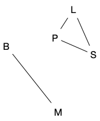
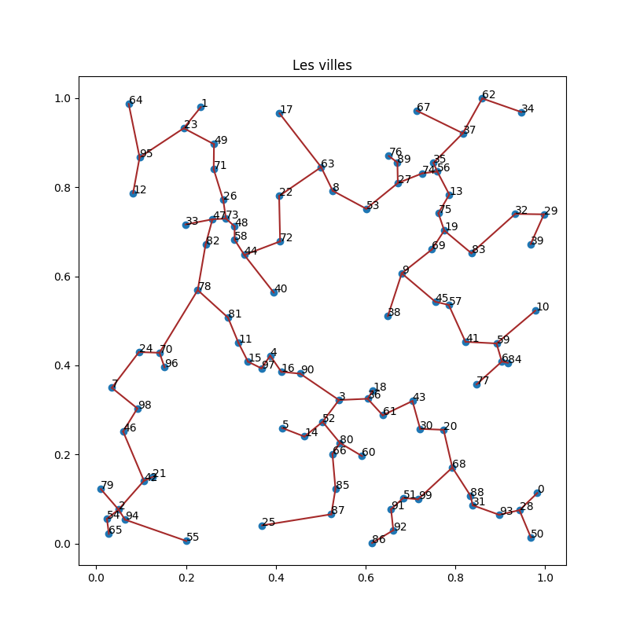
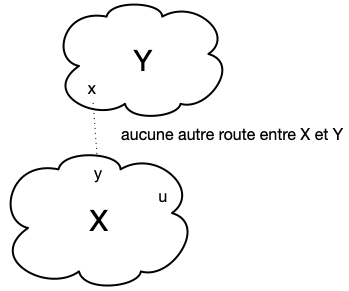
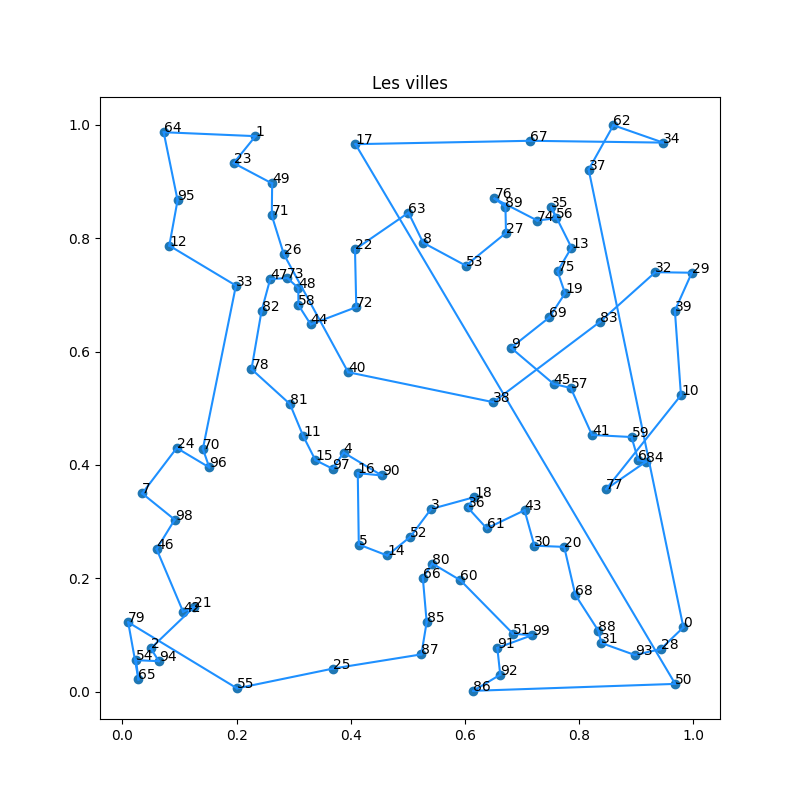
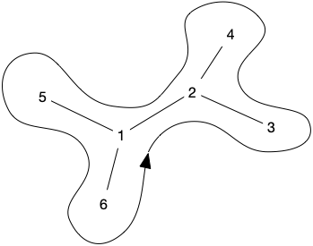

<!-- début résumé -->

Utilisation d'algorithmes gloutons pour résoudre des problèmes de cheminement.

<!-- end résumé -->


Les différents algorithmes que nous allons voir sont pour la plupart des cas particuliers d'algorithmes plus généraux de la théorie des graphes.

Les algorithmes présentés sont de plus pas forcément les meilleurs en terme de complexité.


Le problème que nous voulons résoudre est :


étant donné un ensemble de villes $V$ décrites par leurs coordonnées GPS et un prix de construction de route proportionnelle au kilomètre comment relier les villes entres-elles au prix le plus bas ?


Par exemple les 5 villes ci-dessous :


Aucune route n'a été construite et on ne peut voyager de ville en ville.

Dans la figure ci-dessous un réseau routier a été construit. À gauche toutes les routes possibles ont été construites, ce qui est pratique si ont veut voyager vite entre deux villes mais c'est beaucoup trop cher (et dangereux, regardez le nombre de croisements !). À droite seul le nombre minimum de routes entre villes voisines pour pouvoir aller de n'importe quelle ville à n'importe quelle autre ville en suivant le réseau routier ont été construites.



Pourquoi est-on sur que la figure de droite possède le nombre minimum de routes ?


Si on supprime une route (n'importe laquelle) dans la figure de droite, on déconnecte le réseau en deux.

Alors que dans la figure de gauche on peu au minimum supprimer 4 routes (tous les routes partant d'une ville) et au mieux 6 (pour arriver à la figure de droite).


## Nuages de points

Nous allons dans les exemples qui suivent utiliser le même jeu de données. Nous avons généré en python 100 points en deux dimensions dont les abscisses et ordonnées sont entre 0 et 1.



Code python pour générer les 100 villes que l'on stocke dans un [dictionnaire](../structure-dictionnaire) :

```python
import random

villes = dict()

for nom in range(100):
    villes[str(nom)] = (random.random(), random.random())

return villes
```

Puis que l'on affiche avec matplotlib :

```python
import matplotlib.pyplot as plt

TAILLE = 10

x = []
y = []
label = []
for nom, (long, lat) in villes.items():
    x.append(long)
    y.append(lat)

    label.append(nom)

height = max(y) - min(y)
width = max(x) - min(x)

fig, ax = plt.subplots(figsize=(TAILLE, TAILLE * height / width))
ax.set_title("Les villes")

ax.scatter(x, y)
for i in range(len(x)):
    ax.text(x[i], y[i], label[i])

for x, y in segments:
    ax.plot(
        [villes[x][0], villes[y][0]],
        [villes[x][1], villes[y][1]],
        color=mcolors.CSS4_COLORS["brown"],
    )
plt.show()
```



Pour ce qui va suivre, une hypothèse souvent utilisée est :


L'ensemble des points est en [position générale](https://fr.wikipedia.org/wiki/Position_g%C3%A9n%C3%A9rale), c'est à dire que **3 points ne sont jamais alignés**.


Ce n'est pas une contrainte forte puisque la probabilité que ça arrive est nulle (si on tire au hasard des coordonnées réelles aux points), et – même si ça arrivait – il suffirait de déplacer un des trois points d'epsilon pour que ça n'arrive plus.

La raison fondamentale de cette hypothèse est que :


Si $P$ est un ensemble de points en ***position générale***, alors pour toute paire de points $x, y \in P$ aucun autre point de $P$ n'est sur le segment entre $x$ et $y$.


Ceci va simplifier nombre de preuves de ce qui va suivre.

## Routes chemins et Connexité

Nous devons créer un réseau routier entre les villes pour les relier. Nous avons seulement besoin de créer des segments entre villes, ce qui minimisera le nombre de kilomètres de routes.



Une ***route*** est le segment entre $x$ et $y$. Un ***réseau routier*** est un ensemble de routes (segments).



Analysons un peu ce que nous pouvons faire.

### Chemins



Un ***chemin*** entre deux villes $x$ et $y$ est soit :

* la ***route*** entre $x$ et $y$
* soit une suite $v_1\dots v_{i-1}v_i\dots v_n$ tel que :
  * $v_1 = x$, $v_n = y$
  * les villes $v_{i-1}$ et $v_{i}$ sont différentes et reliées par une route pour tout $1 < i \leq n$
  * pour un chemin $v_1\dots v_{i-1}v_i\dots v_n$ entre $v_1$ et $v_n$ les villes $v_2$ à $v_{n-1}$ sont dites ***villes de passage***


La notion de chemin s'écrit très bien sous la forme d'une relation $C$ sur un ensemble $V$ de villes. On dira que $xCy$ s'il existe un chemin entre $x$ et $y$. Cette relation est une [relation d'équivalence](https://fr.wikipedia.org/wiki/Relation_d%27%C3%A9quivalence) car elle est :

* réflexive $xCx$ (le singleton $x$ permet de relier $x$ à lui-même)
* symétrique $xCy$ implique $yCx$ (les routes sont à double sens)
* transitive $xCy$ et $yCz$ implique $xCz$ (on colle la suite allant de $x$ à $y$ à la suite allant de $y$ à $z$)

L'intérêt de cette formalisation est qu'elle montre que la relation des chemins $C$ se crée :

1. en considérant la relation $R$ des routes du réseau routier ($xRy$ s'il existe une route entre $x$ et $y$ dans le réseau)
2. en fermant cette relation par transitivité

À première vue créer $C$ à partir de $R$ semble compliqué, mais l'exercice ci-après (qui explicite l'algorithme de [Algorithme de Roy](https://fr.wikipedia.org/wiki/Algorithme_de_Warshall)) montre qu'on peut le faire très simplement en utilisant le principe de la [programmation dynamique](https://fr.wikipedia.org/wiki/Programmation_dynamique).


Soit $V = \\{ v_1, \dots v_n \\}$ les villes d'un réseau routier et $R$ sa relation route associée.

Montrez que si on note $V_i = \\{ v_1, \dots v_i \\}$, un chemin entre les villes $x$ et$y$ ayant comme villes de passage uniquement des éléments de $V_{i}$ peut de déduire de chemins ayant uniquement des villes de $V_{i-1}$ comme villes de passage.


Il existe un chemin entre $x$ et $y$ ayant comme villes de passage uniquement des éléments de $V_{i}$ si :

* soit il existe un chemin entre $x$ et $y$ ayant comme villes de passage uniquement des éléments de $V_{i-1}$
* soit il existe les deux chemins suivants :
  * un chemin entre $x$ et $v_i$  ayant comme villes de passage uniquement des éléments de $V_{i-1}$
  * un chemin entre $v_i$ et $y$  ayant comme villes de passage uniquement des éléments de $V_{i-1}$




Déduire de l'exercice précédent un algorithme en $\mathcal{O}(n^3)$ permettant de trouver la relation chemin à partir de la relation route.



On utilise la représentation matricielle des relations. On dira que $R[i][j]$ (*resp.* $C[i][j]$) est vrai s'il existe une route (*resp.* un chemin) entre $v_i$ et $v_j$ dans le réseau et que $R[i][j]$ (*resp.* $C[i][j]$) est faux sinon.

L'équation précédente s'écrit alors :

$C_k[i][j]$ est vrai si l'une ou l'autre des assertions suivant est vrai :

* $C_{k-1}[i][j]$ est vrai
* $C_{k-1}[i][k]$ et $C_{k-1}[k][j]$ sont vrais

Qui se résume en :

$$
C_k[i][j] = C_{k-1}[i][j] \text{ ou } (C_{k-1}[i][k] \text{ et } C_{k-1}[k][j])$$

Ce que l'on peut écrire en ré-écrivant sur la même relation :

```python
for i in range(n):
    for j in range(n):
        C[i][j] = R[i][j]

for k in range(n):
    for i in range(n):
        for j in range(n):
            C[i][j] = C[i][j] or (C[i][k] and C[k][j])
```



### Connexité

Le but final est d'obtenir un réseau routier où l'on puisse librement aller d'une ville à l'autre. Formalisons ceci en commençant par étudier des réseau routiers déjà constitués


Un réseau routier de villes est ***connexe*** si quelque soient deux villes $x$ et $y$, il existe un chemin entre $x$ et $y$.



Le fait que la notion de chemin (la relation $C$ de la partie précédente) soient une relation d'équivalence montre que le réseau routier est connexe si et seulement si cette relation n'admet qu'une seule classe d'équivalence ($C(x) = C(y)$ quelques soient les villes $x$ et $y$).


Si $C$ est une relation d'équivalence sur $V$, la ***classe d'équivalence*** de $x \in V$ est :

$$
C(x) = \\{ y | xCy, y \in V \\}
$$



Si un réseau routier n'est pas connexe, les classes d'équivalences de la relation chemin donnent les ***composantes connexes*** du réseau routier. Le réseau routier de la figure suivante contient 2 composantes connexes :



Notez que :


Si $V_1$ et $V_2$ sont deux composantes connexes d'un réseau routier alors :

* $V_1 \cap V_2 = \emptyset$
* si on ajoute **une** route entre une ville de $V_1$ et une ville de $V_2$, alors $V_1 \cup V_2$ devient une composantes connexe du nouveau réseau



Par exemple, en ajoutant la route entre B et P, on obtient un réseau routier connexe :


La propriété ci-dessus nous permet de créer un algorithme glouton permettant de trouver toutes les parties connexes d'un réseau routier uniquement à partir de sa relation route.

Algorithme composante connexe :

```text#
pour chaque ville v : R(v) = v
pour chaque route (x, y):
    si R(x) ≠ R(y):
        pour chaque ville z telle que R(z) = R(y):
            R(z) = R(x)
```


Lorsque l'on code l'algorithme il arrive souvent que l'on écrive changement de marques :

```text
pour chaque ville u:
    si R(u) == R(x) alors:
        R(u) = R(y)
```

Qui est faux.


Pourquoi est-ce faux ?


Si u vaut x, on change sa marque et plus aucun changements ne sera effectué pour les villes suivantes.

Il faut stocker la valeur test :

```text
à_changer = R(x)
pour chaque ville u:
    si R(u) == à_changer alors:
        R(u) = R(y)
```



Cet algorithme fonctionne grâce à la marque R qui définit le représentant de chaque ville. Montrons ça sur un exemple en reprenant le réseau ci-après et en affectant une couleur à chaque ville comme représentant :


Et en étudiant les routes dans l'ordre $(L, S)$, $(B, M)$, $(P, S)$ et enfin $(L, P)$ on obtient :


Notez que l'étude de la route $(L, P)$ ne produit aucun changement dans les représentants car la couleur de $L$ est déjà égale à la couleur de $P$.


A la fin de l'algorithme composantes connexes les villes ayant même valeur de $R$ forment une composante connexe.



On le prouve par récurrence sur le nombre de segments examinés :

> Apres $k$ routes examinés,  les composantes connexes du réseau formé de ces $k$ routes sont les ensembles de villes ayant même valeur de $R$

1. Lorsqu'il n'y aucune route examinée chaque ville a un représentant différent ce qui représente bien les composantes connexes d'un réseau vide
2. À chaque fois que l'on ajoute une route :
   * soit les deux villes ont même représentant et l'hypothèse de récurrence stipule qu'elles sont dans la même composante connexe
   * soit les deux villes ont un représentant différent et l'hypothèse de récurrence stipule qu'elles sont dans des composantes connexes différentes. L'ajout de la route regroupe les deux composantes en une seule, ce que l'on fait en leur associant un même représentant




Montrez qu'il ne peut y avoir plus de $n-1$ fois où la ligne 3 de l'algorithme est vérifiée.


À chaque fois que la ligne 3 de l'algorithme est vérifiée on regroupe deux composantes connexes. Or au départ il y en a $n$ et à la fin il ne peut y en avoir au minimum 1.


En déduire que la complexité d l'algorithme est en $\mathcal{O}(n^2)$


Il y a au pire $\frac{n(n-1)}{2}$ segments (un pour chaque couple) et la condition de la ligne 3 n'est vrai qu'au maximum $n-1$ fois.


## Création du réseau routier



* le ***coût de construction*** d'une route entre deux villes $x$ et $y$ est $K \cdot d(x, y)$ où $d(x, y)$ est la distance entre les coordonnées géographiques de $x$ et de $y$
* le ***coût de construction*** d'un réseau routier est la somme des coûts de construction des routes qui le composent.



On peut maintenant reformuler notre problème d'optimisation :


Trouver un réseau routier de coût de construction minimum pour notre ensemble de villes.


L'analyse préliminaire précédente nous permet d'aborder sereinement ce problème d'optimisation. On peut utiliser l'algorithme "composante connexe" en choisissant l'ordre dans lequel examiner les routes.

Cet ordre semble évident puisque l'on veut minimiser le coût : on examine les routes par coût croissant.

Commençons par écrire cet algorithme, initialement proposé par [Kruskal](https://fr.wikipedia.org/wiki/Algorithme_de_Kruskal) :

```text#
pour chaque ville v : R(v) = v
pour chaque route (x, y) examiné par distance croissante:
    si R(x) ≠ R(y):
        on ajoute (x, y) aux routes choisis
        pour chaque ville z telle que R(z) = R(y):
            R(z) = R(x)
```

L'étude précédente nous indique d'ores et déjà que :

1. on choisira exactement $n-1$ routes
2. le reseau routier formé des routes choisies sera connexe

Pour nos 100 villes, on trouve :




On suppose que l'algorithme de Kruskal nous rend une liste `routes`{.language-} dont les éléments sont des couples $(v1, v2)$ avec $v1$ et $v2$ des noms de villes.

Pour les prendre en compte dans le graphique, il faut créer des segments de coordonnées utilisable par la [fonction `plot`](https://matplotlib.org/stable/api/_as_gen/matplotlib.pyplot.plot.html).


 On en a aussi profité pour changer de couleur en utilisant [cette documentation](https://matplotlib.org/stable/gallery/color/named_colors.html)


```python
import matplotlib.pyplot as plt
import matplotlib.colors as mcolors

TAILLE = 10

x = []
y = []
label = []
for nom, (long, lat) in villes.items():
    x.append(long)
    y.append(lat)

    label.append(nom)

height = max(y) - min(y)
width = max(x) - min(x)

fig, ax = plt.subplots(figsize=(TAILLE, TAILLE * height / width))
ax.set_title("Les villes")

ax.scatter(x, y)
for i in range(len(x)):
    ax.text(x[i], y[i], label[i])

for x, y in routes:
    ax.plot(
        [villes[x][0], villes[y][0]],
        [villes[x][1], villes[y][1]],
        color=mcolors.CSS4_COLORS["brown"],
    )
plt.show()
```



Avant de montrer que l'algorithme de Kruskal est optimal, commençons par montrer une propriété intéressante de ce réseau :


Le réseau routier donné par l'algorithme de Kruskal ne contient pas de cycle.


S'il contenait un cycle, lors de l'ajout de la dernière route $(x, y)$ on aurait $R(x) = R(v)$ ce qui est impossible.



Montrons que l'algorithme est bien optimal :


L'algorithme de Kruskal produit un réseau de construction connexe à coût de construction minimal.



L'algorithme de Kruskal est un algorithme glouton, prouver son optimalité se fait en utilisant les techniques du cours :

1. On suppose que l'algorithme n'est pas optimal
2. On se donne une solution optimale qui coincide le plus longtemps possible avec la solution donnée par l'algorithme glouton
3. on prouve que l'on peut échanger un élément de la solution optimale  par le choix du glouton pour forger une solution optimale coïncidant plus longtemps avec celle-ci
4. contradiction

Soit $[r_1, \dots, r_{n-1}]$ la liste des routes choisies par Kruskal dans cet ordre. On suppose que ce n'est pas optimal et qu'il existe un réseau routier de coût de construction strictement plus petit.

Parmi tous les réseaux optimaux, on en choisit un qui coincide le plus longtemps possible avec notre algorithme glouton : $[r'_1, \dots, r'_m]$

On commence par remarquer que :

* $m \geq n-1$ sinon le réseau ne peut être connexe
* si $r_i = r'_i$ pour $1\leq i \leq n-1$ alors le réseau optimal ne l'est pas puisque la solution donnée par Kruskal est connexe.

Les deux remarques précédentes nous indiquent qu'il existe $1 \leq i^\star < n-1$ tel que :

* $r_i = r'_i$ pour $1\leq i < i^\star$
* $r_{i^\star} \neq r'_{i^\star}$

<div>
$$
\begin{array}{ccc|c|cc}
r_1&\dots&r_{i-1}&r_{i^\star}& \dots & r_{n-1}&&\\
\dots &=&\dots& \neq&&?&&\\
r'_1&\dots&r'_{i-1}&r'_{i^\star}& \dots & r'_{n-1} &\dots&r'_m\\
\end{array}
$$
</div>

Notons $r_{i^\star}=(x, y)$. Si l'on supprime $r_{i^\star}$ du réseau obtenu par Kruskal, on déconnecte le réseau en 2 composantes connexes $X$ et $Y$ avec $x \in X$ et $y\in Y$ :



Chaque ville est donc soit dans la composante connexe $X$ soit dans la composante connexe $Y$. En représentant ceci dans le réseau optimal on a :


Les éléments de $X$ (en orange) et de $Y$ (en bleu) ne forment pas des composantes connexes dans le réseau optimal, **mais** en considérant le chemin allant de $x$ à $y$ dans ce réseau il existe une route dont une dés extrémités est dans $X$ et l'autre dans $Y$ (puisque $x$ est orange et $y$ est bleu il y a bien un moment où les couleurs vont se croiser).

Notons cette route $(u, v)$ (avec $u \in X$ et $v \in Y$). Par construction, cette route ne peut être dans la solution obtenue par l'algorithme de Kruskal (les extrémités de toutes les routes sont de même couleur, à par pour la route $(x, y)$). De plus lors du choix de $r_{i^\star}$, on avait $R(u) \neq R(v)$ (sinon il existerait un chemin reliant $u$ à $v$ pour le réseau de Kruskal ne passant pas par $(x, y)$ ce qui est impossible) : si l'algorithme a choisi $(x, y)$ plutôt que $(u, v)$ c'est que $d(u, v) \geq d(x, y)$.

Tout ce qui précède montre que l'on peut supprimer la route $(u, v)$ du réseau optimal (on le déconnecte en 2 parties $U$ et $V$ avec $u, x \in U$ et $v, y \in V$) puis y ajouter la route $(x, y)$ pour le reconnecter :


Au final, on obtient :

* un réseau connexe
* de coût inférieur au réseau optimal
* qui coincide plus longtemps avec l'algorithme obtenu pas Kruskal

Ce qui est une contradiction puisque le nouveau réseau coïncide plus longtemps avec celui obtenu par Kruskal.



Le réseau obtenu par l'algorithme de Kruskal est optimal ! Il a alors la propriété de ne pas contenir de croisements (de segments qui s'intersectent).


Un réseau routier de coût de construction minimal n'a pas d'intersection de segments


Supposons que le segment $(u, v)$ croise le segment $(x, y)$ dans une solution optimale. On se retrouve alors dans le cadre de la figure ci-dessous :


Avec $uxvy$ qui forme un [quadrilatère](https://fr.wikipedia.org/wiki/Quadrilat%C3%A8re) convexe.

En supprimant le segment $(x, y)$ du réseau on déconnecte $x$ de $y$. Les deux villes $u$ et $v$ se retrouvent alors dans la même composante connexe, disons celle de $y$. En supprimant ensuite le segment $(u, v)$ on déconnecte $u$ de $v$ et on peut supposer sans perte de généralité que $y$ se retrouve dans la composante connexe de $v$.

On en conclut que les 3 segments $(x, u)$, $(x, v)$ et $(y, u)$ ne font pas partie du réseau et qu'en supprimant les segments $(x, y)$ et $(u, v)$ de celui-ci on obtient 3 composantes connexes :

* la composante connexe $A$ contenant $x$
* la composante connexe $B$ contenant $u$
* la composante connexe $C$ contenant $y$ et $v$


Le quadrilatère $uxvy$ étant convexe, on a que $d(x, y) + d(u, v) > d(x, v) + d(u, y)$ et donc en ajoutant les segments $(x, v)$ et $(u, y)$ on reconnecte le réseau et il est de coût strictement inférieur.



## Chemins entre villes

Le réseau de coût de construction minimal est connexe et ne contient pas de cycle. Il n'existe donc pour chaque couple de villes qu'un unique chemin.

L'algorithme que l'on va créer dans les exercices suivants et qui permet soit de visiter toutes les villes soit de trouver un chemin entre deux villes est connu sous le nom de [parcours en profondeur](https://fr.wikipedia.org/wiki/Algorithme_de_parcours_en_profondeur). Il est très efficace et utilisé dans de nombreuses occasions.


En utilisant la méthode du [backtracking](https://en.wikipedia.org/wiki/Backtracking) (on va le plus loin possible et dès que l'on se retrouve dans une impasse on rebrousse chemin), décrivez un algorithme permettant, à partir d'une ville de départ, de parcourir tout le réseau en suivant uniquement les routes. Il devra afficher à l'écran la ville où l'on se trouve.

Cet algorithme doit être récursif. Il doit parcourir toutes les routes et se relancer dès qu'il trouve une route permettant de progresser, c'est à dire une route dont une des extrémités est la ville courante et l'autre extrémité n'est pas la ville d'où l'on vient.

Cet algorithme doit donc avoir comme paramètre :

* la ville courante
* la ville précédente (pour éviter de rebrousser chemin)




```text
fonction routes_rec(précédente, courante):
    affiche à l'écran : courante
    pour chaque route (u, v) du réseau routier:
        si u == courante et v != précédente:
                routes_rec(u, v)
```

Prenons par exemple le réseau ci-dessous :


Avec 1 comme ville de départ et en supposant l'on regarde les villes par ordre croissant :

1. `trouve_rec(1, 1)`{.language-}. Il va afficher 1, puis exécuter :
   1. `trouve_rec(1, 2)`{.language-} :
      1. va afficher 2
      2. puis va exécuter :
         1. `trouve_rec(2, 3)`{.language-}
            1. va afficher 3
            2. s'arrête, l'algorithme ne peut pus progresser
         2. `trouve_rec(2, 4)`{.language-} :
            1. va afficher 4
            2. s'arrête, l'algorithme ne peut pus progresser
   2. `trouve_rec(1, 5)`{.language-}
      1. va afficher 5
      2. s'arrête, l'algorithme ne peut pus progresser
   3. `trouve_rec(1, 6)`{.language-} :
      1. va afficher 6
      2. s'arrête, l'algorithme ne peut pus progresser

Une fois toutes ces récursions effectuées, l'algorithme s'arrête.

<div id="profondeur"></div>

Améliorez la méthode précédente pour qu'elle rende le chemin parcouru. Pour cela ajoutez un paramètre chemin à l'algorithme qui va grandir à chaque nouvelle ville visitée.

Pour cela, vous ajoutez un chemin en paramètre, qui sera passé à toutes les récursions de l'algorithme. Ce chemin sera **modifié** à chaque progression (c'est à dire lorsqu'une nouvelle ville est découverte, donc lorsque le précédent algorithme l'affichait à l'écran).

Il est indispensable que l'objet soit modifié et non recréer pour que toutes les récursions de l'algorithme partagent le **même** objet.




```text
fonction routes_rec(précédente, courante, chemin):
    ajoute courante à la fin du chemin
    pour chaque route (u, v) du réseau routier:
        si u == courante et v != précédente:
                routes_rec(u, v)
```

L'algorithme récursif ne va pas rendre quelque chose, mais il va modifier petit à petit le paramètre chemin. On exécute alors la fonction de la façon suivante :

```text
chemin = [] 
route_rec(1, 1, chemin)
affiche à l'écran : chemin
```

L'algorithme va afficher l'ordre de passage de chaque ville. Si cet ordre est identique à l'exercice précédent il affichera :

```text
[1, 2, 3, 4, 5, 6]
```




On veut maintenant chercher une ville particulière et arrêter les récursions une fois cette ville trouvée.

La pile de récursion (les algorithmes lancés mais pas encore terminés) contiennent exactement le chemin entre cette ville et le départ. Trouvez un moyen pour le récupérer.

Par exemple :

* commencer comme précédemment par un chemin vide
* ajouter la destination à la fin du chemin une fois celle-ci trouvée (le chemin est alors non vide et contient juste lq destination) puis sortir de l'algorithme
* à chaque retour de récursion (la ligne suivant un appel de récursion), si le chemin est non vide, ou ajoute la ville courante à la fin du chemin et on sort de l'algorithme.



```text
fonction routes_rec(précédente, courante, destination, chemin):
    si courante == destination:
        ajoute courante à la fin de chemin
        retour
    pour chaque route (u, v) du réseau routier:
        si u == courante et v != précédente:
                routes_rec(u, v)
                si chemin est non vide:
                    ajoute courante à la fin de chemin
                    retour

```

Si cet ordre est identique à l'exercice précédent, en lançant l'algorithme avec :

```text
chemin = [] 
route_rec(1, 1, 4, chemin)
affiche à l'écran : chemin
```

Il affichera :

```text
[4, 2, 1]
```



On affiche le chemin entre les villes 0 et 1 de l'exemple :


## Cycles

Le réseau routier de coût de construction minimum est parfait pour relier les villes à moindre coût. En revanche, il n'est pas robuste aux pannes ou aux blocages. Une seule route de bloquée et le réseau n'est plus connexe.

L'idée est alors de chercher un cycle reliant toutes les villes. Pour tout couple de ville, il existe alors deux chemins disjoints permettant de les relier.

Ce problème est cependant souvent vu sous un autre angle, celui d'un [voyageur de commerce](https://fr.wikipedia.org/wiki/Probl%C3%A8me_du_voyageur_de_commerce) voulant visiter toutes les villes :


Étant donné un ensemble de villes, trouver l'itinéraire le plus court passant par chaque ville une et une seule fois.


Sous la forme d'un problème d'optimisation on cherche, pour un ensemble de villes $V$ donné, un cycle $v_1 v_2\dots v_1$ passant par toutes les villes 1 fois minimisant la quantité :

$$
\sum_{i=1}^nd(v_i, v_{i+1}) + d(v_n, v_1)
$$


Combien de solutions possibles possède un problème du voyageur de commerce à $n$ villes ?


Pour un départ fixé, une permutation des $n - 1$ villes restante produit une solution. Comme la permutation opposée revient à parcourir le cycle dans l'autre sens, il y a $\frac{(n-1)!}{2}$ solutions possibles.

Pour nos 100 ville, cela fit de l'ordre de $4.66\cdot 10^{155}$ solutions possibles.



### Algorithme glouton

Le nombre astronomique de solutions possibles nous empêche de toutes les essayer. De plus, on peut montrer (nous ne le ferons pas ici) qu'il est illusoire de trouver une solution exacte (du moins pendant une séance de code) car le problème du voyageur de commerce est [NP-complet](https://fr.wikipedia.org/wiki/Probl%C3%A8me_NP-complet) (plus précisément NP-difficile, mais ne chipotons pas).

Couramment, l'algorithme glouton utilisé pour approximer ce problème est :

1. choisir une ville de départ qui constitue le départ du cycle
2. tant que toutes les villes n'ont pas été ajoutée au cycle : on ajoute la ville la plus proche du dernier élément de celui-ci.

Pour notre exemple, on trouve, en partant de la ville $0$ (la dernière ville traversée est la $17$):


> On obtient, pour K =1, un coût de construction de : 10.475838825929351

On voit bien que l'algorithme n'est pas vraiment optimal...


Exhibez un exemple simple pour lequel l'algorithme glouton ne trouvera jamais la solution optimale.



En utilisant la distance euclidienne, l'algorithme glouton ne trouvera jamais la bonne solution pour les 6 points de la figure suivante :




### Optimisation

La représentation graphique de la solution montre de nombreux croisements, ce qui prouve que notre solution est bien améliorable :


Une solution du problème du voyageur de commerce n'a pas de croisements.



Supposons qu'un cycle comporte un croisement. On peut alors sans perte de généralité considérer que l'on est dans le cas ci-après :


Le quadrilatère $xvyu$ est alors convexe et en supprimant les segments $(x, y)$ et $(u, v)$ on obtient les composantes connexes $A$ et $B$.
Le cycle ci-après, obtenu en changeant les diagonales du quadrilatère par deux de ses côtés, est alors strictement meilleur :




C'est l'idée sous-jacente de la méthode d'optimisation [2-opt](https://fr.wikipedia.org/wiki/2-opt) :

1. trouver un cycle potentiel
2. chercher un croisement et le supprimer
3. retour en 2

On peut itérativement chercher les croisements jusqu'à leurs disparitions complète, ou prendre un certain nombre de couples de segments et le décroiser si nécessaire. C'est cette dernière façon de faire qui est privilégiée pour de grands cycles.

Par exemple ci-dessous, on a décroisé les segment $(0, 17)$ et $(37, 50)$ :



Notre cycle étant très petit, on peut se permettre de faire tous les cas. La figure suivante montre le résultat de 100 itérations de tous les cas possibles (on exécute 100 fois un test de tous les décroisements possibles) :


> On obtient, pour K =1, un coût de construction de : 8.606090557637186

C'est bien mieux, et il n'y a plus de croisements.


Sans croisement ne veut pas forcément dire optimal !


## Algorithmes à performances garanties

L'algorithme glouton précédant ainsi que son optimisation ne garantissent rien sur la solution. Il existe cependant des algorithmes heuristiques dont on peut garantir la performance.

On peut commencer par donner une borne min du coût du voyageur de commerce :


Montrer que le coût du voyageur de commerce est plus grand que le coût du réseau connexe optimal


Le cycle est est réseau connexe, son coût est donc forcément plus important.


### Du réseau au cycle

L'idée est de reprendre le réseau optimal et de le parcourir entièrement en suivant ses routes. Par exemple, en considérant le réseau ci-dessous :


On peut le parcourir en suivant ses routes de cette façon par exemple :



Ce qui donne le cycle :

$$
[1, 2, 3, 2, 4, 2, 1, 5, 1, 6]
$$

Il parcours 2 fois le réseau son coût est donc de deux fois le coût du réseau connexe optimal.

En supprimant les sommets déjà parcourus, on obtient le cycle :

$$
[1, 2, 3, 4, 5, 6]
$$

Remarquez que c'est l'[algorithme du parcours en profondeur](./#profondeur) qui ajoute dans chemin toutes les villes parcouru permet de trouver ce cycle.

Le coût de ce parcours est plus faible que le parcours précédent (on a une distance, donc elle respecte l'inégalité triangulaire). On en conclut que :


Le coût du cycle issu du parcours du réseau optimal est au pire deux fois plus grans que le cycle optimal.


Le parcours donne, sur nos 100 villes :


> On obtient, pour K =1, un coût de construction de : 10.608836994373258

Ce qui après optimisation (100 passes) devient :


> On obtient, pour K =1, un coût de construction de : 8.596669623756684

### Algorithme de Christofides

L'[algorithme de Christofides](https://fr.wikipedia.org/wiki/Algorithme_de_Christofides) est une amélioration de l'algorithme précédent. On peut montrer qu'il est au pire 1.5 fos plus mauvais que le cycle optimal.

C'est d plus la meilleure approximation connue.
