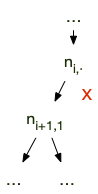
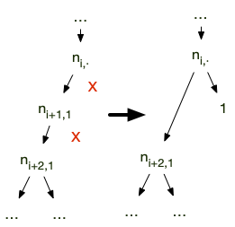
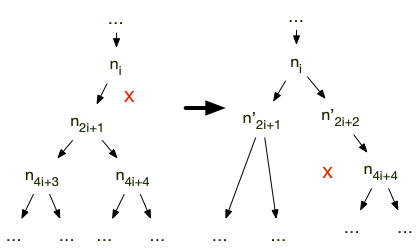

<!-- début résumé -->

Etude du problème du tri puis analyse de complexité de quelques algorithmes de tris paradigmatiques.

<!-- end résumé -->

Les informaticiens adorent les [algorithmes de tris](https://fr.wikipedia.org/wiki/). Pas parce qu'ils aiment l'ordre — loin de là — mais parce qu'il existe des millions de façons différentes de trier. Commençons par définir le problème :



* **nom** : tri
* **données** : un tableau d'entiers
* **réponse** : un tableau contenant les valeurs du tableau en entrée triées selon l'ordre croissant



## Problème de reconnaissance

Commençons par travailler sur un problème connexe au problème du tri, celui de la reconnaissance :



* **nom** : est trié ?
* **données** : un tableau $T$ d'entiers
* **réponse** : $T$ est-il trié de façon croissante ?
* **réponse** : OUI ou NON.



### Algorithme { #algo-est-trie }

```python#
def est_trie(T):

    for i in range(1, len(T)):
        if T[i] < T[i-1]:
            return False
    return True
```

#### Fonctionnement

L'algorithme rend bien :

* `True`{.language-} pour `est_trie([42])`{.language-}
* `False`{.language-} pour `est_trie([4, 2])`{.language-}
* `True`{.language-} pour `est_trie([2, 4])`{.language-}

#### Preuve

La finitude de l'algorithme est claire puisqu'il n'y a qu'une boucle for avec autant d'itérations que la taille du tableau passé en entrée.

Le preuve en démontrant l'invariant de boucle : à la fin d'un itération, les $i + 1$ premiers éléments du tableau sont triés.

1. à la fin de la première itération, si l'on est pas sorti de la boucle c'est que $T[i] \geq T[i-1]$ pour $i=1$ : les 2 premiers éléments du tableau sont bien triés.
2. Si l'invariant est vrai à la fin de l'itération $i-1$, à la fin de l'itération $i$ on à $T[i] \geq T[i-1]$ et comme les $i + 1$ premiers éléments du tableau sont triés : les $i + 1$ premiers éléments du tableau sont triés.

Au final :

* L'invariant prouve que : si on arrive à la ligne 6 de l'algorithme c'est que les $n$ premiers éléments du tableau sont triés.
* si on utilise le retour de la ligne 5 c'est qu'il existe $i$ avec $T[i] < T[i-1]$, donc $T$ ne peut être trié.


L'algorithme `est_trie`{.language-} est une solution au problème *"est trié ?"*


#### Complexité de l'algorithme

Ligne à ligne :

1. définition de la fonction $\mathcal{O}(1)$
2. —
3. une boucle for de $k$ itérations
4. un tests de deux valeurs dans un tableau : $\mathcal{O}(1)$
5. un retour de fonction $\mathcal{O}(1)$
6. un retour de fonction $\mathcal{O}(1)$

Que l'on sorte par le retour de la ligne 5 ou 6, le complexité est : $\mathcal{O}(k)$. Dans le cas le pire, on parcourt tout le tableau, donc :


La complexité de l'algorithme `est_trie`{.language-} est $\mathcal{O}(n)$ avec $n$ la taille du tableau en entrée.


### Complexité du problème

Comme toute case du tableau peut rendre le tableau non trié, on utilise l'argument de [complexité du problème de la *"recherche"*](../../théorie/complexité-problème#complexité-recherche), un algorithme résolvant ce problème doit considérer toutes les cases du tableau et donc une borne min du problème *"est trié ?"* est $\mathcal{O}(n)$ où $n$ est la taille du tableau en entrée. Comme la complexité de `est_trie`{.language-}  est également de $\mathcal{O}(n)$. On en conclut :


La complexité du problème *"est trié ?"* est de $\mathcal{O}(n)$ où $n$ est la taille du tableau en entrée.


## Bornes du problème

### Borne maximum { #borne-max }

> TBD : pas vu les mélanges. A refaire.

Étant donné un tableau $T$ de taille $n$, on peut utiliser l'algorithme `permutations(T)`{.language-} de l'[étude sur les mélanges](../étude-mélange#algo-toutes-permutations) qui rend toutes les permutations d'un tableau donné en $\mathcal{O}((n+2)!)$ opérations.

Par exemple, l'algorithme `permutations([1, 3, 2])`{.language-} rendra :

```python
[[1, 3, 2], [1, 2, 3], [3, 1, 2], [3, 2, 1], [2, 1, 3], [2, 3, 1]]
```

C'est une complexité énorme, mais cela nous permet de résoudre notre problème puisque l'algorithme `est_trie`{.language-} permet de savoir si un tableau est trié en $\mathcal{O}(n)$ opérations : on peut résoudre le problème *"trie"* en énumérant toutes les permutations du tableau passé en paramètre et en vérifiant pour chacune d'entre elle s'il est trié ou non.

Un proposition d'algorithme peut alors être :

```text
def trie_long(T):
    possibles = permutations(T)
    pour chaque tableau de possibles:
        si est_trie(tableau):
            rendre tableau
```

La complexité de `trie_long`{.language-} est égale à la complexité de `permutations`{.language-}  ($\mathcal{O}(n+2)!$) plus la complexité de  `est_trie`{.language-} ($\mathcal{O}(n)$) multiplié par le nombre de permutations ($n!$) : ce qui donne une complexité finale de $\mathcal{O}(n+2)!$.


Une borne maximum du problème *"tri"* existe, et est de complexité $\mathcal{O}((n+2)!)$ où $n$ est la taille du tableau passé en entrée.


Comme [n! est trop gros](../complexité-max-min#n_factoriel), ce n'est vraiment pas un algorithme à utiliser si on peut faire mieux... Mais il nous permet d'énoncer la propriété :


Pour tout problème algorithmique, s'il existe :

* un algorithme énumérant tous les cas possibles
* un algorithme permettant de vérifier si un cas donné est une solution

Alors la combinaison des deux algorithmes est une solution au problème initial.


Souvent les algorithmes produits par la remarque précédente ne sont pas optimaux car on explore bien trop de cas.

### Borne minimum

Si les éléments du tableau à trier sont tous différents, les permutations de celui-ci sont toutes différentes et une seule est la solution au problème "tri".

Par exemple, pour un tableau à trois éléments :

1. $[1, 2, 3]$
2. $[1, 3, 2]$
3. $[2, 1, 3]$
4. $[2, 3, 1]$
5. $[3, 1, 2]$
6. $[3, 2, 1]$

Quelque soit la forme de l'entrée (de 1 à 6), l'algorithme de tri doit rendre la forme 1 : un algorithme de tri doit pouvoir distinguer parmi toutes les permutations du tableau. Comme il y a $n!$  permutations différentes pour un tableau de taille $n$ dont les éléments sont deux à deux différents, tout algorithme de tri doit pouvoir distinguer parmi $n!$ choix, en utilisant la propriété de [nombre de cas à distinguer](../../théorie/complexité-problème#n-test-2n) vue dans la complexité du problème de la *"recherche ordonnée"*, on en déduit que :

Tout algorithme de tri d'un tableau à $n$ élément doit distinguer parmi $n!$ cas, il est donc au minimum de complexité $\mathcal{O}(\ln(n!))$. On rend cette borne min un peu plus jolie en utilisant le fait que ;


Toute fonction en $\mathcal{O}(\ln(n!))$ est également une fonction en $\mathcal{O}(n\ln(n))$ et réciproquement.



On a :

$$ (\frac{n}{2})^{\frac{n}{2}} \leq n \cdot (n-1) \cdot \ ...\ \cdot \frac{n}{2} \leq n! = n \cdot (n-1) \ ... \ \cdot 1 \leq n \cdot \ ...\  \cdot n = n ^n$$

Donc, en passant au $\ln$ :

$$
\ln((\frac{n}{2})^{\frac{n}{2}}) \leq \ln(n!) \leq \ln(n^n)
$$

Et donc, pour $n \geq 4$, on a l'encadrement suivant :

$$
\frac{n}{2}\ln(\frac{n}{2}) \leq \ln(n!) \leq n\ln(n)
$$

Poursuivons en triturant $\ln(\frac{n}{2})$ :

<div>
$$
\begin{array}{lclr}
\ln(\frac{n}{2}) &= &\frac{1}{2}\ln(\frac{n}{2}) + \frac{1}{2}\ln(\frac{n}{2})&\\
\ln(\frac{n}{2}) &\geq& \frac{1}{2}\ln(\frac{4}{2}) + \frac{1}{2}\ln(\frac{n}{2}) & (\mbox{pour } n \geq 4)\\
\ln(\frac{n}{2}) &\geq& \frac{1}{2}(\ln(2) + \ln(\frac{n}{2})) & (\mbox{pour } n \geq 4)\\
\ln(\frac{n}{2}) &\geq& \frac{1}{2}(\ln(2\cdot \frac{n}{2})) & (\mbox{pour } n \geq 4)\\
\ln(\frac{n}{2}) &\geq& \frac{1}{2}(\ln(n)) & (\mbox{pour } n \geq 4)\\
\end{array}
$$
</div>

On combine cette inégalité à notre encadrement précédent pour trouver :

$$
\frac{n}{2}(\frac{1}{2}(\ln(n))) \leq \ln(n!) \leq n\ln(n)
$$

Ce qui se dérive directement, pour $n \geq 4$, en :

$$\frac{1}{4} \leq \frac{\ln(n!)}{n\ln(n)} \leq 1$$

Enfin, on peut montrer les équivalences de $\mathcal{O}$ :

* si $g(n)$ est en $\mathcal{O}(\ln(n!))$ il existe $N_0$ et $C$ tel que : $g(n) < C \cdot \ln(n!)$ pour n > $N_0$. Pour $N_1 = \max(N_0, 4)$ on a donc $g(n) < C \cdot \ln(n!) < C \cdot n\ln(n)$ : $g(n)$ est en $\mathcal{O}(n\ln(n))$.
* si $g(n)$ est en $\mathcal{O}(n\ln(n))$ il existe $N_0$ et $C$ tel que : $g(n) < C \cdot n\ln(n)$ pour n > $N_0$. Pour $N_1 = \max(N_0, 4)$ on a donc $g(n) < C \cdot \ln_2(n!) < C \cdot 4 \cdot \ln(n!)$ : $g(n)$ est en $\mathcal{O}(\ln(n!))$.




Tout algorithme de tri d'une liste à $n$ éléments a au moins une complexité de $\mathcal{O}(n\ln(n))$ opérations.


Une borne min du problème du *"tri"* est donc $\mathcal{O}(n\ln(n))$ où $n$ est la taille du tableau en entrée, mais on ne sait pas encore si un tel algorithme existe.

## Tris *simples*

Notre algorithme pour trier un tableau est un monstre de complexité. Il en existe de très simples et de complexité bien plus faible. Nous en montrons 2, classiques.

### Tri par sélection { #tri-sélection }

L'algorithme procède alors ainsi : à chaque itération de l'algorithme, on place à l'indice $i$ du tableau son $i$-ème plus petit élément.

On en déduit l'algorithme en pseudo-code suivant :

```python#
def sélection(T):
    for i in range(len(T) - 1):
        min_index = i
        for j in range(i + 1, len(T)):
            if T[j] < T[min_index]:
                min_index = j
        T[i], T[min_index] = T[min_index], T[i]
```

L'algorithme `sélection`{.language-} **modifie** le tableau passé en paramètre. On appelle ces algorithmes [in place](https://en.wikipedia.org/wiki/In-place_algorithm) car ils ne rendent rien, mais modifient les données en entrées.

#### Fonctionnement { #fonctionnement-sélection }

On vérifie que l'algorithme fonctionne pour :

* un petit tableau trié : `[1, 2, 3]`{.language-}
* un petit tableau non trié où le plus petit est en dernière place : `[3, 2, 1]`{.language-}

#### Preuve { #preuve-sélection }

Le principe de fonctionnement est clair. Il reste à prouver que c'est bien ce que l'algorithme `sélection`{.language-} fait.

1. la boucle `for`{.language-} de la ligne 4 trouve l'indice du plus petit élément du tableau `T[i:]`{.language-}.
2. la ligne 7 échange le minimum du tableau `T[i:]`{.language-} avec `T[i]`{.language-}
3. comme la boucle `for`{.language-} de la ligne 2 incrémente $i$, on a l'invariant de boucle : *"à la fin de chaque étape $i$ de l'algorithme les $i$ plus petites valeurs du tableau sont triées aux $i$ premiers indices du tableau"*

#### Complexités { #complexités-sélection }

On suppose que la taille du tableau est $n$.

Ligne à ligne :

1. début de fonction : $\mathcal{O}(1)$
2. une boucle de $n-1$ itérations
3. une affectation $\mathcal{O}(1)$
4. une boucle de $n-i-1$ itérations ($i$ est la variable définie ligne 2)
5. un test et deux valeurs d'un tableau : $\mathcal{O}(1)$
6. une affectation : $\mathcal{O}(1)$
7. deux affectation et quatre valeurs d'un tableau : $\mathcal{O}(1)$

Le nombre d'itérations de la boucle for de la ligne 4 n'est pas constant, mais il décroît puisque $i$ augmente à chaque itération de la boucle `for`de la ligne 2. On peut alors utiliser la [règle de croissance](../complexité-max-min#règle-croissance) pour utiliser le maximum, $n-1$, pour le calcul de la complexité.

Ce qui donne une complexité de :

<div>
$$
\begin{array}{lcl}
C & = & \mathcal{O}(1) + \\
&& (n-1) \cdot (\\
&& \mathcal{O}(1) + \\
&& (n-1) \cdot ( \\
&& \mathcal{O}(1) + \\
&& \mathcal{O}(1)) + \\
&& \mathcal{O}(1)) \\
& = & \mathcal{O}(1) + (n-1) \cdot (\mathcal{O}(1) + (n-1) \cdot (\mathcal{O}(1))\\
& = & \mathcal{O}(n^2) \\
\end{array}
$$
</div>

Le nombre d'itérations est constant quelque soit le tableau, on a donc :


La complexité de l'algorithme `sélection`{.language-} est ($n$ est la taille du tableau passé en entrée) :

* la **complexité min** vaut $\mathcal{O}(n^2)$
* la **complexité (max)** vaut $\mathcal{O}(n^2)$
* la **complexité en moyenne** vaut également $\mathcal{O}(n^2)$ (car les complexités min et max sont égales)



### Tri par insertion { #tri-insertion }

Le tri par insertion est une extension de l'[algorithme `est_trie`](./#algorithme-algo-est-trie). Plutôt que de rendre `False`{.language-} il répare. L'algorithme `est_trie`{.language-} répond `False`{.language-} au plus petit `i`{.language-} tel que `T[i] < T[i-1]`{.language-}. On est alors dans le cas où :

* `T[:i]`{.language-} est trié
* et `T[i] < T[i-1]`{.language-}

Pour que l'on puisse continuer, il faut s'arranger pour que `T[:i+1]`{.language-} soit trié. Pour cela, on peut utiliser le fait que `T[:i+1]`{.language-} est trié si et seulement si :

* `T[1] >= T[0]`{.language-}
* `T[2] >= T[1]`{.language-}
* ...
* `T[i] >= T[i-1]`{.language-}

Dans notre cas, toutes les conditions sont vérifiées sauf la dernière. Si l'on échange `T[i]`{.language-} et `T[i-1]`{.language-} toutes les conditions seront vérifiées sauf peut-être l'avant-dernière. Si elle n'est pas vérifiée on peut échanger `T[i-1]`{.language-} et `T[i-1]`{.language-} et alors toutes les conditions seront vérifiées sauf peut-être l'avant-avant-dernière, que l'on peut à nouveau échanger, et ainsi de suite jusqu'à ce que toutes les conditions soient vérifiées.

Cette analyse (ce n'est pas encore une preuve formelle) nous permet de dégager le principe suivant :

On vérifie itérativement que `T[i] >= T[i-1]`{.language-} et si ce n'est pas le cas on fait *remonter* `T[i]`{.language-} par échanges successifs à la première place où il sera plus grand que le précédent.

Ce qui se traduit en pseudo-code :

```python#
def insertion(T):
    for i in range(1, len(T)):
        courant = T[i]
        j = i
        while (j > 0) and (courant < T[j - 1]):
            T[j] = T[j - 1]
            j -= 1
        T[j] = courant
```

L'algorithme `insertion`{.language-}, comme l'algorithme `sélection`{.language-}, **modifie** le tableau passé en paramètre.

Pour garantir que `T[j - 1]`{.language-} soit toujours valide (il faut que $j-1 \geq 0$), on place en tête de la condition `(courant < T[j - 1])`{.language-} de la ligne 5 la [sentinelle](https://en.wikipedia.org/wiki/Sentinel_value) `(j > 0)`{.language-}. Les deux conditions étant liées par un `and`{.language-}, python (et tout autre langage de programmation) n'évaluera la seconde condition **que si la première est vérifiée** (un `and`{.language-} ne peut être vrai que si les deux conditions sont vraies. Si la première condition est fausse, il est impossible que le `and`{.language-} soit vrai il est donc inutile de vérifier la seconde condition). Cette technique est très utile, ça vaut le coup de la connaître.

#### Fonctionnement { #fonctionnement-insertion }

Tout comme pour l'algorithme de tri par sélection, on vérifie que l'algorithme fonctionne pour :

* un petit tableau trié : `[1, 2, 3]`{.language-}
* un petit tableau non trié où le plus petit est en dernière place : `[3, 2, 1]`{.language-}

#### Preuve { #preuve-insertion }

Le principe de programmation du tri par insertion est correct puisque `est_trie`{.language-} est prouvé. Mais il faut vérifier qu'il est bien mis en œuvre dans l'algorithme. On utilise ici celui donné en solution.

Tout d'abord, comme la condition de la boucle `while`{.language-} de la ligne 5 contient `(j > 0)`{.language-} et que `j`{.language-} décroît strictement à chaque itération (ligne 7), notre algorithme va bien s'arrêter.

A chaque itération $i$ de la boucle `for`{.language-} (ligne 2), l'algorithme fonctionne ainsi :

* ligne 3 : on a : `T[:i+1] = T[:i] + [courant]`{.language-}
* à la sortie de la boucle `while`{.language-}, juste avant la ligne 8. En notant `T`{.language-} le tableau avant la boucle `while`{.language-} et `T'`{.language-} le tableau en fin de `while`{.language-}, on a :
  * `T'[:i+1] = T[:j] + [T[j]] + T[j:i]`{.language-}
  * `T[:j]`{.language-} trié et `courant >= T[j-1]`{.language-}
  * `T[j:i]`{.language-} trié `courant < T[j]`{.language-}
* après la ligne 8, juste avant de faire une nouvelle itération de la boucle `for`{.language-}. En notant `T`{.language-} le tableau avant le début de l'itération et `T`{.language-} le tableau en fin d'itération', on a : `T'[:i+1] = T[:j] + [T[i]] + T[j:i]`{.language-}

Notre invariant de boucle est donc : *"à la fin de l'itération i, les i premiers éléments du tableau sont triés"*

#### Complexités { #complexités-insertion }

Ligne à ligne :

1. appel de fonction : $\mathcal{O}(1)$
2. $n-1$ itérations, avec $n$ la taille du tableau
3. affectation d'une variable et récupération d'un élément d'un tableau : $\mathcal{O}(1)$
4. affectation d'une variable : $\mathcal{O}(1)$
5. $k$ itérations et deux tests en $\mathcal{O}(1)$ pour chaque itération
6. affectation d'une variable et récupération d'un élément d'un tableau : $\mathcal{O}(1)$
7. une soustraction et une affectation : $\mathcal{O}(1)$
8. affectation d'une variable et récupération d'un élément d'un tableau : $\mathcal{O}(1)$

Comme $k$ n'est pas constant pour chaque itération de la boucle `for`{.language-} il faut regarder les valeurs extrêmes que peut prendre $k$ :

* si le tableau est déjà trié : on ne rentre jamais dans la boucle `while`{.language-} : $k = 0$ pour chaque itération.
* si le tableau est trié à l'envers : pour la $i$-ème itération de la boucle `for`{.language-}, on aura $k=i$. C'est de plus le maximum théorique possible ($j=i$ initialement et j décroît de 1 à chaque itération de la boucle `while`).

On a donc 2 cas extrêmes pour le calcul :

1. $k = 0$ à chaque itération
2. $k$ croit de $1$ à $n-1$ à chaque itération : la [règle de croissance](../complexité-max-min#règle-croissance) nous indique qu'on peut considérer que $k=n-1$ pour le calcul de la complexité

Ce qui donne une complexité de :

<div>
$$
\begin{array}{lcl}
C & = & \mathcal{O}(1) + \\
&& (n-1) \cdot (\\
&& \mathcal{O}(1) + \\
&& \mathcal{O}(1) + \\
&& k \cdot (\mathcal{O}(1) + \\
&& \mathcal{O}(1) + \\
&& \mathcal{O}(1)) + \\
&& \mathcal{O}(1)) \\
& = & \mathcal{O}(1) + (n-1) \cdot (\mathcal{O}(1) + k \cdot (\mathcal{O}(1))\\
& = & \mathcal{O}(n \cdot (k + 1)) \\
\end{array}
$$
</div>


La complexité de l'algorithme `insertion`{.language-} est ($n$ est la taille du tableau passé en entrée) :

* la **complexité min** est atteinte pour $k=0$, c'est à dire lorsque le tableau est déjà trié, et vaut $\mathcal{O}(n)$
* la **complexité (max)** est atteinte pour $k=n-1$, c'est à dire lorsque le tableau est trié par ordre décroissant, et vaut $\mathcal{O}(n^2)$



La complexité min est différente de la complexité maximale. On va donc calculer la complexité en moyenne pour connaître la complexité pour des données *standard*.
Pour savoir ce que veut dire *standard*, il faut déterminer le modèle de données : prenons le équiprobable.

Cela signifie que pour chaque itération $i$ :

* `T[i]`{.language-} sera bien placé pour une proportion de $\frac{1}{i + 1}$ tableaux
* `T[i]`{.language-} devra être positionné en $i-1$ pour une proportion de $\frac{1}{i + 1}$ tableaux,
* ...
* `T[i]`{.language-} devra être positionné en $i-j$ pour une proportion de $\frac{1}{i + 1}$ tableaux,
* ...
* `T[i]`{.language-} devra être positionné en $0$ pour une proportion de $\frac{1}{i + 1}$ tableaux.

La complexité en moyenne sera donc égale à :

<div>
$$
\begin{array}{lcl}
C_m &=& \mbox{complexité hors boucle for} + \sum_{i=1}^{n-1}(\mbox{complexité hors boucle while} + i \cdot (\mbox{complexité boucle while}))\\
&=& \mathcal{O}(1) + \sum_{i=1}^{n-1} (\mathcal{O}(1) + i \cdot \mathcal{O}(1))\\
&=& \mathcal{O}(1) \cdot \sum_{i=1}^{n-1} i \\
&=& \mathcal{O}(1) \cdot \frac{n(n-1)}{2} \\
&=& \mathcal{O}(n^2)\\
\end{array}
$$
</div>


La **complexité en moyenne** de l'algorithme `insertion`{.language-} est $\mathcal{O}(n^2)$ où $n$ est la taille du tableau passé en entrée.


Le cas le meilleur arrive très rarement par rapport au cas le pire (parmi les $n!$ ordres possibles, il y en a très peu qui sont presque triés).

Si l'on change le modèle de données et que l'on considère des tableaux *presque triées*, la complexité en moyenne va être de l'ordre de la complexité minimale, à savoir : $\mathcal{O}(n)$


On utilise le tri par insertion lorsque nos données seront presque toujours déjà triées ou très peu en désordre.


Ce calcul de complexité nous permet d'utiliser la règle suivante, qui va se révéler très utile :


Soit $A$ un ensemble de $n$ nombres aléatoires, et $x$ un nombre également aléatoire.
Pour tout $ y \in A$, il y a 50% de chances que $x \leq y$. Il y a donc en moyenne $\frac{n}{2}$ éléments de $A$ qui sont plus grand que $x$.


## Tri fusion

Le [tri fusion](https://fr.wikipedia.org/wiki/Tri_fusion) est un tri de complexité $\mathcal{O}(n\ln(n))$ opérations où $n$ est la taille de la liste en entrée. Il fonctionne selon principe algorithme de [diviser pour régner](https://fr.wikipedia.org/wiki/Diviser_pour_r%C3%A9gner_(informatique)) :

<span id="diviser-pour-régner"></span>

Un algorithme de la forme ***diviser pour régner*** fonctionne en deux parties :

1. **résoudre** $k$ sous-problèmes du problème initial
2. **combiner** les $k$ solutions des sous-problèmes en une solution du problème initial

Puisqu'il suffit de s'utiliser lui-pour résoudre les sous-problèmes sa forme générale est :

```text
def algorithme(données):
    A partir de données créer $k$ données_partielles_i (1 ≤ i ≤ k)
    pour chaque i allant de 1 à k:
        solution_i = algorithme(données_partielles_i)
    
    solution = combiner(solution_1, ..., solution_k)

    rendre solution
```



L'intérêt de ces programme est que si la complexité de la fonction `combiner`{.language-} est faible, la complexité de l'`algorithme`{.language-} également.

### Combiner

Pour un tri, si on scinde le tableau le tableau en tableau plus petit que l'on tri, le but de la fonction `combiner`{.language-} est de créer un tableau trié à partir de tableaux **triés**.

L'algorithme ci-après le fait de façon optimale, en $\mathcal{O}(\vert T1 \vert + \vert T2 \vert)$ :

```python#
def combiner(T1, T2):
    i1 = i2 = 0
    T = []
    while i1 < len(T1) or i2 < len(T2):
        if i2 == len(T2):
            T.append(T1[i1])
            i1 += 1
        elif i1 == len(T1):
            T.append(T2[i2])
            i2 += 1
        elif T1[i1] < T2[i2]:
            T.append(T1[i1])
            i1 += 1
        else:
            T.append(T2[i2])
            i2 += 1
    return T
```

#### Fonctionnement { #fonctionnement-colle }

On vérifie pour deux petits tableaux **triés**. Par exemple pour `T1=[1, 4, 7]`{.language-} et `T2=[0, 2, 3, 98]`{.language-}. `T`{.language-} vaudra :

1. `[0]`{.language-} après la 1ère itération (`i1=0`{.language-} et `i2=1`{.language-})
2. `[0, 1]`{.language-} après la 2nde itération (`i1=1`{.language-} et `i2=1`{.language-})
3. `[0, 1, 2]`{.language-} après la 3ème itération (`i1=1`{.language-} et `i2=2`{.language-})
4. `[0, 1, 2, 3]`{.language-} après la 4ème itération (`i1=1`{.language-} et `i2=3`{.language-})
5. `[0, 1, 2, 3, 4]`{.language-} après la 5ème itération (`i1=2`{.language-} et `i2=3`{.language-})
6. `[0, 1, 2, 3, 4, 7]`{.language-} après la 6ème itération (`i1=3`{.language-} et `i2=3`{.language-})
7. `[0, 1, 2, 3, 4, 7, 98]`{.language-} après la 7ème itération (`i1=3`{.language-} et `i2=4`{.language-})

#### Preuve { #preuve-colle }

L'algorithme se finit bien puisqu'à chaque itération de la boucle while soit `i1`{.language-} soit `i2`{.language-} augmente. Au bout de `len(T1) + len(T2)`{.language-} itération on aura `i1`{.language-} = `len(T1)`{.language-} et `i2`{.language-} = `len(T1)`{.language-}, donc la condition `i1 < len(T1) or i2 < len(T2)`{.language-} ne sera plus vérifiée.

L'invariant de boucle que l'on peut facilement prouver est :

> à la fin de chaque itération, `T[:i1 +i2]`{.language-} est trié et contient les `i1`{.language-} premiers éléments de `T1`{.language-} et les `i2`{.language-} premiers éléments de `T2`{.language-}

#### Complexités { #complexités-colle }

Allons un peu plus vite :

* on a une boucle `while`{.language-} de `len(T1) + len(T2)`{.language-} itérations
* chaque ligne de l'algorithme est en $\mathcal{O}(1)$


La complexité max et min de `colle`{.language-} est $\mathcal{O}(n_1 + n_2)$ avec $n_1$ et $n_2$ les tailles des tableaux `T1`{.language-} et `T2`{.language-} respectivement.


### Pseudo-code

Avec notre fonction `combiner(T1, T2)`{.language-} le pseudo code de l'algorithme fusion est :

```python

def fusion(T):
    if len(T) < 2:
        return T
    else:
        milieu = len(T) // 2
        T1 = T[:milieu]
        T2 = T[milieu:]

        T1_trié = fusion(T1)
        T2_trié = fusion(T2)
        T_trié = combiner(T1_trié, T2_trié)
    
        return T_trié 

```

### Preuve { #preuve-fusion }

Comme  `milieu < len(T)`{.language-} si `len(T) > 1`{.language-}, l'algorithme va bien converger. De plus, comme l'algorithme `combiner`{.language-} est démontré, `fusion`{.language-} est bien un algorithme de tri.

### Complexités { #complexités-fusion }

La complexité de l'algorithme `fusion`{.language-} est (avec $n$ la taille du tableau passé en entrée) :

$$C(n) = 2 \cdot C(\frac{n}{2}) + D(n)$$

Où :

* $C(n)$ est la complexité de l'algorithme fusion pour une liste à $n$ éléments (algorithme `fusion`)
* $D(n)$ est la complexité de fusionner deux listes triées en une unique liste triées (algorithme `combiner`{.language-}).

Comme l'algorithme `combiner`{.language-} est en $\mathcal{O}(n)$, l'équation de récurrence de la complexité est :

$$C(n) = 2 \cdot C(\frac{n}{2}) + \mathcal{O}(n)$$

Pour connaître la valeur de la complexité on utilise le [master theorem](https://fr.wikipedia.org/wiki/Master_theorem) qui est **LE** théorème des complexités pour les algorithmes récursifs. Son énoncé nous permet de déterminer aisément la complexité de nombreux algorithmes récursifs :

<span id="master-theorem"></span>


Si la complexité est de la forme :

<div>
$$
C(n) = a \cdot C(\frac{n}{b}) + \mathcal{O}(n^d)
$$
</div>

Alors :

* $C(n)  = \mathcal{O}(n^d \cdot \ln(n))$ si $a=b^d$
* $C(n)  = \mathcal{O}(n^{\log_b(a)})$ si $a>b^d$
* $C(n)  = \mathcal{O}(n^d)$ si si $a<b^d$



La forme de $C(n)$ est $C(n) = a \cdot C(\frac{n}{b}) + f(n)$  où $f(n)$ est une fonction en $\mathcal{O}(n^d)$. Ceci signifie qu'il existe $N_0$ tel que pour tout $n \geq N_0$, on a $f(n) \leq  n^d$. De là, pour $n \geq n_0$ on a :

<div>
$$
C(n) \leq a \cdot C(\frac{n}{b}) + n^d
$$
</div>

On en conclut que si la complexité de la fonction $C'(n) = a \cdot C'(\frac{n}{b}) + n^d$ est en $\mathcal{O}(g(n))$, alors $C(n)$ le sera aussi.

<div>
$$
\begin{array}{lcl}
C'(n) &=&a \cdot C'(\frac{n}{b}) + n^d \\
&=& a\cdot (a \cdot C'(\frac{n}{b^2}) + (\frac{n}{b})^d) + n^d\\
&=& a^2 \cdot C'(\frac{n}{b^2}) + n^d \cdot (1 + \frac{a}{b^d})\\
&=& a^2 \cdot (a \cdot C'(\frac{n}{b^3}) + (\frac{n}{b^2})^d) + n^d \cdot (1 + \frac{a}{b^d})\\
&=& a^3 \cdot C'(\frac{n}{b^3}) + n^d \cdot (1 + \frac{a}{b^d} + (\frac{a}{b^d})^2)\\
&=& \dots \\
&=& n^d \cdot \sum_{i=0}^{\log_b(n)}(\frac{a}{b^d})^i) + a^{\log_b(n)}(C'(1))\\
&=& n^d \cdot \sum_{i=0}^{\log_b(n)}(\frac{a}{b^d})^i + a^{\log_b(n)}\\
\end{array}
$$
</div>

Comme $a^{\log_b(n)} = \exp(\ln(a) \cdot \frac{\ln(n)}{\ln(b)} ) = \exp(\ln(n) \cdot \frac{\ln(a)}{\ln(b)} ) = n^{\log_b(a)}$ on en conclut que :

<div>
$$
C'(n) = n^d \cdot \sum_{i=0}^{\log_b(n)}(\frac{a}{b^d})^i + n^{\log_b(a)}
$$
</div>

Il y a alors plusieurs cas. Commençons par étudier le cas où $\frac{a}{b^d} = 1$. On a alors :

<div>
$$
C'(n) = n^d \cdot \sum_{i=0}^{\log_b(n)}1 + n^d = n^d(\log_b(n) +1)
$$
</div>

On a alors que $C'(n) = \mathcal{O}(n^d \cdot \ln(n))$ si $d = \log_b(a)$.

Si $\frac{a}{b^d} \neq 1$, on peut utiliser le fait que $\sum_{i=0}^k(x^k) = \frac{x^{k+1} -1}{x-1}$ pour obtenir :

<div>
$$
C'(n) = n^d \cdot \frac{(\frac{a}{b^d})^{\log_b(n) +1} -1}{\frac{a}{b^d}-1} + n^{\log_b(a)} = n^d \cdot \frac{\frac{a}{b^d}\cdot\frac{n^{\log_b(a)}}{n^d} -1}{\frac{a}{b^d}-1} + n^{\log_b(a)} = \frac{\frac{a}{b^d}\cdot n^{\log_b(a)} - n^d}{\frac{a}{b^d}-1} + n^{\log_b(a)}
$$
</div>

On en déduit facilement que si :

* $\frac{a}{b^d} < 1$ alors $C'(n) = \mathcal{O}(n^d)$
* $\frac{a}{b^d} > 1$ alors $C'(n) = \mathcal{O}(n^{\log_b(a)})$



On voit parfois le master theorem exprimé en fonction de $d$ et $\log_b(a)$, ce qui est équivalent puisque $a = b^d$ est équivalent à $d = \log_b(a)$


Le master theorem est la raison pour laquelle vous verrez parfois des complexités avec des exposants non entiers

Dans notre cas on a $a = 2$, $b = 2$  et $d = 1$ donc $a=b^d$ :


La complexité de l'algorithme `fusion`{.language-} est $\mathcal{O}(n\ln(n))$ où $n$ est la taille de la liste en entrée




<div>
$$
\begin{array}{lcl}
C(n) &=& 2 \cdot C(\frac{n}{2}) + \mathcal{O}(n)\\
&=& 2 \cdot (2 \cdot (C(\frac{n}{4}) + \mathcal{O}(\frac{n}{2})) + \mathcal{O}(n)\\
&=& 2^2 \cdot C(\frac{n}{2^2}) + 2 \cdot \mathcal{O}(\frac{n}{2}) + \mathcal{O}(n)\\
&=& 2^2 \cdot C(\frac{n}{2^2}) + 2 \cdot \mathcal{O}(n)\\
&=& ...\\
&=& 2^k \cdot C(\frac{n}{2^k}) + k \cdot \mathcal{O}(n)\\
&=& ...\\
&=& 2^{\log_2(n)} \cdot C(1) + \log_2(n) \cdot \mathcal{O}(n)\\
&=& n \cdot C(1) + \log_2(n) \cdot \mathcal{O}(n)\\
&=& \mathcal{O}(n) + \log_2(n) \cdot \mathcal{O}(n)\\
&=& \mathcal{O}(n\log_2(n))\\
&=& \mathcal{O}(n\ln(n))
\end{array}
$$
</div>



Tout comme le tri par sélection, le tri fusion a la particularité d'avoir toujours le même nombre d'opérations quelque soit la liste en entrée.

## Tri de python

```python

T = [1, 3, 2, 6, 4, 5]
T.sort()

print(T)

```

Le tri de python est **in place**. L'algorithme utilisé est [timsort](https://en.wikipedia.org/wiki/Timsort), mix entre le tri fusion et le tri par insertion. C'est un tri très efficace puisque :


Pour un tableau de taille $n$ :

* La complexité de l'algorithme timsort est $\mathcal{O}(n\ln(n))$
* La complexité min de l'algorithme timsort est $\mathcal{O}(n)$
* La complexité en moyenne de l'algorithme timsort est $\mathcal{O}(n\ln(n))$




Ne perdez donc pas de temps à recoder un algorithme de tri : utilisez celui de python !


## Tri rapide { #tri-rapide }

Le tri rapide est un algorithme qui a été très utilisé par le passé. On le montre encore maintenant car c'est un exemple de [diviser pour régner](./#diviser-pour-régner) et, surtout, le calcul des complexités est très intéressant.

Le principe est ici de séparer le tableau en entrée `T`{.language-} en 2 tableaux `T1`{.language-} et `T2`{.language-} et une valeur nommé `pivot`{.language-} de tel sorte que :

* toutes les valeurs de `T1`{.language-} soient plus petites que `pivot`{.language-}
* toutes les valeurs de `T2`{.language-} soient strictement plus grande que `pivot`{.language-}

On a coutume de prendre pivot comme étant `T[0]`{.language-}.

Une fois ce découpage des données fait, la fonction `combiner`{.language-} est triviale puisqu'il suffit de concaténer `T1`{.language-} trié à `[T[0]]`{.language-} puis à `T2`{.language-} trié.

En pseudo-code cela donne :

```python#
def rapide(T):
    if len(T) <= 1:
        return T

    pivot = T[0]

    T1 = [T[i] for i in range(1, len(T)) if T[i] <= pivot]
    T2 = [T[i] for i in range(1, len(T)) if T[i] > pivot]

    return rapide(T1) + [pivot] + rapide(T2)
```


On a utilisé les [list comprehension](https://python.doctor/page-comprehension-list-listes-python-cours-debutants) de python. C'est un moyen clair et efficace de générer des listes. Utilisez-les, ça rend le code plus clair et facile à écrire.


### Preuve { #preuve-rapide }

Comme `rapide`{.language-} est une implémentation de la méthode diviser pour régner, son fonctionnement est assuré **si** les récursions s'arrêtent.

C'est effectivement le cas ici puisque les tableaux  `T1`{.language-} et  `T2`{.language-} sont strictement plus petit que  `T`{.language-} et qu'il y a une condition d'arrêt sur la taille du tableau.

### Complexités { #complexités-rapide }

En notant $n$ la taille de la liste on a comme équation de récurrence pour la complexité $C(n)$ :

<div>
$${
C(n) = \underbracket{\mathcal{O}(n)}_{\mbox{cr\'eation des tableaux}}{} + \underbracket{C(n_1) + C(n_2)}_{\mbox{r\'ecursions}}{}
}$$
</div>

Où $n_1$ est la taille du tableau de gauche et $n_2$ celle de droite ($n_1 + n_2 = n-1$). Pour trouver $n_1$ et $n_2$, il faut résoudre l'équation :

$${
C(n) = \mathcal{O}(n) + \max_{0 \leq i < n}(C(i) + C(n-i-1))
}$$

Le [master theorem](./#master-théorème) ne nous aide malheureusement pas car les tailles des sous-problèmes ne sont pas fixe.

On va montrer que :


Pour trier un tableau de longueur $n$, les complexités de `rapide`{.language-} sont :

* la complexité (maximale) est $C_{\max}(n) = \mathcal{O}(n^2)$,
* la complexité en moyenne est $C_{\mbox{moy}} =  \mathcal{O}(n\ln (n))$,
* la complexité minimale est $C_{\min}(n) = \mathcal{O}(n\ln (n))$,



Retenez les complexités ci-dessus et les raisons intuitives de leurs calculs. Si vous voulez aller plus loin, vous pouvez étudier les preuves formelles, surtout qu'elles sont jolies et vous apprendront à calculer des complexités dans des cas non triviaux.

#### Complexité (maximale) du tri rapide



La complexité maximale va arriver si un des deux tableaux est toujours vide. Par exemple lorsque le tableau est déjà trié.

Pour des tableaux triés, `T1`{.language-} ou `T2`{.language-} est vide et l'autre tableau est de taille $n-1$, ce qui donne une complexité de :

<div>
$$
\begin{array}{lcl}
C_{\mbox{tri\'e}}(n) &=& \mathcal{O}(n) + C_{\mbox{tri\'e}}(0) +  C_{\mbox{tri\'e}}(n-1)\\
&=&\mathcal{O}(n) + C_{\mbox{tri\'e}}(n-1)\\
&=& \mathcal{O}(n) + \mathcal{O}(n-1) + C_{\mbox{tri\'e}}(n-2)\\
&=& ...\\
&=& \sum_{i=1}^{n}\mathcal{O}(i) + C_{\mbox{tri\'e}}(0)\\
&=& \mathcal{O}(\sum_{i=1}^{n}i)\\
&=& \mathcal{O}(n^2)\\
\end{array}
$$
</div>

Et donc :

$$
C_{\max}(n) = \mathcal{O}(n^2)
$$


Formellement, nous ne venons que de montrer que $\mathcal{O}(n^2) \leq C_{\max}(n)$. Pour conclure la preuve, il nous reste à montrer la réciproque, c'est à dire $\mathcal{O}(n^2) \geq C_{\max}(n)$.

Faisons-le par récurrence. Notre hypothèse de récurrence est : il existe $k$ tel que $C(n) \leq k \cdot n^2$
Cette hypothèse est trivialement vraie pour $n=1$ et supposons la vraie pour $n-1$. Examinons le cas $n$ :

<div>
$$
\begin{array}{lcll}
C_{\max}(n) & = & \mathcal{O}(n) + \max_{0 \leq i < n}(C_{\max}(i) + C_{\max}(n-i-1))&\\
& \leq & \mathcal{O}(n) + \max_{0 \leq i < n}(k\cdot i^2 + k\cdot(n-i-1)^2)&\mbox{par hypoth\`ese de récurrence}\\
& \leq & \mathcal{O}(n) + \max_{0 \leq i < n}(k\cdot(i + n-i-1)^2)&\mbox{car } a^2+b^2 \leq (a+b)^2\\
& \leq & \mathcal{O}(n) + \max_{0 \leq i < n}(k\cdot(n-1)^2)&\\
& \leq & \mathcal{O}(n) + k\cdot(n-1)^2&\\
& \leq & \mathcal{O}(n) + k\cdot n^2 -k(2n-1)&\\
& \leq & \mathcal{O}(n^2)&\\
\end{array}
$$
</div>

Notre hypothèse est démontrée.

On a finalement l'encadrement : $\mathcal{O}(n^2) \leq C_{\max}(n) \leq \mathcal{O}(n^2)$, ce qui nous permet d'énoncer :

La complexité (maximale) du tri rapide pour un tableau de taille $n$ est $\mathcal{O}(n^2)$


#### Complexité minimale du tri rapide



On a que $C(n) \geq \mathcal{O}(n)$, la complexité de l'algorithme croit donc de façon linéaire ou plus. Si la forme de $C(n)$ est sans point d'inflexion par exemple, ceci signifie que (au moins asymptotiquement) la courbe de complexité est au-dessus de sa tangente : c'est une fonction convexe


On a alors $C_{\min}(\frac{n}{k}) + C_{\min}(\frac{(k-1)n}{k}) \geq 2\cdot C_{\min}(\frac{n}{2})$. Il sera donc **toujours** plus intéressant de couper notre tableau en 2 exactement. Dans ce cas là, on a l'équation de récurrence : $C_\min(n) = \mathcal{O}(n) + 2 \cdot C_\min(\frac{n}{2})$ et le [master theorem](#master-theorem) nous permet de conclure que :

$$
C_{\min(n)} = \mathcal{O}(n\ln(n))
$$




De façon générale, les courbes de complexités sont sans points d'inflexions. Les complexités plus grande que $\mathcal{O}(n)$ sont donc quasiment toutes convexes.


Faisons la preuve de complexité rigoureusement.

Pour chaque exécution de l'algorithme, le nombre d'opérations hors récursion est proportionnelle au nombre d'élément du tableau en paramètre. La complexité totale est donc de l'ordre de la somme des tailles des tableaux pour chaque récursion.

En réordonnant les récursions par *étage*, on obtient alors un schéma suivant :


où :

1. le premier étage a $k_0 = 1$ algorithme qui produit 2 récursions
2. le deuxième étage a au plus $k_1 = 2$ algorithmes qui produit chacun 2 récursions au maximums
3. ...
4. la $i+1$ ème étage a au plus $k_i = 2^i$ algorithmes qui produisent chacun 2 récursions au maximum.
5. ...

La complexité totale de l'algorithme est alors égale à :

$$
C(n) = n + n_{1} + n_{2} + n_{1, 1} + n_{1, 2} + n_{2, 1} + n_{2, 2} + \dots
$$

avec la relation : $n_{i, \cdot} = n_{i+1, 1} + n_{i+1, 2} + 1$ si les deux récurrences existent et $n_{i, \cdot} = n_{i+1, 1 \mbox{ ou } 2} + 1$ sinon.

Supposons maintenant que dans cet arbre il y ait un nœud $n_{i,\cdot} > 2$ qui n'ait qu'une seule récurrence. On se retrouve alors dans le cas ci-dessous :



Ce qui peut mener à deux cas (à gauche le fils n'a aussi qu'un fils, à droite il en a deux):


Ces deux arbres ne sont pas minimaux, on peux en effet les modifier localement. Pour l'arbre de gauche :



Et on a gagné : $n_{i, \cdot} + n_{i+1, 1} + n_{i+2, 1} - (n_{i, \cdot} + 1 + n_{i+2, 1}) = n_{i+1, \cdot} - 1 > 0$

Pour l'arbre de droite :



Et on a gagné : $n_{i, \cdot} + n_{i+1, 1} + n_{i+2, 1} + n_{i+2, 2} - (n_{i, \cdot} + 1 + n_{i+2, 1} + n_{i+2, 1} n_{i+2, 2}) = n_{i+1, \cdot} - n_{i+2, 1} - 1 > n_{i+1, \cdot} - n_{i+2, 1} - n_{i+2, 2} = 1 > 0$

La complexité minimale va donc arriver pour des arbres où les seuls nœud ayant un seul fils sont ceux de taille 2 : $k_i = 2^i$ pour tous les étages sauf le dernier où il vaut au pire $k_{i-1} = 2^{i-1}$.

Comme à chaque récursion on supprime un élément du tableau, le nombre d’opérations pour le $i+1$ème étage est égal à $N_i = N_{i-1} - k_{i-1}$.


On a alors, s’il y a étages :

<div>
$$
\begin{array}{lcl}
C(n) &=& (n - 0) + (n - k_0) + (n - k_0 - k_1) + \dots + (n-\sum_{j=0}^i k_j) + dots \\
&=& \sum_{i=0}^h(n-\sum_{j=0}^ik_j)\\
&=& h \cdot n - \sum_{i=0}^h(\sum_{j=0}^ik_j)\\
\end{array}
$$
</div>

Dans le cas minimum on a montré que $k_j = 2^j$ si $j < h$ et $k_h \geq 2^{h-1}$. Donc :

<div>
$$
\begin{array}{lcl}
C(n) &\geq& h \cdot n - \sum_{i=0}^{h-1}\sum_{j=0}^i 2^j - \sum_{j=0}^{h-1} 2^j - 2^{h-1}\\
\end{array}
$$
</div>

Comme $\sum_{j=0}^i(2^j) = 2^{i+1}-1$ on a :

<div>
$$
\begin{array}{lcl}
C(n) &\geq& h \cdot n - \sum_{i=0}^{h-1}(2^{i+1} -1) - (2^h - 2^{h-1})\\
 &\geq& h \cdot n - \sum_{i=0}^{h-1}(2^{i+1}) - h - 2^{h-1})\\
 &\geq& h \cdot n - \sum_{i=1}^{h}(2^{i}) - h - 2^{h-1})\\
 &\geq& h \cdot n - \sum_{i=0}^{h}(2^{i}) - (h-1) - 2^{h-1})\\
 &\geq& h \cdot n - 2^{h+1} - 1 - (h-1) - 2^{h-1})\\
&\geq& h \cdot n - 2^{h+1} - h - 2^{h-1})\\
&\geq& h \cdot (n-1) - 3 \cdot 2^{h-1} \\
\end{array}
$$
</div>

Enfin :

* comme à chaque étage on jusqu'à l'étage $h-2$ tous les éléments ont 2 fils on a $2^{h-1}$ tableaux à l'étage $h-1$ de tailles au moins 1 et au plus 2. On a donc que $n \leq $2^{h-1}$,
* l'inégalité suivante est vérifiée par définition : $n \leq h \leq \log_2(n)$

Les deux remarques précédentes nous permettent de conclure que :

<div>
$$
\begin{array}{lcl}
C(n) &\geq& h \cdot (n-1) - 3 \cdot 2^{h-1} \\
     &\geq& \log_2(n) \cdot (n-1) - 3 \cdot n \\
     &\geq& \mathcal{O}(n\ln(n)) \\
\end{array}
$$
</div>

La complexité minimale du tri rapide pour un tableau de taille $n$ est donc de $\mathcal{O}(n\ln(n))$


#### Complexité en moyenne du tri rapide



on utilise l'argument utilisé pour calculer la complexité en moyenne du [tri par insertion](./#complexités-insertion). Si les données sont aléatoires la moitié de `T[1:]`{.language-} est plus grande que `T[0]`{.language-}. De là, en moyenne, on va toujours couper le tableau en 2 parties (plus ou moins) égales.

Si l'on coupe toujours au milieu on a alors la même équation que pour la complexité minimale : $C(n) = \mathcal{O}(n) + 2 \cdot C(\frac{n}{2})$, ce qui donne une complexité de $\mathcal{O}(n\ln(n))$.



Il faut résoudre l'équation :

$${
C_{\mbox{moy}}(n) = \mathcal{O}(n) + \sum_{0 \leq i < n}p_i(C_{\mbox{moy}}(i) + C_{\mbox{moy}}(n-i-1))
}$$

où $p_i$ est la probabilité que le pivot soit le $i+1$ plus petit élément du tableau.

Pour éviter de nous trimballer des $\mathcal{O}(n)$ partout, on va considérer que l'on y effectue $K\cdot n$ opérations où $K$ est une constante. On peut alors écrire :

$${
C_{\mbox{moy}}(n) = K\cdot n + \sum_{0 \leq i < n}p_i(C_{\mbox{moy}}(i) + C_{\mbox{moy}}(n-i-1))
}$$

De plus on va considérer que nos données sont équiprobables, c'est à dire que le pivot a la même probabilité d'être le $i$ ou le $j$ ème plus petit élément du tableau : $p_i = \frac{1}{n}$. On a alors à résoudre :

$${
C_{\mbox{moy}}(n) = K\cdot n + \frac{1}{n}\sum_{0 \leq i < n}(C_{\mbox{moy}}(i) + C_{\mbox{moy}}(n-i-1))
}$$

Comme :

* $\sum_{0 \leq i < n}C_{\mbox{moy}}(i) = \sum_{1 \leq i \leq n}C_{\mbox{moy}}(i-1)$
* $\sum_{0 \leq i < n}C_{\mbox{moy}}(n-i-1) = \sum_{1 \leq i \leq n}C_{\mbox{moy}}(i-1)$

On a :

$${
C_{\mbox{moy}}(n) = K\cdot n + \frac{2}{n}\sum_{1 \leq i \leq n}C_{\mbox{moy}}(i-1)
}$$

Il va maintenant y avoir 2 astuces coup sur coup. La première astuce est de considérer l'équation $n\cdot C_{\mbox{moy}}(n) - (n-1)\cdot C_{\mbox{moy}}(n-1)$ qui va nous permettre d'éliminer la somme :

<div>
$$
\begin{array}{lcl}
n\cdot C_{\mbox{moy}}(n) - (n-1)\cdot C_{\mbox{moy}}(n-1) & = & K\cdot n^2 +2\sum_{1 \leq i \leq n}C_{\mbox{moy}}(i-1)\\
&&- K\cdot (n-1)^2 - 2\sum_{1 \leq i \leq n-1}C_{\mbox{moy}}(i-1)\\
&=& K(n^2 - (n-1)^2) + 2\cdot C_{\mbox{moy}}(n-1)\\
&=& K(2n - 1) + 2\cdot C_{\mbox{moy}}(n-1)\\
\end{array}
$$
</div>

On en déduit :

$$
n\cdot C_{\mbox{moy}}(n) = K(2n - 1) + (n+1)\cdot C_{\mbox{moy}}(n-1)
$$

Et maintenant la seconde astuce : on divise l'équation ci-dessus par $n(n+1)$ pour obtenir un terme générique identique des deux côtés de l'équation :

$$
\frac{C_{\mbox{moy}}(n)}{n+1}=\frac{C_{\mbox{moy}}(n-1)}{n} + K\cdot\frac{2n - 1}{n(n+1)}
$$

On peut alors poser $A(n) = \frac{1}{n+1} \cdot C_{\mbox{moy}}(n)$ et on doit maintenant résoudre :

$$
A(n) = A(n-1) + K\cdot\frac{2n - 1}{n(n+1)}
$$

Ce qui donne :

<div>
$$
\begin{array}{lcl}
A(n) &=& A(n-1) + K\cdot\frac{2n - 1}{n(n+1)}\\
&=& A(n-2) + K\cdot\frac{2(n-1) - 1}{(n-1)(n)} +  K\cdot\frac{2n - 1}{n(n+1)}\\
&=& \dots \\
&=&K \sum_{i=1}^{n}\frac{2i-1}{i(i+1)} + A(0)\\
&=&K \sum_{i=1}^{n}\frac{2}{(i+1)} - K \sum_{i=1}^{n}\frac{1}{i(i+1)} + A(0)\\
\end{array}
$$
</div>

On peut facilement montrer (par récurrence) que $\sum_{i=1}^{n}\frac{1}{i(i+1)} = \frac{n}{n+1} \leq 1$ et donc que :

<div>
$$
\begin{array}{lcl}
A(n) &=& 2K\sum_{i=1}^{n}\frac{1}{(i+1)} + \mathcal{O}(1)\\
&=& 2K\sum_{i=1}^{n}\frac{1}{i} - 2K + \mathcal{O}(1)\\
&=& 2K\sum_{i=1}^{n}\frac{1}{i} + \mathcal{O}(1)\\
&=& \mathcal{O}(\sum_{i=1}^{n}\frac{1}{i})\\
\end{array}
$$
</div>

La suite $A(n)$ se comporte comme un $\mathcal{O}(H(n))$ où $H(n) = \sum_{i=1}^{n}\frac{1}{i}$.

Cette fonction est connue, elle s'appelle la [série harmonique](https://fr.wikipedia.org/wiki/S%C3%A9rie_harmonique),
et est [équivalente](https://fr.wikipedia.org/wiki/%C3%89quivalent) à $\ln(n)$ lorsque $n$ tend vers $+\infty$.  On a alors que $\mathcal{O}(H(n)) = \mathcal{O}(\ln(n))$, et de là :

$$
A(n) = \mathcal{O}(\ln(n))
$$

En revenant aux $C_{\mbox{moy}}(n) = n\cdot A(n)$ :

$$
C_{\mbox{moy}}(n) = \mathcal{O}(n\ln(n))
$$

ouf.

La complexité en moyenne du tri rapide pour un tableau de taille $n$ est $\mathcal{O}(n\ln(n))$


### Conclusion

Le tri rapide a :

* une complexité moyenne qui vaut sa complexité minimale et qui est $\mathcal{O}(n \ln(n))$, donc la meilleur possible
* il très rapide pour les tableaux en désordre et très lent pour les tableaux déjà triés.

C'est donc *rigolo* :


Commencer par mélanger un tableau pour le trier avec `rapide`{.language-} ensuite est plus rapide en moyenne que de le trier directement.

