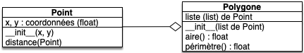
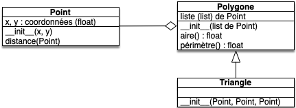

<!-- début résumé -->

Présentation du mécanisme d'héritage qui permet de factoriser du code entre classes.

<!-- end résumé -->

## Principe de l'héritage

Dans un programme, les classes sont organisées hiérarchiquement, la classe *racine* étant la classe la plus haute (ici elle s'appelle `object`).


Dans la figure précédente :

* la classe `object` est la *racine* de la hiérarchie, c'est la classe la plus haute
* la `classe 1` est la *classe mère* de la `classe 2`
* la `classe 2` est une *classe fille* de la `classe 1`

La figure montre également la désignation UML de l'héritage : une flèche avec un triangle vide.


En python, toutes les classes héritent de la classe `object`{.language-}. Par exemple `issubclass(list, object)`{.language-} répond `True`{.language-}.


### Utilisation de l'héritage

L'héritage permet d'utiliser les attributs et méthodes créées dans les classes mères de façon simple :

1. soit en cherchant dans la hiérarchie des classes l'attribut ou l'objet appelé depuis une classe fille
2. soit en appelant directement un attribut ou un objet de la classe mère.

#### Chercher dans la hiérarchie

Supposons que j'ai un objet nommé `obj`{.language-} de classe `classe 2` qui veut appeler la méthode 1 : `obj.méthode1()`{.language-}

1. on va chercher `méthode1`{.language-} dans l'espace de nom de `obj`{.language-} : il n'y est pas.
2. on va alors chercher dans sa classe, `classe 2` : elle ne définit pas `méthode1`{.language-}
3. on cherche alors dans la classe mère de `classe 2`, `classe 1` : `méthode1`{.language-} est définie, on utilise son code.


Si l'on arrive jusqu'à la classe `object` et qu'elle ne contient pas le nom recherché une erreur est lancée.


#### Appeler directement une sous/sur-classe

Supposons que dans la définition de `méthode1`{.language-} de la `classe 2'` on particularise la méthode `méthode1`{.language-} de la `classe 1`. On appelle alors la méthode `méthode1`{.language-} de la `classe 1` dans la définition de la `méthode1`{.language-} de la `classe 2'`.



Si l'on ne retrouve pas la méthode dans la classe mère, on remonte la hiérarchie. De là, tenter d'utiliser la méthode `méthode1`  de la `classe 1'` en définissant la  méthode `méthode1`  de la `classe 2''` va en fait exécuter la méthode  méthode `méthode1`  de la classe `object`.



### Connaître la hiérarchie

En python, si l'on veut connaître l'ordre dans lequel les classes vont être examinée lors de la remontée de la hiérarchie, on peut utiliser la méthode `mro()`{.language-} (pour "method resolution order") des classes. Cette méthode regarde l'attribut `__mro__`{.language-}.

Par exemple, dans un interpréteur :

```python
>>> str.mro()
[<class 'str'>, <class 'object'>]
>>> str.__mro__
(<class 'str'>, <class 'object'>)
>>> 
```

L'ordre dans lequel est examinée les classe pour les chaines de caractères est donc : d'abord la classe `str`{.language-} puis la classe `object`{.language-}


La classe `object`{.language-} est toujours le dernier élément de la liste


### Quand utiliser l'héritage

La composition et l'agrégation permettent de factoriser des fonctionnalités alors que l'héritage factorise du code. On va donc toujours favoriser la composition à l'héritage si c'est possible.

Il y a cependant des cas où l'héritage est très utile :

* lorsque l'on veut spécifier une classe : la nouvelle classe est un cas particulier de la classe mère
* lors de l'utilisation de bibliothèques : on particularise à nos besoins une classe générique donnée par un module que l'on n'a pas écrit.

La règle est que lorsque l'héritage doit ré-écrire toutes les méthodes de sa classe mère pour qu'il n'y ait pas de conflit, alors il faut changer d'approche. Une classe et sa classe mère doivent partager beaucoup de méthodes (ou que les méthodes soient des cas particuliers).

### Héritage multiple

Python autorise l'[héritage multiple](https://docs.python.org/fr/3/tutorial/classes.html#multiple-inheritance), mais sans très bonne raison il est plus que recommandé de ne pas l'utiliser. Il existe **toujours** une solution utilisant l'héritage simple qui sera plus facile à comprendre et surtout à maintenir dans le temps.

D'ailleurs, certains langages, comme le java par exemple, interdisent carrément l'héritage multiple.


Si cela vous intéresse, python utilise la règle [de linéarisation C3](https://en.wikipedia.org/wiki/C3_linearization) pour réaliser l'ordre de priorité des classes (le mro), ceci permet de résoudre le [problème du diamant](https://fr.wikipedia.org/wiki/Probl%C3%A8me_du_diamant) en héritage multiple.


## Exemple 1 : héritage simple

On présente ici un premier exemple d'utilisation de l'héritage, en combinaison d'une composition.

On veut manipuler des polygones. On veut pouvoir :

* créer un polygone à partir d'une liste de sommets donnée
* calculer l'aire du polygone
* calculer le périmètre du polygone

### classes Point et Polygone

Pour cela, on va créer une classe `Point`{.language-} et une classe `Polygone`{.language-} :

* classe `Point`{.language-} :
  * on se restreint à la 2D
  * coordonnées cartésiennes
  * distance à un autre point pour pouvoir plus facilement calculer le périmètre ensuite
* classe `Polygone`{.language-} :
  * création avec une liste de Point
  * calcul du périmètre
  * calcul de l'aire

On va supposer que le [polygone est simple](https://fr.wikipedia.org/wiki/Polygone_simple) pour simplifier le calcul de l'aire...

#### Uml

Point et polygone entretiennent un lien d'agrégation (les points sont passés au polygone à sa construction). Le modèle UML suivant :



#### Code python

On peut alors avoir le code python suivant pour créer les classes :

```python
from math import sqrt


class Point:
    def __init__(self, x, y):
        self.x = x
        self.y = y

    def distance(self, other):
        x1 = self.x
        x2 = other.x

        y1 = self.y
        y2 = other.y

        return sqrt((x2 - x1) ** 2 + (y2 - y1) ** 2)


class Polygone:
    def __init__(self, points):
        self._points = tuple(points)

    def périmètre(self):
        d = 0
        pivot = self._points[0]
        for point in self._points[1:]:
            d += pivot.distance(point)
            pivot = point
        d += pivot.distance(self._points[0])

        return d

    def aire(self):
        a = 0
        pivot = self._points[0]
        for point in self._points[1:]:
            a += pivot.x * point.y - pivot.y * point.x
            pivot = point

        point = self._points[0]
        a += pivot.x * point.y - pivot.y * point.x

        return 0.5 * abs(a)

```


On a rendu les attributs des classes privés. La convention en python pour rendre un attribut privé est d'ajouter un `_`{.language-} avant son nom.


Remarques :

1. Remarquez que l'on utilise toujours les méthodes (si elles existent) pour accéder aux attributs, cela permettra si besoin de changer les attributs de la classes (passer en coordonnées polaires par exemple) sans changer le code des méthodes.
2. Pour la classe polygone, on recrée une liste de points pour être sûr que le nombre de points reste constant (la liste est passée en paramètre et peut donc être modifiée à l'extérieur de la classe)
3. Notez que l'on ne recrée pas les points, ils peuvent donc changer car ils sont passés en paramètre de la construction du polygone

On peut tester le code avec, par exemple :

```python
points = [Point(0, 0), Point(0, 2), Point(1, 2), Point(1, 0)]
polygone = Polygone(points)
print(polygone.périmètre())
print(polygone.aire())
```

### Un polygone particulier

Comment modéliser une classe triangle ?

Comme un triangle **est un** polygone simple, on peut utiliser l'héritage pour cela.

#### Modélisation UML

Elle est très simple :



Notez que pour l'héritage, on ne remet pas les attributs/méthodes définis dans les classes mères.

#### Code python du Triangle

La classe `Triangle`{.language-} hérite de `Polygon`{.language-}, on appelle donc le constructeur de ce dernier lors de la création d'un `Triangle`{.language-}.

Ceci est explicite en python :

```python
class Triangle(Polygone):
    def __init__(self, point1, point2, point3):
        super().__init__([point1, point2, point3])
```

Le mot clé `super()`{.language-} désigne la classe parente, ici `Polygone`{.language-}. Ce mot clé permet d'utiliser toutes les méthodes de la classe parente, ici `__init__`{.language-}. Remarquez que l'on utilise la méthode `__init__`{.language-} sans utiliser le premier paramètre (`self`{.language-}) qui est implicitement l'objet courant.

Si on regarde l'ordre dans lequel est examiné les espaces de nom, on a (c'est la commande `Triangle.mro()`{.language-}) :

```python
[<class '__main__.Triangle'>, <class '__main__.Polygone'>, <class 'object'>]
```


Un petit tuto sur [la fonction super](https://he-arc.github.io/livre-python/super/index.html )


On peut maintenant utiliser toutes les méthodes définies dans Polygone puisque le constructeur de `Triangle`{.language-} appelle directement le constructeur de `Polygone`{.language-} : à la fin du constructeur, il existera une liste de points dans le triangle.

```python
triangle = Triangle(Point(0, 0), Point(1, 1), Point(2, 0))
print(triangle.périmètre())
print(triangle.aire())
```

Pour trouver le périmètre, python fonctionne ainsi :

1. existe-t-il un nom `périmètre`{.language-} dans l'objet `triangle`{.language-} : NON
2. existe-t-il un nom `périmètre`{.language-} dans la classe de l'objet `triangle`{.language-}, `Triangle`{.language-} : NON
3. existe-t-il un nom `périmètre`{.language-} dans la classe mère de `Triangle`{.language-}, `Polygone`{.language-} : OUI

Une fois la méthode trouvée, on l'exécute en plaçant l'objet (ici notre `triangle`{.language-} en 1er paramètre, c'est à dire `self`{.language-} de la méthode `périmètre`{.language-} définie dans `Polygone`{.language-}).


Les objets de type `Triangle`{.language-} sont **aussi** des objets de type `Polygone`{.language-} :

```python
>>> triangle = Triangle(Point(0, 0), Point(0, 2), Point(1, 2))
>>> print(isinstance(triangle, Triangle))
True
>>> print(isinstance(triangle, Polygone))
True
>>> 
```



## <span id="exemple-D&D"></span> Exemple 2 : donjons et dragons

On va simuler des personnage d'*heroic fantasy*. Pour cela, on commence par créer une classe `Personnage`{.language-} qui sera particularisée petit à petit.

### Classe Personnage

Le personnage générique doit :

* avoir un score d'attaque
* avoir des points de vie
* pouvoir modifier son score d'attaque et ses points de vie
* taper un autre personnage (lui faire perdre un nombre de point de vie égale à son score d'attaque)
* se faire taper par un autre personnage

#### UML du personnage


#### Code python du personnage

On a décidé ici de ne pas mettre de méthode get et set, mais de laisser libre accès aux attributs. C'est un choix possible. L'UML dérive donc un peu du code python ce qui est normal, chaque langage ayant ses spécificités.

```python
class Personnage:
    def __init__(self, vie, attaque):
        self.vie = vie
        self.attaque = attaque

    def se_faire_taper(self, personnage):
        self.vie -= personnage.attaque

    def taper(self, personnage):
        personnage.se_faire_taper(self)
```

Voyez comment on a utilisé la méthode `se_faire_taper`{.language-} pour définir la méthode `taper`{.language-}.

### La classe guerrière

La guerrière dispose d'un score de blocage qui représente son pourcentage de chances de ne pas perdre de vie quand un autre personnage l'attaque.

#### Modèle UML de la guerrière

c'est un personnage, on peut donc utiliser l'héritage.


On ne met que les méthodes qui changent, donc le constructeur et se faire taper.

#### Code python de la guerrière

```python
# ... 

import random

#...

class Guerrière(Personnage):
    def __init__(self, vie, attaque, blocage):
        super().__init__(vie, attaque)
        self.blocage = blocage

    def se_faire_taper(self, personnage):
        if self.blocage < random.randrange(0, 101):
            super().se_faire_taper(personnage)
```

Comprenez bien le code :

* On commence par appeler le constructeur de la classe mère (`super().__init__()`{.language-}) puis on applique le cas particulier de notre classe (`self.blocage = blocage`{.language-}).
* on ajoute un attribut à la guerrière par rapport au personnage normal,
* la méthode `se_faire_taper(personnage)`{.language-} utilise la méthode `se_faire_taper`{.language-} de la classe `Personnage`{.language-} seulement si la guerrière ne bloque pas le coup. Le `super().méthode_de_la_mere()`{.language-} permet d'accéder à la méthode de la classe mère même de même nom qu'une méthode (différente) de la classe fille.



On utilise **toujours** le constructeur de la classe mère pour garantir que les méthodes définies dans la classe mère fonctionnent avec les objets de la classe fille. Sinon ici, `se_faire_taper`{.language-} ne fonctionnerait pas puisque vie et attaque ne seraient pas définies



### Le magicien

Le magicien peut faire tout ce que peut faire un personnage normal mais il dispose en plus d'un score d'attaque magique qui détermine les dégâts qu'il fait en lançant un sort.

#### Modèle UML du magicien

On ajoute une nouvelle méthode qui n'existe pas dans la classe mère :


#### Code python du magicien

```python
class Magicien(Personnage):
    def __init__(self, vie, attaque, attaque_magique):
        super().__init__(vie, attaque)
        self.attaque_magique = attaque_magique

    def lancer_sort(self, personnage):
        personnage.vie -= self.attaque_magique
```

### Pour aller plus loin

Dans l'implémentation de notre classe `Personnage`{.language-}, on ne vérifie pas que notre vie passe en dessous de zéro. Il faut donc vérifier à chaque modification de l'attribut s'il est en dessous de zéro ou pas. Pour cela, on utilise en python les `@property`{.language-} vues dans le [projet objets : Dés](../projet-objets-dés#property) :


Remplacez la manipulation directe de l'attribut `vie`{.language-} par un `@property`{.language-}.



```python
class Personnage:
    def __init__(self, vie, attaque):
        self._vie = vie
        self.attaque = attaque

    def se_faire_taper(self, personnage):
        self.vie = self.vie - personnage.attaque

    def taper(self, personnage):
        personnage.se_faire_taper(self)

    @property
    def vie(self):
        return self._vie

    @vie.setter
    def vie(self, valeur):
        self._vie = valeur
        if self._vie <= 0:
            self._vie = 0
            print("je suis mort")
```



## On vérifie qu'on a compris

Quelques petit tests qui ne servent à rien en pratique mais qui permettent de vérifier qu'on a bien compris.

### Héritage de méthodes


Comment faire une classe `A`{.language-} qui a :

* un attribut `a`{.language-}
* une méthode `truc_que_fait_a()`{.language-} qui affiche "Truc défini dans la classe mère"
* une méthode `autre_truc()`{.language-} qui affiche "Autre truc dans la classe mère"



```python
class A:
    def __init__(self, a):
        self.a = a

    def truc_que_fait_a(self):
        print("Truc défini dans la classe mère")

    def truc_que_fait_a(self):
        print("Autre truc dans la classe mère")  
```




Écrivez une classe `B`{.language-} qui hérite de `A`{.language-} et qui a :

* un attribut `b`{.language-}
* le constructeur à 2 paramètres (a et b), un qui est initialisé dans la classe A (a), l'autre initialisé dans B (b)
* une méthode `autre_truc()`{.language-} qui affiche "C'est mon autre truc à moi"
* une méthode `que_de_b()`{.language-} qui affiche "Méthode seulement de la classe fille"



```python
class B(A):
    def __init__(self, a, b):
        super().__init__(a)
        self.b = b

    def autre_truc(self):
        print("C'est mon autre truc à moi")

    def que_de_b(self):
        print("Méthode seulement de la classe fille")
```

Faites bien attention à utiliser proprement le mot-clé `super`{.language-} dans le constructeur de la classe fille.



### Attribut de classe


Ajoutez dans `A`{.language-} un attribut de classe `CTE`{.language-} constante valant `un attribut de classe`{.language-}



```python
class A:
    CTE = "un attribut de classe"

    def __init__(self, a):
        self.a = a
    
    def truc_que_fait_a(self):
        print("Truc défini dans la classe mère")
    
    def truc_que_fait_a(self):
        print("Autre truc dans la classe mère")  
```



### Combinaison de méthodes


Ajoutez :

* dans la  classe `A`{.language-} : une méthode `j_hérite(x)`{.language-} qui prend un paramètre `x`{.language-} qui est une chaîne de caractère et affiche la valeur de x
* dans la  classe `B`{.language-} : une méthode `j_hérite(x)`{.language-} qui commence par appeler la méthode de la classe mère puis affiche la valeur de x en majuscules



```python
class A:
    CTE = "un attribut de classe"

    def __init__(self, a):
        self.a = a

    def truc_que_fait_a(self):
        print("Truc défini dans la classe mère")

    def truc_que_fait_a(self):
        print("Autre truc dans la classe mère")

    def j_hérite(self, x):
        print(x)


class B(A):
    def __init__(self, a, b):
        super().__init__(a)
        self.b = b

    def autre_truc(self):
        print("C'est mon autre truc à moi")

    def que_de_b(self):
        print("Méthode seulement de la classe fille")

    def j_hérite(self, x):
        super().j_herite(x)
        print(x.upper())
```


