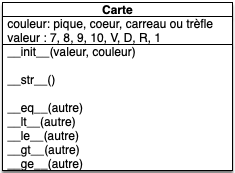

<!-- début résumé -->

Encore un projet d'initiation dans le codage des objets. On s'intéresse ici aux méthodes spéciales qui permettent d'utiliser les objets comme des nombres.

<!-- end résumé -->

Vous allez coder une classe `Carte`{.language-}, ce qui permettra par la suite de jouer à la bataille. La classe carte en elle même ne fera pas grand chose, mais elle illustrera la notion de [value object](https://en.wikipedia.org/wiki/Value_object) :


Un ***value object*** est un objet ne pouvant pas être modifié une fois créé : il ne possède aucune méthode lui permettant de changer ses attributs qu'il faut renseigner à sa création.


## Projet

### vscode


Créez un dossier `projet-cartes`{.fichier} sur votre ordinateur et ouvrez leu avec visual studio code pour un faire votre projet.




En créant des fichiers *jouets* dans votre projet, vérifier que :

* le [linter]({{ "/tutoriels/vsc-python-modules-supplémentaires/pycodestyle" | url}}#black)  est activé
* [black]({{ "/tutoriels/vsc-python-modules-supplémentaires/black" | url}}) fonctionne
* vous pouvez faire du [code coverage]({{ "/tutoriels/couverture-de-code" | url}})


### Programme principal & User stories

Le but du projet est de pouvoir jouer à une variante de [la bataille](https://fr.wikipedia.org/wiki/Bataille_(jeu)) :



On veut pouvoir mélanger un jeu de 32 cartes (sans joker) puis le séparer en 2 *pioches* de 16 cartes, un tas par joueur.

A chaque tour les deux joueurs prennent la première carte de leur pioche et la révèle. Le joueur ayant la plus grande carte (7 < 8 < 9 < 10 < V < D < R < 1 et si égalité de rang alors : ♠ > ♥ > ♦ > ♣︎) prend les deux cartes et la place dans sa pile de défausse (initialement vide).

Lorsqu'un joueur doit prendre une carte alors que sa pioche est vide, il mélange les cartes de sa défausse qui forment une nouvelle pioche. Si la pioche et la défausse est vide, le joueur perd la partie.



### Carte UML

La pioche et la défausse pouvant être facilement modélisé par des listes, il nous reste à créer une classe Carte pour avoir tous les éléments de base de notre projet.


Proposez une modélisation UML d'une classe Carte pour notre projet



Un constructeur, un affichage à l'écran et des opérateurs de comparaison :



### User stories

Le projet nécessite de faire plein de choses. Pour vous aider à réaliser ce but, on va se placer des objectifs intermédiaires, sous la forme de user stories.

Je vous en propose une ci-après qui exhibe la capacité à créer un jeu de 32 cartes et à afficher les cartes à l'écran :



* Nom : "Voyance"
* Utilisateur : un voyant extralucide.
* Story : On veut pouvoir tirer les cartes
* Actions :
  1. créer un paquet de 32 cartes (sans joker)
  2. prendre au hasard 3 cartes du paquet
  3. afficher à l'écran les trois cartes, dans l'ordre où elles ont été tirées



Par rapport au jeu, il manque essentiellement la fonctionnalité permettant d'ordonner les cartes :


Créez une user story qui exhibe la fonctionnalité de pouvoir ordonner les cartes.


### user stories code

## Code

### base

> init avec cte

### str

> pas de test de str

### constantes de classes

> 1. cte dans fichier, mais pas pratique, car lié uniquement aux classes
> 2. puis cte dans les classes : constantes de classes

### Toutes les possiblités

> 3. ajoute dans le fichiers un trucs COULEURS et VALEURS qui donnent toutes les courleurs et valeurs possible

nous permet de créer un deck;

Puis de faire la 1ère user story.

### accesseur sans mutateur

> 8. ajout property avec un getter sans setter value object (pas de triche)

### comparaisons

==, < et on infère le reste car ordre total

> faire des tests

> deuxième uster story
> 
## Jeu

### deux listes et compare

puis insert 0

### deck défausse et push pop

opti code, ajout d'une défausse.

### 32 cartes

### mélange et sépare en deux

### tant que pas fini ou max itertion : jouer
