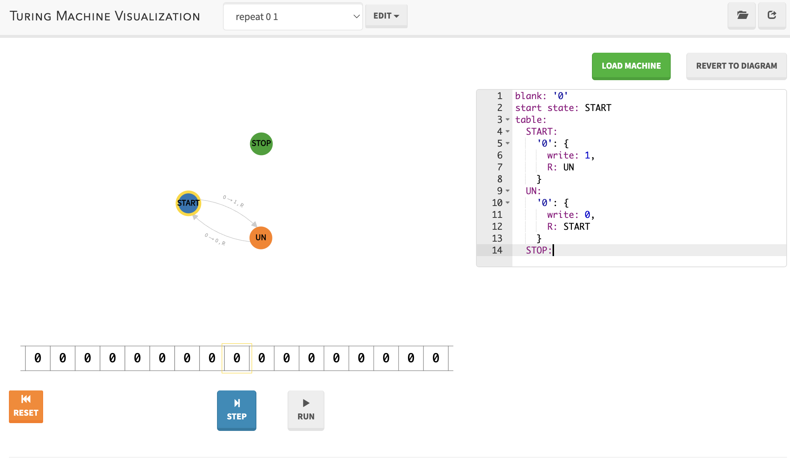

Il existe plusieurs définitions équivalentes d'une machine de Turing. Nous allons utiliser la version minimale comme première définition, puis montrer petit à petit que toutes ses généralisations ne permettent pas de faire plus de choses, juste d'écrire plus facilement ses programmes.


Une ***machine de Turing*** est composée :

* d'un ***ruban*** (supposé infini) constitué de cases contiguës pouvant chacune contenir soit le caractère `0` soit le caractère `1`
* d'un ***curseur*** qui est positionné sur une case du ruban (on suppose que le ruban est infini à gauche et à droite du curseur)
* d'un ensemble fini $Q$ d'***états possibles***, contenant les états `START`{.language-}  et `STOP`{.language-}
* d'un ***état courant*** $q \in Q$
* d'une ***fonction de transition*** $\delta(q, r) = (\delta_e(q, r), \delta_c(q, r), \delta_d(q, r))$ dépendant de l'état $q$ de la machine et du caractère $r$ contenu dans la case du ruban pointée par le curseur. Cette fonction définie sur $Q \times \\{0, 1\\}$ permet de modifier :
  * l'état de la machine : $\delta_e : Q \times \\{0, 1\\} \mapsto Q$
  * le caractère de la case du ruban pointée par le curseur : $\delta_c : Q \times \\{0, 1\\} \mapsto \\{0, 1\\}$
  * la position du curseur : $\delta_d : Q \times \\{0, 1\\} \mapsto \\{\leftarrow, \rightarrow\\}$


Une machine c'est donc un **programme** (la fonction de transition) qui agit à partir de **données** (le ruban et l'état interne de la machine). Une machine de Turing n'a d'intérêt que si elle est **exécutée**  :


L'***exécution*** d'une machine de Turing se déroule comme suit :

1. initialisation :
   1. le ruban est constitué uniquement `0`
   2. l'état courant de la machine est `START`{.language-}
2. étape :
   1. on lit l'état courant  $q$ de la machine
   2. Si $q$ vaut `STOP`{.language-} on arrête l'exécution de la machine
   3. on lit le caractère $r$ dans la case du ruban pointée par le curseur
   4. on écrit le caractère $\delta_c(q, r)$ dans la case du ruban pointée par le curseur
   5. on déplace le curseur d'une case à droite ou à gauche selon la valeur de $\delta_d(q, r)$
   6. on change l'état courant de la machine en $\delta_e(q, r)$
   7. retour en 2.1


L'exécution d'une machine de Turing, n'est pas forcément finie. Elle ne s'arrête que si elle atteint l'état `STOP`{.language-}, ce qui peut ne jamais arriver.

Remarquez la minimalité du fonctionnement :

* on ne peut déplacer la tête de lecture que d'une case vers la gauche ou vers la droite (il est impossible d'écrire où l'on veut dans la mémoire comme on peut le faire avec un ordinateur classique)
* on ne peut écrire qu'un caractère à la fois (pas d'entier, de réel, rien que `0` ou `1`)
* pas de variables
* pas de boucle for ni de saut
* un unique test entre un état et une case du ruban

Et pourtant (nous le verrons), elle capte toutes les possibilités d'un algorithme.

## Exemples

### <span id="exemple-répétition"></span> Répétitions

Considérons la machine de Turing dont une fonction de transition partielle est la suivante :

* $\delta(\text{START}, 0) = (\text{UN}, 1, \rightarrow)$
* $\delta(\text{UN}, 0) = (\text{START}, 0, \rightarrow)$


Montrer que la fonction de transition partielle précédente est suffisante pour que l'exécution de la machine soit bien définie


À l'initialisation le ruban est rempli de `0` et comme la machine ne va que à droite, le caractère lu sur le ruban ne peut être que `0`. Comme l'état initial est `START`{.language-}, la machine va osciller entre l'état `START`{.language-} et `UN`{.language-}.


Montrer que l'exécution de cette machine de Turing ne va jamais s'arrêter


La fonction de transition ne contient pas de changement d'état vers `STOP`{.language-}.


Que fait cette machine ?


À chaque étape la machine écrit `1` (respectivement `0`) si elle a précédemment écrit `0` (respectivement `1`) et se déplace à droite


### <span id="exemple-oscillation"></span> Oscillation

Considérons la machine de Turing dont une fonction de transition partielle est la suivante :

* $\delta(\text{START}, 0) = (\text{L1}, 0, \leftarrow)$
* $\delta(\text{L1}, 0) = (\text{R0}, 1, \rightarrow)$
* $\delta(\text{R0}, 0) = (\text{R1}, 0, \rightarrow)$
* $\delta(\text{R0}, 1) = (\text{R0}, 1, \rightarrow)$
* $\delta(\text{R1}, 1) = (\text{R0}, 1, \rightarrow)$
* $\delta(\text{R1}, 0) = (\text{STOP}, 1, \leftarrow)$


Montrer que la fonction de transition partielle précédente est suffisante pour que l'exécution de la machine soit bien définie


Les transitions à partir des états `R0`{.language-} et `R1`{.language-} sont définis pour `0` et `1`. Seul `L1`{.language-} n'est défini que pour `0`. Or la seule étape où la machine peut se trouver dans l'état `L1`{.language-} est la seconde étape (les autres transitions ne transitionnent jamais vers `L1`{.language-}), où il ne peut y avoir qu'un 0 sur la case du ruban pointée par le curseur.


Montrer que l'exécution de cette machine de Turing va s'arrêter et donnez les caractères présents sur le ruban


`···01010···`


<span id="exemple-oscillation-infini"></span>
Que faudrait-il ajouter/modifier à la fonction de transition pour que la machine oscille infiniment ?



* $\delta(\text{START} = (\text{L1}, 0, \leftarrow)$
* $\delta(\text{L1}, 0) = (\text{R0}, 1, \rightarrow)$
* $\delta(\text{L1}, 1) = (\text{L0}, 1, \leftarrow)$ (**Ajout**)
* $\delta(\text{R0}, 0) = (\text{R1}, 0, \rightarrow)$
* $\delta(\text{R0}, 1) = (\text{R0}, 1, \rightarrow)$
* $\delta(\text{R1}, 1) = (\text{R0}, 1, \rightarrow)$
* $\delta(\text{R1}, 0) = (\text{L0}, 1, \leftarrow)$ (**Modification**)
* $\delta(\text{L0}, 0) = (\text{L1}, 0, \leftarrow)$ (**Ajout**)
* $\delta(\text{L0}, 1) = (\text{L0}, 1, \leftarrow)$ (**Ajout**)



## Visualisation

Voir une machine de Turing s'exécuter est très gratifiant, surtout lorsqu'on a passé du temps à la créer. Il existe de nombreux sites permettant de visualiser l'exécution d'une machine, nous allons utiliser celui-ci :


<https://turingmachine.io/>


Il utilise une définition plus générale d'une machine de Turing (c'est celle - classique - de [Wikipedia](https://fr.wikipedia.org/wiki/Machine_de_Turing#D%C3%A9finition_formelle)) mais nous pouvons tout à fait utiliser notre définition.

Reprenons [le premier précédent](./#exemple-répétition){.interne} et écrivons le sous la forme utilisée par le site.


Copiez/coller le code ci-dessous dans la fenêtre de texte de la page <https://turingmachine.io/> , puis cliquez sur le bouton `load machine`.

```text
blank: 0
start state: START
table:
  START:
    0: {
      write: 1,
      R: UN
    }
  UN:
    0: {
      write: 0,
      R: START
    }
  STOP:
```

Le *code* de la machine de Turing utilisé est expliqué au bas de la page du site.



La machine est chargée :



On y voit :

* un diagramme représentant la fonction de transition (les état sont les sommets et les arcs les transitions)
* le ruban et son curseur

Grâce aux boutons `step` et `run` sous le ruban, vous pourrez exécuter une étape de la machine ou en continue.


Exécutez plusieurs étapes de la Machine et vérifiez que les états sont bien représentez sur le diagramme au dessus de du ruban.


Jouons un peu avec cette machine :


Modifiez le code précédant pour que la machine écrive indéfiniment `110` sur le ruban.



```text
blank: 0
start state: START
table:
  START:
    0: {
      write: 1,
      R: UN
    }
  UN:
    0: {
      write: 1,
      R: DEUX
    }
  DEUX:
    0: {
      write: 0,
      R: START
    }
    
  STOP:
```




Modifiez le code précédant pour que la machine commence par écrire `110` sur le ruban, puis revienne en arrière sans modifier le ruban et s'arrête lorsque le curseur est de nouveau sur la position de départ.





```text
blank: 0
start state: START
table:
  START:
    0: {
      write: 1,
      R: UN
    }
    1: {
      write: 1,
      L: STOP
    }

  UN:
    0: {
      write: 1,
      R: DEUX
    }
    
  DEUX:
    0: {
      write: 0,
      L: START
    }
    
  STOP:
```




Écrivez le code de l'[oscillateur](./#exemple-oscillation){.interne} qui s'arrête.



```text
blank: 0
start state: START
table:
  START:
    0: {
      write: 0,
      L: L1
    }
  L1:
    0: {
      write: 1,
      R: R0
    }
  R0:
    0: {
      write: 0,
      R: R1
    }
    1: {
      write: 1,
      R: R0
    }
  R1:
    1: {
      write: 1,
      R: R0
    }
    0: {
      write: 1,
      L: STOP
    }
  STOP:
```



Écrivez le code de l'[oscillateur infini](./#exemple-oscillation-infini){.interne}.



```
blank: 0
start state: START
table:
  START:
    0: {
      write: 0,
      L: L1
    }
  L1:
    0: {
      write: 1,
      R: R0
    }
    1: {
      write: 1,
      L: L0
    }
  R0:
    0: {
      write: 0,
      R: R1
    }
    1: {
      write: 1,
      R: R0
    }
  R1:
    1: {
      write: 1,
      R: R0
    }
    0: {
      write: 1,
      L: L0
    }
  L0:
    0: {
      write: 0,
      L: L1
    }
    1: {
      write: 1,
      L: L0
    }
    
  STOP:
```



## Sortie et Entrée d'une machine

### Sortie

Mais si la machine s'arrête, le ruban constitue sa ***sortie***. Comme la machine a effectuée un nombre fini d'étape avant de s'arrêter, on peut uniquement considérer une portion finie de celui-ci :


La ***sortie*** d'une machine de Turing est soit :

* la chaîne vide si le ruban est uniquement constitué de `0`
* la partie finie du ruban allant de la case contenant le caractère `1` le plus à gauche et la case contenant le caractère `1` le plus à droite.


Cette définition de sortie n'est pas totalement satisfaisante puisqu'elle ne peut commencer et finir que par des `1`. On verra plus tard comment régler ce (petit) problème.

### Entrée

Avant de définir l'***entrée*** d'une machine de Turing, commençons par une propriété anodine mais avec de grosses conséquences :

<span id="addition-turing"></span>

Si $M$ et $M'$ sont deux machines de Turing, définit la machine de Turing $M+M'$ en suivant la procédure suivante :

* on s'assure que les états de $M$ et les états de $M_i$ (à part `START`{.language-} et `STOP`{.language-}) soient différents
* on renomme l'état `START`{.language-} de la machine M en `START'`{.language-}
* on renomme l'état `STOP`{.language-} de la machine $M_i$ en `START'`{.language-}


La définition ci-dessus nous permet d'exécuter à la suite deux machine de Turing, l'état de fin de la première machine devenant l'état de départ de la suivante. 


Notez que l'addition de Machine de Turing est bien commutative et associative.


Cette addition nous permet d'exécuter une machine $M$ avec autre chose que des `0` sur le ruban en commençant par exécuter une machine $M_\text{Init}$ qui *prépare* le ruban.

Par exemple, supposons que l'on veuille exécuter la machine [oscillateur](./#exemple-oscillation){.interne} avec la chaîne `0101` sur le ruban on peut commencer par utiliser la machine de fonction de transition :

* $\delta(\text{START}, 0) = (UN, 1, \rightarrow)$
* $\delta(UN, 0) = (DEUX, 0, \rightarrow)$
* $\delta(DEUX, 0) = (TROIS, 1, \leftarrow)$
* $\delta(TROIS, 0) = (QUATRE, 0, \leftarrow)$
* $\delta(QUATRE, 1) = (STOP, 1, \leftarrow)$

Qui laisse le ruban avec les données `···01010···` et le curseur sur le `0` le plus à gauche.


Vérifiez que la machine ci-dessus fait fait ce-que l'on pense et vérifiez le en la codant sur <https://turingmachine.io/>



```text
blank: 0
start state: START
table:
  START:
    0: {
      write: 1,
      R: UN
    }
  UN:
    0: {
      write: 0,
      R: DEUX
    }
  DEUX:
    0: {
      write: 1,
      L: TROIS
    }
  TROIS:
    0: {
      write: 0,
      L: QUATRE
    }
  QUATRE:
    1: {
      write: 1,
      L: STOP
    }

  STOP:
```



On exécute ensuite, initialisation notre [oscillateur](./#exemple-oscillation){.interne}.

Cette succession de l'exécution de deux machines est une machine dont
la fonction de transition complète de cette nouvelle machine serait, en respectant les règle de l'addition :

* $\delta(\text{START}, 0) = (UN, 1, \rightarrow)$
* $\delta(UN, 0) = (DEUX, 0, \rightarrow)$
* $\delta(DEUX, 0) = (TROIS, 1, \leftarrow)$
* $\delta(TROIS, 0) = (QUATRE, 0, \leftarrow)$
* $\delta(QUATRE, 1) = (START', 1, \leftarrow)$
* $\delta(\text{START'}, 0) = (\text{L1}, 0, \leftarrow)$
* $\delta(\text{L1}, 0) = (\text{R0}, 1, \rightarrow)$
* $\delta(\text{R0}, 0) = (\text{R1}, 0, \rightarrow)$
* $\delta(\text{R0}, 1) = (\text{R0}, 1, \rightarrow)$
* $\delta(\text{R1}, 1) = (\text{R0}, 1, \rightarrow)$
* $\delta(\text{R1}, 0) = (\text{STOP}, 1, \leftarrow)$


Combinez le code de la machine qui initialise et l'oscillateur pour tester le résultat sur <https://turingmachine.io/>



```text
blank: 0
start state: START
table:
  START:
    0: {
      write: 1,
      R: UN
    }
  UN:
    0: {
      write: 0,
      R: DEUX
    }
  DEUX:
    0: {
      write: 1,
      L: TROIS
    }
  TROIS:
    0: {
      write: 0,
      L: QUATRE
    }
  QUATRE:
    1: {
      write: 1,
      L: START'
    }
  START':
    0: {
      write: 0,
      L: L1
    }
  L1:
    0: {
      write: 1,
      R: R0
    }
  R0:
    0: {
      write: 0,
      R: R1
    }
    1: {
      write: 1,
      R: R0
    }
  R1:
    1: {
      write: 1,
      R: R0
    }
    0: {
      write: 1,
      L: STOP
    }
  STOP:
```



Ce cas étant très courant, plutôt que de concaténer une machine qui initialise le ruban à la machine principale, on donne la possibilité de donner une entrée à l'exécution d'une machine :


Le ***paramètre d'entrée*** de l'exécution d'une machine de Turing est une suite **finie** (pouvant être vide) des caractères `0` et `1`.

Lors de l'initialisation de l'exécution de la machine on rajoute deux étapes :

1. inscription de la chaîne sur le ruban
2. positionnement du curseur sur la case contenant le premier élément de la chaîne.


Remarquez bien que :

* l'ajout d'un paramètre d'entrée n'est qu'une facilité d'écriture, cela ne change rien au modèle initial de la machine de Turing.
* l'entrée est **finie** puisqu'elle résulte de l'exécution d'une machine. Il est donc impossible d'initialiser un ruban avec une succession infinie de `0` et de `1` par exemple.


En utilisant le code <https://turingmachine.io/> de l'[oscillateur](./#exemple-oscillation){.interne}, ajoutez la chaîne `0101` comme paramètre d'entrée avec le mot clé `input:`{.language-}



```text
blank: 0
start state: START
input: '0101'
table:
  START:
    0: {
      write: 0,
      L: L1
    }
  L1:
    0: {
      write: 1,
      R: R0
    }
  R0:
    0: {
      write: 0,
      R: R1
    }
    1: {
      write: 1,
      R: R0
    }
  R1:
    1: {
      write: 1,
      R: R0
    }
    0: {
      write: 1,
      L: STOP
    }
  STOP:
```



Attention cependant, une machine peut s'arrêter pour certaines entrées et pas d'autres.

## Composition de machines

La technique de combinaison de machines de Turing est très efficace pour créer des Machines complexes à partir d'une succession de machines simples.

> TBD : un prémisse de pseudo code.
> comme en algorithmie : on combine le simple pour faire le complexe

### Succession de Machines

#### Définition

Récrivons l'[addition](./#addition-turing) vue dans la partie entrée :

<span id="exécution-séquentielle"></span>

Si $M_i$ est une machine de Turing associée à la fonction de transition $\delta^i(q, r) = (\delta^i_e(q, r), \delta^i_c(q, r), \delta^i_d(q, r))$  pour $1\leq\i\leq n$, l'***exécution séquentielle*** des $n$ machine est alors la machine $M$ décrite telle que :

* $1$: $M_1$
* ...
* $i$: $M_i$
* ...
* $n$: $M_n$

Est définie par la fonction de transition $\delta$ telle que :

* Initialisation :
  * $\delta(\text{START}, r) = (\text{START}', r, \rightarrow)$
  * $\delta(\text{START}', r) = ((1, \text{START}), r, \leftarrow)$
* Re-labellisation des états des machines :
  * Pour tout état $q$ de la machine $M_i$ :  $\delta((i, q), r) = ((i+1, \delta^i_e(q, r)), \delta^i_c(q, r),\delta^i_d(q, r))$
* Exécution successive des $n$ machines :
  * $\delta((i, \text{STOP}), r) = ((i, \text{STOP}'), r,\rightarrow)$
  * $\delta((i+1, \text{STOP}'), r) = ((i+1, \text{START}), r,\leftarrow)$



On a ajouté une machine qui fait un aller-retour d'une case entre chaque instruction pour garantir que la case du début de la machine $i+1$ est bien la même que la case qui a déclenchée la transition de fin de la machine $i$. Cela est cohérent avec la définition de $M+M'$ et rend indépendant les instructions $i$ et $i+1$


La définition ci-dessus permet de créer des machines par succession de machines indépendantes La machine d'instruction $i+1$ s'exécutant après la machine d'instruction $i$. L'interaction entre les machines se faisant grâce au ruban.

#### Exemple : doublement de bâtons

Utilisons cette formalisation pour réaliser une machine un peu plus complexe que ce que nous avons fait jusqu'à présent :

> Nous allons créer une machine de Turing qui prend en entrée un suite finie de $k$ `1` ($k$ *bâtons*) et rend comme sortie une suite de $2k$ `1` ($2k$ *bâtons*).

Cette machine fait l'opération *fois 2* si l'on encode les entiers positifs par un [système unaire](https://fr.wikipedia.org/wiki/Syst%C3%A8me_unaire).

Pour cela, nous allons utiliser le fait que l'exécution successive de deux machines est également une machine pour décomposer le problème en plusieurs machines élémentaires.

L'idée est de fabriquer la sortie à droite de l'entrée en supprimant itérativement un bâton à l'entrée et d'en ajouter 2 à la sortie. Lorsque l'on aura supprimé tous les bâtons de l'entrée, il ne restera que la sortie et la machine s'arrêtera :


Créons cette procédure en combinant des étapes élémentaires (ie pouvant être facilement crées avec une machine de Turing) :

1. Si l'entrée est vide arrêter le programme, sinon écrire un 0 et aller au début de la sortie
2. aller à la fin de la sortie et écrire `11` sur le ruban
3. revenir à la fin de l'entrée
4. revenir au début de l'entrée et retour en 1.

Ce qui donne avec une entrée l'algorithme suivant :

```
entrée      : 011100000000
               ^
fin étape 1 : 001100000000
                   ^ 
fin étape 2 : 001101100000
                     ^ 
fin étape 3 : 001101100000
                 ^ 
fin étape 4 : 001101100000
                ^ 
fin étape 1 : 000101100000
                   ^ 
fin étape 2 : 000101111000
                       ^ 
fin étape 3 : 000101111000
                 ^ 
fin étape 4 : 000101111000
                 ^ 
fin étape 1 : 000001111000
                   ^ 
fin étape 2 : 000001111110
                         ^ 
fin étape 3 : 000001111110
                 ^ 
fin étape 4 : 000001111110
                  ^ 
fin étape 1 : 000001111110
                   ^ 
```

Pour conclure, il nous reste à montrer que notre algorithme peut s'écrire sous la forme d'une machine de Turing.


Montrez que chacune des quatre étapes peut être simulées par une machine de Turing


> TBD


En conclure qu'il existe une machine de Turing permettant de faire le doublement de bâton et donnez en la fonction de transition.


La machine $M = M1 + M2 + M3 + M4$ est presque la solution. Il faut juste s'assurer que l'on stoppe la machine si on lit `0` dans l'état start : \delta^M(\text{START}, 0) = (\text{STOP}, 0, \rightarrow)$, ce qui n'est plus le cas après addition.



Combinez les quatres machine en une seule et visualisez le résultat.



```
blank: 0
start state: START
input: '111'
table:
  START:
    0: {
      write: 0,
      R: STOP
    }
    1: {
      write: 0,
      R: RETOUR
    }
  RETOUR:
    1: {
      write: 1,
      R: RETOUR
    }
    0: {
      write: 0,
      R: START'
    }
  START':
    0: {
      write: 1,
      R: ÉCRIT
    }
    1: {
      write: 1,
      R: START'
    }      
  ÉCRIT:
    0: {
      write: 1,
      L: START''
    }
  START'':
    1: {
      write: 1,
      L: START''
    }
    0: {
      write: 0,
      L: START'''
    }
  START''':
    1: {
      write: 1,
      L: START'''
    }
    0: {
      write: 0,
      R: START
    }
  STOP:
```



### Programme et exécution conditionnelle de machines

Pour l'instant nos composition sont sont successions indépendantes de machines. Nous allons utiliser les fonctions de transition pour pouvoir exécuter conditionnellement des Machines. Ceci nous permettra de créer des machines de plus en plus complexe en combinant des machines existantes, bref, de faire de l'algorithmie.

#### Saut et Conditions

Dans la partie précédente, nous avons exécuté des machines de façons successives en utilisant des "*labels*" entiers : la chine de label $i$ s'exécutant juste avant la machine de Label $i+1$. Explicitons cela :


Un ***programme*** est une machine de Turing définie par une succession de lignes : **LABEL: MACHINE**, où chaque label est unique.

Un Programme est toujours composé d'un label nommé **MAIN**.

La fonction de transition $\delta$ associée à un **programme** est définie pour chaque ligne **LABEL: M**, avec \delta^M(q, r) = (\delta^M_e(q, r), \delta^M_c(q, r),\delta^M_d(q, r))$ la fonction de transition de la machine **M** :

$$
\delta((LABEL, q)) = ((LABEL, \delta^M_e(q, r)), \delta^M_c(q, r),\delta^M_d(q, r))
$$

Le label spécial **MAIN** constitue le départ du programme. Pour cela, on ajoute à la fonction de transition :

* $\delta(START, r) = (\text{START}'), r,\rightarrow)$
* $\delta(\text{START}', r) = ((MAIN, \text{START}), r,\leftarrow)$

Qui permet de démarrer l'exécution.



Un programme démarre toujours en exécutant la machine de label **START**. Pour passer d'un label à un autre, on peut utiliser la machine spéciale nommée **ALLER label**.


Dans un programme, La machine ***ALLER label*** est définie par la fonction de transition :

* $\delta(START, r) = (\text{START}'), r,\rightarrow)$
* $\delta(\text{START}', r) = ((label, \text{START}), r,\leftarrow)$



Nous n'avons pour l'instant que redéfini de façon plus générale l'[exécution séquentielle](./#exécution-séquentielle) de machines.


Utilisez les labels et la machine **ALLER label**, pour redéfinir l'[exécution séquentielle](./#exécution-séquentielle) de machines.


> TBD


Pour aller plus loin, il nous faut formaliser une machine permettant l'exécution conditionnelle de machines.


Dans un programme, La machine ***SI $x$ label1 SINON label2*** avec $x \in \\{0, 1\\}$ est définie par la fonction de transition :

* $\delta(START, 0) = ((\text{START}', 0), 0,\rightarrow)$
* $\delta(START, 1) = ((\text{START}', 1), 1,\rightarrow)$
* $\delta((\text{START}', 0), r) = ((label1, \text{START}), r,\leftarrow)$
* $\delta((\text{START}', 1), r) = ((label2, \text{START}), r,\leftarrow)$



#### Procédure

Souvent lorsque l'on cre un programme avec une machine de Turing on se trouve confronté à des machines qui doivent être exécutées dans des contextes différents. Un peut comme un appel de fonction dans du pseudo-code classique.

Pour permettre d'écrire cela de façon condensé on peut définir des labels spéciaux dans nos programmes :



Dans un programme, on permet de définir un label générique **LABEL($p_1, \dots, p_k$): M** où les $p_i$ peuvent prendre toutes les valeurs d'un ensemble $P_i$ **fini**. On peut utiliser les noms $p_i$ ($1\leq i \leq k$) dans la définition de la machine M.

On génère pour cette ligne les transitions :

$$
\delta((\text{LABEL}(p_1, \dots, p_k), q)) = ((\text{LABEL}(p_1, \dots, p_k), \delta^M_e(q, r)), \delta^M_c(q, r),\delta^M_d(q, r))
$$

Pour tous les $(p_1, \dots, p_k) \in P_1 \times \dots \times P_k$


Attention, ce ne sont pas vraiment des fonctions car les *paramètres*, on ne fait que créer une fonction de transition pour tous les cas possible. Il est donc nécessaire que le nombre de possibilité soit fini.


#### Exemple

> TBD

## <span id="équivalences"></span>Définitions équivalentes

Le modèle simple de la machine de Turing peut sembler simpliste et on est tenté de le généraliser pour pouvoir calculer plus de choses. Cependant toutes les tentatives de généralisation tentées (en restant dans le domaine fini)  se sont révélées vaines car aucune d'entres elles n'arrive à calculer plus de choses.

Elle sont cependant utiles car si elles ne permettent pas de calculer plus de choses, elle permettent de les calculer plus simplement.

Nous allons examiner 3 généralisations possible et montrer qu'elles sont équivalentes au modèle simple.

### <span id="plusieurs-curseurs"></span>Machine à plusieurs curseurs

Une machine de Turing à $k$ curseurs peut être définie comme suit.


Une ***machine de Turing à $k$ curseurs*** est composée :

* de un ***ruban*** (supposé infini) constitué de cases contiguës pouvant chacune contenir soit le caractère `0` soit le caractère `1`
* de $k$ ***curseurs***, positionnés sur une case de son ruban (on suppose que le ruban est infini à gauche et à droite du curseur)
* d'un ensemble fini $Q$ d'***états possibles***, contenant les états `START`  et `STOP`
* d'un ***état courant*** $q \in Q$
* d'une ***fonction de transition*** $\delta(q, r_1, \dots, r_k) = (\delta_e(q, r_1, \dots, r_k), \delta_{c_1}(q, r_1, \dots, r_k), \dots, \delta_{c_k}(q, r_1, \dots, r_k), \delta_{d_1}(q, r_1, \dots, r_k), \dots, \delta_{d_k}(q, r_1, \dots, r_k))$ dépendant de l'état $q$ de la machine et des caractères $r_i$ contenus dans chaque case des rubans pointée par son curseur associé. Cette fonction définie sur $Q \times \\{0, 1\\}^k$ permet de modifier :
  * l'état de la machine : $\delta_e : Q \times \\{0, 1\\}^k \mapsto Q$
  * les caractères des cases pointées par chaque curseur $1\leq i \leq k$ : $\delta_{c_i} : Q \times \\{0, 1\\}^k \mapsto \\{0, 1\\}$
  * les positions des $1\leq i \leq k$ curseurs : $\delta_{d_i} : Q \times \\{0, 1\\}^k \mapsto \\{\leftarrow, \rightarrow\\}$


Cette machine permet de prendre en compte plusieurs cases du ruban pour les transition. La gestion des curseurs est faite ainsi :

* A l'initialisation, les $k$ curseurs sont considérés être sur la même case
* A l'exécution,  on effectue l'écriture dans l'ordre des curseurs pour rendre déterministe le comportement d'une étape où deux curseurs sont sur la même case.

On va montrer que cette extension n'en est pas vraiment une car on peut toujours transformer une machine à plusieurs curseurs en une machine de Turing normale équivalente.

Nous allons pour cela montrer que l'on peut simuler une machine à 2 curseurs par une machine à un curseur.

#### Simulation d'une machine à 2 curseurs par une machine simple

Le principe de cette conversion est d'associer à chaque case du ruban de la machine à deux curseurs, une 4-case composé de 4 cases de la machine à 1 curseur.

Chaque paquet est décomposé ainsi :

* case d'indice 0 : un marqueur valant 1 pour une case strictement plus à gauche du curseur 1 et 2 (sera utile pour la suite)
* case d'indice 1 : un marqueur valant 1 si le curseur 1 est est dans la case, 0 sinon
* case d'indice 2 : un marqueur valant 1 si le curseur 2 est est dans la case, 0 sinon
* case d'indice 3 : valeur de la case associée

Par exemple si l'on a la machine à 2 curseurs suivante :

```
numéro case :  12345
ruban       :  00101
curseurs    :   ^ ^
                1 2 
```

Machine à 1 curseur simulant la machine :

```
case machine à 2 curseurs : 1   2   3   4   5
ruban                     : 10000100000100100001
indice paquet de 4 cases  : 01230123012301230123

```

1. Lecture des deux valeurs du curseurs et retour à la case ayant le marqueur


* ÉTAPE1(q): $q \in Q$
  1. se déplace de 1 case à droite
  2. SI 0 ALORS D(q) SINON C(q)
* D(q): $q \in Q$
  1. se déplace de 4 cases à droite
  2. SI 0 ALORS D(q) SINON C(q)
* C(q): $q \in Q$
  1. se déplace de 2 cases vers la droite
  2. SI 0 ALORS M1'(q, 0) SINON M'(q, 1)
* M1'(q, x): $q,x \in Q \times \\{0, 1\\}$
  1. se déplace de 3 cases à gauche
  2. SI 0 ALORS G(q, x) SINON M2(q, x)
* G(q, x): $q,x \in Q \times \\{0, 1\\}$
  1. se déplace de 4 cases à gauche
  2. SI 0 ALORS G(q, x) SINON M2(q, x)
* M2(q, x): $q,x \in Q \times \\{0, 1\\}$
  1. se déplace de 2 cases à droite
  2. SI 0 ALORS D(q, x) SINON C(q, x)
* D(q, x): $q,x \in Q \times \\{0, 1\\}$
  1. se déplace de 4 cases à droite
  2. SI 0 ALORS D(q, x) SINON C(q, x)
* C(q, x): $q,x \in Q \times \\{0, 1\\}$
  1. se déplace de 1 case vers la droite
  2. SI 0 ALORS M2'(q, x, 0) SINON M2'(q, x, 1)
* M2'(q, x, y): $q,x, y \in Q \times \\{0, 1\\} \times \\{0, 1\\}$
  1. se déplace de 3 cases à gauche
  2. SI 0 ALORS G(q, x, 0) SINON ÉTAPE2(q, x, y)
* G(q, x, y): $q,x, y \in Q \times \\{0, 1\\} \times \\{0, 1\\}$
  1. se déplace de 4 cases à gauche
  2. SI 0 ALORS G(q, x, y) SINON ÉTAPE2(q, x, y)


2. Écriture des valeurs aux positions des curseurs 1 et 2 et retour à la case ayant le marqueur


* ÉTAPE2(q, x, y):
  1. se déplace de 1 case sur la droite
  2. SI 0 ALORS D'(q, x, y) SINON C'(q, x, y)
* D'(q, x, y): $q \in Q$
  1. se déplace de 4 cases à droite
  2. SI 0 ALORS D'(q, x, y) SINON C'(q, x, y)
* C'(q, x, y):
  1. se déplace de 2 cases vers la droite
  2. écrit $\delta_{c_1}(q, x, y)$ sur la case et se déplace à gauche
  3. se déplace de 2 cases vers la gauche
  4. SI 0 ALORS G'(q, x, y) SINON E2(q, x, y)
* G'(q, x, y):
  1. se déplace de 4 cases à gauche
  2. SI 0 ALORS G'(q, x, y) SINON E2(q, x, y)
* E2(q, x, y):
  1. se déplace de 2 cases sur la droite
  2. SI 0 ALORS D2'(q, x, y) SINON C2'(q, x, y)
* D2'(q, x, y): $q \in Q$
  1. se déplace de 4 cases à droite
  2. SI 0 ALORS D2'(q, x, y) SINON C2'(q, x, y)
* C2'(q, x, y):
  1. se déplace de 1 cases vers la droite
  2. écrit $\delta_{c_2}(q, x, y)$ sur la case et se déplace à gauche
  3. se déplace de 2 cases vers la gauche
  4. SI 0 ALORS G2'(q, x, y) SINON ÉTAPE3(q, x, y)
* G'(q, x, y):
  1. se déplace de 4 cases à gauche
  2. SI 0 ALORS G'(q, x, y) SINON ÉTAPE3(q, x, y)


3. déplacement des curseurs 1 et 2 et retour à la case ayant le marqueur


> TBD


4. décale le marquer s'une case vers la gauche (ceci assure que la case marquée est toujours avant les cases avec le curseurs 1 et 2) et s'y placer.


> TBD


5. changer l'état en suivant la transition de la machine à 2 curseurs


> TBD


Après ces 5 méta-étapes, on peut recommencer à l'étape 1.

Cela fait tout un tas de transition, mais on arrive bien à simuler 2 curseurs par un seul !

#### Equivalence avec la machine de Turing classique

> TBD : 2 vers 1 donc aussi k vers k-1

D'ou la conclusion

Toute machine de Turing à $k$ curseurs peut être écrite sous la forme d'une machine de Turing simple.

Les deux notions sont donc équivalentes.


### <span id="plusieurs-rubans"></span>Machine à plusieurs rubans

Une machine de Turing à $k$ rubans peut être définie comme suit.


Une ***machine de Turing à $k$ rubans*** est composée :

* de $k$ ***rubans*** (supposés infinis) constitués de cases contiguës pouvant chacune contenir soit le caractère `0` soit le caractère `1`
* de $k$ ***curseurs***, un par ruban, positionnés sur une case de son ruban (on suppose que le ruban est infini à gauche et à droite du curseur)
* d'un ensemble fini $Q$ d'***états possibles***, contenant les états `START`  et `STOP`
* d'un ***état courant*** $q \in Q$
* d'une ***fonction de transition*** $\delta(q, r_1, \dots, r_k) = (\delta_e(q, r_1, \dots, r_k), \delta_{c_1}(q, r_1, \dots, r_k), \dots, \delta_{c_k}(q, r_1, \dots, r_k), \delta_{d_1}(q, r_1, \dots, r_k), \dots, \delta_{d_k}(q, r_1, \dots, r_k))$ dépendant de l'état $q$ de la machine et des caractères $r_i$ contenus dans chaque case des rubans pointée par son curseur associé. Cette fonction définie sur $Q \times \\{0, 1\\}^k$ permet de modifier :
  * l'état de la machine : $\delta_e : Q \times \\{0, 1\\}^k \mapsto Q$
  * les caractères des cases de chaque ruban $1\leq i \leq k$ pointées par les curseurs : $\delta_{c_i} : Q \times \\{0, 1\\}^k \mapsto \\{0, 1\\}$
  * les positions des $1\leq i \leq k$ curseurs : $\delta_{d_i} : Q \times \\{0, 1\\}^k \mapsto \\{\leftarrow, \rightarrow\\}$


L'***exécution*** est alors identique à la machine simple. Tout se passe comme si on avait $k$ machines différentes, mais un seul état.

De même, l'entrée et la sortie se généralise aisément en considérant l'ensemble des $k$ rubans.

Cette généralisation semble permettre plein de choses nouvelles ! Mais il n'en est rien : on peut toujours transformer une machine à plusieurs rubans en une machine de Turing normale équivalente.

Pour prouver ceci, nous allons montrer que l'on peut simuler une machine à 2 rubans par une machine à 1 ruban. Ceci va prendre plusieurs étapes.

#### Structure du ruban

Représentons une machine à 2 rubans par le schéma suivant :

```
curseur 1 :              v
ruban 1   : ...000111001001001...
ruban 2   : ...000111001001001...
curseur 2 :       ^
```

A priori les deux rubans sont décorrélées, mais comme à l'initialisation les deux rubans sont remplis de 0, les deux rubans peuvent être considérés comme superposés :

```
curseur 1 :           v
ruban 1   : ...000000000000000...
ruban 2   : ...000000000000000...
curseur 2 :           ^
```

1. déplace de deux
2. superpose les 2 rubans


Une machine à deux rubans est donc équivalente à une machine à un ruban et 2 curseurs. Chaque curseur :

```
curseur 1 :           v
ruban     : ...000000000000000...
curseur 2 :            ^
```

> TBD : faire la preuve avec les curseurs
A l'initialisation d'une machine à deux rubans on peut considérer que
Pour simuler 2 rubans en un seul nous allons utiliser des blocs de 5 cases contiguës. Chaque bloc est une structure où :

### Machines à plusieurs curseurs et rubans

On peut bien sur combiner les deux approches et construire une machine de Turing à $k$ rubans et $k'$ curseurs répartis sur les rubans. Mais, comme vous devez vous en douter :


On peut toujours transformer une machine à plusieurs rubans et plusieurs curseurs en une machine de Turing normale équivalente.


> TBD la preuve

### Alphabets

> TBD : Identique à une machine à $|\mathcal{A}|$ rubans et les curseurs qui bougent en même temps. par indice on aura $(0,...,0, 1, 0, ..., 0)$ pour déterminer la valeur du caractère.

Vous verrez souvent cette définition d'une machine de Turing, qui ajoute un caractère blanc (#) permettant de séparer plus facilement les champs des nombres binaires manipulés.


Une ***machine de Turing*** est composée :

* d'un ***ruban*** constitué de cases contiguës pouvant chacune contenir soit le caractère `0` soit le caractère `1`
* d'un ***curseur*** qui est positionné sur une case du ruban
* d'un ensemble fini $Q$ d'***états possibles***, contenant les états `START`  et `STOP`.
* d'un ***état courant*** $q \in Q$.
* d'une ***fonction de transition*** $\delta(q, r) = (\delta_e(q, c), \delta_c(q, r), \delta_d(q, r))$ dépendant de l'état $q$ de la machine et du caractère $r$ contenu dans la case du ruban pointée par le curseur. Cette fonction définie sur $Q \times \\{0, 1\\}$ permet de modifier :
  * l'état de la machine : $\delta_e : Q \times \\{0, 1\\} \rightarrow Q$
  * le caractère de la case du ruban pointée par le curseur : $\delta_c : Q \times \\{0, 1\\} \rightarrow \\{0, 1\\}$
  * la position du curseur : $\delta_d : Q \times \\{0, 1\\} \rightarrow \\{\leftarrow, \rightarrow\\}$


L'***entrée*** d'une exécution est un mot $m \in \Sigma^\star$ telle que la **configuration initiale** de l'exécution de la machine (l'étape 2 lors de l'exécution) soit $(\emptyset, q_0, m)$ avec des blancs partout ailleurs sur le ruban.


Si l'exécution d'une machine s'arrête, on peut lire la **sortie** de la machine :


La ***sortie*** de l'exécution d'une machine de Turing est la concaténation des mots $m_1$ et $m_2$ où la machine est dans la configuration  $(\sharp m_1, q_a, m_2\sharp)$ avec $m_1, m_2 \in \Sigma^*$.


### Machines de Turing non déterministe

Il existe aussi, [la machine de Turing non déterministe](https://fr.wikipedia.org/wiki/Machine_de_Turing_non_d%C3%A9terministe), qui se définit comme suit :



Une ***machine de Turing non déterministe*** est un 6-uplet $(Q, \Gamma, \Sigma, \delta, q_0, q_a)$ où :

* tout est identique à la machine de Turing classique à part $\delta$
* $\delta : Q \times \Gamma \rightarrow 2^{Q \times \Gamma \times \\{ \leftarrow, \rightarrow \\}}$ est la **fonction de transition**



Cette machine se distingue de la machine de Turing normale parce que la fonction de transition rend un sous ensemble fini de $Q \times \Gamma \times \\{ \leftarrow, \rightarrow \\}$ et non juste un élément de $Q \times \Gamma \times \\{ \leftarrow, \rightarrow \\}$. Cette machine donne un ensemble de transitions possible pour chaque transition.

Ce qui nous intéresse ici ce n'est plus le calcul effectif mais **s'il existe pour une entrée donnée, une suite de transitions emmenant à l'état final**. C'est à dire qu'il existe une suite de nombres $(t_1, \dots, t_k)$ telle que à chaque instruction $i$  on ait pu choisir le $t_i$ème choix pour que la $k$ instruction mène à un état final.

En représentant les choix sous la forme d'un arbre, on peut représenter $\delta$ comme ça :


Une exécution de la machine revient à suivre un chemin dans cet arbre, donc qu'à partir de l'état initial $e$ et du caractère $a$ sous le curseur, on a :

* $(e_{t_1}, a_{t_1}, f_{t_1}) \in \delta(e, a)$
* $(e_{t_1\dots t_i}, a_{t_1\dots t_i}, f_{t_1\dots t_i}) \in \delta(e_{t_1t_2\dots t_{i-1}}, a_{t_1t_2\dots t_1i-1})$

C'est un outil théorique très puissant car il permet de démontrer simplement beaucoup de théorèmes d'informatique théorique. Cependant, **elle ne permet pas de faire plus de chose qu'une machine normale** :


Pour toute machine de Turing non déterministe, on peut créer une machine de Turing *normale* qui s'arrêtera sur les même entrées.


Idée de la preuve. En utilisant la représentation arborée, en regardant chaque possibilité *couche par couche* (on appelle ça faire un [parcours en largeur](https://fr.wikipedia.org/wiki/Algorithme_de_parcours_en_largeur)), on construit une machine de Turing *simple* qui s'arrête bien si et seulement si la machine de Turing non déterministe s'arrête.

## Conclusion

Modèle tout simple mais on peut "tout" faire avec.

L'intérêt des généralisation est d'écrire le tout bien mieux. Le pseudo-code est une autre façon d'écrire ds machine de Turing (c'est la partie suivante).

Pareil qu'en algorithmie : on combine des choses simple pour résoudre des problèmes compliqué.
