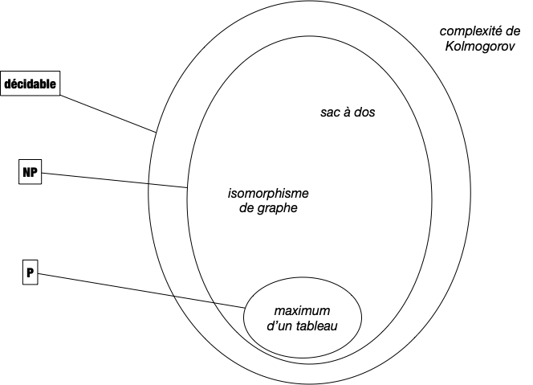
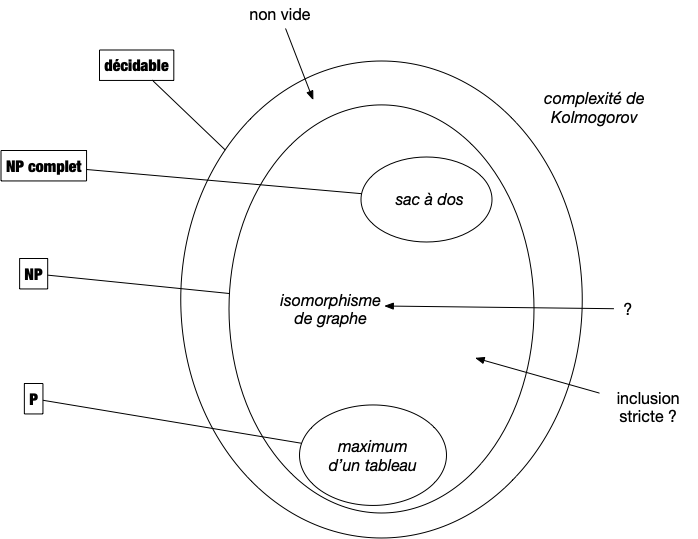

Les classes de problèmes et leurs significations donnent toujours des problèmes aux étudiants. Ils ne sont certes pas aidés par la terminologie qui, lorsqu'elle n'est pas cryptique, peut induire en erreur. Nous allons tenter d'être le plus clair possible en n'introduisant que ce qu'il est nécessaire de jargon pour comprendre l'enjeu de cette classification.

## Problèmes utilisables en pratique

Pour qu'un [problème algorithmique](../../écrire-algorithmes/problème/){.interne} puisse être utilisé en pratique, il faut bien sûr qu'il soit [décidable](../../écrire-algorithmes/problème/#décidable){.interne}, c'est à dire qu'il existe un algorithme permettant de le résoudre.

Mais parmi ces derniers, pour être utile en pratique, encore faut-il que l'on puisse les traiter en temps raisonnable (la durée d'une vie humaine par exemple). On va donner deux définitions du terme _traiter_. Commençons par la plus évidente : la résolution.

### Résolution efficace


Un problème algorithmique est dit **_polynomial_** s'il existe un algorithme de complexité polynomiale en la taille de son entrée permettant de le résoudre.

L'ensemble des problèmes polynomiaux est nommé $P$.


On a vu un certains nombre de problèmes polynomiaux, on peut par exemple citer :

- Trouver le maximum d'un tableau d'entiers dont [on a démontré que sa complexité était linéaire](../../complexité-problème/#recherche),
- Trier un tableau d'entiers dont [on a démontré que sa complexité était $\mathcal{O}(n\ln(n))$](../../problème-tris/complexité-problème) où $n$ est la taille du tableau,

Le cas du [problème de l'exponentiation](../../projet-expenentiation/étude-algorithmique) est intéressant car on a démontré qu'il était en $\mathcal{O}(\ln(n))$ où $n$ est la valeur de l'exposant. Il n'est donc pas évident au premier coup d'œil que cela est bien polynomial en la taille des entrées, c'est à dire 2 entiers.

En informatique théorique l'unité d'information est le bit, la taille de l'entrée d'un algorithme est toujours égale au nombre de bits nécessaires pour la stocker. Pour un entier il s'agit donc du logarithme en base 2 de sa valeur et donc le problème de l'exponentiation est bien polynomiale, il est même linéaire en la taille de l'entrée...


Si pour être rigoureux et formel il est nécessaire de considérer qu'une case mémoire ne peut contenir qu'un seul bit plutôt qu'un entier quelconque, cela alourdit les calculs de complexité sans réel apport.
En effet l'entier étant la donnée élémentaire, toute opération qui en manipule (c'est à dire presque toutes les opérations) devra lire chaque bits les constituant, ce qui ne fait qu'ajouter un facteur linéaire en la taille des données.

Enfin, les entiers sont usuellement bornés, sur 64bits pour un processeur courant, ce qui permet d'avoir assez d'entiers pour ne pas être limité en pratique et de bien avoir une taille en $\mathcal{O}(1)$ (64 étant une constante).


### Vérification efficace

Il existe de nombreux problèmes dont on ne connaît pas la complexité, ou dont on ne connaît pas d'algorithmes polynomiaux pour les résoudre. Citons en 3 pour se fixer les idées :

- [somme de sous-ensemble](https://fr.wikipedia.org/wiki/Probl%C3%A8me_de_la_somme_de_sous-ensembles)
- [sac à dos](https://fr.wikipedia.org/wiki/Probl%C3%A8me_du_sac_%C3%A0_dos)
- [isomorphisme de graphes](https://fr.wikipedia.org/wiki/Isomorphisme_de_graphes)

Si l'on ne connaît pas d'algorithme polynomiaux pour résoudre les 3 problèmes ci-dessus, on peut en revanche vérifier efficacement (_ie._ polynomialement) si une solution en est une ou pas. On reprend ici la notion de [vérifieur](../../structure-chaine-de-caractères/langages-mots)

Prenons par exemple une instance $E$ du problème de somme de sous-ensemble et quelqu'un affirme que $E'$ en est une solution. Il est aisé de vérifier la véracité de cette affirmation avec l'algorithme ci-dessous, qui prend deux paramètres, $E$ et $E'$ :

1. On vérifie que $|E'| \leq |E|$ ce qui peut se faire en $\mathcal{O}(|E|)$ opérations en comptant chaque élément de $E'$ et en s'arrêtant soit après avoir compté tous les éléments soit lorsque le compte dépasse strictement $|E|$.
2. On vérifie que $E'$ est bien un sous-ensemble de $E$, ce qui peut se faire en $\mathcal{O}(|E'| \cdot |E|) = \mathcal{O}(|E|^2)$ opérations (on vérifie que chaque élément de $E'$ est dans $E$).
3. On somme les éléments de $E'$ et on vérifie que la somme finale vaut $0$, $\mathcal{O}(|E'|) = \mathcal{O}(|E|)$ opérations

La complexité de l'algorithme est donc de $\mathcal{O}(|E|^2)$ et ne dépend pas du paramètre $E'$.

Cette notion de vérification est cruciale. Si on ne sait pas construire de solutions nous même mais que quelqu'un arrive avec une solution potentielle, il faut pouvoir vérifier qu'elle est correcte avant de l'utiliser. Sans cette condition le problème n'a pas de solution réaliste : toute valeur peut être solution on ne peut pas savoir avant d'essayer. On peut voir le vérifieur comme une preuve (il y a équivalence entre preuve mathématique et algorithme, rappelons-le) automatisée et efficace (polynomiale, donc pouvant être écrite puis lue par des humains) de l'exactitude d'une solution.

Formalisons cette notion de vérification efficace :


Un **_vérifieur efficace_** d'un problème décidable $P$ ayant pour entrée $e \in E$ et pour sortie $s \in S$ est un algorithme $V: E \times S \rightarrow \\{0, 1\\}$ tel que :

- $V(e, s)$ vaut 1 si et seulement si $s$ est une sortie de $P(e)$
- la complexité de $V$ est **polynomiale** en la taille de $e$ et ne **dépend pas** de la taille de $s$.



Remarquons que notre algorithme pour vérifier si une solution potentielle du problème somme de sous-ensemble en est bien une est un vérifieur efficace. Terminons cette partie par deux remarques d'importance.

Premièrement, il est clair que tous les problèmes de la classe $P$ possèdent un vérifieur efficace. Il suffit en effet de commencer par résoudre le problème puis de vérifier que la solution proposée est la même que celle calculée. Ceci peut se faire en temps polynomial de l'entrée puisque sa résolution l'est.

Deuxièmement, tout problème admettant un vérifieur efficace est décidable. Il suffit en effet de tester toutes les possibilités de sorties possibles (il y en a un nombre fini, polynomial par rapport à la taille de l'entrée puisque le vérifieur est efficace et que l'on peut énumérer en considérant leurs représentations binaires) avec le vérifieur et de s'arrêter s'il répond OUI. Au pire il faut tester toutes les solutions possibles ce qui va coûter de l'ordre de $\mathcal{O}(|e|^k\cdot 2^{|e|^k})$ opérations (avec $k$ une constante), ce qui est certes beaucoup mais reste fini.

En effet, si le vérifieur est un algorithme de complexité $\mathcal{O}(|e|^k)$, la taille de la solution est bornée par $\mathcal{O}(|e|^k)$ et donc sa valeur par $\mathcal{O}(2^{|e|^k})$. Tester toutes les possibilité avec le vérifieur prend alors de l'ordre de $\mathcal{O}(|e|^k\cdot 2^{|e|^k})$ opérations.


Si un problème admet un **_vérifieur efficace_** de complexité $\mathcal{O}(|e|^k)$, alors il est décidable et sa complexité est en $\mathcal{O}(|e|^k\cdot 2^{|e|^k})$ opérations.



Nous venons de caractériser les problèmes utiles qui s'appellent en algorithmie les problèmes NP :


**_Un problème algorithmique est dit_** $NP$ s'il existe un vérifieur efficace de ses solutions.


Ce qui donne le schéma suivant :

La définition ci-dessus appelle une remarque : le nom a été très mal choisi. Il signifie _Non déterministe Polynomial_ (et **_pas du tout_** non polynomial...) car cette classe de problème a initialement été déterminée par rapport aux [machines de Turing non déterministe](https://fr.wikipedia.org/wiki/Machine_de_Turing_non_d%C3%A9terministe) : un problème est dans NP s'il peut être résoluble de façon polynomiale par une machine de Turing non déterministe. Dans ce cadre la définition fait sens puisqu'elle est identique à $P$ pour un autre type de machine.


Un problème est dans $NP$ s'il existe un vérifieur efficace de ses solutions. Ce sont exactement les problèmes algorithmiques utilisable en pratique car :

- On peut énumérer toutes les solutions possibles en temps fini, mais possiblement exponentiel (ce qui fonctionne lorsque la taille d'entrée est faible).
- On peut vérifier efficacement (en temps polynomial) si une proposition de solution est réellement une solution.



Il est clair que l'on a l'inclusion des classes $P$ inclut dans $NP$ inclut dans décidable. Mais cette inclusion est-elle stricte ? Nous en parlerons plus en détails dans la partie suivante, dédiée aux problèmes de décision, où l'on montrera qu'il existe des problèmes décidable mais non dans NP.

En revanche, la question de savoir s'il existe des problèmes de décision qui sont dans $NP$ mais pas dans $P$ est ouverte ! Il existe même un prix d'un million de dollar pour qui donnerai une réponse à cette question (la valeur de cette récompense semble dérisoire par rapport à l'enjeu, mais elle a été proposée [à une  époque où un million de dollar c'était quelque chose](https://www.youtube.com/watch?v=LCZMhs_xpjc) et n'a jamais été réévaluée...).

Certains se demandent même si cette question est décidable (_ie._ démontrable). Ce qui est en revanche sur c'est que tout le monde espère que c'est vrai car sinon tout code informatique devient facilement déchiffrable et s'en est fini de la sécurité sur les réseaux (pour ne donner qu'une des conséquence de l'égalité de $P$ et de $NP$).

Enfin il existe des problèmes dans NP, nommé NP-complet, dont la résolution permet de résoudre tout problème. C'est à dire que si $A$ est un problème NP-complet et que $B$ est un problème de NP alors il existe une **réduction polynomiale** de $B$ vers $A$ : on a $B \leq A$.

On connaît déjà quelques uns de ces problèmes : SAT et le problème du sac à dos. Au final on a :

Notez que le statut du problème de l'isomorphisme de graphe est au statut inconnu : on ne connaît aucun algorithme polynomial pour le résoudre et on n'arrive pas à prouver qu'il est NP-complet.

## Autres classes

Nous nous restreindrons dans ce cours uniquement aux problèmes de $NP$ (et souvent uniquement à ceux de $P$) mais il en existe une foultitudes d'autres. On peut par exemple citer :

- la classe des problèmes de complexité poly-logarithmique $\mathcal{O}(\log^k(n))$
- la classe des problèmes de complexité polynomial en espace $\mathcal{O}(n^k)$
- la classe des problèmes de décision où l'on cherche à répondre NON plutôt que OUI (on remplace les questions de type _"existe-t-il ?"_ par des question de type _"quelque soit"_). Cette classe de problème, est [nommée $co-NP$](https://fr.wikipedia.org/wiki/Co-NP)
- ...


Le lecteur intéresser pourra consulter [la page wikipedia sur les classes de complexité](https://fr.wikipedia.org/wiki/Classe_de_complexit%C3%A9) qui en liste certaines.


