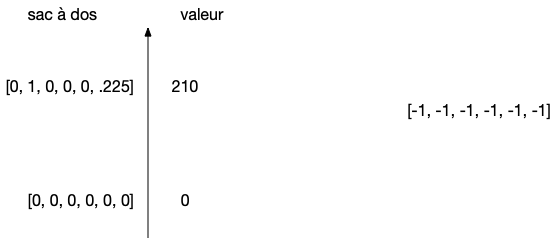
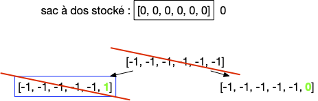
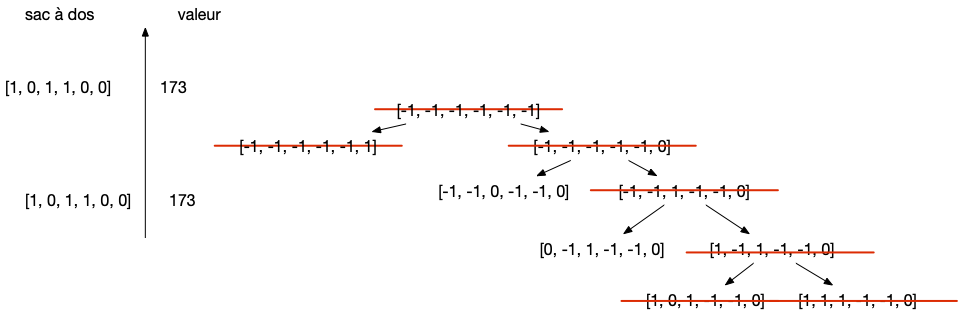
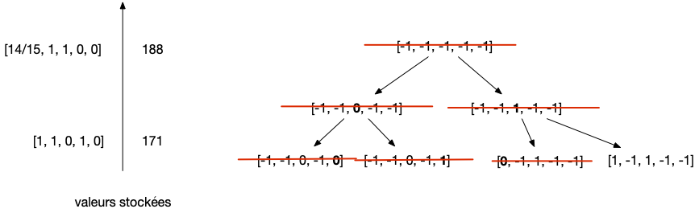
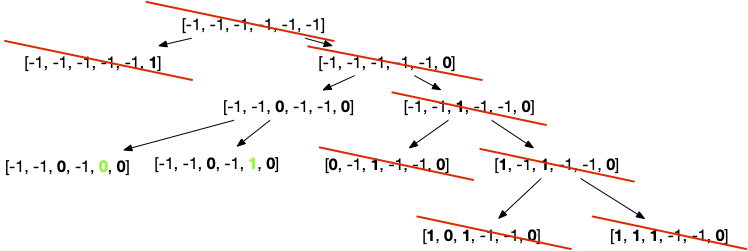

Le problème du sac à dos est un problème fondamental en algorithmie, nombre de problèmes courant pouvant se modéliser sous cette forme.

Nous avons déjà rencontré le problème du sac à dos de quantité nutritive supérieure à un nombre donné, ici, nous allons étudier une variante de ce problème qui cherche un sac à dos de prix maximal.

## Sac à dos fractionnel


[sac à dos fractionnel](https://fr.wikipedia.org/wiki/Probl%C3%A8me_du_sac_%C3%A0_dos#Variables_continues)


Commençons par une version simplifiée du problème, dit du **_sac à dos fractionnel_** :



- **Nom** : sac à dos fractionnel
- **Entrées** :
  - $n$ poudres différentes, décrites par :
    - leurs masses en kilo : $k_i$
    - leurs prix : $p_i$
  - un sac à dos pouvant contenir $K$ kilos de poudre
- **Sortie** : Donnez une répartition de poudres $0\leq f_i\leq 1$ à mettre dans le sac telle que :
  - on peut mettre les poudres dans le sac : $\sum_{1\leq i \leq n} f_i \cdot k_i \leq K$
  - le prix du sac $\sum_{1\leq i \leq n} f_i \cdot p_i$ soit maximum


Par exemple, on a un sac à dos de 20kg et six poudres de paramètres :

- poudre 1 : 15kg et un prix de 135€ (9€ le kilo)
- poudre 2 : 2kg et un prix de 30€ (15€ le kilo)
- poudre 3 : 4kg et un prix de 32€ (8€ le kilo)
- poudre 4 : 1kg et un prix de 6€ (6€ le kilo)
- poudre 5 : 6kg et un prix de 18€ (3€ le kilo)
- poudre 6 : 80kg et un prix de 800€ (10€ le kilo).

Le sac peut contenir soit :

- 20kg de la poudre 6, pour un profit de 200€,
- 14kg de la poudre 1 et 6kg de la poudre 5, pour un profit de 114€,
- 1kg de la poudre 1 à 5 et le reste (15kg) en poudre 6, pour un profit de 192€,
- ...

### Résolution par un algorithme glouton

Un algorithme _"glouton"_ ajoute itérativement un élément à une solution possible pour rendre au final une solution la plus grande possible. Dans le cas du sac à dos, on ajoute petit à petit des produit jusqu'à ce que le sac soit plein. Reste à choisir l'ordre dans lequel ajouter les poudre et comme on veut maximiser le profit, on choisi de prendre les poudres par prix au kilo décroissant.

On obtient donc in fine l'algorithme suivant, écrit en python :

```python
def glouton(produits, masse_totale):
    ordre = list(range(len(produits)))
    ordre.sort(key=lambda i: -produits[i]["prix"] / produits[i]["kg"])

    sac_a_dos = [0] * len(produits)

    for i in ordre:
        x = produits[i]
        if masse_totale >= x["kg"]:
            sac_a_dos[i] = 1
            masse_totale -= x["kg"]
        elif masse_totale > 0:
            sac_a_dos[i] = masse_totale / x["kg"]
            masse_totale = 0
        else:
            break

    return sac_a_dos
```

- entrée : une liste de produits, où chaque produit est un dictionnaire contenant les clés `"prix"`{.language-} et `"kg"`{.language-}
- sortie : une liste tel que l'élément d'indice i contienne la fraction de poudre (entre 0 et 1) du produit d'indice i dans le sac à dos.


On trie la liste dans le code en utilisant un liste tampon.


La complexité de cet algorithme est déterminée par le tri, puisque l'intérieure de la boucle `for`{.language-} est en temps constant.

Testons cet algorithme sur l'exemple. Si on devait coder les données de l'exemple, on aurait quelque chose du genre :

```python
EXEMPLE = [
    {
        "nom": "poudre 1",
        "kg": 15,
        "prix": 135,
    },
    {
        "nom": "poudre 2",
        "kg": 2,
        "prix": 30,
    },
    {
        "nom": "poudre 3",
        "kg": 4,
        "prix": 32,
    },
    {
        "nom": "poudre 4",
        "kg": 1,
        "prix": 6,
    },
    {
        "nom": "poudre 5",
        "kg": 6,
        "prix": 18,
    },
    {
        "nom": "poudre 6",
        "kg": 80,
        "prix": 800,
    },
]

```

Notez que l'on a ajouté une clé `"nom"`{.language-} pour retrouver l'objet dans le sac à dos.


Reprenez l'exemple et donnez la solution donnée par l'algorithme glouton.

On a un sac à dos de $K=20$ et 6 produits :

- poudre 1 : 15kg et un prix de 9€ le kilo
- poudre 2 : 2kg et un prix de 15€ le kilo
- poudre 3 : 4kg et un prix de 8€ le kilo
- poudre 4 : 1kg et un prix de 6€ le kilo
- poudre 5 : 6kg et un prix de 3€ le kilo
- poudre 6 : 80kg et un prix de 10€ le kilo



Les poudres sont examinées dans l'ordre 2, 6, 1, 3, 4, 5. On obtient :

- les 2kg de la poudre 2
- 18kg de la poudre 6

Pour un profit de 210€


Remarquez que l'algorithme prendra toujours toute la poudre disponible à part peut-être la dernière.

Cet algorithme glouton est même optimal !


L'algorithme glouton précédent rend un sac à dos fractionnel optimal.


On peut remarquer que l'algorithme glouton prend toujours tout le produit disponible jusqu'au dernier choix où il ne prend qu'une fraction de celui-ci (la place restante) pour finir de remplir le sac à dos.

Pour notre solution, on note $(f_1, \dots, f_n)$ les proportions choisis dans l'ordre de choix de l'algorithme glouton.
On suppose que notre solution n'est pas optimale et, parmi toutes les solutions optimales possible, on en prend une qui correspond le plus longtemps possible avec la solution rendue par l'algorithme. Soit alors $0 \leq i <n$ le plus petit indice telle que la solution optimale et celle rendue par l'algorithme est différente. La solution optimale est alors $(f_1, \dots, f_{i-1}, f'_i, \dots, f'_n)$.

Jusqu'à l'étape $i-1$ tous les choix sont identiques donc une fois placés les $i$ premiers produits (les produits d'indices $0$ à $i-1$) avec le même kilo, il reste la même place dans le sac-à-dos et pour notre algorithme et pour la solution optimale. De là, par construction de l'algorithme glouton (on prend à chaque choix soit tout le produit soit juste assez pour finir de remplir tout le sac) les kilos $f'_i$ de la solution optimale pour le produit d'indice $i$ est forcément strictement plus petit que $f_i$.

De là, comme $p_i/k_i \geq p_j/k_j$ pour tout $j > i$, on arrive à 2 contradictions :

- soit $\sum_{i<j}f'_j\cdot k_j < (f_i-f_i')\cdot k_i$ et la solution $(f_1, \dots f_i, 0, \dots, 0)$ est strictement meilleure que l'optimal
- soit $\sum_{i<j}f'_j\cdot k_j \geq (f_i-f_i')\cdot k_i$ et on peut créer la solution suivante, plus proche de la solution gloutonne, et meilleure (ou égale) à l'optimale en remplaçant les poudres $j>i$ par de la poudre $i$ jusqu'à obtenir autant de poudre $i$ que le glouton :
  - $f_l'' = f_k$ pour tout $l\leq i$
  - $f_l'' = 0$ pour tout $l> i$ si $\sum_{i<j \leq k}(f'_j \cdot k_j) < (f_i-f_i')\cdot k_i$
  - $f_{l^\star}'' = f_{l^\star}' - \epsilon$ pour ${l^\star}> i$ tel que $\sum_{i<j< l \leq {l^\star}}(f_j' \cdot k_j) < (f_i-f_i')\cdot k_i \leq \sum_{i<j<  {l^\star}}(f_j' \cdot k_j)$ et $\epsilon = \frac{(f_i-f_i')\cdot k_i - \sum_{i<j< {l^\star}}(f_j' \cdot k_j)}{k_{l^\star}}$
  - $f_l'' = f_l'$ pour $l > {l^\star}$

Notre hypothèse arrivant à une contradiction, elle était fausse : la solution de l'algorithme glouton est optimale.

> TBD faire dessin avec des tas pour expliquer le cas 2.


## Problème du sac à dos


[Problème du sac à dos](https://fr.wikipedia.org/wiki/Probl%C3%A8me_du_sac_%C3%A0_dos)


Le fait de pouvoir fractionner les éléments est un cas particulier heureux, mais ce n'est pas la norme, pensez à un déménagement : les déménageurs ne peuvent prendre qu'un bout du canapé sous prétexte qu'il ne rentre pas en entier dans le camion... La formalisation classique du sac à dos ne permet pas de scinder des objets :


- **Nom** : sac à dos optimal
- **entrées** :
  - $n$ produits différentes, décris par :
    - leurs masses en kilo : $k_i$
    - leurs prix : $p_i$
  - un sac à dos pouvant contenir $K$ kilos
- **Sortie** : Donnez une liste de produits à mettre dans le sac ($f_i = 1$ si le produit $i$ est dans le sac et $f_i = 0$ sinon)  telle que :
  - on peut mettre les produits choisis dans le sac : $\sum_{1\leq i \leq n} f_i \cdot k_i \leq K$
  - le prix du sac $\sum_{1\leq i \leq n} f_i \cdot p_i$ soit maximum


Ce problème se décline de plein de façons pratiques :

- en remplaçant le prix par la quantité nutritive et maximiser un _road trip_
- en remplaçant la masse par le volume on peut remplir un camion de déménagement au maximum théorique
- mais aussi le stockage de fichiers (les produits) sur un disque dur (le sac à dos) de capacité limité (le prix est la taille de chaque fichier)
- ou encore maximiser la charge d'un générateur
- ...

Comme on ne peut pas découper les produits au contraire du sac à dos fractionnel, on a le résultat suivant :


La solution optimale d'un problème du sac à dos est inférieure à la solution optimale des mêmes données appliquée au problème du sac à dos fractionnel


La solution optimale du problème du sac à dos est une solution admissible au problème du sac à dos fractionnel, son optimum est donc nécessairement plus grand.


Notez que le problème du sac à dos optimal est un problème d'optimisation : on cherche le sac à dos de prix **maximum**. En tant que tel, il est difficile de prouver qu'il est dans NP car comment vérifier si on a bien une solution maximale ?

On peut cependant utiliser [le problème du sac à dos](../../problèmes-NP/#sac-à-dos){.interne} qui est dans NP pour trouver l'optimum en faisant de la dichotomie sur le prix à chercher : s'il existe un sac à dos de prix supérieur a P ou double le prix et sinon on diminue le prix par deux. On aura besoin de log itération pour trouver le maximum.


Les problèmes d'optimisation ne sont pas dans NP, mais leurs versions existentielles le sont.

On trouver alors l'optimum par dichotomie.


## Algorithmes gloutons

Comme les solutions du sac à dos sont des solutions admissible du sac à dos fractionnel, on peut tenter d'adapter l'algorithme glouton (optimal) précédent au problème du sac à dos :

```python
def glouton(produits, masse_totale):
    ordre = list(range(len(produits)))
    ordre.sort(key=lambda i: -produits[i]["prix"] / produits[i]["kg"])

    sac_a_dos = [0] * len(produits)

    for i in ordre:
        x = produits[i]
        if masse_totale >= x["kg"]:
            sac_a_dos[i] = 1
            masse_totale -= x["kg"]

    return sac_a_dos
```

- entrée : une liste de produits, où chaque produit est un dictionnaire contenant les clés `"prix"`{.language-} et `"kg"`{.language-}
- sortie : une liste tel que l'élément d'indice i contienne la fraction de poudre (entre 0 et 1) du produit d'indice i dans le sac à dos.


La structure de l'algorithme est identique à celle du sac à dos fractionnel.


Reprenons l'exemple et modifions le pour que l'on ne puisse pas prendre une fraction de poudre :

- poudre 1 : 15kg et un prix de 135€ (9€ le kilo)
- poudre 2 : 2kg et un prix de 30€ (15€ le kilo)
- poudre 3 : 4kg et un prix de 32€ (8€ le kilo)
- poudre 4 : 1kg et un prix de 6€ (6€ le kilo)
- poudre 5 : 6kg et un prix de 18€ (3€ le kilo)
- poudre 6 : 80kg et un prix de 800€ (10€ le kilo). On supprime ce produit puisqu'il ne rentre pas dans le sac.

En maximisant le profit, l'algorithme glouton préconise de prendre les poudres 1, 2 et 4 pour un profit de 171€. On se rend cependant compte que cette solution n'est plus maximale ! En effet prendre les poudres 1, 3 et 4 rapporte un profit de 173€.

On peut même montrer que l'algorithme glouton ne possède pas de garantie :


Montrer que pour 2 produits seulement, le rapport entre la solution optimale et la solution de l'algorithme glouton peut-être aussi grand que l'on veut.



Si l'on prend les produits :

- produit 1 : de prix 2 et de poids 1,
- produit 2 : de prix $K$ et de poids $K$, qui correspond à la masse totale que peut contenir le sac à dos.

Le glouton privilégiera toujours le produit 1 alors que c'est le produit 2 qu'il faut choisir. Comme on peut faire grossir la capacité du sac, le rapport entre la valeur optimale et celle donnée par le glouton peut être aussi grand que l'on veut.


On peu alors vouloir modifier l'algorithme glouton pour considérer le prix total et pas celui au kilo (on trouve alors l'optimum pour l'exemple) mais ce n'est pas non plus super :


Montrer que le rapport entre la solution optimale et la solution de l'algorithme glouton modifié peut-être aussi grand que l'on veut.



Si l'on prend $K+1$ produits :

- produit 1 : de prix 2 et de poids $K$, qui correspond à la masse totale que peut contenir le sac à dos.
- produit 2 à $K+1$ : de prix 1 et de poids 1

Le glouton privilégiera toujours le produit 1 alors que c'est le produit 2 à $K+1$ qu'il faut choisir. Comme on peut faire grossir la capacité du sac, le rapport entre la valeur optimale et celle donnée par le glouton peut être aussi grand que l'on veut.


Tout n'est cependant pas perdu car on peut modifier l'algorithme glouton pour qu'il soit à performance garantie. Considérons notre problème comme un sac à dos fractionnel et exécutons l'algorithme glouton fractionnel. Soit $i^\star$ la dernière étape, qui est la seule pour laquelle le produit ne peut pas être ajouté dans le sac. On a alors :

- $\sum_{i < i^\star} k_i \leq K$
- $\sum_{i < i^\star} k_i + k_{i^\star} > K$
- la solution du sac à dos fractionnel associé est : $\sum_{i < i^\star} p_i + (\frac{K-\sum_{i < i^\star} k_i}{k_{i^\star}}) \cdot p_{i^\star}$

Des constatations ci-dessus on peut alors constituer l'algorithme suivant (en supposant sans perte de généralité que $k_i \leq K$ pour tout $i$ donc que tous les produits rentrent dans le sac) :

1. on trie tous les produits par prix au kilo décroissante
2. on note $i^\star$ le premier élément dans cet ordre tel que $\sum_{i \leq i^\star} k_i > K$
3. l'algorithme rend $\max(\sum_{i < i^\star} p_i, p_{i^\star})$.

Cette simple modification permet de garantir la solution obtenue :


En utilisant le fait que $a + b \leq 2\cdot \max(a, b)$, montrer la la solution de l'algorithme ne peut pas être moins que 2 fois moins bonne que la solution optimale.


On sait que la solution optimale (notée $\text{OPT}$) est :

- plus grande que la solution trouvée par notre algorithme (notée $\text{SOL}$)
- plus petite que $\sum_{i < i^\star} p_i + p_{i^\star}$

Comme $\sum_{i < i^\star} p_i + p_{i^\star} \leq 2 \cdot \max(\sum_{i < i^\star} p_i, \sum_{i < i^\star} p_i)$ et que l'algorithme rend $\max(\sum_{i < i^\star} p_i, \sum_{i < i^\star} p_i)$, on a :

$$
\frac{1}{2}\cdot \text{OPT} \leq \text{SOL} \leq \text{OPT}
$$



## Solution par programmation dynamique


La technique de résolution du sac à dos par programmation dynamique est fondamentale. **Retenez-là** car elle peut-être utilisée dans bon nombre de problèmes concrets !


Le problème du sac à dos admet une solution via la programmation dynamique simple et élégante. Soient $[p_1, \dots, p_n]$, $[k_1, \dots, k_n]$ et $K$ les données d'un problème du sac à dos et $V([p_1, \dots, p_n], [k_1, \dots, k_n], K)$ sa valeur optimale. Alors de deux choses l'une :

- soit la solution optimale contient le produit$x_n$ et $V([p_1, \dots, p_n], [k_1, \dots, k_n], K) = V([p_1, \dots, p_{n-1}], [k_1, \dots, k_{n-1}], K-k_n) + p_n$
- soit la solution optimale ne contient pas le produit $x_n$ et $V([p_1, \dots, p_n], [k_1, \dots, k_n], K) = V([p_1, \dots, p_{n-1}], [k_1, \dots, k_{n-1}], K)$

La remarque ci-dessus permet de définir, tout comme pour [l'alignement de séquences](../../design-algorithmes/programmation-dynamique/alignement-séquences/étude/){.interne}, le terme général $M[i][j]$ d'une matrice à $n$ lignes et $K+1$ colonnes représentant $V([p_1, \dots, p_i], [k_1, \dots, k_i], j)$ :

<div>
$$
M[i][j] = \max(M[i-1][j-k_i] + p_i, M[i-1][j])
\text{ si } k_i \leq j
$$
$$
M[i][j] = M[i-1][j] \text{ sinon}
$$
</div>

Avec comme condition d'initialisation la première ligne :

- $M[1][j] = 0$ si $j < k_1$
- $M[1][j] = p_1$ si $j \geq k_1$


Reprenez l'exemple et donnez la matrice associée.

On a un sac à dos de $K=20$ et 5 produits :

- poudre 1 : 15kg et un prix de 135€
- poudre 2 : 2kg et un prix de 30€
- poudre 3 : 4kg et un prix de 32€
- poudre 4 : 1kg et un prix de 6€
- poudre 5 : 6kg et un prix de 18€



Il faut créer une matrice à 5 lignes et 21 colonnes :

| 0     | 1   | 2   | 3   | 4   | 5   | 6   | 7   | 8   | 9   | 10  | 11  | 12  | 13  | 14  | 15  | 16  | 17  | 18  | 19  | 20  |
| ----- | --- | --- | --- | --- | --- | --- | --- | --- | --- | --- | --- | --- | --- | --- | --- | --- | --- | --- | --- | --- | --- |
| **1** | 0   | 0   | 0   | 0   | 0   | 0   | 0   | 0   | 0   | 0   | 0   | 0   | 0   | 0   | 0   | 135 | 135 | 135 | 135 | 135 | 135 |
| **2** | 0   | 0   | 30  | 30  | 30  | 30  | 30  | 30  | 30  | 30  | 30  | 30  | 30  | 30  | 30  | 135 | 135 | 165 | 165 | 165 | 165 |
| **3** | 0   | 0   | 30  | 30  | 32  | 32  | 62  | 62  | 62  | 62  | 62  | 62  | 62  | 62  | 62  | 135 | 135 | 165 | 165 | 167 | 167 |
| **4** | 0   | 6   | 30  | 36  | 36  | 38  | 62  | 68  | 68  | 68  | 68  | 68  | 68  | 68  | 68  | 135 | 141 | 165 | 171 | 171 | 173 |
| **5** | 0   | 6   | 30  | 36  | 36  | 38  | 62  | 68  | 68  | 68  | 68  | 68  | 68  | 68  | 68  | 135 | 141 | 165 | 171 | 171 | 173 |

Par exemple la case $M[3][16]$ représente le sac à dos de masse 16 pouvant contenir les produits 1, 2 et 3. Il vaut soit :

- le maximum du sac $M[2][16]$, c'est à dire le sac maximum de masse 16 qui ne contient pas le produit 3
- $M[2][16-2] + 30$ c'est à dire le sac à dos maximum qui contient le produit 3 et pour lequel il reste 16-2 place pour range les produits 1 et 2.



Une fois la matrice complete, de la même manière que pour [l'alignement de séquences](../../design-algorithmes/programmation-dynamique/alignement-séquences/étude/){.interne}, on remonte la matrice pour trouver le sac à dos.


Reprenez la matrice associée à l'exemple que vous avez calculée dans l'exercice précédent et déduisez en les produits à emporter dans le sac à dos.



On remonte depuis la dernière case en reprenant le chemin inverse pour la créer :

1. $M[5][20] = \max(M[4][20 - 6] + 18, M[4][20]) = M[4][20]$ ($M[4][16] = 141$) : on ne prend pas la poudre 5
2. $M[4][20] = \max(M[3][20 - 1] + 6, M[3][20]) = M[3][19] + 6$ ($M[3][20] = 167$) : on prend la poudre 4
3. $M[3][19] = \max(M[2][19 - 4] + 32, M[2][19]) = M[2][15] + 32$ ($M[2][19] = 165$) : on prend la poudre 3
4. $M[2][15] = \max(M[1][15 - 2] + 30, M[1][15]) = M[1][15] $ ($M[1][13] = 0$) : on ne prend pas la poudre 2
5. $M[1][15] = 135$ : on prend la poudre 1

| 0     | 1   | 2   | 3   | 4   | 5   | 6   | 7   | 8   | 9   | 10  | 11  | 12  | 13  | 14  | 15  | 16      | 17    | 18  | 19  | 20      |
| ----- | --- | --- | --- | --- | --- | --- | --- | --- | --- | --- | --- | --- | --- | --- | --- | ------- | ----- | --- | --- | ------- | ------- |
| **1** | 0   | 0   | 0   | 0   | 0   | 0   | 0   | 0   | 0   | 0   | 0   | 0   | 0   | _0_ | 0   | **135** | 135   | 135 | 135 | 135     | 135     |
| **2** | 0   | 0   | 30  | 30  | 30  | 30  | 30  | 30  | 30  | 30  | 30  | 30  | 30  | 30  | 30  | **135** | 135   | 165 | 165 | _165_   | 165     |
| **3** | 0   | 0   | 30  | 30  | 32  | 32  | 62  | 62  | 62  | 62  | 62  | 62  | 62  | 62  | 62  | 135     | 135   | 165 | 165 | **167** | _167_   |
| **4** | 0   | 6   | 30  | 36  | 36  | 38  | 62  | 68  | 68  | 68  | 68  | 68  | 68  | 68  | 68  | 135     | _141_ | 165 | 171 | 171     | **173** |
| **5** | 0   | 6   | 30  | 36  | 36  | 38  | 62  | 68  | 68  | 68  | 68  | 68  | 68  | 68  | 68  | 135     | 141   | 165 | 171 | 171     | **173** |



La complexité de cet algorithme est $\mathcal{O}(n\cdot K)$.


La complexité de l'algorithme par programmation dynamique dépend de $n$ et de $K$. Comme $K$ peut être aussi grand qu'on veut la résolution peut être exponentielle par rapport aux nombre d'objet à à mettre dans le sac. Si $K = 2^n$ par exemple. la méthode par programmation dynamique prendra plus de temps que l'énumération de toutes les solutions possibles !


La remarque ci-dessus implique qu'on va avoir tendance à utiliser cette méthode pour des sac à dos donc la taille est petite (ou polynomiale) par rapport aux objets à y mettre. Dans le cas où l'on a de gros sac à dos et plein de petits objets, on pourra préférer la prochaine solution qui énumère toutes les solutions possibles.


Si on cherche à calculer la complexité par rapport à la taille des données, comme $K$ est stocké sur $\log_2(K)$ bits, l'algorithme de programmation dynamique peut être considéré comme exponentielle ! Comme c'est un cas limite et que souvent les valeurs entières sont bornées, on appelle [pseudo-polynomiale](https://fr.wikipedia.org/wiki/Temps_de_calcul_pseudo-polynomial) ce genre de complexité qui dépendent de **la valeurs d'entiers**.



## Solutions par énumération

Pour trouver la solution maximale à un problème d'optimisation, on peut toujours énumérer toutes les solutions. Dans le cas d'un sac à dos cela revient à énumérer tous les sous ensembles de l'ensemble des produits et de prendre celui qui maximise le sac à dos. Pour aider à l'énumération, formalisons le problème du sac à dos sous la forme d'un [problème d'optimisation linéaire en nombre entier](https://fr.wikipedia.org/wiki/Optimisation_lin%C3%A9aire_en_nombres_entiers) :



- **_Les données_** sont :
  - les prix $p_i$ ($1\leq i \leq n$)
  - les poids des produits $k_i$ ($1\leq i \leq n$)
  - la contenance en kilo $K$ du sac à dos
- **_les variables_** du problème sont constituées de $n$ variables $x_i$ ($1\leq i \leq n$)
- le but est de **_maximiser la fonction objectif_** : $\sum_{1\leq i \leq n}x_i\cdot p_i$
- sous **_les contraintes_** :
  - $x_i \in \\{0, 1\\}$ pour tout $1\leq i \leq n$
  - $\sum_{1\leq i \leq n}x_i\cdot k_i \leq K$



### Énumération exhaustive

Énumérer toutes les solutions possibles du sac à dos revient à choisir pour chaque $x_i$ s'il vaut 0 ou 1 puis de vérifier pour cette affectation :

- si elle est **réalisable**, c'est à dire que les produits choisis tiennent tous dans le sac à dos
- si la fonction objectif est maximale par rapport aux affectations déjà faite

Pour minimiser le temps pris pour faire cet algorithme il faut s'assurer de ne pas refaire une affectation déjà faite. On peut pour cela reprendre [l'algorithme successeur](../../projet-algorithmes-classiques/compteur-binaire/#successeur){.interne} qui permet de trouver le successeur d'un nombre écrit sous sa forme binaire.

L'algorithme peut alors être, avec des produits organisés comme l'`EXEMPLE`{.language-} :

```python
def énumération(produits, K):
    kg = [x["kg"] for x in produits]
    prix = [x["prix"] for x in produits]
    n = len(produits)

    sac_à_dos = [0] * n

    sac_à_dos_max = list(sac_à_dos)
    sac_à_dos_profit_max = 0

    while sac_à_dos != [1] * n:
        successeur(sac_à_dos)

        if sum(x * y for x, y in zip(sac_à_dos, kg)) <= K:
            profit = sum(x * y for x, y in zip(sac_à_dos, prix))
            if profit > sac_à_dos_profit_max:
                sac_à_dos_profit_max = profit
                sac_à_dos_max = list(sac_à_dos)

    return sac_à_dos_max
```


Si vous faites `affectation_max = affectation`{.language-} plutôt que `affectation_max = list(affectation)`{.language-} vous ne stockerez pas l'affectation maximale, vous donnerez juste un nouveau nom à la liste `affectation`{.language-} ce qui est problématique puisque `successeur`{.language-} la modifie.


On a utilisé [la fonction `zip`{.language-} de python](https://docs.python.org/fr/3/library/functions.html#zip) qu'il est très utile de connaitre.


La complexité de l'algorithme est la somme de :

- la complexité totale de tous les appels à `successeur`{.language-} et que l'on a déterminé (à de multiple reprise) dans [la partie consacrée à la complexité amortie](../../complexité-amortie/){.interne} étant égale à $\mathcal{O}(2^n)$
- la complexité du calcul de la fonction objectif et de l'admissibilité ($\mathcal{O}(n)$ pour les 2 calculs) pour chaque affectation (il y en a $\mathcal{O}(n)$) : $\mathcal{O}(n \cdot 2^n)$
- le stockage de l'affectation ($\mathcal{O}(n)$) possiblement pour chaque affectation (il y en a $\mathcal{O}(n)$) : $\mathcal{O}(n \cdot 2^n)$

On obtient une complexité totale de $\mathcal{O}(n \cdot 2^n)$. La complexité est exponentielle, mais c'est du au fait qu'il y a beaucoup de cas à voir. L'analyse d'une affectation particulière est simple.


Reprenez l'exemple et donnez la solution optimale par recherche exhaustive.

On a un sac à dos de $K=20$ et 5 produits :

- poudre 1 : 15kg et un prix de 135€
- poudre 2 : 2kg et un prix de 30€
- poudre 3 : 4kg et un prix de 32€
- poudre 4 : 1kg et un prix de 6€
- poudre 5 : 6kg et un prix de 18€



Il y a $2^5 = 32$ possibilités et les seules possibilités admissibles maximales sont :

- poudres 1, 2, 4 de valeur 171€
- poudres 1, 3, 4 de valeur 173€
- poudres 2, 3, 4, 5 de valeur 86€
  

### Branch and bound


[Lien Wikipédia sur le _Branch and Bound_](https://fr.wikipedia.org/wiki/S%C3%A9paration_et_%C3%A9valuation)


La méthode du **_Branch and Bound_** (ou **_Séparation et évaluation_** en Français) est une méthode générale permettant d'accélérer la recherche de l'optimum d'un problème d'optimisation par recherche exhaustive si l'on peut trouver facilement une borne supérieure à un sous-problème où certaines affectation (mais pas toutes) ont déjà été faites.

Cette méthode est particulièrement bien adaptée au problème du sac à dos.

#### Bornes supérieure

On peut toujours considérer un problème de sac à dos comme un problème de sac à dos fractionnel que l'on peut facilement résoudre. Comme les solutions d'un sac à dos sont contenus dans les solution d'un sac à dos fractionnel (on prend pour chaque produit soit tout soit rien) on peut :

- majorer la solution du sac à dos par la valeur optimale du sac à dos fractionnel,
- **si** la solution du sac à dos fractionnel est aussi une solution du sac à dos **alors** c'est aussi la solution optimale du sac à dos.

Si l'on reprend l'exemple en supprimant la poudre 6 qui ne rentre pas en entier dans le sac, on obtient une solution du sac à dos fractionnel valant :

- 15kg de poudre 1 (l'entièreté)
- 2kg de poudre 2 (l'entièreté)
- 3/4 de la poudre 3

Pour un profit de 174€ qui est bien strictement plus grand que le profit max du sac à dos (qui vaut 173€). Remarquez que l'on ne **peut pas déduire la solution entière à partir de la solution fractionnelle** : elle contient la poudre 2 qui n'est pas dans la solution optimale.


Une borne supérieure à un problème du sac à dos peut être trouvé en relâchant la contrainte d'intégrité des variables et de considérer le problème comme un sac à dos fractionnel.

La valeur optimale du sac à dos fractionnel associé est appelée **_borne supérieure_** du problème du sac à dos.


#### Sous-problème

Si on fixe une variable pour un problème du sac à dos, on se ramène à un sac à dos plus petit :


Soient $p_i$ ($1\leq i \leq n$), $k_i$ ($1\leq i \leq n$) et $K$ les données d'un sac à dos à $n$ variables $x_i$ ($1\leq i \leq n$).

Si l'on fixe $x_1$ à :

- $x_1= 0$, alors cela revient à résoudre un sac à dos à $n-1$ variables de données $p_i$ ($2\leq i \leq n$), $k_i$ ($2\leq i \leq n$) et une contenance de $K$
- $x_1= 1$, alors cela revient à résoudre un sac à dos à $n-1$ variables de données $p_i$ ($2\leq i \leq n$), $k_i$ ($2\leq i \leq n$) et une contenance de $K-p_1$



On a choisi de fixer $x_1$, mais il est évident à une renumérotation prêt, que l'on peut fixer n'importe quelle variable.


On peut ainsi fixer n'importe quel sous-ensemble de variables et toujours avoir à résoudre un problème de sac à dos.


Soient $p_i$ ($1\leq i \leq n$), $k_i$ ($1\leq i \leq n$) et $K$ les données d'un sac à dos à $n$ variables $x_i$ ($1\leq i \leq n$).

Une **_solution ouverte_** est une suite $y_i$ ($1\leq i \leq n$) telle que :

- $y_i$ ne peut prendre que 3 valeurs -1, 0 ou 1
- $\sum_{i \in I} y_i \cdot k_i \leq K$ avec $I$ l'ensemble des indices $i$ tels que $y_i \neq -1$

Une solution ouverte permet de définir un **_sous-problème associé_** où l'on les variables $x_i$ sont fixées à $y_i$ si $y_i \neq -1$.


Une solution ouverte ne possédant que des -1 correspond au problème général du sac à dos et les solutions ouvertes ayant des 0 et des 1 correspondent à un sous-problème.

#### Déroulement de l'algorithme

L'algorithme du Branch and bound est alors très simple : il va énumérer toutes les solutions ouvertes mais ne va les explorer que si cela en vaut le coup, c'est à dire s'il est possible de trouver une solution meilleure que celle qu'on a déjà.

- initialisation : on commence avec un sac à dos vide et la solution ouverte ne contenant que des -1.
- tant que : il existe une solution ouverte non explorée, on calcule la valeur de son sac à dos fractionnel optimal.
  - Si cette valeur est inférieure à celle du sac à dos courant, il est inutile de l'explorer car on ne pourra trouver que des solutions moins bonnes.
  - Sinon :
    - si le sac à dos fractionnel optimal est un sac à dos on compare sa valeur au sac à dos stocké et on le met à jour si cette nouvelle solution est meilleure
    - sinon, il faut explorer de nouveaux sous-problème en fixant la valeur fractionnelle de la solution optimale à 0 et à 1. On ajoute ces deux sous problèmes aux solutions ouvertes à explorer.

Avant de formaliser tout ça, regardons ce que cela fait sur l'exemple. On a un sac à dos de $K=20$ et 5 produits :

- poudre 1 : 15kg et un prix de 135€ (9€ le kilo)
- poudre 2 : 2kg et un prix de 30€ (15€ le kilo)
- poudre 3 : 4kg et un prix de 32€ (8€ le kilo)
- poudre 4 : 1kg et un prix de 6€ (6€ le kilo)
- poudre 5 : 6kg et un prix de 18€ (3€ le kilo)
- poudre 6 : 80kg et un prix de 800€ (10€ le kilo)

On commence par la solution ouverte $y = [-1, -1, -1, -1, -1, -1]$ de solution fractionnelle optimale $[0, 1, 0, 0, 0, 0.225]$ et le sac à dos vide $x = [0, 0, 0, 0, 0, 0]$. On a coutume de représenter les différents choix par un arbre. Après cette étape d'initialisation on a :



Le sac à dos fractionnel n'est pas un sac à dos. On ajoute donc potentiellement les solutions ouvertes $[-1, -1, -1, -1, -1, 1]$ et $[-1, -1, -1, -1, -1, 0]$ aux solutions à explorer. Comme $[-1, -1, -1, -1, -1, 1]$ ne peut pas donner de sac à dos valide, on se retrouve avec les solutions ouvertes à explorer suivantes :



La solution à explorer est $[-1, -1, -1, -1, -1, 0]$ de solution fractionnelle optimale $[1, 1, 0.75, 0, 0, 0]$ et de valeur 189.0 qui est strictement supérieure à notre sac à dos stocké. On explore cette solution pour obtenir :


L'analyse de la solution ouverte $[-1, -1, 1, -1, -1, 0]$ donne une solution fractionnelle optimale de $[0.9333333333333333, 1, 1, 0, 0, 0]$ et de valeur 188, ce qui fait que l'on continue l'exploration :


L'analyse de la solution ouverte $[1, -1, 1, -1, -1, 0]$ donne une solution fractionnelle optimale de $[1, 0.5, 1, 0, 0, 0]$ et de valeur 182, ce qui fait que l'on continue encore :


Notez que la solution ouverte $[1, 1, 1, -1, -1, 0]$ de donne pas de sac à dos viable, elle est donc directement éliminée.

Lors de l'analyse de la solution ouverte $[1, 0, 1, -1, -1, 0]$, quelque chose de nouveau arrive : la solution fractionnelle optimale est un sac à dos ! Il contient $[1, 0, 1, 1, 0, 0]$ et vaut 173. On met à jour notre sac à dos et il est inutile de continuer cette voie. À l'issue de cette étape on a :



L'analyse de la solution ouverte $[0, -1, 1, -1, -1, 0]$ donne une solution optimale $[0, 1, 1, 1, 1, 0]$ de valeur 86 ce qui est moins bon que notre sac à dos stocké : inutile d'explorer. On a :




Finissez l'exploration et donnez l'arbre final.





Avec :

- $[-1, -1, 0, -1, -1, 0]$ de sac à dos fractionnel $[1, 1, 0, 1, 0.33, 0]$ de valeur 177.0 : on continue d'explorer
- $[-1, -1, 0, -1, 1, 0]$ de sac à dos fractionnel $[0.8, 1, 0, 0, 1, 0]$ de valeur 156.0, donc inutile de continuer l'exploration de cette solution ouverte
- $[-1, -1, 0, -1, 0, 0]$ de sac à dos fractionnel $[1, 1, 0, 1, 0, 0]$ 171, donc inutile de continuer l'exploration de cette solution ouverte



Remarquer que cette algorithme est bien plus efficace en pratique que l'énumération exhaustive, on a parcouru que que 11 des 32 sac à dos possibles.

### Algorithme

On suppose que l'on possède l'algorithme `borne_supérieure(ouverte, produits, masse_totale)`{.language-} qui à partir d'une solution ouverte le sac à dos fractionnel optimal. Pour notre exemple, on aurait ainsi que `borne_supérieure([-1, -1, 1, -1, -1,-1], EXEMPLE, 20)`{.language-} vaudrait `[0.933333, 1, 1, 0, 0, 0]`{.language-}

Il nous faut aussi deux fonctions utilitaires :

- `première_valeur_fractionnelle(sac_à_dos_fractionnel)`{.language-} qui rend le plus petit indice tel que la valeur du tableau est strictement entre 0 et 1 ou `None`{.language-} si un tel indice n'existe pas. Pour notre exemple, on aurait ainsi que : `première_valeur_fractionnelle([1, 0.3, 1, 1, 0])`{.language-} aurait rendu 1 et `première_valeur_fractionnelle([1, 0, 1, 1, 0])`{.language-} aurait rendu `None`{.language-}
- `profit(sac_à_dos_fractionnel, produits)`{.language-} qui rend le profit associé au sac à dos fractionnel passé en entrée

```python
def branch_and_bound(produits, masse_totale):
    ordre = list(range(len(produits)))
    ordre.sort(key=lambda i: -produits[i]["prix"] / produits[i]["kg"])

    n = len(produits)

    sac_à_dos = [0] * n
    profit_sac_à_dos = 0

    solution_ouverte = [-1] * n
    solutions_ouvertes_possibles = [solution_ouverte]

    while solutions_ouvertes_possibles:
        solution_ouverte = solutions_ouvertes_possibles.pop()

        sac_à_dos_fractionnel = borne_supérieure(solution_ouverte, produits, masse_totale)
        profit_sac_à_dos_fractionnel = profit(sac_à_dos_fractionnel, produits)

        if profit_sac_à_dos_fractionnel > profit_sac_à_dos:
            i = première_valeur_fractionnelle(sac_à_dos_fractionnel)
            if i is None:
                sac_à_dos = sac_à_dos_fractionnel
                profit_sac_à_dos = profit_sac_à_dos_fractionnel
            else:
                for v in [0, 1]:
                    nouvelle_solution_ouverte = list(solution_ouverte)
                    nouvelle_solution_ouverte[i] = v
                    if (sum(x["kg"] for x, o in zip(produits, nouvelle_solution_ouverte) if o == 1) <= masse_totale):
                        solutions_ouvertes_possibles.append(nouvelle_solution_ouverte)
    return sac_à_dos
```

Si on a pas de chance, il faut explorer toutes les possibilités, la complexité est donc égale au nombre de solutions possibles multiplié par la somme de la complexité des deux algorithmes gloutons. Dans notre cas $\mathcal{o}(2^n \cdot n \log(n))$. Notez que comme les deux algorithmes gloutons dépendent tous du même tri, on peut ne trier qu'une seule fois puis utiliser des algorithmes en $\mathcal{O}(n)$. La complexité totale est alors $\mathcal{O}(n \log(n) + 2^n \cdot n) = \mathcal{O}(2^n \cdot n)$, identique à la complexité de la recherche exhaustive.

Enfin, on peut accélérer l'algorithme en prenant comme valeur de départ le résultat de l'algorithme glouton.


L'utilisation du principe du branch and bound est donc profitable au problème du sac à dos puisqu'il n'augmente pas la complexité théorique et est en pratique extrêmement efficace.


## Heuristique génétique

> TBD voir :
>
> - <https://www.youtube.com/watch?v=MacVqujSXWE>
> - <https://leria-info.univ-angers.fr/~jeanmichel.richer/uco_opt_combi_sac_a_dos.php> (6.2)

## Pour ne pas conclure

Le problème du sac à dos est un joli problème pouvant se résoudre de multiples manières, tant approchées avec une performance garantie qu'exact si les données le permettent (que l'exponentiel théorique n'est pas atteint). Il permet aussi de toucher du doigt un problème de complexité fin : les algorithmes dont on mesure la complexité avec des valeurs sont exponentiels par rapport à la taille de stockage de la valeur.

De plus, le problème du sac à dos est un problème très courant en pratique puisqu'il est à la base de nombreux problèmes en [recherche opérationnelle](https://fr.wikipedia.org/wiki/Recherche_op%C3%A9rationnelle) comme :

- les problèmes de découpe (on maximise le nombre de pièces de dimensions fixés que l'on peut produire à partir d'un tissu)
- les problèmes d'équilibrage de charge
- ...

Et il se généralise à plusieurs dimensions.

Enfin, en l'écrivant sous la forme d'équations linéaires à résoudre comme on l'a fait pour la recherche exhaustive, il permet de s'initier à [l'optimisation linéaire](https://fr.wikipedia.org/wiki/Optimisation_lin%C3%A9aire) d'une part (qui admet des algorithmes polynomiaux de résolution) et à [la programmation linéaire en nombre entier](https://fr.wikipedia.org/wiki/Optimisation_lin%C3%A9aire_en_nombres_entiers) d'autre part (dont on ne connaît pas d'algorithme polynomial de résolution) en autorisant plusieurs exemplaires de chaque produits.
