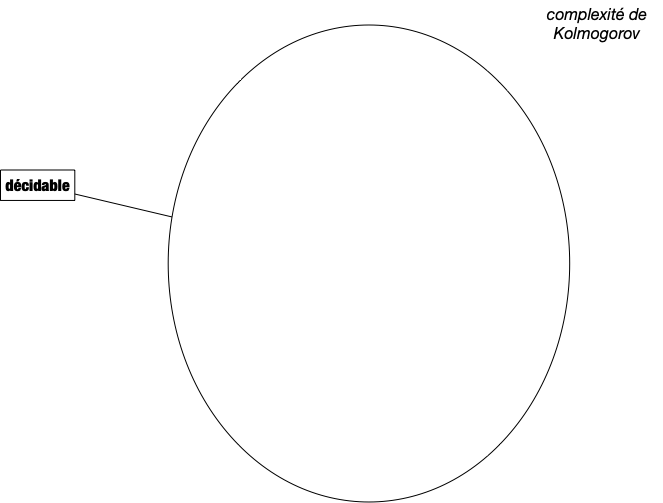
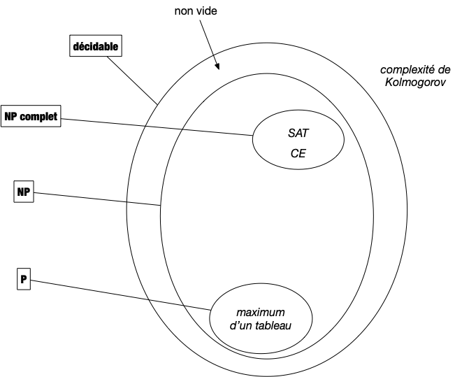
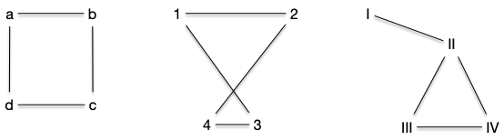
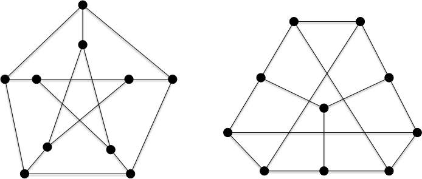
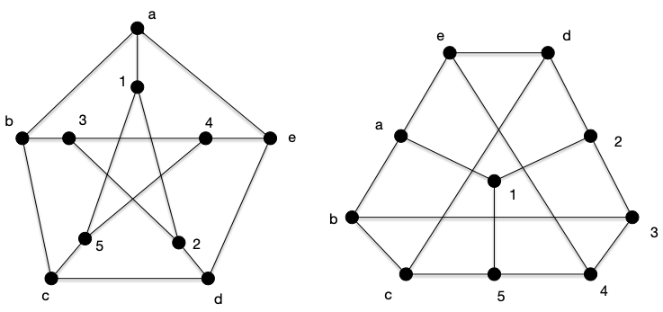
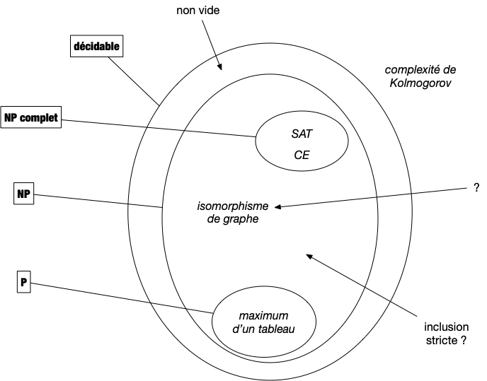

Les classes de problèmes et leurs significations donnent toujours des problèmes aux étudiants. Ils ne sont certes pas aidés par la terminologie qui, lorsqu'elle n'est pas cryptique, peut induire en erreur. Nous allons tenter d'être le plus clair possible en n'introduisant que ce qu'il est nécessaire de jargon pour comprendre l'enjeu de cette classification.

En algorithmie théorique on ne peux pas utiliser la thèse de Church-Turing puisqu'elle n'est pas démontrée, ici on considérera que les algorithmes sont écrit en pseudo-code.

## Problèmes utilisables en pratique

Un [problème algorithmique](../#problème-algorithmique){.interne} implique qu'il existe un algorithme pour le résoudre On appelle ces problèmes calculables ou **_décidable_**. Comme on sait qu'il existe des problèmes non solvable par un algorithme (on a vu [la complexité de Kolmogorov](../bases-théoriques/calculabilité/#complexité-Kolmogorov){.interne} par exemple), on peut commencer par se restreindre aux problèmes décidables :



Mais parmi ces derniers, pour être utile en pratique, encore faut-il que l'on puisse les traiter en temps raisonnable (la durée d'une vie humaine par exemple). On va donner deux définitions du terme _traiter_. Commençons par la plus évidente : **la résolution**.

### Résolution efficace


Un problème algorithmique est dit **_polynomial_** s'il existe un pseudo-code de complexité polynomiale en la taille de son entrée permettant de le résoudre.

L'ensemble des problèmes polynomiaux est nommé $P$.


On a vu un certains nombre de problèmes polynomiaux, on peut par exemple citer :

- Trouver le maximum d'un tableau d'entiers dont [on a démontré que sa complexité était linéaire](../complexité-problème/#recherche){.interne},
- Trier un tableau d'entiers dont [on a démontré que sa complexité était $\mathcal{O}(n\ln(n))$](../problème-tris/complexité-problème){.interne} où $n$ est la taille du tableau,


Le cas du [problème de l'exponentiation](../projet-exponentiation/étude-algorithmique){.interne} est intéressant car on a démontré qu'il était en $\mathcal{O}(\ln(n))$ où $n$ est la valeur de l'exposant. Il n'est donc pas évident au premier coup d'œil que cela est bien polynomial en la taille des entrées, c'est à dire 2 entiers.

En informatique théorique l'unité d'information est le bit, la taille de l'entrée d'un algorithme est toujours égale au nombre de bits nécessaires pour la stocker. Pour un entier il s'agit donc du logarithme en base 2 de sa valeur et donc le problème de l'exponentiation est bien polynomiale, il est même linéaire en la taille de l'entrée...


Si pour être rigoureux et formel il est nécessaire de considérer qu'une case mémoire ne peut contenir qu'un seul bit plutôt qu'un entier quelconque, cela alourdit les calculs de complexité sans réel apport.
En effet l'entier étant la donnée élémentaire, toute opération qui en manipule (c'est à dire presque toutes les opérations) devra lire chaque bits les constituant, ce qui ne fait qu'ajouter un facteur linéaire en la taille des données.

Enfin, les entiers sont usuellement bornés, sur 64bits pour un processeur courant, ce qui permet d'avoir assez d'entiers pour ne pas être limité en pratique et de bien avoir une taille en $\mathcal{O}(1)$ (64 étant une constante).


### Vérification efficace

Il existe de nombreux problèmes dont on ne connaît pas d'algorithme polynomiaux pour les résoudre mais la complexité, ou dont on ne connaît pas d'algorithmes polynomiaux pour les résoudre, mais dont dont sait facilement, grace à un algorithme efficace de vérification nommé **_vérifieur_**, voir si proposition de solution en est une ou pas.

<div id="définition-vérifieur"></div>


Un **_vérifieur_** est un algorithme de :

$$v: \\{0, 1\\}^\star \times \\{0, 1\\}^\star \rightarrow \\{0, 1\\}$$

Il est dit **_efficace_** s'il est de complexité polynomiale.


Cette notion de vérification est cruciale. Si on ne sait pas construire de solutions nous même mais que quelqu'un arrive avec une solution potentielle, il faut pouvoir vérifier qu'elle est correcte avant de l'utiliser. Sans cette condition le problème n'a pas de solution réaliste : toute valeur peut être solution puisqu'on ne peut pas savoir avant d'essayer.

On peut voir le vérifieur comme une preuve (il y a équivalence entre preuve mathématique et algorithme, rappelons-le) automatisée et efficace (polynomiale, donc pouvant être écrite puis lue par des humains) de l'exactitude d'une solution.

Formalisons cette notion de vérification efficace :


Un **_vérifieur efficace d'un problème décidable_** $p$ ayant pour entrée $e \in E$ et pour sortie $s \in S$ est un algorithme $V: E \times S \rightarrow \\{0, 1\\}$ tel que :

- $V(e, s)$ vaut 1 si et seulement si $s$ est une sortie de $p(e)$
- la complexité de $V$ est **polynomiale** en la taille de $e$ et ne **dépend pas** de la taille de $s$.



Le retour d'un vérifieur est classiquement un bit mais pas la suite, pour être plus explicite, nous utiliserons des booléens en associant 0 à faux et 1 à vrai.


Remarquez que l'on ne demande **pas** que sa complexité soit polynomiale par rapport à la sortie ! Seule, l'entrée compte.

Cependant, comme la complexité doit être polynomiale dans la taille de l'entrée cela implique que la taille de la sortie est polynomiale par rapport à la taille de l'entrée : si l'algorithme est de complexité $\mathcal{O}(|e|^k)$ alors seule $\mathcal{O}(|e|^k)$ bits de $s$ peuvent être examinés, cela ne sert à rien d'avoir des sorties plus longues.

Enfin, cette définition est réaliste puisque si l'on possède une solution on veut pouvoir vérifier de façon réaliste (_ie._ polynomialement) que c'est une solution : si sa taille est exponentielle, on ne peut même pas la lire en temps raisonnable !

Tout algorithme de $P$ admet un vérifieur efficace puisqu'il suffit d'exécuter l'algorithme de résolution et de vérifier si sa solution est égale à l'entrée.

Ainsi, pour [le problème MAX (trouver le maximum d'un tableau)](../#problème-max-tableau){.interne} :

```pseudocode
algorithme vérification_max(T: [entier], sol: entier) → booléen:
  m ← max(T)  # algorithme linaire trouvant le maximum d'un tableau
  rendre m == sol
```

Dans le cas d'algorithme de résolution linéaire (comme pour le problème de la recherche du maximum), cette approche est optimale. Mais pour des problèmes dont l'algorithme de résolution est non linéaire on peut souvent trouver un algorithme de vérification de complexité plus faible.


Montrez que le problème [3-SUM](../projet-algorithmes-classiques/2_3-SUM/#problème-3-SUM){.interne} admet un vérifieur linéaire (alors que le meilleur algorithme connu est en $\mathcal{O}(T.\text{longueur}^2)$, ce qui est déjà bien).



```pseudocode
algorithme vérification_3_SUM(T: [entier], sol: (entier, entier, entier)) → booléen:
  i, j, k ← sol
  si T[i] + T[j] + T[k] == 0:
      rendre Vrai
  rendre Faux
```



### Vérifieur efficace et algorithme de résolution

Les problème admettant un vérifieur ne sont pas forcément décidables. Considérons par exemple le vérifieur `stop(E: chaîne, n: entier) → booléen`{.language-} qui rend vrai si le programme décrit par la chaîne de caractères `E`{.language-} s'arrête au bout de `n`{.language-} itération. Ce vérifieur correspond [au problème de l'arrêt](../bases-théoriques/arrêt-rice/){.interne} qui est indécidable.

Le fait que le problème admette un vérifieur dont la complexité ne dépend que du premier paramètre est donc cruciale. Si de plus sa complexité est polynomiale on a de plus :


Si un problème admet un **_vérifieur efficace_** de complexité $\mathcal{O}(|e|^k)$, alors il est décidable et sa complexité est en $\mathcal{O}(|e|^k\cdot 2^{|e|^k})$ opérations.




Tout problème admettant un vérifieur efficace est décidable car il n'y a qu'un nombre fini de l'ordre de $\mathcal{O}(2^{|e|^k})$ . En effet, si le vérifieur est un pseudo-code de complexité $\mathcal{O}(|e|^k)$ (avec $k$ une constante), la taille de la solution est bornée par $\mathcal{O}(|e|^k)$ et donc sa valeur par $\mathcal{O}(2^{|e|^k})$.

On peut alors pour une entrée donnée tester toutes les solutions possibles ce qui va coûter de l'ordre de $\mathcal{O}(|e|^k\cdot 2^{|e|^k})$ opérations (puisque tester une entrée coûte $\mathcal{O}(|e|^k)$ opérations), ce qui est certes beaucoup mais reste fini.



### La classe de Problèmes NP

Les problèmes utiles qui s'appellent en algorithmie les problèmes NP :


**_Un problème algorithmique est dit_** $NP$ s'il existe un vérifieur efficace de ses solutions.


Ce qui donne le schéma suivant :


La définition ci-dessus appelle deux remarques :

- premièrement le nom a été très mal choisi. Il signifie _Non Déterministe Polynomial_ (et **_pas du tout_** non polynomial...) car cette classe de problème peut être résoluble de façon polynomiale par des algorithmes non déterministes (un test si peut avoir plusieurs alors choisi de façon non déterministe). Dans ce cadre la définition fait sens puisqu'elle est identique à $P$ pour un autre type d'algorithme. Nous verrons ces types d'algorithmes plus tard.
- deuxièmement l'inclusion est stricte. Il existe des problèmes décidables qui ne sont pas dans NP. Ça aussi on le démontrera plus tard lorsque l'on étudiera .


Un problème est dans $NP$ s'il existe un vérifieur efficace de ses solutions. Ce sont exactement les problèmes algorithmiques utilisable en pratique car :

- On peut énumérer toutes les solutions possibles en temps fini, mais en temps exponentiel (ce qui fonctionne lorsque la taille d'entrée est faible).
- On peut vérifier efficacement (en temps polynomial) si une proposition de solution est réellement une solution.



On pourrait penser qu'il faudrait aussi borner la complexité spatiale. Utiliser un nombre exponentiel de mémoire étant tout autant rédhibitoire que d'utiliser un temps exponentiel.

La seule façon d'obtenir une complexité spatiale supérieure à la complexité temporelle est d'allouer de la mémoire (en $\mathcal{O}(1)$) et de ne jamais allez y voir (puisque y aller va consommer une opération). Par exemple allouer un tableau de $2^n$ cases et n'en utiliser que les cases $2^i$ : complexité spatiale exponentielle et temporelle polynomial. On gaspille un nombre exponentiel de mémoire.

On peut cependant changer cde genre d'algorithme grâce àla proposition suivante :



Tout algorithme de complexité temporelle polynomiale peut être écrit de telle sorte que :

- sa complexité temporelle reste polynomiale
- sa complexité spatiale soit inférieure à sa nouvelle complexité temporelle
  
  

Il suffit pour cela de remplacer tous les tableaux utilisés par l'algorithme en dictionnaires.

Ceci garantit que la complexité spatiale sera égale à la complexité du premier algo et que la complexité temporelle sera au pire au carré de la complexité initiale. En effet, chaque accès à un indice de tableau passe de $\mathcal{O}(1)$ (pour un tableau) à la taille des données (c'est à dire la complexité initiale) si on a pas de chance avec le dictionnaire (cependant, en moyenne ça ne change pas).



## Structure de NP

Regardons la structure de NP d'un peu plus prêt en utilisant notre comparateur de problèmes : [la réduction polynomiale](../problème-réduction/#définition-réduction-polynomiale){.interne}.

De façon extrêmement surprenante lorsqu'on y pense, il existe un problème de $NP$, SAT, qui majore tous les autres problèmes. Nous démontrerons ceci précisément plus tard, admettons donc (pour l'instant) le théorème suivant :

{% note "**Théorème ([Cook & Levin en 1971](https://fr.wikipedia.org/wiki/Th%C3%A9or%C3%A8me_de_Cook))**" %}

Pour tout problème $A$ de $NP$ il existe une **réduction polynomiale** de $A$ vers le problème SAT.



C'est en effet surprenant qu'il n'y ait pas plusieurs élément maximaux de l'ordre induit par la réduction polynomiale.

### <span id="SAT"></span>Le problème SAT

Le problème SAT cherche à vérifier si une formule logique peut-être satisfaite.

#### Définitions

Pour cela, commençons par définir un concept fondamental en logique la **_conjonction de clauses_** :

<div id="définition-clauses"></div>


Soient $x_1, \dots, x_n$, $n$ variables booléennes. On définit :

- un **_littéral_** $l$ comme étant soit une variable $l = x_i$, soit sa négation $l = \overline{x_i}$
- une **_clause_** comme étant une disjonction de littéraux $c = l_1 \lor \dots \lor l_k$ (avec $l_1, \dots l_k$ littéraux)
- une **_conjonction de clauses_** comme étant $c = c_1 \land \dots \land c_m$ (avec $c_1, \dots c_m$ des clauses)
  

Le problème `SAT` cherche à savoir s'il existe des valeurs pour lesquelles $f$ est vraie. Si telle est le cas, la conjonction de clause est dite **_satisfiable_** :



- **Nom** : SAT
- **Entrée** : $f$ une conjonction de clauses sur les variables $x_1$ à $x_n$
- **Sortie** : Une assignation des variables $x_1$ à $x_n$ telle que $f$ soit vraie (ou `∅`{.language-} si cela n'est pas possible).



#### Exemple

<span id="exemple-SAT"></span>
Par exemple considérons les 4 clauses suivantes, sur 5 variables booléennes :

<div>
$$
(x_1 \lor {x_2}) \land (\overline{x_1} \lor \overline{x_2} \lor \overline{x_3}) \land (\overline{x_1} \lor x_3 \lor x_4 \lor \overline{x_5}) \land ({x_1} \lor \overline{x_3} \lor \overline{x_4} \lor {x_5})
$$
</div>

Il y $2^5 = 32$ possibilités (O ou 1 ; Vrai ou Faux) pour chaque variable. Essayons en quelques une :

- $x_1 = x_2 = x_3 = x_4 = x_5 = 0$ ne permet pas de satisfaire la formule car $x_1 \lor {x_2} = 0$
- $x_1 = x_2 = x_3 =x_4 = x_5 = 1$ non plus ($\overline{x_1} \lor \overline{x_2} \lor \overline{x_3} = 0$)
- $x_1 = \overline{x_2} = x_3 = \overline{x_4} = x_5 = 1$ fonctionne

La formule précédente est satisfiable !

#### SAT est dans NP

Pour montrer que le problème SAT est dans NP, il faut exhiber un vérifieur polynomial c'est à dire un algorithme. Il faut donc pouvoir transformer une instance _"papier"_ de SAT en une entrée d'un programme. Il y a plusieurs façon de faire, nous allons en montrer une simple à mettre en oeuvre.

Une instance de SAT est composée :

- $x_1, \dots, x_n$ : les $n$ variables booléennes
- $c_1 \land \dots \land c_m$ : les $m$ conjonctions de clauses
- $c_i = l^1_i \lor \dots \lor l^{k_i}_i$ : les littéraux formant les clauses.

La conversion vers une entrée d/un algorithme se fera ainsi :

- on associe l'entier $i$ à la variable $x_i$
- une clause $c_i$ sera un tableau $T_i$ de longueur égal $k_i$ à son nombre de littéraux
- $T_i[j] = k$ si $l_i^j = x_k$ et $T_i[j] = -k$ si $l_i^j = \overline{x_k}$
- la conjonction de clause sera un tableau de tableau d'entier de taille $m$ (le no,bre de clauses)


Quel est l'encodage de l'exemple ?



```pseudocode
[[1, 2],
 [-1, -2, -3],
 [-1, 3, 4, -5],
 [1, -3, -4, 5]
]
```



Avec cet encodage, une solution de SAT sera un tableau de booléen $S$ de longueur $n$ tel que $x_i = S[i-1]$.

Par exemple pour la solution $x_1 = \overline{x_2} = x_3 = \overline{x_4} = x_5 = 1$ de l'exemple, on aura : `S = [Vrai, Faux, Vrai, Faux, Vrai]`{.language-}

Avec un tel encodage, il est facile de créer un vérifieur linéaire à un problème SAT, faites le :


Utilisez le codage précédent pour écrire un vérifieur linéaire de SAT.



On propose l'algorithme suivant :

```pseudocode
algorithme vérif_SAT(conj_clauses: [[entier]], # [c_1, ..., c_m]
                     solution: [booléen]) # [x_1, ..., x_n]
                     → booléen:
    pour chaque c de conj_clauses:
        sat ← Faux
        pour chaque l de c:
            si l > 0 ET solution[l-1]:
                sat ← Vrai
            si l < 0 et (solution[l-1] == Faux):
                sat ← Vrai
        si sat == Faux:
            rendre Faux
    rendre Vrai
```

La complexité de l'algorithme est clairement linéaire : on regarde au pire chaque littéral de chaque clause une fois. Enfin, l'algorithme ne rend faux que s'il existe une clause dont tous les littéraux est faux et donc si l'instance de SAT est fausse.



Même s'il est facile de vérifier si une solution potentielle est une solution, on ne connaît pas d'algorithme polynomial pour résoudre SAT. L'algorithme naïf consistant à tester toutes les solutions possibles prendrait $\mathcal{O}(mn\cdot 2^n)$ opérations ($2^n$ possibilités pour les variables et la taille d'une conjonction de clause est $nm$). Aussi surprenant que cela paraisse, on ne connaît pas d'algorithme fondamentalement meilleur :


Il existe des problèmes faciles à vérifier dont on ne connaît pas d'algorithme efficace pour le résoudre.


### Réduction vers SAT

Le théorème de Cook et Leven stipule que **tout** problème de NP peut se réduire à un cas particulier du problème SAT. Pour démontrer cela ils montrent que tout problème algorithme de NP peut s'écrire polynomialement comme une formule SAT qui n'est satisfiable que pour des solutions du problème initial.

Nous ne démontrerons pas ici ce théorème mais allons montrer quelques exemples pour que vous puissiez appréhender ce résultat fondamental.

Nous allons aussi utiliser le fait que toute formule logique peut se mettre efficacement sous la forme d'une disjonction de clause grâce à [la transformation de Tseitin](https://fr.wikipedia.org/wiki/Transformation_de_Tseitin) que nous étudierons un peut plus tard. Ceci nous permet d'uniquement chercher une formule logique, pas forcément une disjonction de clauses.

#### MAX

Montrons que l'on peut le faire pour [le problème MAX (trouver le maximum d'un tableau)](../#problème-max-tableau){.interne}. Le but de cette réduction est de passer de la comparaison d'entiers à la comparaisons de variables booléennes. Nous allons faire ça en plusieurs étapes.

1. l'égalité $(x^i = y^i)$ pour deux variables booléennes s'écrit $(x^i = y^i) \coloneqq (x^i \land y^i) \lor (\overline{x^i} \land \overline{y^i})$. La formule logique est  n'vrai que si les deux variables booléennes sont égales.
2. un entier $x$ peut s'écrire sous sa forme binaire $x^px^{p-1}\dots x^0$ où $x^i \in \\{0, 1\\}$ et $x = \sum_{0\leq i \leq p}x^i2^i$


On encode les entiers sous la forme binaire de gauche à droite dans un tableau : l'entier 5 sera encodé par le tableau $[0, 0, 1]$ puisque $5 = T[0]\cdot 2^0 +T[1]\cdot 2^1 + T[2]\cdot 2^2$


Des deux remarques précédentes, on en déduit que le test $(x = y)$ pour deux entiers s'écrit par le fait que tous les bits sont égaux (on suppose que l'on écrit nos entiers avec le même nombre de bits $p$, quitte à mettre des 0 en fin de tableau pour le plus petit):

<div>
$$
(x = y) \coloneqq \bigwedge_{0\leq k \leq p}(x^l = y^l) = \bigwedge_{0\leq k \leq p}((x^l \land y^l) \lor (\overline{x^i} \land \overline{y^i}))
$$
</div>

De là, l'inégalité $(x > y)$ pour deux entiers s'écrit par le fait qu'il existe $k$ tel que les k-1 derniers bits sont égaux et le $k$ème bit de x est plus grand que celui de x, c'est à dire que $x^k = 1$ et $y^k = 0$ :

<div>
$$
(x > y) \coloneqq [x^p \land \overline{y^p}] \lor [(x^p = y^p)  \land (x^{p-1} \land \overline{y^{p-1}})] \lor \dots \lor [(\bigwedge_{i < j \leq p}(x^j = y^j)) \land (x^{i} \land \overline{y^i})] \lor \dots \lor [(\bigwedge_{1 < j \leq p}(x^j = y^j)) \land (x^{1} \land \overline{y^1})]
$$
</div>

Ce qui s'écrit aussi :

<div>
$$
(x > y) \coloneqq \bigvee_{1\leq k \leq p}[(\bigwedge_{k < l \leq p}(x^l = y^l) ) \land (x^k \land \overline{y^k})]
$$
</div>

On en déduit la formule logique associé à l'inégalité :

<div>
$$
(x > y) = \bigvee_{1\leq k \leq p}[(\bigwedge_{k < l \leq p}((x^l \land y^l) \lor (\overline{x^l} \land \overline{y^l})) \land (x^k \land \overline{y^k}))]
$$
</div>

Enfin, pour avoir $(x \geq y)$ on combine les deux formules :

<div>
$$
(x \geq y) \coloneqq (x = y) \lor (x > y)
$$
</div>

Ceci nous permet d'écrire la formule logique permettant de décrire un problème MAX est :

<div>
$$
\bigvee_{0\leq i < n}(\bigwedge_{j \neq i} T[i] \geq T[j])
$$
</div>

Puisque l'équation logique ci-dessus vérifie si $T[i]$ est le plus grand des éléments du tableaux pour tout $i$.

A priori, ce n'est pas encore fini puisque la formule logique n'est pas sous la forme d'une conjonction de clause. Mais on sait que l'on peut utiliser [la transformation de Tseitin](https://fr.wikipedia.org/wiki/Transformation_de_Tseitin) pour transformer cette formule logique en une conjonction de clauses ce qui montre que le problème MAX peut se résoudre via le problème SAT.


Dans tout ce qui suivra, on ne s'embêtera pas nécessairement à trouver la conjonction de clause qui sera l'entrée du problème SAT. On se contentera de formules logiques que l'on sait pouvoir transformer en conjonction de clauses.


#### Addition de 2 bits

L'exemple précédent était éclairant mais pas forcément bluffant : le problème MAX pouvant se représenter facilement comme une succession de tests logiques. Nous allons donc aller un peu plus loin et transformer un algorithme, la somme de deux nombres binaires en une conjonction de clause.

Commençons par quelque chose de simple, l'addition de 2 bits :

```pseudocode
algorithme somme_binaire(x: bit,
                         y: bit)
                         → [bit]  # somme = T[0] + 2 * T[1]
    somme ← [0, 0]
    si (x == 1) et (y == 1):
        rendre [0, 1]             # le nombre 10
    si (x == 1) ou (y == 1):
        rendre [1, 0]             # le nombre 01
    rendre [0, 0]                 # le nombre 00
```

Le corps de l'algorithme peut s'écrire avec la formule logique suivante, en notant la sortie de l'algorithme $z = [z^0, z^1]$ :

<div>
$$
((x \land y) \land (\overline{z^0} \land z^1)) \lor ((x \lor y) \land ({z^0} \land \overline{z^1})) \lor (\overline{z^0} \land \overline{z^1})
$$
</div>

Pour exécuter l'algorithme il faut donner des valeurs aux entrées $x$ et $y$. Par exemple si $x=1$ et $y=0$, la formule logique à satisfaire est :

<div>
$$
[x \land \overline{y}] \land [((x \land y) \land (\overline{z^0} \land z^1)) \lor ((x \lor y) \land ({z^0} \land \overline{z^1})) \lor (\overline{z^0} \land \overline{z^1})]
$$
</div>

Elle ne peut avoir comme solution que :

- $x=1$ et $y=0$ : c'est nos entrées que l'on a forcé
- $z^0 = 0$ et $z^1 = 1$ : la sortie est impliquée par la formule

À vous :


Quelle formule doit-on satisfaire si on veut additionner le bit $x=0$ et $y=0$. Quelles sont les affectation possible des variables booléennes ?



<div>
$$
[\overline{x} \land \overline{y}] \land [((x \land y) \land (\overline{z^0} \land z^1)) \lor ((x \lor y) \land ({z^0} \land \overline{z^1})) \lor (\overline{z^0} \land \overline{z^1})]
$$
</div>

Elle ne peut avoir comme solution que :

- $x=0$ et $y=0$ : c'est nos entrées que l'on a forcé
- $z^0 = 0$ et $z^1 = 0$ : la sortie est impliquée par la formule



On y reviendra, mais remarquez que la formule associée à l'algorithme est symétrique. On peut très bien fixer la sortie pour trouver l'entrée. Par exemple si l'on cherche à trouver pour quelles valeurs de $x$ et $y$ on peut obtenir $z^0 = 1$ et $z^1 = 0$ il faut résoudre la formule :

<div>
$$
[{z^0} \land \overline{z^1}] \land [((x \land y) \land (\overline{z^0} \land z^1)) \lor ((x \lor y) \land ({z^0} \land \overline{z^1})) \lor (\overline{z^0} \land \overline{z^1})]
$$
</div>

Et on trouvera $x=1$ et $y=1$.

À vous :


Peut-on trouver 2 bit dont l'addition donne $11$ ?



Il faut résoudre la formule logique suivante :

<div>
$$
[{z^0} \land {z^1}] \land [((x \land y) \land (\overline{z^0} \land z^1)) \lor ((x \lor y) \land ({z^0} \land \overline{z^1})) \lor (\overline{z^0} \land \overline{z^1})]
$$
</div>

Ce qui revient à résoudre :

<div>
$$
[{z^0} \land {z^1}] \land (\overline{z^1} \land \overline{z^0})
$$
</div>

Ce qui est impossible : la formule est non satisfiable et il n'existe aucune entrée qui permet d'obtenir $11$ en sortie.



#### Addition de 2 entiers

Tout comme pour le problème du max si on veut additionner deux entiers on les transforme en variables binaire en utilisant le fait qu'un entier $x$ peut s'écrire sous sa forme binaire $x^px^{p-1}\dots x^0$ où $x^i \in \\{0, 1\\}$ et $x = \sum_{0\leq i \leq p}x^i2^i$. On considère l'algorithme suivant qui généralise l'addition sur 1 bit :

<span id="algorithme-somme_binaire"></span>

```pseudocode
algorithme somme_binaire(x: [bit],
                         y: [bit])  # on suppose x et y de même taille
                         → [bit]  # de la taille de x et y + 1

    somme ← un tableau de taille x.longueur + 1 bits
    retenues ← un tableau de taille x.longueur + 1 bits
    retenues[0]  ← 0

    pour chaque i de [0 .. x.longueur - 1[:
        si (x[i] == 1) et (y[i] == 1) et (retenues[i] == 1):
            somme[i]  ← 1
            retenues[i + 1]  ← 1
        sinon si ((x[i] == 1) et (retenues[i] == 1)) ou ((y[i] == 1) et (retenues[i] == 1)) ou ((x[i] == 1) et (y[i] == 1)):
            somme[i]  ← 0
            retenues[i + 1]  ← 1
        sinon si (x[i] == 1) ou (y[i] == 1) ou (retenues[i] == 1):
            somme[i]  ← 1
            retenues[i + 1]  ← 0
        sinon:
            somme[i]  ← 0
            retenues[i + 1]  ← 0
    somme[x.longueur] ← retenues[x.longueur]
    rendre somme
```

L'algorithme ci-dessus est une implémentation binaire de [l'addition posée](https://fr.wikipedia.org/wiki/Addition#Proc%C3%A9d%C3%A9_de_calcul) que l'on apprend au primaire. L'addition des nombres `x = 1011` et `y = 0111` donne `somme = 10011` :

```text
   1011  = 11     x
+  0111  =  7     y
  11110           retenue
------------
  10010  = 18     somme
```

Pour l'algorithme on a comme entrée `x=[1,1,0,1]`{.language-} et `y=[1,1,1,0]`{.language-} et on doit avoir `[0,1,0,0,1]`{.language-} comme sortie.

On peut maintenant convertir cet algorithme en une formule logique. On va utiliser les variables binaires :

- $x^0, \dots, x^{p}$ pour représenter $x = \sum_{0\leq i \leq p}x^i2^i$,
- $y^0, \dots, y^{p}$ pour représenter $y = \sum_{0\leq i \leq p}y^i2^i$,
- $s^0, \dots, s^{p+1}$ pour représenter la somme $x+y = s = \sum_{0\leq i \leq p+1}s^i2^i$,
- $r^0, \dots, r^{p+1}$ pour représenter les retenues.

Commençons par représenter une itération de la boucle pour chaque sous la forme d'une formule :

<div>
$$
\begin{array}{l}
[(x^i \land y^i \land r^i)\land (s^i \land r^{i+1})] \lor\\
[((x^i \land r^i) \lor ( y^i \land r^i) \lor (x^i \land r^i))\land (\overline{s^i} \land r^{i+1})]\lor\\
[(x^i \lor y^i \lor r^i) \land ({s^i} \land \overline{r^{i+1}})]\lor\\
[(\overline{s^i} \land \overline{r^{i+1}})]
\end{array}
$$
</div>

Ce qui est remarquable dans cet algorithme c'est que chaque variable n'est affecté qu'une seule fois. On peut donc directement écrire l'algorithme en remarquant que chaque itération est un ET :

<div>
$$
\begin{array}{l}
\bigwedge_{0\leq i \leq p}([(x^i \land y^i \land r^i)\land (s^i \land r^{i+1})] \lor\\
[((x^i \land r^i) \lor ( y^i \land r^i) \lor (x^i \land r^i))\land (\overline{s^i} \land r^{i+1})]\lor\\
[(x^i \lor y^i \lor r^i) \land ({s^i} \land \overline{r^{i+1}})]\lor\\
[(\overline{s^i} \land \overline{r^{i+1}})])
\end{array}
$$
</div>

L'algorithme sous la forme d'une formule est maintenant capable d'additionner `1011` et `0111`. Il suffit de les mettre "en entrée" de la formule :

<div>
$$
\begin{array}{l}
[(x^0 \land x^1 \land \overline{x^2} \land x^3) \land (y^0 \land y^1 \land \land y^2 \land \overline{y^3})]\land\\
\bigwedge_{0\leq i \leq 3}([(x^i \land y^i \land r^i)\land (s^i \land r^{i+1})] \lor\\
[((x^i \land r^i) \lor ( y^i \land r^i) \lor (x^i \land r^i))\land (\overline{s^i} \land r^{i+1})]\lor\\
[(x^i \lor y^i \lor r^i) \land ({s^i} \land \overline{r^{i+1}})]\lor\\
[(\overline{s^i} \land \overline{r^{i+1}})])
\end{array}
$$
</div>

#### Algorithme et SAT

Levin et cook que ce principe de transformation d'un algorithme en formule est applicable à tout pseudo-code en tenant en compte l'évolution des variables au cours des instructions, ce que nous n'avons pas eu besoin de faire dans nos deux exemples car chaque variable n'est assignée qu'une seule fois.

## Problèmes NP-Complet

Le théorème de Levin et Cook stipule que tout problème de NP peut se réduire polynomialement à un cas particulier de SAT : le problème SAT est un élément maximal de l'ordre entre problèmes de NP induit par la réduction polynomiale. Ce théorème montre l'existence de problèmes _universels_, on les appelle **_NP-complet_**, dont tous les autres problèmes ne sont que des cas particuliers :


Un problème $A$ de NP est NP-complet si $B \leq A$ pour tout problème $B$ de NP.


Cette définition est consistante car deux problèmes différents de NP peuvent êtres tels que $A \leq B$ et $B \leq A$ (on l'a vu pour 3-SUM' et 3-SUM par exemple). Rien n'empêche donc d'avoir plusieurs problèmes se comportant comme SAT, La structure de NP est donc maintenant la suivante :


Fixons nous les idées en démontrant que le problème suivant est NP-complet.

### Couverture Exacte est NP-complet

<span id="problème-EC"></span><span id="problème-CE"></span>



- **Nom** : Couverture Exacte (_exact cover_)
- **Entrée** :
  - un ensemble fini $U$ d'éléments
  - un ensemble $\mathcal{S}$ de sous-ensembles de $U$
- **Sortie** : Un ensemble $\mathcal{P} \subseteq \mathcal{S}$ formant une partition de $U$ (ou `∅`{.language-} si cela n'est pas possible).
  
  
  Une partition $\mathcal{P}$ d'un ensemble $U$ est un ensemble de sous-ensembles de $U$ tel que :
- l'union des éléments de $\mathcal{P}$ vaut $U$,
- l'intersection de deux éléments différents de $\mathcal{P}$ est vide.
  

Illustrons ce problème en reprenant [un exemple tiré de Wikipédia](https://fr.wikipedia.org/wiki/Probl%C3%A8me_de_la_couverture_exacte#Exemple_2) :

- $U = \\{1, 2, 3, 4, 5, 6, 7\\}$
- $\mathcal{S} = \\{ \\{1, 4, 7\\}, \\{1, 4\\}, \\{4, 5, 7\\},\\{3, 5, 6\\},\\{2, 3, 6, 7\\},\\{2, 7\\}  \\}$

Résoudre ce problème revient à faire plein de choix. Parfois ces choix sont simple : si on place $\\{1, 4, 7\\}$ on ne peut plus mettre que la classe $\\{3, 5, 6\\}$ qui ne forme pas une partition ; parfois les choix sont plus cornéliens : doit-on placer la classe $\\{3, 5, 6\\}$, ce qui empêche d'utiliser la classe $\\{4, 5, 7\\}$ (par exemple) ? Ou ne pas la mettre ? A priori on ne sais pas.


Montrez que l'exemple possède une solution.



On prend les 3 classes :

- $\\{1, 4\\}$,
- $\\{3, 5, 6\\}$,
- $\\{2, 7\\}$



Prouver que le problème de Couverture Exact (CE) est NP-Complet va être plus facile que celle du théorème de Cook/Levin. En effet, maintenant que l'ensemble des problème NP-complet est non vide (il y a au moins SAT dedans), pour montrer qu'un problème $A$ est NP-complet il nous suffit maintenant de :

1. choisir un problème $B$ NP-complet
2. montrer qu'il existe une réduction polynomiale $B \leq A$

En effet, si $C$ est un problème quelconque de NP, on a $C\leq B$ (par définition de l'ensemble NP-complet) ce qui amène par transitivité de la réduction polynomiale à $C \leq A$.

Pour l'instant nous ne connaissons qu'un problème NP-Complet : SAT. Montrons donc que $SAT \leq CE$.

Les réductions pour montrer qu'un problème est NP-complet peuvent être étrange au premier regard. Elles nécessitent souvent des constructions baroques pour associer un problème à l'autre. On appelle ces constructions des **_gadget_**. Ceci est normal car on essaie de mettre en regard deux problèmes qui n'ont souvent rien à voir. On va le faire ici en mettant en parallèle un problème de logique SAT et un problème de recherche de sous-ensemble CE.

#### Gadget

On considère une instance de SAT que l'on va transformer polynomialement en une instance de CE. Posons ses paramètres :

- $x_1, \dots, x_n$ : les $n$ variables booléennes
- $c_1 \land \dots \land c_m$ : les $m$ conjonctions de clauses
- $c_i = l^1_i \lor \dots \lor l^{k_i}_i$ : les littéraux formant les clauses.

On suppose de plus sans perte de généralité que :

1. il n'existe pas de clause ayant à la fois $x_i$ et $\overline{x_i}$ comme littéral (sinon cette clause est trivialement toujours vérifiée)
2. pour toute variable booléenne $x_i$ il existe une clause ayant $x_i$ comme littéral et une autre clause ayant $\overline{x_i}$ (sinon il suffit de mettre la modalité de $x_i$ à celle apparaissant dans les clauses pour les rendre trivialement vraies)

Notez que l'on peut transformer toute instance de $SAT$ en une instance satisfaisant les deux conditions ci-dessus en supprimant les clauses satisfaisant la première condition et en supprimant la variable booléenne satisfaisant la seconde condition. Cette transformation se fait en temps polynomial par rapport à l'entrée de $SAT$.

On peut maintenant transformer cette instance de $SAT$ en une instance de $CE$ ayant comme entrée :

<div>
$$
\begin{array}{lll}
U = &\{ x_i \vert 1 \leq i \leq n \} \cup&\text{variables booléenne}\\
&\{ c_i \vert 1 \leq i \leq m \} \cup&\text{clauses}\\
&\{ l_{i}^{j} \vert 1 \leq i \leq m, 1\leq j \leq k_i \}&\text{littéraux}\\
\mathcal{S} = &(\cup_{1\leq i \leq n}[\{ x_i \} \cup \{ l_{j}^{k} \vert l_{j}^{k} = x_i, 1 \leq j \leq m, 1\leq k \leq k_i\})] \cup &\text{littéraux vrais pour }x_i\\
&(\cup_{1\leq i \leq n}[\{ x_i\} \cup \{ l_{j}^{k} \vert l_{j}^{k} = \overline{x_i}, 1 \leq j \leq m, 1\leq k \leq k_i\})] \cup &\text{littéraux faux pour }x_i\\
&(\cup_{1\leq i \leq m}(\cup_{1\leq k \leq k_i}\{ c_i, l_{i}^{k} \})) &\text{liens entre clauses et littéraux}\\
&(\cup_{1\leq i \leq m}(\cup_{1\leq k \leq k_i}\{ l_{i}^{k} \})) &\text{les littéraux}\\
\end{array}
$$
</div>

L'ensemble de $CE$ couvre tous les éléments de $SAT$ : les variables booléennes, les clauses et les littéraux. Les classes forment les liens entre les différents éléments : pour chaque $x_i$ les littéraux valant $x_i$, pour chaque $x_i$ les littéraux valant $\overline{x_i}$ et pour chaque clause l'ensemble de ses littéraux. Cette construction est bien polynomiale par rapport à la taille de l'entrée du problème $SAT$.

Notre gadget transforme [L'instance exemple SAT](#exemple-SAT){.interne} en une instance de $CE$.

Formule SAT originelle :

<div>
$$
\underbracket{(x_1 \lor {x_2})}_{c_1 = l_1^1 \lor l_1^2} \land \underbracket{(\overline{x_1} \lor \overline{x_2} \lor \overline{x_3})}_{c_2 = l_2^1 \lor l_2^2 \lor l_2^3} \land \underbracket{(\overline{x_1} \lor x_3 \lor x_4 \lor \overline{x_5})}_{c_3 = l_3^1 \lor l_3^2 \lor l_3^3 \lor l_3^4} \land \underbracket{({x_1} \lor \overline{x_3} \lor \overline{x_4} \lor {x_5})}_{c_4 = l_4^1 \lor l_4^2 \lor l_4^3 \lor l_4^3}
$$
</div>

Entrée de CE associée :

<div>
$$
\begin{array}{ll}
U = &\{ x_1, x_2, x_3, x_4, x_5, c_1, c_2, c_3, c_4, l_1^1, l_1^2, l_2^1, l_2^2, l_2^3, l_3^1, l_3^2, l_3^3, l_3^4, l_4^1, l_4^2, l_4^3, l_4^4\}\\
\mathcal{S} = &\{\{x_1, l_1^1, l_4^1\}, \{x_2, l_1^2\}, \{x_3, l_3^2\}, \{x_4, l_3^3\}, \{x_5, l_4^4\},\\
& \{x_1, l_2^1, l_3^1\}, \{x_2, l_2^2\}, \{x_3, l_2^3, l_4^2\}, \{x_4, l_4^3\}, \{x_5, l_3^4\},\\
& \{c_1, l_1^1\}, \{c_1, l_1^2\}, \{c_2, l_2^1\}, \{c_2, l_2^2\}, \{c_2, l_2^3\}, \{c_3, l_3^1\}, \{c_3, l_3^2\}, \{c_3, l_3^3\}, \{c_3, l_3^4\}, \{c_4, l_4^1\}, \{c_4, l_4^2\}, \{c_4, l_4^3\}, \{c_4, l_4^4\}\\
& \{l_1^1\}, \{l_1^2\}, \{l_2^1\}, \{l_2^2\}, \{l_2^3\}, \{l_3^1\}, \{l_3^2\}, \{l_3^3\}, \{l_3^4\}, \{l_4^1\}, \{l_4^2\}, \{l_4^3\}, \{ l_4^4\}\}
\end{array}
$$
</div>

Nous allons montrer sur l'exemple que ce gadget fonctionne. Je cas général en découlera de lui-même. Il faut faire deux choses :

1. montrer que si le problème de CE admet une solution alors le problème SAT originel aussi
2. montrer que si le problème de CE n'admet pas de solution alors le problème SAT originel non plus

On montre très souvent la 2. condition par la réciproque (montrer que montrer que si le problème SAT originel admet une solution alors le problème CE aussi), ce qui permet d'être symétrique :

- Si CE à une solution alors SAT aussi
- Si SAT à une solution alors CE aussi

#### Solution de CE vers une solution de SAT

Pour comprendre comment une solution de CE permet de trouver une solution de SAT, reprenons notre exemple et cherchons une partition solution. Il en existe plusieurs, par exemple :

<div>
$$
\begin{array}{ll}
\mathcal{P} = &\{ \{x_2, l_1^2\},  \{x_4, l_3^3\},\\
& \{x_1, l_2^1, l_3^1\}, \{x_3, l_2^3, l_4^2\}, \{x_5, l_3^4\},\\
& \{c_1, l_1^1\}, \{c_2, l_2^2\}, \{c_3, l_3^2\}, \{c_4, l_4^1\},\\
&   \{l_3^2\}, \{l_3^4\}, \{ l_4^3\}, \{ l_4^4\} \}
\end{array}
$$
</div>

Pour repasser de cette solution de CE à une solution de SAT, regardons comment elle est construite :

- il faut que la partition contienne les $c_i$ : de part la construction de $\mathcal{S}$ ceci signifie que la classe contenant $c_i$ va également contenir 1 $l_i^j$.
- il faut que la partition contienne les $x_i$ : de part la construction de $\mathcal{S}$ ceci signifie que la classe contenant $x_i$ va également contenir des $l_j^k$. Attention ces $l_j^k$ ne doivent pas être celui choisi dans la classe contenant $c_j$
- tous les autres littéraux pouvant être attribués comme on le souhaite on peut les _"oublier"_.

Pour notre exemple ceci donne :

<div>
$$
\begin{array}{l}
\{c_1, l_1^1\}, \{c_2, l_2^2\}, \{c_3, l_3^2\}, \{c_4, l_4^1\}\\
\{x_1, l_2^1, l_3^1\}, \{x_2, l_1^2\}, \{x_3, l_2^3, l_4^2\}, \{x_4, l_3^3\}, \{x_5, l_3^4\}\\
\end{array}
$$
</div>

Remarquez que le choix de la classe contenant la clause contraint la classe contenant la variable. En choisissant $\\{c_1, l_1^1\\}$ je force le choix de $\\{x_1, l_2^1, l_3^1\\}$ puisque $l_1^1 = x_1$. Vous venez de découvrir le gadget : la classe contenant $c_i$ force le choix pour $x_j$ en prenant le littéral opposé.

Comme une solution de SAT doit avoir au moins 1 littéral de vrai par clause, regardons ce qu'il se passe si on suppose que c'est celui choisi dans la clause est vrai. Dans l'exemple :

- $l_1^1$ est vrai donc $x_1$ est vrai
- $l_2^2$ est vrai donc $\overline{x_2}$ est vrai
- $l_3^2$ est vrai donc ${x_3}$ est vrai
- $l_4^1$ est vrai donc ${x_1}$ est vrai

On ne peut pas arriver àla conclusion qu'une variable booléenne est vrai **et** fausse, car sinon il est impossible de choisir une classe contenant cette variable : c'est le principe du gadget qui implique que ces choix sont cohérents avec les classes contenant les $x_i$ (qui correspondent aux littéraux faux).

On sait déjà que $x_1$, $\overline{x_2}$ et ${x_3}$ sont vrais. Pour connaître la valeur des autres variables, on regarde les classes choisies :

- $\{x_1, l_2^1, l_3^1\}$ donc $l_2^1 = \overline{x_1}$ et $l_3^1 = \overline{x_1}$ sont faux donc $x_1$ est vrai (ouf, c'est cohérent)
- $\{x_2, l_1^2\}$ donc $l_1^2 = {x_2}$ est faux (c'est cohérent)
- $\{x_3, l_2^3, l_4^2\}$ donc $l_2^3 = l_4^2 = \overline{x_3}$ est faux : $x_3$ est vrai (c'est cohérent)
- $\{x_4, l_3^3\}$ donc $l_3^3 = {x_4}$ est faux. On ne le savait pas encore
- $\{x_5, l_3^4\}$ donc $l_2^3 = l_3^4 = \overline{x_5}$ est faux : ${x_5}$ est vrai.

Au final, avoir une partition nous garantit que le problème SAT originel a une solution et la donne !

On reconstruit cette solution en temps (clairement) polynomial.

#### Solution de SAT vers une solution de CE

Il faut maintenant montrer que si notre instance de $SAT$ à une solution alors notre instance de $CE$ en a également une.

Il suffit de faire la même chose que pour l'analyse précédente. Si l'instance de SAT a une solution, chaque clause $c_i$ possède au moins un littéral $l_i^{v(i)}$ qui est vrai. On peut alors considérer l'ensemble des classes formé de l'union de :

- $\\{c_i, l_i^{v(i)}\\}$ pour tout $ 1\leq i \leq m$,
- Considérons ensuite chaque littéral $l_i^j$ avec $ j \neq v(i)$ pour la solution de SAT. On a deux cas :
  - soit $l_i^j$ est vrai et on ajoute $\\{ l_i^j\\}$ à la solution de $CE$
  - soit $l_i^j$ est faux et on ajoute l'unique classe de $\mathcal{F}$ contenant $\\{x_i, l_i^j\\}$ à la solution de $CE$

De part nos hypothèses sur l'entrée de $SAT$ il est clair que cet ensemble de classes forme une solution à notre problème de $CE$. De plus, la construction de cette solution est bien polynomiale.


Donnez une solution de CE pour l'exemple différente de celle de l'exercice précédent et servez vous en pour reconstruire une solution du problème SAT initial.



On peut par exemple prendre :

<div>
$$
\begin{array}{ll}
\mathcal{P} = &\{\{x_1, l_1^1, l_4^1\}, \{x_3, l_3^2\}, \{x_4, l_3^3\}, \\
& \{x_2, l_2^2\}, \{x_5, l_3^4\},\\
& \{c_1, l_1^2\}, \{c_2, l_2^3\}, \{c_3, l_3^1\}, \{c_4, l_4^2\},\\
& \{l_2^1\}, \{l_3^3\}, \{ l_4^3\}, \{ l_4^4\}\}
\end{array}
$$
</div>

Ce qui donne comme solution de $SAT$ : $\overline{x_1} = {x_2} = \overline{x_3} = \overline{x_4} = x_5 = 1$


#### Conclusion

On vient de prouver $SAT\leq CE$ car :

1. $CE$ est dans NP
2. il existe une réduction polynomiale de SAT vers CE

On a trouvé un deuxième élément à la classe des problèmes NP-complets !



### Que signifie NP-complet

Il existe un grand nombre de problèmes NP-complet. Juste après la démonstration de Levin et Cook en 1971, [Karp démontrait en 1972](https://en.wikipedia.org/wiki/Karp%27s_21_NP-complete_problems) qu'il y en avait au moins 21 de plus ! Et on ne cesse d'en découvrir d'autres.

Comme tout problème de NP est un cas particulier de tout problème de NP, ceci signifie ces problèmes sont _universels_. D'un point de vue algorithmique ceci signifie qu'il n'y a pas de lien polynomial entre les entrées et les solutions : ce sont des problèmes sans structure, [il n'y a pas de balle en argent](https://fr.wikipedia.org/wiki/Pas_de_balle_en_argent) pour résoudre magiquement le problème. Il faut tout essayer.



Il faut voir les problèmes NP-complet comme des problèmes sans raccourcis, où il faut _a priori_ tout vérifier car la solution peut se trouver n'importe où _a contrario_ des problèmes polynomiaux où, selon l'entrée, les solutions sont circonscrites à un petit endroit que l'on peut rapidement (en temps polynomial) parcourir.



### P et NP

Si les problèmes de $P$ sont inclus dans $NP$, on ne sait pas si l'inclusion est stricte. On a implicitement supposé que les problèmes NP-complets ne sont pas dans P, mais en vrai on en sait rien : la question est ouverte ! Certains se demandent même si cette question est décidable (_ie._ démontrable).


Il existe même un prix d'un million de dollar pour qui donnerai une réponse à cette question (la valeur de cette récompense semble dérisoire par rapport à l'enjeu, mais elle a été proposée [à une époque où un million de dollar c'était quelque chose](https://www.youtube.com/watch?v=LCZMhs_xpjc) et n'a jamais été réévaluée...).



Ce qui est en revanche sur c'est que tout le monde espère que c'est vrai car sinon tout code informatique devient facilement déchiffrable et s'en est fini de la sécurité sur les réseaux (pour ne donner qu'une des conséquence de l'égalité de $P$ et de $NP$).


Même si la chose n'est pas démontrée on considérera que $P \neq NP$ dans toute la suite de ce cours (et notre vie). Prouver qu'un problème est NP-complet sera donc une garantie que l'on ne pourra pas le résoudre de façon efficace et que l'on peut chercher une solution approchée via un algorithme polynomial.


### Pas dans P ni NPC ?

Pour ne rien rendre simple, il existe de nombreux problèmes pour lesquels on ne connaît pas d'algorithme polynomiaux mais que l'on arrive pas à démontrer NP-complet. Par exemple le problème suivant :



- **Nom** : isomorphisme
- **Entrées** : [deux graphes](<https://fr.wikipedia.org/wiki/Graphe_(math%C3%A9matiques_discr%C3%A8tes)#D%C3%A9finition_et_vocables_associ%C3%A9s>) :
  - $G_1 = (V_1, E_1)$
  - $G_2 = (V_2, E_2)$
- **Sortie** : Rendre une bijection $\sigma$ de $V_1$ dans $V_2$ telle que $\\{x, y\\}$ est une arête de $G_1$ si et seulement si $\\{\sigma(x), \sigma(y) \\}$ est une arête de $G_2$ (ou `∅`{.language-} si une elle bijection n'existe pas).
  

Par exemple en considérant les 3 graphes ci dessous :



Il est clair de voir que les 2 premiers sont isomorphes ($\sigma(a) = 1$, $\sigma(b) = 2$, $\sigma(c) = 4$ et $\sigma(d) = 3$) alors que le troisième ne l'est pas.

Mais c'est moins clair avec les deux suivants :




Montrez que les deux graphes précédents sont isomorphes



Le graphe en question est le graphe de Petersen, que l'on peut représenter de plein de jolis façons : <https://mathworld.wolfram.com/PetersenGraph.html>.





Pour vérifier que la deux graphes $G_1 = (V_1, E_1)$ et $G_2 = (V_2, E_2)$ sont isomorphes avec une fonction $\sigma: V_1 \to V_2$ il faut montrer que :

- $\sigma$ est une bijection de $V_1$ dans $V_2$, donc que les deux tableaux $T_1 = [\sigma(x) \mbox{ pour chaque } x \in V_1]$ et $T_2 = [x \mbox{ pour chaque } x \in V_2]$ contiennent les mêmes éléments
- que les arêtes de $V_2$ sont bien arêtes de $V_1$ envoyées via $\sigma$, donc que les deux tableaux $T'_1 = [\\{\sigma(x), \sigma(y)\\} \mbox{ pour chaque } x \in E_1]$ et $T_2 = [xy \mbox{ pour chaque } xy \in E_2]$ contiennent les mêmes éléments

Ceci peut donc se faire en utilisant deux fois l'algorithme [égalité de tableaux](../projet-calcul-complexite/#égalité-tableaux){.interne} avec une complexité totale de $\mathcal{O}(\\; |\\; E_1\\; |^2\\; + \\; |\\; V_1\\; |^2\\;)$ (en supposant que $\\; |\\; E_1\\; |\\; = \\; |\\; E_2\\; |\\;$ et $\\; |\\; V_1\\; |\\; = \\; |\\; V_2\\; |\\;$). On en conclut que :


Le problème de l'isomorphisme de graphe admet un vérifieur efficace.


Le statut du problème de l'isomorphisme de graphe est au statut inconnu : on ne connaît aucun algorithme polynomial pour le résoudre et on n'arrive pas à prouver qu'il est NP-complet.




Donnez une réduction polynomiale permettant de résoudre l'isomorphie de graphe avec SAT.


Soient $G_1$ et $G_2$ deux graphes ayant $\\{1, \dots, n\\}$ comme ensemble de sommets.

On cherche une bijection entre les sommets de $G_1$ et $G_2$ qui respecte les arêtes. on va considérer $n^2$ variables binaires $x_{i, j}$ ($1\leq i, j\leq n$) telle que $x_{i, j}$ est vrai si et seulement si la bijection entre les sommets de $G_1$ et $G_2$ associe le sommet $i$ de $G_1$ au sommet $j$ de $G_2$.

Les différentes contraintes sont alors :

- si $x_{i, j} = 1$ alors $x_{i, k} = 0$ pour tout $k\neq j$ : $\bigvee_{i}(x_{i, j} \land (\bigwedge_{k\neq j} \overline{x_{i, k}}))$
- si $x_{i, j} = 1$ alors $x_{k, j} = 0$ pour tout $k\neq i$ : $\bigvee_{j}(x_{i, j} \land (\bigwedge_{k\neq i} \overline{x_{k, j}}))$
- si $\\{i, j \\}$ est une arête de $G_1$ et $\\{k, l \\}$ n'est pas une arête de $G_2$, alors ni $x_{i, k}$ et $x_{j, l}$ ni $x_{i, l}$ et $x_{j, k}$ ne peuvent être vrai simultanément : $(\overline{x_{i, k}} \lor \overline{x_{j, l}}) \land (\overline{x_{i, l}} \lor \overline{x_{j, k}})$
- si $\\{i, j \\}$ est une arête de $G_2$ et $\\{k, l \\}$ n'est pas une arête de $G_1$, alors ni $x_{k, i}$ et $x_{l, j}$ ni $x_{l, i}$ et $x_{k, j}$ ne peuvent être vrai simultanément : $(\overline{x_{k, i}} \lor \overline{x_{l, j}}) \land (\overline{x_{l, i}} \lor \overline{x_{k, j}})$

Regrouper toutes ces contraintes forme bien un ensemble de contraintes polynomial dans la taille des graphes $G_1$ et $G_2$ qui, si elles sont toutes satisfaites garantissent l'isomorphie.


Même si le statut de l'isomorphie de graphe est inconnue, [il est très fortement suspecté](https://en.wikipedia.org/wiki/Graph_isomorphism_problem#Complexity_class_GI) qu'il ne soit ni sans P ni dans NPC. Il existe de nombreux autres problèmes dans ce cas là comme [le problème de la factorisation](https://fr.wikipedia.org/wiki/Factorisation) (alors que savoir si un nombre est premier ou pas [est polynomial](https://www.cse.iitk.ac.in/users/manindra/algebra/primality_v6.pdf). Mais cela dépasse de loin le cadre de ce cours introductif) ou [le logarithme discret](https://fr.wikipedia.org/wiki/Logarithme_discret) à la base des algorithmes de chiffrement.

## Autres classes

Nous nous restreindrons dans ce cours uniquement aux problèmes de $NP$ (et souvent uniquement à ceux de $P$) mais il en existe une foultitudes d'autres. On peut par exemple citer :

- la classe des problèmes de complexité poly-logarithmique $\mathcal{O}(\log^k(n))$
- la classe des problèmes de complexité polynomial en espace $\mathcal{O}(n^k)$
- ...


Le lecteur intéresser pourra consulter [la page Wikipedia sur les classes de complexité](https://fr.wikipedia.org/wiki/Classe_de_complexit%C3%A9) qui en liste certaines.

