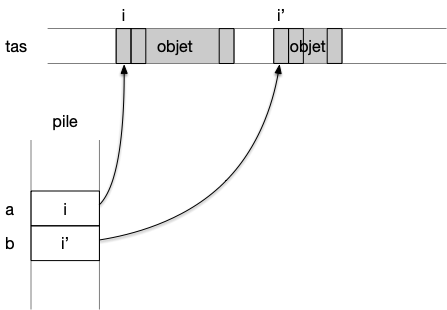
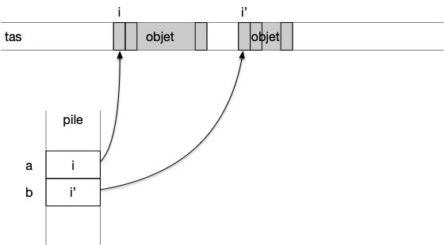
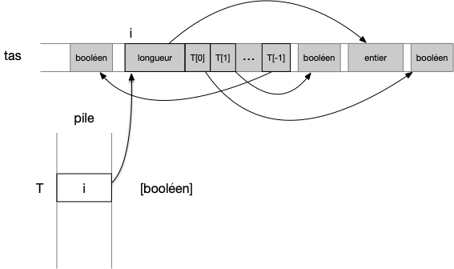

Le but d'un pseudo-code est d'être lu et compris par un humain. Il se doit d'être sans ambiguïté sans être lourd. Il est constitué d'instructions dont le but est soit :

- de manipuler des objets (création, affectation ou lecture)
- de contrôler le flux d'instructions (test et boucles).


Vous trouverez autant de type de pseud-code différents que d'informaticiens. Je vous donne ici _"mon"_ pseudo-code. Son but est d'être assez explicite pour décrire sans ambiguïté les algorithmes de ce cours. Ne soyez donc pas étonné si en lisant d'autres pseudo-codes ils ne suivent pas mes notations : ayez l'esprit ouvert.


Nous allons monter ici une version de pseudo-code sans accès direct à la mémoire (_ie._ sans pointeur). Ce modèle est tout à fait fonctionnel et est utilisé dans les langages de programmation comme python par exemple. Nous ajouterons l'accès direct à la mémoire (bien) plus tard dans ce cours. Ce modèle est plus simple à comprendre et à implémenter que le modèle avec pointeur et ne change rien algorithmiquement. Il va cependant nécessiter des opérations élémentaires supplémentaires (on appelle ceci des _overheads_) pour trouver la valeur de la variable en mémoire par rapport à l'utilisation directe de pointeurs.

## Commentaires

Comme en python, on considérera que tout ce qui suit le caractère `#`{.language-} est considéré comme un commentaire dont le but est d'éclairer le lecteur.

```pseudocode
# un commentaire
```

## Objets et opérations

Commençons par décrire les objets que l'on peut manipuler en pseudo-code et les moyens d'y accéder.

### Objets

Les objets sont ce que l'on manipule en algorithmie. On a vu qu'a priori on peut n'utiliser que des entiers (ou de façon équivalente des suites de 0 et de 1), mais cela nuirait grandement à la lisibilité. En pseudo code on se permet d'utiliser d'autres formes d'objets appartenant à 5 types fondamentaux. 

#### <span id="objets-basiques"></span> Objets basiques

Les objets que nous aurons directement à notre disposition sans avoir besoin de les définir sont appelés **_objets basiques_** et correspondent aux cinq **_types_** suivant



Un **_objets basiques_** peut être d'un des cinq **_types_** suivant :
:

- le type `booléen`{.language-} qui contient deux objets : `vrai`{.language-} et `faux`{.language-}
- le type `bit`{.language-} qui contient les 2 entiers : `0`{.language-} et `1`{.language-}
- le type `entier`{.language-} qui contient tous les entiers relatifs
- le type `réel`{.language-} qui contient un ensemble dénombrable d'approximations de réels (un nombre fini de décimales)
- le type `caractère`{.language-} qui contient l'ensemble des glyphes UNICODE : `"a"`{.language-}, `"b"`{.language-}, ...



Un type peut être vu comme un ensemble d'objets : le type entier contient tous les entiers possibles.

#### Le vide

En algorithmie on a également coutume de se doter d'un élément vide `∅`{.language-} (nommé `None`{.language-} en python, `null`{.language-} en javascript ou encore `void`{.language-} en C) qui peut être à la fois considéré comme un type ou un objet :



- **le type vide** `∅`{.language-} ne contient aucun objet. On l'utilise pour des fonctions ne rendant aucun objet par exemple
- **l'objet vide** `∅`{.language-} est de tous les types (le `∅`{.language-} entier, bit, ...). Utilisé pour simuler un soucis ou un cas particulier : une fonction division pouvant rendre soit un réel soit le vide si on divise par 0 par exemple.



#### Autres types

Tous les autres types d'objets que l'on peut imaginer seront des compositions de ces 5 types d'objets (un point en 3D est constitué de 3 réels, une chaîne de caractères est un tableau de caractères, etc).

#### Taille et stockage des objets

Tous les objets basiques sont considérés de taille fixe. Classiquement :

- un booléen à une taille de 1bit
- un caractère à une taille de 32bit si on utilise [les caractères Unicode](https://fr.wikipedia.org/wiki/Unicode)
- un réel à une taille 64bit si on utilise [la norme IEEE 754 double précision](https://fr.wikipedia.org/wiki/IEEE_754)
- un entier à une taille de  64bit

Se restreindre aux entiers entre $-2^{63}$ à $2^{63}$ n'est pas contraignant en pratique et c'est d'ailleurs ce que beaucoup de langages de programmation font (même souvent ils sont codés sur 32b). Les languages de programmation comme python pour lesquels un entier n'est pas borné considèrent en interne qu'un entier est en fait une suite d'entiers codés sur 64bits. Ceci est cependant transparent pour l'utilisateur.


On considérera toujours qu'un objet basique est de taille connue et donnée au début du programme mais que cela n'interférera pas avec son exécution (on ne créera par exemple pas d'entiers trop grands par exemple).


Les objets que l'on manipule doivent pouvoir être conservés pour que l'on puisse les réutiliser tout au long du programme. Cet espace espace de stockage, que l'on nomme **_une mémoire_**, est identifié d'un point de vue algorithmique, à une gigantesque suite de cases adjacentes à laquelle l'algorithme peut accéder en 1 instruction et pouvant contenir **_un objet basique_**. An algorithmie, on ne préoccupe pas vraiment de ce qu'est la mémoire.cela peut être celle de l'informaticien lecteur ou sur un ordinateur : peu importe.


En python, les objets sont stockés dans une partie de la mémoire nommée **tas** (le tas est un tableau où chaque case contient 1 byte = 8 bit).



Les objets sont stockées dans le tas. Notez que le tas peut contenir des "trous", c'est à dire des endroits sans objets.



### <span id="opérations"></span> Opérations

Les opérations que peuvent effectuer les pseudo-codes sont liées aux objets. On doit pouvoir :

- **_créer des objets_** : le caractère "Ç", l'entier `42`, etc...
- **_opérer sur des objets_** : rendre la somme de deux entiers, le résultat d'une formule logique, etc
- **_afficher un objet_**. On suppose que l'on possède une opération unaire spéciale nommée `affiche`{.language-} qui affiche à l'écran (ou à n'importe quoi permettant à l'utilisateur d'avoir un retour) l'objet. Par exemple `affiche 42`{.language-} va afficher l'objet entier valant 42 à l'écran.

#### Créer des objets

La seule façon de créer un objet à partir de rien est d'écrire sa valeur. Par exemple :

```pseudocode
42
```

Crée un objet entier de valeur `42`

#### Opérations

De façon formelle :



une **_opération_** est une fonction dont l'espace de départ est un produit cartésien de types et l'espace d'arrivée un type donné. Elle prend en paramètre des objets (de l'espace de départ) et produit un objet du type de l'espace d'arrivée.



Les opérations sont le second moyen de créer des objets. Par exemple le booléen Vrai est créé comme résultat de l'opération `40 > 2`. Les seules opérations définies par défaut dans tout pseudo-code sont peu nombreuses :

- pour les entiers et les réels :
  - arithmétique : addition (`+`{.language-}), soustraction (`-`{.language-}), multiplication (`*`{.language-}), division (`/`{.language-})
  - opérations usuelles comme prendre la valeur entière, la valeur absolue, ...
  - la division entière de deux nombre (`//`{.language-}) et le modulo (`%`{.language-})
  - logique : égalité (avec le signe `==`{.language-}), plus petit que (`<`{.language-}), plus grand que (`>`{.language-}), plus petit ou égal (`≤`{.language-}), plus grand ou égal (`≥`{.language-})
- pour les caractères :
  - logique : égalité (avec le signe `==`{.language-})
- opérations sur les bits et les booléens :
  - "négation logique" (non, `NOT`{.language-}, $\neg$),
  - "et logique" (et, `ET`{.language-}, `&&`{.language-}, `AND`{.language-} ou $\land$), "ou logique" (ou, `OU`{.language-}, `||`{.language-}, `OR`{.language-} ou $\lor$)

```pseudocode
40 + 2  # rendra l'objet entier 42
```

Toutes les autres opérations devront être définies soit dans le pseudo-code (avec des fonctions, comme on va le voir) soit dans un texte avant celui-ci.

#### Affichage

Enfin, la dernière opération autorisée pour les objet est l'affichage :

```pseudocode
affiche 42
```

L'affichage est destiné, comme le commentaire, au lecteur du pseudo-code. Son but est de lui montrer des résultats intermédiaires intéressant lors de l'exécution du pseudo-code. Ne confondez pas un commentaire avec un retour de fonction : ce qui est affiché sort du contrôle du pseudo-code. Dans l'exemple précédent, l'entier 42 est affiché, le pseudo-code n'en a pas conscience.


Pour distinguer le retour de fonction, d'un affichage supprimez tous les affichages de votre pseudo-code et il doit continuer de fonctionner.


## Variables

Une **_variable_** permet de retrouver un objet stocké en mémoire pour sa réutilisation :


Une **_variable_** est un nom auquel est associé un objet d'**un type donné**.


Les variables nous permettent de manipuler les objets. Conceptuellement parlant, ce sont juste des **liens vers** les objets qu'elles référencent.

En algorithmie, tout comme pour les objets on ne se préoccupe pas vraiment de où sont stockés les variables. On sait qu'elles existent elles sont rangés dans une partie de la mémoire différentes des objets (les variables ne sont pas considérés comme des objets).



En python, elles sont stockées dans une partie de la mémoire nommée **pile** et contiennent l'indice de la mémoire du tas où commence l'objet qu'elle référence. Chaque variable est donc juste assez grande pour stocker un indice (64bit sur les ordinateur actuel ce qui permet d'avoir théoriquement un tas de taille $2^{64}$byte = 18446744073709551616B = 16777216 terabyte).



Chaque variable a la même taille et sont stockées de façon consécutives dans la pile. En effet, les variables sont crées au début de l'algorithme et sont toues supprimées en même temps à la fin de l'algorithme.



### Définition d'une variable

Avant de pouvoir être utilisée, une variable doit être définie. La ligne suivante définie une variable de nom $a$ pouvant référencer un objet de type entier :

```pseudocode
a := entier
```

La ligne précédente crée une nouvelle variable nommée `a`{.language-} pouvant référencer des objets de type entier. Dans tout le reste du pseudo-code, on sera sur que `a`{.language-} contient une valeur entière.


On utilise l'**_opérateur de définition_** `:=`{.language-} pour créer une variable. Le format général d'une définition de variable est :

```pseudocode
nom_de_la_variable := type_des_objets_qu_elle_peut_référencer
```



En pseudo-code, comme le principal soucis est la non ambiguïté, une variable ne peut contenir que des objets d'un type spécifié lors de sa définition. Définir une variable avant de l'utiliser est utilisé dans certains langages de programmation (java, rust, go) mais pas d'en d'autres comme le python où une variable peut être associée à des objets de types différents.

### Affectation

Une fois la variable crée, on peut lui **_affecter_** des objets, par exemple pour notre variable `a`{.language-} crée précédemment :

```pseudocode
a ← 3
```

La ligne précédente La ligne précédente associe ainsi à la variable `a`{.language-} un objet entier valant 3.


On utilise l'**_opérateur d'affectation_** `←`{.language-} pour affecter une variable. Le format général de l'affectation d'un objet à une variable est :

```pseudocode
nom_de_la_variable ← objets_qu_elle_va_référencer
```



On n'utilisera pas le signe `=` en pseudo-code pour l'affectation car cette opération n'est pas symétrique : à gauche une variable à droite un objet.


Comme le symbole `←`{.language-} n'est pas présent sur un clavier, de nombreux langages de programmation utilisent cependant le signe `=`{.language-} pour une affectation.


Une variable est une opération temporaire. On peut réaffecter une variable à un autre objet au cours du pseudo-code :

```pseudocode
a := entier
# des instructions
a ← 4
# des instructions
a ← 2
```

Après la troisième ligne, le code précédent associe la variable `a`{.language-} à un entier valant 4 et à un entier valant 2 après la cinquième ligne. Il est important de noter que :


Une variable n'est **pas** un objet, c'est un lien vers un objet qui pourra changer au cours du temps.

Après la définition d'une variable, elle n'est encore liée à aucun objet, va valeur est **indéfinie**. Il ne faut pas l'utiliser avant sa première affectation.


### Utilisation

Utiliser une variable consiste à la remplacer dans l'instruction par l'objet qu'elle référence. Par exemple :

```pseudocode
a := entier
a ← 42
affiche a
```

Le code précédent affiche l'objet référencé par $a$. Il est équivalent à : `affiche 42`{.language-}.


**_Utiliser_** une variable dans un code revient à la remplacer par l'objet qu'elle référence. Ce remplacement se fait **avant** l'exécution de l'instruction.



Regardons ceci avec quelques exemples :

```pseudocode/
a := entier
a ← 42
b := entier
b ← a
```

La ligne 4, une instruction d'affectation, s'exécute de la façon suivante :

1. on commence par retrouver objet à droite de l'opérateur `←`{.language-}. C'est une variable : on récupère son objet, un entier valant 42
2. on affecte cet objet à la variable à gauche de l'opérateur `←`{.language-}, la variable `b`{.language-}

Autre exemple :

```pseudocode/
a := entier
a ← 41
b := entier
b ← a + 1
```

La ligne 4, une instruction composée d'une opération puis d'ue affectation, s'exécute de la façon suivante :

1. on commence par retrouver objet à droite de l'opérateur `←`{.language-}. C'est le résultat d'une opération :
   1. pour effectuer l'opération, il faut commencer par retrouver l'objet associé à `a`{.language-} : un entier valant 41
   2. on peut maintenant effectuer l'opération d'addition qui rend un objet de type entier valant 42
2. on affecte cet objet à la variable à gauche de l'opérateur `←`{.language-}, la variable `b`{.language-}

Attention cependant :


On ne peut utiliser une variable qu'après l'avoir affectée. Utiliser une variable qui n'a été que définie est interdit en algorithmie.



### Type d'un objet

On aura parfois besoin de connaître le type d'un objet pour définir une variable du même type. On suppose qu'il existera toujours une opération unaire spéciale nommée `type`{.language-} qui rend le type de l'objet passé en paramètre, et que l'on pourra utiliser dans les déclarations de variables. Par exemple `type 42`{.language-} va rendre `entier`. Ceci permet d'écrire :

```pseudocode
a := entier
b := type a
``` 

## <span id="tableaux"></span>Tableaux


Un **_tableau_** est un conteneur nommé pouvant contenir $n$ variables **de même type**. $n$ est la **_longueur_** ou la **_taille_** du tableau. La taille d'un tableau est déterminée à sa création et ne peut être modifiée. Chaque variable du tableau peut être accédée via son **_indice_**, qui est un entier entre $0$ et $n-1$.

Si le tableau est nommé $T$ :

- $T.\mbox{longueur}$ sera égal à sa taille.
- $T[i]$ est sa variable d'indice $i$ si $0 \leq i < n$
- $T[-i]$ vaut $t[n-i]$ si si $0 < i  \leq n$

Le type d'un tableau est défini par le type des objets qu'il contient entre crochet : `[type]`{.language-}.



Créons un objet tableau pouvant contenir 13 variables de type entier :

```pseudocode
T := [entier]  # création de la variable pouvant accueillir un tableau d'entier

T <- [entier]{longueur: 13}  # création d'un tableau pouvant contenir 13 variables entières
```



- le format général de la création d'une variable tableau : `nom_du_tableau := [type]`{.language-}
- création d'un tableau de longueur $n$  : `[type]{longueur: n}`{.language-}


Un tableau est un mix entre variables et objet : c'est un objet contenant des variables de même type. 


Lors de la définition d'un tableau on crée à la fois la variable contenant le tableau et le tableau lui-même qui est une suite de $n$ variables.



La remarque ci-dessus est cruciale à comprendre car cela peut entraîner tout un tas d'effet de bord incompréhensible sinon. Pour comprendre ce qu'il se passe, voyez comment python gère les tableaux :



Une façon d'implémenter cette structure en pratique est de stocker les différentes références des variables du tableau de façon contiguë en mémoire pour pouvoir y accéder rapidement pour y être lue ou modifiée :



L'implémentation en python est simple et générale mais nécessite une indirection : avant d'accéder à un objet on passe d'abord par son adresse.

Puisque les tailles des objets sont connus, on peut éviter cette indirection en stockant directement les objets de façon contiguës en mémoire. C'est ce que font des languages comme le rust, le C ou encore le go (ils le font aussi entre la pile et le tas, la plupart des variables étant directement stockées dans la pile).

Mais cette rapidité interne vient avec une complexité supplémentaire : la nécessité d'avoir un nouveau type d'objet appelé pointeur (qui correspond à une adresse en mémoire) mais que nous n'aborderons que bien plus tard.


On utilise un tableau comme une collection de variables, par exemple :

```pseudocode
T := [entier]
T ← [entier]{longueur: 3}

T[0] ← 41
T[1] ← 1
T[2] ← T[0] + T[1]
```

La seule opération spécifique à un tableau est sa création qui est un mix entre création d'objet et création de variable, puis on affecte ses variables avant de pouvoir les utiliser.


Tout comme une variable, une fois le tableau créé, la valeur de chaque case est **indéterminée !** Il est **indispensable** d'initialiser les valeurs de chaque case avant de les utiliser.


Toutes les autres opérations sur les tableaux sont faites graces aux opérations des objets basiques qui les composent. Il n'y a pas d'opérations spécifiques à ceux-ci :


Les opérations sur les tableaux seront toujours des opérations composées d'une suite d'opérations effectuées sur les objets basiques les constituants.


Ainsi, on ne peut **pas** affecter un tableau. Il faut créer un nouveau tableau puis y recopier tous les éléments de l'ancien.

On considère que :


- créer un tableau ne prend pas plus de temps que de créer une variable (1 instruction) car sa longueur est fixée et que les variables qui le constitue ne sont pas initialisées,
- la taille en mémoire d'un tableau est proportionnelle à la taille d'une variable fois sa longueur,
- accéder à une variable d'indice donné d'un tableau ne prend pas plus de temps que d'accéder à l'objet d'une simple variable (1 instruction).


Les tableaux peuvent être simples comme une suite finie d'entiers ou des types plus complexes comme une matrice à 2 dimensions où chaque élément du tableau est un autre tableau. 

### Tranches

On utilisera parfois, comme en python par exemple des sous tableaux via des **_tranches_** (**_slices_** en anglais) :

- `T[i:]`{.language-} représentera le tableau constitué des éléments de T à partir de l'indice i **inclus** jusqu'à la fin
- `T[:j]`{.language-} représentera le tableau constitué des éléments de T à partir de l'indice 0 **inclus** jusqu'à j **exclu**
- `T[i:j]`{.language-} représentera le tableau constitué des éléments de T à partir de l'indice i **inclus** jusqu'à j **exclu**


Tout comme pour les tableaux, **on ne peut pas** affecter une tranche de tableau. Il faut créer un nouveau tableau puis y recopier tous les éléments de l'ancien.


### <span id="str"></span>Chaînes de caractères

Les chaines de caractères sont un tableau uniquement composés de caractères. Cette structure est utilisée lorsque l'on veut écrire ou représenter plus qu'un caractère, c'est à dire quasi tout le temps.

Une **_chaîne de caractères_** est un tableau constitué uniquement de caractères.

Comme ce sont des tableaux, on peut :

- créer une chaîne de caractères : `"salut"`{.language-} crée la chaîne contenant les caractères `"s"`{.language-}, `"a"`{.language-}, `"l"`{.language-}, `"u"`{.language-} et `"t"`{.language-} de façon contiguë en mémoire.
- affecter une chaîne de caractères à une variable prend 1 instruction : `s ← "salut"`{.language-} prend 2 instructions, une pour la création et une pour l'affectation.
- accéder à un caractère particulier en utilisant les crochets : `s[2]`{.language-} vaut le caractère `"l"`{.language-}
- connaître la longueur de la chaîne avec : `s.longueur`{.language-}

Les chaines étant très utilisées, des langages comme python les considèrent comme un type de base et considèrent les caractères comme étant des chaîne de langueur 1.


Chacune des quatre opérations précédentes (création, affectation, accès et concaténation) prend 1 instruction (les chaînes crées sont des constantes).


La chaîne de caractère étant très utilisée, on se permettra les abus suivant :

- de définir une chaîne directement : `s := chaîne`{.language-} en utilisant le type chaîne
- puis de l'affecter : `s ← "Salut"`{.language-}
- on définit l'opération de concaténation avec l'opérateur `+`{.language-} : `"comment vas-tu" + " yau d’poêle ?"`{.language-} vaut la chaîne de caractères `"comment vas-tu yau d’poêle ?"`{.language-}


Le type `chaîne`{.language-} peut être vu comme un synonyme `[caractère]`{.language-} sauf que l'on ne peut pas modifier un de ses indices (`s[2] ← "p"`{.language-} ne sera pas une instruction valide), bien que l'on puisse y accéder (`affiche s[2]`{.language-} sera une instruction valide). Un tableau de chaînes sera de type `[chaîne]`{.language-}.


## <span id="instruction-contrôle"></span> Instructions de contrôle

Si un des deux buts d'une instruction est de créer des objets à partir d'autres (ce que l'on vient de voir), le second but est de contrôler le flux d'instructions à exécuter. Ces instructions sont de deux types :

- [l'exécution conditionnelle d'instructions](./#tests){.interne},
- [la répétition d'instructions](./#répétition){.interne}

Ces formes d'instruction nécessitent de grouper les instructions en blocs.

### Blocs

Lier les instructions en blocs :


```pseudocode
type_de_bloc:
    instruction 1
    instruction 2
    ...
    instruction n
```

On décale les instructions du bloc de sa définition.



Ce formalisme a été popularisé par python et permet de voir du premier coup d'œil les instructions d'un bloc.

### <span id="tests"></span> Exécution conditionnelle d’instructions

On veut pouvoir exécuter un bloc de code si une condition logique est VRAIE :



```pseudocode
si (condition logique):
    instruction 1

    ...
    instruction n
```



Cette instruction basique suffit pour gérer toutes les exécutions de bloc conditionnelles, mais pour plus de lisibilité on admettra plein de variantes comme la variante "si-sinon" :

```pseudocode
si (condition logique):
    instruction 1
    ...
    instruction n
sinon:
    instruction 1
    ...
    instruction n'
```

ou encore "si-sinon si" :

```pseudocode
si (condition logique):
    instruction 1
    ...
    instruction n
sinon si (autre condition logique):
    instruction 1
    ...
    instruction n'
```

Ou tout mix de tout ça (comme "si-sinon si-sinon"), du moment que c'est clair !


Écrire la variante `si, sinon si, sinon`{.language-pseudocode} avec la forme initiale `si`{.language-pseudocode}.



```pseudocode
si (conditionA):
    # instructions A
sinon si (conditionB):
    # instructions B
sinon:
    # instructions C
```

Se traduit en :

```pseudocode
si (conditionA):
    # instructions A
si ((NON (conditionA)) ET (conditionB)):
    # instructions B
si ((NON (conditionA)) ET (NON (conditionB))):
    # instructions C
```



### <span id="répétition"></span> Répétition

On doit pouvoir répéter un bloc tant qu'une condition logique est vérifiée :



```pseudocode
tant que (condition logique):
    instruction 1
    ...
    instruction n
```

Le ploc précédent est exécuté tant que la condition logique est vraie.



Tout comme l'exécution conditionnelle, la forme précédente suffit pour exprimer toutes les formes de répétition possible, mais on admet la variation suivante, très utile :

```pseudocode
pour chaque élément x d'un tableau:
    instruction 1
    ...
    instruction n
```

On exécutera alors le bloc autant de fois qu'il y a d'éléments dans le tableau et à chaque itération du bloc, la variable `x`{.language-pseudocode} (de type de celui des objets stockés dans le tableau) vaudra un autre élément du tableau. On prendra les éléments du tableau par indice croissant.

Le code précédent est équivalent au code suivant, moins élégant, mais qui explicite le numéro de l'itération courante d'un tableau de chaînes : 

```pseudocode
x := entier

i := entier
i ← 0
tant que i < tableau.longueur:
    x ← tableau[i]

    instruction 1
    ...
    instruction n

    i ← i + 1
```

Comme on va souvent faire des itérations sur des intervalles d'entiers, on utilise les notations suivantes :

- `[a .. b]`{.language-} pour représenter l'intervalle formé des entiers allant de `a` à `b` (cet intervalle peut être vide) par incrément de +1,
- `[a .. b[`{.language-} pour représenter l'intervalle fermé des entiers allant de `a` à `b-1` (cet intervalle peut être vide),
- `]a .. b]`{.language-} pour représenter l'intervalle fermé des entiers allant de `a + 1` à `b` (cet intervalle peut être vide),
- `]a .. b[`{.language-} pour représenter l'intervalle fermé des entiers allant de `a + 1` à `b -1` (cet intervalle peut être vide).

On peut alors écrire, par exemple :

```pseudocode
x, i := entier
pour chaque i de [0 .. 10000[:
    x ← i + x
```


Écrire le code suivant en utilisant la notation intervalle : 

```pseudocode
pour chaque élément x de tableau:
    instruction 1
    ...
    instruction n
```


```pseudocode
x := chaîne
i := entier
pour chaque i de [0 .. tableau.longueur[:
    x ← tableau[i]

    instruction 1
    ...
    instruction n
```

