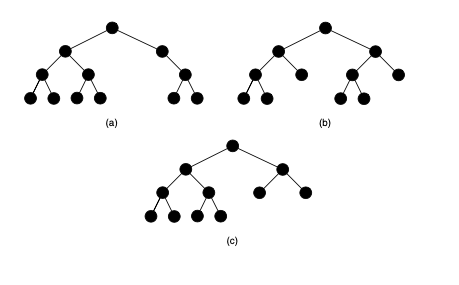

> TBD à faire.

structure hiérarchique (arbre planté)

> TBD AVL
arbre rouge/noir ; tas de Fibonacci ; ...

> TBD tas, ABR, lexico-graphiques
> exo AABB, arbres
> arbre syntaxique + pile pour lecture
- tas et file de priorité
> TBD union find

> TBD exo : <https://www.youtube.com/watch?v=OTfp2_SwxHk>

## Tas

Nous allons montrer ici une utilité de l'arbre binaire complet pour résoudre le problème d'une file de priorité.

### le problème

Une salle d'attente des urgences d'un hôpital contient des patients dont la gravité d'état est donnée par un entier. Des patients peuvent arriver et partir de la salle d'attente et leur état peut s'améliorer (la gravité d'état baisse) ou se détériorer (leur gravité d'état augmente). A chaque fois qu'un médecin est libre, on prend en charge le patient avec l'état de gravité le plus important.

### une solution possible (naïve)

On regarde chaque patient et on prend le patient ayant la gravité d'état le plus important.



Quel est le coût algorithmique d'utiliser une telle solution ?


On a simplement besoin de regarder chaque patient lorsqu'il faut en prendre en charge un nouveau. On n'a pas besoin de faire des choses lorsque les patients changent d'état de gravité ou partent et arrivent. Mais à chaque fois c'est $\mathcal{O}(n)$ opérations.


Si l'on suppose que l'état de gravité d'un patient est connu, on peut faire bien mieux.

### un tas

Un tas est un arbre binaire planté complet dont les sommets sont des entiers. On considère en plus qu'un tas est **plein**, c'est-à-dire que les feuilles de hauteur maximum forment un intervalle à gauche de l'arbre.



Des trois arbres ci-dessus lequel (il n'y en a qu'un) est binaire, complet et plein ?




- (a) est binaire mais pas complet
- (b) est binaire complet mais pas plein
- (c) est binaire, complet et plein.
  

De plus, pour un tas, chaque nœud est de valeur plus grande que chacun de ses descendants direct.



- Créez un tas avec les nombres : 42, 12, 1, 3, 6, 5.
- Y a-t-il plusieurs possibilités ?
- que peut-on dire du nœud ayant le plus grand nombre ?




Le plus grand nœud est **toujours** la racine du tas.


### manipulation d'un tas



Donner les algorithmes pour effectuer les opérations suivantes :

1. ajout d'un élément
2. modification d'une valeur
3. suppression de la racine




1. on l'ajoute à la fin et on le remonte (récursivement) si nécessaire
2. on change la valeur puis on échange récursivement
   - avec son parent si la valeur est plus grande ou
   - avec son enfant de valeur maximum si la valeur est plus petite
3. on prend la dernière feuille, on la supprime et on modifie (avec l'opération 2) la racine avec la valeur de la feuille enlevée.



On peut s'en sortir avec des algorithmes dont le nombre d'opérations est proportionnel à la hauteur du tas.



En conclure que l'utilisation du tas est bien meilleure que la solution naïve.



Toutes les opérations nécessitent un nombre de calculs proportionnel à la hauteur $h$ du tas. Et il y a $n = 2^h$ éléments dans celui-ci. Nos opérations sont donc toutes en $\mathcal{O}(\log_2(n)) = \mathcal{O}(h)$ opérations.


### pour la bonne bouche



- En déduire une façon de trier un tableau de nombres.
- trouver un moyen de représenter un tas par une liste (on pourra parcourir le tas de haut en bas et de droite à gauche).




On commence par un tas vide et on le remplit petit à petit (cela prend $n$ fois $\mathcal{O}(\log_2(n))$ opérations). Puis on supprime itérativement la racine $n$ fois. Ce qui prend encore $n$ fois $\mathcal{O}(\log_2(n))$ opérations.

On a donc un tri en $\mathcal{O}(n\log_2(n))$ opérations.

Pour la représentation en tableau, voir Voir [wikipedia](<https://fr.wikipedia.org/wiki/Tas_(informatique)>) (on les place dans l'ordre de haut en bas et de droite à gauche).

