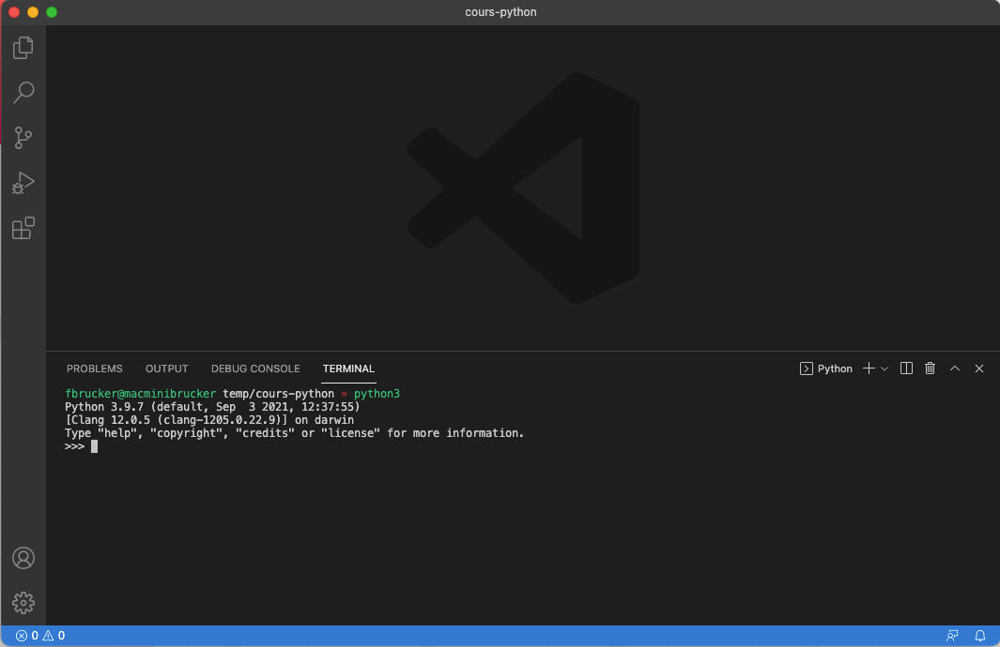
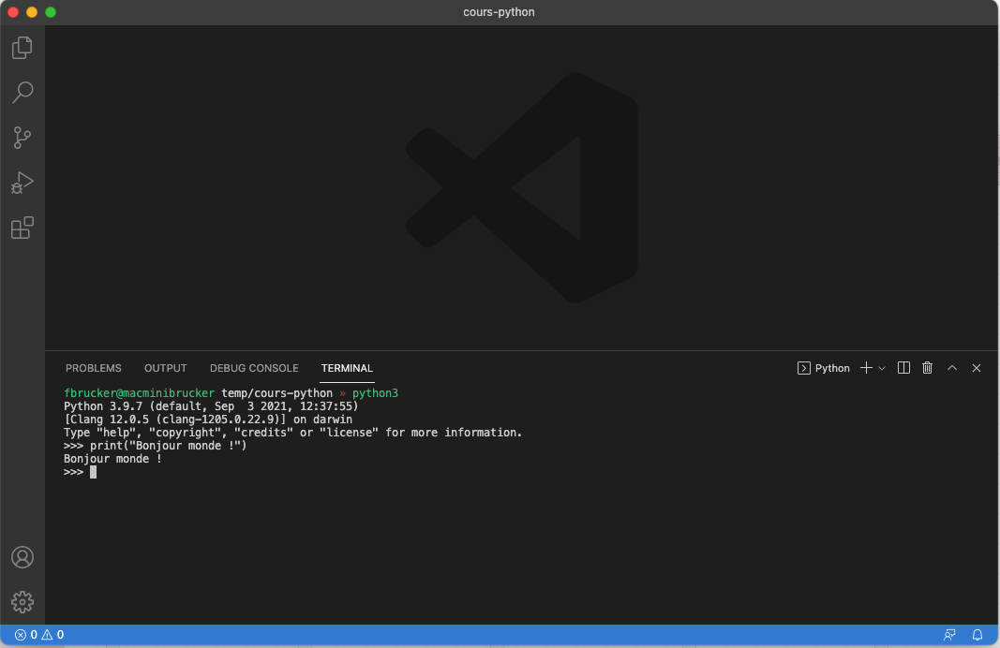

Différentes manières d'utiliser un terminal avec [visual studio code](https://code.visualstudio.com/) avec python. [On a déjà vu](/cours/système/interagir-avec-système/terminal/bases/#vscode){.interne} rapidement comment utiliser le terminal dans vscode, nous allons voir ici comment l'utiliser pour exécuter du code python.


## Exécuter du python via le terminal

Vous pouvez utiliser le terminal pour exécuter vos programmes python.


Ouvrez ou refaite [le projet d'introduction vscode et python](../python){.interne}


Remarquez que lorsque [vous exécutez le code](../éditeur-vscode/python/#exécuter-programme){.interne}, vscode exécute une ligne de commande dans le terminal :

```txt
<nom du programme python> <fichier à exécuter>
```

Une fois le programme exécuté, vscode vous laisse dans le terminal. Vous pouvez alors facilement re-exécuter votre programme **en tapant sur la flèche du haut** sur votre clavier. Ceci à pour effet de rappeler la commande précédente pour l'exécuter à nouveau en appuyant sur la touche entrée.

<div id="exécuter-programme"></div>


Cette technique est utile pour connaître l'interpréteur utilisé par vscode.

1. commencez par exécuter un programme python avec le triangle
2. tapez la flèche du haut pour rappeler la commande

Vous aurez alors la commande :

```txt
<nom du programme python> <fichier à exécuter>
```

Vous pouvez alors :

- soit copier le `<nom du programme python>` pour l'utiliser dans un autre terminal
- soit supprimez la fin de la commande (le nom du fichier à exécuter) pour ne garder que le programme python utilisé.



Nous allons refaire ce processus à la main.


Ouvrez un terminal dans vscode : _menu Affichage > Terminal_.



Déterminer votre `nom-du-programme-python`, puis exécutez le dans un autre terminal.




Dans l'interpréteur (à côté des `>>>`, qu'on appelle [invite de commande ou prompt](https://fr.wikipedia.org/wiki/Interface_en_ligne_de_commande)) :


Tapez :

```python
print("Bonjour monde !")
```

Puis appuyez sur la touche entrée.


Vous devriez avoir quelque chose du genre à la sortie :



Ca a l'air d'avoir marché. La ligne de code a affiché à l'écran `Bonjour Monde`, puis l'invite de commande est revenue (une fois l'instruction exécutée, on attend la suivante).

Pour quitter l'interpréteur python :


Tapez `quit()` puis appuyez sur la touche entrée.


l’intérêt d'utiliser le terminal est que l'on peut :

- utiliser la flèche du haut du clavier pour rappeler la commande précédente. Cela va plus vite que de se déplacer sur le triangle
- on peut exécuter le code sans être sur l'onglet du fichier à exécuter


Exécutez le fichier `main.py`{.language-} via le terminal en respectant la forme générale d'une exécution d'un code python :



## Palette de commande

Si vous tapez `>terminal` dans [la palette de commande](../éditeur-vscode/prise-en-main#palette-de-commande){.interne}, vous verrez toutes les commandes qui ont terminal dans leur nom. Il y a des commandes spécifiques à un langage (javascript, python, etc) et certaines très générales comme : _Open New External Terminal_ qui ouvre un terminal dans le dossier de votre projet.
