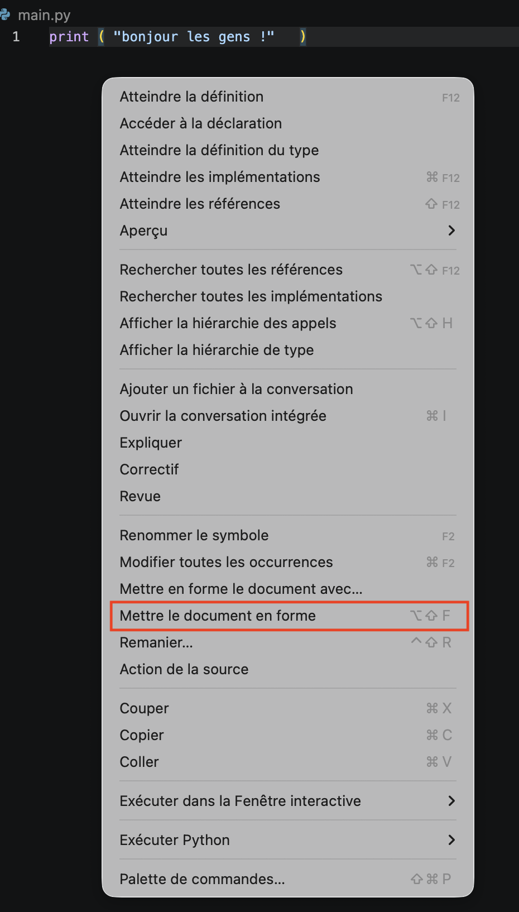

Un projet informatique a un début, lorsque l'on crée le dossier qui va le contenir, mais il n'a que rarement de fin : il y a toujours des fonctionnalités à ajouter et des bugs à corriger. Enfin, et c'est le plus important, un code est fait pour être utilisé.

De ces deux constatations, on a déduit trois règles fondamentales d'un code utile. Il faut qu'il soit :

- juste pour des utilisateurs puissent s'en servir
- facilement modifiable pour que l'ajout et la correction de fonctionnalités soient aisés
- lisible pour soi et pour les autres membres de l'équipe de développement

Le langage d'application n'a que peu d'intérêt en soit. On choisit celui qui est le plus adapté à notre but. Ici, on utilisera le python mais tout ce qu'on verra est transposable pour tout autre langage sérieux. L'éditeur de texte que l'on utilisera sera vscode. Il en existe d'autres très bien aussi et tout ce qu'on verra avec vscode (les raccourcis claviers, et aides au développement) sont transposables à d'autres éditeurs en lisant la doc.


Écrire du code nécessite de nombreuses automatisations et aides pour que ce ne soit pas pénible, ne vous privez pas d'outils parce que vous n'avez pas envie d'apprendre de nouvelles choses et que _ça suffit bien pour ce que je veux faire_. Vous allez au final perdre plus de temps que l'apprentissage initial (ce qui est tarte).


## Un projet


Un projet informatique est un dossier contenant :

- le code du projet,
- les tests du code du projet,
- un moyen clair de l'exécuter,



On va créer un projet pour comprendre comment tout ça fonctionne :




1. Commencez par créer le dossier `hello-dev`{.fichier} dans un explorateur de fichier
2. dans vscode, choisissez : "_fichier > ouvrir le dossier..._" puis naviguez jusqu'à votre dossier `hello-dev`{.fichier}. On vous demande si vous faites confiances aux auteurs, puisque c'est vous dites oui.



Vscode comprend que vous êtes entrain de créer un projet car vous ouvrez un dossier. Il sera le départ de votre projet et vscode s'appelle _workspace_.


Lorsque l'on code et que l'on ne veut pas de problèmes en développement, les noms de fichiers et de dossier doivent êtres **sans espaces et sans accents**.


### Fichier python

Un projet étant fait pour être exécuté, créons tout de suite le moyen de l'exécuter :


Un projet informatique python s'exécute en demandant à l'interpréteur d'exécuter le fichier `main.py`{.fichier} présent à la racine du code.




Faisons le :



1. allez dans _menu Fichier > Nouveau Fichier_
2. et sauvez le de suite : _menu Fichier > Enregistrer_ avec le nom `main.py`{.fichier}.



Vscode à compris que c'était du python, il l'écrit dans la barre de statut (la dernière ligne, en bleu, de la fenêtre vscode, voir [user interface](https://code.visualstudio.com/docs/getstarted/userinterface)).



Si vous n'avez pas suivi le tuto d'installation de vscode et son interaction avec python, il vous demandera peut-être de :

1. choisir un interpréteur : prenez le python de votre distribution
2. choisir un linter : supprimer la fenêtre de warning, on fera ça plus tard.
3. choisir des tests : supprimer la fenêtre de warning, on fera ça plus tard.



### Exécution d'un fichier

On doit pouvoir toujours exécuter son projet, donc écrivons quelque chose dans notre fichier :



Écrivez dans le fichier `main.py`{.fichier} :

```python
print("bonjour les gens !")
```




[Exécutez le code avec vscode](../../outils/éditeur-vscode/python/){.interne} de deux manières différentes :

- avec le terminal
- avec le petit triangle vert



### Documentation

Un projet python avec un fichier `main.py`{.interne} est le moyen classique d'exécuter un fichier. Pour qu'un utilisateur sache ce qu'il exécute, on ajoute un fichier de documentation de projet :


Un projet informatique doit avoir une documentation qui permettent aux utilisateur de savoir ce qu'ils exécute et comment le faire. L'usage veut que ce fichier soit écrit en markdown et s'appelle `README.md`{.fichier}.



[Ce que doit contenir un fichier readme selon github](https://docs.github.com/fr/repositories/managing-your-repositorys-settings-and-features/customizing-your-repository/about-readmes).


[Le markdown](https://fr.wikipedia.org/wiki/Markdown) est un format d'écriture de fichier texte très facile à lire et peut être aisément transformé en html, pdf, etc. Nous n'allons pas ici détaillé trop ce format lisez les doc suivantes elles sont super utiles :


- <https://www.markdownguide.org/>
- [cheat sheet](https://gist.github.com/cuonggt/9b7d08a597b167299f0d)
- [documentation (avancée) en Français](https://blog.stephane-robert.info/docs/developper/autres-langages/markdown/)


Notre fichier `README.md`{.fichier} :

```txt
# Projet "Hello dev !"

## À propos

Un exemple de projet en python qui dit bonjour.

## Utilisation

Exécutez le fichier `main.py`.

```

Vscode possède une série d'extensions permettant d'ajouter des fonctionnalités. Il existe de nombreuses extensions pour gérer le markdown et vous aller installer [Markdown all in one](https://marketplace.visualstudio.com/items?itemName=yzhang.markdown-all-in-one).


En relisant si nécessaire [la partie extension du cours sur vscode](../../outils/éditeur-vscode/prise-en-main/#extensions){.interne}, installer l'extension  "Markdown all in one".


Cette extension fourni de nombreux utilitaires comme l'autocompletion ou encore vous permett de compiler du markdown en html.

## <spans id="linter"></span> Du joli code

Vous allez passer beaucoup de temps à lire du code, le votre et celui des autres. Il est important que ce soit facile. Pour cela il faut que le style de code soit cohérent. Python donne des règles de style dans le lien ci-après qu'il est bon de suivre :


[la PEP8](https://www.python.org/dev/peps/pep-0008/).


Il existe des outils permettant de formatter automatiquement le code, comme l'utilitaire [black](https://github.com/psf/black) par exemple. Ca tombe bien il existe une extension vscode pour lui :



En relisant si nécessaire [la partie extension du cours sur vscode](../../outils/éditeur-vscode/prise-en-main/#extensions){.interne}, installer l'extension "_black formatter_" développé par microsoft.


Une fois black installé, vous pouvez l'utiliser depuis un terminal ou depuis vscode. Testons le.


Commençons par écrire dans le fichier `main.py`{.fichier} du code pas joli du tout, avec plein d'espaces en trop :

```python
print ( "bonjour les gens !"   )
```


Pour accéder à black cliquez droit sur l'éditeur pour avoir le menu contextuel suivant :



Puis :



Cliquez sur "_mettre le document en forme_".


Si c'est la première fois que vous le faite, vscode vous demandera peut-être de choisir votre formateur : choisissez _black-formatter_.


black nécessite une version de python supérieure ou égale à 3.10


Et comme par magie, votre fichier a été modifié en :

```python
print("bonjour les gens !")
```

Ce qui est non seulement plus joli mais de plus respecte la PEP8.


Votre code doit **toujours** être joli. Vous devez utiliser black le plus souvent possible. 


Toute action qui se fait souvent va avoir son raccourci clavier. Regardez le votre. Chez moi (_cf._ le screenshot) c'est option shift F. 


## Séparer code et main



Un projet c'est trois choses d'égale importance :

- le code : les fonctions utilisées
- le main : le programme principal, c'est ce qu'on exécute lorsque veut faire marcher le projet
- les tests : ce qui garantit que le code fonctionne



Pour séparer les différentes parties vous allez :


Créez deux fichiers dans notre projet, l'un nommé `fonctions.py`{.fichier} qui contiendra notre code et l'autre nommé `main.py`{.fichier} qui sera notre programme principal


Fichier `fonctions.py`{.fichier} :

```python
def bonjour():
    return "Bonjour les gens !"

```

Fichier `main.py`{.fichier} :

```python
from fonctions import bonjour

print(bonjour())

```

On a importé le nom `bonjour`{.language-} défini dans le fichier `fonctions.py`{.fichier} grâce à un import. L'autre façon aurait été d'importer juste le fichier code. On aurait alors eu :

```python
import fonctions

print(fonctions.bonjour())

```

La notation pointée se lit alors : exécute le nom `bonjour` définit dans `fonctions.py`{.fichier}.


Ne **jamais jamais jamais** utiliser `from fonctions import *`{.language-} qui importe tous les noms définis dans `fonctions.py`{.fichier}. On ne sait pas vraiment ce qui a été importé en lisant `fonctions.py`{.fichier}. : notre code n'est pas lisible ! Le gain d'écriture de `*`{.language-} plutôt que `bonjour`{.language-} sera perdu au centuple plus tard lorsque l'on devra chercher dans tous les fichiers du projet où l'on a bien pu définir `bonjour`{.language-}...



Comme on va passer plus de temps à lire/comprendre du code qu'à l'écrire, il faut **optimiser la lecture et non l'écriture de code**. On préférera toujours **la lisibilité à la rapidité**.


## Tests

Les tests permettent de vérifier que notre code fonctionne. Ils font partie du programme et on peut s'y référer quand on veut. Lorsque l'on modifie le code, on pourra toujours exécuter **tous les tests** pour vérifier que notre programme fonctionne aussi bien qu'avant.

On reprend [ce que l'on a déjà vu](../tests-unitaires/){.interne} pour finaliser notre projet :



Il faut au moins un fichier de test par fichier du projet hors main. Par défaut ce fichier s'appelle `test_<nom>.py`{.fichier} qui teste toutes les fonctions du fichier `<nom>.py`{.fichier}


Notre projet contient pour l'instant une fonction qui rend une constante. Tester une constante n'a pas de sens, modifions notre code pour que notre fonction ait plus de sens :


Modifiez le fichier `fonctions.py`{.fichier} pour qu'il contienne le code :

```python
def bonjour(nom):
    return "bonjour " + nom + " !"

```



Créez le fichier `test_fonctions.py`{.fichier} pour qu'il contienne le code :

```python
from fonctions import bonjour


def test_bonjour():
    assert bonjour("monde") == "bonjour monde !"
```

Exécutez les tests pour vérifier que votre code fonctionne.



Maintenant que les tests passent, on peut modifier le programme principal.


Modifiez le fichier `main.py`{.fichier} pour qu'il contienne le code :

```python
from fonctions import bonjour

print(bonjour("monde"))

```

Exécutez le programme principal.



Félicitations, vous avez fait votre premier projet fonctionnel !

## Code complet du projet

Ce projet est un squelette que vous pourrez utiliser dans tous vos projet.

Le code complet est disponible à [cette adresse]()