On a vue dans la partie système (le prérequis) qu'un programme s'exécute via un processeur, instruction par instruction. Presque plus personne ne crée de programmes directement en langage machine, on utilise des langages dit _évolués_ composées d'instructions spécifiques à celui-ci. Un programme d'un langage évolué est alors une suite d'instructions. 


Pour qu'un programme puisse être exécuté par le processeur d'un ordinateur chacune de ses instructions doit être traduite en instructions machine avant son exécution. Il existe trois stratégies pour cela :

- convertir le programme en entier avant exécution. Les langages appliquant cette stratégie sont dit **_langages compilés_** et regroupe des langages comme le Go ou le Rust (ou des dinosaures comme le C ou le C++).
- convertir les instructions une à une au cours de l'exécution du programme. Les langages appliquant cette stratégie sont dit **_langages interprétés_**, ou encore **_langages de script_** et regroupe des langages comme le python ou le javascript par exemple (ou encore le Ruby)
- méthode hybride : convertir le programme en entier avant exécution dans un langage un peu plus évolué que le langage machine appelé [bytecode](https://fr.wikipedia.org/wiki/Bytecode). Le java ou le C# sont des langages appliquant cette stratégie.



Selon l'usage que l'on veut en faire on utilisera l'un ou l'autre de ces langages :

- langages compilés :
  - **avantages** : la compilation permet de vérifier que tout le programme est correct avant exécution et on peut optimiser le langage machine produit pour le système ou le processeur utilisé.
  - **inconvénients** : l'étape de compilation est à faire après toute modification du code source et le programme compilé ne fonctionne que sur un système et un processeur donné.
- langages interprété :
  - **avantages** : il n'y a pas de différence entre le code source et le programme à exécuter. On peut modifier puis exécuter rapidement du code
  - **inconvénients** : nécessite un programme, appelé [interpréteur](https://fr.wikipedia.org/wiki/Interpr%C3%A8te_%28informatique%29), qui fait la transcription instruction par instruction
- bytecode : combine les avantage/inconvénient des deux 
  - **avantages** : le bytecode est portable (indépendant du système et du processeur) et l'étape de compilation permet d'optimiser le code presque autant qu'avec un langage compilé.
  - **inconvénients** : nécessite une étape de compilation un programme, et doit être exécuté par un programme appelé [machine virtuelle](https://fr.wikipedia.org/wiki/Machine_virtuelle#Machine_virtuelle_de_haut_niveau)



Il n'y a pas de mauvaise stratégie, il faut utiliser le langage adapté à notre situation/projet :

- petits projets ou code devant être modifié souvent : langage de script
- gros projets sur la durée devant être exécuté sur de nombreuses machines différentes : bytecode
- projets dont la vitesse d'exécution est primordiale : langages compilés

En plus de cela, chaque langage va bien sur avoir sa spécificité, mais rappelez-vous :

> Plus on veut du code rapide (ou optimisé) plus on va passer du temps a l'écrire et moins il sera portable.




Nous utiliserons ainsi ici [le langage python](<https://fr.wikipedia.org/wiki/Python_(langage)>) qui est un langage interprété très simple à utiliser. Ce sera l'idéal pour comprendre et assimiler toutes les méthodes et techniques principales en développement.



Nous nous concentrerons sur python, tout ce que nous y verrons s'adaptera _mutatis mutandis_ à tout autre langage de programmation objet.



## Exécuter du code python avec un interpréteur

L'utilisation d'un interpréteur pour exécuter du code est une application directe du [TFIL](/cours/système/ordinateur-programmes-OS/#TFIL){.interne} : on ajoute une indirection entre le code et son exécution.



L'interpréteur python comme intermédiaire entre le code python et son exécution.



Tout code python est exécuté _via_ un interpréteur dont le but est de transformer le code python en code machine :



Ceci se fait **toujours** avec les 4 étapes suivantes :

1. on donne une ligne de code à l'interpréteur
2. l'interpréteur exécute cette ligne (il transforme la ligne en langue machine et la fait exécuter par l'ordinateur)
3. une fois la ligne exécutée, l'interpréteur redonne la main à l'utilisateur
4. retour à l'étape 1.

Tant que l'interpréteur est actif, un mécanisme de stockage permet de conserver des **_objets_** pour une utilisation future via des **_variables_**.

L'interpréteur python est **toujours** présent lorsque l'on exécute du code python.



Il y a plusieurs façon d'exécuter du code python, celle qui montre le plus explicitement l'interpréteur est l'**_exécution en mode console_**.



Allez sur le site <https://basthon.fr/> et choisissez *menu console > python*.

Vous allez vous retrouver sur le site <https://console.basthon.fr/>


Vous devriez avoir quelque chose du genre :

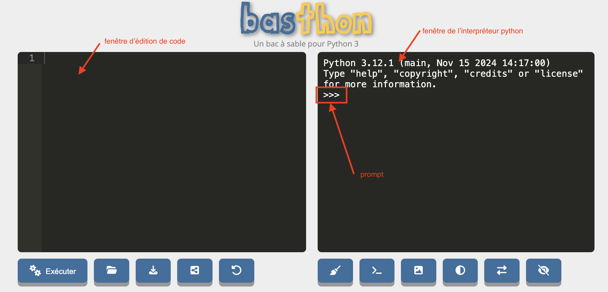

Intéressons nous pour l'instant à la partie de droite nommée la **_console_** :

- l'interpréteur python utilisé est 3.12.1
- le **_prompt_** (les `>>>`) indique que l'on peut écrire une ligne de code

Allons-y ! Exécutons notre premier programme :


A droite du prompt, écrivez le code `print("Bonjour monde !")`{.language-} puis appuyez sur la touche _entrée_.


Vous devriez obtenir quelque chose du type :

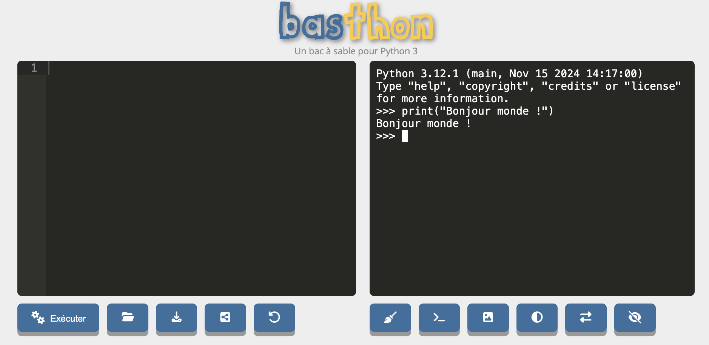


Si vous n'obtenez pas ça, vous pouvez toujours recharger la page (_menu afficher > actualiser cette page_ avec le navigateur chrome) pur recommencer avec un interpréteur vierge.


Le 4 étapes de l'exécution d'un code python de se sont effectuées :

1. on donne une ligne de code à l'interpréteur :
   1. vous avez écrit une ligne de code dans la console
   2. en appuyant sur la touche _entrée_, celle-ci a transmis la ligne à l'interpréteur
2. l'interpréteur à exécuté la ligne de code : elle affiche du texte à l'écran
3. une fois le code exécuté, la console reprend la main (le prompt a réapparu) 
4. on peut recommencer en 1.

Plus précisément, on a ici exécuté la fonction `print`{.language-} de python avec la chaîne de caractères `"Bonjour monde !"`{.language-} en paramètre. On y reviendra plus tard, pour l'instant prenez ceci comme définition d'une fonction : si l'on écrit dans la console de l'interpréteur  l'instruction `print("Bonjour monde !")`{.language-} puis que l'on appuie sur  sur la touche entrée la fonction de nom `print`{.language-} est exécutée avec comme paramètre ce qu'il y a à l'intérieur des parenthèses et produit un résultat : Ici on affiche un texte à l'écran.

L'interpréteur ne n'arrête pas de fonctionner entre deux exécution de code. Vérifions le en commençant par créer une variable contenant ce que l'on veut afficher :

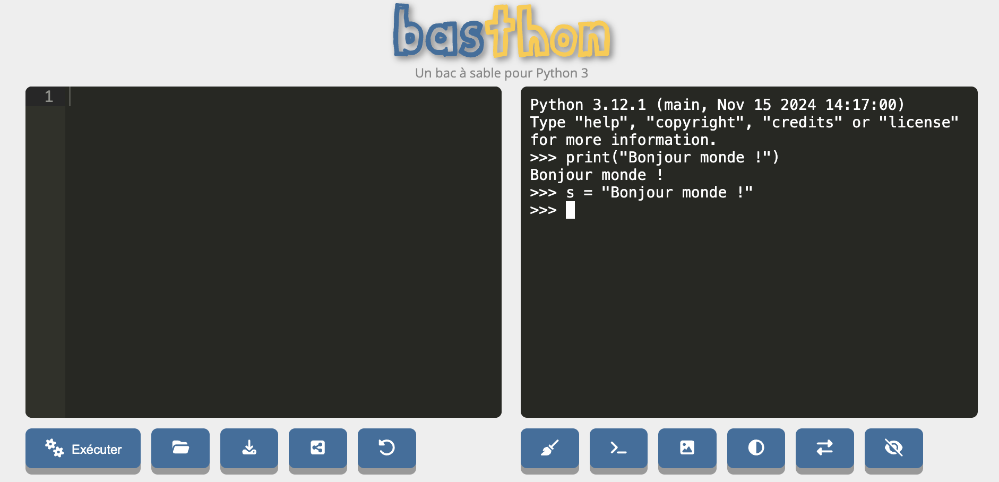

On vient d'affecter une variable (nommée `s`{.language-}) à un objet *chaîne de caractères*. Comme on a rien demandé d'afficher python se contente de revenir au prompt après avoir créé la variable. Affichons-là :

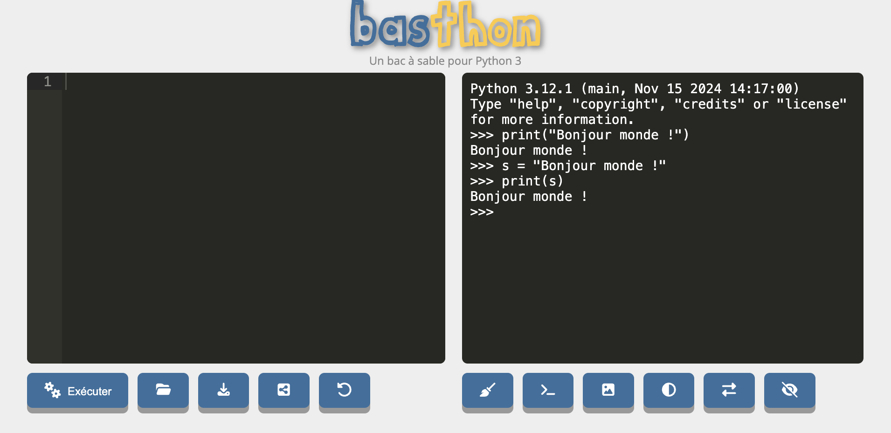

Le paramètre de la fonction `print`{.language-} dans l'exemple précédent était la variable `s`{.language-}. Avant son exécution l'interpréteur à remplacé la variable par l'objet qu'elle référence, ici la chaîne de caractères ` "Bonjour monde !"`{.language-}. Ceci prouve bien que l'interpréteur python n'a pas cessé de fonctionner puisque la variable `s`{.language-} a pu être affichée. 

Si vous rechargez la page, un nouvel interpréteur est crée et il ne connaît plus la variable `s`{.language-} :

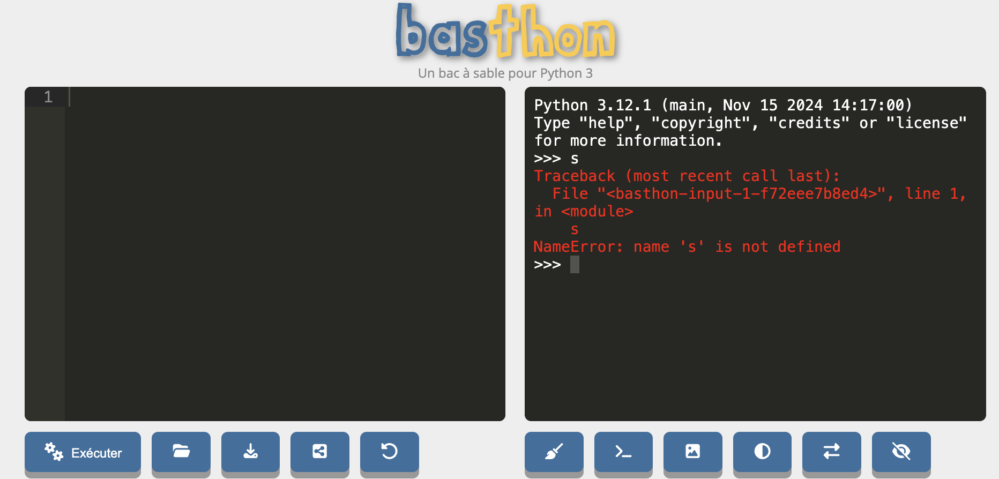

Lorsque python crie du rouge en anglais c'est que quelque chose ne va pas ici : `name 's' is not defined`, la variable `s`{.language-} n'est pas définie dans ce nouvel interpréteur.


Rechargez la page et vérifiez que la variable `s`{.language-} n'existe plus.


Retenez donc le point essentiel :


L'interpréteur python reste présent tout au long de l'exécution des instructions.


On n'est pas obligé de taper une instruction après l'autre, on peut en envoyer une série qui seront exécutées l'une à la suite de l'autre. Avec <https://console.basthon.fr/>, ceci se fait sur la fenêtre de gauche où on peut écrire nos différentes instructions :

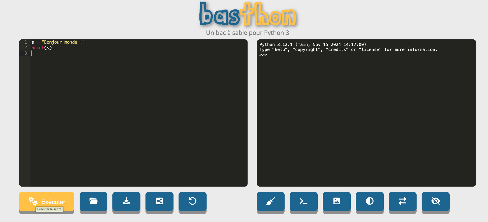

Puis en appuyant sur le bouton exécuter, ces instructions sont envoyées à l'interpréteur : 


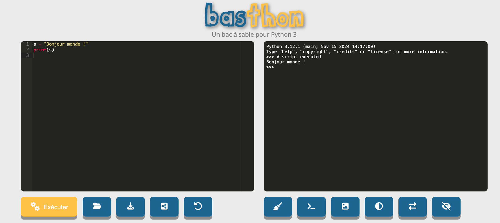

Remarquez que ceci ne change pas fondamentalement le fonctionnement de l'interpréteur, tout se passe comme si on avait tapé les instructions directement dans celui-ci. On peut également retaper des lignes dans l'interpréteur directement ensuite :

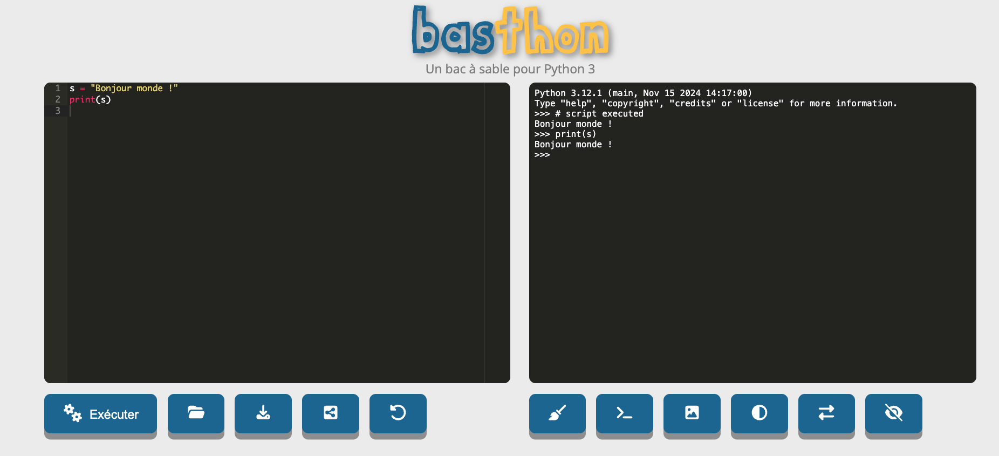

## Spyder

L'utilisation de <https://basthon.fr/> nous permet de voire le fonctionnement d'un interpréteur python mais n'est pas très pratique pour nos tests.  La façon classique d'exécuter du code python est d'utiliser un programme faisant l'intermédiaire entre l'interpréteur et son code. Le plus simple d'entre eux est certainement :


Téléchargez et exécutez le logiciel Spyder qui se trouve à l'adresse suivante :


<https://www.spyder-ide.org/>


Spyder est un éditeur lié à un interpréteur python. L'application est très utilisée lorsque l'on commence à apprendre la programmation. Nous allons utiliser ce logiciel dans cette partie puis, lorsque nous commencerons à progresser, nous changerons de logiciel pour quelque chose de plus utile en développement. Commençons par comprendre  son fonctionnement.


Exécutez le logiciel spyder. Et suivez la visite guidée


Si vous avez fermé la fenêtre de la visite guidée, elle se trouve :

- sous mac : _help > interactive tour_
- sous windows : TBD
- sous linux : TBD


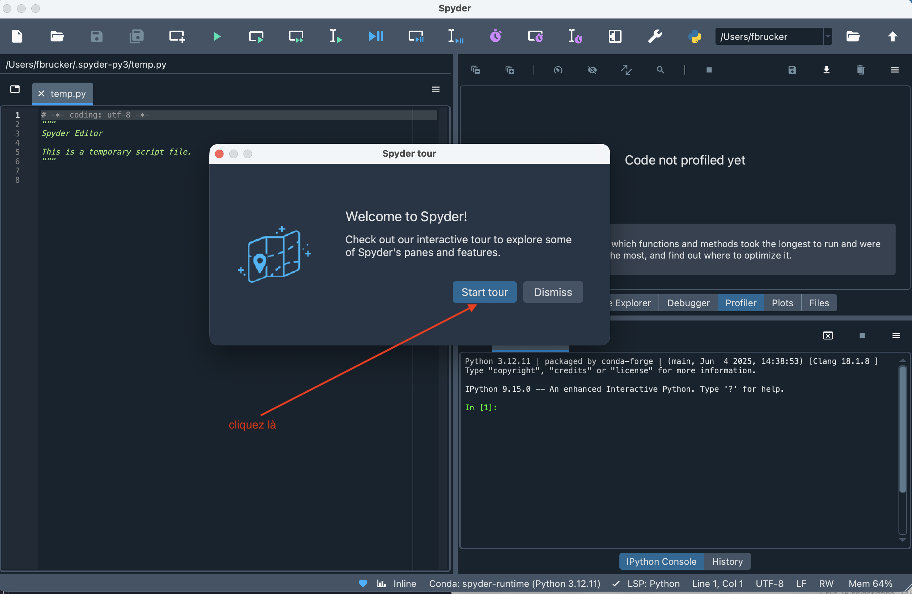

La visite guidée vous a donné les fonctions de différentes fenêtres :

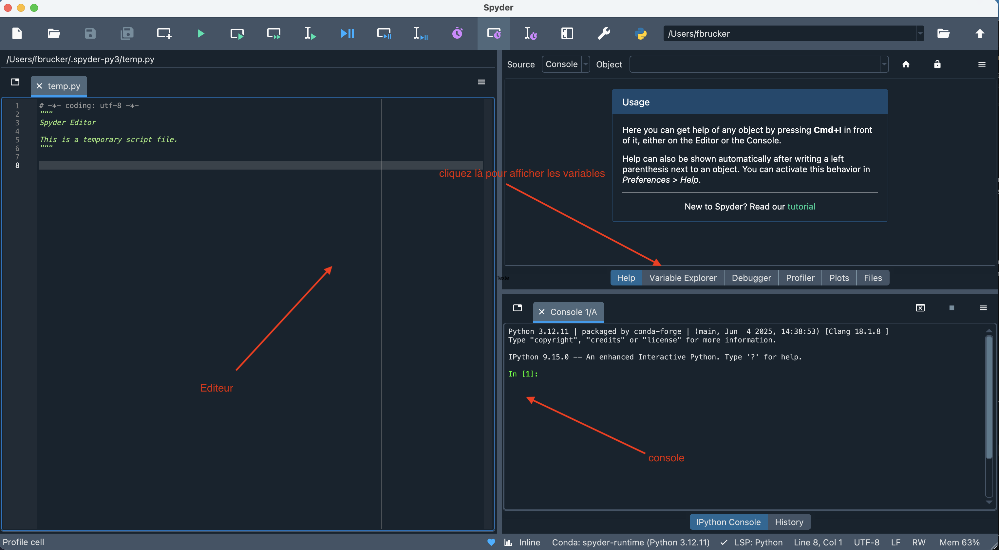

La console est différente de celle de <https://basthon.fr/>, c'est une console [Ipython](https://ipython.org/) qui possède plus de fonctionnalités mais dont le but est identique.


Cliquez sur le bouton _variable explorer_.


Vous devriez vous retrouver dans le schéma suivant :

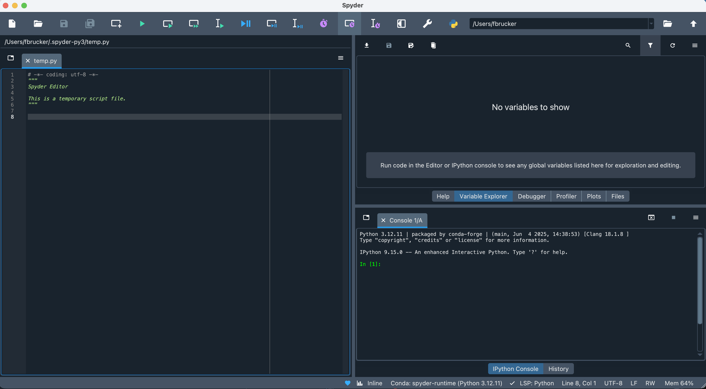


L'éditeur est en fait un fichier (que vous pourrez sauver si vous le voulez) qui commence par :

```python
# -*- coding: utf-8 -*-
"""
Spyder Editor

This is a temporary script file.
"""
```

Supprimez ces lignes elles n'apportent rien.



- les lignes qui commencent par `#` sont des commentaires en python. Ici =on indique que l'encodage du fichier texte est [utf-8](https://fr.wikipedia.org/wiki/UTF-8), qui est le format par défaut de tout fichier texte donc on peut le supprimer c'est une information inutile.
- les entre `"""`{.language-} dans un fichier python font office d'information pur le lecteur. Ici on dit que c'est un fichier temporaire : c'est aussi une information inutile...


Vous devriez vous retrouver dans le schéma suivant, qui va être le départ de tous nos exemples futurs :

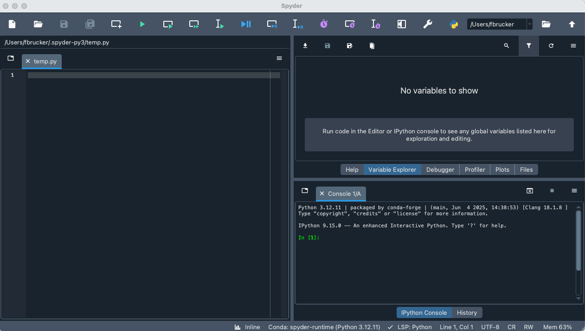

Ceci va nous permettre de reprendre les exemples de la partie précédente :


Tapez la suite d'instructions suivante dans l'éditeur :

```python
s = "Bonjour monde !"
print(s)
```
Puis envoyez le dans la console et cliquant sur le triangle vert dans la barre de menu de la fenêtre.


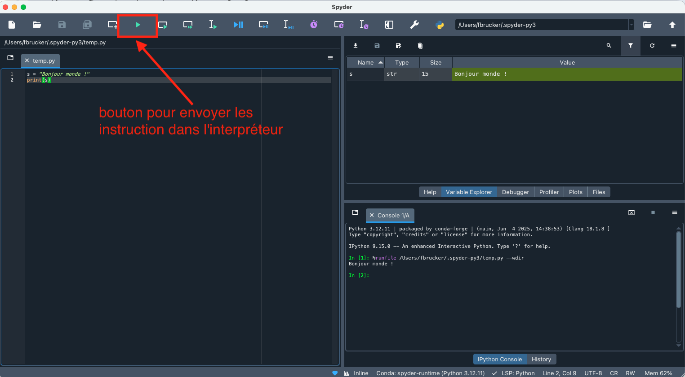

Vous voyez que la fenêtre de variable contient la variable `s`{.language-} qui est une chaîne de caractère s(le type `str`{.language-} de python) et contient `Bonjour monde !`{.language-}.


Dans la console tapez la commande `print(s)`{.language-}




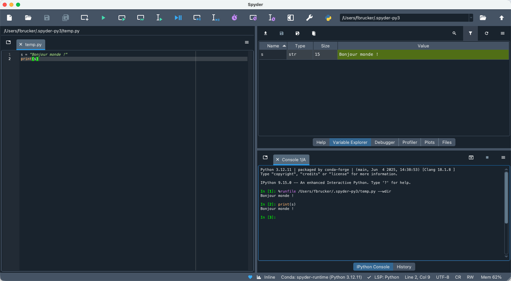


Quittez et relancez spyder. Vous verrez que le fichier d'instructions est là mais l'interpréteur est vierge (la variable `s`{.language-} n'existe pas) car le fichier n'a pas été exécuté.

1. vérifiez que la variable `s`{.language-} n'existe pas
2. exécutez les instructions du fichier
3. vérifiez que la variable `s`{.language-} existe.




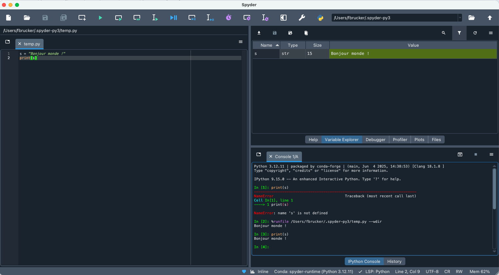

