<!-- TBD 

- mettre les paramètres entre <> et pas avec des _
- faire une définition sur cette convention.

-->

On va lister les concepts fondamentaux qui permettent d'écrire du code python que l'on pourra faire exécuter par l'interpréteur python. Ces concepts sont identiques pour tous (ou quasi tous) les langages de programmation objet.


Dans tous les exemples de code qui suivront, lorsque la ligne de code commencera par `>>>`{.language-} cela signifiera que l'on  a exécuté ce code directement dans l'interpréteur, la ligne suivante montrera le résultat. Par exemple :

```python
>>> 21 * 2
42
```

Si l'on veut passer par l'éditeur on écrira du code de cette façon :


```python
x = 21 * 2
print(x)
```

Il faudra ensuite l'exécuter pour voir son résultat.



Dans tous **les instructions** de code qui suivront (pas les résultats donnés par python), lorsqu'un texte est entre `<>`{.language-} cela signifiera que c'est un paramètre variable, ce qu'on peut y mettre étant décrit entre les `<>`{.language-}. Par exemple : `<un entier>`{.language-} fonctionnera en le remplaçant par un entier quelconque.



- Dans Spyder, la console est une console Ipython, elle ne commence donc pas par `>>>` mais par `In` suivi d'un numéro entre crochet, par exemple : `In [42]`. Son fonctionnement est cependant identique.
- pour exécuter du code avec spyder, on utilise soit :
  - le triangle vert sur l'interface
  - le menu _run > run_
  - F5



Testez tous les exemples qui suivent dans un spyder, soit directement dans la console soit via l'éditeur.



## Commentaires


<https://docs.python.org/fr/3/reference/lexical_analysis.html#comments>


Commençons par ne **pas** écrire du python. Dans une ligne de code python, tout ce qui suit un `#`{.language-} n'est pas lu.

Par exemple, le code suivant écrit dans une console ne produit pas d'erreur (il n'est même pas lu...) :

```python
>>> # coucou python !
```

Alors que le même code sans `#`{.language-} est interprété par python et comme ce n'est pas du python cela produit une erreur :

```python
>>> coucou python !
  File "<stdin>", line 1
    coucou python !
           ^
SyntaxError: invalid syntax
```

## Objets


<https://docs.python.org/fr/3/library/stdtypes.html#built-in-types>


Les **_objets_** de python correspondent à tout ce qui est manipulé : le but d'un programme python est de créer et de rendre des objets.

 ### Types d'objets

Python connaît 6 types d'objets de base qui permettent de faire la grande majorité des programmes.

- **_Chaînes de caractères_**
  - exemple : `"python"`{.language-} ou `'python'`{.language-}
  - quelque chose qui commence et fini par `"`{.language-} ou qui commence et fini par `'`{.language-} ou encore qui commence et fini par `"""`{.language-}.
- **_Réels_**
  - exemple : `2.91`{.language-} ou `2.0`{.language-}
  - un nombre avec une décimale (qui peut être nulle) notée par un `.`{.language-}
- **_Entiers_**
  - exemple : `42`{.language-} ou `0`{.language-}
  - un nombre sans décimale
- **_Complexes_** (la notation utilise j à la place de i)
  - exemple : `3+2j`{.language-}, `1j`{.language-}
  - un réel ou entier avec une partie imaginaire, notée `j`{.language-}, entière ou imaginaire.
- **_Booléens_**
  - exemple : `True`{.language-} ou `False`{.language-}
  - que 2 possibilités, `True`{.language-} ou `False`{.language-}
- **_le vide_**, utilisé pour noter l'absence de valeur
  - ne contient qu'un unique élément noté `None`{.language-}


Tout objet de python possède un type.


Pour connaître le type d'un objet, on peut utiliser la fonction `type`{.language-}. Par exemple :

```python
>>> type(42)
<class 'int'>
```

Les entiers sont donc de type ` class 'int'`{.language-}, ce que l'on traduit par : l'entier 42 est objet de la classe entier :


Chaque objet de python possède un unique type. Ce type est très souvent une classe :
**Dans le cadre de ce cours on considérera que type et classe sont deux synonymes**


À vous :


Quelle est la classe de chaque objet de base ?




```python
>>> type("2")
<class 'str'>
>>> type(2.0)
<class 'float'>
>>> type(2)
<class 'int'>
>>> type(2+0j)
<class 'complex'>
>>> type(True)
<class 'bool'>
```




### Conversion de type

Le type d'un objet n'est pas modifiable : par exemple un entier (3) n'est pas un réel (3.0) et réciproquement. Il est en revanche possible de créer un nouvel objet du type choisi à partir d'un objet d'un autre type. Pr exemple pour créer un objet te type réel depuis un entier 3, on peut écrire : `float(3)`{.language-}. Ceci se généralise :


Créer un objet de type `<un type>`{.language-} à partir d'un objet `<un objet>`{.language-} s'écrit :

```txt
<un type>(<un objet>)
```



On ne peut bien sur pas faire n'importe quoi `int("deux")`{.language-} ne crée pas un entier valant 2, mais beaucoup des choses sont possibles.

### Conversion entre réels, entiers et chaînes de caractères

On peut par exemple transformer un réel en entier :


Quel est le résultat de l'instruction suivante :

```python
int(3.1415)
```



```python
>>> int(3.1415)
3
```

C'est un entier valant 3.



Ou en entier en réel :


Quel est le résultat de l'instruction suivante :

```python
float(3)
```



```python
>>> float(3)
3.0
```

C'est un réel valant 3.0



On peut aussi transformer une chaîne de caractères en entier ou en réel. Par exemple :

```python
float("3.1415")
```

Va rendre un objet réel valant 3.1415 à partir d'une chaîne de caractère avec le caractère "3.1415".


Une chaîne de caractère n'est **pas** un réel ou un entier.


La conversion de chaînes de caractères en entier ou en réel est très courante lorsque l'on récupère des entrées tapées par un utilisateur. jen effet :

Une entrée donnée par un utilisateur est **toujours** une chaîne de caractères.


### <span id="conversion-bool"></span>Conversion de booléens

On effectue souvent ce genre d'opération de façon implicite pour les booléens. Ainsi, un entier est vrai s'il est non nul.


Vérifiez qu'un entier non nul est Vrai.



```python
>>> bool(42)
True
>>> bool(0)
False

>>> bool(-42)
True
```



Tous les objets peuvent être converti sen booléen.


Quand-est qu'une chaîne de caractère est fausse ?




Une chaîne de caractère est fausse si elle est vide et vraie sinon.

```python
>>> bool("")
False
>>> bool("False")
True
```



On peut aussi faire le contraire :


Que vaut la conversion de booléens en entier ?




Une chaîne de caractère est fausse si elle est vide et vraie sinon.

```python
>>> int(True)
1
>>> int(False)
0
```



## Variables


Une **_variable_** est un nom qui représente un objet : une variable n'est **pas** un objet, c'est un moyen d'y accéder.
 


Les variables permettent à l'interpréteur de se rappeler d'objets qu'il a crée lors d'exécutions précédentes. Sans elles, on ne pourrait exécuter que des lignes indépendantes les unes entre elles : bref, on ne pourrait rien faire d'intéressant.


### Affecter une variable



Une variable est un **_nom_** auquel est associé un objet. Pour associer un nom à un objet on utilise **_l’opérateur d’affectation_** `=`{.language-} :

```txt
<un nom> = <un objet>
```

À l'issue de l'affectation, la variable à gauche du signe `=` représentera l'objet à droite de celui-ci.


A gauche de l’opérateur d'affection `=`{.language-} se trouve une **variable** (en gros, un nom ne pouvant commencer par un nombre) et à droite un **objet**. Après affectation, dans toute la suite du programme l'interpréteur python  remplacera la variable par l'objet à chaque fois qu'elle la rencontrera.


Une variable n'est **PAS** une chaîne de caractères. Une chaîne de caractère est un objet alors qu’un nom n’est qu’un _alias_ vers un objet.


Il est important de comprendre que l’opérateur d’affectation `=`{.language-} n’est pas symétrique. À gauche, des variables et à droite, des objets.

Attardons nous un moment sur le processus d'affectation car il est seront crucial pour appréhender les possibilités offertes par les objets.

Considérons le programme suivant :

```python/
x = 1
y = 1
y = 3
```

Et regardons ce qu'il se passe au niveaux des variables et des objets après chaque instruction.

Au départ, avant l'exécution par l'interpréteur de la première ligne le programme ne possède aucune variable ni aucun objet. On possède cependant deux espaces **_distincts_** pour les accueillir :

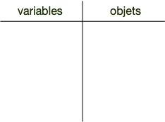

Après l'exécution de la ligne 1, nous sommes dans la situation suivante :

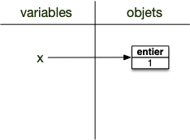

La variable de nom `x` est affectée à un objet entier valant 1. Notez bien que la variable et l'objet sont deux choses différentes et sont uniquement mis en relation par la flèche. De plus :


On ne peut accéder à un objet en python que via une variable qui lui est affectée.


L'exécution de la deuxième instruction procède de la même manière, à l'issue de celle-ci on se trouve dans l'état suivant :

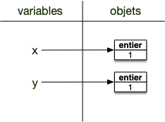

Notez bien que les objets mis en relations ne sont pas les mêmes, ce sont deux objets de type entier valant 1.

L'instruction de la ligne 3 est identique aux deux précédentes : on associe un objet à une variable. Que cette variables était précédemment **n'a pas d'importance** : on l'associe à l'objet à droite de l'opérateur d'affectation `=` :

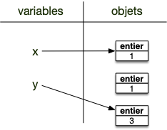

L'objet précédemment assigné à `y` n'est plus associé à aucune variable : il n'y a plus aucun moyen d'y acceder. Ces objets non assignés sont supprimés à intervalles réguliers (c’est ce qu’on appelle [le garbage collector](https://towardsdatascience.com/memory-management-and-garbage-collection-in-python-c1cb51d1612c)).

Le même mécanisme est à l'oeuvre si on a une variable à droite de l'opérateur d'affectation `=`. Considérons le programme suivant :

```python/
x = 1
y = 1
y = x
```

L'instruction de la ligne 3 commence par trouver l'objet à droite de l'opérateur d'affectation `=` _via_ la variable : **c'est l'objet et non la variable** qui est associé. Une fois l'objet trouvé, il est assigné à la variable à gauche de l'opérateur d'assignation `=` :

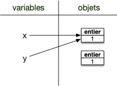


Le mécanisme d'affectation procède en 2 temps :

1. on cherche l'objet associé à droite de `=`
2. on affecte l'objet trouvé à la variable à gauche de `=`



Pour exécuter une instruction, on commence **toujours** par remplacer les variables par les objets qu'elles référencent.

Ce mécanisme d'affectation est puissant, il permet par exemple d'affecter plusieurs variables en même temps, comme le montre l’exemple suivant qui échange les objets des noms `i`{.language-} et `j`{.language-} :

```python/
x = 2
y = 3
x, y = y, x
```


A quels objets sont liés les variables $i$ et $j$ après la ligne 3 de l'exemple précédent ? Comment python procède-t-il pour exécuter cette ligne ?



1. on commence par chercher les objets à droite du `=`
2. on les affecte aux variables.

Rappelez vous que la variable existe ou pas au moment de l'affectation n'a pas d'importance.

Avant l'exécution de la ligne 3 :

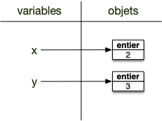

Après l'exécution de la ligne 3 :

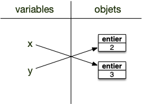



Enfin, il est possible d'affecter plusieurs noms à un même objet. Par exemple l'exemple suivant affecte le même entier 1 aux noms `x`{.language-} et `y`{.language-} :

```python
x = y = 1
```

### Supprimer une variable

On peut supprimer un nom en utilisant le mot clé `del`{.language-}.

Dans une console :

```python
>>> x = 2
>>> print(x)
2
>>> del x
>>> print(x)
Traceback (most recent call last):
  File "<stdin>", line 1, in <module>
NameError: name 'x' is not defined
```

Notez bien que seule la variable est supprimée, pas l'objet associé. Considérons par exemple le code suivant, qui affecte le même objet aux variables `x`{.language-} et `y`{.language-} :

```python
>>> x = 1
>>> y = x
```

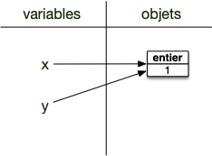

Si on supprime la variable `x`{.language-} cela ne supprime pas l'objet (il est aussi affecté à la variable `y`{.language-}) :

```python
>>> del x
>>> y
1
```

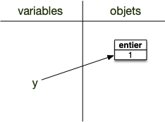

L'objet est toujours associé au nom `y`{.language-}. Supprimons ce nom :

```python
>>> del y
```

L'objet n'est plus accessible !

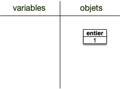

<span id="ramasse-miettes"></span>
Python utilise un mécanisme nommé [ramasse-miettes](https://fr.wikipedia.org/wiki/Ramasse-miettes_(informatique)) qui supprime les objets qui ne sont plus accessible via des noms, ce qui permet de gagner de la place mémoire. Une fois le ramasse-miettes passé on se retrouve alors dans l'état :

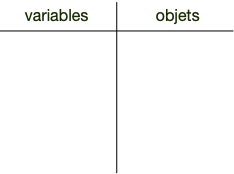


Les objets n'existent que tant qu'on pense à eux (qu'on peut les nommer).


À vous (certains exercices sont liés : utilisez toujours le même interpréteur) :


Affectez la valeur 3 à la variable `a`{.language-}, puis affichez à l'écran la valeur associée à la variable `a`{.language-}.



```python
>>> a=3
>>> print(a)
3
```



Affectez la _nouvelle_ valeur 6 à la variable `a`{.language-}, puis affichez à l'écran la valeur associée à la variable `a`{.language-}.



```python
>>> a=6
>>> print(a)
6
```



Affectez la valeur 2 à la variable `A`{.language-}, puis affichez à l'écran la valeur associée aux variables `a`{.language-} et `A`{.language-}.



```python
>>> A = 2
>>> print(a)
6
>>> print(A)
2
```

Les variables sont [sensibles à la casse](https://fr.wikipedia.org/wiki/Sensibilit%C3%A9_%C3%A0_la_casse) : a est différent de A.




Affectez la valeur 4 à la variable `b`{.language-}, puis affectez le résultat de la somme des variables `a`{.language-} et `b`{.language-} à variable `c`{.language-}




```python
>>> b = 4
>>> c = (a + b)/2
>>> print(b)
4
>>> print(c)
5.0
```

`c`{.language} est un réel.




Affectez en une ligne les valeurs 3 et 12 respectivement aux variables `j`{.language-} et `k`{.language-}




```python
>>> i, j = 3, 12
```




Affectez en une ligne la valeur 3 aux variables `x`{.language-}, `y`{.language-} et `z`{.language-}.




```python
>>> x = y = z = 3
```



## Opérations sur les objets

Créer de nouveaux objets avec d'autres objets. Les opérations sur les objets vont des opérations arithmétiques (a + b, a - b, ...) aux tests (a < b) en passant par les opérations logiques (a et b).

### Nombres

Les opérations peuvent s'effectuer sur les trois types numériques que sont les entier (classe `int`{.language-}), les réels (classe `float`{.language-}) et les complexes (classe `complex`{.language-})

#### <span id="opérateurs"></span>Opérateurs

Outre les classiques opérations :

- `+`{.language-} (addition)
- `-`{.language-} (soustraction)
- `/`{.language-} (division)
- `*`{.language-} (multiplication)

python possède aussi :

- `//`{.language-} division entière
- `%`{.language-} reste de la division entière
- `**`{.language-} exposant.


Que vaut le quotient et le reste de la division entière de 4538 par 23 ?



```python
>>> 4538 // 23
197
>>> 4538 % 23
7
>>> (4538 // 23) * 23 + 7
4538
```



#### Raccourcis d'affectation

Python permet aussi de faire l'opération et de procéder immédiatement à sa réaffectation avec les opérateurs :

- `x += 1`{.language-} est équivalent à `x = x + 1`{.language-}
- `x -= 1`{.language-} est équivalent à `x = x - 1`{.language-}
- `x /= 3`{.language-} est équivalent à `x = x / 3`{.language-}
- `x *= 2`{.language-} est équivalent à `x = x * 2`{.language-}

### Chaînes de caractères

Trois opérateur sont courants pour les chaînes de caractères :

- la concaténation avec l'opérateur `+`{.language-}
- la multiplication avec l'opérateur `*`{.language-}
- test de présence avec l'opérateur `in`{.language-}

#### <span id="opérateurs-str"></span>Concatenation et multiplication

Les chaînes de caractères possèdent 2 opérateurs :

- l'addition qui concatène deux chaînes
- la multiplication d'un entier $i$ par une chaîne $c$ qui concatène $i$ fois $c$ à elle même.

Par exemple :

```python
>>> "x" + "y"
'xy'
>>> 3 * "x"
'xxx'
```


Recopiez 10 fois : `"j'aime bien faire du python"`{.language-} en une ligne de python


On peut écrire :

```python
>>> 10 * "J'aime bien faire du python. "
"J'aime bien faire du python. J'aime bien faire du python. J'aime bien faire du python. J'aime bien faire du python. J'aime bien faire du python. J'aime bien faire du python. J'aime bien faire du python. J'aime bien faire du python. J'aime bien faire du python. J'aime bien faire du python. "

```




Affectez la chaîne de caractères `"j'aime bien faire du"`{.language-} à la variable `x`{.language-}. Puis ajoutez `" python"`{.language-} à `x`{.language-} en une ligne de python


On peut écrire :

```python
>>> x = "J'aime bien faire du"
>>> x += " python."
>>> print(x)
J'aime bien faire du python.
```




#### <span id="chaines-in"></span> Test de présence

Une chaîne de caractère peut être vue comme un conteneur (ordonné) de caractères. Savoir si un caractère ou une sous-chaîne est présent dans une chaîne peut se faire alors avec l'opérateur `in`{.language-}, qui rend un booléen :

- `"c" in "coucou"`{.language-} rendra `True`
- `"cou" in "coucou"`{.language-} rendra `True`
- `"cc" in "coucou"`{.language-} rendra `False`

### Booléens

#### Comparaisons

Comparateurs classiques :

- `<`{.language-} : strictement plus petit
- `<=`{.language-} : plus petit ou égal
- `>`{.language-} : strictement plus grand
- `>=`{.language-} : plus grand ou égal
- `==`{.language-} : égal
- `!=`{.language-} : différent
- `is`{.language-} : égalité d'objets (en pratique uniquement utilisé pour comparer à `None`)

Les comparaisons rendent un booléen. Par exemple : `2 <= 3`{.language-} rend le booléen `True`{.language-}.

#### Opérations logiques

- `not`{.language-} : négation
- `or`{.language-} : ou logique
- `and`{.language-} : et logique

Notez que les opérateurs logiques s'appliquent à tous les objets, python va comparer leurs représentations sous la forme de booléen. Par exemple
`not 2`{.language-} va rendre `True`{.language-} (l'entier 2 est `True`{.language-} représenté comme un booléen).

De même, les opérateurs `or`{.language-} et `and`{.language-} vont rendre des objets comparé, dont les représentation binaires correspondent aux opérateurs logiques :

- `x or y`{.language-} rendra :
  - `x`{.language} si la représentation sous la forme d'un booléen de de `x`{.language-} est `True`{.language}
  - `y`{.language} si la représentation sous la forme d'un booléen de de `x`{.language-} est `False`{.language}
- `x and y`{.language-} rendra :
  - `y`{.language} si la représentation sous la forme d'un booléen de de `x`{.language-} est `True`{.language}
  - `x`{.language} si la représentation sous la forme d'un booléen de de `x`{.language-} est `False`{.language}

Cela ne change rien à l'utilisation classique des opérations logiques puisque la représentation sous forme de booléen de l'objet rendu est conforme à ce qu'on attend :

- `True`{.language-} si un des deux paramètres est considéré comme vrai pour `or`{.language-}, `False`{.language-} sinon.
- `True`{.language-} si un des les deux paramètres sont considérés comme vrai pour `and`{.language-}, `False`{.language-} sinon.

<span id="and-or-trick"></span>

Python a choisi cette façon de faire pour permettre des notations abrégées comme :

- `(x > 0) and log(x)`{.language-} qui rendra soit `False`{.language-} si `x <= 0`{.language-} soit `log(x)`{.language-} sinon.
- `((x > 0) and log(x)) or None`{.language-} qui rendra soit `None`{.language-} si `x <= 0`{.language-} soit `log(x)`{.language-} sinon



### Immutabilité des objets

Notez que tous les objets basique de python sont **_non modifiables_**. Ainsi, si `x = 41`{.language_}, on est dans la situation suivante :

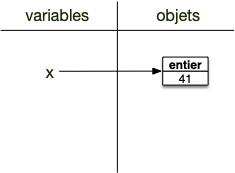

En incrémentant `x`{.language-} :

```python
x = x + 1
```

On crée un nouvel objet (un entier valant 42) et l'ancien objet qui n'est plus accessible va disparaître sous l'action du [ramasse-miettes](../variables/#ramasse-miettes){.interne} :

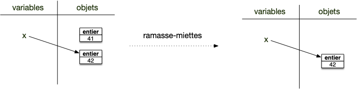



Les  objets basiques de python sont dit **_immutables_** : ils ne peuvent être modifiées après leurs créations. La notion de mutabilité est cruciale dans les langages objets, nous reviendrons souvent sur cette notion qui peut mordre très fort si on ne la comprend pas bien. 

Pour l'instant tout est ok puisque nous n'avons qu'une sorte d'objets et qu'ils sont immutables.


## Fonctions

Une fonction est un type d'objet pouvant être exécuté. Par exemple la fonction `print`{.language-}.

C'est un objet :

```python
>>> type(print)
<class 'builtin_function_or_method'>
```


On **_exécute_** l'objet en faisant suivre son nom de parenthèses :

```txt
<nom de la fonction>()
```



Par exemple :
```python
>>> print()

>>> 
```

Va exécuter la fonction `print`{.language-} de python qui affiche à l'écran le caractère [retour à la ligne](https://fr.wikipedia.org/wiki/Retour_chariot) ce qui a pour effet d'aller à la ligne.


De nombreuses fonctions peuvent être exécutées avec des **_paramètres_** qui sont placées les un à la suite des autres entre les parenthèses et séparés par des virgules :

```txt
<nom de la fonction>(<paramètre 1>, <paramètre 2>, ..., <paramètre n>)
```



Prenons par exemple la fonction print de python :

```python
>>> print("coucou", "les gens", "!")
coucou les gens !
```

L'exécution de la fonction `print`{.language-} avec les trois paramètres `"coucou"`{.language-}, `"les gens"`{.language-} et `"!"`{.language-} affichera à l'écran les 3 paramètres espacé d'un caractère (séparé par un caractère espace " ") puis ira à la ligne.

Toutes les fonctions de python sont documentées. On peut y accéder :

- via le site de python. L'aide de la fonction `print`{.language-} est là : <https://docs.python.org/fr/3/library/functions.html#print>
- en console en utilisant la fonction `help`{.language-} : `help(print)`{.language-} donne l'aide de `print`{.language-}


Affichez l'aide de la fonction print dans la console.



```python
>>> help(print)
Help on built-in function print in module builtins:

print(...)
    print(value, ..., sep=' ', end='\n', file=sys.stdout, flush=False)

    Prints the values to a stream, or to sys.stdout by default.
    Optional keyword arguments:
    file:  a file-like object (stream); defaults to the current sys.stdout.
    sep:   string inserted between values, default a space.
    end:   string appended after the last value, default a newline.
    flush: whether to forcibly flush the stream.

```

Si votre fenêtre est trop petite, l'affichage peut être différent.



Les fonctions sont des objets pouvant être exécutés, c'est à dire que faire suivre l'objet de parenthèses va effectuer une action. Tout comme pour les variables, le nom de la fonction n'est qu'un moyen d'y accéder. On peut par exemple tout à fait écrire :

```python
>>> écrire = print
>>> écrire("coucou")
coucou
>>>
```

### Retour de fonction


L'exécution de toute fonction va retourner un objet. 



Le retour de l'exécution est un objet qui peut être stockée dans une variable via une affectation :

```txt
<nom de variable> = <nom de la fonction>(<paramètre 1>, <paramètre 2>, ..., <paramètre n>)
```



C'est parfois utile (comme [abs](https://docs.python.org/3/library/functions.html#abs)) :

```python
>>> x = abs(-10)
>>> print(x)
10
```

Parfois inutile (comme avec la fonction `print`{.language-}) et dans ce cas là on a coutume de renvoyer l'objet vide, `None`{.language-} :

```python
>>> x = print("coucou")
coucou
>>> print(x)
None
```

Notez bien que l'exécution de la fonction `print`{.language-} qui affiche quelque chose à l'écran (ici `coucou`{.language-}) est différent de son résultat (ici `None`{.language-})

Enfin, comme ici on exécute notre code directement dans l'interpréteur python, le résultat de chaque fonction est également affiché à l'écran, sauf :

- si l'instruction est une affectation (c'est pour ça que l'interpréteur n'affiche pas `-10`{.language-} après l'instruction `x = abs(-10)`{.language-} alors qu'il l'affiche après l'instruction `abs(-10)`{.language-})
- si le résultat est `None`{.language-} (c'est pour ça que l'interpréteur n'affiche rien après l'instruction `None`{.language-} ni après après avoir affiché `coucou`{.language-} après l'exécution de la fonction `print("coucou")`{.language-})

### <span id="paramètres"></span> Paramètres d'une fonction


Savoir lire la documentation d'une fonction est très important. Cela fait gagner un temps fou de pouvoir utiliser à bon escient tous les paramètres d'une fonction.


En regardant [la documentation de la fonction `print`{.language-}](https://docs.python.org/fr/3/library/functions.html#print), on remarque que les premiers paramètres sont sans noms (value, ...) puis les paramètres ont des noms (`sep`{.language-}, `end`{.language-}, `file`{.language-}, `flush`{.language-}) suivi d'une valeur. Ce sont des paramètres qui ont une valeur par défaut (par défaut `sep` vaut `" "`{.language-}).


Les paramètres sans valeurs par défaut sont **obligatoires** lorsque l'on appelle une fonction, les paramètres ayant une valeur par défaut sont **optionnels**.


On cependant bien sur utiliser, en le nommant, un paramètre ayant une valeur par défaut :

```python
>>> print("coucou", "les gens", "!", sep="***")
coucou***les gens***!
```


Les paramètres d'une fonctions doivent être mis dans cet ordre :

1. **tous** les paramètres sans valeurs par défaut dans l'ordre de la définition
2. **puis** les paramètres optionnels utilisés sans nom, dans l'ordre de leurs définitions
3. **puis** les paramètres optionnels utilisés avec leur nom (`nom=valeur`{.language-}) que l'on peut les mettre dans n'importe quel ordre.



La fonction print n'a pas de nombre déterminé de paramètres sans valeurs par défaut (il y a un `...`), la règle 2 ne s'applique donc pas pour print.


Expérimentons ça sur un exercice.


La classe `int`{.language-} a pour définition `int(x, base=10)`{.language-} si `x`{.language-} est une chaîne de caractère.

Peut-on écrire :

1. `int("12")`{.language-} ?
2. `int(base=2)`{.language-} ?
3. `int("12", base=8)`{.language-} ?
4. `int("12", 8)`{.language-} ?
5. `int(base=8, "12")`{.language-} ?




1. oui
2. non, la règle 1 n'est pas satisfaite
3. oui
4. oui
5. non, la règle 2 (et 1) n'est pas satisfaite



### Nom d'une classe comme fonction

`int`{.language-}, `float`{.language-}, `complex`{.language-}, `str`{.language-} et `bool`{.language-} permettent de créer des objets du nom du type. Ces classes peuvent être exécutées.


En python les fonctions ne sont pas les seules objets pouvant être exécuté. En particulier l'exécution d'une classe permet de créer des objets de ce type.


On a déjà vu cette possibilité dans la partie [objets types et types d'objets](../objets-types){.interne}, c'est très utile pour changer un objet de classe. Mais utilisons ce qu'on a vu maintenant pour aller plus loin :


En utilisant [`int()`{.language-}](https://docs.python.org/fr/3/library/functions.html#int) qui crée des entiers, trouvez la représentation décimale du nombre binaire : 1001100011



On utilise le paramètre base de la classe `int`{.language-} :

```python
>>> int("1001100011", base=2)
611
```



Allez, un dernier pour la route :


En utilisant le fait que la fonction `len(chaîne_de_caractères)`{.language-} donne le nombre de caractères de la chaîne (par exemple `len("abc")`{.language-} rend `3`{.language-}), et que l'exposant eb python s'écrit `**`{.language-} (par exemple `2**8`{.language-} rend `256`{.language-}) donnez le nombre de chiffre du 23ème [nombre de Mersenne premier](https://fr.wikipedia.org/wiki/Nombre_de_Mersenne_premier).



```python
>>> len(str(2 ** 11213 - 1))
3376
```



### Fonctions usuelles


<https://docs.python.org/fr/3/library/functions.html>


Certaines sont plus utiles que d'autres. Nous allons en citer certaines, parmi les plus utilisées.

#### <span id="print"></span> Fonction `print`{.language-}


<https://docs.python.org/fr/3/library/functions.html#print>


Affiche à l'écran ses paramètres.

#### Fonction `type`{.language-}


<https://docs.python.org/fr/3/library/functions.html#type>


Donne le type d'un objet.


On l'a utilisée dans la partie [objets types et types d'objets](../objets-types){.interne}.


#### <span id="len"></span> Fonction `len`{.language-}


<https://docs.python.org/fr/3/library/functions.html#len>


Rend le nombre d'éléments d'une chaîne de caractères (et plus généralement d'[un conteneur](../../conteneurs){.interne} que l'on verra plus tard).


Quel est le nombre de caractères du mot "anticonstitutionnellement" ?



```python
>>> len("anticonstitutionnellement")
25
```



#### <span id="input"></span> Fonction `input`{.language-}


<https://docs.python.org/fr/3/library/functions.html#input>


Permet de demander une chaîne de caractère à un utilisateur. Par exemple :

```python
>>> x = input()
23
>>> x
'23'
```

On demande à l'utilisateur de taper quelque chose puis d'appuyer sur la touche entrée. Ce qu'à taper l'utilisateur est rendu sous la forme d'une **chaîne de caractère**.


Tout ce qui vient de l'utilisateur est une **chaîne de caractère**. Si l'on veut que ce soit un nombre par exemple, il faut le convertir. Comme par exemple : `i = int(input())`{.language-} qui converti en entier le résultat de la fonction `input`{.language-}.


## <span id="méthodes"></span> Méthodes

Les méthodes sont un autre moyen d'agir sur un objet :


```python
<retour de la méthode> = <un objet>.<nom de la méthode>(<paramètre 1>, <paramètre 2>, ..., <paramètre n>)
```

On applique `<nom de la méthode>`{.language-} (dit méthode appelée) à `<un objet>`{.language-} (dit objet appelant)  en utilisant les paramètres de la méthode. Comme une fonction, on peut récupérer son résultat si nécessaire via une affectation.




Une méthode ne s'utilise **jamais** seule. Elle s'applique à ce qu'il y a à gauche d'elle.


Prenez le temps de regarder les différentes méthodes des classes de base de python. Souvent elle vous permettent de faire rapidement une opération compliquée. C'est en particulier vrai pour les chaînes de caractères et les listes.


Certaines méthodes vont rendre des objets utiles (comme les méthodes de chaîne de caractères), d'autre vont modifier les objets appelants et leur retour sera `None`{.language-} (comme beaucoup de méthodes de liste que l'on verra bientôt).

### Exemple : méthodes des chaînes de caractères

Chaque classe vient avec ses méthodes. Si les nombres et les booléens ont peu de méthodes, les chaines de caractères par exemple en ont [tout un tas](https://docs.python.org/fr/3/library/stdtypes.html#string-methods).

Essayons de les apprendre avec ces petits exercices :


Transformez le 23ème [nombre de Mersenne](https://fr.wikipedia.org/wiki/Nombre_de_Mersenne_premier) en une chaîne de caractère



```python
>>> x = str(2 ** 11213 - 1)
```




En utilisant la méthode [`count`{.language-}](https://docs.python.org/fr/3/library/stdtypes.html#str.count), comptez le nombre de 0 du 23ème [nombre de Mersenne premier](https://fr.wikipedia.org/wiki/Nombre_de_Mersenne_premier).



Dans un interpréteur :

```python
>>> x.count("0")
348
```




En utilisant la méthode [`replace`{.language-}](https://docs.python.org/fr/3/library/stdtypes.html#str.replace), changez les 2 en 7 dans le 23ème [nombre de Mersenne premier](https://fr.wikipedia.org/wiki/Nombre_de_Mersenne_premier).



Dans un interpréteur :

```python
>>> y = int(x.replace("2", "7"))
```




Avec le mot "choucroute garnie" et les méthodes [`count`{.language-}](https://docs.python.org/fr/3/library/stdtypes.html#str.count), [`index`{.language-}](https://docs.python.org/fr/3/library/stdtypes.html#str.index) et [`rindex`{.language-}](https://docs.python.org/fr/3/library/stdtypes.html#str.rindex) :

- combien y a-t-il de "ou" ?
- quel est l'indice du premier "e" ?
- quel est l'indice du dernier "e" ?




```python
>>> mot.count("ou")
2
>>> mot.index("e")
9
>>> mot.rindex("e")
16
```



On peut chaîner les méthodes, la sortie d'une méthode devenant l'entrée de la prochaine. Par exemple, avec 2 méthodes :

```txt
<un objet>.<nom de la méthode 1>().<nom de la méthode 2>()
```

Signifie que `<nom de la méthode 2>`{.language-} est appliquée à l'objet rendu par l'exécution de `<nom de la méthode 2>`{.language-} sur `<un objet>`{.language-}.


L'application des méthodes est **associative à gauche**.

```txt
<un objet>.<nom de la méthode 1>().<nom de la méthode 2>()
```

est équivalent à :

```txt
(<un objet>.<nom de la méthode 1>()).<nom de la méthode 2>()
```



Ceci se généralise avec $n$ méthodes :

```txt
<un objet>.<nom de la méthode 1>().<nom de la méthode 2>(). ... .<nom de la méthode n>()
```

La méthode `<nom de la méthode n>`{.language-} est appliquée au résultat de `<un objet>.<nom de la méthode 1>().<nom de la méthode 2>(). ... .<nom de la méthode n-1>()`{.language-}


Que fait :

```python
str(2 ** 11213 - 1).replace("2","x").replace("7","2").replace("x","7")
```




De part l'associativité à gauche, la commande précédente est équivalente à :

```python
((str(2 ** 11213 - 1).replace("2","x")).replace("7","2")).replace("x","7")
```

Il est aisé de comprendre ce que ça fait en procédant de droite à gauche :

1. `replace("x","7")`{.language-} est appliqué à ce qui est à sa gauche donc `str(2 ** 11213 - 1).replace("2","x").replace("7","2")`{.language-}
2. `replace("7","2")`{.language-} est appliqué à ce qui est à sa gauche donc `str(2 ** 11213 - 1).replace("2","x")`{.language-}
3. `replace("2","x")`{.language-} est appliqué à ce qui est à sa gauche donc `str(2 ** 11213 - 1)`{.language-}

En remontant les opérations précédentes :

1. le résultat de `str(2 ** 11213 - 1)`{.language-} sera une chaîne de caractère représentant le 23ème nombre premier de Mersenne
2. `str(2 ** 11213 - 1).replace("2","x")`{.language-} on a remplacé les 2 par des "x" dans la chaîne précédente
3. `str(2 ** 11213 - 1).replace("2","x").replace("7","2")`{.language-} on a remplacé les 7 par des 2 de la chaîne précédente
4. `str(2 ** 11213 - 1).replace("2","x").replace("7","2").replace("x","7")`{.language-} on a remplacé les "x" par des 2 dans la chaîne précédente

On a donc au final échangé les 2 et les 7 du 23ème nombre premier de Mersenne



## Fonctions vs. méthodes

Ne confondez pas fonctions et méthodes. Une fonction s'exécute toute seule alors qu'une méthode a besoin d'un objet sur lequel elle s'applique (celui avant le `.`{.language-}). Vous pouvez voir ça comme un 1er paramètre indispensable à l'exécution d'une méthode. Considérez le programme suivant :

```python
>>> ma_chaîne = "coucou !"
>>> en_majuscules = ma_chaîne.upper()
>>> print(en_majuscules)
COUCOU !
```

La première ligne crée une chaîne de caractères. La seconde instruction est une _méthode_ (`upper`{.language-}) qui s'applique à l'objet de nom `ma_chaîne`{.language-} et qui n'a pas de paramètre.


On peut voir les méthodes comme des fonctions définies dans l'espace de nom de l'objet.


## Attributs d'un objet

C'est plus rare, mais certaines classes possèdent des également des _attributs_ en plus des méthodes. 


Un attribut est un nom représentant un objet :

```python
<retour de la méthode> = <un objet>.<nom de l'attribut>
```

Un attribut est une variable située dans un objet.


Ce sont des valeurs associées à l'objet.

Par exemple les objets de la classe `complex`{.language-} qui possède les attributs `real`{.language-} et `imag`{.language-} pour rendre la partie réelle et imaginaire d'un complexe.

```python
>>> (1+2j).real
1.0
>>> (1+2j).imag
2.0
```

Les attributs d'un complexes sont en _lecture seule_, ce sont des variables que l'on peut lire mais qu'on ne peut pas affecter :

```python
>>> x = 3 + 2j
>>> x.real
3.0
>>> x.real = 12
Traceback (most recent call last):
  File "<python-input-10>", line 1, in <module>
    x.real = 12
    ^^^^^^
AttributeError: readonly attribute
```