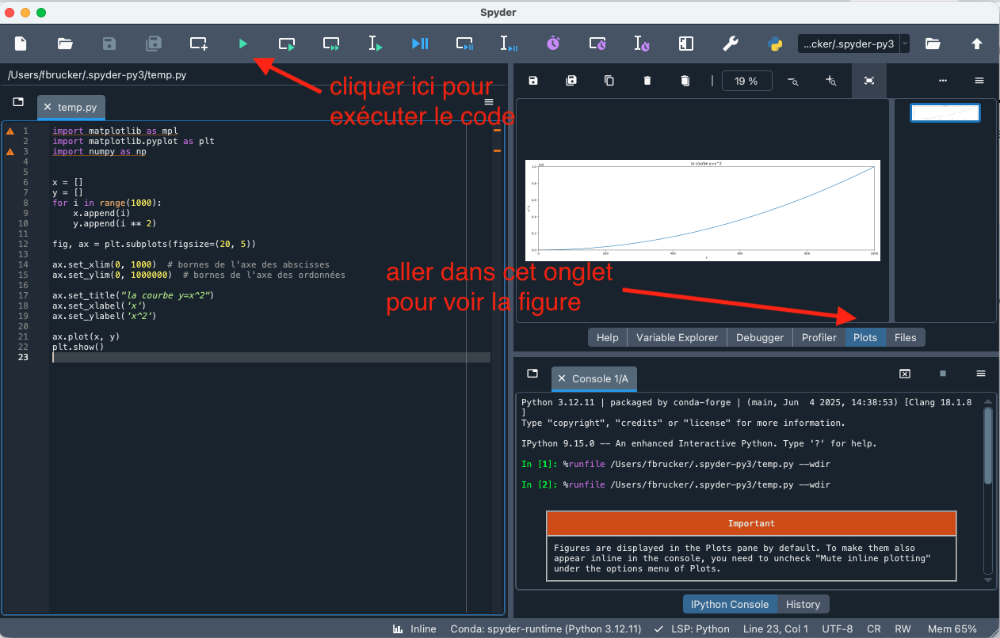

Présentation succincte du module <https://matplotlib.org/>  très utilisé en python pour représenter ds graphiques et à la base de la bibliothèque <https://seaborn.pydata.org/>.


Utilisez spyder pour ce tutoriel.



Le module [matplotlib](https://matplotlib.org/) peut être une  difficile à utiliser, ses notations ne sont pas cohérentes entre-elles, les paramètres des fonctions sont souvent abscons et il y a toujours plusieurs façon d'arriver au même résultat. Bref, cela peut être très pénible de s'en sortir.

Nous allons présenter une procédure permettant de presque toujours s'en sortir. Au final, lorsque vous aurez les bases de <https://matplotlib.org/> nous ne saurions trop vous conseiller de lui préférer <https://seaborn.pydata.org/> qui est une surcouche de <https://matplotlib.org/> qui est d'une part plus jolie et d'autre part plus rationnelle dans son utilisation.

## Écrire du code

Pour cette partie du cours nous aurons besoin de plus que la console. Il faudra en effet exécuter plusieurs lignes de python à la suite. Nous allons utiliser un notebook pour cela.


Commençons par importer les bibliothèques  :


```python
import matplotlib as mpl
import matplotlib.pyplot as plt
import numpy as np
```

Puis on ajoute le code de dessin de la courbe $y=x^2$. Ce qui donne le code suivant :

```python
# 0. import des modules

import matplotlib as mpl
import matplotlib.pyplot as plt
import numpy as np


# 1. création des données

x = []
y = []
for i in range(1000):
    x.append(i)
    y.append(i ** 2)

# 2. créer le dessin (ici ax)

fig, ax = plt.subplots(figsize=(20, 5))

# 2.1 limite des axes

ax.set_xlim(0, 1000)  # bornes de l'axe des abscisses
ax.set_ylim(0, 1000000)  # bornes de l'axe des ordonnées

# 2.2 les légendes

ax.set_title("la courbe y=x^2")
ax.set_xlabel('x')
ax.set_ylabel('x^2')

# 3. ajouter des choses au dessin

ax.plot(x, y)

# 4. représenter le graphique

plt.show()

```


Exécutez le code précédent dans spyder.


Vous devriez obtenir quelque chose comme ça :

 

Essayons de comprendre comment tout ça fonctionne :

1. la partie 1 crée deux listes, `x`{.language-} et `y`{.language-} qui vont représentez les points $(x[i], y[i])$  à représenter
2. la première ligne de la partie 2 crée les objets matplotlib sur lesquelles tracer les courbes.
    * On utilise ici `ax`{.language-} qui représente un dessin de 20 unités sur 5.
    * on peut paramétrer l'objet `ax`{.language-} pour limiter le graphique.
3. la troisième partie dessine nos points (reliés par des segments) sur l'objet `ax`{.language-}. La fonction [`ax.plot`{.language-}](https://matplotlib.org/stable/api/_as_gen/matplotlib.axes.Axes.plot.html) demande d'avoir 2 tableaux $x$ et $y$ de même dimensions en paramètre. Elle tracera les points $(x[i], y[i])$ et les reliera entre eux.
4. enfin, on représente l'objet `ax`{.language-} à l'écran.



Pour dessiner un graphique, on procédera toujours de la même façon :

1. on crée les données à représenter
2. créer le graphique avec matplotlib : `fig, ax = plt.subplots(figsize=(20, 5))`{.language-}
3. ajouter des choses au dessin : plusieurs commandes ajoutant des choses au dessin, c'est à dire `ax`{.language-}
4. représenter la figure (commande `plt.show()`{.language-}) ou la sauver dans un fichier






Si l'on ne donne pas de limite d'axe, le dessin prendra la taille de ce qui est dessiné. Ceci est parfois pratique lorsque l'on a pas d'idée précise des bornes de notre dessin.


On vérifie que vous avez compris :


Changez la courbe pour représenter $y = \frac{1}{2}x^2$



Superposez les courbes $y = x^2$ et $y = \frac{1}{2}x^2$.



```python
x = []
y = []
y2 = []

for i in range(1000):
    x.append(i)
    y.append(i ** 2)
    y2.append(.5 * i ** 2)

fig, ax = plt.subplots(figsize=(20, 5))

ax.plot(x, y)
ax.plot(x, y2)

plt.show()
```



Remarquez que les points ne sont pas représentés, uniquement les segments qui forment une courbe. Si vous voulez représenter des points, regardez du côté de la méthode [scatter](https://matplotlib.org/stable/api/_as_gen/matplotlib.axes.Axes.scatter.html).

## Sauver une figure

Pour sauver votre graphique au format pdf, vous pouvez remplacez la partie 4 du code de la partie précédente par la ligne : `plt.savefig("graphique.pdf", format="pdf", bbox_inches='tight')`{.language-}.

## Plusieurs figures

Il est tout à fait possible d'avoir plusieurs figures.


<https://matplotlib.org/stable/gallery/subplots_axes_and_figures/subplots_demo.html>



Reprenez l'exercice précédent et représentez les deux courbes dans 2 figures séparées



```python
x = []
y = []
y2 = []

for i in range(1000):
    x.append(i)
    y.append(i ** 2)
    y2.append(.5 * i ** 2)

fig, axes = plt.subplots(2, 1, figsize=(20, 5))


for i in range(len(axes)):  # bornes pour les axes de chaque figure
    axes[i].set_xlim(0, 1000)
    axes[i].set_ylim(0, 1000000)


axes[0].set_title("la courbe y=x^2")
axes[1].set_title("la courbe y=.5 * x^2")

axes[0].set_xlabel('x')
axes[1].set_xlabel('x')
axes[0].set_ylabel('x^2')
axes[1].set_ylabel('.5 * x^2')

axes[0].plot(x, y)
axes[1].plot(x, y2)

plt.show()
```

Vous pouvez aussi utiliser directement des paramètres nommé ce qui rend le tout plus lisible :

```python
fig, ax = plt.subplots(figsize=(20, 5), ncols=2) 
```

Oo encore :

```python
fig, ax = plt.subplots(figsize=(20, 5), nrows=2) 
```

Ou les deux à la fois :

```python
fig, ax = plt.subplots(figsize=(20, 5), nrows=2, ncols=2) 
```



## Tracé d'un histogramme



<https://matplotlib.org/stable/api/_as_gen/matplotlib.axes.Axes.bar.html#matplotlib.axes.Axes.bar>


```python
# 1. création des données
x = ['premier', 'deuxième', 'troisième', 'quatrième', 'cinquième']
y = [2, 5, 3, 8, 11]

# 2. créer le dessin (ici ax)
fig, ax = plt.subplots(figsize=(10, 7))

ax.set_title("un histogramme")
ax.set_xticks(range(len(x)))
ax.set_xticklabels(x, rotation=45)

# 3. ajouter des choses au dessin
ax.bar(range(len(y)), y, color="green", 
        edgecolor = 'red', linewidth = 1, 
        ecolor = 'black')

# 4. représenter le graphique
plt.show()
```

On a ajouté les attributs `ax.set_xticks`{.language-} et `ax.set_xticklabels`{.language-} pour représenter les significations dus histogrammes.

## Tracé camembert



<https://matplotlib.org/stable/api/_as_gen/matplotlib.axes.Axes.pie.html>


```python
# 1. création des données
nom = ["un", "deux", "trois", "quatre"]
valeurs = [5000, 26000, 21400, 12000]
separation = (0.1, 0.1, 0.1, 0.1)

# 2. créer le dessin (ici ax)
fig, ax = plt.subplots(figsize=(10, 7))

ax.set_title("un camembert")

# 3. ajouter des choses au dessin
ax.pie(valeurs, explode=separation, labels=nom, autopct='%1.1f%%', shadow=True)

# 4. représenter le graphique
plt.show()
```

## _Pimper_ vos dessins

Un bon point de départ pour explorer els diverses possibilités de `plot`{.language-} est de lire et faire le tutoriel :


<https://matplotlib.org/stable/tutorials/introductory/pyplot.html>


Faire une belle figure prend du temps.

## Exercices


Modifiez le code du premier graphique pour représenter la courbe $y=x$ où $x$ varie de $0$ à $100000$ par pas de $1000$.

Il pourra être nécessaire de modifier (ou de supprimer les limites des axes partie 2.1 du graphique)



Modifiez le code précédant pour représenter la courbe puis la courbe $y=ln(x)$, où $x$ varie de $0$ à $100000$ par pas de $1000$.


Le logarithme népérien est disponible dans le module math de python : [`math.log`{.language-}](https://docs.python.org/3/library/math.html#math.log)



Mettez les courbes sur un même graphique avec 2 figures.



Mettez les courbes sur un même graphique avec 1 seule figure (il suffit de mettre deux instructions `ax.plot`{.language-}).

