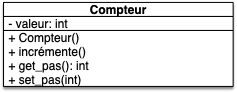
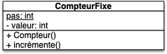

Nous allons utiliser plusieurs techniques permettant de fluidifier l'usage des objets. Nous allons prendre comme exemple le compteur.



### `compteur.py`{.fichier}

 
```python
class Compteur:
    def __init__(self):
        self.valeur = 0

    def incrémente(self):
        self.valeur = self.valeur + 1

```

### `test_compteur.py`{.fichier}

```python
from compteur import Compteur


def test_constructeur():
    c = Compteur()
    assert isinstance(c, Compteur)


def test_valeur_initiale():
    c = Compteur()
    assert c.valeur == 0


def test_incrémente():
    c = Compteur()

    c.incrémente()
    assert c.valeur == 1

    c.incrémente()
    assert c.valeur == 2
```


### `main.py`{.fichier}

```python
from compteur import Compteur

c = Compteur()

c.incrémente()
print(c.donne_valeur())
c.incrémente()
print(c.donne_valeur())
```



## Paramètres par défaut

On souhaite par pouvoir choisir le pas de notre compteur (c'est-à-dire ajouter 2 à chaque fois plutôt que 1 par exemple). 

### Ajout d'un paramètre et vérification de sa validité

Pour faire cela on va en première approche ajouter un paramètre dans le constructeur pour que chaque compteur puisse connaître son pas :

Fichier `compteur.py`{.fichier} :

```python
class Compteur:
    def __init__(self, pas):
        self.valeur = 0
        self.pas = pas

    # ...
```

Il faut alors changer le code pour construire les objets avec ce nouveau paramètre :

Fichier `main.py`{.fichier} :

```python
from compteur import Compteur

c1 = Compteur(3)
c2 = Compteur(1)

#...
```


Notez bien que le premier paramètre de la définition de la classe est **TOUJOURS** self. Le premier paramètre de l'utilisation de la méthode est alors le second dans sa définition.


Et il faut modifier la méthode `incrémente(self)`{.language-} pour qu'elle prenne en compte le pas :

```python
class Compteur:
    # ...

    def incrémente(self):
        self.valeur = self.valeur + self.pas
    
    # ...
```


On définira **toujours** les différents attributs de l'objet dans le constructeur `__init__`{.language-}.
On le fera de cette façon :

```python
self.nom_attribut = valeur_attribut
```



Cette façon de faire :

- attributs dans les objets
- méthodes (fonctions) dans les classes

permet à chaque objet (le paramètre `self`{.language-}) d'être différent tout en utilisant les mêmes méthodes.


Lors de l'utilisation d'une méthode, l'objet est passé en premier paramètre, ce qui permet de réutiliser tous ses attributs.


### Paramètre par défaut

Le souci avec la méthode précédente, c'est que même si le pas est de `1`{.language-}, il faut le définir dans la construction de l'objet. Nous allons changer ça en mettant un [paramètre par défaut](https://docs.python.org/3/tutorial/controlflow.html#default-argument-values).

En python cela donne (fichier `compteur.py`{.fichier}) :

```python
class Compteur:
    def __init__(self, pas=1):
        self.pas = pas
        self.valeur = 0
        

    def incrémente(self):
        self.valeur = self.valeur + self.pas

```

On peut utiliser deux fois le même nom `pas`{.language-} car ils sont dans des espaces de noms différents :

- un dans l'espace de noms de la fonction (créé lorsque l'on exécute la fonction et détruit à la fin. Attention : on détruit les noms pas les objets)
- un dans l'objet lui-même.

Le code final de `main.py`{.fichier} pourra alors être :

```python
from compteur import Compteur

c1 = Compteur(3)
c2 = Compteur()
c1.incrémente()
c2.incrémente()
c1.incrémente()

print(c2.valeur)
```


Ajoutez au `Compteur`{.language-} un paramètre déterminant sa valeur initiale. Il faudra pouvoir créer des compteurs de multiples façon (vous modifierez le test `test_valeur_initiale`{.language-}) :

- `Compteur()`{.language-} : créera un compteur de `valeur=0`{.language-} et de `pas=1`{.language-},
- `Compteur(3)`{.language-} : créera un compteur de `valeur=0`{.language-} et de `pas=3`{.language-},
- `Compteur(3, 12)`{.language-} : créera un compteur de `valeur=12`{.language-} et de `pas=3`{.language-},
- `Compteur(pas=3)`{.language-} : créera un compteur de `valeur=0`{.language-} et de `pas=3`{.language-},
- `Compteur(valeur=12)`{.language-} : créera un compteur de `valeur=12`{.language-} et de `pas=1`{.language-}




```python
class Compteur:
    def __init__(self, pas=1, valeur=0):
        assert pas != 0

        self.pas = pas
        self.valeur = valeur

    def incrémente(self):
        self.valeur = self.valeur + self.pas

```


Et le test :

```python
def test_valeur_initiale():
    c = Compteur()
    assert c.valeur == 0 and c.pas == 1

    c = Compteur(3, 12)
    assert c.valeur == 12 and c.pas == 3

    c = Compteur(pas=3)
    assert c.valeur == 0 and c.pas == 3

    c = Compteur(valeur=12)
    assert c.valeur == 12 and c.pas == 1

```




### Validité des paramètres

Un pas ne peut pas être nul. Ajoutons un garde-fou dans le code pour que ça n'arrive pas :

```python
class Compteur:
    def __init__(self, pas=1):
        assert pas != 0

        self.pas = pas
        self.valeur = 0
        

    def incrémente(self):
        self.valeur = self.valeur + self.pas

```

L'assertion garantie que le pas n'est pas nul et si l'utilisateur tente de créer un compteur avec un pas de 0 le programme va planter avec une `AssertionError`{.language-} :

```python
>>> c = Compteur(0)
Traceback (most recent call last):
  File "<python-input-1>", line 1, in <module>
    c = Compteur(0)
  File "<python-input-0>", line 3, in __init__
    assert pas != 0  # garanti que pas est > 0 ou le programme plante
           ^^^^^^^^
AssertionError

```

Ajoutons un test qui vérifie que l'assertion fonctionne :

```python
import pytest

# ...

def test_assertion():
    with pytest.raises(AssertionError):
        c = Compteur(0)
```

Le bloc `with`{.language-} va s'attendre à planter avec une erreur d'assertion. Le test va échouer si ce n'est pas le cas (changez le paramètre de `Compteur(0)`{.language-} dans le test pour le vérifier).


On peut utiliser des `assert`{.language-} pour vérifier la validité d'un paramètre.


## Attributs

On peut grandement améliorer la gestion des attributs des objets.

### <span id="privé"></span>Attributs privés

Notre garde-fou ne fonctionne cependant que lors de la création de l'objet. COmme l'attribut est public on peut très bien écrire :

```python
c = Compteur()
c.pas = 0
```

Et de créer un compteur qui n'incrémente jamais...

Pour éviter cela, on peut rendre l'attribut `pas`{.language-} privé ce qui interdit à l’utilisateur d'y acceder.


Un attribut ou une méthode **_privée_** est un attribut/méthode qui ne doit pas être utilisé autre part que dans le code des méthodes de la classe. Les attributs/méthodes directement utilisables dans tout code sont dit **_publics_**.

En UML on distingue les attributs/méthodes privés des attributs public en mettant devant le nom de l'attribut :
- un `-` si l'élément est privé
- rien ou un `+` si l'élément est public


Mais rendre `pas`{.language-} privé interdit complètement à l'utilisateur d'y acceder. Si on veut tout de même lui permettre de connaître et de modifier sa valeur on passe par deux méthodes spécifiques :

- ajouter une méthode publique qui rend la valeur de l'attribut `pas` appelée accesseur
- ajouter une méthode publique qui modifie l'attribut `pas` (on peut alors vérifier que la modification est légale) appelée mutateur


- Un **_accesseur_** (**_getter_**) est une méthode dont le but est de rendre un attribut privé. On la nomme usuellement : `get_[nom de l'attribut]()`{.language-}
- Un **_mutateur_** (**_setter_**) est une méthode dont le but est de modifier un attribut privé. On la nomme usuellement : `set_[nom de l'attribut](nouvelle_valeur)`{.language-}


On a alors l'UML suivant :



L'implémentation en python va passer par une convention car pour python tous les attributs sont toujours publics :



L'usage en python peut que les variables privées soient précédées d'un `_`{.language-}. Ceci prévient le développeur qu'il ne faut pas qu'il utilise ces attributs directement.

C'est une convention qui signifie : "_on ne touche pas si on ne sait pas ce que l'on fait_".



Ce qui donne le code :

```python
class Compteur:
    def __init__(self, pas=1, valeur=0):
        assert pas != 0

        self._pas = pas
        self.valeur = valeur

    # ...

    def get_pas(self):
        return self._pas

    def set_pas(self, pas):
        assert pas != 0

        self._pas = pas


```

Et le test :

```python
def test_accesseur_mutateur():
    c = Compteur()

    c.set_pas(42)
    assert c.get_pas() == 42

    with pytest.raises(AssertionError):
        c.set_pas(0)
```

### <span id="attribut-classe"></span>Attributs de classes

Chaque classe ayant son propre espace de nommage contenant ses méthode, rien ne nous empêche de l'utiliser pour définir des attributs pour la classe.


Un **_attribut de classe_** (**_getter_**) est un attribut qui est le même pour tout objet de la classe.

En UML le nom d'un attribut de classe est souligné.


Par exemple en python on pourrait définir un compteur à pas identique pour tous les éléments de la classe ainsi :

```python
class CompteurFixe:
    PAS = 1

    def __init__(self, valeur=0):
        self._valeur = 0
    
    def incrémente(self):
        self._valeur = self._valeur + type(self).PAS


```

Avec un diagramme UML :



On utilise explicitement le fait que `PAS`{.language-} est un attribut de la classe de l'objet. Notez que de par le fonctionnement des espaces de nommages, on aura plutôt tendance à écrire la chose suivante qui est équivalente (puisque `PAS`{.language-} n'est pas défini dans l'objet on le cherche dans sa classe):

```python
class CompteurFixe:
    PAS = 1

    def __init__(self, valeur=0):
        self.valeur = valeur
    
    def incrémente(self):
        self.valeur = self.valeur + self.PAS

```


En python il est tout à fait possible d'avoir un attribut de classe et un attribut d'objet de même nom mais : **CE N'EST PAS UNE BONNE IDÉE**.


Si vous ne savez pas si c'est l'attribut de classe ou d'objet que vous appelez via `self.<nom>` (si `<nom>` est à la fois défini pour la classe et pour l'objet, l'attribut de classe va être masqué par l'attribut d'objet) vous allez forcément faire des erreurs.


### property


<https://realpython.com/python-property/>


Les attributs de classes ont un effet de bord sympathique en python qui permet d'utiliser des mutateurs et des accesseur comme si on accédais a un attribut. Rien de tel qu'un exemple pour comprendre. Considérez l'amélioration suivante du `Compteur`{.language-} :

```python/
class Compteur:
    def __init__(self, pas=1, valeur=0):
        assert pas != 0

        self._pas = pas
        self.valeur = valeur

    # ...

    def get_pas(self):
        return self._pas

    def set_pas(self, pas):
        assert pas != 0

        self._pas = pas

    pas = property(get_pas, set_pas)

```

La ligne 14 défini le nom, `pas`{.language-} qui est le résultat de la fonction `property`{.language-}. On peut alors écrire le code suivant :

```python
c = Compteur()
print(c.pas)
c.pas = 42
```

Qui sera équivalent au code suivant :

```python
c = Compteur()
print(c._get_pas())
c.set_pas(42)
```


Les `property`{.language-} permettent d'utiliser des mutateurs et des accesseurs comme on utiliserait un attribut.

C'est le meilleur des deux mondes !


On n'a plus besoin d'utiliser directement des accesseurs/mutateur on peut les rendre privé :

```python
class Compteur:
    def __init__(self, pas=1, valeur=0):
        assert pas != 0

        self._pas = pas
        self.valeur = valeur

    # ...

    def _get_pas(self):
        return self._pas

    def _set_pas(self, pas):
        assert pas != 0

        self._pas = pas

    pas = property(_get_pas, _set_pas)

```

Et on peut modifier notre test :

```python
def test_accesseur_mutateur():
    c = Compteur()

    c.pas = 42
    assert c.pas == 42

    with pytest.raises(AssertionError):
        c.pas = 0

```

## Méthodes spéciales

Pour rendre l'utilisation des objets pus agréable et intuitive, python va associer des méthodes spécifiques à des actions spécifiques. Ces méthodes sont appelées méthodes spéciales :


**_Les méthodes spéciales_** de python se présentent sous la forme `__nom_de_la_méthode__`{.language-} et sont utilisés par python dans des cas spécifiques. [La documentation officielle](https://docs.python.org/3/reference/datamodel.html#special-method-names) les liste. Elles sont rès pratiques car elles permettent d'utiliser nos objets de façon intuitive, comme si on utilisait des objets de python (affichage à l'écran, comparaison, exécution comme une fonction, ...).


On a déjà vu une méthode spéciale : `__init__`{.language-} qui est exécutée lorsque l'on appelle une classe, mais il y en a bien d'autres. Nous allons en voir 2, très pratiques.

### <span id="str"></span>Représentation sous la forme de texte

Essayez de taper dans le fichier `main.py`{.fichier} :

```python
c = Compteur()
print(c)
```

Vous devriez obtenir quelque chose comme :

```python
<__main__.Compteur object at 0x107149100>
```


Dans les projets dés et cartes on a créé une méthode `texte()`{.language-} qui rendait une chaîne de caractères pour ce genre de choses, mais python offre une possibilité plus simple en utilisant méthodes spéciales.

Ainsi, La méthode spéciale `__str__`{.language-} est utilisée lorsque l'on cherche à transformer un objet en chaîne de caractère avec [la fonction `str()`{.language-}](https://docs.python.org/fr/3.14/library/functions.html#str).

Ainsi si on défini :

```python
class Compteur

    # ...

    def __str__(self):
        return "Le compteur vaut " + str(self.valeur)
```

On pourra écrire :

```python
c = Compteur()
print(str(c))
```

Et qui va maintenant nous rendre :

```python
Le compteur vaut 0
```

Notez que pour la fonction `print`{.language-} on peut même écrire directement `print(c)`{.language-} car par défaut l'interpréteur python remplace `print(c)`{.language-} par `print(str(c))`{.language-}.


La méthode `__str__`{.language-} permet : 

- de transformer un objet `o`{.language-} en chaîne de caractères via la fonctions `str(o)`{.language-}
- de l'afficher à l'écran en utilisant  `print(o)`{.language-} (qui est équivalent à `print(str(o))`{.language-}).


### <span id="repr"></span>Représentation de l'objet


<https://docs.python.org/3/library/functions.html#repr>


Si la représentation sous forme d'un texte permet à un utilisateur de "lire" l'objet, plusieurs objets de pas différents vont avoir la même représentation. Pour associer à chaque objet une représentation sans ambiguïté et destiné et destiné aux développeurs python fourni la fonction `repr`{.language} qui utilise la méthode spéciale `__repr__`{.language-}.


La méthode `__repr__`{.language-} permet : 

- de transformer un objet `o`{.language-} en chaîne de caractères via la fonctions `repr(o)`{.language-}
- on a coutume de représenter une chaîne de caractère permettant de recréer l'appel au constructeur permettant de recréer l'objet.


Ainsi pour le compteur :

```python
class Compteur:

    # ...

    def __repr__(self):
        return f"Compteur(pas={self.pas}, valeur={self.valeur})"
```

Ce qui donnera :

```python
>>> c = Compteur()
>>> c.incremente()
>>> c.incremente()
>>> print(repr(c))
Compteur(pas=1, valeur=2)
```

La fonction `repr()`{.language-} est souvent utilisée comme débogage pour les développeur car elle exprime distinctement ce que l'objet est, il est donc utile de l'implémenter. Elle esrt aussi utilisée par défaut dans la représentation textuelle des conteneurs :

```python
>>> c = Compteur()
>>> l = [c]
>>> print(l)
[Compteur(pas=1, valeur=0)]
```

### <span id="comparaison"></span> Comparaisons

On pourrait avoir envie de comparer des valeurs de compteurs. On pourrait comparer directement les attributs, mais ce serait tout de même plus simple si l'on pouvait écrire :

```python

c1 = Compteur(valeur=1)
c2 = Compteur(valeur=4)

print(c1 < c2)

```

Pour l'instant, cela ne fonctionne pas. Si on teste ça avec votre code tel qu'il est, on obtiendra :

```text
TypeError: '<' not supported between instances of 'Compteur' and 'Compteur'
```

Python vous explique qu'il ne connaît pas l'opérateur `<`{.language-} pour les objets de notre classe. Pour pouvoir utiliser
directement les opérateurs `<`{.language-} et `<=`{.language-}, il faut définir respectivement les méthodes `__lt__(self, other)`{.language-} (_lower than_) et `__le__(self, other)`{.language-} (_lower or equal than_). On pourra aussi ajouter `__eq__(self, other)`{.language-} pour tester l'égalité.

Par exemple pour ajouter la comparaison _strictement plus petit que_, on ajoute la méthode :

```python
class Compteur
    # ...

    def __lt__(self, other):
        return self.valeur < other.valeur
    
    # ...
```

On peut aussi ajouter plus grant que et égal pour obtenir les comparaisons :

```python
class Compteur:

    # ...

    def __lt__(self, other):
        return self.valeur < other.valeur

    def __le__(self, other):
        return self.valeur <= other.valeur

    def __eq__(self, other):
        return other.valeur == self.valeur

    # ...
```


Les différents opérateurs de comparaison que l'on peut ajouter à nos objets sont décrits [dans la documentation](https://docs.python.org/fr/3/reference/datamodel.html#object.__lt__).




Ajoutez des tests pour ces comparaisons.



```python
def test_comparaisons():
    assert Compteur(valeur=1) == Compteur(valeur=1)
    assert Compteur(valeur=1) <= Compteur(valeur=1)
    
    assert Compteur(valeur=1) <= Compteur(valeur=2)
    assert Compteur(valeur=1) < Compteur(valeur=2)

```



## Code final

Notre compteur a bien évolué depuis sa première mouture. Il permet maintenant d'être utilisé de façon bien plus intuitive.

### `compteur.py`{.fichier}

```python
class Compteur:
    def __init__(self, pas=1, valeur=0):
        assert pas != 0

        self._pas = pas
        self.valeur = valeur

    def _get_pas(self):
        return self._pas

    def _set_pas(self, pas):
        assert pas != 0

        self._pas = pas

    pas = property(_get_pas, _set_pas)
    
    def incrémente(self):
        self.valeur = self.valeur + self.pas

    def __str__(self):
        return "Le compteur vaut " + str(self.valeur)

    def __repr__(self):
        return f"Compteur(pas={self.pas}, valeur={self.valeur})"

    def __lt__(self, other):
        return self.valeur < other.valeur

    def __le__(self, other):
        return self.valeur <= other.valeur

    def __eq__(self, other):
        return other.valeur == self.valeur

```

### `test_compteur.py`{.fichier}

```python
import pytest
from compteur import Compteur


def test_constructeur():
    c = Compteur()
    assert isinstance(c, Compteur)


def test_assertion():
    with pytest.raises(AssertionError):
        c = Compteur(0)

def test_valeur_initiale():
    c = Compteur()
    assert c.valeur == 0 and c.pas == 1

    c = Compteur(3, 12)
    assert c.valeur == 12 and c.pas == 3

    c = Compteur(pas=3)
    assert c.valeur == 0 and c.pas == 3

    c = Compteur(valeur=12)
    assert c.valeur == 12 and c.pas == 1


def test_incrémente():
    c = Compteur()

    c.incrémente()
    assert c.valeur == 1

    c.incrémente()
    assert c.valeur == 2

def test_accesseur_mutateur():
    c = Compteur()

    c.pas = 42
    assert c.pas == 42

    with pytest.raises(AssertionError):
        c.pas = 0


def test_comparaisons():
    assert Compteur(valeur=1) == Compteur(valeur=1)
    assert Compteur(valeur=1) <= Compteur(valeur=1)
    
    assert Compteur(valeur=1) <= Compteur(valeur=2)
    assert Compteur(valeur=1) < Compteur(valeur=2)

```

### `main.py`{.fichier}

```python
from compteur import Compteur

c = Compteur()

c.incrémente()
print(c)
c.incrémente()
print(repr(c))

```

