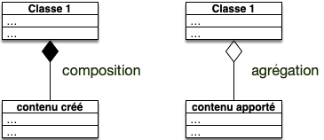
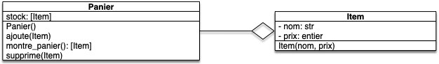
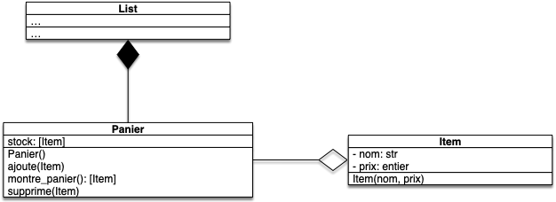

Composition et agrégation permettent de lier des classes entres elles et plus principalement lorsqu'une classe admet comme attribut des objets de l'autre classe.

Ce qui les distingue :



- **_agrégation_** : quand les objets utilisés sont créés en dehors de la classe,
- **_composition_** : quand les objets utilisés sont créés dans le constructeur de la classe qui les utilise.



Il est important de comprendre que si des objets n'ont pas été crées dans la classe qui l'utilise, ils peuvent être connus par d'autres méthodes du programme et donc être modifiées par celles-ci.

Les exemples de composition et d'agrégation de _la vraie vie_ sont souvent un peu bizarres. Mais par exemple :

- Un livre est composé de pages : pour créer le livre on a créé les pages : c'est une **composition**
- Les télécommandes ont besoin de piles pour fonctionner, mais on peut les remplacer : c'est une **agrégation**.

## Schémas uml

Lorsque l'on utilise la composition ou l'agrégation de nos classes dans des schéma uml, on liera la classe composé (_resp._ agrégée) à la classe l'utilisant par une flèche. Cette flèche sera différente pour une composition ou une agrégation :



## Exemple du panier d'achats

Prenons l'exemple du panier d'achat. On veut modéliser la gestion d'un panier sur un site d'achat en ligne. Ce panier aura les propriétés suivantes :

- il doit être initialement vide,
- on doit pouvoir ajouter des items dans le panier,
- on doit pouvoir montrer les items du panier,
- on doit pouvoir retirer un item du panier.
- un item doit avoir un nom et un prix

### Modélisation uml



Le panier **agrège** des Items puisqu'ils sont ajoutés par une méthode dans l'objet.

### Code python

Ceci s'implémente aisément en python :

```python
class Panier:
    def __init__(self):
        self.stock = []

    def ajoute(self, item):
        self.stock.append(item)

    def montre_panier(self):
        return self.stock

    def supprime(self, item):
        self.stock.remove(item)

class Item:
    def __init__(self, nom, prix):
        self._nom = nom
        self._prix = prix


    def __eq__(self, other):
        return self._nom == other._nom and self._prix == other._prix

    def __repr__(self):
        return f"Item({self._nom}, {self._prix})"

    def __str__(self):
        return f"Un item de nom {self._nom} valant {self._prix} euros."


```


Quels tests feriez vous pour vérifier la véracité de votre code ?



fichier `test_panier.py`{.fichier} :

```python
from panier import Panier, Item


def test_init():
    panier = Panier()
    assert panier is not None


def test_montre_panier_vide():
    panier = Panier()
    assert panier.montre_panier() == []


def test_ajoute():
    panier = Panier()
    panier.ajoute(Item("macbook", 1000))
    assert panier.montre_panier() == [Item("macbook", 1000),]


def test_supprime_dans_panier():
    panier = Panier()
    panier.ajoute(Item("macbook", 1000))
    panier.supprime(Item("macbook", 1000))

    assert panier.montre_panier() == []

def test_item_eq():
    assert Item("macbook", 1000) == Item("macbook", 1000)
    assert Item("Rolex", 1000) != Item("macbook", 1000)
    assert Item("Rolex", 10000) != Item("Rolex", 1000)
```

Je n'ai pas l'habitude de tester les méthodes `__repr__`{.language-} et `__str__`{.language-} qui ne sont utilisées que pour l'affichage.



On peut alors utiliser notre classe, par exemple :

```python
from panier import Panier, Item

panier = Panier()

print(panier.montre_panier())

mac = Item("macbook", 1000)
print(mac)
panier.ajoute(mac)

print(panier.montre_panier())

panier.ajoute(Item("grosse Rolex", 50000))

print(panier.montre_panier())

panier.supprime(Item("grosse Rolex", 50000))
print(panier.montre_panier())
```

Dont l'exécution va donner :

```shell
[]
Un item de nom macbook valant 1000 euros.
[Item(macbook, 1000)]
[Item(macbook, 1000), Item(grosse Rolex, 50000)]
[Item(macbook, 1000)]

```

Les items sont ajoutés et supprimés du Panier mais ne sont pas crée par lui : c'est bien une agrégation.


Vous remarquerez que lors de l'affichage d'une liste, c'est la fonction `repr`{.language-} qui est utilisée et non `str`{.language-}.


- Commentez la méthode `Item.__str__`{.language-} puis exécutez à nouveau le code. Conclusion ?
- Décommentez la méthode `Item.__str__`{.language-} et commentez maintenant la méthode `Item.__repr__`{.language-} puis exécutez à nouveau le code. Conclusion ?


La fonction `str`{.language-} utilise la méthode `Item.__repr__`{.language-} si `Item.__str__`{.language-} n'est pas défini, mais pas le contraire.

Si on ne doit coder qu'une seule méthode, c'est `__repr__`{.language-} qu'il faut faire.


### Composition du stock

Nous avons cependant oublié de compter une composition : le stock. Il est en effet crée par le panier. On est donc plutôt dans le schéma suivant :



Cette composition est importante car les listes de python sont mutables :


Si une classe est composée d'autres objets mutables, ces parties peuvent être modifiées en dehors de la classe.


Dans notre cas la méthode `Panier.montre_panier()`{.language-} retourne directement l'attribut `stock`{.language-}. et une fois qu'un objet a été _donné_ au monde extérieur on ne contrôle plus son état. Il peut être utilisé a priori par n'importe quoi d'autre dans le programme comme le montre le code suivant :

```python

panier = Panier()

print(panier.montre_panier())

panier.ajoute(Item("macbook", 1000))

copie = panier.montre_panier()

copie.append(Item("fausse rolex", 50))
print(panier.montre_panier())
```

On a ajouté une fausse rolex à notre panier sans que le panier ne le sache ! Cela peut poser de gros problème car la méthode `Panier.ajoute_panier(item)`{.language-} fait certainement des vérifications pour ne pas que l'on puisse ajouter de contrefaçons.

Pour que tout se passe comme prévu, il faut donc s'assurer que notre `stock`{.language-} ne uisse être modifié. Ceci peut se faire de 2 façons :

1. la méthode `Panier.montre_panier()`{.language-} rend une copie du stock,
2. notre stock est immutable et et on reconstruit un nouveau stock à chaque ajout d'item.

Le choix d'une stratégie ou de l'autre va dépendre du nombre de fois où l'on consulte le panier vs le no,bre de fois où on y ajoute des éléments.

#### Rendre une copie

On modifie la méthode `montre_panier()`{.language-} :

```python
class Panier:
    # ...

    def montre_panier(self):
      return list(self.stock)

    #...
```

#### Rendre le stock non mutable.

On utilise un [tuple](https://python.doctor/page-apprendre-tuples-tuple-python) qui est une liste sans possibilité de modification. Le code suivant crée un nouveau tuple en utilisant l'opération `+`{.language-} des tuples qui crée un nouvel objet. :

```python
class Panier:
    def __init__(self):
      self.stock = tuple()

    # ...

    def ajoute(self, fruit):
        self.stock = self.stock + (fruit,)

    def supprime(self, fruit):
        stock_temporaire = list(self.stock)
        stock_temporaire.remove(fruit)
        self.stock = tuple(stock_temporaire)

    #...

```

Selon que l'on aura beaucoup d'ajouts ou beaucoup de visualisation du panier, on choisira l'une ou l'autre solution. Mais si on a pas d'idée, on préférera **toujours** cette solution qui est la plus robuste.


Une bonne façon de programmer est d'**utiliser par défaut uniquement des objets non modifiables** et que si le besoin s'en fait sentir de les rendre modifiables.


Il ~nous~ vous reste à modifier les tests :


Modifiez les tests pour qu'ils passent avec notre nouvelle classe `Panier`{.language-}



Il faut vérifier que le stock est un tuple.

fichier `test_panier.py`{.fichier} :

```python
from panier import Panier, Item

# ...

def test_montre_panier_vide():
    panier = Panier()
    assert panier.montre_panier() == tuple()


def test_ajoute():
    panier = Panier()
    panier.ajoute(Item("macbook", 1000))
    assert panier.montre_panier() == (Item("macbook", 1000),)


def test_supprime_dans_panier():
    panier = Panier()
    panier.ajoute(Item("macbook", 1000))
    panier.supprime(Item("macbook", 1000))

    assert panier.montre_panier() == tuple()

# ...
```



## Code Python de la classe Panier


- [Code de la classe python](https://github.com/FrancoisBrucker/cours_informatique/tree/main/docs/src/cours/coder-et-d%C3%A9velopper/apprendre-programmation/programmation-objet/composition-agr%C3%A9gation/code)
- [Téléchargement du code](https://download-directory.github.io?url=https://github.com/FrancoisBrucker/cours_informatique/tree/main/docs/src/cours/coder-et-d%C3%A9velopper/apprendre-programmation/programmation-objet/composition-agr%C3%A9gation/code?filename=projet-panier)

