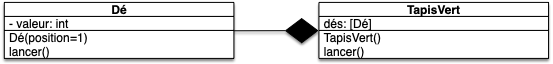
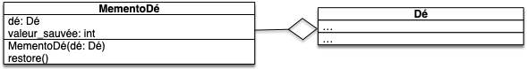

Dans les deux précédents projets dés, vous avez codé des classes toutes seules. Dans cette partie on va coder plusieurs classes enchevêtrées.

Pour les besoins de ce projet, nous allons présupposer que vous avez une classe `Dé`{.language-} qui fonctionne. La version minimale que nous allons utiliser ici est disponible ci-après. Mais ne vous sentez pas obliger de l'utiliser.

<span id="code-Dé"></span>



fichier `dé.py`{.fichier} :

```python
import random

class Dé:
    MIN_VALEUR = 1
    MAX_VALEUR = 6


    def __init__(self, valeur=1):
        self._valeur = valeur

    valeur = property(lambda self: self._valeur)

    def lancer(self):
        self._valeur = random.randrange(self.MIN_VALEUR, self.MAX_VALEUR + 1)

        return self

    def __str__(self):
        if self.valeur == 1:
            return "⚀"
        elif self.valeur == 2:
            return "⚁"
        elif self.valeur == 3:
            return "⚂"
        elif self.valeur == 4:
            return "⚃"
        elif self.valeur == 5:
            return "⚄"
        else:
            return "⚅"

```

fichier `test_dé.py`{.fichier} :

```python
import pytest
from dé import Dé


def test_init():
    assert isinstance(Dé(), Dé)


def test_valeur():
    assert Dé().valeur == 1
    assert Dé(valeur=4).valeur == 4

def test_valeur_sans_setter():
    with pytest.raises(AttributeError):
        Dé().valeur = 1    


def test_lancer():
    dé = Dé()
    dé.lancer()
    assert Dé.MIN_VALEUR <= dé.valeur <= Dé.MAX_VALEUR


def test_str():
    assert str(Dé()) == "⚀"
    assert str(Dé(4)) == "⚃"

```



Il va nous falloir manipuler 5 dés ensemble pour atteindre le but de notre projet :



Jouer au [poker d'as](https://fr.wikipedia.org/wiki/Poker_d%27as).



Nous n'atteindrons pas ce but à la fin du projet, mais libre à vous de le continuer et de le finir.

## 5 dés

Méthode naïve pour manipuler 5 dés : la liste de dés.

Pour illustrer cette étape et progresser dans notre projet de jeu, faisons une petite user story :



- Nom : "jets de dés"
- Utilisateur : un joueur compulsif
- Story : On veut pouvoir lancer des dés et voir le résultat
- Actions :
  1. créer une liste
  2. créer 5 dés que l'on ajoute un à un à la liste
  3. lancer les 5 dés
  4. afficher chaque dés de la liste




Créez la user story dans le fichier `story_jets.py`{.fichier}



Fichier `story_jets.py`{.fichier} :

```python
from dé import Dé

des_dés = []
for _ in range(5):
    des_dés.append(Dé())

for d in des_dés:
    d.lancer()

for d in des_dés:
    print(d)

```

On aurait aussi pu créer directement la liste et les dés en utilisant une liste comprehension : 

```python
des_dés = [Dé() for _ in range(5)]
```

Notez qu'il **faut** créer 5 dés différents.



## Composition

L'utilisation d'une liste permet de grouper les 5 dés, mais il faut toujours les lancer individuellement. Cela pourrait être pratique de lancer automatiquement tous les dés.

### Classe `TapisVert`{.language-}

On aimerait avoir une structure, nommée `TapisVert`{.language-}, qui :

- crée et stocke 5 dés
- permette de lancer les dés stockés en une fois avec une méthode `lancer`{.language-}
- rendre les dés contenus dans sa structure via une liste ou un tuple



1. Proposez une modélisation UML de cette classe, montrez la relation qu'elle entretient avec la classe `Dé`{.language-}.
2. modifier la user story "jets de dés" pour qu'elle utilise cette classe





`story_jets.py`{.fichier} :

```python
from dé import TapisVert

tapis_vert = TapisVert()

tapis_vert.lancer()

for dé in tapis_vert.dés:
    print(dé)
```



Comme les classes `TapisVert`{.language-} et `Dé`{.language-} sont différentes elles peuvent toutes les deux implémenter une méthode `lancer()`{.language-} :


Codez la classe `TapisVert`{.language-} dans le fichier `dé.py`{.fichier}.



Fichier `dé.py`{.fichier} :

```python

# ...

class TapisVert:
    def __init__(self):
        dés = []
        for _ in range(5):
            dés.append(Dé())
        self.dés = tuple(dés)

    def lancer(self):
        for dé in self.dés:
            dé.lancer()

# ...

```



Et on ajoute ses tests :


Ajoutez les tests de cette nouvelle classe au fichier `test_dé.py`{.fichier}. Vous pourrez par exemple tester  :

- qu'après la création d'un objet `TapisVert`{.language-} on dispose bien de 5 dés de valeur 1.
- qu'après avoir lancé les dés, leurs valeurs sont toujours cohérentes avec le nombre de faces.



Fichier `test_dé.py`{.fichier} :

```python

# ...

def test_tapis_vert_creation():
    tapis_vert = TapisVert()

    for d in tapis_vert.dés:
        assert d.valeur == 1

def test_tapis_vert_lancer():
    tapis_vert = TapisVert()
    tapis_vert.lancer()

    for d in tapis_vert.dés:
        assert 1 <= d.valeur <= 6


# ...

```



### Affichage

On peut utiliser `Dé.__str__()`{.language-} pour que `TapisVert.__str__()`{.language-} soit facile à coder :


Créez une méthode `TapisVert.__str__()`{.language-} qui permette d'écrire :

```python
>>> from dé import TapisVert
>>> tapis_vert = TapisVert()
>>> print(tapis_vert)
⚀ - ⚀ - ⚀ - ⚀ - ⚀
>>> tapis_vert.lancer()
>>> print(tapis_vert)
⚀ - ⚁ - ⚁ - ⚀ - ⚁
>>> 
```




On peut utiliser deux astuces python. La première est de construire une liste avec les représentations sous la forme d'une chaîne de caractères des dés. Par exemple :

```python
>>> from dé import TapisVert
>>> tapis_vert = TapisVert()
>>>[str(x) for x in tapis_vert.dés]
['⚀', '⚀', '⚀', '⚀', '⚀']
```

Puis utiliser la méthode `str.join(itérable)`{.language-} de python qui est super utile pour concaténer des listes de chaînes de caractères (la doc dit : "_Return a string which is the concatenation of the strings in iterable._") :

```python
>>> l = ["coucou", "les", "amis"]
>>> "*".join(l)
'coucou*les*amis'
```

Ces deux astuces nous permettent d'écrire le code :

```python
class TapisVert:
    # ...

    def __str__(self):
        return " - ".join([str(x) for x in self.dés])

    # ...

```



## Reconnaissance

Pour jouer au poker d'as, il nous faudra reconnaître des formes de jets de dés (comme les paires, ou encore les full). Créons une user story pour coder cette fonctionnalité :



- Nom : "formes de jets"
- Utilisateur : un joueur compulsif
- Story : On veut pouvoir savoir quelles formes de dés sont présentes
- Actions :
  1. jeter 5 dés
  2. vérifier s'il y a une paire, un brelan ou un carré
  3. recommencer en 1




Créez la story dans le fichier `story_formes_dés.py`{.fichier}.

Pour cela, l'utilisateur pourra appuyer sur la touche entrée pour lancer les dés d'un objet de type `TapisVert`{.language-}, afficher les 5 dés et indiquer s'il y a une paire, un brelan ou un carré avec des méthodes `TapisVert.possède_paire()`{.language-}, `TapisVert.possède_brelan()`{.language-}, et `TapisVert.possède_carré()`{.language-} qui rendent des booléens.



```python
from dé import TapisVert

tapis_vert = TapisVert()

while True:

    tapis_vert.lancer()
    print(tapis_vert)
    if tapis_vert.possède_paire():
        print("  A une paire")
    if tapis_vert.possède_brelan():
        print("  A un brelan")
    if tapis_vert.possède_carré():
        print("  A un carré")

    entrée = input("Appuyez sur la touche <entrée> pour recommencer")
```



Et maintenant le code des différentes méthodes à implémenter :


Ajoutez dans `TapisVert`{.language-} les méthodes nécessaires et testez-les en simulant des lancers ayant une forme particulière.




Pour coder cela de façon simple, vous pourrez coder deux méthodes supports :

- une méthode qui rend une liste $L$ de taille 7 telle que $L[i]$ donne le nombre de dés ayant la valeur $i$ ($1 \leq i \leq 6$)
- une méthode qui prend en paramètre un nombre $n$ et qui rend `True`{.language-} s'il existe au moins $n$ dés ayant la même valeur. Ceci permettra de coder de la même manière les différentes fonctions demandées.




```python
class TapisVert:

    # ...

    def _nombre_valeurs(self):
        count = [0] * 7
        for dé in self.dés:
            count[dé.valeur] += 1
        return count

    def nb_dés_valeurs_identiques(self, nb):
        comptes = self._nombre_valeurs()

        for i in range(len(comptes)):
            if comptes[i] >= nb:
                return True
        return False

    def possède_paire(self):
        return self.nb_dés_valeurs_identiques(2)

    def possède_brelan(self):
        return self.nb_dés_valeurs_identiques(3)

    def possède_carré(self):
        return self.nb_dés_valeurs_identiques(4)

```


Pour tester nos méthodes fraichement ajoutée on a un soucis. Si l'on veut tester plusieurs possibilités, il faut que l'on puisse manuellement modifier la valeur d'un dé (on ne peut pas utiliser la méthode `lancer`{.language-} qui est non déterministe). On s'autorise donc à utiliser l'attribut privé `_valeur`{.language-}. Comme les classes `Dé`{.language-} et `TapisVert`{.language-}, cela fait partie des choses autorisées si on ne peut pas facilement faire autrement, ce qui est le cas ici. On pourrait donc par exmple implémenter dans le fichier `test_dé.py`{.fichier} les deux tests suivant :

```python
def test_tapis_vert_nombre_valeurs():
    tapis_vert = TapisVert()

    assert [0, 5, 0, 0, 0, 0, 0] == tapis_vert._nombre_valeurs()

    tapis_vert.dés[2]._valeur = 4

    assert [0, 4, 0, 0, 1, 0, 0] == tapis_vert._nombre_valeurs()


def test_tapis_vert_nb_des_identiques():
    tapis_vert = TapisVert()

    assert tapis_vert.nb_dés_valeurs_identiques(5)
    assert tapis_vert.nb_dés_valeurs_identiques(4)

    tapis_vert.dés[2]._valeur = 4

    assert not tapis_vert.nb_dés_valeurs_identiques(5)
```

## Agrégation : Memento

Nous Allons créer un nouvel objet appelé permettant de sauver la valeur d'un dé puis de le restaurer si besoin. On va utiliser pour cela [un patron de conception](https://refactoring.guru/fr/design-patterns) nommé Memento


[Patron de conception Memento](https://refactoring.guru/fr/design-patterns/memento)


### Classe `MementoDé`{.language-}

Le diagramme UML d'un Memento pour notre dé est le suivant :



Lors de sa création il sauve la valeur du dé et la restore lors de l'appel de sa méthode `MementoDé.restore()`{.language-}.



Créez la classe `MementoDé`{.language-} dans le fichier `dés.py`{.fichier}.




```python
class MementoDé:
    def __init__(self, dé):
        self.dé = dé
        self.valeur_sauvée = dé.valeur

    def restore(self):
        self.dé._valeur = self.valeur_sauvée

```

Notez qu'il est nécessaire d'utiliser l'attribut privé `_valeur`{.language-} pour remettre la valeur en place. Comme les 2 classes sont dans le même module c'est une pratique autorisée.


Créez un test possible pour la classe `MementoDé`{.language-}.




```python
from dé import Dé, TapisVert, MementoDé

# ...

def test_mementoDé():
    dé = Dé()
    dé._valeur = 5
    memento = MementoDé(dé)
    dé._valeur = 1
    memento.restore()
    assert dé.valeur == 5

```

Il est là aussi indispensable d'utiliser l'attribut privé dans nos tests.



Le Memento est un outil formidable pour créer des undo/redo !

Vous pourrez par exemple l'utiliser comme ça :

```python
from dé import Dé, MementoDé

dé = Dé()
print(dé)
memento = MementoDé(dé)
dé.lancer()
print(dé)
memento.restore()
print(dé)

```

### Classe `MementoTapisVert`{.language-}

Finissons par mettre en oeuvre un Memento pour les `TapisVert`{.language-} :


Créez la classe `MementoTapisVert`{.language-} dans le fichier `dés.py`{.fichier} et son test dans le fichier `test_dés.py`{.fichier}




Fichier `dés.py`{.fichier} :

```python
# ...

class MementoTapisVert:
    def __init__(self, tapis_vert):
        self.tapis_vert = tapis_vert
        self.mémento_dés = [MementoDé(dé) for dé in tapis_vert.dés]

    def restore(self):
        for m in self.mémento_dés:
            m.restore()

```

Fichier `test_dés.py`{.fichier} :

```python
from dé import Dé, TapisVert, MementoDé, MementoTapisVert

# ...

def test_mementoTapisVert():
    tapis_vert = TapisVert()
    for dé in tapis_vert.dés:
        dé._valeur = 5
    memento = MementoTapisVert(tapis_vert)
    for dé in tapis_vert.dés:
        dé._valeur = 1
    memento.restore()
    for dé in tapis_vert.dés:
        assert dé.valeur == 5

```



Vous pourrez par exemple l'utiliser comme ça :

```python
from dé import TapisVert, MementoTapisVert

tapis = TapisVert()
memento_liste = []

print("0 :", tapis)
for i in range(1, 10):
    memento_liste.append(MementoTapisVert(tapis))
    tapis.lancer()
    print(i, ":", tapis)

for _ in range(len(memento_liste)):
    memento_liste.pop().restore()
    print(len(memento_liste), ":", tapis)

```

## Code final


- [Code de la classe python](https://github.com/FrancoisBrucker/cours_informatique/tree/main/docs/src/cours/coder-et-d%C3%A9velopper/apprendre-programmation/programmation-objet/projet-composition-aggr%C3%A9gation-d%C3%A9s/code)
- [Téléchargement du code](https://download-directory.github.io?url=https://github.com/FrancoisBrucker/cours_informatique/tree/main/docs/src/cours/coder-et-d%C3%A9velopper/apprendre-programmation/programmation-objet/projet-composition-aggr%C3%A9gation-d%C3%A9s/code?filename=projet-compteur)
