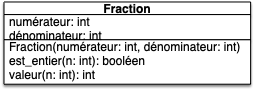
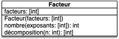
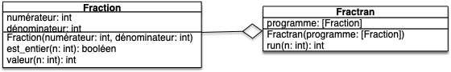

Le but du sujet est de construire un interpréteur !


On utilisera pour cela [le FRACTRAN](https://fr.wikipedia.org/wiki/FRACTRAN) qui est un langage de programmation inventé par John Conway (à qui l'on doit aussi le célèbre [jeu de la vie](https://fr.wikipedia.org/wiki/Jeu_de_la_vie)). Nous allons y aller pas à pas, il suffit de suivre les différentes étapes. Ne vous laissez pas méprendre par sa simplicité, il permet théoriquement de coder tout ce qu'on peut coder en python (mais avec un peu d'effort, je vous l'accorde).



Même si ce n'est pas explicite, on vous rappelle que toute fonction (hors du programme principal) doit être testée.



Créez un dossier `interpréteur-fractran`{.fichier} qui sera le projet vscode où vous placerez vos différents fichiers.


## Fractions

On va commencer par coder une classe `Fraction`{.language-} dont le diagramme UML est :



- La méthode `Fraction.est_entier(n)`{.language-} rend un booléen qui est :
  - `Vrai`{.language-} si le dénominateur de la fraction divise `n`{.language-}
  - `Faux`{.language-} si le dénominateur de la fraction ne divise pas `n`{.language-}
- La méthode `Fraction.valeur(n)`{.language-} rend l'entier résultant de la multiplication du numérateur et de la division entière entre `n`{.language-} et le dénominateur

Les tests suivant explicitent ce fonctionnement :

```python
from fractran import Fraction


def test_Fraction_init():
    assert Fraction(1, 2).numérateur == 1
    assert Fraction(1, 2).dénominateur == 2


def test_Fraction_est_entier():
    assert Fraction(1, 2).est_entier(2)
    assert not Fraction(1, 3).est_entier(2)


def test_Fraction_valeur():
    assert Fraction(3, 2).valeur(4) == 3 * (4 // 2)


```



Implémentez la classe la classe `Fraction`{.language-} dans le fichier `fractran.py`{.fichier} et ses tests dans le fichier `test_fractran.py`{.fichier}.



Vous pourrez utiliser le fait qu'en python :
- `a // b`{.language-} rend la division entière de `a`{.language-} par `b`{.language-},
- `a % b`{.language-} rend le reste de la division entière  de `a`{.language-} par `b`{.language-}.


## Facteurs

Le langage FRACTAN s'utilise en utilisant la décomposition en facteurs premiers des nombres. On doit donc créer une classe permettant de passer d'un nombre à une décomposition (partielle) en facteurs premiers et réciproquement. Pour cela on crée une classe `Facteur`{.language-} dont le diagramme UML est :



- La méthode `Facteur.nombre(L)`{.language-} rend un entier qui vaut le produits des $\text{facteur}[i]^{L[i]}$ pour $0 \leq i < \text{len}(L)$

- La méthode `Fraction.décomposition(n)`{.language-} rend la liste $L$ qui est la décomposition de $n$ selon les facteurs stockées dans `self.facteurs`{.language}. C'est à dire que le retour $L$ de la méthode est telle que $n$ est divisible par $\text{facteur}[i]^{L[i]}$ mais pas par $\text{facteur}[i]^{L[i] + 1}$ pour tout $0 \leq i < \text{len}(\text{facteur})$.

Les tests suivant explicitent ce fonctionnement :

```python
from fractran import Facteur


def test_Facteur_init():
    assert Facteur([2, 3, 7]).facteurs == [2, 3, 7]


def test_Facteur_nombre():
    assert Facteur([2, 3, 7]).nombre([1, 2]) == (2 ** 1) * (3 ** 2)
    assert Facteur([2, 3, 7]).nombre([1, 2, 3]) == (2 ** 1) * (3 ** 2) * (7 ** 3)


def test_Facteur_décomposition():
    assert Facteur([2, 3, 7]).décomposition(1) == [0, 0, 0]
    assert Facteur([2, 3, 7]).décomposition((2**3) * (3**2) * (7)) == [3, 2, 1]

```


Implémentez la classe `Facteur`{.language-} dans le fichier `fractran.py`{.fichier} et ses tests dans le fichier `test_fractran.py`{.fichier}.



Vous pourrez utiliser le fait qu'en python  `a ** b`{.language-} rend $a^b$.


## Fractran


Le Fractran est un langage de programmation où un programme est une liste finie de fractions :

<div>
$$
P = [\frac{p_0}{q_0}, \cdots, \frac{p_i}{q_i}, \cdots, \frac{p_{l-1}}{q_{l-1}} ]
$$
</div>

Son exécution nécessite un paramètre d'entrée $n$ et se déroule comme suit :

- Tant qu'il existe $i$ tel que $q_i$ divise $n$, on pose $n \leftarrow n \cdot \frac{p_{i^\star}}{q_{i^\star}}$ avec $i^\star$ le plus petit indice $i$ tel que $q_i$ divise $n$.
- Lorsqu'il n'existe plus d'indice $i$ tel que $q_i$ divise $n$, le programme s'arrête et rend $n$.


Par exemple si $P = [\frac{3}{10}, \frac{4}{3}]$ alors $P(14) = 14$ (aucun dénominateur ne divise 14) et $P(15) = 8$ (3 divise 15 ; 10 divise 20 ; 3 divise 6 ; aucune fraction ne divise 8).

Le code suivant (écrit dans `fractran.py`{.fichier}) implémente cette idée :

```python
class Fractran:
    def __init__(self, fractions):
        self.programme = fractions

    def run(self, n):
        i = 0
        while i < len(self.programme):
            if self.programme[i].est_entier(n):
                n = self.programme[i].valeur(n)
                i = 0
            else:
                i += 1
        return n
    
```

Et est basé sur l'uml suivant :





Ajoutez le code de la classe dans le fichier `fractran.py`{.fichier} et implémentez des tests de celle-ci dans le fichier `test_fractran.py`{.fichier}.



## Programme Principal

Montrons un peu que le Fractran est un vrai langage de programmation en exhibant les programmes qui permettent de calculer [la somme](https://fr.wikipedia.org/wiki/FRACTRAN#Addition) et [le produit](https://fr.wikipedia.org/wiki/FRACTRAN#Multiplication) de deux entiers.

### Calcul de la somme et du produit


Créez un fichier `main.py`{.fichier} où vous calculerez les sommes $i+j$ de tous les entiers $1\leq i, j \leq 10$.

Vous pourrez utilisez le fait que le _"programme"_ Fractran pour la somme est :

```python
somme = [Fraction(3, 2)]
```

Et travaille avec les facteurs :

```python
facteurs = Facteur([2, 3, 5])
```

Par exemple pour additionner 3 et 4, on pourra utiliser le code :


```python
somme_3_4 = Fractran(somme).run(facteurs.nombre([3, 4]))
```



Ajoutez au fichier `main.py`{.fichier} une partie où vous calculerez les produits $i * j$ de tous les entiers $1\leq i, j \leq 10$.


Le code Fractran du produit est [décrit ici](https://fr.wikipedia.org/wiki/FRACTRAN#Multiplication).



## On crée des programmes incroyables

On peut faire des choses incroyables en Fractran, mais pour cela il faut considérer tous les entiers générés par le programme au cours de son exécution et pas juste rendre le dernier.


Ajoutez à la classe `Fractran`{.language-} une méthode de signature `Fractran.suite(n: int, N:int): [int]`{.language-}. Si $L$ est la liste rendue par la méthode elle doit être telle que :

- $\text{len}(L) \leq N$
- $L[0]$ soit le paramètre d'entrée $n$ de la méthode
- $L[i]$ soit le $i$ème entier généré par le programme.


Le paramètre $N$ garanti que tout programme va s'arrêter : on s'arrête après avoir généré $N-1$ entiers.


Par exemple si $P = [\frac{3}{10}, \frac{4}{3}]$ et $n=15$ :
- si $N \geq 4$ la méthode va rendre $[15, 20, 6, 8]$ 
- si $N = 2$ la méthode va rendre $[15, 20]$ 

Cette nouvelle méthode va nous permettre de générer [la suite de Fibonacci](https://fr.wikipedia.org/wiki/FRACTRAN#Suite_de_Fibonacci) ou encore [tous les nombres premiers](https://fr.wikipedia.org/wiki/FRACTRAN#Algorithme_de_Conway_des_nombres_premiers) en filtrant la liste sortie par l'algorithme.

### Suite de Fibonacci


Ajoutez dans le programme principal le code suivant et explicitez comment il fonctionne (je ne veux pas de preuve, juste une explication du code python) :

```python
print("Fibonacci rend les couples (F(n), F(n+1)) :")
fibonacci = [Fraction(23, 95), Fraction(57, 23), Fraction(17, 39), Fraction(130, 17), Fraction(11, 14), 
          Fraction(35, 11), Fraction(19, 13), Fraction(1, 19), Fraction(35, 2), Fraction(13, 7), 
          Fraction(7, 1)]

sortie_brute = Fractran(fibonacci).suite(3, 1000) 
sortie = []
for n in sortie_brute:
    if n == Facteur([2, 3]).nombre(Facteur([2, 3]).décomposition(n)):
        sortie.append(Facteur([2, 3]).décomposition(n))

print(sortie)

```



### Nombres premiers

Encore pus fort, la suite des nombres premiers !


Ajoutez dans le programme principal le code permettant de rendre tous les nombres premiers trouvés pour 100000 nobres rendu par le programme.



Le code Fractran du produit est [décrit ici](https://fr.wikipedia.org/wiki/FRACTRAN#Algorithme_de_Conway_des_nombres_premiers) (tout comme pour la suite de fibonnaci il faut filtrer la sortie pour ne garder que les nombres premiers)

