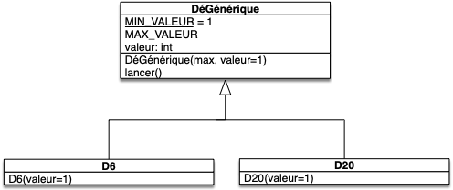
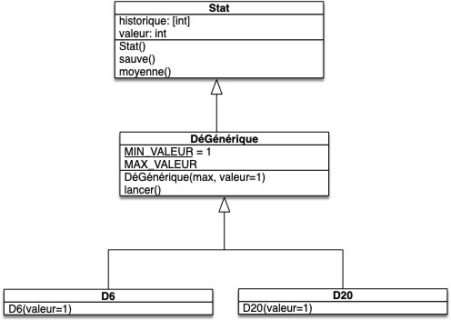

Nous allons modifier notre classe dé pour pouvoir sereinement jouer à [Donjons et dragons](https://fr.wikipedia.org/wiki/Donjons_et_Dragons).

<span id="code-Dé"></span>



fichier `dé.py`{.fichier} :

```python
import random

class Dé:
    MIN_VALEUR = 1
    MAX_VALEUR = 6

    def __init__(self, valeur=1):
        self.valeur = valeur

    def lancer(self):
        self.valeur = random.randrange(self.MIN_VALEUR, self.MAX_VALEUR + 1)

        return self

```

fichier `test_dé.py`{.fichier} :

```python
from dé import Dé


def test_init():
    assert isinstance(Dé(), Dé)


def test_valeur():
    assert Dé().valeur == 1
    assert Dé(valeur=4).valeur == 4


def test_lancer():
    dé = Dé()
    dé.lancer()
    assert Dé.MIN_VALEUR <= dé.valeur <= Dé.MAX_VALEUR


```




## Dés génériques

Si l'on veut pouvoir jouer à Donjons et Dragons il va nous falloir plus que des dés à 6 faces !

Nous allons uniquement implémenter ici les dés à 6 et à 20 faces.

Commençons par faire hériter nos dés :


Implémentez les classes `D6`{.language-} et `D20`{.language-} pour qu'elles respectent le modèle UML suivant :



On veut également que :

- les positions possibles d'un objet dé de type `D6`{.language-} soient entre 1 et 6
- les positions possibles d'un objet dé de type `D20`{.language-} soient entre 1 et 20




```python
import random

class DéGénérique:
    MIN_VALEUR = 1

    def __init__(self, max, valeur=1):
        self.MAX_VALEUR = max
        self.valeur = valeur

    def lancer(self):
        self.valeur = random.randrange(self.MIN_VALEUR, self.MAX_VALEUR + 1)


class D6(DéGénérique):
    def __init__(self, position=1):
        super().__init__(6, position)


class D20(DéGénérique):
    def __init__(self, position=1):
        super().__init__(20, position)

```


Vérifions que tout ceci fonctionne bien :



Créez un fichier `main.py`{.fichier} qui :

1. crée un d6 et un d20
2. affiche les valeurs des dés créés
3. lance les deux dés
4. réaffiche les valeurs des dés créés





```python
from dés import D6, D20

d6 = D6()
d20 = D20()

print(d6.valeur, d20.valeur)
d6.lancer()
d20.lancer()
print(d6.valeur, d20.valeur)

```



## Dés qui comptent

Il n'y a rien de plus méfiant qu'un rôliste. Pour éviter toute contestation nous allons stocker toutes les valeurs prisent par les dés pour pouvoir vérifier qu'ils sont non pipés.

### User Story

Commençons par créer une user story sur la fonctionnalité que l'on veut ajouter :



- Nom : "Statistiques descriptives"
- Utilisateur : un joueur
- Story : On veut compter les moyennes de jets de dés
- Actions :
  1. effectuer 1000 jets d'un d6 et d'un d20
  2. calculer la moyenne de ces jets





Codez la user story en utilisant uniquement la classe `Dé` dans le fichier `story_moyenne.py`{.fichier}.




Fichier `story_moyenne.py`{.fichier} :

```python
from dés import D6, D20


d6 = D6()
d20 = D20()

for _ in range(1000):
    d6.lancer()
    d20.lancer()

print('1000 lancers :', d6.moyenne(), d20.moyenne())

```


### classe `Stat`{.language-}

Nous voulons créer une version particulière d'un dé : un dé permettant de conserver les statistiques de ses lancers.

Pour cela on va utiliser la modélisation UML suivante :






Codez la classe `Stat`{.language-} :

- la méthode `Stat.sauve()`{.language-} ajoute la valeur de son attribut `valeur`{.language-} à la fin de la liste de son attribut `historique`{.language-}.
- la méthode `moyenne`{.language-}  renvoie la moyenne de toutes les valeurs de de son attribut `historique`{.language-}.




Fichier `dé.py`{.fichier} :

```python
class Stat:
    def __init__(self):
        self.valeur = 1
        self.historique = []

    def sauve(self):
        self.historique.append(self.valeur)

    def moyenne(self):
        return sum(self.historique) / max(1, len(self.historique))


```



Que faut-il modifier d'autres pour que la user story fonctionne ?



Il faut modifier deux choses dans la classe `DéGénérique`{.language-} :

- appeler le constructeur de la classe mère dans le constructeur de `DéGénérique`{.language-}
- appeler la méthode `sauve`{.language-} à la fin de la méthode `lancer`{.language-}.

Fichier `dé.py`{.fichier} :

```python
class DéGénérique(Stat):
    MIN_VALEUR = 1

    def __init__(self, max, valeur=1):
        super().__init__()

        self.MAX_VALEUR = max
        self.valeur = valeur

    def lancer(self):
        self.valeur = random.randrange(self.MIN_VALEUR, self.MAX_VALEUR + 1)
        self.sauve()


```

