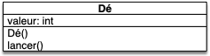

Projet sur le codage d'objets en python. Notre but est de pouvoir créer des dés virtuels pour pouvoir [jouer au 421](https://fr.wikipedia.org/wiki/421_(jeu)).


Lorsque l'on crée un objet qui correspond à un objet réel, il faut faire en sorte que le code l'utilise comme on le ferait dans la réalité.


## Fonctionnalités d'un Dé

Si on veut pouvoir utiliser nos dés virtuels comme un vrai dé physique, la classe `Dé`{.language-} doit être capable de :

- créer un objet sans paramètre (sa position est alors 1),

- connaître et donner la position du dé,
- lancer un dé en utilisant une méthode nommée `lancer()`{.language-} qui ne rend **rien**, mais change la position du dé de façon aléatoire.

La position du dé doit être un entier entre 1 et 6.

### Modélisation UML

Des spécifications précédentes, on doit pouvoir en déterminer la modélisation UML.




Proposez une modélisation UML de la classe `Dé`{.language-}.






### Squelette python


Créez un dossier `projet-dés`{.fichier} sur votre ordinateur et ouvrez-le avec visual studio code pour un faire votre projet.


On va créer tous les fichiers nécessaires dans le projet, mais avant de coder directement commençons par créer le squelette du projet.



Créez le fichier `dé.py`{.fichier} dans le projet et mettez uniquement les méthodes de la classe sans le code proprement dit. 


Pour que votre code soit du code python valide, il faut que chaque bloc ait au moins une instruction. Vous pourrez utiliser l'instruction [`pass`{.language-}](https://www.docstring.fr/glossaire/pass/) qui ne fait rien.




Fichier `dé.py`{.language-} :

```python
class Dé:
    def __init__(self):
        pass

    def lancer(self):
        pass

```





- les **noms** de classe commencent par une **majuscule**
- l'implémentation de la classe est placée dans un **fichier** de même nom mais avec une **minuscule**



En python, beaucoup de choses sont des [conventions](https://en.wikipedia.org/wiki/Convention_over_configuration) (variable privée, premier nom est self, ...) mais tout le monde s'y tient car la lecture du code en devient aisée. Il est facile de savoir de quel type est le nom rencontré en python si l'on utilise les façons de faire classiques, décrites dans la [PEP 8](https://peps.python.org/pep-0008/) de python.


On a pas fini ! Il faut encore écrire les tests relatifs à notre classe. Pour l'instant on ne peut guère que vérifier que l'on crée bien un objet de la classe `Dé`{.language-}.



Créez le fichier `test_dé.py`{.fichier} et testez que le constructeur de la classe `Dé`{.language-} crée bien un objet de la classe `Dé`{.language-}.


Vous pourrez utiliser [la fonction python `isinstance`{.language-}](https://docs.python.org/fr/3.14/library/functions.html#isinstance)




Fichier `test_dé.py`{.language-} :

```python
from dé import Dé


def test_init():
   dé = Dé()
    assert isinstance(dé, Dé)


```

Comme le retour du constructeur est directement l'objet, la variable `dé`{.language-} est inutile et  on peut très bien directement écrire le test suivant :

```python
from dé import Dé


def test_init():
    assert isinstance(Dé(), Dé)


```

Ne confondez pas `Dé`{.language-} est la classe et `Dé()`{.language-} qui est le résultat du constructeur, c'est à dire un objet de la classe `Dé`{.language-}.



Il nous reste une chose à faire pour que notre code python soit conforme à l'UML : la déclaration des attributs. En python les attributs sont affecté dans le constructeur.




Créez les attributs des objets de la classe `Dé`{.language-}.



Fichier `dé.py`{.language-} :

```python
class Dé:
    def __init__(self):
        self.position = 1

    def lancer(self):
        pass

```






Ajoutez un test qu projet qui vérifie que l'attribut `position`{.language-}  d'un objet de la classe `Dé`{.language-} fraîchement crée est bien à !



Fichier `test_dé.py`{.language-} :

```python
from dé import Dé

# ...

def test_position():
   dé = Dé()
    assert dé.position == 1


```

On peut encore une fois raccourcir le test si l'on veut en utilisant directement le retour du constructeur :

```python
from dé import Dé

# ...

def test_position():
    assert Dé().position == 1


```



## Code Classe

Terminons l'implémentation de la classe `Dé`{.language-} en codant la méthode `Dé.lancer()`{.language-}.

Dans la documentation et lorsque l'on décrit une méthode, som nom de la méthode est toujours accolé au nom de la classe qui la définit. Par exemple :  `Dé.lancer()`{.language-} signifie :

- la méthode `lancer`{.language-} de la classe `Dé`{.language-}
- cette méthode ne prend pas de paramètre.


Lorsque l'on décrit une méthode, on ne montre jamais `self`{.language-}. Ce n'est en effet pas un paramètre de la méthode à proprement parlé, c'est l'**objet** de la méthode : il est à gauche du `.`{.language-} lors de l'appel de la fonction.

On pourrait (mais on ne le fait pas parce que c'est moins clair) replacer le code suivant :

```python
>>> un_dé = Dé()
>>> un_dé.lancer()
```

Par le code ci-après qui est équivalent :

```python
>>> un_dé = Dé()
>>> Dé.lancer(un_dé)
```



On a toutes les information nécessaire pour le faire : 


Implémentez la méthode `Dé.lancer()`{.language-}. et ses tests.


Utilisez [le module random](https://docs.python.org/fr/3.14/library/random.html) de python



Fichier `dé.py`{.language-} :

```python
class Dé:
   # ...

    def lancer(self):
        self.position = random.randrange(1, 6 + 1)
```



On a pas fini le code puisqu'il manque les tests de la méthode `Dé.lancer()`{.language-} ! On a cependant un soucis car il est impossible de tester le hasard (on pourrait n'avoir pas de chance et lancer 10 fois le dé sans que la position ne change **sans** que ce soit mal codé). Comme on a besoin que nos fonctionnent toujours, il faut trouver ce qui est toujours vrai après un lancer :


Implémentez un test qui vérifie que la méthode s'est bien exécutée `Dé.lancer()`{.language-} et que la valeur de la position reste entre 1 et 6.



Fichier `test_dé.py`{.language-} :

```python
from dé import Dé

# ...

def test_lancer():
    dé = Dé()
    dé.lancer()
    assert 1 <= dé.position <= 6

```



## User stories


Une [user story](https://fr.wikipedia.org/wiki/R%C3%A9cit_utilisateur) est un récit qui nous permet de savoir comment et par qui va être utilisé notre code.


L'idée est d'écrire une succession d'actions faites par un utilisateur typique afin de réaliser une tâche précise avec notre programme. Par exemple :


- Nom : "Aléatoire ?"
- Utilisateur : un professeur.
- Story : On vérifie que le lancer de dé ressemble à de l'aléatoire.
- Actions :
  1. créer un dé sans paramètre
  2. afficher à l'écran sa position (ça doit être 1)
  3. lancer le dé 10 fois et affiche la position du dé après chaque lancer. Quelle est la probabilité que le dé ne change jamais ?.



Codez cette user story si on devait la coder :



En utilisant la modélisation UML du Dé, codez la user story "Aléatoire" en python dans le fichier `story_aléatoire.py`{.fichier}.



Il y a une probabilité de $\frac{1}{6^{10}} = 1.6 \cdot 10^{-8}$ que le dé ne change jamais de position en 10 lancers.

La user story donnerait en python :

```python
from dé import Dé

# 1. créer un dé sans paramètre
dé = Dé() 

# 2. afficher à l'écran sa position (ça doit être 1)
print(dé.position)

# 3. lancer le dé 10 fois et affiche la position du dé après chaque lancer
for i in range(10):
   dé.lancer()
   print(dé.position)
```



La user story fait office de **test fonctionnel** qui permet de vérifier que le code correspond aux attentes des utilisateurs :


Un **test fonctionnel** est un programme qui démontre les fonctionnalités d'une application. Il est l'implémentation d'une user story.


Au final :


Un programme aura :

- **toujours** des [tests unitaires](https://fr.wikipedia.org/wiki/Test_unitaire) car ils garantissent que ce que vous avez codé est correct
- **très souvent** des [tests fonctionnels](https://en.wikipedia.org/wiki/Functional_testing) car ils garantissent que ce que vous avez codé pourra être utile

On exécutera la batterie de tests unitaires à chaque fois que l'on code ou que l'on modifie une fonction, les tests fonctionnels sont exécutés a chaque fois que l'on achève une fonctionnalité.



Les fonctionnalités développées doivent toutes faire parti d'au moins une user story, sinon c'est [YAGNI](../../coder-projets/écrire-code/bonnes-pratiques/#YAGNI){.interne}.



## Affichage

Pour l'instant, lorsque l'on tente d'afficher un dé on obtient le charabia suivant :

```python
>>> dé = Dé()
>>> print(dé)
<__main__.Dé object at 0x10a691010>
```

Ce qui n'est pas très informatif. On peut bien sur afficher sa position :

```python
>>> dé = Dé()
>>> print(dé.position)
1
```

Mais représenter un dé par un entier ce n'est pas très joli. Nous allons coder une méthode spécifique pour représenter notre objet sous la forme d'une chaîne de caractère : la méthode `Dé.texte()`{.language-}.
 

Créez (et faites les tests) une méthode `Dé.texte()`{.language-} qui permette d'écrire :

```python
>>> d = Dé()
>>> print(d.texte())
⚀
>>> d.position = 4
>>> print(d.texte())
⚃
```



Vous pourrez utiliser les caractères : `"⚀"`{.language-}, `"⚁"`{.language-}, `"⚂"`{.language-}, `"⚃"`{.language-}, `"⚄"`{.language-} et `"⚅"`{.language-} pour vos représentations.


Vous pourrez maintenant utiliser cette méthode pour l'affichage de tous vos dés, en particulier pour les user stories !

## Programme principal

Avant de coder le programme principal :



1. vérifiez que les tests unitaires fonctionnent
2. vérifiez que vos user stories sont toutes fonctionnelles



Une fois tout ok, on peut commencer à créer le code du `main.py`{.fichier} :



Créez un fichier `main.py`{.fichier} qui :

1. demande à l'utilisateur :
   - la position initiale du dé
   - la position pour laquelle arrêter les lancers
2. lance le dé jusqu'à tant que sa position est différente de la position demandée par l’utilisateur soit trouvée.
3. le programme affiche le nombre de lancer nécessaire (cela peut être 0)




Fichier `main.py`{.language-} :

```python
from dé import Dé

position_initiale = int(input("valeur initiale du dé : "))
position_finale = int(input("position finale du dé : "))

dé = Dé()
dé.position = position_initiale

nombre_lancer = 0
while dé.position != position_finale:
    dé.lancer()
    nombre_lancer += 1

print("Il a fallu : ", nombre_lancer, "lancers")

```



## Code Python de la classe Dé


- [Code de la classe python](https://github.com/FrancoisBrucker/cours_informatique/tree/main/docs/src/cours/coder-et-d%C3%A9velopper/apprendre-programmation/programmation-objet/projet-objets-d%C3%A9s/code)
- [Téléchargement du code](https://download-directory.github.io?url=https://github.com/FrancoisBrucker/cours_informatique/tree/main/docs/src/cours/coder-et-d%C3%A9velopper/apprendre-programmation/programmation-objet/projet-objets-d%C3%A9s/code?filename=projet-dé)
