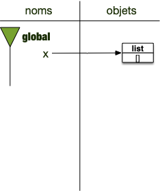
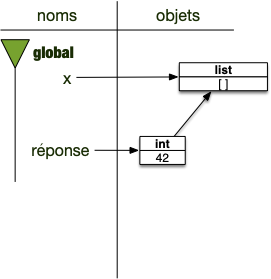
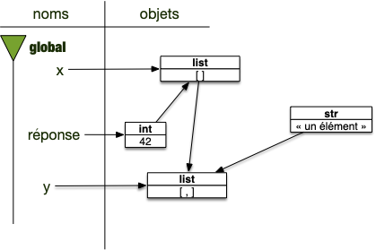


<https://docs.python.org/fr/3/tutorial/introduction.html#lists>


Les listes sont la structure principale lorsque l'on veut stocker plusieurs objets. La liste est un conteneur dont on peut accéder les éléments un à un.


Utilisez la console de <https://console.basthon.fr/> pour exécuter les divers exemples et exercices


Une liste est une classe python.

## Création et références

On crée un objet de type liste comme d'habitude, en mettant son nom suivie de parenthèses :

```python
x = list()
```

Comme la liste fait partie des conteneurs les plus utilisés de python, on peut aussi directement créer une liste avec des crochets :

```python
x = []
```

Les deux instructions précédentes ont créées des liste vides. L'état de l'espace de nommage après l'affectation est :



mais on peut aussi directement créer une liste avec des objets dedans :

```python
x = [1, 4, "douze"]
```

L'exemple précédent à créé une liste de nom `x`{.language-} qui contient l'entier 1 en 1ère position, l'entier 4 en 2ème position et la chaîne de caractères `"douze"`{.language-} en troisième position. L'espace de nommage est alors :


On voit que les 3 objets ne sont pas contenus dans la liste, elle ne possède qu'une référence vers eux. Explicitons ça :

```python
réponse = 42
x = [réponse]
```

Ce qui donne comme espace de nommage :



Le premier élément de la liste est aussi associé à la variable `réponse`{.language-}.

On peut aussi, bien sur faire ce genre de choses :

```python
réponse = 42
x = [réponse]
y = [x, 'un élément']
```

L'espace de nommage est alors :



Remarquez qu'une liste peut avoir une référence à autre liste.

## Affichage

On peut afficher une liste en utilisant la fonction print :

```python
print([1, 4, "douze"])
```

## Accès à un élément d'une liste

On accède à un élément de la liste en faisant suivre le nom de la liste par des `[]` et en mettant l'index voulu dans les crochets. Si `x = [1, 4, "douze"]`{.language-}, alors :

```python
>>> x[0]
1
>>> x[1]
4
>>> x[2]
'douze'
```

Le nombre d'élément d'un conteneur, comme une liste, peut être donné par la fonction `len`{.language-}. Pour l'exemple précédent :

```python
>>> len(x)
3
```

Une chaîne de caractère, bien qu'elle ne soit pas une liste stricto sensu peut-être considérée comme une liste composée de caractères : on peut accéder à un caractère particulier de la chaîne comme on le ferait avec une liste.


Quel est la treizième lettre du mot "anticonstitutionnellement" ?



```text
>>> "anticonstitutionnellement"[12]
't'
```



On peut aussi commencer par la fin, d'index -1 :

```python
>>> x[-1]
'douze'
>>> x[-2]
4
>>> x[-3]
1
```

Pour la chaîne `"PYTHON"`{.language-} :

|            itérable             |  P  |  Y  |  T  |  H  |  O  |  N  |
| :-----------------------------: | :-: | :-: | :-: | :-: | :-: | :-: |
| numérotation à partir du début  |  0  |  1  |  2  |  3  |  4  |  5  |
| numérotation à partir de la fin | -6  | -5  | -4  | -3  | -2  | -1  |


Quel est la quatrième lettre avant la fin du mot "anticonstitutionnellement" ?



```text
>>> "anticonstitutionnellement"[-4]
'm'
```



## Modification d'une liste

Modifier une liste se fait soit en modifiant directement un objet de la liste, soit en ajoutant/supprimant un ou plusieurs de ses éléments.

### Modifier un élément

On accède à un élément qu'on modifie. Par exemple :

```python
x = [1, 4, "douze"]
print(x)
x[2] = 12
print(x)
```

L'élément d'une liste est considérée comme une variable que l'on peut modifier. Il est cependant impossible de modifier un élément qui n'existe pas. Par exemple, le code suivant produira une erreur :

```python
x = [1, 4, "douze"]
x[3] = 12
```

### Ajout d'un élément

Nous utiliserons essentiellement deux façons d'ajouter des éléments à une liste, tous les deux utilisant des [méthodes](../../principes/fonctions-méthodes#méthodes){.interne} des objets de type liste.

Pour ajouter des éléments à une liste, nous utiliserons les méthodes :

- `append`{.language-} qui ajoutent un élément en fin de liste :

  ```python
  >>> x = [1, 4, "douze"]
  >>> x.append("a la fin")
  >>> x
  [1, 4, 'douze', 'a la fin']
  ```

- `insert`{.language-} qui permettent d'ajouter un élément **avant** un indice passé en paramètre. Dans l'exemple, on ajoute un élément avant le l'élément d'indice 0, c'est à dire au début :

  ```python
  >>> x = [1, 4, "douze"]
  >>> x.insert(0, "au debut")
  >>> x
  ['au debut', 1, 4, 'douze']
  >>>
  ```

### Suppression d'un élément

On peut utiliser la commande `del`{.language-} pour supprimer un indice d'une liste~: l'instruction `del l[1]`{.language-} supprime de la liste de nom `l`{.language-} l'indice 1. L'objet associé au nom `l`{.language-} est **modifié**, il n'est plus que de longueur 2.

```python
>>> x = [1, 4, "douze"]
>>> del x[1]
>>> x
[1, 'douze']
```

## Création

On a déjà vu la création directe d'une liste :

```python
>>> x = [1, 4, "douze"]
```

Il existe d'autres façons, indirectes, de créer des listes, utile lorsque les listes sont issues de boucles.

### Avec range

[La fonction `range`{.language-}](../../bloc-répétition/#range){.interne} qui produit des itérateurs peut également permettre de créer des listes.

Par exemple :

```python
>>> list(range(5))
[0, 1, 2, 3, 4]
```

Crée une liste avec les 5 premiers entiers.


La fonction `range`{.language-} ne crée **pas** de listes mais un itérateur.

```python
>>> range(5)
range(0, 5)
```

N'est **pas** une liste.



Pour finir, un petit exercice :


Créez avec une boucle for la liste des 10 premiers carrés (de $0^2$ à $9^2$).



```python
l = []
for i in range(10):
    l.append(i ** 2)
```



### <span id="list-comprehension"></span> Avec une _list comprehension_


<https://docs.python.org/fr/3/tutorial/datastructures.html#list-comprehensions>


```python
l = [i ** 2 for i in range(10)]
```


Créez avec une _list comprehension_ une liste contenant tous les entiers de 0 à 10.



```python
>>> l = [i for i in range(11)]
>>> l
[0, 1, 2, 3, 4, 5, 6, 7, 8, 9, 10]
```




Créez avec une _list comprehension_ une liste contenant toutes les sommes $i + j$ avec i allant de 0 à 10 et j allant de 2 à 5.



```python
>>> l = [i + j for i in range(11) for j in range(2, 6)]
>>> l
[2, 3, 4, 5, 3, 4, 5, 6, 4, 5, 6, 7, 5, 6, 7, 8, 6, 7, 8, 9, 7, 8, 9, 10, 8, 9, 10, 11, 9, 10, 11, 12, 10, 11, 12, 13, 11, 12, 13, 14, 12, 13, 14, 15]
```




Créez avec une _list comprehension_ une liste contenant toutes les sommes $i + j$ avec les i pairs pour les entiers allant de 0 à 10 et j allant de 2 à 5.



```python
>>> l = [i + j for i in range(11) if i % 2 == 0 for j in range(2, 6)]
>>> l
[2, 3, 4, 5, 4, 5, 6, 7, 6, 7, 8, 9, 8, 9, 10, 11, 10, 11, 12, 13, 12, 13, 14, 15]
```




Créez avec une _list comprehension_ une liste contenant toutes les sommes $i + j$ avec les i pairs pour les entiers allant de 0 à 10 et j allant de 2 à 5 si $j-i$ est négatif ou nul.



```python
>>> l = [i + j for i in range(11) if i % 2 == 0 for j in range(2, 6) if j-i <= 0]
>>> l
[4, 6, 7, 8, 8, 9, 10, 11, 10, 11, 12, 13, 12, 13, 14, 15]
```



## Itérer sur une liste

En tant que conteneur, une liste est un itérable. Elle peut peut donc faire partie d'une instruction for :

```python
l = ["bonjour", "tout", "le", "monde", "!"]
for mot in l:
    print(mot)
```

## Présence

Utiliser l'opérateur `in`{.language-} est très utile avec les listes.

```python
>>> l = ["bonjour", "tout", "le", "monde", "!"]
>>> "bonjour" in l
True
>>> 42 in l
False
```

## <span id="listes-classiques"></span> Listes classiques

Quelques listes sont souvent demandées. Voici les moyens en python de les créer.

### Listes d'entiers successifs

On utilise [la fonction `range`{.language-}](../../bloc-répétition/#range){.interne} en combinaison avec le [créateur de liste `list()`{.language-}](https://docs.python.org/fr/3/library/stdtypes.html#list) qui peut prendre un itérable en paramètre.

Par exemple pour la liste des 10 premiers entiers :

```python
>>> L = list(range(10))
>>> L
[0, 1, 2, 3, 4, 5, 6, 7, 8, 9]
```


Créez la liste des entiers pair allant de 22 à 42 (inclut).



```python
>>> L = list(range(22, 43, 2))
>>> L
[22, 24, 26, 28, 30, 32, 34, 36, 38, 40, 42]
```



<span id="listes-classiques-répartis"></span>

Créez une liste d'environ 15 entiers répartis équitablement entre 0 et 99.



```python
>>> L = list(range(0, 100, 100 // 15))
>>> L
[0, 6, 12, 18, 24, 30, 36, 42, 48, 54, 60, 66, 72, 78, 84, 90, 96]
```



### Listes d'entiers décroissants

On peut utiliser la même technique que précédemment. Par exemple, la liste des 10 premiers entiers décroissant :

```python
>>> L = list(range(9, -1, -1))
>>> L
[9, 8, 7, 6, 5, 4, 3, 2, 1, 0]
```

Mais souvent, on utilise la méthode des listes reverse qui renverse une liste :

```python
>>> L = list(range(10))
>>> L.reverse()
>>> L
[9, 8, 7, 6, 5, 4, 3, 2, 1, 0]
```

A noter qu'il existe aussi la [fonction `reversed`{.language-}](https://docs.python.org/fr/3/library/functions.html#reversed) qui rend un itérateur sur les éléments d'un itérable en paramètre, du dernier au premier. On peut donc aussi l'utiliser pour créer une liste duale d'une liste donnée :

```python
>>> L = list(reversed(range(10)))
>>> L
[9, 8, 7, 6, 5, 4, 3, 2, 1, 0]
```

### Listes aléatoires

Mélanger une liste peut se faire avec [le module `random`{.language-} de python](https://docs.python.org/fr/3.14/library/random.html).

Par exemple, la liste de 10 premiers entiers mélangés :

```python
>>> import random
>>> L = list(range(10))
>>> random.shuffle(L)
>>> L
[3, 1, 4, 9, 6, 2, 0, 7, 8, 5]
```


Notez que la fonction [`random.shuffle`{.language-}](https://docs.python.org/fr/3/library/random.html#random.shuffle) ne rend rien. Elle mélange la liste passée en paramètre.


Ou l'utilisation de [`random.randrange`{.language-}](https://docs.python.org/fr/3/library/random.html#random.randrange) pour créer des liste d'entiers aléatoires. Par exemple une liste de 10 nombres valant 0 ou 1 de façon aléatoire :

```python
>>> L = [random.randrange(2) for i in range(10)]
>>> L
[1, 1, 0, 1, 1, 0, 1, 0, 1, 0]
```

## Même liste, noms différents


Modifier un objet le modifie quelque soit sont nom.


Considérez l'exemple suivant :

```python
>>> x = [1, 4, "douze"]
>>> y = x
>>> x[1] = 42
>>> x
[1, 42, 'douze']
```


Que vaut `y`{.language-} ?



```python
>>> y
[1, 42, 'douze']
```

`x`{.language-} et `y`{.language-} sont le **même** objet sous deux noms différents.



## <span id="matrices"></span> Liste de listes

On peut créer des matrices facilement en utilisant des listes de listes. Considérez l'exemple suivant :

```python
M = [[1, 2, 3], [4, 4, 6]]
```

On a crée une variable `M`{.language-} qui contient une liste de 2 listes : c'est une matrice à 2 lignes et 3 colonnes.

- La 1ère ligne de la matrice est `M[0]`{.language-} et la seconde `M[1]`{.language-}
- l'élément à la 1ère ligne et deuxième colonne s'écrit : `M[0][1]`{.language-}

La façon la plus sûre de fabriquer des listes de listes est de le faire avec des boucles for. Par exemple, pour créer une matrice M à 4 lignes et 5 colonnes ne possédant que des 1 :

```python
M = []
for i in range(4):  # lignes
    ligne = []
    for j in range(5): # colonnes
        ligne.append(1)
    M.append(ligne)
```


Créez la matrice identité à 5 ligne et 5 colonnes.



```python
M = []
for i in range(5):  # lignes
    ligne = []
    for j in range(5): # colonnes
        if i == j:
            ligne.append(1)
        else:
            ligne.append(0)
    M.append(ligne)
```



Si on se sent plus hardi, on pourra utiliser des [_list comprehension_](./#list-comprehension){.interne} :


Créez la matrice M à 4 lignes et 5 colonnes ne possédant que des 1 avec une unique _list comprehension_.



```python
>>> M = [[1 for c in range(5)] for l in range(4)]
>>> M
[[1, 1, 1, 1, 1], [1, 1, 1, 1, 1], [1, 1, 1, 1, 1], [1, 1, 1, 1, 1], [1, 1, 1, 1, 1]]
```



On peut aussi utiliser des _list comprehension_ pour créer des matrices plus compliquée, mais il faut souvent ruser car on n'a le droit qu'à une unique instruction par liste compréhension.


Créez la matrice identité à 5 ligne et 5 colonnes avec une unique _list comprehension_. Il pourra être utile de se rappeler le [_AND/OR trick_](../../../principes/opérations#and-or-trick){.interne} avant de résoudre cet exercice.



```python
>>> M = [[(((l == c) and 1) or 0) for c in range(5)] for l in range(5)]
>>> M
[[1, 0, 0, 0, 0], [0, 1, 0, 0, 0], [0, 0, 1, 0, 0], [0, 0, 0, 1, 0], [0, 0, 0, 0, 1]]
```



## Copie

### D'une liste

On utilise le nom de la classe `list`{.language-} qui prend en paramètre un itérable pour créer une liste. Par exemple pour créer une copie de la liste `x = [1, 2, 13]`{.language-} :

```python
>>> x = [1, 2, 13]
>>> y = list(x)
```

Il est pratique de copier une liste car ensuite on peut modifier une liste sans peur des effets de bords :

```python
>>> y[1] = 42
>>> x
[1, 2, 13]
>>> y
[1, 42, 13]
```

Alors que :

```python
>>> x = [1, 2, 13]
>>> y = x
>>> y[1] = 42
>>> x
[1, 42, 13]
>>> y
[1, 42, 13]
```

### <span id="slice"></span> D'une sous-liste


En anglais, cette technique est appelée _slicing_ (des tranches).


On peut copier une partie d'une liste.
Pour **copier la liste l à partir de l'indice i jusqu'à l'indice j avec un pas de k** par exemple : `l[i:j:k]`{.language-}

Il n'est pas nécessaire de renseigner tous les champs. Si $l = [l_0, \dots, l_{n-1}]$, alors :

- `l[i:]`{.language-} sera la liste $[l_i, \dots, l_{n-1}]$
- `l[:i]`{.language-} sera la liste $[l_0, \dots, l_{i-1}]$
- `l[i:j]`{.language-} sera la liste $[l_i, \dots, l_{j-1}]$


que donne `l[::3]`{.language-} ou `l[1::5]`{.language-} pour la liste `[3, 6, 9, 12, 15, 18, 21, 24, 27, 30]`{.language-} ?



```python
>>> l = list(range(3, 31, 3))
>>> l[::3]
[3, 12, 21, 30]
>>> l[1::5]
[6, 21]
```



Le _slicing_ permet aussi de remplacer directement la partie de liste si on procède à une affectation. Par exemple :

```python
>>> l = list(range(10))
>>> l
[0, 1, 2, 3, 4, 5, 6, 7, 8, 9]
>>> l[2:4] = ["deux", "trois"]
>>> l
[0, 1, 'deux', 'trois', 4, 5, 6, 7, 8, 9]
```

### Méthodes des listes


<https://docs.python.org/fr/3/tutorial/datastructures.html#more-on-lists>


Les méthodes de listes, comme les méthodes de chaînes de caractères, sont très utiles. A défaut de les apprendre par cœur, sachez retrouver la documentation pour voir si ce que vous cherchez à faire n'est pas déjà fait.

Par exemple pour ajouter ou supprimer des éléments d'une liste :

- `append`{.language-} ajoute un élément à la fin d'une liste. Par exemple `l.append(3)`{.language-} ajoute l'entier 3 à la fin d'une liste (si `l`{.language-} valait `[1, 4]`{.language-} avant, elle vaudra `[1, 4, 3]`{.language-} après)
- `insert`{.language-} ajoute un élément à un index donné d la liste d'une liste. Par exemple `l.insert(1, "X")`{.language-} insère `"X"`{.language-} à l'indice 1 (si `l`{.language-} valait `[1, 4]`{.language-} avant, elle vaudra `[1, "X", 4]`{.language-} après)
- `del`{.language-} supprime l'élément à l'indice de la liste. Par exemple `del l[0]`{.language-} supprime l'élément d'indice 0 dune liste (si `l`{.language-} valait `[1, 4]`{.language-} avant, elle vaudra `[4]`{.language-} après)


Attention à `remove`{.language-}, `extend`{.language-} ou `pop`{.language-} qui ne font pas ce qu'on croit qu'elle font.

Que font-elles ?



La réponse se trouve dans [la documentation](https://docs.python.org/fr/3/tutorial/datastructures.html#more-on-lists) :

- `remove`{.language-} supprime le **premier** élément trouvé, pas tous
- `extend`{.language-} ajoute les éléments d'une **liste** passée en paramètre à la la liste à gauche du `.`
- `pop`{.language-} supprime le dernier élément de la liste et le rend



Il existe aussi de nombreuses méthodes de chaines de caractères qui utilisent des listes. Citons en deux :

- `split`{.language-} est une méthode des chaînes de caractères qui produit des chaines
- `join(liste)`{.language-} est une méthode des chaînes de caractères qui produit une chaîne à partir d'une liste de chaines de caractère passé en paramètre

Attention cependant lorsque vous utilisez des méthodes :


Certaines méthodes ne **modifient** la liste d'autre produisent de nouvelles liste. LIsez bien la documentation associée à la méthode pour l'utiliser correctement.sur lequel elle est appliquée.


Par exemple la méthode `insert`{.language-} modifie la liste alors que `index`{.language-} ne le fait pas :


Testez le code suivant pour voir la différence ;

```python
ma_liste = list(range(5))
ma_liste.insert(2, "coucou")
un_indice = ma_liste.index("coucou")
print(un_indice)
print(ma_liste[un_indice])
```



Utilisez les méthodes `sort`{.language-} et `reverse`{.language-} (qui modifient les listes) pour résoudre l'exercice suivant :


Créez une liste de 20 entiers aléatoire allant de 1 à 10.

1. afficher cette liste à l'écran
2. triez cette liste puis affichez là à nouveau
3. retournez la liste obtenue en 2 puis affichez là à nouveau
   
   

```python
import random

L = [random.randrange(11) for i in range(20)]
print(L)

L.sort()
print(L)

L.reverse()
print(L)
```



### Lambda et listes

Les fonction lambda permettent d'être utilisée directement dans des méthodes de liste. Par exemple avec [le paramètre `key`{.language-} de la méthode de liste `sort`{.language-}](https://docs.python.org/fr/3/library/stdtypes.html#list.sort). Considérons la liste `l`{.language-} :

```python
l = [["au revoir", 2], ["bonjour", 1]]
```

Si on cherche à trier `l`{.language-}, la liste sera triée en comparant le 1er élément de chaque liste :

```python
l.sort()

print(l)  # donnera [['au revoir', 2], ['bonjour', 1]]
```

Si l'on veut trier sur le deuxième élément de chaque liste, on utilise le paramètre `key`{.language-} qui est une fonction. Les éléments $x$ de la liste seront triés selon $key(x)$ plutôt que $x$ :

```python
def second(x):
    return x[1]

l.sort(key=second)

print(l)  # donnera [['bonjour', 1], ['au revoir', 2]]
```


Que donnerait le tri si la fonction `second`{.language-} avait été définie comme ceci :

```python
def second(x):
    return 1 / x[1]
```




```python
def second(x):
    return 1 / x[1]

l = [["au revoir", 2], ["bonjour", 1]]

l.sort(key=second)

print(l)
```



Utiliser une fonction lambda permet de raccourcir le code précédent tout en le gardant très clair :

```python
l = [["au revoir", 2], ["bonjour", 1]]

l.sort(key=lambda x: x[1])

print(l)  # donnera [['bonjour', 1], ['au revoir', 2]]
```

## Opérateurs de listes

Comme pour les chaines de caractères :

- l'opération `+`{.language-} désigne la concaténation entre deux listes
- l'opération `*`{.language-} par en entier $i$ recopie la liste (ses éléments) $i$ fois.

Par exemple :

```python
>>> [1, 4, "douze"] + [42]
[1, 4, 'douze', 42]
>>> [1, 4, "douze"] * 3
[1, 4, 'douze', 1, 4, 'douze', 1, 4, 'douze']
```

Remarquez que :

- `[1, 4, "douze"] + 42`{.language-} produit une erreur puisque `42`{.language-} est un entier et pas une liste.
- `3 * [1, 4, "douze"]`{.language-} fonctionne également


N'utilisez pas l'opérateur `*`{.language-} pour créer des matrices. C'est le même objet qui est dupliqué. Si les objets dupliqué sont des types de bases, aucun problème mais si le type est un objet modifiable comme un conteneur, cela peut se finir en catastrophe. Ainsi :

```python
>>> M = [[0, 0, 0]] * 3
>>> M
[[0, 0, 0], [0, 0, 0], [0, 0, 0]]
```

`M`{.language-} est constituée de 3 fois la **même** liste :

```python
>>> M[1][1] = 1
>>> M
[[0, 1, 0], [0, 1, 0], [0, 1, 0]]
```


