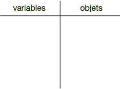
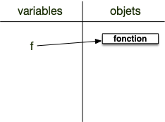
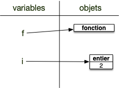
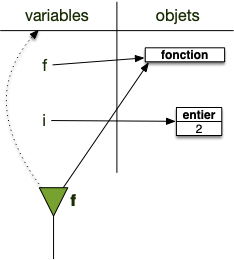
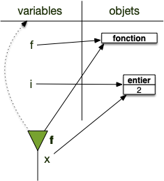
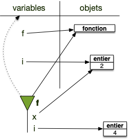
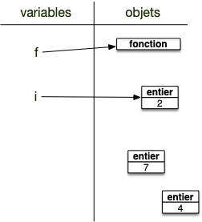
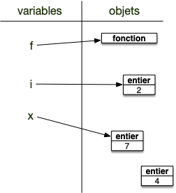
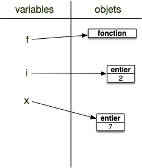

Une fonction est un bloc de code exécutable. On peut lui associer un nom et exécuter ce code juste en l'appelant : ceci permet de ne pas copier/coller des lignes code identiques à différents endroit du programme.

Il n'est jamais bon de copier/coller un bout de programme qui se répète plusieurs fois (corriger un problème dans ce bout de code reviendrait à le corriger autant de fois qu'il a été dupliqué... si on se rappelle des endroits où il l'a été). Il est de plus souvent utile de séparer les éléments logiques d'un programme en unités autonomes, ceci rend le programme plus facile à relire.

## Définition d'une fonction


Une **_fonction_** est [un bloc](../#blocs){.interne} auquel on donne un nom (le nom de la fonction) qui peut être exécuté lorsqu'on l'invoque par son nom.

```python
def <nom>(paramètre 1, paramètre 2, ..., paramètre n):
    instruction 1
    instruction 2
    ...
    instruction n
    return <objet>
```



Les paramètres et la dernière la dernière ligne avec `return`{.language-} sont optionnelles.


La partie de programme suivant définit une fonction :

```python
def salutation():
    print("Comment vas-tu yau de poêle ?")
```

La première ligne est la définition du bloc fonction. Il contient :

- un mot clé spécial précisant que l'on s'apprête à définir une fonction: `def`{.language-}
- le nom de la fonction. Ici `salutation`{.language-}
- des parenthèses qui pourront contenir des paramètres (on verra ça plus tard)
- le `:`{.language-} qui indique que la ligne d'après va commencer le bloc proprement dit

Ensuite vient le bloc fonction en lui-même qui ne contient ici qu'une seule ligne.

Si on exécute le bloc précédent, il ne se passe rien. En effet on n'a fait que définir la fonction. Pour l'utiliser, ajoutez `salutation()`{.language-} à la suite du bloc.


Une **_fonction_** s'utilise toujours en faisant suivre son nom d'une parenthèse contenant ses paramètres séparés par des virgules (notre fonction n'a pour l'instant pas de paramètres). Donner juste son nom ne suffit pas à l'invoquer.


## Nom d'une fonction

Un nom de fonction est une variable comme une autre, on regarde le type d'un nom associé à une fonction :

```python
def salutation():
    print("Comment vas-tu yau de poêle ?")

print(type(bonjour))
```

Le programme suivant exécuté dans vscode vous donnera :

```
<class 'function'>
```

On peut aussi associer la fonction à une autre variable comme on le ferait avec n'importe quel autre objet. Dans l'exemple suivant on associe la fonction à une autre variable, `x`{.language-} :

```python
def salutation():
    print("Comment vas-tu yau de poêle ?")

x = salutation
x()
```

Le programme suivant exécuté dans vscode vous donnera :

```
Comment vas-tu yau de poêle ?
```

En python, lorsque l'on exécute une fonction on dit qu'on **l'appelle**. **_Appeler une variable_** est alors le fait de mettre des `()` après son nom.

Si cela produit une erreur ce n'était pas une fonction. Regardez l'exemple ci-après, exécutable dans un interpréteur. On tente d'appeler un entier et python nous indique que ce n'est pas possible :

```python
>>> n = 3
>>> n()
Traceback (most recent call last):
  File "<stdin>", line 1, in <module>
TypeError: 'int' object is not callable
```

Enfin, en python être une fonction n'est rien d'autre que d'être un **_objet appelable_**. Savoir si un objet est appelable ou pas se fait par la fonction `callable`{.language-}. Examinez les exécutions de code suivantes (exécuté dans un interpréteur, d'où les `...`{.language-}) :

```python
>>> def salutation():
...    print("Comment vas-tu yau de poêle ?")
...
>>> callable(salutation)
True
>>> callable(1)
False
>>> callable("Et toile à matelas ?")
False
```


Les fonctions ne sont pas les seules objets appelables, les types le sont également : le résultat de l'appel du type `int`{.language-} (c'est à dire `int()`{.language-}) crée un entier valant 0.

Il en existe de nombreux autres, python étant friand de ce genre d'opérations.



## Paramètres d'une fonction

La fonction suivante nécessite donc un paramètre pour être invoquée :

```python/
def plus_moins(nombre):
    if nombre > 42:
        print("Supérieur à 42")
    else:
        print("Inférieur à 42")
```

Pour l'exécuter, il faut lui donner un objet qui sera transmis à la fonction pour son exécution, par exemple : `plus_moins(17)`{.language-}. La variable nombre sera ici associée à l'objet entier de valeur 17 dans la fonction.


Les _paramètres_ d'une fonction sont des **noms** de variables qui ne seront connus qu'à l'intérieur de la fonction. À l'exécution de la fonction, le nom de chaque paramètre est associé à l'objet correspondant.


Entraînons nous à écrire des fonctions avec des paramètres :


Créez et testez une fonction nommée `cube`{.language-} qui prend un entier en paramètre et affiche cet élément au cube.



```python
def cube(x):
    print(x ** 3)

cube(2)
```




Créez et testez une fonction nommée `puissance`{.language-} qui prend deux entiers en paramètre et affiche à l'écran le premier paramètre élevé à la puissance du second paramètre.



```python
def puissance(x, y):
    print(x ** y)

puissance(2, 3)
puissance(3, 2)
```




Il est possible de donner des paramètres par défaut aux fonctions. Le code suivant par exemple ajoute un paramètre à la fonction `plus_moins`{.language-} et lui donne une valeur par défaut :

```python
def plus_moins(nombre, seuil=42):
    if nombre > seuil:
        print("Supérieur à", seuil)
    else:
        print("Inférieur à", seuil)

```

On peut alors utiliser la fonction comme précédemment, `plus_moins(20)`{.language-}, ou en utilisant le paramètre seuil `plus_moins(20, seuil=10)`{.language-}.


Comme le paramètre par défaut est le deuxième on peut aussi l'utiliser sans le nommer : `plus_moins(20, 10)`{.language-}


Ajoutons un paramètre par défaut à une des fonctions précédemment crées :


Créez et testez une fonction nommée `puissance`{.language-} qui prend deux entiers en paramètre et affiche le premier paramètre élevé à la puissance du second paramètre. Le second paramètre vaut 2 par défaut.



```python
def puissance(x, y=2):
    print(x ** y)
```



## Retour d'une fonction


Toute fonction rend une valeur. On utilise le mot-clef `return`{.language-} suivi de la valeur à rendre pour cela et ce sera toujours la dernière instruction effectuée.




Par exemple la fonction suivante rend le double de la valeur de l'objet passé en paramètre:

```python
def double(valeur):
    x = valeur * 2
    return x
```

Il ne sert à rien de mettre des instructions après une instruction `return`{.language-} car dès qu'une fonction exécute cette instruction, elle s'arrête en rendant l'objet en paramètre.  La fonction suivante rendra par exemple toujours 42, la 5ème ligne n'étant **jamais** exécutée :

```python/
def double(valeur):
    x = valeur * 2

    return 42
    return x
```

Le retour d'une fonction est pratique pour calculer des choses et peut ainsi être affecté à une variable.


Définissez la fonction précédente dans un fichier python puis exécutez là.

Puis, dans une seconde cellules collez la ligne ci-après puis exécutez la.

```python
print(double(21))
```



Le résultat de la cellule devrait être : 42.

Le code précédent exécute la fonction de nom `double`{.language-} avec comme paramètre un entier de valeur `21`{.language-}. La fonction commence par associer à une variable nommée `valeur`{.language-} l'objet passé en paramètre (ici un entier de valeur `21`{.language-}), puis crée une variable de nom `x`{.language-} à laquelle est associée un entier de valeur `42`{.language-} et enfin se termine en retournant comme valeur l'objet de nom `x`{.language-}. Les variables `valeur`{.language-} et `x`{.language-} définies à l'intérieur de la fonction sont ensuite effacées (pas les objets, seulement les noms).

Cette valeur retournée est utilisée par la commande `print`{.language-} pour être affichée à l'écran.


Enfin, python ajoute ajoute implicitement à toute fonction une dernière ligne avec l'instruction `return None`{.language-} : toute fonction rendra toujours quelque chose, au pire `None`{.language-}. Par exemple la fonction suivante rendra l'objet `None`{.language-} :

```python/
def affiche_double(valeur):
    x = valeur * 2
    print(x)
```

L'usage veut qu'une fonction qui rende `None`{.language-} soit considérée comme une fonction ne rendant rien.

## Fonction en paramètre

Une fonction étant un objet comme un autre, elle peut très bien être utilisée comme paramètre :

```python
def calcul(fct, z):
    return fct(2, 17) + z
```

Le premier paramètre de la fonction `calcul`{.language-} est appelé avec deux paramètres et son résultat est additionné au second paramètre.

La ligne suivante est alors du python correct si on a au préalable définit `produit`{.language-} comme une fonction à deux paramètres :

```python
def produit(x, y):
    return x * y


print(calcul(produit, 8))
```


Exécutez le code précédent et expliquer son fonctionnement



Le code final doit définir produit avant son utilisation. Il faut par exemple avoir le code :

```python/
def calcul(fct, z):
    return fct(2, 17) + z

def produit(x, y):
    return x * y

print(calcul(produit, 8))
```

Notez que lors de la définition de la fonction `calcul`{.language-}, la variable `fct`{.language-} n'est qu'un paramètre anonyme. Ce paramètre ne doit être défini que lors de son appel, à la ligne 7.

La ligne 7 fonctionne alors comme suit :

1. l'objet de type fonction de nom `produit`{.language-} est passé en paramètre de la fonction `calcul`{.language-}
2. le retour de l'appel `calcul(produit, 8)`{.language-} est égal à $8 + (2 * 17) = 42$ puisque `fct`{.language-} est la fonction `produit`{.language-}.
3. son retour (42) est ensuite affiché à l'écran grâce à la fonction `print`{.language-}



## Lambda


<https://python-reference.readthedocs.io/en/latest/docs/operators/lambda.html>


Les lambda sont ue façon d'écrire rapidement une fonction avec une unique instruction.

Les deux codes suivant sont identiques :

```python
double = lambda x: 2 * x
```

et :

```python
def double(x):
    return 2 * x
```

On peut très bien définir une fonction lambda et l'utiliser directement :

```python
x = (lambda x:2 * x)(21)
```

La variable `x`{.language-} vaudra 42, puisque résultat de l'exécution de la fonction lambda `lambda x:2 * x`{.language-} avec 21 comme paramètre.

Une fonction lambda peut avoir plusieurs paramètres, par exemple la fonction suivante qui rend le produit de deux objets passés en paramètre :

```python
produit = lambda x, y: x * y
```

Le principal intérêt de ces fonction est d'être utilisée comme paramètre d'autres fonction. En reprenant l'exemple précédent on pourrait ainsi écrire :

```python
print(calcul(lambda x, y: x * y, 8))
```

## Annotations de type


<https://docs.python.org/fr/3.10/library/typing.html>


Les annotations de types permettent de renseigner le type des entrées et de la sortie d'une fonction python. Il n'est pas nécessaire de le faire, mais si vous avez besoin d'expliciter une signature de fonction comme on le ferait dans un langage compilé comme java, vous pouvez le faire en ajoutant :

- son type à chaque paramètre (précédé d'un `:`)
- le type de sortie (précédé d'un `->`)

Par exemple, la fonction suivante permet de savoir si un élément est dans une liste :

```python
def recherche(t, x):
    for e in t:
        if e == x:
            return True
    return False
```

Si l'on veut restreindre cette fonctions aux listes d'entier on pourra écrire :

```python
def recherche(t: [int], x: int) -> bool
    for e in t:
        if e == x:
            return True
    return False
```


La plupart du temps, pour de petits programme, ce genre de précision n'est pas importante. Elle ne devient cruciale que lorsque la base de code grossit et que spécifier les types d'entrée évite les bugs.

Mais alors, il est de toute façon plus pertinent d'écrire dans un autre langage que python... Plus adapté au développement de grosses applications comme le java ou encore le rust.



## <span id="espace-nommage"></span>Espaces de nommages et fonctions

Pour faire en sorte que les noms des paramètres et les variables définies dans le corps de la fonction ne soient pas visible du reste du programme python utilise les **_espaces de nommage_** que nous avons déjà entre-aperçus [lorsque l'on a parlé de modules](../principes/modules/#définition-espace-nommage){.interne}.



Lorsqu'une fonction est exécutée, un espace de nommage initialement vide est créé pour elle. Y seront stocké ses paramètres et toutes les variables créés dans le code de la fonction. Une fois la fonction terminée, l'espace de nom est détruit.



Un espace de nom étant une table de correspondance entre des nom et des objets, les objets créé ne sont pas détruits une fois l'espace de nom détruit, ce qui permet de transmettre, via le retour des fonctions, des objets créés dans la fonction au programme appelant la fonction.


Illustrons ce mécanisme avec un exemple. On considère le code suivant :

```python/
def f(x):
   i = 2 * x
   return i + 3

i = 2
x = f(i)
```

Que l'on exécute ligne à ligne :

1. avant l'exécution de la première ligne :
   1. on a un unique espace de nommage qui est l'espace des variables
      
2. la ligne 2 définit une fonction de nom `f`{.language-} qui est ajouté à l'espace de noms courant.
   
3. on passe directement à la ligne 5 puisque les lignes 2 et 3 sont le contenu de la fonction.
   1. Cette ligne crée un objet entier (valant 2) et l'affecte au nom `i`{.language-}.
      
4. la ligne 6 est encore une affectation. On commence par trouver l'objet à droite du `=` c'est le résultat de `f(i)`{.language-}. Il faut donc exécuter la fonction `f`{.language-} pour connaître cet objet :
   1. on cherche l'objet associé à `i`{.language-} qui sera le (premier) paramètre de la fonction
   2. on crée un espace de noms dans lequel sera exécuté la fonction. Cet espace est lié à l'espace des variables (c'est la flèche en pointillée) :
      
   3. on affecte le premier paramètre de `f`{.language-} au nom `x`{.language-} (le nom du premier paramètre de `f`{.language-} lors de sa définition) :
         
   4. on exécute la ligne 2 qui est la première ligne de la fonction `f`{.language-}. On crée un objet entier (valant 4) qui est le résultat de l'opération à droite du `=`{.language-} (notez que le nom `x`{.language-} est bien défini dans l'espace de noms de la fonction) et on l'affecte au nom `i`{.language-} :
         
   5. on exécute la ligne 3 :
      1. on crée l'objet résultant de l'opération somme (un entier valant 7) et qu'on garde comme étant le retour de la fonction
      2. la fonction est terminée, son espace de noms courant est détruit
      3. l'espace de noms courant devient l'espace des variables :
         
      4. on rend l'objet résultat de la fonction
   6. la droite du signe `=`{.language-} de la ligne 6 est trouvée (c'est un entier valant 7) et il est affecté à la variable `x`{.language-} de l'espace de noms courant (qui est à nouveau `global`)
      1. 
      2. les objets sans noms sont détruits
         



Les noms de paramètres d'une fonction et les variables déclarée à l'intérieur de la fonction n'existent qu'à l'intérieur de celle-ci. En dehors de ce blocs, ces variables n'existent plus.

