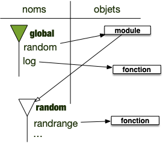

Nous avons déjà abordé la notion d' lorsque :

- on a paré de modules : [l'espace de nommage du module](../principes/modules/#définition-espace-nommage){.interne} et accès aux éléments via [la notation pointée](../principes/modules/#définition-notation-pointée){.interne}
- on a parlé des fonctions : [l'espace de nommage et fonctions](../création-fonctions/#espace-nommage){.interne}

Les espaces de nommage permettent de lier variables et objets :

- on considère que les objets sont stockés dans **_l'espace des objets_** : cet espace est **unique**
- on accède aux objets via leurs noms, eux même stockés dans des **_espaces de nommage_** qui sont des objets comme les autres : il y en a de **nombreux**.

Pour chaque _espace de nommage_ :

- il ne peut y avoir 2 noms identiques
- à chaque nom est associé un objet
- certains espaces de noms possèdent un parent qui sera utilisé si on ne trouve pas un nom.

De façon formelle :

<span id="définition-espace-nommage"></span>


Un **_espace de nommage_** est table de correspondance ([un dictionnaire](../conteneurs/dictionnaires){.interne}) associant des noms (les clés) à des objets (les valeurs). 
Il contient également un lien vers son **_parent_** qui est soit :

- vide
- un autre espace de nommage
- l'espace des variables


Par exemple les espaces de nommages associés aux modules on par exemple un parent vide et ceux créés par les fonctions dépendant de l'espace de nommage qui les a appelé.


Les espaces de nommages sont utilisés à de nombreux endroits dans python et sont là pour : 

1. gérer les noms et leurs objets associés
2. séparer les responsabilités et cloisonner les noms auxquels ont accès les différentes parties d'un programme


On accède aux noms (et donc aux objets qu'ils référencent) des espaces de noms d'un objet en utilisant la notation pointée :

<span id="définition-notation-pointée"></span>


Le **_notation pointée_** permet d'accéder aux noms d'un espace de nommage. Si `o`{.language-} est un objet contenant un espace de nom on peut :

- accéder à un nom `n`{.language-} défini dans l'espace un nom de `o` avec l'instruction `o.n`{.language-} (si on a importé le module random on peut utiliser la fonction `randrange`{.language-} qui y est défini avec l'instruction `random.randrange(1, 7)`{.language-}). 
- affecter un nom `n`{.language-} dans l'espace un nom de `o` avec l'instruction `o.n = <objet>`{.language-} (par exemple `o.n = 42`{.language-}). 



Avant de détailler ce mécanisme, commençons par rappeler ce qu'est un nom et un objet pour python.

## Rappel sur les variables et les objets

Commençons par quelques rappels et précisions sur les variables et leurs liens avec les objets :

- tout ce que manipule un programme est appelé objet.
- les variables sont des noms via lesquels on accède aux objets. On dit aussi parfois qu'une variable est une **_référence_** à un objet.



Pour qu'un programme objet fonctionne, on a besoin de deux mécanismes :

- un moyen de stocker des données et de les manipuler (les objets et leurs méthodes)
- un moyen d'y accéder (les variables)



### Objets

Un objet est une structure de donnée générique permettant de gérer tout ce dont à besoin un programme :

- des données
- des fonctions
- des modules
- ...



Tout est objet dans un langage objet.



### Variables

Les variables sont des références aux objets. Pour ce faire, on utilise l’opérateur d’affectation `=`{.language-} :

```txt
variable = objet
```

A gauche de l’opérateur `=`{.language-} se trouve une **variable** (en gros, quelque chose ne pouvant commencer par un nombre) et à droite un **objet**. Dans toute la suite du programme, dès que le programme rencontrera le nom, il le remplacera par l'objet.


Une variable n'est **pas** l'objet, c'est une référence à celui-ci


La variable peut être vue comme un **nom** de l'objet à ce moment du programme. Un objet pourra avoir plein de noms différents au cours de l'exécution du programme, voire plusieurs noms en même temps.

Pour s'y retrouver et avoir une procédure déterministe pour retrouver les objets associés aux variables, voire choisir parmi plusieurs variables de même nom, elles sont regroupées par ensembles — nommés **espaces de noms** — hiérarchiquement ordonnés.

## <span id="espace-variable"></span> Espaces des variables

L'espace des variables peut-être vu comme un espace de nom particulier : c'est celui qui est créé au début de l'exécution de l'interpréteur.


Au démarrage d'une exécution d'un programme, l'espace des variables est créé. C'est à partir de lui que toutes les variables doivent être atteintes.


Au départ, cet espace il ne contient rien, à part des variables spéciales (qui ont des noms commençant et finissant par `__`{.language-}) utilisées par python. On en verra certaines pendant ce cours, mais ce qu'il faut retenir c'est que ces variables permettent à python de fonctionner. Elles sont mises à disposition des développeurs mais on ne les utilisera jamais dans un usage courant.

Pour voir les noms définis dans l'espace de noms des variables, on utilise en python [la fonction `globals()`{.language-}](https://docs.python.org/fr/3.14/library/functions.html#globals) qui rend **le** dictionnaire dont les clés sont les noms des variables et les valeurs les objets associés.

```python
>>> type(globals())
<class 'dict'>
>>> globals().keys()
dict_keys(['__name__', '__doc__', '__package__', '__loader__', '__spec__', '__builtins__'])
```

On voit que des variables existent dès le démarrage de python. Ces variables ne sont pas là pour être utilisées par nous mais sont indispensables au bon fonctionnement de python. Elles existent pour tout espace de nommage et permettent leur bon fonctionnement. En deux mots :

- `__name__`{.language-} : désigne le nom de l'espace de nommage pour python.
- on reverra `__doc__`{.language-}, `__package__`{.language-}, `__loader__`{.language-} et `__spec__`{.language-} lorsque l'on regardera les espaces de noms de modules. Pour l'espace des variables, elles sont non utilisées et valent `None`{.language-}
- `__builtins__`{.language-} est un module et contient toutes les fonctions de python (il contient les noms `print`, `input`, etc)


Certains langages vont cacher leur fonctionnement interne à l'utilisateur. Ce n'est pas le cas de python qui veut que tout soit **explicite** : on a accès via ces variables spéciales, appelées _dunder_ et commençant et finissant par deux [underscores](https://fr.wikipedia.org/wiki/Tiret_bas).



Regardons un peu tout ça


que vaut `__main__`{.language} dans l'espace des variables ?


On exécute un interpréteur et on regarde la valeur de sa variable :

```shell
❯ python
Python 3.14.3 (main, Feb  3 2026, 15:32:20) [Clang 17.0.0 (clang-1700.6.3.2)] on darwin
Type "help", "copyright", "credits" or "license" for more information.
>>> __name__
'__main__'

```

Le nom de l'espace des variable est `__name__`{.language} pour python.


Ajoutons une variable et vérifions qu'elle est bien ajoutée à l'espace des variables :

```python
>>> x = "youhou ! Je suis là !"
>>> globals().keys()
dict_keys(['__name__', '__doc__', '__package__', '__loader__', '__spec__', '__builtins__', 'x'])
```

Notre variable a bien été ajouté à l'espace des noms ! Comme c'est un dictionnaire, on peut y accéder directement :

```python
>>> globals()['x']
'youhou ! Je suis là !'
```

Qui est équivalent à :

```python
>>> print(x)
'youhou ! Je suis là !'
```

Voir même y ajouter directement des variables. La ligne suivante est équivalente à affecter une nouvelle variable `y`{.language-} :

```python
>>> globals()['y'] = "je suis un véritable hacker."
```

Vérifions le :

```python
>>> print(y)
je suis un véritable hacker.
```


L'espace de variable est l'espace de nommage principal. On doit pouvoir accéder à tous les objets via celui-ci.



## <span id="espace-modules"></span> Espaces de nommage des modules

On a vu qu'un module contenait [un espace de nommage](../principes/modules/#définition-espace-nommage){.interne} auquel on pouvait accéder via [la notation pointée](../principes/modules/#définition-notation-pointée){.interne}.

Tout comme la fonction `globals()`{.language-} permet d'accéder au dictionnaire contenant la table de relation entre variables et objets, il est possible d'accéder au dictionnaire contenant les noms stockés dans l'espace de nommage d'un objet `o`{.language-} (en particulier d'un module) en utilisant [la fonction `vars(o)`{.language-}](https://docs.python.org/fr/3.14/library/functions.html#vars).

Testons cela en regardant si `print`{.language-} est dans le module `__builtins__`{.language-} :

```python
>>> 'print' in vars(__builtins__)
True
```

Oui ! On peut aussi voir toutes les fonction par défaut de python en exécutant par exemple le bout de code suivant (attention, il y en a beaucoup) :

```python
for x in vars(__builtins__):
   print(x)
```

Regardons de plus prêt les différentes variables définies dans un module :



Dans un projet vscode créez deux fichiers :

- un fichier `main.py`{.language-} contenant le code :
   ```python
   import mon_module

   print(vars(mon_module).keys())
   ```
- un fichier `mon_module.py`{.language-} contenant le code suivant :
   ```python
   """ Une documentation de mon module 
   """

   une_variable = 42
   def une_fonction():
      print(une_variable)
   ```

Pius exécutez le fichier avec la commande `python main.py`.



Lorsque vous exécutez le fichier `main.py`{.fichier} vous devriez voir :

```shell
❯ python main.py
dict_keys(['__name__', '__doc__', '__package__', '__loader__', '__spec__', '__file__', '__cached__', '__builtins__', 'une_variable', 'une_fonction'])
```

On retrouve bien :

- les variables spéciales de l'espace de variables (`__name__`{.language-},`__doc__`{.language-}, `__packages__`{.language-}. `__loader__`{.language-}, `__spec__`{.language-} et `__builtins__`{.language-})
-  deux nouvelles variables :
   -  `__file__`{.language-} : qui contient le nom du fichier contenant le module
   - `__cached__`{.language-} : qui contient le fichier compilé du module (ce fichier est crée lorsque lors du premier import et accélère les futurs accès)
- notre variable et notre fonction : `une_variable`{.language-} et `une_fonction`{.language-}


Que valent les différentes variables spéciales sauf `__builtins__`{.fichier} du module `mon_module`{.language-} ?



Le plus simple est d'afficher toutes les variables une à une en ajoutant le code suivant au fichier `main.py`{.fichier}  :

```python
import mon_module

print(vars(mon_module).keys()) 
print()

for key, value in vars(mon_module).items():
    if key != "__builtins__":
        print("nom :", key, " valeur :", value)

```

Son exécution donne :

```shell
❯ python main.py
dict_keys(['__name__', '__doc__', '__package__', '__loader__', '__spec__', '__file__', '__cached__', '__builtins__', 'une_variable', 'une_fonction'])

nom : __name__  valeur : mon_module
nom : __doc__  valeur : Une documentation de mon module

nom : __package__  valeur :
nom : __loader__  valeur : <_frozen_importlib_external.SourceFileLoader object at 0x102dab750>
nom : __spec__  valeur : ModuleSpec(name='mon_module', loader=<_frozen_importlib_external.SourceFileLoader object at 0x102dab750>, origin='/Users/fbrucker/Desktop/prog-objet/mon_module.py')
nom : __file__  valeur : /Users/fbrucker/Desktop/prog-objet/mon_module.py
nom : __cached__  valeur : /Users/fbrucker/Desktop/prog-objet/__pycache__/mon_module.cpython-314.pyc
nom : une_variable  valeur : 42
nom : une_fonction  valeur : <function une_fonction at 0x102e6aa30>

```



L'exercice précédent vous a montré que :

- le nom du module (`__name__`{.language-}) vaut le nom du fichier et plus `__name__`{.python}. C'est ce qui permet de différentier l'espace des variables de tous les autres espaces de nommage
- la variables `__doc__`{.language-} vaut la chaîne de caractères du début du fichier ! C'est le moyen que donne python pour créer l'aide d'un module. Si vous tapez dans un interpréteur `help(mon_module)`{.language-} après l'avoir importé vous retrouverez cette chaîne de caractères.


Enfin, tout comme l'espace de variable on peut ajouter ou modifier des nom qui y sont définis en utilisant la notation pointée :

```python
import mon_module

mon_module.autre_variable = "quarante-deux"
```

Il est bien sur non conseillé de le faire par ce qu'on peut **Tout modifier**. Par exemple se conformer à [une loi de l'Indiana](https://www.youtube.com/watch?v=1Bn50keR6UY) :

```python

import math

math.pi = 3.2
```

## <span id="espace-variable"></span> Espaces local et hiérarchie des espaces de nommages

L'exécution de fonction nécessite l'utilisation d'espaces de nommages pour
compartimenter l'usage des variables.


L'interpréteur possède à chaque instant **_un espace de nommage courant_**  qui est l'espace par défaut des noms :

- python commence par rechercher un nom dans cet espace puis cherche dans l'espace parent s'il n'est pas trouvé
- python affectera toujours un nom dans cet espace (hors notation pointée)

Par défaut l'espace de nommage courant est l'espace des variables.


Pour voir les noms définis dans l'espace de noms courant, on utilise en python [la fonction `locals()`{.language-}](https://docs.python.org/fr/3.14/library/functions.html#locals) qui rend **le** dictionnaire dont les clés sont les noms des variables et les valeurs les objets associés.

Cet espace de nommage courant va changer au cours du temps selon le contexte :

- au démarrage de l'interpréteur l'espace de nommage courant est l'espace des variables
- lors de l'import de module l'espace de nom courant est celui du module
- lors de l'exécution de fonction l'espace de nommage courant est l'espace créé pour son exécution.


```python
def f():
      print(locals())


def f(x):
      print(locals())


def f(x):
      print(locals())
      if x > 0:
            f(x-1)

```

`mon_module.py`{.fichier} :

```python
x = "coucou"

print(locals()["__name__"])
```

`main.py`{.fichier} :

```python

import mon_module
print(locals()["__name__"])

```

> TBD lors de l'import l'espace de nommage est celui cré pour l'import.
> 
 Un autre endroit où les espace de nommages sont crées
> TBD locals 
> TBD fonctions.
> TBD trouver une variable au delà de son espace mais affectation dans l'espace locale

> TBD fonctions récursives


<!-- 
## Exemple

On peut maintenant reprendre un exemple de [la partie variable et objet](../principes/variables/) à l'aune des espace de nommage. Considérons le programme suivant :

```python
x = 1
y = 1
```

Exécutons le ligne à ligne :

1. avant l'exécution de la première ligne :
   1. on a un unique espace de nommage qui correspond à nos variables

      ```python
      >>> globals()
      {'__name__': '__main__', '__doc__': None, '__package__': '_pyrepl', '__loader__': <_frozen_importlib_external.SourceFileLoader object at 0x100d20fb0>, '__spec__': ModuleSpec(name='_pyrepl.__main__', loader=<_frozen_importlib_external.SourceFileLoader object at 0x100d20fb0>, origin='/opt/homebrew/Cellar/python@3.13/3.13.0_1/Frameworks/Python.framework/Versions/3.13/lib/python3.13/_pyrepl/__main__.py'), '__annotations__': {}, '__builtins__': <module 'builtins' (built-in)>, '__file__': '/opt/homebrew/Cellar/python@3.13/3.13.0_1/Frameworks/Python.framework/Versions/3.13/lib/python3.13/_pyrepl/__main__.py', '__cached__': '/opt/homebrew/Cellar/python@3.13/3.13.0_1/Frameworks/Python.framework/Versions/3.13/lib/python3.13/_pyrepl/__pycache__/__main__.cpython-313.pyc'}
      ```

2. on exécute la première ligne. Elle s'exécute ainsi :
   1. on commence à droite du `=`{.language-} : on crée un objet de type entier
   2. on crée le nom `x`{.language-} dans l'espace de noms courant (ici `global`{.language-}) et on lui affecte l'objet.

      ```python
      >>> x = 1
      >>> globals()
      {'__name__': '__main__', '__doc__': None, '__package__': '_pyrepl', '__loader__': <_frozen_importlib_external.SourceFileLoader object at 0x100d20fb0>, '__spec__': ModuleSpec(name='_pyrepl.__main__', loader=<_frozen_importlib_external.SourceFileLoader object at 0x100d20fb0>, origin='/opt/homebrew/Cellar/python@3.13/3.13.0_1/Frameworks/Python.framework/Versions/3.13/lib/python3.13/_pyrepl/__main__.py'), '__annotations__': {}, '__builtins__': <module 'builtins' (built-in)>, '__file__': '/opt/homebrew/Cellar/python@3.13/3.13.0_1/Frameworks/Python.framework/Versions/3.13/lib/python3.13/_pyrepl/__main__.py', '__cached__': '/opt/homebrew/Cellar/python@3.13/3.13.0_1/Frameworks/Python.framework/Versions/3.13/lib/python3.13/_pyrepl/__pycache__/__main__.cpython-313.pyc', 
      'x': 1}
      ```

3. on exécute la deuxième ligne. Elle s'exécute ainsi :
   1. on commence à droite du `=`{.language-} : on crée un objet de type entier
   2. on crée le nom `y`{.language-} dans l'espace de noms courant (ici `global`{.language-}) et on lui affecte l'objet.

      ```python
      >>> x = 1
      >>> y = 1
      >>> globals()
      {'__name__': '__main__', '__doc__': None, '__package__': '_pyrepl', '__loader__': <_frozen_importlib_external.SourceFileLoader object at 0x100d20fb0>, '__spec__': ModuleSpec(name='_pyrepl.__main__', loader=<_frozen_importlib_external.SourceFileLoader object at 0x100d20fb0>, origin='/opt/homebrew/Cellar/python@3.13/3.13.0_1/Frameworks/Python.framework/Versions/3.13/lib/python3.13/_pyrepl/__main__.py'), '__annotations__': {}, '__builtins__': <module 'builtins' (built-in)>, '__file__': '/opt/homebrew/Cellar/python@3.13/3.13.0_1/Frameworks/Python.framework/Versions/3.13/lib/python3.13/_pyrepl/__main__.py', '__cached__': '/opt/homebrew/Cellar/python@3.13/3.13.0_1/Frameworks/Python.framework/Versions/3.13/lib/python3.13/_pyrepl/__pycache__/__main__.cpython-313.pyc', 
      'x': 1, 
      'y': 1}
      >>> 
4. on peut aussi supprimer une variable et la voir disparaître de lk'espace des variables :

      ```python
      >>> x = 1
      >>> y = 1
      >>> del x
      >>> globals()
      {'__name__': '__main__', '__doc__': None, '__package__': '_pyrepl', '__loader__': <_frozen_importlib_external.SourceFileLoader object at 0x100d20fb0>, '__spec__': ModuleSpec(name='_pyrepl.__main__', loader=<_frozen_importlib_external.SourceFileLoader object at 0x100d20fb0>, origin='/opt/homebrew/Cellar/python@3.13/3.13.0_1/Frameworks/Python.framework/Versions/3.13/lib/python3.13/_pyrepl/__main__.py'), '__annotations__': {}, '__builtins__': <module 'builtins' (built-in)>, '__file__': '/opt/homebrew/Cellar/python@3.13/3.13.0_1/Frameworks/Python.framework/Versions/3.13/lib/python3.13/_pyrepl/__main__.py', '__cached__': '/opt/homebrew/Cellar/python@3.13/3.13.0_1/Frameworks/Python.framework/Versions/3.13/lib/python3.13/_pyrepl/__pycache__/__main__.cpython-313.pyc', 
      'y': 1}
      ```

## <span id="notation-pointée"></span> Notation pointée


[Notation pointée](https://reeborg.ca/docs/fr/oop/oop.html)



En python, (pratiquement) tout a un espace de nommage. On s'en sert dès qu'on utilise la notation pointée.

on l'a vue pour les modules, mais c'est aussi vrai pour les objets. En considérant le code suivant :

```python
c = "coucou"
c2 = c.upper()
```

Le nom `upper`{.language-} est défini dans l'espace de nommage des chaînes de caractères dont `"coucou"`{.language-} est un exemple. Vérifions-le un utilisant  la fonction [`vars(objet)`{.language-}](https://docs.python.org/fr/3.13/library/functions.html#vars) qui donne les noms de l'espace de nommage d'un objet passé en paramètre :

```python
>>> vars(str)
mappingproxy({'__new__': <built-in method __new__ of type object at 0x1035cea40>, '__repr__': <slot wrapper '__repr__' of 'str' objects>, '__hash__': <slot wrapper '__hash__' of 'str' objects>, '__str__': <slot wrapper '__str__' of 'str' objects>, '__lt__': <slot wrapper '__lt__' of 'str' objects>, '__le__': <slot wrapper '__le__' of 'str' objects>, '__eq__': <slot wrapper '__eq__' of 'str' objects>, '__ne__': <slot wrapper '__ne__' of 'str' objects>, '__gt__': <slot wrapper '__gt__' of 'str' objects>, '__ge__': <slot wrapper '__ge__' of 'str' objects>, '__iter__': <slot wrapper '__iter__' of 'str' objects>, '__mod__': <slot wrapper '__mod__' of 'str' objects>, '__rmod__': <slot wrapper '__rmod__' of 'str' objects>, '__len__': <slot wrapper '__len__' of 'str' objects>, '__getitem__': <slot wrapper '__getitem__' of 'str' objects>, '__add__': <slot wrapper '__add__' of 'str' objects>, '__mul__': <slot wrapper '__mul__' of 'str' objects>, '__rmul__': <slot wrapper '__rmul__' of 'str' objects>, '__contains__': <slot wrapper '__contains__' of 'str' objects>, 'encode': <method 'encode' of 'str' objects>, 'replace': <method 'replace' of 'str' objects>, 'split': <method 'split' of 'str' objects>, 'rsplit': <method 'rsplit' of 'str' objects>, 'join': <method 'join' of 'str' objects>, 'capitalize': <method 'capitalize' of 'str' objects>, 'casefold': <method 'casefold' of 'str' objects>, 'title': <method 'title' of 'str' objects>, 'center': <method 'center' of 'str' objects>, 'count': <method 'count' of 'str' objects>, 'expandtabs': <method 'expandtabs' of 'str' objects>, 'find': <method 'find' of 'str' objects>, 'partition': <method 'partition' of 'str' objects>, 'index': <method 'index' of 'str' objects>, 'ljust': <method 'ljust' of 'str' objects>, 'lower': <method 'lower' of 'str' objects>, 'lstrip': <method 'lstrip' of 'str' objects>, 'rfind': <method 'rfind' of 'str' objects>, 'rindex': <method 'rindex' of 'str' objects>, 'rjust': <method 'rjust' of 'str' objects>, 'rstrip': <method 'rstrip' of 'str' objects>, 'rpartition': <method 'rpartition' of 'str' objects>, 'splitlines': <method 'splitlines' of 'str' objects>, 'strip': <method 'strip' of 'str' objects>, 'swapcase': <method 'swapcase' of 'str' objects>, 'translate': <method 'translate' of 'str' objects>, 
'upper': <method 'upper' of 'str' objects>, 
'startswith': <method 'startswith' of 'str' objects>, 'endswith': <method 'endswith' of 'str' objects>, 'removeprefix': <method 'removeprefix' of 'str' objects>, 'removesuffix': <method 'removesuffix' of 'str' objects>, 'isascii': <method 'isascii' of 'str' objects>, 'islower': <method 'islower' of 'str' objects>, 'isupper': <method 'isupper' of 'str' objects>, 'istitle': <method 'istitle' of 'str' objects>, 'isspace': <method 'isspace' of 'str' objects>, 'isdecimal': <method 'isdecimal' of 'str' objects>, 'isdigit': <method 'isdigit' of 'str' objects>, 'isnumeric': <method 'isnumeric' of 'str' objects>, 'isalpha': <method 'isalpha' of 'str' objects>, 'isalnum': <method 'isalnum' of 'str' objects>, 'isidentifier': <method 'isidentifier' of 'str' objects>, 'isprintable': <method 'isprintable' of 'str' objects>, 'zfill': <method 'zfill' of 'str' objects>, 'format': <method 'format' of 'str' objects>, 'format_map': <method 'format_map' of 'str' objects>, '__format__': <method '__format__' of 'str' objects>, 'maketrans': <staticmethod(<built-in method maketrans of type object at 0x1035cea40>)>, '__sizeof__': <method '__sizeof__' of 'str' objects>, '__getnewargs__': <method '__getnewargs__' of 'str' objects>, '__doc__': "str(object='') -> str\nstr(bytes_or_buffer[, encoding[, errors]]) -> str\n\nCreate a new string object from the given object. If encoding or\nerrors is specified, then the object must expose a data buffer\nthat will be decoded using the given encoding and error handler.\nOtherwise, returns the result of object.__str__() (if defined)\nor repr(object).\nencoding defaults to 'utf-8'.\nerrors defaults to 'strict'."})
>>> 
```

Parmi tous les noms définis, on retrouve bien `'upper'`{.language-}. On aurait pu aussi, de façon plus rapide, utiliser l'instruction :

```python
>>> "upper" in vars(str)
True
>>>
```

Notez qu'on cherche bien si un **nom**, donc une chaîne de caractères, est connue dans un espace de nommage. Ce nom est associé à une méthode.

C'est une notation **très puissante** ! Il ne faut pas avoir peur de chaîner ces notations. On appelle cela des chaînages :

```python
a.b.c.d()
```

Signifie :

1. On exécute `d`{.language-} qui est dans l'espace de nommage de `a.b.c`{.language-}
2. `c`{.language-} est dans l'espace de nommage de `a.b`{.language-}
3. `b`{.language-} est dans l'espace de nommage de `a`{.language-}
4. `a`{.language-} est dans l'espace de nommage courant

Nous allons utiliser cette mécanique de façon intensive avec les modules.

## Import de module

Lorsque l'on importe un module, un espace de nommage est créé et le module entier est lu. Lors de sa lecture, les noms définis sont placés dans cet espace.


Les modules possèdent un espace de noms qui contient les variables qui y sont définies


Considérons le code suivant qui importe deux [modules python](../principes/modules/){.language-} :

```python/
import random
from math import log

print(log(random.randrange(1, 43)))
```

Avant l'exécution de l'instruction `print`{.language-} on est dans cet état :



On accède à l'espace de noms du module par la notation pointée : `random.randrange`{.language-} signifie le nom `randrange`{.language-} dans l'espace de nommage de `random`{.language-} (représenté par une flèche du module vers les noms sur la figure).


Notez que le module `math`{.language-} n'a plus d'espace de noms associé puisque l'on a juste _récupéré_ un nom qui y est défini.


Utilisons la fonction [`vars(objet)`{.language-}](https://docs.python.org/fr/3.13/library/functions.html#vars) pour visualiser les espaces de nommage et leurs évolution lors de l'exécution du code précédent. Commençons par vérifier que le nom `random`{.language-} est bien défini après import :

```python
>>> import random
>>> globals()
{'__name__': '__main__', '__doc__': None, '__package__': '_pyrepl', '__loader__': <_frozen_importlib_external.SourceFileLoader object at 0x102a0cfb0>, '__spec__': ModuleSpec(name='_pyrepl.__main__', loader=<_frozen_importlib_external.SourceFileLoader object at 0x102a0cfb0>, origin='/opt/homebrew/Cellar/python@3.13/3.13.0_1/Frameworks/Python.framework/Versions/3.13/lib/python3.13/_pyrepl/__main__.py'), '__annotations__': {}, '__builtins__': <module 'builtins' (built-in)>, '__file__': '/opt/homebrew/Cellar/python@3.13/3.13.0_1/Frameworks/Python.framework/Versions/3.13/lib/python3.13/_pyrepl/__main__.py', '__cached__': '/opt/homebrew/Cellar/python@3.13/3.13.0_1/Frameworks/Python.framework/Versions/3.13/lib/python3.13/_pyrepl/__pycache__/__main__.cpython-313.pyc', 
'random': <module 'random' from '/opt/homebrew/Cellar/python@3.13/3.13.0_1/Frameworks/Python.framework/Versions/3.13/lib/python3.13/random.py'>}
>>>
```

En revanche `math`{.language-} ne l'est pas puisqu'on ne fait que prendre un nom de son espace (c'est log qui est importé) :

```python
>>> from math import log
>>> globals()
{'__name__': '__main__', '__doc__': None, '__package__': '_pyrepl', '__loader__': <_frozen_importlib_external.SourceFileLoader object at 0x102a0cfb0>, '__spec__': ModuleSpec(name='_pyrepl.__main__', loader=<_frozen_importlib_external.SourceFileLoader object at 0x102a0cfb0>, origin='/opt/homebrew/Cellar/python@3.13/3.13.0_1/Frameworks/Python.framework/Versions/3.13/lib/python3.13/_pyrepl/__main__.py'), '__annotations__': {}, '__builtins__': <module 'builtins' (built-in)>, '__file__': '/opt/homebrew/Cellar/python@3.13/3.13.0_1/Frameworks/Python.framework/Versions/3.13/lib/python3.13/_pyrepl/__main__.py', '__cached__': '/opt/homebrew/Cellar/python@3.13/3.13.0_1/Frameworks/Python.framework/Versions/3.13/lib/python3.13/_pyrepl/__pycache__/__main__.cpython-313.pyc', 
'random': <module 'random' from '/opt/homebrew/Cellar/python@3.13/3.13.0_1/Frameworks/Python.framework/Versions/3.13/lib/python3.13/random.py'>, 
'log': <built-in function log>}
```

Enfin, `randrange` est bien un nom du module `random` :

```python
>>> 'randrange' in vars(random)
True
```


Montrez que `pi`{.language-} est un réel défini dasn le module math.



La variable `pi`{.language-} est définie dans le module math :

```python
>>> import math
>>> math.pi
3.141592653589793
>>> 
```

Le nom est bien défini dans le module math :

```python
>>> vars(math)
{'__name__': 'math', '__doc__': 'This module provides access to the mathematical functions\ndefined by the C standard.', '__package__': '', '__loader__': <_frozen_importlib_external.ExtensionFileLoader object at 0x104b34850>, '__spec__': ModuleSpec(name='math', loader=<_frozen_importlib_external.ExtensionFileLoader object at 0x104b34850>, origin='/opt/homebrew/Cellar/python@3.13/3.13.0_1/Frameworks/Python.framework/Versions/3.13/lib/python3.13/lib-dynload/math.cpython-313-darwin.so'), 'acos': <built-in function acos>, 'acosh': <built-in function acosh>, 'asin': <built-in function asin>, 'asinh': <built-in function asinh>, 'atan': <built-in function atan>, 'atan2': <built-in function atan2>, 'atanh': <built-in function atanh>, 'cbrt': <built-in function cbrt>, 'ceil': <built-in function ceil>, 'copysign': <built-in function copysign>, 'cos': <built-in function cos>, 'cosh': <built-in function cosh>, 'degrees': <built-in function degrees>, 'dist': <built-in function dist>, 'erf': <built-in function erf>, 'erfc': <built-in function erfc>, 'exp': <built-in function exp>, 'exp2': <built-in function exp2>, 'expm1': <built-in function expm1>, 'fabs': <built-in function fabs>, 'factorial': <built-in function factorial>, 'floor': <built-in function floor>, 'fma': <built-in function fma>, 'fmod': <built-in function fmod>, 'frexp': <built-in function frexp>, 'fsum': <built-in function fsum>, 'gamma': <built-in function gamma>, 'gcd': <built-in function gcd>, 'hypot': <built-in function hypot>, 'isclose': <built-in function isclose>, 'isfinite': <built-in function isfinite>, 'isinf': <built-in function isinf>, 'isnan': <built-in function isnan>, 'isqrt': <built-in function isqrt>, 'lcm': <built-in function lcm>, 'ldexp': <built-in function ldexp>, 'lgamma': <built-in function lgamma>, 'log': <built-in function log>, 'log1p': <built-in function log1p>, 'log10': <built-in function log10>, 'log2': <built-in function log2>, 'modf': <built-in function modf>, 'pow': <built-in function pow>, 'radians': <built-in function radians>, 'remainder': <built-in function remainder>, 'sin': <built-in function sin>, 'sinh': <built-in function sinh>, 'sqrt': <built-in function sqrt>, 'tan': <built-in function tan>, 'tanh': <built-in function tanh>, 'sumprod': <built-in function sumprod>, 'trunc': <built-in function trunc>, 'prod': <built-in function prod>, 'perm': <built-in function perm>, 'comb': <built-in function comb>, 'nextafter': <built-in function nextafter>, 'ulp': <built-in function ulp>, '__file__': '/opt/homebrew/Cellar/python@3.13/3.13.0_1/Frameworks/Python.framework/Versions/3.13/lib/python3.13/lib-dynload/math.cpython-313-darwin.so', 
'pi': 3.141592653589793, 
'e': 2.718281828459045, 'tau': 6.283185307179586, 'inf': inf, 'nan': nan}
```

Il y a tout un tas de noms définis, dont `'pi'`{.language-} :

```python
>>> 'pi' in vars(math)
True
>>> 
```

C'est bien ici un nom, donc une chaîne de caractère :

```python
>>> pi in vars(math)
Traceback (most recent call last):
  File "<python-input-14>", line 1, in <module>
    pi in vars(math)
    ^^
NameError: name 'pi' is not defined
```



## Ou est la fonction `print`{.language-} ?

Toutes les fonctions utilisées sans import explicite (comme la fonction `print`{.language-} par exemple) sont en fait importées au démarrage de l'interpréteur et sont rangés dans le module `__builtins__`{.language-}.


Retrouvez la fonction print dans le module `__builtins__`{.language-}.



Le module `__builtins__`{.language-} est bien connu dans l'espace de nom globals :

```python
>>> globals()
{'__name__': '__main__', '__doc__': None, '__package__': '_pyrepl', '__loader__': <_frozen_importlib_external.SourceFileLoader object at 0x1002bcfb0>, '__spec__': ModuleSpec(name='_pyrepl.__main__', loader=<_frozen_importlib_external.SourceFileLoader object at 0x1002bcfb0>, origin='/opt/homebrew/Cellar/python@3.13/3.13.0_1/Frameworks/Python.framework/Versions/3.13/lib/python3.13/_pyrepl/__main__.py'), '__annotations__': {}, 
'__builtins__': <module 'builtins' (built-in)>, '__file__': '/opt/homebrew/Cellar/python@3.13/3.13.0_1/Frameworks/Python.framework/Versions/3.13/lib/python3.13/_pyrepl/__main__.py', '__cached__': '/opt/homebrew/Cellar/python@3.13/3.13.0_1/Frameworks/Python.framework/Versions/3.13/lib/python3.13/_pyrepl/__pycache__/__main__.cpython-313.pyc'}
```

Et celui-ci contient toutes les fonctions usuelles de python, comme print :

```python
>>> vars(__builtins__)
{'__name__': 'builtins', '__doc__': "Built-in functions, types, exceptions, and other objects.\n\nThis module provides direct access to all 'built-in'\nidentifiers of Python; for example, builtins.len is\nthe full name for the built-in function len().\n\nThis module is not normally accessed explicitly by most\napplications, but can be useful in modules that provide\nobjects with the same name as a built-in value, but in\nwhich the built-in of that name is also needed.", '__package__': '', '__loader__': <class '_frozen_importlib.BuiltinImporter'>, '__spec__': ModuleSpec(name='builtins', loader=<class '_frozen_importlib.BuiltinImporter'>, origin='built-in'), '__build_class__': <built-in function __build_class__>, '__import__': <built-in function __import__>, 'abs': <built-in function abs>, 'all': <built-in function all>, 'any': <built-in function any>, 'ascii': <built-in function ascii>, 'bin': <built-in function bin>, 'breakpoint': <built-in function breakpoint>, 'callable': <built-in function callable>, 'chr': <built-in function chr>, 'compile': <built-in function compile>, 'delattr': <built-in function delattr>, 'dir': <built-in function dir>, 'divmod': <built-in function divmod>, 'eval': <built-in function eval>, 'exec': <built-in function exec>, 'format': <built-in function format>, 'getattr': <built-in function getattr>, 'globals': <built-in function globals>, 'hasattr': <built-in function hasattr>, 'hash': <built-in function hash>, 'hex': <built-in function hex>, 'id': <built-in function id>, 'input': <bound method _ReadlineWrapper.input of _ReadlineWrapper(f_in=0, f_out=1, saved_history_length=-1, startup_hook=None)>, 'isinstance': <built-in function isinstance>, 'issubclass': <built-in function issubclass>, 'iter': <built-in function iter>, 'aiter': <built-in function aiter>, 'len': <built-in function len>, 'locals': <built-in function locals>, 'max': <built-in function max>, 'min': <built-in function min>, 'next': <built-in function next>, 'anext': <built-in function anext>, 'oct': <built-in function oct>, 'ord': <built-in function ord>, 'pow': <built-in function pow>, 
'print': <built-in function print>, 'repr': <built-in function repr>, 'round': <built-in function round>, 'setattr': <built-in function setattr>, 'sorted': <built-in function sorted>, 'sum': <built-in function sum>, 'vars': <built-in function vars>, 'None': None, 'Ellipsis': Ellipsis, 'NotImplemented': NotImplemented, 'False': False, 'True': True, 'bool': <class 'bool'>, 'memoryview': <class 'memoryview'>, 'bytearray': <class 'bytearray'>, 'bytes': <class 'bytes'>, 'classmethod': <class 'classmethod'>, 'complex': <class 'complex'>, 'dict': <class 'dict'>, 'enumerate': <class 'enumerate'>, 'filter': <class 'filter'>, 'float': <class 'float'>, 'frozenset': <class 'frozenset'>, 'property': <class 'property'>, 'int': <class 'int'>, 'list': <class 'list'>, 'map': <class 'map'>, 'object': <class 'object'>, 'range': <class 'range'>, 'reversed': <class 'reversed'>, 'set': <class 'set'>, 'slice': <class 'slice'>, 'staticmethod': <class 'staticmethod'>, 'str': <class 'str'>, 'super': <class 'super'>, 'tuple': <class 'tuple'>, 'type': <class 'type'>, 'zip': <class 'zip'>, '__debug__': True, 'BaseException': <class 'BaseException'>, 'BaseExceptionGroup': <class 'BaseExceptionGroup'>, 'Exception': <class 'Exception'>, 'GeneratorExit': <class 'GeneratorExit'>, 'KeyboardInterrupt': <class 'KeyboardInterrupt'>, 'SystemExit': <class 'SystemExit'>, 'ArithmeticError': <class 'ArithmeticError'>, 'AssertionError': <class 'AssertionError'>, 'AttributeError': <class 'AttributeError'>, 'BufferError': <class 'BufferError'>, 'EOFError': <class 'EOFError'>, 'ImportError': <class 'ImportError'>, 'LookupError': <class 'LookupError'>, 'MemoryError': <class 'MemoryError'>, 'NameError': <class 'NameError'>, 'OSError': <class 'OSError'>, 'ReferenceError': <class 'ReferenceError'>, 'RuntimeError': <class 'RuntimeError'>, 'StopAsyncIteration': <class 'StopAsyncIteration'>, 'StopIteration': <class 'StopIteration'>, 'SyntaxError': <class 'SyntaxError'>, 'SystemError': <class 'SystemError'>, 'TypeError': <class 'TypeError'>, 'ValueError': <class 'ValueError'>, 'Warning': <class 'Warning'>, 'FloatingPointError': <class 'FloatingPointError'>, 'OverflowError': <class 'OverflowError'>, 'ZeroDivisionError': <class 'ZeroDivisionError'>, 'BytesWarning': <class 'BytesWarning'>, 'DeprecationWarning': <class 'DeprecationWarning'>, 'EncodingWarning': <class 'EncodingWarning'>, 'FutureWarning': <class 'FutureWarning'>, 'ImportWarning': <class 'ImportWarning'>, 'PendingDeprecationWarning': <class 'PendingDeprecationWarning'>, 'ResourceWarning': <class 'ResourceWarning'>, 'RuntimeWarning': <class 'RuntimeWarning'>, 'SyntaxWarning': <class 'SyntaxWarning'>, 'UnicodeWarning': <class 'UnicodeWarning'>, 'UserWarning': <class 'UserWarning'>, 'BlockingIOError': <class 'BlockingIOError'>, 'ChildProcessError': <class 'ChildProcessError'>, 'ConnectionError': <class 'ConnectionError'>, 'FileExistsError': <class 'FileExistsError'>, 'FileNotFoundError': <class 'FileNotFoundError'>, 'InterruptedError': <class 'InterruptedError'>, 'IsADirectoryError': <class 'IsADirectoryError'>, 'NotADirectoryError': <class 'NotADirectoryError'>, 'PermissionError': <class 'PermissionError'>, 'ProcessLookupError': <class 'ProcessLookupError'>, 'TimeoutError': <class 'TimeoutError'>, 'IndentationError': <class 'IndentationError'>, '_IncompleteInputError': <class '_IncompleteInputError'>, 'IndexError': <class 'IndexError'>, 'KeyError': <class 'KeyError'>, 'ModuleNotFoundError': <class 'ModuleNotFoundError'>, 'NotImplementedError': <class 'NotImplementedError'>, 'PythonFinalizationError': <class 'PythonFinalizationError'>, 'RecursionError': <class 'RecursionError'>, 'UnboundLocalError': <class 'UnboundLocalError'>, 'UnicodeError': <class 'UnicodeError'>, 'BrokenPipeError': <class 'BrokenPipeError'>, 'ConnectionAbortedError': <class 'ConnectionAbortedError'>, 'ConnectionRefusedError': <class 'ConnectionRefusedError'>, 'ConnectionResetError': <class 'ConnectionResetError'>, 'TabError': <class 'TabError'>, 'UnicodeDecodeError': <class 'UnicodeDecodeError'>, 'UnicodeEncodeError': <class 'UnicodeEncodeError'>, 'UnicodeTranslateError': <class 'UnicodeTranslateError'>, 'ExceptionGroup': <class 'ExceptionGroup'>, 'EnvironmentError': <class 'OSError'>, 'IOError': <class 'OSError'>, 'open': <built-in function open>, 'quit': Use quit() or Ctrl-D (i.e. EOF) to exit, 'exit': Use exit() or Ctrl-D (i.e. EOF) to exit, 'copyright': Copyright (c) 2001-2024 Python Software Foundation.
All Rights Reserved.

Copyright (c) 2000 BeOpen.com.
All Rights Reserved.

Copyright (c) 1995-2001 Corporation for National Research Initiatives.
All Rights Reserved.

Copyright (c) 1991-1995 Stichting Mathematisch Centrum, Amsterdam.
All Rights Reserved., 'credits':     Thanks to CWI, CNRI, BeOpen.com, Zope Corporation and a cast of thousands
    for supporting Python development.  See www.python.org for more information., 'license': Type license() to see the full license text, 'help': Type help() for interactive help, or help(object) for help about object., '_': None}
>>> 
```



La variable `__buitins__`{.language-} est une des nombreuses variables commençant et finissant par des `_`{.language-} que python utilise pour stocker ses informations. En python tout est explicite et peut être utilisé, en particulier ses variables internes.

## Espace de nommage courant

Nous n'avons pour l'instant que regardé l'espace des variables via la commande `globals()`{.language-} qui permet de trouver les différentes variables de l'interpréteur.


A tout moment du programme, on pourra créer un nouvel espace de noms : de nombreux espaces de noms pourront être définis, mais il existera toujours **un** espace de noms courant où l'on créera les variables et où on cherchera les noms par défaut.

Cet espace de nommage courant est accessible via la fonction `vars()`{.language-} de python


Au départ, l'espace des variables (accessible par la fonction `globals()`{.language-}) est l'espace de nommage courant (accessible par la fonction `vars()`{.language-}). Vérifiez le :


Dans un interpréteur :

1. créez une variable nommée `x`{.language-} contenant un entier valant 42.
2. vérifiez que le nom de la variable est présent dans l'espace des variables et dans l'espace de nommage courant



```python
>>> "x" in vars()
False
>>> x = 42
>>> "x" in vars()
True
>>> "x" in globals()
True
```

Notez que l'n cherche bien **le nom de la variable** (c'est à dire la chaîne de caractères `"x"`{.language}) et pas la variable `x`{.language} qui sera remplacé par son objet, c'est à dire l'entier valant 42.

```python
>>> x in vars()
False
```

C'est aussi évident, mais autant le préciser, que la commande suivante est idiote :

```python
>>> "x" in vars
Traceback (most recent call last):
  File "<stdin>", line 1, in <module>
    "x" in vars
TypeError: argument of type 'builtin_function_or_method' is not a container or iterable
```

Puisque `vars`{.language-} est le nom de la fonction (c'est une variable...) alors `vars()`{.language-} est le résultat de l'exécution de la fonction.



On donnera dans la suite de cette partie des exemples qui permettront de mieux comprendre ce processus.

### Pendant l'import d'un module


Reprenez (ou faites) [le projet de création d'un module](../creation-modules/){.interne}.

Vous devriez avoir un projet vscode nommé `projet_module`{.fichier} et contenant deux fichiers :

- `mon_module.py`{.fichier}
- `mon_programme.py`{.fichier}



Ajoutez à la fin des deux fichiers les commandes :

```python
d = vars()
print("Espace de nommage courant :", d["__name__"], "MA_CONSTANTE" in d)
```

Puis exécutez `mon_programme.py`{.fichier}. Vous devirez voir affiché :

```shell
Espace de nommage courant : mon_module True
42
Espace de nommage courant : __main__ False
```

Ce qui montre que **pendant l'exécution** de l'import l'espace de nom courant n'était pas l'espace des variables, mais l'espace de nommage du module.

### Pendant l'exécution d'une fonction

Si vous exécutez le code suivant :

```python

def f(x):
   d = vars()
   print(d["x"])

x = 24
d = vars()
print(d["x"])

f(42)

d = vars()
print(d["x"])
```

Vous obtiendrez :

```
24
42
24
```

Ce qui montre bien que :

1. un nouvel espace de nommage a été crée pour l'exécution de la fonction
2. que les paramètres de la fonction sont des variables de ce nouvel espace
3. que l'espace disparait à la fin de l'exécution de la fonction -->
