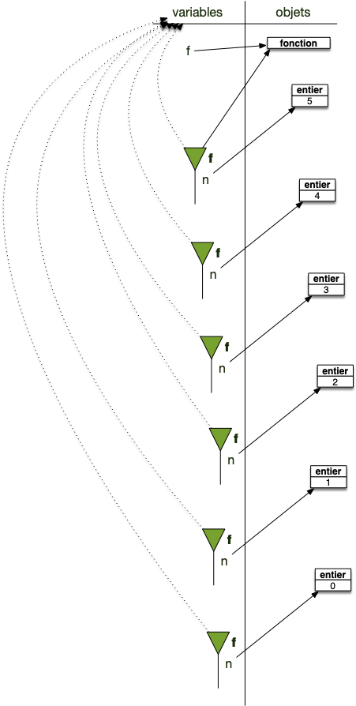
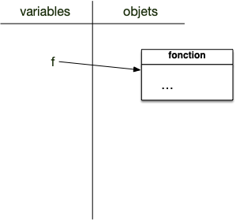
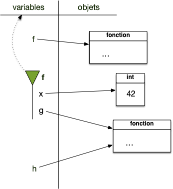
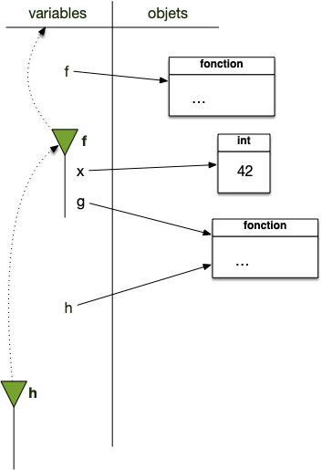

Nous avons déjà abordé la notion d'espace de nommage lorsque :

- on a paré de modules : [l'espace de nommage du module](../principes/modules/#définition-espace-nommage){.interne} et accès aux éléments via [la notation pointée](../principes/modules/#définition-notation-pointée){.interne}
- on a parlé des fonctions : [l'espace de nommage et fonctions](../creation-fonctions/#espace-nommage){.interne}

Les espaces de nommage permettent de lier variables et objets :

- on considère que les objets sont stockés dans **_l'espace des objets_** : cet espace est **unique**
- on accède aux objets via leurs noms, eux même stockés dans des **_espaces de nommage_** qui sont des objets comme les autres : il y en a de **nombreux**.

Pour chaque _espace de nommage_ :

- il ne peut y avoir 2 noms identiques
- à chaque nom est associé un objet
- certains espaces de noms possèdent un parent qui sera utilisé pour retrouver un nom.

De façon formelle :

<span id="définition-espace-nommage"></span>


Un **_espace de nommage_** est constitué de deux parties :

- une table de correspondance ([un dictionnaire](../conteneurs/dictionnaires){.interne}) associant des noms (les clés) à des objets (les valeurs). 
- un lien vers un espace de nommage **_parent_** (qui peut être vide)


Par exemple les espaces de nommages associés aux modules on par exemple un parent vide et ceux créés par les fonctions dépendant de l'espace de nommage qui les a appelé.


Les espaces de nommages sont utilisés à de nombreux endroits dans python et sont là pour : 

1. gérer les noms et leurs objets associés
2. séparer les responsabilités et cloisonner les noms auxquels ont accès les différentes parties d'un programme


On accède aux noms (et donc aux objets qu'ils référencent) des espaces de noms d'un objet en utilisant la notation pointée :

<span id="définition-notation-pointée"></span>


Le **_notation pointée_** permet d'accéder aux noms d'un espace de nommage. Si `o`{.language-} est un objet contenant un espace de nom on peut :

- accéder à un nom `n`{.language-} défini dans l'espace un nom de `o` avec l'instruction `o.n`{.language-} (si on a importé le module random on peut utiliser la fonction `randrange`{.language-} qui y est défini avec l'instruction `random.randrange(1, 7)`{.language-}). 
- affecter un nom `n`{.language-} dans l'espace un nom de `o` avec l'instruction `o.n = <objet>`{.language-} (par exemple `o.n = 42`{.language-}). 



Avant de détailler ce mécanisme et voir ses différentes implications, commençons par rappeler ce qu'est un nom et un objet pour python.

## Rappel sur les variables et les objets

Commençons par quelques rappels et précisions sur les variables et leurs liens avec les objets :

- tout ce que manipule un programme est appelé objet.
- les variables sont des noms via lesquels on accède aux objets. On dit aussi parfois qu'une variable est une **_référence_** à un objet.



Pour qu'un programme objet fonctionne, on a besoin de deux mécanismes :

- un moyen de stocker des données et de les manipuler (les objets et leurs méthodes)
- un moyen d'y accéder (les variables)



### Objets

Un objet est une structure de donnée générique permettant de gérer tout ce dont à besoin un programme :

- des données
- des fonctions
- des modules
- ...



Tout est objet dans un langage objet.



### Variables

Les variables sont des références aux objets. Pour ce faire, on utilise l’opérateur d’affectation `=`{.language-} :

```txt
variable = objet
```

A gauche de l’opérateur `=`{.language-} se trouve une **variable** (en gros, quelque chose ne pouvant commencer par un nombre) et à droite un **objet**. Dans toute la suite du programme, dès que le programme rencontrera le nom, il le remplacera par l'objet.


Une variable n'est **pas** l'objet, c'est une référence à celui-ci


La variable peut être vue comme un **nom** de l'objet à ce moment du programme. Un objet pourra avoir plein de noms différents au cours de l'exécution du programme, voire plusieurs noms en même temps.

Pour s'y retrouver et avoir une procédure déterministe pour retrouver les objets associés aux variables, voire choisir parmi plusieurs variables de même nom, elles sont regroupées par ensembles — nommés **espaces de noms** — hiérarchiquement ordonnés.

## <span id="espace-variable"></span> Espaces des variables

L'espace des variables peut-être vu comme un espace de nom particulier : c'est celui qui est créé au début de l'exécution de l'interpréteur.


Au démarrage d'une exécution d'un programme, l'espace des variables est créé. C'est un espace de nommage sans parent : c'est à partir de lui que toutes les variables doivent être atteintes.


Au départ, cet espace il ne contient rien, à part des variables spéciales (qui ont des noms commençant et finissant par `__`{.language-}) utilisées par python. On en verra certaines pendant ce cours, mais ce qu'il faut retenir c'est que ces variables permettent à python de fonctionner. Elles sont mises à disposition des développeurs mais on ne les utilisera jamais dans un usage courant.

Pour voir les noms définis dans l'espace de noms des variables, on utilise en python [la fonction `globals()`{.language-}](https://docs.python.org/fr/3.14/library/functions.html#globals) qui rend **le** dictionnaire dont les clés sont les noms des variables et les valeurs les objets associés.

```python
>>> type(globals())
<class 'dict'>
>>> globals().keys()
dict_keys(['__name__', '__doc__', '__package__', '__loader__', '__spec__', '__builtins__'])
```

On voit que des variables existent dès le démarrage de python. Ces variables ne sont pas là pour être utilisées par nous mais sont indispensables au bon fonctionnement de python. Elles existent pour tout espace de nommage et permettent leur bon fonctionnement. En deux mots :

- `__name__`{.language-} : désigne le nom de l'espace de nommage pour python.
- on reverra `__doc__`{.language-}, `__package__`{.language-}, `__loader__`{.language-} et `__spec__`{.language-} lorsque l'on regardera les espaces de noms de modules. Pour l'espace des variables, elles sont non utilisées et valent `None`{.language-}
- `__builtins__`{.language-} est un module et contient toutes les fonctions de python (il contient les noms `print`, `input`, etc)


Certains langages vont cacher leur fonctionnement interne à l'utilisateur. Ce n'est pas le cas de python qui veut que tout soit **explicite** : on a accès via ces variables spéciales, appelées _dunder_ et commençant et finissant par deux [underscores](https://fr.wikipedia.org/wiki/Tiret_bas).



Regardons un peu tout ça


que vaut `__main__`{.language} dans l'espace des variables ?


On exécute un interpréteur et on regarde la valeur de sa variable :

```shell
❯ python
Python 3.14.3 (main, Feb  3 2026, 15:32:20) [Clang 17.0.0 (clang-1700.6.3.2)] on darwin
Type "help", "copyright", "credits" or "license" for more information.
>>> __name__
'__main__'

```

Le nom de l'espace des variable est `__name__`{.language} pour python.


Ajoutons une variable et vérifions qu'elle est bien ajoutée à l'espace des variables :

```python
>>> x = "youhou ! Je suis là !"
>>> globals().keys()
dict_keys(['__name__', '__doc__', '__package__', '__loader__', '__spec__', '__builtins__', 'x'])
```

Notre variable a bien été ajouté à l'espace des noms ! Comme c'est un dictionnaire, on peut y accéder directement :

```python
>>> globals()['x']
'youhou ! Je suis là !'
```

Qui est équivalent à :

```python
>>> print(x)
'youhou ! Je suis là !'
```

Voir même y ajouter directement des variables. La ligne suivante est équivalente à affecter une nouvelle variable `y`{.language-} :

```python
>>> globals()['y'] = "je suis un véritable hacker."
```

Vérifions le :

```python
>>> print(y)
je suis un véritable hacker.
```


L'espace de variable est l'espace de nommage principal. On doit pouvoir accéder à tous les objets via celui-ci.



## <span id="espace-modules"></span> Espaces de nommage des modules

On a vu qu'un module contenait [un espace de nommage](../principes/modules/#définition-espace-nommage){.interne} auquel on pouvait accéder via [la notation pointée](../principes/modules/#définition-notation-pointée){.interne}. Tout comme l'espace des variables, cet espace ne contient pas de parent.

Tout comme la fonction `globals()`{.language-} permet d'accéder au dictionnaire contenant la table de relation entre variables et objets, il est possible d'accéder au dictionnaire contenant les noms stockés dans l'espace de nommage d'un objet `o`{.language-} (en particulier d'un module) en utilisant [la fonction `vars(o)`{.language-}](https://docs.python.org/fr/3.14/library/functions.html#vars).

Testons cela en regardant si `print`{.language-} est dans le module `__builtins__`{.language-} :

```python
>>> 'print' in vars(__builtins__)
True
```

Oui ! On peut aussi voir toutes les fonction par défaut de python en exécutant par exemple le bout de code suivant (attention, il y en a beaucoup) :

```python
for x in vars(__builtins__):
   print(x)
```

Regardons de plus prêt les différentes variables définies dans un module :



Dans un projet vscode créez deux fichiers :

- un fichier `main.py`{.language-} contenant le code :
   ```python
   import mon_module

   for noms in vars(mon_module).keys():
      print(noms)
   ```
- un fichier `mon_module.py`{.language-} contenant le code suivant :
   ```python
   """ Une documentation de mon module 
   """

   une_variable = 42
   def une_fonction():
      print(une_variable)
   ```

Puis exécutez le fichier avec la commande `python main.py`.



Lorsque vous exécutez le fichier `main.py`{.fichier} vous devriez voir :

```shell
❯ python main.py
__name__
__doc__
__package__
__loader__
__spec__
__builtins__
__file__
__cached__
une_variable
une_fonction
```

On retrouve bien :

- les variables spéciales de l'espace de variables (`__name__`{.language-},`__doc__`{.language-}, `__packages__`{.language-}. `__loader__`{.language-}, `__spec__`{.language-} et `__builtins__`{.language-})
-  deux nouvelles variables :
   -  `__file__`{.language-} : qui contient le nom du fichier contenant le module
   - `__cached__`{.language-} : qui contient le fichier compilé du module (ce fichier est crée lorsque lors du premier import et accélère les futurs accès)
- notre variable et notre fonction : `une_variable`{.language-} et `une_fonction`{.language-}


Que valent les différentes variables spéciales sauf `__builtins__`{.fichier} du module `mon_module`{.language-} ?



Le plus simple est d'afficher toutes les variables une à une en ajoutant le code suivant au fichier `main.py`{.fichier}  :

```python
import mon_module

print(vars(mon_module).keys()) 
print()

for key, value in vars(mon_module).items():
    if key != "__builtins__":
        print("nom :", key, " valeur :", value)

```

Son exécution donne :

```shell
❯ python main.py
dict_keys(['__name__', '__doc__', '__package__', '__loader__', '__spec__', '__file__', '__cached__', '__builtins__', 'une_variable', 'une_fonction'])

nom : __name__  valeur : mon_module
nom : __doc__  valeur : Une documentation de mon module

nom : __package__  valeur :
nom : __loader__  valeur : <_frozen_importlib_external.SourceFileLoader object at 0x102dab750>
nom : __spec__  valeur : ModuleSpec(name='mon_module', loader=<_frozen_importlib_external.SourceFileLoader object at 0x102dab750>, origin='/Users/fbrucker/Desktop/prog-objet/mon_module.py')
nom : __file__  valeur : /Users/fbrucker/Desktop/prog-objet/mon_module.py
nom : __cached__  valeur : /Users/fbrucker/Desktop/prog-objet/__pycache__/mon_module.cpython-314.pyc
nom : une_variable  valeur : 42
nom : une_fonction  valeur : <function une_fonction at 0x102e6aa30>

```



L'exercice précédent vous a montré que :

- le nom du module (`__name__`{.language-}) vaut le nom du fichier et plus `__name__`{.python}. C'est ce qui permet de différentier l'espace des variables de tous les autres espaces de nommage
- la variables `__doc__`{.language-} vaut la chaîne de caractères du début du fichier ! C'est le moyen que donne python pour créer l'aide d'un module. Si vous tapez dans un interpréteur `help(mon_module)`{.language-} après l'avoir importé vous retrouverez cette chaîne de caractères.


Enfin, tout comme l'espace de variable on peut ajouter ou modifier des nom qui y sont définis en utilisant la notation pointée :

```python
import mon_module

mon_module.autre_variable = "quarante-deux"
```

Il est bien sur non conseillé de le faire par ce qu'on peut **Tout modifier**. Par exemple se conformer à [une loi de l'Indiana](https://www.youtube.com/watch?v=1Bn50keR6UY) :

```python

import math

math.pi = 3.2
```

## <span id="espace-variable"></span> Espaces de nommage courant

L'exécution de fonction nécessite l'utilisation d'espaces de nommages pour
compartimenter l'usage des variables.


L'interpréteur possède à chaque instant **_un espace de nommage courant_**  qui est l'espace par défaut des noms :

- python commence par rechercher un nom dans cet espace puis cherche dans l'espace parent s'il n'est pas trouvé
- python affectera toujours un nom dans cet espace (hors notation pointée)

Par défaut l'espace de nommage courant est l'espace des variables.


Pour voir les noms définis dans l'espace de noms courant, on utilise en python [la fonction `locals()`{.language-}](https://docs.python.org/fr/3.14/library/functions.html#locals) qui rend **le** dictionnaire dont les clés sont les noms des variables et les valeurs les objets associés.

Cet espace de nommage courant va changer au cours du temps selon le contexte :

- au démarrage de l'interpréteur l'espace de nommage courant est l'espace des variables
- lors de l'import de module l'espace de nom courant est celui du module
- lors de l'exécution de fonction l'espace de nommage courant est l'espace créé pour son exécution.

Fixons nous les idées en examinant plusieurs cas.

### Espace des variables

Au démarrage d'un interpréteur l'espace de nommage courant est l'espace des variables. Vérifions le :

```shell
❯ python
Python 3.14.3 (main, Feb  3 2026, 15:32:20) [Clang 17.0.0 (clang-1700.6.3.2)] on darwin
Type "help", "copyright", "credits" or "license" for more information.
>>> globals() == locals()
True
>>> locals()['__name__']
'__main__'

```

### Espaces créés pour les modules

Lors de l'import d'un module l'espace de nommage courant est celui du module lors de son exécution. Pour vérifier cela créons un fichier nommé `mon_module.py`{.fichier} et mettons y le code :

```python
print("affichage depuis le module :", locals()["__name__"])
```

Puis créons un fichier `main.py`{.fichier} qui va importer notre module :

```python
import mon_module


print("affichage depuis le main :", locals()["__name__"])
```

L'exécution du fichier `main.py`{.fichier} va donner :

```shell
❯ python main.py
affichage depuis le module : mon_module
affichage depuis le main : __main__

```

On voit bien que :

- l'espace de nom courant change pendant l'exécution du module (la variable `__main__`{.language-} est différente)
- l'import d'un fichier l'exécute et son espace de nommage courant devient l'espace de nom du module (la le paramètre de la fonction `print`{.language-} du module est affichée, donc exécutée)

### Espace créés pour les fonctions

[Un espace de nommage est créé pour chaque fonction lors de son exécution](../creation-fonctions/#espace-nommage){.interne}, on peut s'en rendre compte en examinant les noms de l'espace de nommage courant :


Un espace de nommage est crée lors de chaque **exécution** d'une fonction. 

Cet espace aura un parent non vide qui sera **toujours le même**, celui qui contient la définition de la fonction.



Créons un fichier `main.py`{.fichier} et mettons-y le code suivant :

```python
def f():
      print("espace de nommage courant :", locals().keys())
      print("espace des variables :", globals().keys())

f()
```

Son exécution va afficher :

```shell
❯ python main.py
espace de nommage courant : dict_keys([])
espace des variables : dict_keys(['__name__', '__doc__', '__package__', '__loader__', '__spec__', '__builtins__', '__file__', '__cached__', 'f'])

```

On voit que :

- l'espace de nommage local change lors de l'exécution de la fonction
- l'espace de nommage de la fonction ne contient aucune des variables spéciales des espaces de nommages liés aux modules et à l'espace des variables

Lorsque la fonction s'arrête, l'espace de nom courant redevient l'espace de nom ayant appelé la fonction, ce qui permet de faire des fonctions récursives. Par exemple l'exécution de la fonction :

```python
def fact(n):
   if n < 1:
      return 1
   else:
      return n * fact(n-1)
```

Pour `fact(5)`{.language-} produira l'imbrication des différents espaces de nommages :



La variable `n`{.language-} existe dans **tous** les espaces de nommages, une fois par appel de la fonction.

##  Hiérarchie des espaces de nommages

L'espace de nommage parent permet de hiérarchiser la recherche de noms :



Lorsque python cherche à **_trouver l'objet associé à un nom_** il procède récursivement :

1. l'espace de nommage de recherche est l'espace de nommage courant
2. si le nom recherché n'est pas pas dans l'espace de recherche deux cas sont possibles :
   - si l'espace de recherche à un parent non vide, il devient l'espace de recherche courant et on recommence l'étape 2.
   - si l'espace de recherche à un parent vide : on arrête la recherche et on produit une erreur de type `NameError`{.language-}



En revanche, lorsque l'on affecte un nom, la règle est simple :



Lorsque python cherche à **_affecter un objet à un nom_** il rajoute la correspondance nom/objet au dictionnaire de l'**_espace de nommage courant_**.



Illustrons ceci :

```python
def f():
      y = 24
      print("espace de nommage courant :", locals().keys())
      print("la variable x:", x)

x = 42
f()
```

le code va produire deux affichages :

```
"espace de nommage courant : dict_keys(['y'])
la variable x: 42
```

Ce qui prouve que :

1. la variable `y`{.language-} a bien été créé dans l'espace de nommage de la fonction
2. la variable `x`{.language-} n'est pas dans l'espace de nommage de la fonction
3. python a cherché (et trouvé) la variable `x`{.language-} dans l'espace de nom parent de la fonction : l'espace des variables

Ce mécanisme est **très** puissant puisqu'il permet de faire ce genre de choses :


```python/
def f(x):
   def g():
      print(x)

   return g

h = f(42)

h()
```

On utilise dans `g`{.language-} l'espace de nom qui l'a défini, c'est à dire l'espace de nommage crée lors de l'exécution de la fonction...

Exécution ligne à ligne le code précédent en exhibant les espaces de noms pour comprendre comment tout ça est possible.

1. ligne 6 on est dans le cas suivant : seul un nom est défini dans l'espace des variables
    
2. ligne 8, la fonction `g`{.language-} est créée et elle est associée à l'espace de nommage de l'exécution de f (qui n'est donc pas détruit à la fin de l'exécution de `f`{.language-} puisque la fonction g existe dans l'espace des variables via le nom `h`{.language-}):
   
3. lors de l'exécution de la fonction `h`{.language-}, on est dans la configuration suivante son espace de nom est celui ayant cré la fonction, celui de `f`{.language-} :
   