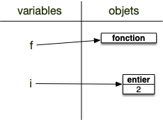
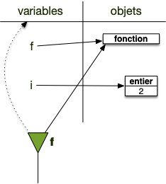
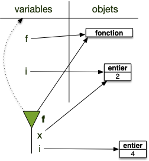
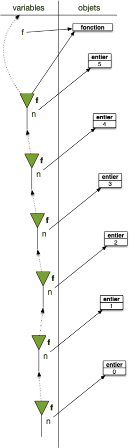

Pour garantir le fait que les objets crées dans les fonctions restent dans les fonctions, un espace de nommage est crée à chaque exécution. Cela se passe selon le processus suivant :


Lorsque l'on exécute une fonction on procède comme suit :

1. on crée un nouvel espace de nommage $F$
2. l'espace de nommage courant est affecté au parent de $F$
3. $F$ devient le nouvel espace de nommage courant.
4. on affecte les paramètres de la fonction à leurs noms
5. on exécute ligne à ligne la fonction
6. le parent de $F$ devient le nouvel espace de noms courant
7. on supprime l'espace de noms $F$



## Exécution d'une fonction

```python/
def f(x):
   i = 2 * x
   return i + 3

i = 2
x = f(i)
```

Exécutons le ligne à ligne :

1. avant l'exécution de la première ligne :
   1. on a un unique espace de nommage qui est l'espace des variables
      
2. la ligne 2 définit une fonction de nom `f`{.language-} qui est ajouté à l'espace de noms courant.
   
3. on passe directement à la ligne 5 puisque les lignes 3 et 4 sont le contenu de la fonction.
   1. Cette ligne crée un objet entier (valant 2) et l'affecte au nom `i`{.language-}.
      
4. la ligne 6 est encore une affectation. On commence par trouver l'objet à droite du `=` c'est le résultat de `f(i)`{.language-}. Il faut donc exécuter la fonction `f`{.language-} pour connaître cet objet :
   1. on cherche l'objet associé à `i`{.language-} qui sera le (premier) paramètre de la fonction
   2. on crée un espace de noms qui devient l'espace de noms courant :
      1. l'ancien espace de noms courant devient son parent
         
   3. on affecte le premier paramètre de `f`{.language-} au nom `x`{.language-} (le nom du premier paramètre de `f`{.language-} lors de sa définition)
      1. les nouveaux noms sont **toujours** créés dans l'espace de noms courant
         
   4. on exécute la ligne 2 qui est la première ligne de la fonction `f`{.language-} :
      1. on crée un objet entier (valant 4) qui est le résultat de l'opération à droite du `=`{.language-} (notez que le nom `x`{.language-} est bien défini dans l'espace de noms courant) et on l'affecte au nom `i`{.language-} dans l'espace de noms courant
         
   5. on exécute la ligne 3 :
      1. on crée l'objet résultant de l'opération somme (un entier valant 7)
      2. la fonction est terminée, son espace de noms courant est détruit
      3. l'espace de noms courant devient le parent de l'espace de noms détruit
         
      4. on rend l'objet résultat de la fonction
   6. la droite du signe `=`{.language-} de la ligne 6 est trouvée (c'est un entier valant 7) et il est affecté à la variable `x`{.language-} de l'espace de noms courant (qui est à nouveau `global`)
      1. 
      2. les objets sans nom sont détruits
         

## Espaces de nommage parent

L'espace de nommage parent sert lorsque l'on cherche un nom qui n'est pas défini dans l'espace de nommage courant :


Si un nom est recherché, mais que celui-ci n'est défini dans l'espace de noms courant, le nom est recherché dans l'espace de noms parent de l'espace courant.


```python/
def f(x):
   i = C * x
   return i + 3

C = 2
i = 2
x = f(i)
```

Lors de l'exécution de la fonction `f`{.language-} (instruction de la ligne 7), sa première ligne cherche la variable nommée `C`{.language-}. On se trouve dans cet état là :


La variable `C`{.language-} n'existe pas dans l'espace de noms courant (celui de `f`{.language-}), le programme va alors chercher dans l'espace de noms parent s'il existe. Ici c'est le cas puisque l'espace parent de `f`{.language-} est `global` dans lequel `C`{.language-} est défini : le programme ne produit donc pas une erreur et trouve le bon objet.


Les variables sont **toujours** créées dans l'espace de noms courant, mais leur recherche remonte de parent en parent jusqu'à la trouver.


## Récursion

```python
def fact(n):
   print(vars()["n"])
   if n < 1:
      return 1
   else:
      return n * fact(n-1)

fact(5)
```

On obtiendra :

```shell
5
4
3
2
1
0
```

Ce qui montre bien que chaque fonction va créer son propre espace de nommage.

En représentant les différents appels de récursion jusqu'au dernier on aura les les des espaces de nommages :


