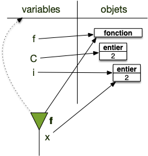
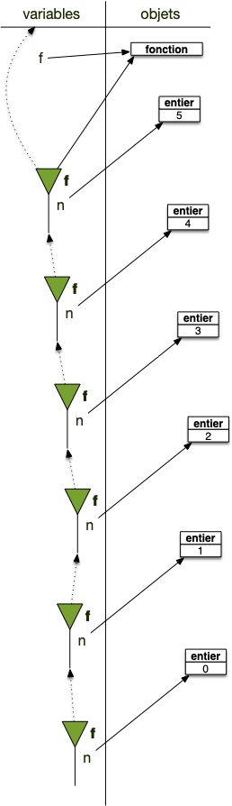

Pour garantir le fait que les objets crées dans les fonctions restent dans les fonctions, un espace de nommage est crée à chaque exécution. Cela se passe selon le processus suivant :


Lorsque l'on exécute une fonction on procède comme suit :

1. on crée un nouvel espace de nommage $F$
2. l'espace de nommage courant est affecté au parent de $F$
3. $F$ devient le nouvel espace de nommage courant.
4. on affecte les paramètres de la fonction à leurs noms
5. on exécute ligne à ligne la fonction
6. le parent de $F$ devient le nouvel espace de noms courant
7. on supprime l'espace de noms $F$



## Exécution d'une fonction


## Espaces de nommage parent

L'espace de nommage parent sert lorsque l'on cherche un nom qui n'est pas défini dans l'espace de nommage courant :


Si un nom est recherché, mais que celui-ci n'est défini dans l'espace de noms courant, le nom est recherché dans l'espace de noms parent de l'espace courant.


```python/
def f(x):
   i = C * x
   return i + 3

C = 2
i = 2
x = f(i)
```

Lors de l'exécution de la fonction `f`{.language-} (instruction de la ligne 7), sa première ligne cherche la variable nommée `C`{.language-}. On se trouve dans cet état là :



La variable `C`{.language-} n'existe pas dans l'espace de noms courant (celui de `f`{.language-}), le programme va alors chercher dans l'espace de noms parent s'il existe. Ici c'est le cas puisque l'espace parent de `f`{.language-} est `global` dans lequel `C`{.language-} est défini : le programme ne produit donc pas une erreur et trouve le bon objet.


Les variables sont **toujours** créées dans l'espace de noms courant, mais leur recherche remonte de parent en parent jusqu'à la trouver.


## Récursion

```python
def fact(n):
   print(locals()["n"])
   if n < 1:
      return 1
   else:
      return n * fact(n-1)

fact(5)
```

On obtiendra :

```shell
5
4
3
2
1
0
```

Ce qui montre bien que chaque fonction va créer son propre espace de nommage.

En représentant les différents appels de récursion jusqu'au dernier on aura les les des espaces de nommages :


