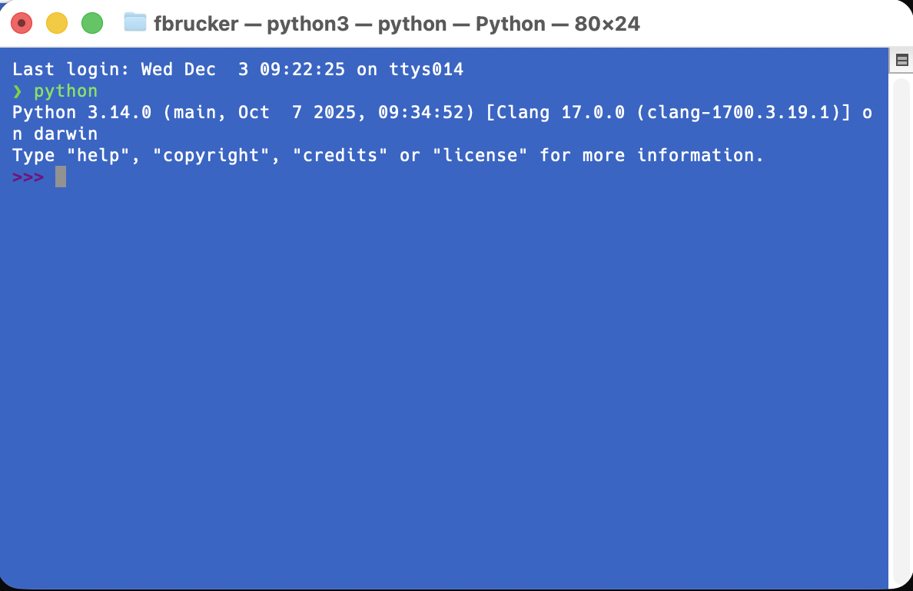

Nous allons ici installer un interpréteur sur notre machine (si nécessaire sous windows) puis l'utiliser via [un terminal](/cours/système-et-réseau/bases-système/terminal/){.interne}.

## Installation d'un interpréteur

Commençons par installer un interpréteur indépendant de l'application utilisée pour coder. Selon le système d'exploitation, la méthode d'installation est un peu différente :

### Sous Windows 11

Utilisez le Microsoft store.


[Python sur le windows store](https://apps.microsoft.com/search?query=python&hl=fr-FR&gl=FR)


Puis installez le via le store.

### Sous Linux/Ubuntu

Python est installé par défaut, mais il ne contient pas le module pip permettant d'installer de nouveaux modules à python. Pour installer pip, tapez dans [un terminal](../ordinateur-développement/terminal){.interne} :

```
sudo apt install python3-pip
```

Enfin, la commande pour taper python est `python3`. Pour avoir le même comportement que sous windows où cette commande s'appelle juste `python`, vous pouvez installer :

```
sudo apt install python-is-python3
```

Vous pourrez uniquement taper `python` dans un terminal pour exécuter l'interpréteur python,

### Sous Macos

De même que sous Linux/Ubuntu, python est installé par défaut, mais il s'appelle `python3`. Pour avoir le même comportement que sous windows et Linux où cette commande s'appelle juste `python`, vous pouvez taper dans [un terminal](../ordinateur-développement/terminal){.interne} :

```shell
echo "alias python=python3" >> ~/.zshrc
```

Puis fermez et ouvrez un nouveau terminal pour les modifications soient appliquées.

## Exécuter l'interpréteur depuis un terminal

Ouvrez [un terminal](../ordinateur-développement/terminal){.interne} et tapez `python` puis la touche entrée : vous êtes dans un interpréteur.

### Powershell


### Terminal Linux


### Terminal mac



## Utiliser et sortir de l'interpréteur

Vous pouvez ensuite taper le bonjour universel :

```shell
>>> print("bonjour Monde !")
bonjour Monde !
>>>
```

Puis sortir de l'interpréteur en tapant `quit()`{.language-} qui exécute la fonction permettant de sortir de l'interpréteur :

```shell
>>> quit()

❯
```

Notez que vous pouvez aussi taper la combinaison de touches `^D` (la touche ctrl et la touche D en même temps) pour sortir de l'interpréteur et retourner dans le terminal.
