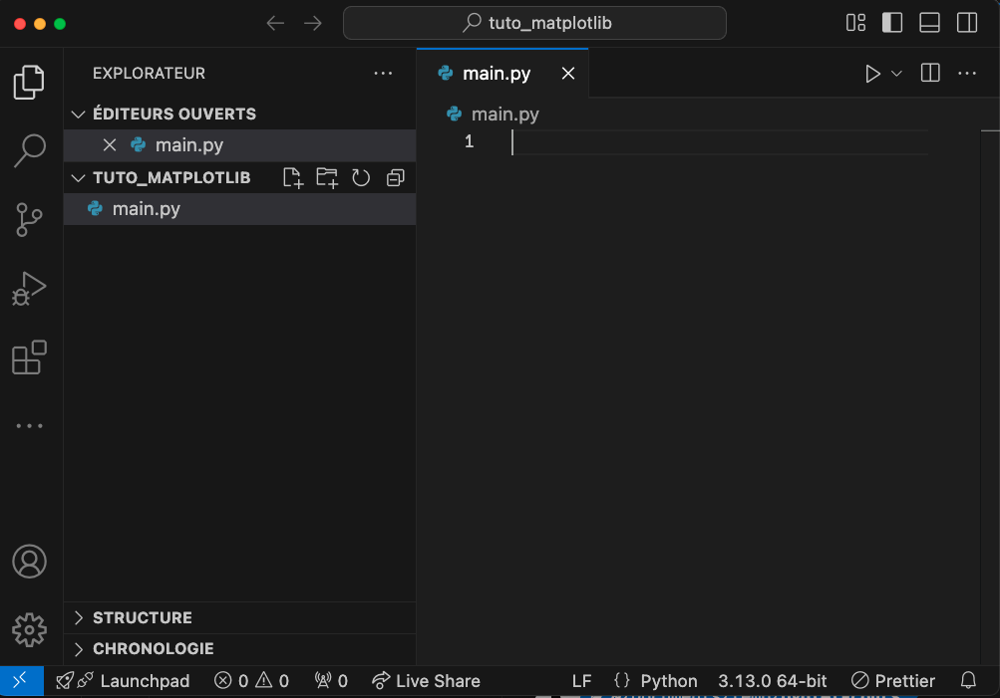
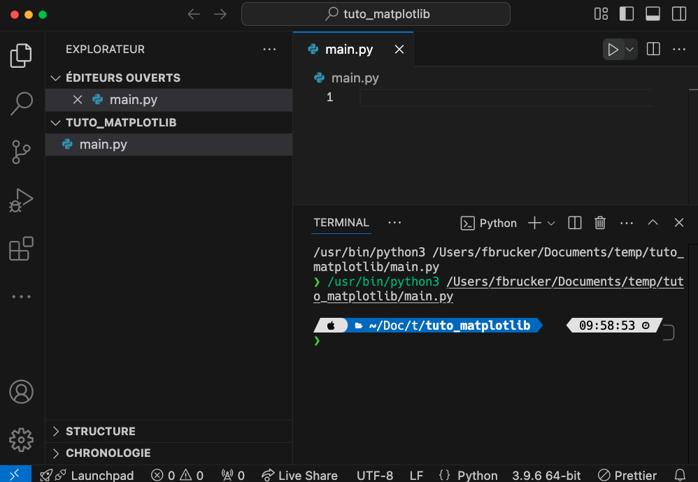
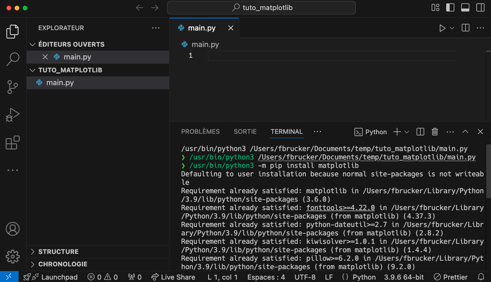

Nous allons montrer ici comment installer des modules à un interpréteur python. Nous prendrons ici l'exemple d'un projet avec vscode et de l'utilisation de son terminal, mais la méthode sera générale.

## Le module pip


<https://pypi.org/project/pip/>


`pip` est le Python Installer Package, c'est un module permettant d'installer d'autres module. Il existe un multitude de modules python permettant de réaliser presque toutes les opérations que l'on souhaite. Citons par exemple :

- traitement des images avec [pillow](https://pillow.readthedocs.io/en/stable/)
- outils numériques avec [numpy](https://numpy.org/)
- graphiques avec [matplotlib](https://matplotlib.org/) ou [seaborn](https://seaborn.pydata.org/)
- analyse des données avec [pandas](https://pandas.pydata.org/)
- musique avec [librosa](https://librosa.org/doc/latest/index.html)
- serveur web avec [flask](https://flask.palletsprojects.com/en/stable/) ou [fastapi](https://fastapi.tiangolo.com/)
- ...

Lorsque l'on utilise un environnement intégré comme Spyder, notebook ou encore anaconda de nombreux modules sont installés par défaut, ce qui n'est pas le cas lorsque l'on installe un interpréteur distinct.

Nous allons voir ici comment utiliser pip pour installer des modules python dans le cadre d'un projet vscode. Il existe d'autres méthode, mais la technique que nous montrons ici à le mérite de tout le temps fonctionner.

## Installation de module

Pour installer un module avec python, il faut taper la commande :

```shell
nom-du-programme-python -m pip install nom-du-module-à-installer
```

Où :

- `nom-du-programme-python` est l'interpréteur python pour lequel on veut installer un package, c'est à dire la première partie de la ligne de commande écrite par vscode. Chez moi c'est : `/usr/bin/python3`{.fichier}. Chez vous c'est peut-être juste `python` (le plus probable), ou `python3`
- `nom-du-module-à-installer` est le nom de la bibliothèque à installer.

Cette ligne se comprend ainsi : pour mon python (`nom-du-programme-python`), je veux utiliser le module `pip` (`-m pip`) avec les paramètres `install nom-du-module-à-installer` (on veut installer le module s'appelant `nom-du-module-à-installer`)


Un module est **toujours** installé pour un interpréteur particulier. Si vous avez plusieurs interpréteurs, le module ne sera installé que pour celui correspondant au `nom-du-programme-python`


Si je veux installer le module `matplotlib` par exemple, ma ligne de commande à taper dans le terminal vscode sera :

```shell
/usr/bin/python3 -m pip install matplotlib
```

Pour vous, ce sera peut-être différent car le `nom-du-programme-python` sera différent. Pour connaître le nom du programme python à utiliser et trouver un terminal, vous pouvez utiliser ce qu'on a vue dans [la partie sur l'éditeur vscode](../éditeur-vscode/python/#exécuter-programme){.interne}.

## Exemple

Supposons que l'on vienne d'installer un nouvel interpréteur sur notre système et qu'on en profite pour refaire [l'excellent tutoriel pour savoir utiliser matplotlib](../matplotlib/){.interne}.

### Création du projet


Créez un nouveau projet vscode et créez un fichier `main.py`{.language-} à l'intérieur de celui-ci.





Vous remarquerez qu'il suffit de créer un fichier se terminant par l'extension `.py`{.fichier} pour que vscode se place de lui-même en mode python : un triangle en haut pour exécuter le fichier et en bas la version de python.

### Installation de matplotlib

Pour connaître le nom entier du programme python utilisé par vscode, il faut exécuter un fichier python.


Exécutez le fichier `main.py`{.language-} avec le triangle d'exécution pour connaître le nom complet de l'interpréteur utilisé.




Chez moi c'est `/usr/bin/python3`{.fichier}.


Comme le fichier est vide, l'interpréteur n'effectuera aucune instruction. L'intérêt de cette exécution est donc uniquement d'expliciter le nom complet de l'interpréteur. Celui-ci peut maintenant être utilisé pour installer matplotlib :


Dans le terminal utilisé pour l'exécution du code python, tapez la commande permettant d'installer le module matplotlib et exécutez-la.




Chez moi la commande a été `/usr/bin/python3 -m pip install matplotlib`{.fichier}. Le module `matplotlib` étant déjà installé il ne se passe pas grand chose.


Vous pouvez maintenant utiliser le module matplotlib avec votre interpréteur !

## Modules installés

Le module `pip` permet une gestion fine des modules python. On utilise ce module de la façon suivante :

```shell
nom-du-programme-python -m pip commande paramètres-séparés-par-des-espaces
```

On a pour l'instant uniquement utilisé la commande `install`, mais il y en a plein d'autre, par exemple l'aide :

```shell
nom-du-programme-python -m pip help
```

Ou encore la commande `list` qui liste l'ensemble des modules installé pour l'interpréteur.


Vérifiez que le module matplotlib est bien installé pour votre interpréteur.



```shell
nom-du-programme-python -m pip list
```

Chez moi, cela fait : `/usr/bin/python3 -m pip list` et on vérifie que `matplotlib` est bien installé.



Un module ne vient jamais tout seul car il dépend d'autre modules qui sont également installé. Par exemple `matplotlib` dépend du module `numpy` qui sera automatiquement installé si vous ne l'avez pas déjà lors de l'installation du module `matplotlib`.
