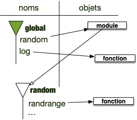

Python stocke ses variable dans un objet appelé **_espace de nommage_**.

Une variable a un nom et est affecté à un objet python. Il est important de dissocier le nom de l'objet pour une variable et surtout la variable de l'objet qu'elle représente.

## Rappel sur les variables et les objets

Commençons par quelques rappels et précisions sur les variables et leurs liens avec les objets :



- tout ce que manipule un programme est appelé objet.
- les variables représentent les objets. On dit aussi parfois qu'une variable est une **_référence_** à un objet.



Pour qu'un programme objet fonctionne, on a besoin de deux mécanismes :

- un moyen de stocker des données et de les manipuler (les objets et leurs méthodes)
- un moyen d'y accéder (les variables)

### Objets

Un objet est une structure de donnée générique permettant de gérer tout ce dont à besoin un programme :

- des données
- des fonctions
- des modules
- ...

Tout est objet dans un langage objet.

### Variables

Les variables sont des références aux objets. Pour ce faire, on utilise l’opérateur d’affectation `=`{.language-} :

```txt
variable = objet
```

A gauche de l’opérateur `=`{.language-} se trouve une **variable** (en gros, quelque chose ne pouvant commencer par un nombre) et à droite un **objet**. Dans toute la suite du programme, dès que le programme rencontrera le nom, il le remplacera par l'objet.


Une variable n'est **pas** l'objet, c'est une référence à celui-ci


La variable peut être vue comme un **nom** de l'objet à ce moment du programme. Un objet pourra avoir plein de noms différents au cours de l'exécution du programme, voire plusieurs noms en même temps.

Pour s'y retrouver et avoir une procédure déterministe pour retrouver les objets associés aux variables, voire choisir parmi plusieurs variables de même nom, elles sont regroupées par ensembles — nommés **espaces de noms** — hiérarchiquement ordonnés.

## <span id="espace-nommage"></span> Espaces de nommage

Les espaces de noms sont des objets de python qui permettent de lier variables et objets :

- on considère que les objets sont stockés dans **_l'espace des objets_** : cet espace est **unique**
- on accède aux objets via leurs noms, eux même stockés dans des **_espaces de nommage_** qui sont des objets comme les autres : il y a de **nombreux** espaces de nommages.

Pour chaque _espace de nommage_ :

- il ne peut y avoir 2 noms identiques
- à chaque nom est associé un objet
- certains espaces de noms possèdent un parent qui sera utilisé si on ne trouve pas un nom.


Pour expliciter comment tout ça se passe, on va se concentrer sur le [langage python](https://docs.python.org/3/tutorial/classes.html#python-scopes-and-namespaces), mais la procédure est similaire pour les autres langages à objets.


Lorsque l'on exécute un programme, un premier espace de nommage est créé :


Au démarrage d'une exécution d'un programme, l'espace de nommage principal, nommé `global`{.language-} est créé. C'est à partir de lui que toutes les variables doivent être atteintes.


Au départ, il ne contient rien, à part des noms commençant et finissant par `__`{.language-}, qui sont utilisés par python. On en verra certaines pendant ce cours, mais ce qu'il faut retenir c'est que ces variables permettent à python de fonctionner. Elles sont mises à disposition des développeurs mais on ne les utilisera jamais dans un usage courant.


Pour voir les noms définit dans l'espace de noms global, on utilise en python la fonction `globals()`{.language-} qui rend un dictionnaire contenant le nom et l'objet associé à chaque variable. [Un dictionnaire](https://docs.python.org/fr/3.13/tutorial/datastructures.html#dictionaries) est une structure de donnée qui associe un objet à un nom. Leur affichage est du type :

```python
{
   ...
   
   'nom': objet,
   
   ...
}
```

Au démarrage del'interpréteur, il n'y pas grand chose dans globals :

```python
>>> globals()
{
   '__name__': '__main__', 
   '__doc__': None, 
   '__package__': '_pyrepl', 
   '__loader__': <_frozen_importlib_external.SourceFileLoader object at 0x100d20fb0>, 
   '__spec__': ModuleSpec(name='_pyrepl.__main__', loader=<_frozen_importlib_external.SourceFileLoader object at 0x100d20fb0>, origin='/opt/homebrew/Cellar/python@3.13/3.13.0_1/Frameworks/Python.framework/Versions/3.13/lib/python3.13/_pyrepl/__main__.py'), 
   '__annotations__': {}, '__builtins__': <module 'builtins' (built-in)>, 
   '__file__': '/opt/homebrew/Cellar/python@3.13/3.13.0_1/Frameworks/Python.framework/Versions/3.13/lib/python3.13/_pyrepl/__main__.py', 
   '__cached__': '/opt/homebrew/Cellar/python@3.13/3.13.0_1/Frameworks/Python.framework/Versions/3.13/lib/python3.13/_pyrepl/__pycache__/__main__.cpython-313.pyc'}
```

Uniquement des variables internes à python.



A tout moment de l'exécution d'un programme, un espace de nommage pourra être créé. En revanche :


A tout moment du programme, on pourra créer un nouvel espace de noms : de nombreux espaces de noms pourront être définis, mais il existera toujours **un** espace de noms courant où l'on créera les variables et où on cherchera les noms par défaut.


On donnera dans la suite de cette partie des exemples qui permettront de mieux comprendre ce processus.

## Exemple

On peut maintenant reprendre un exemple de [la partie variable et objet](../variables/) à l'aune des espace de nommage. Considérons le programme suivant :

```python
x = 1
y = 1
```

Exécutons le ligne à ligne :

1. avant l'exécution de la première ligne :
   1. on a un unique espace de noms (`global`{.language-}) qui est l'espace courant (en vert sur la figure)
      
2. on exécute la première ligne. Elle s'exécute ainsi :
   1. on commence à droite du `=`{.language-} : on crée un objet de type entier
   2. on crée le nom `x`{.language-} dans l'espace de noms courant (ici `global`{.language-}) et on lui affecte l'objet.
      
3. on exécute la deuxième ligne. Elle s'exécute ainsi :
   1. on commence à droite du `=`{.language-} : on crée un objet de type entier
   2. on crée le nom `y`{.language-} dans l'espace de noms courant (ici `global`{.language-}) et on lui affecte l'objet.
      

A la fin du programme, il y a **2 objets entiers différents** (même si tous les 2 valent 1), dont les noms sont, dans l'espace de noms global, respectivement `x`{.language-} et `y`{.language-}.


Exécutez le code précédant ligne à ligne et voyez comment les variables apparaissent dans l'espace de nommage `global`{.language-}



L'espace de nommage `globals()`{.language-} ne contient au départ que des variables de python (c'est à dire commençant et finissant par des `__`{.language-}) :

```python
>>> globals()
{'__name__': '__main__', '__doc__': None, '__package__': '_pyrepl', '__loader__': <_frozen_importlib_external.SourceFileLoader object at 0x100d20fb0>, '__spec__': ModuleSpec(name='_pyrepl.__main__', loader=<_frozen_importlib_external.SourceFileLoader object at 0x100d20fb0>, origin='/opt/homebrew/Cellar/python@3.13/3.13.0_1/Frameworks/Python.framework/Versions/3.13/lib/python3.13/_pyrepl/__main__.py'), '__annotations__': {}, '__builtins__': <module 'builtins' (built-in)>, '__file__': '/opt/homebrew/Cellar/python@3.13/3.13.0_1/Frameworks/Python.framework/Versions/3.13/lib/python3.13/_pyrepl/__main__.py', '__cached__': '/opt/homebrew/Cellar/python@3.13/3.13.0_1/Frameworks/Python.framework/Versions/3.13/lib/python3.13/_pyrepl/__pycache__/__main__.cpython-313.pyc'}
```

Après affectation de `x`, on voit la variable exister dans l'espace `global`{.language-} :

```python
>>> x = 1
>>> globals()
{'__name__': '__main__', '__doc__': None, '__package__': '_pyrepl', '__loader__': <_frozen_importlib_external.SourceFileLoader object at 0x100d20fb0>, '__spec__': ModuleSpec(name='_pyrepl.__main__', loader=<_frozen_importlib_external.SourceFileLoader object at 0x100d20fb0>, origin='/opt/homebrew/Cellar/python@3.13/3.13.0_1/Frameworks/Python.framework/Versions/3.13/lib/python3.13/_pyrepl/__main__.py'), '__annotations__': {}, '__builtins__': <module 'builtins' (built-in)>, '__file__': '/opt/homebrew/Cellar/python@3.13/3.13.0_1/Frameworks/Python.framework/Versions/3.13/lib/python3.13/_pyrepl/__main__.py', '__cached__': '/opt/homebrew/Cellar/python@3.13/3.13.0_1/Frameworks/Python.framework/Versions/3.13/lib/python3.13/_pyrepl/__pycache__/__main__.cpython-313.pyc', 
'x': 1}
```

Après affectation de `y`{.language-}, on voit les deux variables `x`{.language-} et `y`{.language-} exister dans l'espace `global`{.language-} :

```python
>>> y = 1
>>> globals()
{'__name__': '__main__', '__doc__': None, '__package__': '_pyrepl', '__loader__': <_frozen_importlib_external.SourceFileLoader object at 0x100d20fb0>, '__spec__': ModuleSpec(name='_pyrepl.__main__', loader=<_frozen_importlib_external.SourceFileLoader object at 0x100d20fb0>, origin='/opt/homebrew/Cellar/python@3.13/3.13.0_1/Frameworks/Python.framework/Versions/3.13/lib/python3.13/_pyrepl/__main__.py'), '__annotations__': {}, '__builtins__': <module 'builtins' (built-in)>, '__file__': '/opt/homebrew/Cellar/python@3.13/3.13.0_1/Frameworks/Python.framework/Versions/3.13/lib/python3.13/_pyrepl/__main__.py', '__cached__': '/opt/homebrew/Cellar/python@3.13/3.13.0_1/Frameworks/Python.framework/Versions/3.13/lib/python3.13/_pyrepl/__pycache__/__main__.cpython-313.pyc', 
'x': 1, 
'y': 1}
>>> 
```

On peut même supprimer `x` et la voir disparaître de l'espace de nommage :

```python
>>> del x
>>> globals()
{'__name__': '__main__', '__doc__': None, '__package__': '_pyrepl', '__loader__': <_frozen_importlib_external.SourceFileLoader object at 0x100d20fb0>, '__spec__': ModuleSpec(name='_pyrepl.__main__', loader=<_frozen_importlib_external.SourceFileLoader object at 0x100d20fb0>, origin='/opt/homebrew/Cellar/python@3.13/3.13.0_1/Frameworks/Python.framework/Versions/3.13/lib/python3.13/_pyrepl/__main__.py'), '__annotations__': {}, '__builtins__': <module 'builtins' (built-in)>, '__file__': '/opt/homebrew/Cellar/python@3.13/3.13.0_1/Frameworks/Python.framework/Versions/3.13/lib/python3.13/_pyrepl/__main__.py', '__cached__': '/opt/homebrew/Cellar/python@3.13/3.13.0_1/Frameworks/Python.framework/Versions/3.13/lib/python3.13/_pyrepl/__pycache__/__main__.cpython-313.pyc', 
'y': 1}
```



## <span id="notation-pointée"></span> Notation pointée

En python, (pratiquement) tout a un espace de nom. On s'en sert dès qu'on utilise la notation pointée.

on l'a vue pour les modules, mais c'est aussi vrai pour les objets. En considérant le code suivant :

```python
c = "coucou"
c2 = c.upper()
```

Le nom `upper`{.language-} est défini dans l'espace de noms des chaînes de caractères dont `"coucou"`{.language-} est un exemple. Vérifions-le un utilisant  la fonction [`vars()`{.language-}](https://docs.python.org/fr/3.13/library/functions.html#vars) qui donne les noms de l'espace de nommage d'un objet passé en paramètre :

```python
>>> vars(str)
mappingproxy({'__new__': <built-in method __new__ of type object at 0x1035cea40>, '__repr__': <slot wrapper '__repr__' of 'str' objects>, '__hash__': <slot wrapper '__hash__' of 'str' objects>, '__str__': <slot wrapper '__str__' of 'str' objects>, '__lt__': <slot wrapper '__lt__' of 'str' objects>, '__le__': <slot wrapper '__le__' of 'str' objects>, '__eq__': <slot wrapper '__eq__' of 'str' objects>, '__ne__': <slot wrapper '__ne__' of 'str' objects>, '__gt__': <slot wrapper '__gt__' of 'str' objects>, '__ge__': <slot wrapper '__ge__' of 'str' objects>, '__iter__': <slot wrapper '__iter__' of 'str' objects>, '__mod__': <slot wrapper '__mod__' of 'str' objects>, '__rmod__': <slot wrapper '__rmod__' of 'str' objects>, '__len__': <slot wrapper '__len__' of 'str' objects>, '__getitem__': <slot wrapper '__getitem__' of 'str' objects>, '__add__': <slot wrapper '__add__' of 'str' objects>, '__mul__': <slot wrapper '__mul__' of 'str' objects>, '__rmul__': <slot wrapper '__rmul__' of 'str' objects>, '__contains__': <slot wrapper '__contains__' of 'str' objects>, 'encode': <method 'encode' of 'str' objects>, 'replace': <method 'replace' of 'str' objects>, 'split': <method 'split' of 'str' objects>, 'rsplit': <method 'rsplit' of 'str' objects>, 'join': <method 'join' of 'str' objects>, 'capitalize': <method 'capitalize' of 'str' objects>, 'casefold': <method 'casefold' of 'str' objects>, 'title': <method 'title' of 'str' objects>, 'center': <method 'center' of 'str' objects>, 'count': <method 'count' of 'str' objects>, 'expandtabs': <method 'expandtabs' of 'str' objects>, 'find': <method 'find' of 'str' objects>, 'partition': <method 'partition' of 'str' objects>, 'index': <method 'index' of 'str' objects>, 'ljust': <method 'ljust' of 'str' objects>, 'lower': <method 'lower' of 'str' objects>, 'lstrip': <method 'lstrip' of 'str' objects>, 'rfind': <method 'rfind' of 'str' objects>, 'rindex': <method 'rindex' of 'str' objects>, 'rjust': <method 'rjust' of 'str' objects>, 'rstrip': <method 'rstrip' of 'str' objects>, 'rpartition': <method 'rpartition' of 'str' objects>, 'splitlines': <method 'splitlines' of 'str' objects>, 'strip': <method 'strip' of 'str' objects>, 'swapcase': <method 'swapcase' of 'str' objects>, 'translate': <method 'translate' of 'str' objects>, 
'upper': <method 'upper' of 'str' objects>, 
'startswith': <method 'startswith' of 'str' objects>, 'endswith': <method 'endswith' of 'str' objects>, 'removeprefix': <method 'removeprefix' of 'str' objects>, 'removesuffix': <method 'removesuffix' of 'str' objects>, 'isascii': <method 'isascii' of 'str' objects>, 'islower': <method 'islower' of 'str' objects>, 'isupper': <method 'isupper' of 'str' objects>, 'istitle': <method 'istitle' of 'str' objects>, 'isspace': <method 'isspace' of 'str' objects>, 'isdecimal': <method 'isdecimal' of 'str' objects>, 'isdigit': <method 'isdigit' of 'str' objects>, 'isnumeric': <method 'isnumeric' of 'str' objects>, 'isalpha': <method 'isalpha' of 'str' objects>, 'isalnum': <method 'isalnum' of 'str' objects>, 'isidentifier': <method 'isidentifier' of 'str' objects>, 'isprintable': <method 'isprintable' of 'str' objects>, 'zfill': <method 'zfill' of 'str' objects>, 'format': <method 'format' of 'str' objects>, 'format_map': <method 'format_map' of 'str' objects>, '__format__': <method '__format__' of 'str' objects>, 'maketrans': <staticmethod(<built-in method maketrans of type object at 0x1035cea40>)>, '__sizeof__': <method '__sizeof__' of 'str' objects>, '__getnewargs__': <method '__getnewargs__' of 'str' objects>, '__doc__': "str(object='') -> str\nstr(bytes_or_buffer[, encoding[, errors]]) -> str\n\nCreate a new string object from the given object. If encoding or\nerrors is specified, then the object must expose a data buffer\nthat will be decoded using the given encoding and error handler.\nOtherwise, returns the result of object.__str__() (if defined)\nor repr(object).\nencoding defaults to 'utf-8'.\nerrors defaults to 'strict'."})
>>> 
```

Parmi tous les noms définis, on retrouve bien `'upper'`{.language-}. On aurait pu aussi, de façon plus rapide, utiiser l'instruction :

```python
>>> 'upper' in vars(str)
True
>>>
```

Notez qu'on cherche bien si un **nom**, donc une chaîne de caractères, est connue dans un espace denommage. Ce nom est associé à une méthode.

C'est une notation **très puissante** ! Il ne faut pas avoir peur de chaîner ces notations. On appelle cela des chaînages :

```python
a.b.c.d()
```

Signifie :

1. On exécute `d`{.language-} qui est dans l'espace de noms de `a.b.c`{.language-}
2. `c`{.language-} est dans l'espace de noms de `a.b`{.language-}
3. `b`{.language-} est dans l'espace de noms de `a`{.language-}
4. `a`{.language-} est dans l'espace de noms courant

Nous allons utiliser cette mécanique de façon intensive avec les modules.

## Import de module

Lorsque l'on importe un module, un espace de nommage est créé et le module entier est lu. Lors de sa lecture, les noms définis sont placés dans cet espace.


Les modules possèdent un espace de noms qui contient les variables qui y sont définies


```python/
import random
from math import log

print(log(random.randrange(1, 43)))
```

Avant l'exécution de l'instruction `print`{.language-} on est dans cet état :



On accède à l'espace de noms du module par la notation pointée : `random.randrange`{.language-} signifie le nom `randrange`{.language-} dans l'espace de nommage de `random`{.language-} (représenté par une flèche du module vers les noms sur la figure).


Notez que le module `math`{.language-} n'a plus d'espace de noms associé puisque l'on a juste _récupéré_ un nom qui y est défini.


Utilisons la fonction [`vars()`{.language-}](https://docs.python.org/fr/3.13/library/functions.html#vars) pour visualiser les espaces de nommage et leurs évolution lors de l'exécution du code précédent. Commençons par vérifier que le nom `random`{.language-} est bien défini après import :

```python
>>> import random
>>> globals()
{'__name__': '__main__', '__doc__': None, '__package__': '_pyrepl', '__loader__': <_frozen_importlib_external.SourceFileLoader object at 0x102a0cfb0>, '__spec__': ModuleSpec(name='_pyrepl.__main__', loader=<_frozen_importlib_external.SourceFileLoader object at 0x102a0cfb0>, origin='/opt/homebrew/Cellar/python@3.13/3.13.0_1/Frameworks/Python.framework/Versions/3.13/lib/python3.13/_pyrepl/__main__.py'), '__annotations__': {}, '__builtins__': <module 'builtins' (built-in)>, '__file__': '/opt/homebrew/Cellar/python@3.13/3.13.0_1/Frameworks/Python.framework/Versions/3.13/lib/python3.13/_pyrepl/__main__.py', '__cached__': '/opt/homebrew/Cellar/python@3.13/3.13.0_1/Frameworks/Python.framework/Versions/3.13/lib/python3.13/_pyrepl/__pycache__/__main__.cpython-313.pyc', 
'random': <module 'random' from '/opt/homebrew/Cellar/python@3.13/3.13.0_1/Frameworks/Python.framework/Versions/3.13/lib/python3.13/random.py'>}
>>>
```

En revanche `math`{.language-} ne l'est pas puisqu'on ne fait que prendre un nom de son espace (c'est log qui est importé) :

```python
>>> from math import log
>>> globals()
{'__name__': '__main__', '__doc__': None, '__package__': '_pyrepl', '__loader__': <_frozen_importlib_external.SourceFileLoader object at 0x102a0cfb0>, '__spec__': ModuleSpec(name='_pyrepl.__main__', loader=<_frozen_importlib_external.SourceFileLoader object at 0x102a0cfb0>, origin='/opt/homebrew/Cellar/python@3.13/3.13.0_1/Frameworks/Python.framework/Versions/3.13/lib/python3.13/_pyrepl/__main__.py'), '__annotations__': {}, '__builtins__': <module 'builtins' (built-in)>, '__file__': '/opt/homebrew/Cellar/python@3.13/3.13.0_1/Frameworks/Python.framework/Versions/3.13/lib/python3.13/_pyrepl/__main__.py', '__cached__': '/opt/homebrew/Cellar/python@3.13/3.13.0_1/Frameworks/Python.framework/Versions/3.13/lib/python3.13/_pyrepl/__pycache__/__main__.cpython-313.pyc', 
'random': <module 'random' from '/opt/homebrew/Cellar/python@3.13/3.13.0_1/Frameworks/Python.framework/Versions/3.13/lib/python3.13/random.py'>, 
'log': <built-in function log>}
```

Enfin, `randrange` est bien un nom du module `random` :

```python
>>> 'randrange' in vars(random)
True
```


Montrez que `pi`{.language-} est un réel défini dasn le module math.




La variable `pi`{.language-} est définie dans le module math :

```python
>>> import math
>>> math.pi
3.141592653589793
>>> 
```

Le nom est bien défini dans le module math :

```python
>>> vars(math)
{'__name__': 'math', '__doc__': 'This module provides access to the mathematical functions\ndefined by the C standard.', '__package__': '', '__loader__': <_frozen_importlib_external.ExtensionFileLoader object at 0x104b34850>, '__spec__': ModuleSpec(name='math', loader=<_frozen_importlib_external.ExtensionFileLoader object at 0x104b34850>, origin='/opt/homebrew/Cellar/python@3.13/3.13.0_1/Frameworks/Python.framework/Versions/3.13/lib/python3.13/lib-dynload/math.cpython-313-darwin.so'), 'acos': <built-in function acos>, 'acosh': <built-in function acosh>, 'asin': <built-in function asin>, 'asinh': <built-in function asinh>, 'atan': <built-in function atan>, 'atan2': <built-in function atan2>, 'atanh': <built-in function atanh>, 'cbrt': <built-in function cbrt>, 'ceil': <built-in function ceil>, 'copysign': <built-in function copysign>, 'cos': <built-in function cos>, 'cosh': <built-in function cosh>, 'degrees': <built-in function degrees>, 'dist': <built-in function dist>, 'erf': <built-in function erf>, 'erfc': <built-in function erfc>, 'exp': <built-in function exp>, 'exp2': <built-in function exp2>, 'expm1': <built-in function expm1>, 'fabs': <built-in function fabs>, 'factorial': <built-in function factorial>, 'floor': <built-in function floor>, 'fma': <built-in function fma>, 'fmod': <built-in function fmod>, 'frexp': <built-in function frexp>, 'fsum': <built-in function fsum>, 'gamma': <built-in function gamma>, 'gcd': <built-in function gcd>, 'hypot': <built-in function hypot>, 'isclose': <built-in function isclose>, 'isfinite': <built-in function isfinite>, 'isinf': <built-in function isinf>, 'isnan': <built-in function isnan>, 'isqrt': <built-in function isqrt>, 'lcm': <built-in function lcm>, 'ldexp': <built-in function ldexp>, 'lgamma': <built-in function lgamma>, 'log': <built-in function log>, 'log1p': <built-in function log1p>, 'log10': <built-in function log10>, 'log2': <built-in function log2>, 'modf': <built-in function modf>, 'pow': <built-in function pow>, 'radians': <built-in function radians>, 'remainder': <built-in function remainder>, 'sin': <built-in function sin>, 'sinh': <built-in function sinh>, 'sqrt': <built-in function sqrt>, 'tan': <built-in function tan>, 'tanh': <built-in function tanh>, 'sumprod': <built-in function sumprod>, 'trunc': <built-in function trunc>, 'prod': <built-in function prod>, 'perm': <built-in function perm>, 'comb': <built-in function comb>, 'nextafter': <built-in function nextafter>, 'ulp': <built-in function ulp>, '__file__': '/opt/homebrew/Cellar/python@3.13/3.13.0_1/Frameworks/Python.framework/Versions/3.13/lib/python3.13/lib-dynload/math.cpython-313-darwin.so', 
'pi': 3.141592653589793, 
'e': 2.718281828459045, 'tau': 6.283185307179586, 'inf': inf, 'nan': nan}
```

Il y a tout un tas de noms définis, dont `'pi'`{.language-} :

```python
>>> 'pi' in vars(math)
True
>>> 
```

C'est bien ici un nom, donc une chaîne de caractère :

```python
>>> pi in vars(math)
Traceback (most recent call last):
  File "<python-input-14>", line 1, in <module>
    pi in vars(math)
    ^^
NameError: name 'pi' is not defined
```



## Ou est la fonction `print`{.language-} ?

Toutes les fonctions utilisées sans import explicite (comme la fonction `print`{.language-} par exemple) sont en fait importées au démarrage de l'interpréteur et sont rangés dans le module `__builtins__`{.language-}.


Retrouvez la fonction print dans le module `__builtins__`{.language-}.



Le module `__builtins__`{.language-} est bien connu dans l'espace de nom globals :

```python
>>> globals()
{'__name__': '__main__', '__doc__': None, '__package__': '_pyrepl', '__loader__': <_frozen_importlib_external.SourceFileLoader object at 0x1002bcfb0>, '__spec__': ModuleSpec(name='_pyrepl.__main__', loader=<_frozen_importlib_external.SourceFileLoader object at 0x1002bcfb0>, origin='/opt/homebrew/Cellar/python@3.13/3.13.0_1/Frameworks/Python.framework/Versions/3.13/lib/python3.13/_pyrepl/__main__.py'), '__annotations__': {}, 
'__builtins__': <module 'builtins' (built-in)>, '__file__': '/opt/homebrew/Cellar/python@3.13/3.13.0_1/Frameworks/Python.framework/Versions/3.13/lib/python3.13/_pyrepl/__main__.py', '__cached__': '/opt/homebrew/Cellar/python@3.13/3.13.0_1/Frameworks/Python.framework/Versions/3.13/lib/python3.13/_pyrepl/__pycache__/__main__.cpython-313.pyc'}
```

Et celui-ci contient toutes les fonctions usuelles de python, comme print :

```python
>>> vars(__builtins__)
{'__name__': 'builtins', '__doc__': "Built-in functions, types, exceptions, and other objects.\n\nThis module provides direct access to all 'built-in'\nidentifiers of Python; for example, builtins.len is\nthe full name for the built-in function len().\n\nThis module is not normally accessed explicitly by most\napplications, but can be useful in modules that provide\nobjects with the same name as a built-in value, but in\nwhich the built-in of that name is also needed.", '__package__': '', '__loader__': <class '_frozen_importlib.BuiltinImporter'>, '__spec__': ModuleSpec(name='builtins', loader=<class '_frozen_importlib.BuiltinImporter'>, origin='built-in'), '__build_class__': <built-in function __build_class__>, '__import__': <built-in function __import__>, 'abs': <built-in function abs>, 'all': <built-in function all>, 'any': <built-in function any>, 'ascii': <built-in function ascii>, 'bin': <built-in function bin>, 'breakpoint': <built-in function breakpoint>, 'callable': <built-in function callable>, 'chr': <built-in function chr>, 'compile': <built-in function compile>, 'delattr': <built-in function delattr>, 'dir': <built-in function dir>, 'divmod': <built-in function divmod>, 'eval': <built-in function eval>, 'exec': <built-in function exec>, 'format': <built-in function format>, 'getattr': <built-in function getattr>, 'globals': <built-in function globals>, 'hasattr': <built-in function hasattr>, 'hash': <built-in function hash>, 'hex': <built-in function hex>, 'id': <built-in function id>, 'input': <bound method _ReadlineWrapper.input of _ReadlineWrapper(f_in=0, f_out=1, saved_history_length=-1, startup_hook=None)>, 'isinstance': <built-in function isinstance>, 'issubclass': <built-in function issubclass>, 'iter': <built-in function iter>, 'aiter': <built-in function aiter>, 'len': <built-in function len>, 'locals': <built-in function locals>, 'max': <built-in function max>, 'min': <built-in function min>, 'next': <built-in function next>, 'anext': <built-in function anext>, 'oct': <built-in function oct>, 'ord': <built-in function ord>, 'pow': <built-in function pow>, 
'print': <built-in function print>, 'repr': <built-in function repr>, 'round': <built-in function round>, 'setattr': <built-in function setattr>, 'sorted': <built-in function sorted>, 'sum': <built-in function sum>, 'vars': <built-in function vars>, 'None': None, 'Ellipsis': Ellipsis, 'NotImplemented': NotImplemented, 'False': False, 'True': True, 'bool': <class 'bool'>, 'memoryview': <class 'memoryview'>, 'bytearray': <class 'bytearray'>, 'bytes': <class 'bytes'>, 'classmethod': <class 'classmethod'>, 'complex': <class 'complex'>, 'dict': <class 'dict'>, 'enumerate': <class 'enumerate'>, 'filter': <class 'filter'>, 'float': <class 'float'>, 'frozenset': <class 'frozenset'>, 'property': <class 'property'>, 'int': <class 'int'>, 'list': <class 'list'>, 'map': <class 'map'>, 'object': <class 'object'>, 'range': <class 'range'>, 'reversed': <class 'reversed'>, 'set': <class 'set'>, 'slice': <class 'slice'>, 'staticmethod': <class 'staticmethod'>, 'str': <class 'str'>, 'super': <class 'super'>, 'tuple': <class 'tuple'>, 'type': <class 'type'>, 'zip': <class 'zip'>, '__debug__': True, 'BaseException': <class 'BaseException'>, 'BaseExceptionGroup': <class 'BaseExceptionGroup'>, 'Exception': <class 'Exception'>, 'GeneratorExit': <class 'GeneratorExit'>, 'KeyboardInterrupt': <class 'KeyboardInterrupt'>, 'SystemExit': <class 'SystemExit'>, 'ArithmeticError': <class 'ArithmeticError'>, 'AssertionError': <class 'AssertionError'>, 'AttributeError': <class 'AttributeError'>, 'BufferError': <class 'BufferError'>, 'EOFError': <class 'EOFError'>, 'ImportError': <class 'ImportError'>, 'LookupError': <class 'LookupError'>, 'MemoryError': <class 'MemoryError'>, 'NameError': <class 'NameError'>, 'OSError': <class 'OSError'>, 'ReferenceError': <class 'ReferenceError'>, 'RuntimeError': <class 'RuntimeError'>, 'StopAsyncIteration': <class 'StopAsyncIteration'>, 'StopIteration': <class 'StopIteration'>, 'SyntaxError': <class 'SyntaxError'>, 'SystemError': <class 'SystemError'>, 'TypeError': <class 'TypeError'>, 'ValueError': <class 'ValueError'>, 'Warning': <class 'Warning'>, 'FloatingPointError': <class 'FloatingPointError'>, 'OverflowError': <class 'OverflowError'>, 'ZeroDivisionError': <class 'ZeroDivisionError'>, 'BytesWarning': <class 'BytesWarning'>, 'DeprecationWarning': <class 'DeprecationWarning'>, 'EncodingWarning': <class 'EncodingWarning'>, 'FutureWarning': <class 'FutureWarning'>, 'ImportWarning': <class 'ImportWarning'>, 'PendingDeprecationWarning': <class 'PendingDeprecationWarning'>, 'ResourceWarning': <class 'ResourceWarning'>, 'RuntimeWarning': <class 'RuntimeWarning'>, 'SyntaxWarning': <class 'SyntaxWarning'>, 'UnicodeWarning': <class 'UnicodeWarning'>, 'UserWarning': <class 'UserWarning'>, 'BlockingIOError': <class 'BlockingIOError'>, 'ChildProcessError': <class 'ChildProcessError'>, 'ConnectionError': <class 'ConnectionError'>, 'FileExistsError': <class 'FileExistsError'>, 'FileNotFoundError': <class 'FileNotFoundError'>, 'InterruptedError': <class 'InterruptedError'>, 'IsADirectoryError': <class 'IsADirectoryError'>, 'NotADirectoryError': <class 'NotADirectoryError'>, 'PermissionError': <class 'PermissionError'>, 'ProcessLookupError': <class 'ProcessLookupError'>, 'TimeoutError': <class 'TimeoutError'>, 'IndentationError': <class 'IndentationError'>, '_IncompleteInputError': <class '_IncompleteInputError'>, 'IndexError': <class 'IndexError'>, 'KeyError': <class 'KeyError'>, 'ModuleNotFoundError': <class 'ModuleNotFoundError'>, 'NotImplementedError': <class 'NotImplementedError'>, 'PythonFinalizationError': <class 'PythonFinalizationError'>, 'RecursionError': <class 'RecursionError'>, 'UnboundLocalError': <class 'UnboundLocalError'>, 'UnicodeError': <class 'UnicodeError'>, 'BrokenPipeError': <class 'BrokenPipeError'>, 'ConnectionAbortedError': <class 'ConnectionAbortedError'>, 'ConnectionRefusedError': <class 'ConnectionRefusedError'>, 'ConnectionResetError': <class 'ConnectionResetError'>, 'TabError': <class 'TabError'>, 'UnicodeDecodeError': <class 'UnicodeDecodeError'>, 'UnicodeEncodeError': <class 'UnicodeEncodeError'>, 'UnicodeTranslateError': <class 'UnicodeTranslateError'>, 'ExceptionGroup': <class 'ExceptionGroup'>, 'EnvironmentError': <class 'OSError'>, 'IOError': <class 'OSError'>, 'open': <built-in function open>, 'quit': Use quit() or Ctrl-D (i.e. EOF) to exit, 'exit': Use exit() or Ctrl-D (i.e. EOF) to exit, 'copyright': Copyright (c) 2001-2024 Python Software Foundation.
All Rights Reserved.

Copyright (c) 2000 BeOpen.com.
All Rights Reserved.

Copyright (c) 1995-2001 Corporation for National Research Initiatives.
All Rights Reserved.

Copyright (c) 1991-1995 Stichting Mathematisch Centrum, Amsterdam.
All Rights Reserved., 'credits':     Thanks to CWI, CNRI, BeOpen.com, Zope Corporation and a cast of thousands
    for supporting Python development.  See www.python.org for more information., 'license': Type license() to see the full license text, 'help': Type help() for interactive help, or help(object) for help about object., '_': None}
>>> 
```



La variable `__buitins__`{.language-} est une des nombreuses variables commen
çant et finissant par des `_`{.language-} que python utilise pour stocker ses informations. En python tout est explicite et peut être utilisé, en particulier ses variables internes.
