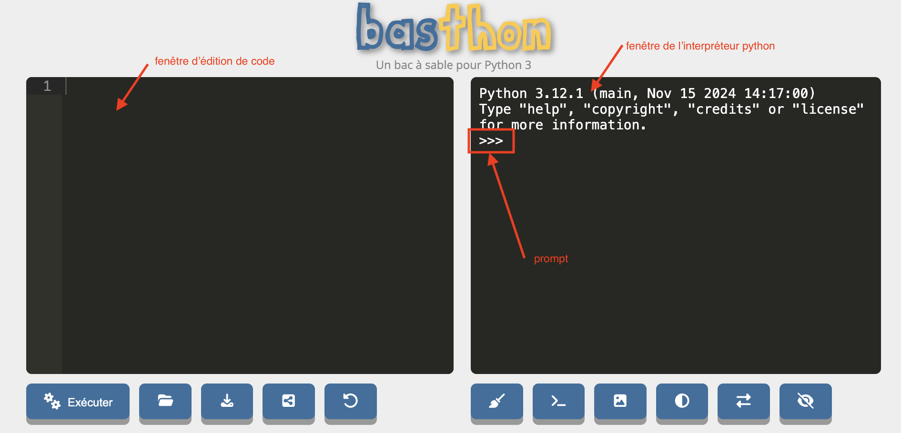
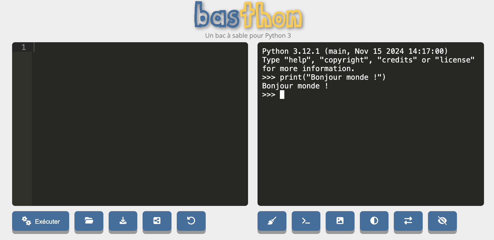
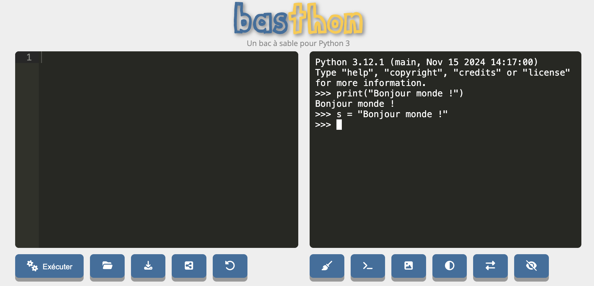
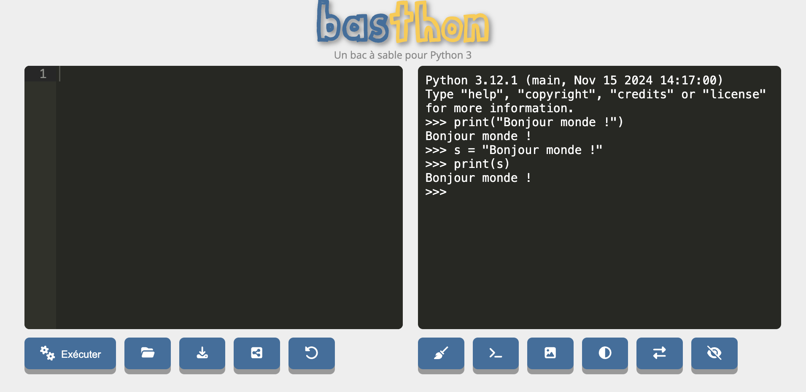
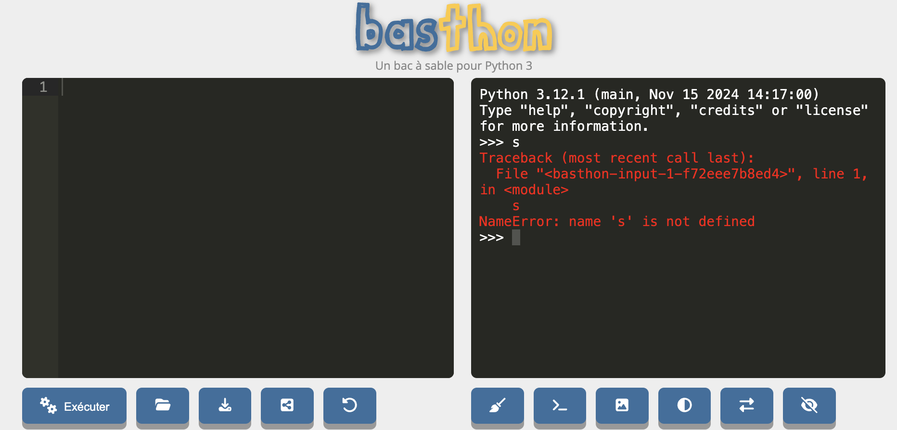

_Python_ est un [langage de programmation](https://fr.wikipedia.org/wiki/Langage_de_programmation) inventé en 1991 par [Guido van Rossum](https://fr.wikipedia.org/wiki/Guido_van_Rossum). C'est comme une langue mais en beaucoup plus simple car :

- il n'y a pas d'exception
- il y a très peu de vocabulaire de base
- il est structuré en lignes et non en phrase

Son but est de faire faire des choses à un ordinateur.

On ne peut cependant pas directement donner un texte écrit en python (qu'on appelle **_code_** ou **_programme_**) à un ordinateur pour qu'il l'exécute car celui-ci ne comprend que le [langage machine](https://fr.wikipedia.org/wiki/Langage_machine), on passe par un intermédiaire, un programme nommé **_interpréteur python_**.

## Interpréteur python


L'interpréteur python comme intermédiaire entre le code python et son exécution.



Tout code python est exécuté _via_ un interpréteur dont le but est de transformer le code python en code machine.

Ceci se fait **toujours** avec les 4 étapes suivantes :

1. on donne une ligne de code à l'interpréteur
2. l'interpréteur exécute cette ligne (il transforme la ligne en langue machine et la fait exécuter par l'ordinateur)
3. une fois la ligne exécutée, l'interpréteur redonne la main à l'utilisateur
4. retour à l'étape 1.

Tant que l'interpréteur est actif, un mécanisme de stockage permet de conserver des **_objets_** pour une utilisation future via des **_variables_**.


L'interpréteur python est **toujours** présent lorsque l'on exécute du code python.


Il y a plusieurs façon d'exécuter du code python, celle qui montre le plus explicitement l'interpréteur est l'**_exécution en mode console_**.



Allez sur le site <https://basthon.fr/> et choisissez *menu console > python*.

Vous allez vous retrouver sur le site <https://console.basthon.fr/>


Vous devriez avoir quelque chose du genre :



Intéressons nous pour l'instant à la partie de droite nommée la **_console_** :

- l'interpréteur python utilisé est 3.12.1
- le **_prompt_** (les `>>>`) indique que l'on peut écrire une ligne de code

Allons-y ! Exécutons notre premier programme :


A droite du prompt, écrivez le code `print("Bonjour monde !")`{.language-} puis appuyez sur la touche _entrée_.


Vous devriez obtenir quelque chose du type :




Si vous n'obtenez pas ça, vous pouvez toujours recharger la page (_menu afficher > actualiser cette page_ avec le navigateur chrome) pur recommencer avec un interpréteur vierge.


Le 4 étapes de l'exécution d'un code python de se sont effectuées :

1. on donne une ligne de code à l'interpréteur :
   1. vous avez écrit une ligne de code dans la console
   2. en appuyant sur la touche _entrée_, celle-ci a transmis la ligne à l'interpréteur
2. l'interpréteur à exécuté la ligne de code : elle affiche du texte à l'écran
3. une fois le code exécuté, la console reprend la main (le prompt a réapparu) 
4. on peut recommencer en 1.

> TBD ici on a exécuté une fonction (lien vers def). On y reviendra plus tard. Pour l'instant prenez ceci comme définition d'une fonction : nom(paramètre) en appuyant sur entrée la fonction est exécutée. et produit un résultat : Ici on affiche un texte à l'écran.

L'interpréteur ne n'arrête pas de fonctionner entre deux exécution de code. Vérifions le en commençant par créer une variable contenant ce que l'on veut afficher :



On vient d'affecter une variable (nommée `s`{.language-}) à un objet *chaîne de caractères*. COmme on a rien demandé d'afficher python se contente de revenir au prompt après avoir créé la variable. Affichons-là :



Ceci prouve bien que l'interpréteur python n'a pas cessé de fonctionner puisque la variable `s`{.language-} a pu être affichée. 

Si vous rechargez la page, un nouvel interpréteur est crée et il ne connaît plus la variable `s`{.language-} :



Lorsque python crie du rouge en anglais c'est que quelque chose ne va pas ici : `name 's' is not defined`, la variable `s`{.language-} n'est pas définie dans ce nouvel interpréteur.


Rechargez la page et vérifiez que la variable `s`{.language-} n'existe plus.


Retenez donc le point essentiel :


L'interpréteur python reste présent tout au long de l'exécution des instructions.



## Éléments de langage

On va lister les concepts fondamentaux qui permettent d'utiliser l'interpréteur python. Ces concepts sont identiques pour tous (ou quasi tous) les langages de programmation objet.


Refaites toutes les instructions que l'on va voir dans un interpréteur.



Dans tous les exemple de code qui suivront, lorsque la ligne de code commencera par `>>>`{.language-} cela signifiera que l'on  a exécuté ce code directement dans l'interpréteur, la ligne suivante montrera le résultat. Par exemple :

```python
>>> 21 * 2
42
```




### Commentaires

Commençons par ne **pas** écrire du python. Dans une ligne de code python, tout ce qui suit un `#`{.language-} n'est pas lu.

Par exemple, le code suivant écrit dans une console ne produit pas d'erreur (il n'est même pas lu...) :

```python
>>> # coucou python !
```

Alors que le même code sans `#`{.language-} est interprété par python et comme ce n'est pas du python cela produit une erreur :

```python
>>> coucou python !
  File "<stdin>", line 1
    coucou python !
           ^
SyntaxError: invalid syntax
```

### Objets et types d'objets


<https://docs.python.org/fr/3/library/stdtypes.html#built-in-types>


Les **_objets_** de python correspondent à tout ce qui est manipulé : le but d'un programme python est de créer et de rendre des objets.

Python connaît 6 types d'objets de base qui permettent de faire la grande majorité des programmes.

- **_Chaînes de caractères_**
  - exemple : `"python"`{.language-} ou `'python'`{.language-}
  - quelque chose qui commence et fini par `"`{.language-} ou qui commence et fini par `'`{.language-} ou encore qui commence et fini par `"""`{.language-}.
- **_Réels_**
  - exemple : `2.91`{.language-} ou `2.0`{.language-}
  - un nombre avec une décimale (qui peut être nulle) notée par un `.`{.language-}
- **_Entiers_**
  - exemple : `42`{.language-} ou `0`{.language-}
  - un nombre sans décimale
- **_Complexes_** (la notation utilise j à la place de i)
  - exemple : `3+2j`{.language-}, `1j`{.language-}
  - un réel ou entier avec une partie imaginaire, notée `j`{.language-}, entière ou imaginaire.
- **_Booléens_**
  - exemple : `True`{.language-} ou `False`{.language-}
  - que 2 possibilités, `True`{.language-} ou `False`{.language-}
- **_le vide_**, utilisé pour noter l'absence de valeur
  - ne contient qu'un unique élément noté `None`{.language-}


Tout objet de python possède un type.


Pour connaître le type d'un objet, on peut utiliser la fonction `type`{.language-}. Par exemple :

```python
>>> type(42)
<class 'int'>
```

Les entiers sont donc de type ` class 'int'`{.language-}, ce que l'on traduit par : l'entier 42 est objet de la classe entier :


Dans le cadre de ce cours on considérera que type et classe sont deux synonymes.


Quelle est la classe de chaque type d'objet ?


Dans la console de <https://console.basthon.fr/>, donnez la classe de chaque objet de base/




```python
>>> type("2")
<class 'str'>
>>> type(2.0)
<class 'float'>
>>> type(2)
<class 'int'>
>>> type(2+0j)
<class 'complex'>
>>> type(True)
<class 'bool'>
```




### Conversion de type

Le type d'un objet n'est pas modifiable : par exemple un entier (3) n'est pas un réel (3.0) et réciproquement. Il est en revanche possible de créer un nouvel objet du type choisi à partir d'un objet d'un autre type. Pr exemple pour créer un objet te type réel depuis un entier 3, on peut écrire : `float(3)`{.language-}. Ceci se généralise :


Créer un objet de type `type_a` à partir d'un objet `b` s'écrit :

```python
type_a(b)
```



On ne peut bien sur pas faire n'importe quoi `int("deux")`{.language-} ne crée pas un entier valant 2, mais beaucoup des choses sont possibles.

#### Réels, entiers et chaînes de caractères

On peut par exemple transformer un réel en entier :


Quel est le résultat de l'instruction suivante :

```python
int(3.1415)
```



```python
>>> int(3.1415)
3
```

C'est un entier valant 3.



Ou en entier en réel :


Quel est le résultat de l'instruction suivante :

```python
float(3)
```



```python
>>> float(3)
3.0
```

C'est un réel valant 3.0



On peut aussi transformer une chaîne de caractères en entier ou en réel. Par exemple :

```python
float("3.1415")
```

Va rendre un objet réel valant 3.1415 à partir d'une chaîne de caractère avec le caractère "3.1415".


Une chaîne de caractère n'est **pas** un réel ou un entier.



La conversion de chaînes de caractères en entier ou en réels est très courante lorsque l'on récupère des entrées tapées par un utilisateur qui sont **toujours** des chaînes de caractères


#### Objets booléens

On effectue souvent ce genre d'opération de façon implicite pour les booléens. Ainsi, un entier est vrai s'il est non nul.


Vérifiez le.



```python
>>> bool(42)
True
```



Tous les objets peuvent être converti en booléen.


Quand-est qu'une chaîne de caractère est fausse ?




Une chaîne de caractère est fausse si elle est vide et vraie sinon.

```python
>>> bool("")
False
>>> bool("False")
True
```



On peut aussi faire le contraire :


Que vaut la conversion de booléens en entier ?




Une chaîne de caractère est fausse si elle est vide et vraie sinon.

```python
>>> int(True)
1
>>> int(False)
0
```



### Variables

 Une **_variable_** est un nom qui va représenter un objet :


Une variable n'est **pas** un objet, ce n'est qu'un moyen d'y accéder.



Principe de l'affectation des variables en python.


[Variables](variables){.interne}


#### Opérations sur les objets

Créer de nouveaux objets avec d'autres objets.


[Opérations sur les objets](opérations){.interne}


### Fonctions et méthodes

Les fonctions et méthodes permettent d'utiliser les objets de python de façon pratique et puissante.


[Fonctions et méthodes](fonctions-méthodes){.interne}


## Modules

Les [modules](https://docs.python.org/fr/3/tutorial/modules.html) pythons sont des espaces de noms regroupant diverses fonctions pouvant être utilisées une fois _chargé_.


[Modules](modules){.interne}

