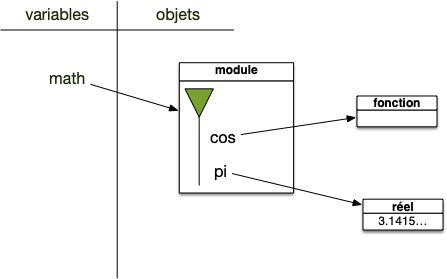
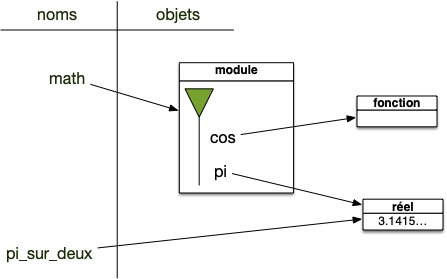
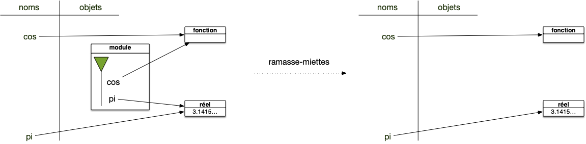
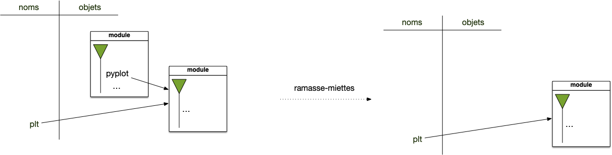

Un _module_ (aussi appelé _bibliothèque_ ou _library_) est un ensemble de fonctions utiles, utilisables dans de nombreux programmes. Python vient avec de nombreux modules, par exemple :

- [math](https://docs.python.org/fr/3.14/library/math.html) qui contient les fonctions mathématiques courantes,
- [random](https://docs.python.org/fr/3.14/library/random.html) qui permet de générer toutes sortes de nombres aléatoires,
- [pathlib](https://docs.python.org/3/library/pathlib.html) pour naviguer dans l'arborescence du disque dur,
- ...


Il existe de nombreux modules, réalisant une foultitude d'opérations. Avant de se mettre à coder quelque chose, commencez toujours par vérifier (google
est votre ami) s'il n'existe pas un module tout fait, vous gagnerez du temps. Python en fournit déjà de nombreux via sa bibliothèque standard.


[Bibliothèque standard de python](https://docs.python.org/fr/3.14/library/index.html)


## Utiliser un module

Pour utiliser un module, il faut commencer par l'importer avec la commande `import`{.language-}. Il existe plusieurs façon de faire, mais toutes fonctionnent sur le même principe : python va lire le module et associer les noms qu'il trouve à un espace de nom. Le mot clé utilisé est `import <nom de module>`{.language-} ou une de ses variations.

Nous allons ici calculer le cos de $\pi/2$. Pour cela commençons par utiliser la méthode explicite qui va nous permettre de montrer le fonctionnement interne de l'utilisation des modules.

### Importation directe du module

On met le nom complet avant chaque appel :

```python/
>>> import math
>>> pi_sur_deux = math.pi / 2
>>> math.cos(pi_sur_deux)
6.123233995736766e-17
>>>
```

Regardons ligne à ligne comment se comporte l'interpréteur avec les variables :

#### Import

La première ligne du code précédent crée une variable de nom `math`{.language-} et de type `module`.

```python/
>>> import math
>>> type(math)
<class 'module'>
>>>
```

Un module contient un objet python appelé _espace de nommage_ et qui permet d'associer des noms à des objets. Représentons ceci graphiquement :


L'espace de nommage (la flèche verte) contient tous les noms définis dans le module math (symbolisés par les `...`), en particulier les noms `pi` et `cos`, eux-même liées à des objets. Explicitons-le :



Pour accéder aux objets d'un espace de nommage, on utilise la notation pointée :


La notation `A.B` : se lit ainsi on cherche l'objet de nom `B` dans l'espace de nommage de l'objet de nom `A`


À l'issue de la seconde ligne on est dans l'état suivant :



La dernière ligne est alors exécutée de la même manière.

### Importation d'une méthode particulière

On peut aussi importer le module, mais ne pas retenir son nom :

```python
>>> from math import cos, pi
>>>
```

Après la ligne de l'import on est dans la situation suivante :


Le module est importé mais est inaccessible, seules les noms de l'import le sont. Le ramasse-miette supprime ensuite les objets inaccessible, ici le module. Donc Au final on a :



Ce qui nous permet ensuite d'écrire :

```python
>>> cos(pi / 2)
6.123233995736766e-17
```


Dans cette façon de faire, on associe des noms du module math à l'espace de nom global. Il n'y a aucune manière d'accéder aux autres noms défini dans math avec cette façon de faire.


### Importation de toutes les fonctions du modules

Une généralisation du cas précédent permet de tout importer :

```python
>>> from math import *
>>> log(e)
1.0
```


Cette méthode est **déconseillée dans la plupart des cas** car on ne sait pas vraiment ce qui a été importé. Ce qui nuit à la lisibilité du code.


### Importation de modules sous la forme d'alias

Quelques bibliothèques très utilisées s'importent avec des alias par exemple :

```python
>>> import numpy as np
```


Ou encore :

```python
>>> import matplotlib.pyplot as plt
```

Notez que dans ce dernier cas, ceci signifie que `pyplot`{.language-} était aussi un module !




Cela permet de raccourcir le nom, il suffira de taper `plt`{.language-} à la place de `matplotlib.pyplot`{.language-} mais cela se fait au **détriment** de la lisibilité. Il n'est donc pas recommandé du tout de le faire avec d'autres bibliothèque même s'il est tout à fait possible d'écrire ce genre d'horreurs :

```python
import math as m
import random as r
```



## Exercices avec le module random

Un module très utile dans python est le module [random](https://docs.python.org/fr/3/library/random.html)

Utilisez le pour répondre aux questions suivantes :


Générez un entier aléatoire entre 10 et 234.



On utilise la fonction [`randrange`{.language-} du module `random`{.language-}](https://docs.python.org/fr/3/library/random.html#random.randrange) :

```python
>>> import random
>>> random.randrange(10, 235)
51
```




Générez un nombre réel uniformément dans $[0, 1[$



On utilise la fonction [`random`{.language-} du module `random`{.language-}](https://docs.python.org/fr/3/library/random.html#random.random) :

```python
>>> import random
>>> random.random()
0.07350177375024702
```




Choisissez 2 éléments **avec** remise de la liste `["pomme", "abricot", "orange", "cerise"]`{.language-}



On utilise la fonction [`choices`{.language-} du module `random`{.language-}](https://docs.python.org/fr/3/library/random.html#random.choices) :

```python
>>> import random
>>> random.choices(["pomme", "abricot", "orange", "cerise"], k=2)
['pomme', 'pomme']
```




Choisissez 2 éléments **sans** remise de la liste `["pomme", "abricot", "orange", "cerise"]`{.language-}



On utilise la fonction [`sample`{.language-} du module `random`{.language-}](https://docs.python.org/fr/3/library/random.html#random.sample) :

```python
>>> import random
>>> random.sample(["pomme", "abricot", "orange", "cerise"], k=2)
['cerise', 'pomme']
```


