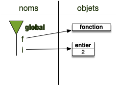

Une fonction est un bloc de code exécutable. On peut lui associer un nom et exécuter ce code juste en l'appelant : ceci permet de ne pas copier/coller des lignes code identiques à différents endroit du programme.

Il n'est jamais bon de copier/coller un bout de programme qui se répète plusieurs fois (corriger un problème dans ce bout de code reviendrait à le corriger autant de fois qu'il a été dupliqué... si on se rappelle des endroits où il l'a été). Il est de plus souvent utile de séparer les éléments logiques d'un programme en unités autonomes, ceci rend le programme plus facile à relire.

> TBD espace de nommage et `vars()` pour avoir l'espace actuel.

## Définition d'une fonction


Une ***fonction*** est [un bloc](../blocs){.interne} auquel on donne un nom (le nom de la fonction) qui peut être exécuté lorsqu'on l'invoque par son nom.

```python
def <nom>(paramètre 1, paramètre 2, ..., paramètre n):
    instruction 1
    instruction 2
    ...
    instruction n
    return <objet>
```



Les paramètres et la dernière la dernière ligne avec `return`{.language-} sont optionnelles.


La partie de programme suivant définit une fonction :

```python
def bonjour():
    print("Salutations")
```

La première ligne est la définition du bloc fonction. Il contient :

- un mot clé spécial précisant que l'on s'apprête à définir une fonction: `def`{.language-}
- le nom de la fonction. Ici `bonjour`{.language-}
- des parenthèses qui pourront contenir des paramètres (on verra ça plus tard)
- le `:`{.language-} qui indique que la ligne d'après va commencer le bloc proprement dit
  
Ensuite vient le bloc fonction en lui-même qui ne contient ici qu'une seule ligne.

Si on exécute le bloc précédent, il ne se passe rien. En effet on n'a fait que définir la fonction. Pour l'utiliser, ajoutez `bonjour()`{.language-} à la suite du bloc.


Une **fonction** s'utilise toujours en faisant suivre son nom d'une parenthèse contenant ses paramètres séparés par une virgule (notre fonction n'a pour l'instant pas de paramètres). Donner juste son nom ne suffit pas à l'invoquer.


## Nom d'une fonction

Un nom de fonction est variable comme une autre. Elle est affectée dans l'espace de nom du bloc dans lequel elle est défini.

Dans le code suivant, exécuté dans un interpréteur on regarde le type d'un nom associé à une fonction :

```python
>>> def bonjour():
...     print("Salutations")
... 
>>> type(bonjour)
<class 'function'>
```

On peut aussi associer la fonction à une autre variable comme on le ferait avec n'importe quel autre objet. Dans l'exemple suivant on associe la fonction à une autre variable, `x`{.language-} :

```python
>>> def bonjour():
...     print("Salutations")
... 
>>> x = bonjour
>>> x()
Salutations
```

En python, lorsque l'on exécute une fonction on dit qu'on **l'appelle**. ***Appeler une variable*** est alors le fait de mettre des `()` après son nom.

Si cela produit une erreur ce n'était pas une fonction. Regardez l'exemple ci-après, exécutable dans un interpréteur. On tente d'appeler un entier et python nous indique que ce n'est pas possible :

```python
>>> n = 3
>>> n()
Traceback (most recent call last):
  File "<stdin>", line 1, in <module>
TypeError: 'int' object is not callable
```

Enfin, en python être une fonction n'est rien d'autre que d'être un ***objet appelable***. Savoir si un objet est appelable ou pas se fait par la fonction `callable`{.language-} :

```python
>>> def bonjour():
...     print("Salutations")
... 
>>> callable(bonjour)
True
>>> callable(1)
False
>>> callable("ee")
False
```


Les fonctions ne sont pas les seules objets appelables, les types le sont également : le résultat de l'appel du type `list`{.language-} (c'est à dire `list()`{.language-}) crée une liste vide.

Il en existe de nombreux autres, python étant friand de ce genre d'opérations.



## Paramètres d'une fonction

> TBD parler d'espace de nom

```python
def plus_moins(nombre):
    if nombre > 42:
        print("Supérieur à 42")
    else:
        print("Inférieur à 42")
```

Cette fonction nécessite donc un paramètre pour être invoquée. Testez alors `plus_moins(17)`{.language-}.
La variable nombre sera associée à l'objet entier de valeur 17 dans la fonction. La variable nombre n'existe que dans la fonction.

Python, à chaque exécution d'une fonction crée un espace de nom pour elle. Cet espace de nom sera détruit lorsque la fonction aura fini d'être exécutée. Une fois cet espace de nom crée, il associe le nom du paramètre à l'objet passé en paramètre.


Les *paramètres* d'une fonction sont des **noms** de variables qui ne seront connus qu'à l'intérieur de la fonction. À l'exécution de la fonction, le nom de chaque paramètre est associé à l'objet correspondant.


Regardons le bout de code suivant, qui utilise la fonction `plus_moins`{.language-} définie précédemment :

```python
x = 12
plus_moins(x)
```

Lorsque python exécute la deuxième du code précédent il va :

1. créer un espace de nom pour la fonction
2. regarder les objets passés en paramètre. Ici c'est l'objet associé au nom `x`{.language-}. Python cherche l'objet, c'est un entier valant 12.
3. python associe chaque objet à son nom **dans** l'espace de nom de la fonction : ici l'entier qui vaut 12 sera appelé `nombre`{.language-} dans la fonction (le nom du paramètre dans la définition de la fonction).
4. python exécute la fonction.
5. à la fin de la fonction, l'espace de nom de la fonction est détruit (on ne détruit que les noms, pas les objets associés).


Créez et testez une fonction nommée `cube`{.language-} qui prend un entier en paramètre et affiche cet élément au cube.



```python
def cube(x):
    print(x ** 3)

cube(2)
```




Créez et testez une fonction nommée `puissance`{.language-} qui prend deux entiers en paramètre et affiche à l'écran le premier paramètre élevé à la puissance du second paramètre.



```python
def puissance(x, y):
    print(x ** y)

puissance(2, 3)
puissance(3, 2)
```



## Paramètres par défaut

```python
def plus_moins(nombre, seuil=42):
    if nombre > seuil:
        print("Supérieur à", seuil)
    else:
        print("Inférieur à", seuil)

```

On peut alors utiliser la fonction comme précédemment, `plus_moins(20)`{.language-}, ou en utilisant le paramètre seuil `plus_moins(20, seuil=10)`{.language-}.


Comme le paramètre par défaut est le deuxième on peut aussi l'utiliser sans le nommer : `plus_moins(20, 10)`{.language-}



Créez et testez une fonction nommée `puissance`{.language-} qui prend deux entiers en paramètre et affiche le premier paramètre élevé à la puissance du second paramètre. Le second paramètre vaut 2 par défaut.



```python
def puissance(x, y=2):
    print(x ** y)
```



## Retour d'une fonction

Toute fonction peut rendre une valeur. On utilise le mot-clef `return`{.language-} suivi de la valeur à rendre pour cela. Le fonction suivante rend le double de la valeur de l'objet passé en paramètre:

```python
def double(valeur):
    x = valeur * 2
    return x
```

Il ne sert à rien de mettre des instructions après une instruction `return`{.language-} car dès qu'une fonction exécute cette instruction, elle s'arrête en rendant l'objet en paramètre. Le retour d'une fonction est pratique pour calculer des choses et peut ainsi être affecté à une variable.


Dans un [notebook](../../notebooks){.interne} ou dans [Spyder](https://www.spyder-ide.org/), définissez la fonction précédente dans une cellule puis exécutez là.

Puis, dans une seconde cellules collez la ligne ci-après puis exécutez la.

```python
print(double(21))
```



Le résultat de la cellule devrait être : 42.

Le code précédent exécute la fonction de nom `double`{.language-} avec comme paramètre un entier de valeur `21`{.language-}. La fonction commence par associer à une variable nommée `valeur`{.language-} l'objet passé en paramètre (ici un entier de valeur `21`{.language-}), puis crée une variable de nom `x`{.language-} à laquelle est associée un entier de valeur `42`{.language-} et enfin se termine en retournant comme valeur l'objet de nom `x`{.language-}. Les variables `valeur`{.language-} et `x`{.language-} définies à l'intérieur de la fonction sont ensuite effacées (pas les objets, seulement les noms).

Cette valeur retournée est utilisée par la commande `print`{.language-} pour être affichée à l'écran.


Les noms de paramètres d'une fonction et les variables déclarée à l'intérieur de la fonction n'existent qu'à l'intérieur de celle-ci. En dehors de ce blocs, ces variables n'existent plus.



Créez et testez une fonction nommée `puissance`{.language-} qui prend deux entiers en paramètre et rend le premier paramètre élevé à la puissance du second paramètre. Le second paramètre vaut 2 par défaut.



```python
def puissance(x, y=2):
    return x ** y
```



## Fonction en paramètre

Une fonction étant un objet comme un autre, elle peut très bien être utilisée comme paramètre :

```python
def calcul(fct, z):
    return fct(2, 17) + z
```

Le premier paramètre de la fonction `calcul`{.language-} est appelé avec deux paramètres et son résultat est additionné au second paramètre.

La ligne suivante est alors du python correct :

```python
print(calcul(produit, 8))
```

Si on a au préalable définit `produit`{.language-} comme une fonction à deux paramètres, comme par exemple :

```python
def produit(x, y):
    return x * y
```


Exécutez le code précédent et expliquer son fonctionnement



Le code final doit définir produit avant son utilisation. Il faut par exemple avoir le code :

```python/
def calcul(fct, z):
    return fct(2, 17) + z

def produit(x, y):
    return x * y

print(calcul(produit, 8))
```

Notez que lors de la définition de la fonction `calcul`{.language-}, la variable `fct`{.language-} n'est qu'un paramètre anonyme. Ce paramètre ne doit être défini que lors de son appel, à la ligne 7.

La ligne 7 fonctionne alors comme suit :

1. l'objet de type fonction de nom `produit`{.language-} est passé en paramètre de la fonction `calcul`{.language-}
2. le retour de l'appel `calcul(produit, 8)`{.language-} est égal à $8 + (2 * 17) = 42$ puisque `fct`{.language-} est la fonction `produit`{.language-}.
3. son retour (42) est ensuite affiché à l'écran grâce à la fonction `print`{.language-}



## Lambda


<https://python-reference.readthedocs.io/en/latest/docs/operators/lambda.html>


Les lambda sont ue façon d'écrire rapidement une fonction avec une unique instruction.

Les deux codes suivant sont identiques :

```python
double = lambda x: 2 * x
```

et :

```python
def double(x):
    return 2 * x
```

Le principal intérêt de ces fonction est d'être utilisée comme paramètre d'autres fonction.

Par exemple avec [le paramètre `key`{.language-} de la méthode de liste `sort`{.language-}](https://docs.python.org/fr/3/library/stdtypes.html#list.sort). Considérons la liste `l`{.language-} :

```python
l = [["au revoir", 2], ["bonjour", 1]]
```

Si on cherche à trier `l`{.language-}, la liste sera triée en comparant le 1er élément de chaque liste :

```python
l.sort()

print(l)  # donnera [['au revoir', 2], ['bonjour', 1]]
```

Si l'on veut trier sur le deuxième élément de chaque liste, on utilise le paramètre `key`{.language-} qui est une fonction. Les éléments $x$ de la liste seront triés selon $key(x)$ plutôt que $x$ :

```python
def second(x):
    return x[1]

l.sort(key=second)

print(l)  # donnera [['bonjour', 1], ['au revoir', 2]]
```


Que donnerait le tri si la fonction `second`{.language-} avait été définie comme ceci :

```python
def second(x):
    return 1 / x[1]
```




```python
def second(x):
    return 1 / x[1]

l = [["au revoir", 2], ["bonjour", 1]]

l.sort(key=second)

print(l)
```



Utiliser une fonction lambda permet de raccourcir le code précédent tout en le gardant très clair :

```python
l = [["au revoir", 2], ["bonjour", 1]]

l.sort(key=lambda x: x[1])

print(l)  # donnera [['bonjour', 1], ['au revoir', 2]]
```

## Annotations de type


<https://docs.python.org/fr/3.10/library/typing.html>


Les annotations de types permettent de renseigner le type des entrées et de la sortie d'une fonction python. Il n'est pas nécessaire de le faire, mais si vous avez besoin d'expliciter une signature de fonction comme on le ferait dans un langage compilé comme java, vous pouvez le faire en ajoutant :

- son type à chaque paramètre (précédé d'un `:`)
- le type de sortie (précédé d'un `->`)

Par exemple, la fonction suivante permet de savoir si un élément est dans une liste :

```python
def recherche(t, x):
    for e in t:
        if e == x:
            return True
    return False
```

Si l'on veut restreindre cette fonctions aux listes d'entier on pourra écrire :

```python
def recherche(t: [int], x: int) -> bool
    for e in t:
        if e == x:
            return True
    return False
```


La plupart du temps, pour de petits programme, ce genre de précision n'est pas importante. Elle ne devient cruciale que lorsque la base de code grossit et que spécifier les types d'entrée évite les bug.

Mais alors, il est de toute façon plus pertinent d'écrire dans un autre langage que python... Plus adapté au développement de grosses applications comme le java ou encore le rust.




## Espace de nommage et fonctions

> TBD à faire propre

## Port d'attache d'un espace de noms

Les espaces de noms sont des objets spéciaux qui ne peuvent vivre indépendamment. Il sont toujours rattachés à leur contexte qui est soit :

- le programme principal : c'est le cas de l'espace de nom globals
- une fonction : crée lors de l'appel d'une fonction pour gérer ses paramètre et variables locales.
- un module : les espaces de noms crées après un import

### Fonctions

L'exécution d'une fonction est un moment où un espace de noms est créé. Cela se passe selon le processus suivant :


Lorsque l'on exécute une fonction on procède comme suit :

1. on crée un nouvel espace de noms $F$
2. l'espace de noms courant est affecté au parent de $F$
3. $F$ devient le nouvel espace de noms courant.
4. on affecte les paramètres de la fonction à leurs noms
5. on exécute ligne à ligne la fonction
6. le parent de $F$ devient le nouvel espace de noms courant
7. on supprime l'espace de noms $F$



#### Exécution d'une fonction

```python/
def f(x):
   i = 2 * x
   return i + 3

i = 2
x = f(i)
```

Exécutons le ligne à ligne :

1. avant l'exécution de la première ligne :
   1. on a un unique espace de noms (`global`) qui est l'espace courant (en vert sur la figure)
      
2. la ligne 2 définit une fonction de nom `f`{.language-} qui est ajouté à l'espace de noms courant.
   
3. on passe directement à la ligne 5 puisque les lignes 3 et 4 sont le contenu de la fonction.
   1. Cette ligne crée un objet entier (valant 2) et l'affecte au nom `i`{.language-}.
      
4. la ligne 6 est encore une affectation. On commence par trouver l'objet à droite du `=` c'est le résultat de `f(i)`{.language-}. Il faut donc exécuter la fonction `f`{.language-} pour connaître cet objet :
   1. on cherche l'objet associé à `i`{.language-} qui sera le (premier) paramètre de la fonction
   2. on crée un espace de noms qui devient l'espace de noms courant :
      1. l'ancien espace de noms courant devient son parent
         
   3. on affecte le premier paramètre de `f`{.language-} au nom `x`{.language-} (le nom du premier paramètre de `f`{.language-} lors de sa définition)
      1. les nouveaux noms sont **toujours** créés dans l'espace de noms courant
         
   4. on exécute la ligne 2 qui est la première ligne de la fonction `f`{.language-} :
      1. on crée un objet entier (valant 4) qui est le résultat de l'opération à droite du `=`{.language-} (notez que le nom `x`{.language-} est bien défini dans l'espace de noms courant) et on l'affecte au nom `i`{.language-} dans l'espace de noms courant
         
   5. on exécute la ligne 3 :
      1. on crée l'objet résultant de l'opération somme (un entier valant 7)
      2. la fonction est terminée, son espace de noms courant est détruit
      3. l'espace de noms courant devient le parent de l'espace de noms détruit
         
      4. on rend l'objet résultat de la fonction
   6. la droite du signe `=`{.language-} de la ligne 6 est trouvée (c'est un entier valant 7) et il est affecté à la variable `x`{.language-} de l'espace de noms courant (qui est à nouveau `global`)
      1. 
      2. les objets sans nom sont détruits
         

#### Espaces de noms parent

L'espace de noms parent sert lorsque l'on cherche un nom qui n'est pas défini dans l'espace de noms courant :


Si un nom est recherché, mais que celui-ci n'est défini dans l'espace de noms courant, le nom est recherché dans l'espace de noms parent de l'espace courant.


```python/
def f(x):
   i = C * x
   return i + 3

C = 2
i = 2
x = f(i)
```

Lors de l'exécution de la fonction `f`{.language-} (instruction de la ligne 7), sa première ligne cherche la variable nommée `C`{.language-}. On se trouve dans cet état là :


La variable `C`{.language-} n'existe pas dans l'espace de noms courant (celui de `f`{.language-}), le programme va alors chercher dans l'espace de noms parent s'il existe. Ici c'est le cas puisque l'espace parent de `f`{.language-} est `global` dans lequel `C`{.language-} est défini : le programme ne produit donc pas une erreur et trouve le bon objet.


Les variables sont **toujours** créées dans l'espace de noms courant, mais leur recherche remonte de parent en parent jusqu'à la trouver.

