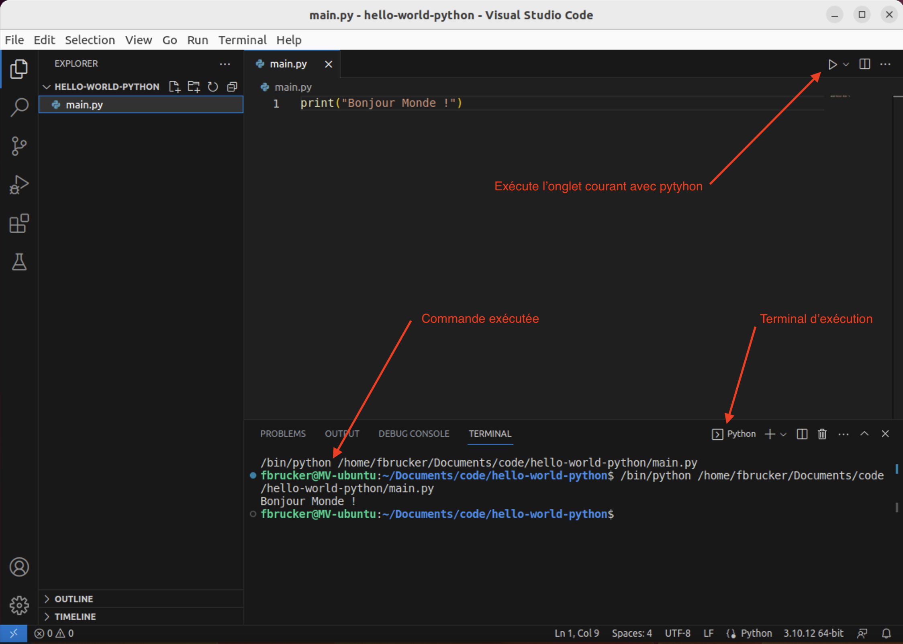
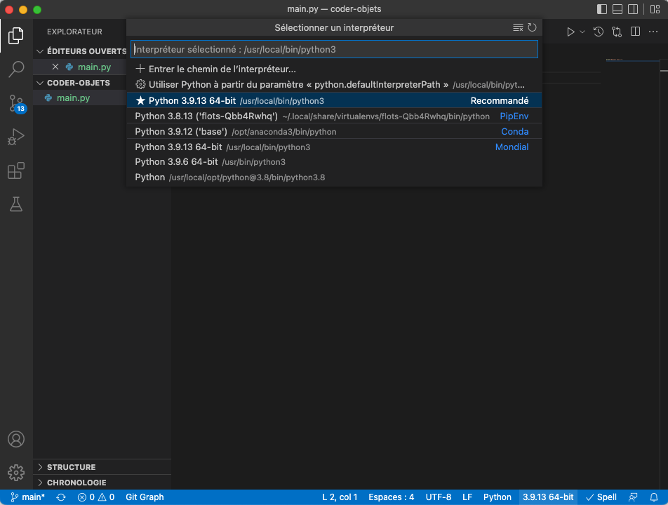

<!-- début résumé -->

Configuration de [visual studio code](https://code.visualstudio.com/) pour le développement en python.

<!-- fin résumé -->


<https://code.visualstudio.com/docs/python/python-tutorial>


## Extension python pour vscode


<https://code.visualstudio.com/docs/languages/python>


La principale extension à installer lorsque l'on fait du python est [Python](https://marketplace.visualstudio.com/items?itemName=ms-python.python) développée par microsoft. Il est également recommandé d'installer [Pylance](https://marketplace.visualstudio.com/items?itemName=ms-python.vscode-pylance) (utilitaire puissant d'aide au code).

Pour installer ces package :


Rendez vous dans [la gestion des extensions de vscode](../prise-en-main#extensions){.interne}, puis tapez _python_ dans la barre de recherche. Assurez vous d'installer les packages créés par microsoft.


## Premier programme

Nous allons créer un premier fichier de code python pour permettre de finaliser l'installation des liens entre l'interpréteur python et vscode.


Avec vscode tout programme qu'on va coder **doit** dépendre d'un **_projet_**. Ce projet est un **dossier** dans lequel seront placés nos fichiers.

Ceci est important car cela permet à vscode de lier les fichiers du projet entre eux (pour les tests par exemple) et nous aider.



Créez un dossier nommé `hello-world-python`{.fichier} sur votre ordinateur, et ouvrez le avec vscode (_menu Fichier > ouvrir le dossier..._) pour le considérer comme un projet.


Une fois que vous avez dit que vous faisiez confiance au développeur de ce projet, fermez l'onglet _Welcome_. Vous pouvez même fermer l'explorer en cliquant sur l'icône en sur-brillance dans la barre d'activité de [l'interface vsc](https://code.visualstudio.com/docs/getstarted/userinterface).


Créez un fichier `main.py`{.fichier} (_menu Fichier > nouveau fichier texte_ puis sauvez le immédiatement _menu Fichier > Enregistrer_).


Si vous n'avez pas encore configuré python, vscode va vous demander le faire.


Suivez les instructions de vscode (vous n'avez normalement pas grand chose à faire, vscode trouvera normalement les bons paramètres) pour faire le lien entre votre interpréteur python et lui.


Une fois la configuration terminée, écrivons notre code :



```python
print("Bonjour monde !")
```



### <span id="exécuter-programme"><span> Exécution du programme

1. assurez vous d'être dans l'onglet contenant le fichier `main.py`{.fichier} de vscode
2. cliquez sur le triangle en haut à droite de la fenêtre pour exécuter le programme.

Vous devriez obtenir quelque chose du genre :



Pour exécuter du python, vscode écrit une _ligne de commande_ dans un _terminal_. Nous expliciterons ces deux notions plus tard, pour l'instant admettez que l'exécution de notre programme s'est effectué dans une nouvelle fenêtre appelée terminal via l'exécution d'une commande.

Dans l'exemple précédent, la ligne de commande était :

```shell
/bin/python /home/fbrucker/Documents/code/hello-world-python/main.py
```


Ce qui est avant la ligne de commande, c'est à dire `fbrucker@MV-ubuntu:~/Documents/code/hello-world-python$` dans l'exemple précédent est appelé le _prompt_ et est ce que le terminal met au début de chaque ligne avant que l'on puisse taper des commandes.


La ligne de commande d'un terminal est toujours composée de la même façon :

```shell
nom-du-programme paramètre-1-du-programme ... paramètre-n-du-programme
```

Dans notre cas:

- nom du programme : `/bin/python` Qui est le chemin vers l'exécutable python
- un unique paramètre : `/home/fbrucker/Documents/code/hello-world-python/main.py` qui est le chemin vers le fichier à exécuter


Pour connaître le python utilisé, il suffit de cliquer en bas à droite de la fenêtre de vscode. On voit tout les pythons connus :



Celui utilisé est précédé d'une étoile.

