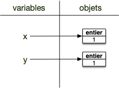

Les variables permettent à l'interpréteur de se rappeler d'objets qu'il a crée lors d'exécutions précédentes. Sans elles, on ne pourrait exécuter que des lignes indépendantes les unes entre elles : bref, on ne pourrait rien faire d'intéressant.


Une variable est un **_nom_** auquel est associé un objet.

Pour associer un nom à un objet on utilise **_l’opérateur d’affectation_** `=`{.language-} tel que:

```txt
nom = objet
```



A gauche de l’opérateur d'affection `=`{.language-} se trouve une **variable** (en gros, un nom ne pouvant commencer par un nombre) et à droite un **objet**. Après affectation, dans toute la suite du programme l'interpréteur python  remplacera la variable par l'objet à chaque fois qu'elle la rencontrera.


Une variable n'est **PAS** une chaîne de caractères. Une chaîne de caractère est un objet alors qu’un nom n’est qu’un alias vers un objet.


Il est important de comprendre que l’opérateur d’affectation `=`{.language-} n’est pas symétrique. À gauche, des variables et à droite, des objets.


Utilisez la console de <https://console.basthon.fr/> pour exécuter les divers exemples et exercices


## Affectation des objets à une variable

Attardons nous un moment sur le processus d'affectation car il est seront crucial pour appréhender les possibilités offertes par les objets.

Considérons le programme suivant :

```python/
x = 1
y = 1
y = x
```

Et regardons ce qu'il se passe au niveaux des variables et des objets après chaque instruction.

Au départ, avant l'exécution par l'interpréteur de la première ligne le programme ne possède aucune variable ni aucun objet. On possède cependant deux espaces **_distincts_** pour les accueillir :


Après l'exécution de la ligne 1, nous sommes dans la situation suivante :


La variable de nom `x` est affectée à un objet entier valant 1. Notez bien que la variable et l'objet sont deux choses différentes et sont uniquement mis en relation par la flèche. De plus :


On ne peut accéder à un objet en python que via une variable qui lui est affectée.


L'exécution de la deuxième instruction procède de la même manière, à l'issue de celle-ci on se trouve dans l'état suivant :



Notez bien que les objets mis en relations ne sont pas les mêmes, ce sont deux objets de type entier valant 1.

L'instruction de la ligne 3 est plus spéciale puisqu'à droite de l'opérateur d'assignation `=` est une variable. Python procède alors ainsi :

1. il cherche l'objet associé à la variable `x`
2. il assigne l'objet trouvé à la nouvelle variable `y`

On se trouve dans la situation suivante :


L'objet précédemment assigné à `y` n'est plus associé à aucune variable : il n'y a plus aucun moyen d'y acceder. Ces objets non assignés sont supprimés à intervalles réguliers (c’est ce qu’on appelle le [garbage collector](https://towardsdatascience.com/memory-management-and-garbage-collection-in-python-c1cb51d1612c)).

Ce mécanisme d'affectation est puissant, il permet par exemple d'affecter plusieurs variables en même temps, comme le montre l’exemple suivant qui échange les objets des noms `i`{.language-} et `j`{.language-} :

```python
i = 2
j = 3
i, j = j, i
```

> TBD dessin en exercice.

Enfin, il est possible d'affecter plusieurs noms à un même objet. Par exemple l'exemple suivant affecte le même entier 1 aux noms `x`{.language-} et `y`{.language-} :

```python
x = y = 1
```

> TBD dessin en exercice.

## Supprimer une variable

On peut supprimer un nom en utilisant le mot clé `del`{.language-}.

Dans une console :

```python
>>> x = 2
>>> print(x)
2
>>> del x
>>> print(x)
Traceback (most recent call last):
  File "<stdin>", line 1, in <module>
NameError: name 'x' is not defined
```

## Exercices

Faites les différents exercice ci-après dans une console (certains exercices sont liés) :


Affectez la valeur 3 à la variable `a`{.language-}, puis affichez à l'écran la valeur associée à la variable `a`{.language-}.



```python
>>> a=3
>>> print(a)
3
```



Affectez la _nouvelle_ valeur 6 à la variable `a`{.language-}, puis affichez à l'écran la valeur associée à la variable `a`{.language-}.



```python
>>> a=6
>>> print(a)
6
```



Affectez la valeur 2 à la variable `A`{.language-}, puis affichez à l'écran la valeur associée aux variables `a`{.language-} et `A`{.language-}.



```python
>>> A = 2
>>> print(a)
6
>>> print(A)
2
```

Les variables sont [sensibles à la casse](https://fr.wikipedia.org/wiki/Sensibilit%C3%A9_%C3%A0_la_casse) : a est différent de A.




Affectez la valeur 4 à la variable `b`{.language-}, puis affectez le résultat de la somme des variables `a`{.language-} et `b`{.language-} à variable `c`{.language-}




```python
>>> b = 4
>>> c = (a+b)/2
>>> print(b)
4
>>> print(c)
5.0
```

`c`{.language} est un réel.




Affectez en une ligne les valeurs 3 et 12 respectivement aux variables `j`{.language-} et `k`{.language-}




```python
>>> i, j = 3, 12
```




Affectez en une ligne la valeur 3 aux variables `x`{.language-}, `y`{.language-} et `z`{.language-}.




```python
>>> x = y = z = 3
```


