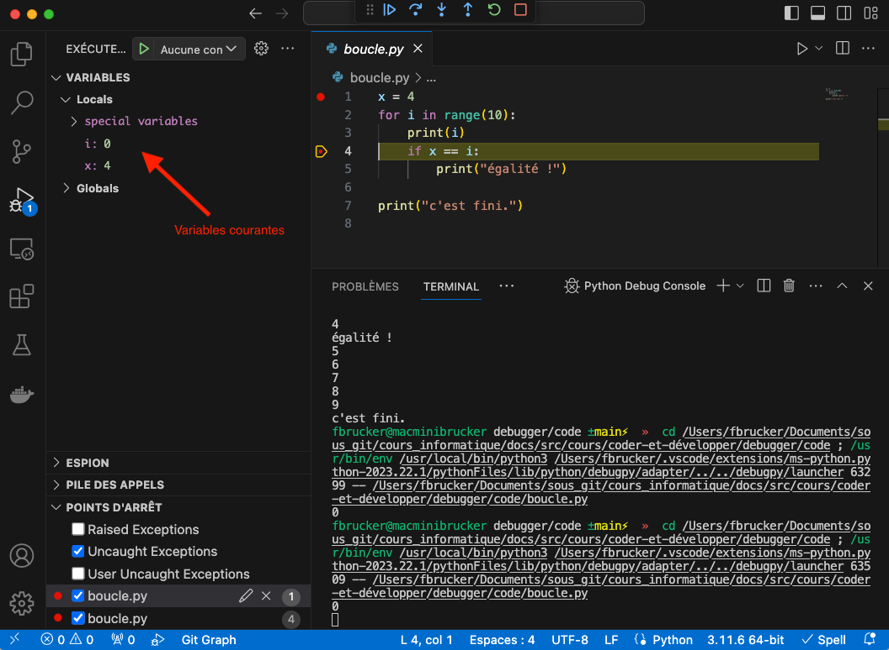
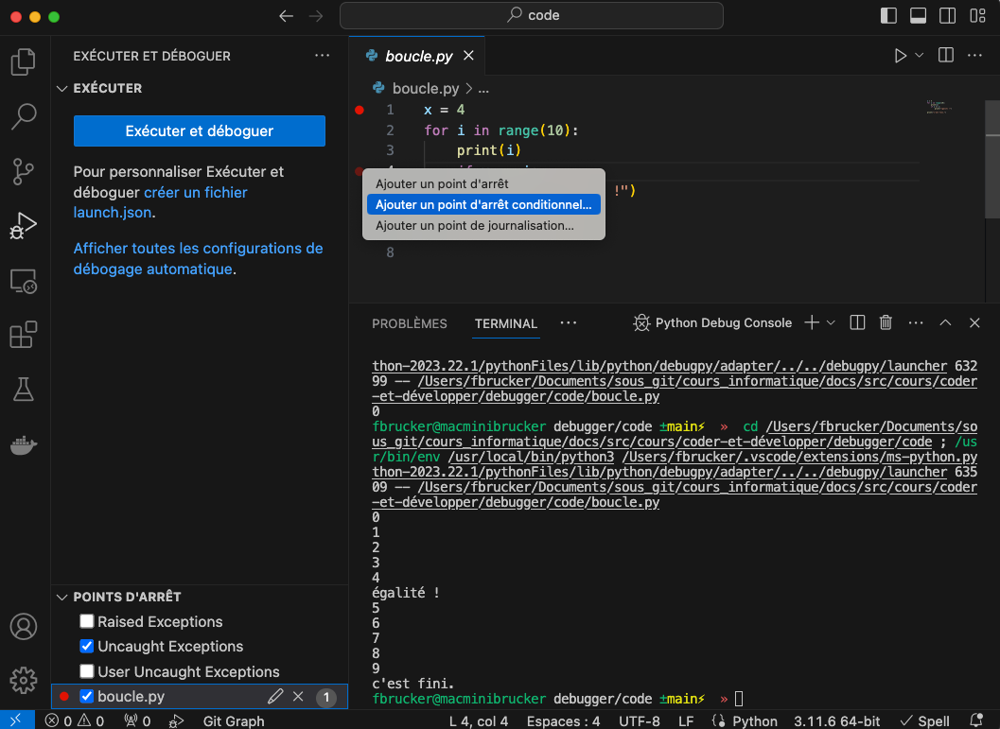
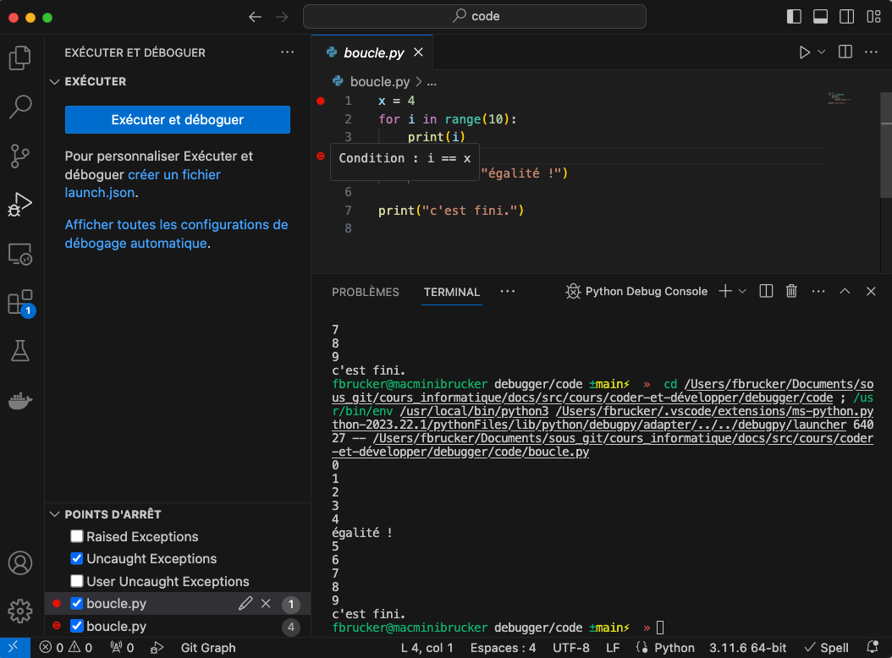
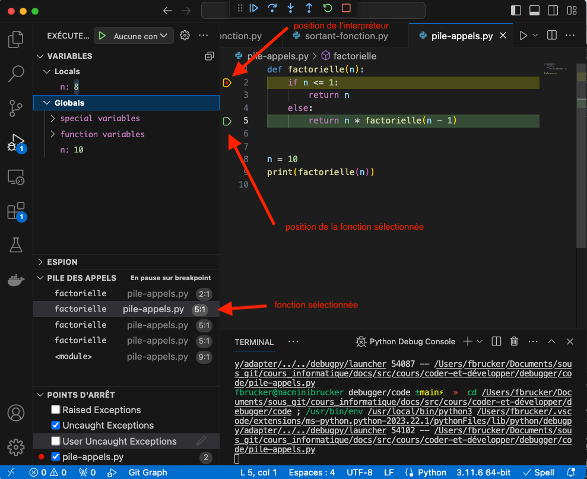



[documentation vscode](https://code.visualstudio.com/docs/editor/debugging)





Deux video d'utilisation du debugger :

- <https://www.youtube.com/watch?v=7qZBwhSlfOo>
- <https://www.youtube.com/watch?v=KEdq7gC_RTA&list=PLQzZ4krxwT9Yay3kz8ly4wXiYJHzMtsWi>



Le ***débogueur*** (***debugger***) est un moyen d'exécuter le code ligne à ligne et de pouvoir visualiser et modifier l'état interne de l'interpréteur. Ceci permet de très rapidement corriger un programme.

Comprendre comment fonctionne un débogueur vous permet également de comprendre comment fonction un interpréteur et par là comment s'exécute un programme informatique.


Créez un dossier que vous nommerez `debugger`{.fichier} et ouvrez le en tant que projet dans vscode.


L'idée est de remplacer les divers `print`{.language-} utilisés pour visualiser un problème par une exécution contrôlée du code et de pouvoir stopper son exécution à des endroit prédéterminés appelés breakpoint.

## Breakpoint et exécution pas à pas


Créez un fichier `boucle.py`{.fichier} dans votre projet et copiez/collez y le code ci-après.


```python/
x = 4
for i in range(10):
    print(i)
    if x == i:
        print("égalité !")

print("c'est fini.")

```


Faites en sorte que les numéros de lignes correspondent.


### Exécution du debugger

On peut exécuter le programme via le debugger de plusieurs façons :

- `menu exécuter > démarrer le débogage`
- choisir le menu exécuter (`menu affichage > exécuter`) puis cliquer sur exécuter et déboguer.


À la première utilisation, il vous sera demandé de choisir une configuration de débogage , choisissez : `Fichier python Déboguer le fichier Python actuellement actif`



Vous pouvez refaire votre choix en allant dans le `menu Exécuter` puis en choisissant soit `Ouvrir les configurations` soit `Afficher les configurations`.





1. Allez dans le menu exécuter : `menu affichage > exécuter`
2. cliquez sur le bouton bleu `Exécuter et déboguer`



Si vous n'avez pas de bouton bleu c'est peut-être que vous avez ajouté des configurations de débogage à l'insu de votre plein gré. POur les supprimer, supprimez le dossier `.vscode`{.fichier} qui a du apparaître dans votre projet (clique droit dessus puis choisissez supprimer).


Une fois le programme lancé il a du s'exécuter et afficher dans le terminal :

```text
0
1
2
3
4
égalité !
5
6
7
8
9
c'est fini.
```

Il ne s'est rien passé de plus que si vous aviez exécuté votre programme python normalement.

C'est normal par il faut demander explicitement au débogueur de s'arrêter un créant un [***point d'arrêt***](https://fr.wikipedia.org/wiki/Point_d'arr%C3%AAt_(informatique)) (***breakpoint***).

### Création d'un breakpoint

Pour créer [un point d'arrêt (breakpoint)](https://code.visualstudio.com/docs/editor/debugging#_breakpoints) :

- `menu exécuter > activer/désactiver le point d'arrêt`
- cliquer sur la gouttière du fichier, à gauche des numéros de lignes (vous savez que vous êtes au on endroit lorsque un disque rouge foncé apparaît)
- appuyer sur la touche `<F9>`

Une fois le breakpoint placé, un point rouge doit apparaître dans la gouttière du fichier :



Placez un breakpoint à la ligne 1 du fichier `boucle.py`{.fichier} (identique à l'image ci-dessus).


On voit que le breakpoint est actif car il est sélectionné en bas à gauche du panneau du débogueur

### Lancement du débogueur


Avec le breakpoint de la ligne 1 actif, exécutez le débogueur en cliquant sur le bouton `Exécuter et déboguer`. Vous devriez vous retrouver dans l'état de la figure ci-dessous.



Le breakpoint est placé à la ligne 1 :


Un ***breakpoint*** (***point d'arrêt***) sur une ligne du code permet de stopper l'interpréteur **juste avant l'exécution de cette ligne**.

Si l'interpréteur ne passe pas par cette ligne lors de l'exécution du code, le breakpoint n'a aucun effet


On a plusieurs types d'actions possibles (le nom de l'action apparaît lorsque la souris est placée dessus) :

- les actions bleues, `Continuer`, `pas à pas principal`, `pas à pas détaillé` et `pas à pas sortant`  qui gèrent l'exécution de l'interpréteur :
  - `Continuer` : l'interpréteur se lance et s'arrête à l prochaine ligne avec un breakpoint qu'il rencontre
  - `pas à pas principal` (*step over*) : l'interpréteur exécute la ligne
  - `pas à pas détaillé` (*step into*) : si la ligne consiste à exécuter une fonction que l'on a écrite, l'interpréteur d'arrête juste après l'appel de la fonction
  - `pas à pas sortant` : si l'interpréteur exécute une fonction que l'on a écrite, l'interpréteur continue son exécution jusqu'à ce qu'il sorte de la fonction
- l'action verte, `Redémarrer`, qui redémarre le débogueur
- l'action rouge, `Arrêter`, qui stoppe le débogueur

#### Action `Continuer`


Cliquez sur l'action bleue `continuer`.


L'interpréteur à continué son exécution jusqu'à trouver une ligne avec un breakpoint, ce qu'il n'a pas trouvé.


Ajoutez un breakpoint à la ligne 4 puis :

1. re-exécutez le débogueur
2. cliquez sur l'action `Continuer`



Vous devriez vous retrouver dans l'état suivant :



On voit l'état interne de l'interpréteur avec les deux variables `i`{.language-} (valant 0) et `x`{.language-} valant 4 (ces deux variables sont également ici des variables globales, on verra pourquoi plus tard).


L'action `Continuer` active l'exécution de l'interpréteur. Il va rester en action jusqu'à la rencontre d'une instruction munie d'un breakpoint.



#### Action `pas à pas principal`


Cliquez sur l'action `pas à pas principal`.


L'interpréteur est remonté en ligne 2. Puisque `i`{.language-} est différent de `x`, le bloc conditionnel n'est pas considéré. Voyez que l'instruction `for`{.language-} n'est pas exécuté puisque `i`{.language-} vaut toujours 0.


L'action `pas à pas principal` pas Un ***breakpoint*** (***point d'arrêt***) sur une ligne du code permet de stopper l'interpréteur **juste avant l'exécution de cette ligne**.

Si l'interpréteur ne passe pas par cette ligne lors de l'exécution du code, le breakpoint n'a aucun effet


Continuons d'exécuter cette action :


Cliquez sur l'action `pas à pas principal`.


La ligne 2 a été exécutée :  `i`{.language-} vaut bien 1.


Cliquez sur l'action `Continuer` jusqu'à ce que `i` soit égal à 4.


Vous devez vous retrouver devant l'état suivant :



Cliquez sur l'action `pas à pas principal`.


L'interpréteur à du s'arrêter en ligne 5


Cliquez sur l'action `pas à pas principal`.


Vous devriez voir la ligne `égalité` s'afficher dans le terminal.


Supprimez le breakpoint de la ligne 4 en cliquant sur le disque rouge qui lui est associé dans la gouttière.


Vous pouvez également supprimer un breakpoint en lui cliquant droit dessus dans le panneau du débogueur et en choisissant `Supprimer le point d'arrêt`.



Cliquez sur l'action `Continuer`.


L'interpréteur va continuer son exécution jusqu'à la fin du programme.

### Breakpoint conditionnel

Supposons que l'on veuille juste vérifier que notre condition if fonctionne bien. On s'en fiche des cas où `i`{.language-} est différent de `x`{.language-} lors de l'exécution du programme, donc inutile de s'arrêter à chaque fois que l'interpréteur passe en ligne 4.

Pour cela, on peut créer des breakpoint conditionnels :



1. Cliquez droit dans la gouttière de la ligne 4 et choisissez `Point d'arrêt conditionnel...`
2. Choisissez comme condition d'arrêt l'expression `i == x`{.language-}



Placement du breakpoint conditionnel :



Valeur du breakpoint conditionnel, en passant la souris dessus :





Exécuter le débogueur puis cliquer sur `Continuer` une fois l'interpréteur arrêté au breakpoint de la ligne 1.



Vous devriez vous arrêter au breakpoint de la ligne 4, mais `i`{.language-} vaut 4 (donc `x`{.language-}).


L'utilisation de breakpoints conditionnels permet d'accéder à **un point d’intérêt temporel** (ligne + condition) dans l'exécution du programme.


Pour finir cette partie, sortons du débogueur :


Cliquer sur l'action `Arrêter` pour stopper le débogueur.



l'action `Arrêter` interrompt l'exécution du programme. Utile lorsque l'on a plus besoin du débogueur.


### Autre Breakpoint

Outre les breakpoint simple et les breakoint conditionnel, il existe deux autres types de points d'arrêts:

- les `points de journalisation` (*logpoint*) : comme un `print`
- les `nombres d'accès` : s'arrête lorsque le nombre d'accès est atteint

## Gestion des Fonctions


Créez un fichier `boucle-fonction.py`{.fichier} dans votre projet et copiez/collez y le code ci-après.


```python/
def test_égalité(i, x):
    print("fonction test_égalité avec comme paramètre :", i, x)
    if x == i:
        print("égalité !")


x = 4
for i in range(10):
    print(i)
    test_égalité(i, x)

print("c'est fini.")

```

Ce programme va vous permettre de voir :

- les actions `pas à pas détaillée` et `pas à pas sortant`
- le concept de variables locales et globales

### Différentes actions pas à pas


Créez un breakpoint ligne 10 du fichier `boucle-fonction.py`{.fichier} et exécutez le débogueur.

Vérifiez bien que :

- l'interpréteur est arrêté en début de ligne 10
- la variable `i`{.language-} vaut 0
- la variable `x`{.language-} vaut 4
- le programme a affiché 0 dans le terminal (instruction de la ligne 9)



Nous allons voir la différence entre les différents types d'actions.

#### `pas à pas principal`


Effectuez l'action `pas à pas principal` (celle que nous avons utilisé jusque là).


Normalement, l'interpréteur a :

1. effectué la ligne 10 et exécuté la fonction `test_égalité`{.language-}. On sait que la fonction a été exécutée car :
    - elle a affiché `fonction test_égalité avec comme paramètre : 0 4` sur le terminal
    - le débogueur garde la valeur de retour de la fonction. Ici `None`{.language-} puisque notre fonction ne rend rien (elle ne fait qu'afficher des choses à l'écran).
2. l'interpréteur s'est arrêté au début de la prochaine instruction, qui est à la ligne 8 : c'est la boucle for.


Effectuez l'action `Continuer` pour s'arrêter au prochain breakpoint rencontré.

Vous devriez avoir :

- l'interpréteur arrêté en début de ligne 10
- que la variable `i`{.language-} vaut 1
- que la variable `x`{.language-} vaut 4
- le programme a affiché 1 dans le terminal (instruction de la ligne 9)



Changeons de type d'action.

#### `pas à pas détaillé`


Effectuez l'action `pas à pas détaillé`.


Vous voyiez que l'interpréteur ne s'est pas arrêté à la ligne 8 comme précédemment, mais à la ligne 2 c'est à dire juste avant le début de l'exécution de la fonction `test_égalité`{.language-} :


l'action `pas à pas détaillé` *rentre* dans l'exécution des fonctions : ***Il arrête l'interpréteur à la prochaine ligne de code du programme*** rencontrée.


La prochaine ligne de code à exécuter est la ligne 2, qui est un print.


Effectuez l'action `pas à pas détaillé`.


Vous remarquez que l'interpréteur est maintenant arrêté au début de la ligne 3 et a affiché `fonction test_égalité avec comme paramètre : 1 4` sur le terminal :


l'action `pas à pas détaillé` ***ne rentre pas*** dans l'exécution des fonctions que l'on a pas écrite, en particulier les fonctions et méthodes de python.


Continuons notre programme jusqu'à la prochaine exécution de la fonction :


Effectuez l'action `Continuer` puis l'action `pas à pas détaillé`.


Vous devriez vous retrouver en début de ligne deux.

#### `pas à pas sortant`


Effectuez l'action `pas à pas sortant`.


Vous devez vous retrouver ligne 10.


l'action `pas à pas sortant` ***sort*** de l'exécution de la fonction : il effectue toutes les instructions de la fonction et **s'arrête juste après son appel**.


Après une étape `pas à pas sortant` l'interpréteur s'arrête juste après l'exécution de la fonction. Il n'y a cependant aucune indication visuelle de la position de l'interpréteur dans la ligne. On sait que l'interpréteur est arrêter au court de l'instruction :

- avant l'instruction pour les actions `continuer`, `pas à pas principal` et `pas à pas détaillé`
- après l'exécution de la fonction pour `pas à pas sortant`


Nous allons exhiber ce comportant en créant un petit programme. Mais avant tout sortons de débogueur :


Effectuez l'action `Arrêter`.


Faisons le test en créant le petit programme suivant :


Créez un fichier `sortant-fonction.py`{.fichier} dans votre projet et copiez/collez y le code ci-après.


```python/
def somme(x, y):
    return x + y


x = 2
y = 10
s = somme(x, y)

print(" La somme de", x, "et", y, "vaut :", s)

```



1. créez un breakpoint en ligne 7
2. lancez le débogueur
3. effectuez l'action `pas à pas entrant` pour rentrer dans la fonction `somme`{.language-}
4. effectuez l'action `pas à pas sortant` pour sortir de la fonction `somme`{.language-}


Analysons les variables présentes :

- le retour de la fonction somme, valant 12
- la variable `x`{.language-}, valant 2
- la variable `y`{.language-}, valant 10

Remarquez que la variable `s`{.language-} n'existe pas encore : l'interpréteur est sorti de la fonction (on a son résultat) mais n'a pas encore créer de variable `s`{.language-} pour y stocker son résultat.


Exécutez l'action `pas à pas principal` pour finir l'instruction en cours et s'arrêter juste avant l'instruction suivante.


On aurait pu très bien utiliser l'action `pas à pas détaillé` pour obtenir le même résultat


Remarquez que la variable `s`{.language-} a été créée et vaut 12.


Utiliser `pas à pas sortant` alors que l'on est pas dans une fonction est équivalent à l'action `Continuer`,


## Pile des appels

Lorsque l'on exécute une fonction, on ne passe à la ligne suivante que lorsque la fonction est terminée, c'est à dire lorsque toutes les instructions de la fonction ont été effectuées. Ce processus est récursif  : on peut appeler une fonction à l'intérieur d'une fonction...

Ce mécanisme est gérféavec ce que l'on appelle [une pile d'exécution (ou pile d'appels)](https://fr.wikipedia.org/wiki/Pile_d%27ex%C3%A9cution) :


Lorsque l'on appelle une fonction, l'instruction courante est stockée (on dit ***empilée***) A la fin de la fonction, on dépile cette instruction pour pouvoir y revenir.


Pour visualiser ce mécanisme, créons un petit programme :


Créez un fichier `pile-appel.py`{.fichier} dans votre projet et copiez/collez y le code ci-après.


```python/
def factorielle(n):
    if n <= 1:
        return n
    else:
        return n * factorielle(n - 1)


n = 10
print(factorielle(n))

```



1. créez un breakpoint en ligne 2, c'est à dire la première instruction de la fonction `factorielle`{.language-}
2. lancez le débogueur
3. effectuez l'action `Continue`
4. effectuez l'action `Continue`
5. effectuez l'action `Continue`


La fonction étant récursive, à chaque appel de la fonction, on va passer par le breakpoint et s'arrêter. Vous devriez vous retrouver dans une situation identique celle ci-dessous :


Dans la partie `VARIABLES` :

- La partie *locals* donne les variables définies dans l'espace de noms de la fonction actuelle. Ici `n` (son paramètre), qui vaut 7
- La partie *globals* donne :
  - les variables définies dans l'espace de nom principal. Ici `n` (définie ligne 8), qui vaut 10
  - deux champs spéciaux permettant le fonctionnement interne de python :
    - les noms spéciaux de python dans la partie *special variables*
    - les fonctions définies, ici uniquement `factorielle`{.language-}, ainsi que ses variables spéciales permettant de l'exécuter

La partie `PILE DES APPELS` contient tous les appels de fonctions actuels. Il y en a 5, et cela se lit de haut en bas. La plus haute contient l'appel actuel, celui où le paramètre `n` vaut 7. On voit qu'elle est actuellement positionnée ligne 2.

Cette fonction a été appelée par la fonction en-dessous-d'elle dans la pile d'appels.



Cliquez sur la fonction en-dessous de la fonction courante (la fonction surlignée en gris) dans la pile d'appels.


Vous devriez vous retrouver dans une situation identique celle ci-dessous :



On voit :

- l'espace de noms de la fonction sélectionné dans la partie *locals* de la section `VARIABLES` (un paramètre `n`{.language-} valant 8)
- sa position actuelle (ligne 5)



Cliquez sur la fonction nommée `<module>` de la pile des appels.


On se trouve au niveau du programme principal :

- les parties *locals* et *globals* de la section `VARIABLES` coincident
- c'est la ligne 9 qui est exécutée

Terminons cette exécution en voyant la pile d'appel se vider :


Cliquez sur l'action `Continuer` jusqu'à ce que la variable `n`{.language-} locale vale 1.


On est en fin de récursion. On peut maintenant voir toutes les différentes récursions se terminer :


Cliquer sur l'action `Pas à pas détaillé` jusqu'à la fin du programme.


Remarquez que la première fonction `factorielle`{.language-} à s'arrêter le fait en ligne 3, et toutes les autres en ligne 5. Remarquez alors que l'on connaît le retour de la fonction dans la partie locals de la section `VARIABLES`.

## Espions

Lorsque l'on a beaucoup de variables, on peut spécifier des espions qui permettent d'avoir toujours la variable souhaitée à portée de main. Ces espions sont des expressions, ils permettent donc d'afficher la valeur de nombres possibilités :

- une variable
- une expression (comme une somme, une formule, etc)
- l'exécution d'une fonction
- un bout de liste
- ...

En utilisant le fichier `pile-appels.py`{.fichier} et un breakpoint en ligne 2, on peut par exemple créer les 3 espions suivant :

- `n`{.language-} qui montre la valeur locale `n`
- `n > 1`{.language-} qui montre le résultat d'une expression
- `factorielle(n)`{.language-} qui montre le résultat de la fonction factorielle pour la valeur locale de `n`{.language-}



L'utilisation d'espions est très pratique pour accélérer le débogage de programmes complexes.


## Exercice

Le code ci-dessous est une implémentation python [du crible d’Ératosthène](https://fr.wikipedia.org/wiki/Crible_d'%C3%89ratosth%C3%A8ne) :

```python/
def élague(x, crible):
    y = 2 * x
    while y < len(crible):
        crible[y] = False
        y += x


def nouveau_max_premier(ancien_max, crible):
    nouveau_max = ancien_max
    while not crible[nouveau_max]:
        nouveau_max -= 1

    return nouveau_max


def nouveau_min_premier(ancien_min, crible):
    nouveau_min = ancien_min
    while not crible[nouveau_min]:
        nouveau_min += 1

    return nouveau_min


def érathostène(n):
    crible = [True] * (n + 1)
    crible[0] = False
    crible[1] = False

    x = 2
    max_premier = len(crible) - 1

    while x ** x < max_premier:
        élague(x, crible)
        max_premier = nouveau_max_premier(max_premier, crible)

        if x < max_premier:
            x = nouveau_min_premier(x + 1, crible)

    return [i for i in range(len(crible)) if crible[i]]


n = 13

print("Les nombres premiers plus petits que", n, "sont :")
print(érathostène(n))

```


Exécutez le code et vérifier qu'il donne bien la bonne réponse.


Utilisez les outils de débogage pour comprendre comment il fonctionne. En particulier déterminez la raison d'être des différentes fonctions.


Il y a cependant une erreur...



1. Modifiez la ligne 42 pour que le programme trouve les tous les nombres premiers plus petit que 30.
2. Exécutez le programme
3. constatez qu'il y a une erreur



A vous de corriger le code :


Utilisez les outils de débogage vue dans cette partie pour trouver l'erreur et la corriger.

