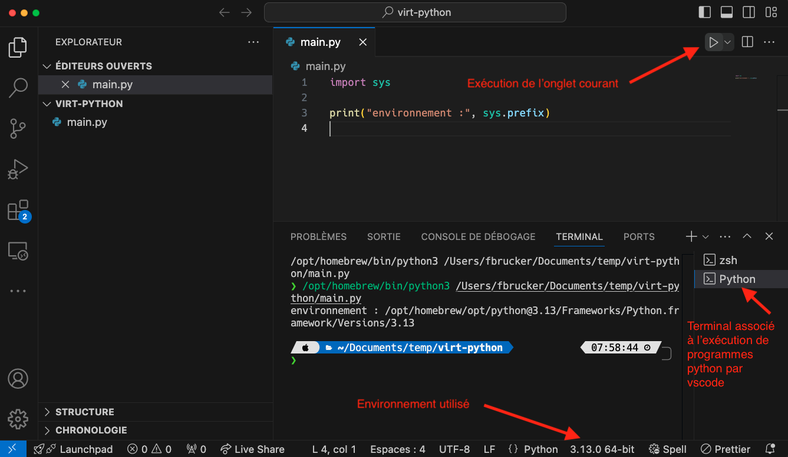
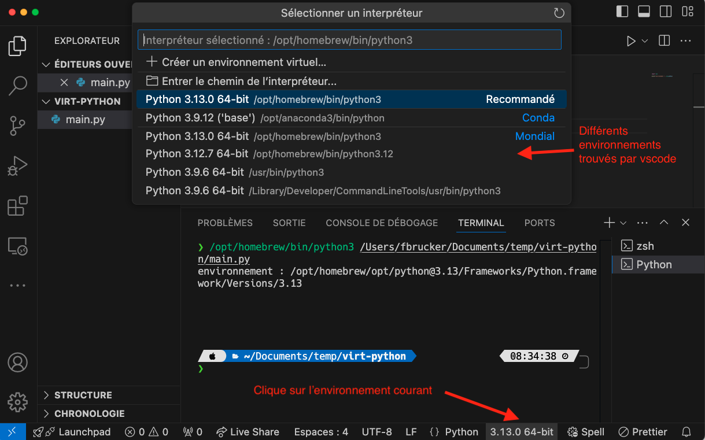
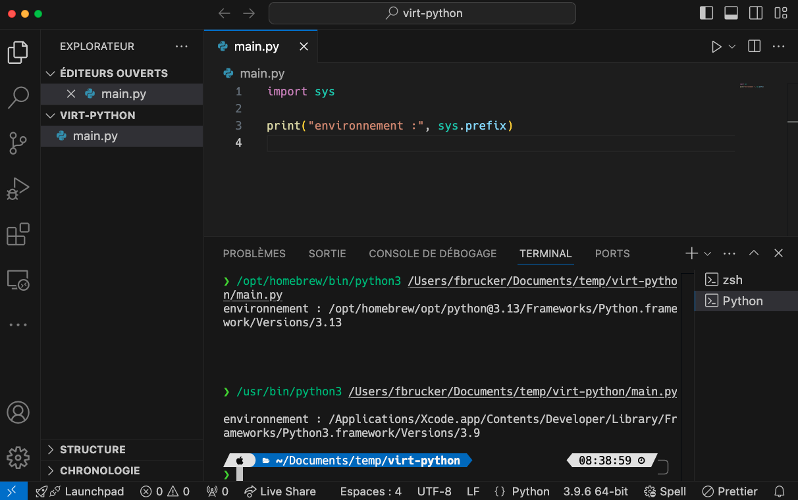
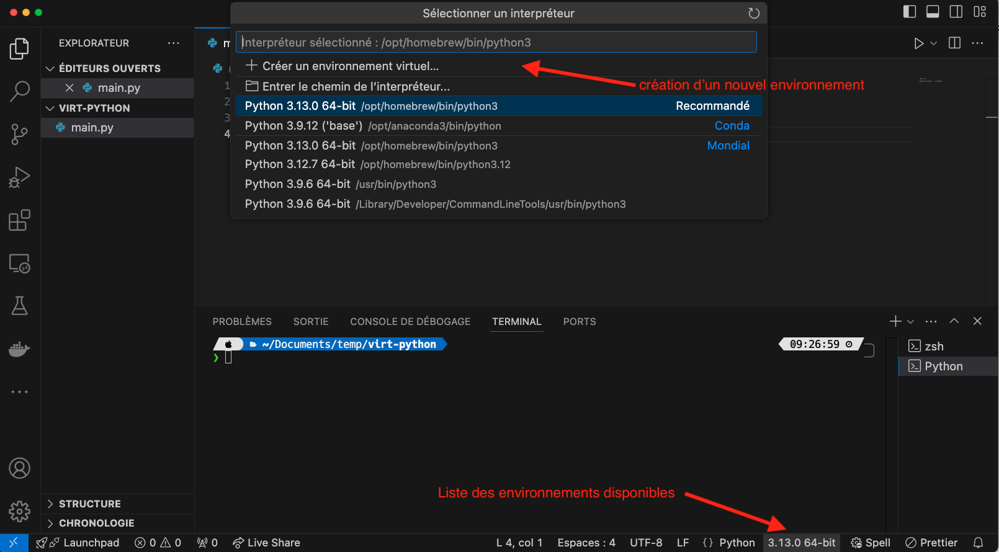
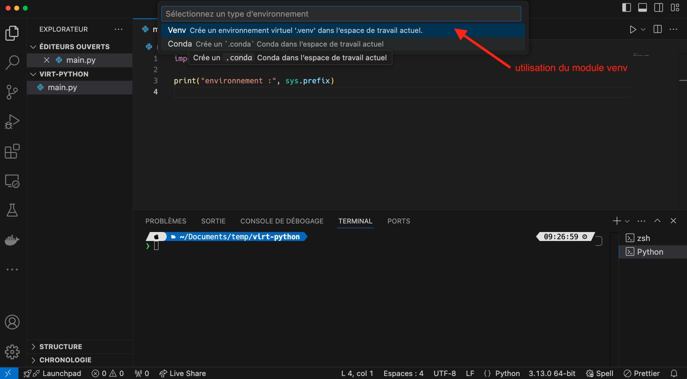
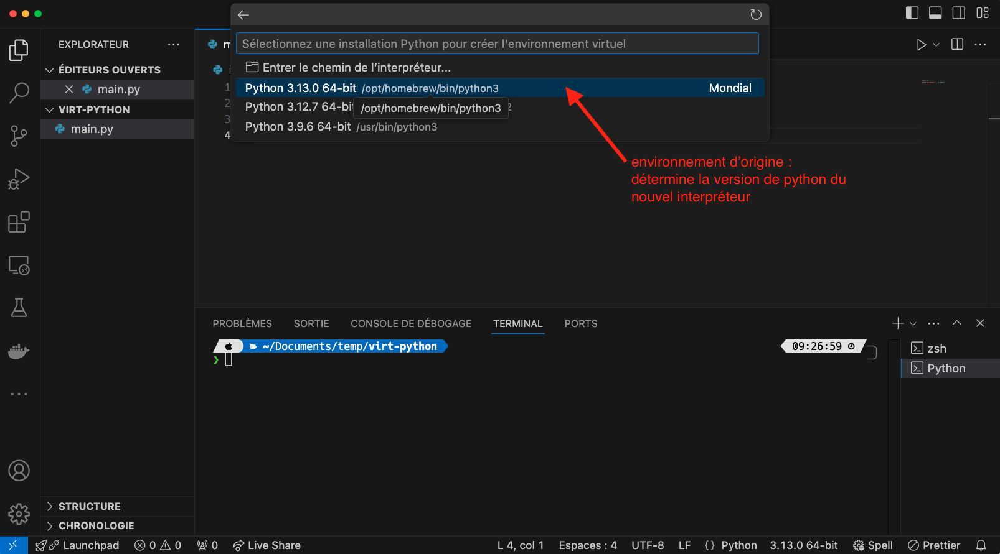
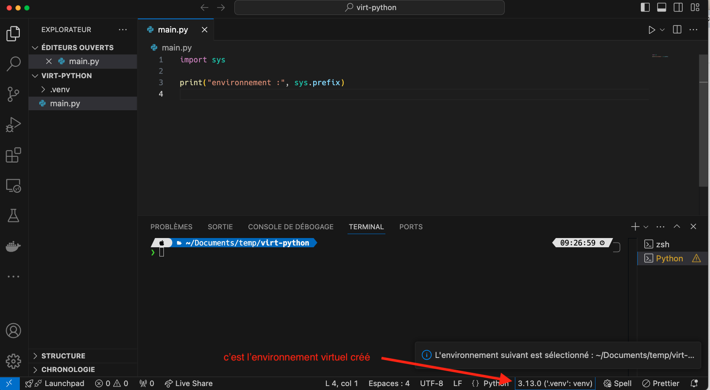
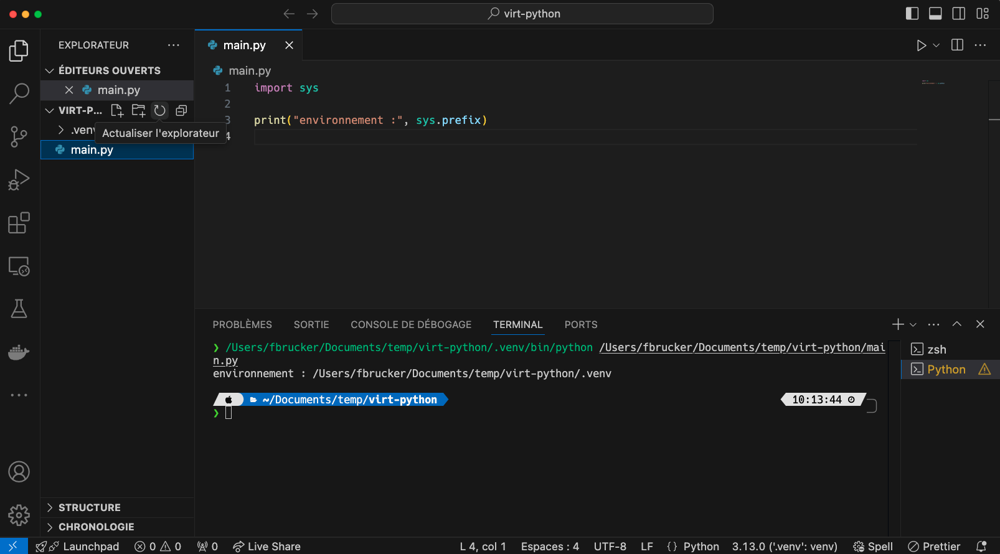
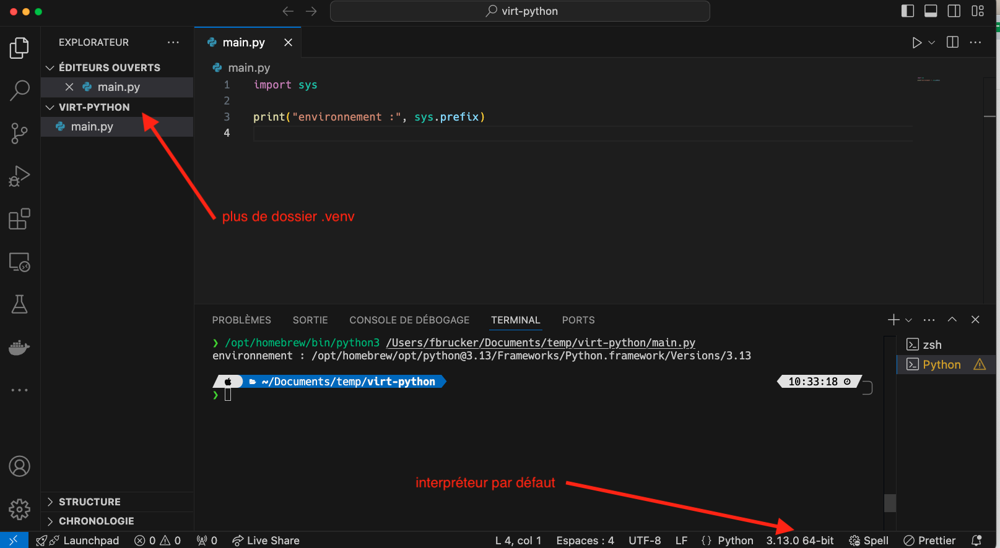
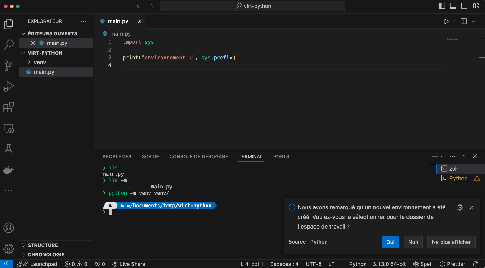



- <https://docs.python.org/fr/3.13/tutorial/venv.html#>
- [Virtual environments](https://realpython.com/python-virtual-environments-a-primer/)



Le but d'un environnement virtuel est de créer un environnement python complet (interpréteur et modules) différent par projet. Ceci permet de contrôler les modules installés et utilisés.


Il est fortement recommandé de créer un environnement virtuel pour **chaque** projet.


## Environnement python

[On a vu que l'interpréteur python était un fichier](../version-python/#interpréteur-emplacement){.interne} sur notre ordinateur qui était exécuté pour interpréter du code, chacun pouvant avoir ses propres modules d'installés.

### Emplacement

L'ensemble python et module est appelé environnement python et est placé dans un dossier. Le code suivant permet de l'expliciter :

```python
import sys

print("environnement :", sys.prefix)
```

Ce qui donne chez moi (en 2024) le dossier `/opt/homebrew/opt/python@3.13/Frameworks/Python.framework/Versions/3.13`{.fichier}.

Testez le chez vous. Pour cela, créons un projet vscode qui nous permettra de tester tout ça.



1. Créez un nouveau projet avec vscode que vous placerez dans un dossier nommé `virt-python/`{.fichier}.
2. Créez un fichier `main.py`{.fichier} contenant le code :

  ```python
  import sys

  print("environnement :", sys.prefix)

  ```



Vous pouvez exécuter le fichier `main.py`{.fichier} pour connaître le chemin vers l'interpréteur utilisé :



Remarquez que :

- un nouveau terminal a été crée par vscode pour ses exécutions
- que le nom correspond à celui du bas.

En regardant cette arborescence avec la commande [tree](https://en.wikipedia.org/wiki/Tree_(command)) dans un terminal, on voit qu'elle contient un grand nombre de dossiers et de fichiers :

```shell/
❯ tree -L 2 /opt/homebrew/opt/python@3.13/Frameworks/Python.framework/Versions/3.13 
/opt/homebrew/opt/python@3.13/Frameworks/Python.framework/Versions/3.13
├── Headers -> include/python3.13
├── Python
├── Resources
│   ├── Info.plist
│   └── Python.app
├── _CodeSignature
│   └── CodeResources
├── bin
│   ├── idle3 -> idle3.13
│   ├── idle3.13
│   ├── pip3
│   ├── pip3.13
│   ├── pydoc3 -> pydoc3.13
│   ├── pydoc3.13
│   ├── python3 -> python3.13
│   ├── python3-config -> python3.13-config
│   ├── python3.13
│   └── python3.13-config
├── etc
│   └── jupyter
├── include
│   └── python3.13
├── lib
│   ├── libpython3.13.dylib -> ../Python
│   ├── pkgconfig
│   └── python3.13
└── share
    ├── doc
    └── jupyter

16 directories, 14 files

```

Chaque dossier a sa propre fonction, citons-en deux :

- `bin/`{.fichier} contient les fichiers exécutables, dont `python`{.fichier} et `pip`{.fichier}
- `lib/python3.13/`{.fichier} contient les modules. Baladez-vous y et vous y retrouverez de vieilles connaissances comme `random.py`{.fichier} par exemple


Tous les modules ne sont pas présent dans le dossier `lib/python3.13/`{.fichier}. Par exemple `math.py` et `sys.py` ne s'y trouvent pas.

Les modules très souvent utilisés sont enb effet directement inclus dans l'interpréteur (bien qu'il faille tout de même les importer). Pour les voir, vous pouvez exécuter le code suivant :

```python
import sys

for nom_module in sorted(sys.stdlib_module_names):
  print(nom_module)
```



Les petites flèches que vous voyiez à côté de certains noms, par exemple la ligne 17 précédente :

```shell
│   ├── python3 -> python3.13
```

Ceci correspond à [un lien symbolique](https://fr.wikipedia.org/wiki/Lien_symbolique) : le fichier `python3`{.fichier} correspond en fait au fichier `python3.13`{.fichier}. Ce mécanisme permet de conserver un même nom (`python3`) à plusieurs versions python.

Si je change d'interpréteur (en cliquant sur la ligne en bas de vscode) :



Vscode a trouvé plein d'environnements différents (et il ne les a pas trouvés tous). Si je change d'environnement et que je re-exécute le code :



Ce qui pourrait sembler être anecdotique est en fait crucial car les modules installés sont différents.

Packages installés pour l'environnement par défaut :

```shell
❯ /opt/homebrew/opt/python@3.13/Frameworks/Python.framework/Versions/3.13/bin/python3 -m pip list
Package                   Version
------------------------- --------------
anyio                     4.6.2.post1
appnope                   0.1.4
argon2-cffi               23.1.0
argon2-cffi-bindings      21.2.0
arrow                     1.3.0
asttokens                 2.4.1
async-lru                 2.0.4
attrs                     24.2.0
babel                     2.16.0
beautifulsoup4            4.12.3
bleach                    6.2.0

[... snip ... snip ... snip ...]

webencodings              0.5.1
websocket-client          1.8.0
wheel                     0.44.0
```

Packages installés pour l'autre environnement :

```shell
❯ /Applications/Xcode.app/Contents/Developer/Library/Frameworks/Python3.framework/Versions/3.9/bin/python3 -m pip list
Package           Version
----------------- -------
aiohttp           3.9.1
aiosignal         1.3.1
altgraph          0.17.2
async-timeout     4.0.3
attrs             23.1.0
black             23.12.0

[... snip ... snip ... snip ...]

wheel             0.37.0
yarl              1.9.4
```

Il y en a d'autres. Comme chaque projet va nécessiter des modules spécifiques il est important d'installer les modules dans le bon environnement.

### Usage

Tout projet informatique va utiliser un environnement python _via_ son interpréteur. Il utilisera ses modules, voir en installera de nouveaux qui iront se placer dans le dossier `lib/python<version>/`{.fichier} (dans mon environnement courant c'est le dossier `lib/python3.13/`{.fichier}).

La gestion de ces modules peut s'avérer fastidieuse car :

1. si vous partagez votre code, il faut une liste des modules dont dépend votre projet pour être utilisé et qu'il faut installer
2. il faut faire attention aux versions car un changement de version d'un module peut entraîner des changements dans son comportement et casser votre projet

La première solution qui vient à l'esprit est de distribuer les modules en même temps que votre projet, dans un dossier dédié. C'est cependant une **très mauvaise idée** ! En effet :

- vous vous privez des développements futurs et des corrections de bug des modules. Il vous faut redistribuer votre projet à chaque mise à jour des modules, en plus de chaque mise à jour de votre code
- vous perdez de la place et si vous utilisez un contrôleur de version (comme git) vous allez à la fois stocker votre code et du code tierce.
- certains modules peuvent être compliqué à installer et dépendent de bibliothèque de votre système. Copier leur code uniquement ne suffira pas à les installer proprement

Les remarques ci-dessus mènent à une unique conclusion :


Il faut utiliser un outil de gestion des dépendances qui s'occupera d'installer, de maintenir à jour et d'éviter les incompatibilités d'une liste de modules dont dépend le projet.


La solution utilisée par python est de permettre de créer facilement un environnement python dédié pour chaque projet.

## Création d'un environnement

Nous utiliserons le module [`venv`](https://docs.python.org/fr/3/library/venv.html), qui doit normalement être disponible.


Le module venv n'est habituellement pas installé sous Linux/Ubuntu. Il faut l'installer en plus avec la commande :

```shell
sudo apt install python3-venv
```



Le but de ce module est de créer un environnement python vierge (sans aucun autre module que les modules essentiels), nommé _environnement virtuel_, dans un dossier.

Par défaut, ce dossier s'appelle `.venv`{.fichier} (il est donc caché) et est placé à la racine de votre site.

### Avec vscode


<https://code.visualstudio.com/docs/python/environments#_creating-environments>


Lorsque l'on a changé d'environnement, on a vu que vscode propose de créer un nouvel environnement virtuel.



Dans le projet "virt-python" :

1. cliquez sur l'environnement python courant :
2. choisissez "+ Créer un environnement virtuel..." dans le menu déroulant
   
3. Choisissez "Venv" si vscode vous propose de choisir
   
4. choisissez un interpréteur. C'est puis qui sera utilisé pour créer l'environnement virtuel. Cela va uniquement déterminer la version de python du nouvel environne,ent, aucun module de l'environnement d'origine ne sera dupliqué
   
5. L'environnement est crée. Si tout s'est bien passé, ce nouvel environnement est devenu celui de vscode :
   



En exécutant le programme avec vscode, on obtient bien le nouvel environnement :



Dans la liste de fichiers, on voit que le nouvel environnement a été créé dans le dossier du projet, dans un dossier nommé `.venv/`{.fichier}.
>
Ce dossier n'est pas directement visible du terminal car il commence par un `.`, il est caché :

```shell
❯ ls
main.py 

```

Pour le voir, il faut ajouter un paramètre :

```shell
❯ ls -a
.     ..    .venv     main.py 

```

Le fait que le dossier soit caché ne change pas grand chose. On peut très bien créer des environnement virtuels dans des dossiers non caché, comme `venv/`{.fichier} par exemple. C'est que nous allons faire maintenant.

### À la main

On peut créer les environnement directement avec le terminal.


Supprimez l'environnement précédemment crée avec vscode en :

1. supprimant le dossier `.venv`{.fichier}
2. reprenant l'interpréteur par défaut
  
Vous devez revenir à l'état suivant :




Puis dans le terminal, on crée l'environnement en utilisant le module venv :

```shell
❯ python -m venv venv/

```

Ceci a pour conséquence de créer un environnement virtuel dans le dossier `venv`{.fichier} du dossier du projet. Notez que l'on ne l'a **pas** appelé `.venv` : les environnement virtuels peuvent s'appeler `.venv` (dossier commençant par un `.` donc caché) ou `venv` (ne commençant pas par un `.` donc visible) vscode les reconnait tout de même :



### Modules

Un nouvel environnement vient sans aucun module d'installé :

```shell
❯ venv/bin/python -m pip list
Package Version
------- -------
pip     24.2

```

## Utilisation

On peut bien sur utiliser vscode et placer l'environne,ent virtuel sur celui que nous venons de créer, on utiliser l'interpréteur directement depuis le terminal :

- sous mac/Linux : `venv/bin/python main.py`
- sous windows : `venv\Scripts\python main.py`

L'exécution donne chez moi :

```shell
environnement : /Users/fbrucker/Documents/temp/virt-python/.venv
```


[Script execution policy](https://learn.microsoft.com/en-us/powershell/module/microsoft.powershell.core/about/about_execution_policies?view=powershell-7.4) sous windows.

Pour la connaître :

```shell
Get-ExecutionPolicy
```

Pour la modifier :

```shell
Set-ExecutionPolicy Unrestricted
```



### Activation

On peut activer l'environnement virtuel à la main grace à [une commande qui dépend de votre environnement](https://docs.python.org/3/library/venv.html#how-venvs-work) :

- sous mac : `source venv/bin/activate`
- sous windows : `venv\Scripts\Activate.ps1`

Chez moi cela donne :

```shell
❯ python main.py
environnement : /opt/homebrew/opt/python@3.13/Frameworks/Python.framework/Versions/3.13
❯ source venv/bin/activate
❯ python main.py
environnement : /Users/fbrucker/Documents/temp/virt-python/venv

```

Après activation, en tapant `python`, c'est bien l'environnement virtuel qui est exécuté.

Cette transformation est liée au terminal. Si vous en changez, il faudra re activer l'environnement.


**_Activer_** un environnement, c'est associer le programme python avec l'environnement virtuel pour le terminal dans laquelle la commande est exécutée.


### ajout de modules

Peut se faire comme on fait depuis toujours :

```shell
[nom de l'interpréteur] -m pip install [nom du module]
```

Si l'on veut par exemple installer le module `numpy`{.language-} pour l'environnement virtuel  :

- sous mac : `venv/bin/python -m pip install numpy`
- sous windows : `venv\Scripts\python -m pip install numpy`

Si l'environnement virtuel est activé on peut tout simplement utiliser :

```shell
python -m pip install numpy
```

Voir utiliser directement pip puisqu'il est directement lié à notre environnement :

```shell
pip install numpy
```

Activer permet de ne pas se soucier du chemin, et permet d'avoir les même commandes sous windows et mac/Linux.

### Désactivation

Si vous voulez revenir à votre environnement normal, il vous suffit de taper la commande suivante dans le terminal :

```shell
desactivate
```

## Gestion des environnements virtuels

### Partage des modules


[Documentation de la commande `pip freeze`](https://pip.pypa.io/en/stable/cli/pip_freeze/)


Lorsque l'on partage son projet, on ne va pas donner son environnement virtuel en même temps que son code, on ne donne que le code et la liste des modules à installer.

On procède alors comme suit :

1. on installe un à un tous les modules nécessaires à notre projet avec l'interpréteur de l'environnement virtuel. Comme rien n'est installé initialement, seuls les modules utiles au projet sont installés
2. on utilise une commande de `pip` qui sauvegarde tous les modules dans un fichier nommé `requirement.txt`{.fichier} : `venv/bin/python -m pip freeze > requirements.txt`

La commande précédente a créée un fichier `requirements.txt`{.fichier} qui contient tous les modules installés.

Par exemple chez moi, j'ai juste installé le module `pytest`{.language-} et mon fichier requirements.txt est :

```text
iniconfig==2.0.0
packaging==24.0
pluggy==1.5.0
pytest==8.2.1
```

Il contient le module `pytest`{.language-}, ses dépendances et les versions installées.

Pour partager votre code, vous n'avez qu'à donner le fichier `requirements.txt`{.fichier} en plus de celui-ci. La personne recevant votre code :

1. créera un nouvel environnement virtuel
2. exécutera la commande `venv/bin/python -m pip install -r requirements.txt` qui installera tous les modules du fichier `requirements.txt`{.fichier}.

Le lien ci-dessous explicite le format du fichier `requirements.txt`{.fichier} :


[Spécification des modules](https://pip.pypa.io/en/stable/reference/requirement-specifiers/#requirement-specifiers)


### Poetry

La méthode de partage précédente nécessite plusieurs opérations à effectuer à la main. Il existe des outils plus puissant permettant de gérer plus efficacement le partage et le maintient de projets, nous allons en montrer un :


<https://python-poetry.org/>


> TBD : faire un exemple. Attention à ce que venv soit bien dans le dossier du projet

### uv

> TBD : tout en un et en rust.


<https://github.com/astral-sh/uv>


> TBD : faire un exemple.
