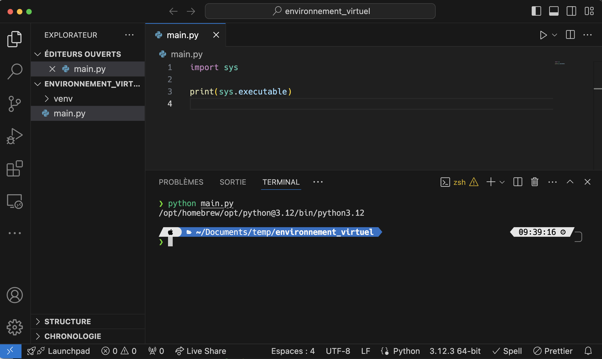
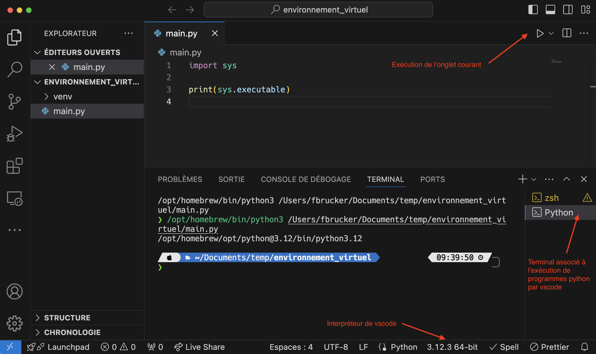
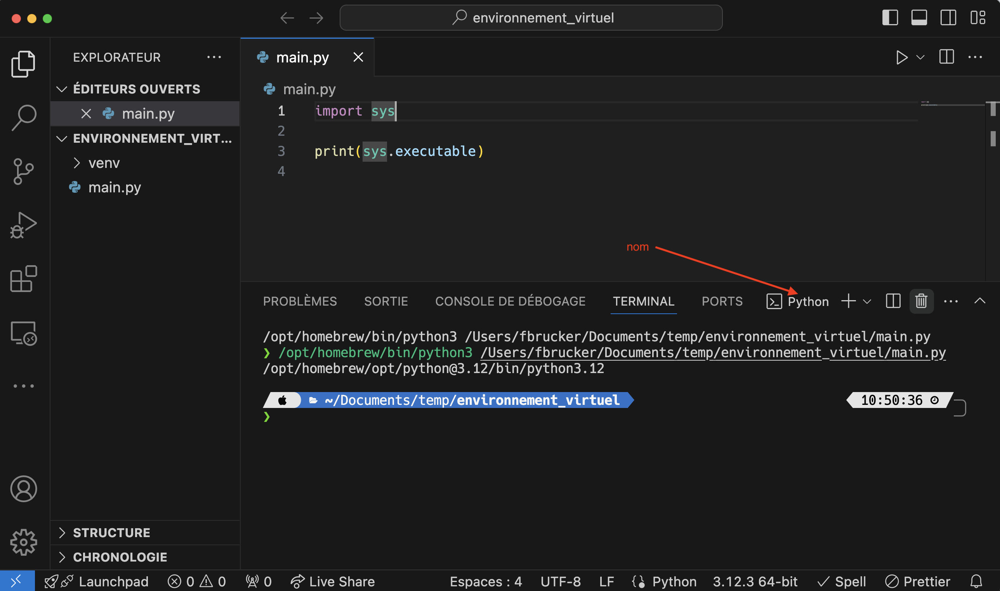
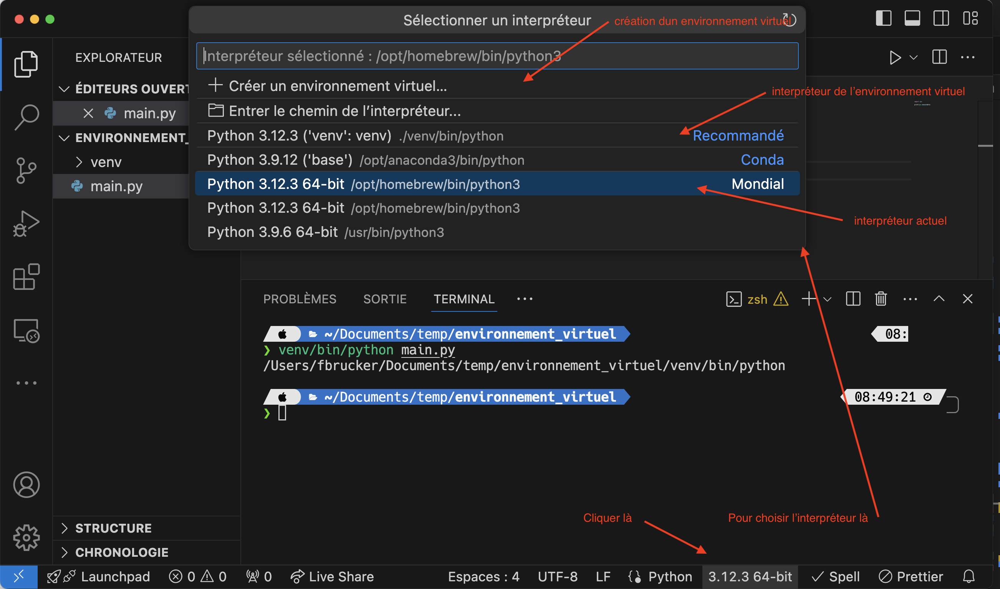
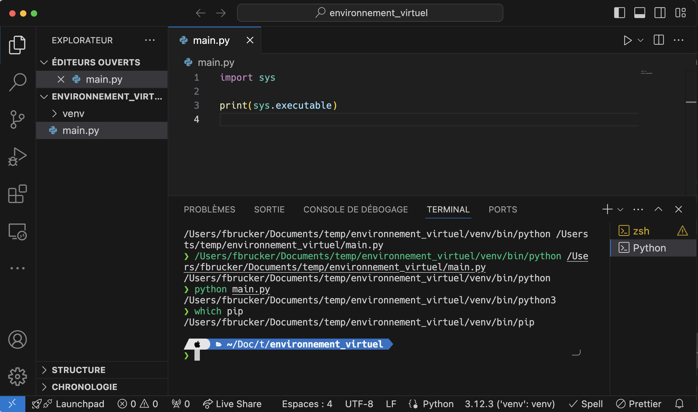

Tout projet informatique va dépendre de modules extérieurs pour son exécution. Ces modules vont être de deux ordres :

- ceux liés à l'exécution du programme, comme pyglet, matplotlib ou encore numpy
- ceux liés au développement comme pytest

La gestion de ces modules peut s'avérer fastidieuse car :

1. si vous partagez votre code, il faut une liste des modules dont dépend votre projet pour être utilisé et qu'il faut installer
2. il faut faire attention aux versions car un changement de version d'un module peut entraîner des changements dans son comportement et casser votre projet

La première solution qui vient à l'esprit est de distribuer les modules en même temps que votre projet, dans un dossier dédié. C'est cependant une **très mauvaise idée** ! En effet :

- vous vous privez des développements futurs et des corrections de bug des modules. Il vous faut redistribuer votre projet à chaque mise à jour des modules, en plus de chaque mise à jour de votre code
- vous perdez de la place et si vous utilisez un contrôleur de version (comme git) vous allez à la fois stocker votre code et du code tierce.
- certains modules peuvent être compliqué à installer et dépendent de bibliothèque de votre système. Copier leur code uniquement ne suffira pas à les installer proprement

Les remarques ci-dessus mènent à une unique conclusion :


Il faut utiliser un outil de gestion des dépendances qui s'occupera d'installer, de maintenir à jour et d'éviter les incompatibilités d'une liste de modules dont dépend le projet.


## Environnement Virtuel

Python ajoute une contrainte supplémentaire à la gestion des dépendances : les modules dépendent d'un interpréteur.

Si l'on a plusieurs interpréteurs installés, on peut avoir un module installé pour 1 interpréteur mais pas pour un autre. Pour s'assurer d'installer un module pour le bon interpréteur on utilise `pip` avec celui-ci en utilisant la commande (que l'on a utilisée à chaque installation de module) :

```shell
[nom de l'interpréteur] -m pip install [nom du module]
```

Si l'on veut par exemple installer le module `numpy`{.language-} pour l'interpréteur python dans le dossier `/usr/bin/` on utilise la commande :

```shell
/usr/bin/python3 -m pip install numpy
```

Pour que chaque projet ait ses propres modules d'installer pour éviter les incompatibilités, il n'y a qu'une solution :


Il faut installer un interpréteur spécifique pour chaque projet python. On appelle ceci un [environnement virtuel](https://en.wikipedia.org/wiki/Virtual_environment_software)


On va montrer comment installer puis utiliser un environnement virtuel. Pour cela, créons un projet vscode qui nous permettra de tester tout ça.



1. Créez un nouveau projet avec vscode que vous placerez dans un dossier nommé `environnement_virtuel/`{.fichier}.
2. Créez un fichier `main.py`{.fichier} contenant le code :

   ```python
   import sys

   print(sys.executable)
   ```



Vous pouvez exécuter le fichier `main.py`{.fichier} pour connaître le chemin vers l'interpréteur utilisé. Dans mon cas, lorsque j'exécute le fichier via un terminal j'obtiens :



Si j'utilise l'interpréteur de vscode, j'obtiens en appuyant sur le triangle d'exécution :



Remarquez que :

- un nouveau terminal a été crée par vscode pour ses exécutions
- que le nom correspond à celui du bas.

### Création


[Module `venv`{.language-}](https://docs.python.org/fr/3/library/venv.html)


Il existe plusieurs modules permettant de créer et/ou gérer des environnements virtuels, nous allons utiliser ici celui fourni par python : `venv`{.language-}.

Installons un nouvel interpréteur dans le dossier du projet.


Dans un terminal, assurez vous d'être dans le dossier du projet (`environnement_virtuel/`{.fichier}), puis tapez la commande :

```shell
python -m venv venv/
```



La commande précédente va utiliser le module `venv`{.language-} de python pour créer tout ce qui est nécessaire à un environnement virtuel dans le dossier `venv/`{.fichier} du projet.

> TBD : vérifier avec windows 11.

Pour python un environnement virtuel contient :

- un interpréteur : `venv/bin/python`{.fichier}
- ses modules associés : `venv/lib/python3.12/site-packages/`{.fichier} (chez moi. Vous aurez peut-être une autre version de python). A priori, il n'y a que pip d'installé en plus des modules livrés directement avec python

Pour utiliser le nouvel interpréteur, on donne son chemin :


Dans un terminal, assurez vous d'être dans le dossier du projet (`environnement_virtuel/`{.fichier}), puis tapez la commande :

```shell
venv/bin/python main.py
```



Dans mon cas, j'obtiens :


Ce n'est bien plus le même interpréteur qui a exécuté notre fichier.

Les packages installés sont visible en utilisant le module pip pour le nouvel interpréteur :

```shell
$ venv/bin/python -m pip list
Package Version
------- -------
pip     24.0
```

À comparer avec les modules installés pour l'interpréteur classique :

```shell
$ python -m pip list
Package           Version
----------------- -----------
appnope           0.1.4
asttokens         2.4.1
cffi              1.16.0
comm              0.2.2
contourpy         1.2.1
cycler            0.12.1

[...]

tornado           6.4
traitlets         5.14.2
wcwidth           0.2.13
wheel             0.43.0

```

### Utilisation

Il est possible, mais peu pratique d'utiliser l'environnement virtuel comme on l'a fait précédemment, uniquement en précisant le bon interpréteur dans le terminal.

On va voir deux façons de procéder pour rendre le processus plus fluide : avec vscode, puis directement avec le terminal.

#### Avec vscode


Si vous avez déjà exécuté le code python avec le triangle d'exécution, supprimez le terminal nommé `Python` en :

1. affichant les terminaux avec la commande `Affichage > Terminal`
2. si vous avez exécuté du code python avec le triangle d'exécution de vscode, vous devriez avoir un terminal nommé `Python`
3. cliquant sur la poubelle à côté de son nom

S'il n'y a qu'un terminal, son nom est au-dessus :



S'il y en a plusieurs, son nom est à côté :




Vous pouvez utilisez votre nouvel environnement virtuel directement avec vscode en changeant l'interpréteur du projet.




Remarquez que vous pouvez directement créer un environnement virtuel avec vscode.

Par défaut il le créera dans le dossier `.venv`{.fichier}, qui commence par un `.`{.fichier} et est donc un fichier caché.


Vous pouvez maintenant utiliser le triangle d'exécution pour utiliser l'environnement virtuel :


**Si** vous avez créez le terminal avec l'exécution du fichier avec le nouvel interpréteur, vscode a **_activé_** l'environnement virtuel, c'est à dire que si vous tapez `python` dans le terminal, ce sera celui de l'environnement virtuel et non plus celui par défaut :



Ce n'est bien sur vrai **_que_** pour ce terminal. Les autres terminaux, ou les nouveaux que vous créez, auront toujours le python par défaut :

#### Avec le terminal

On peut activer l'environnement virtuel à la main grace à [une commande qui dépend de votre environnement](https://docs.python.org/3/library/venv.html#how-venvs-work) :

- sous mac : `source venv/bin/activate`
- sous windows : `venv\Scripts\Activate.ps1`

Chez moi cela donne :

```shell
$ python main.py
/opt/homebrew/opt/python@3.12/bin/python3.12
$ source venv/bin/activate
$ python main.py
/Users/fbrucker/Documents/temp/environnement_virtuel/venv/bin/python3
```

Après activation, en tapant `python`, c'est bien l'environnement virtuel qui est exécuté.

Cette transformation est liée au terminal. Si vous en changez, il faudra re activer l'environnement.


**_Activer_** un environnement, c'est associer le programme python avec l'environnement virtuel pour le terminal dans laquelle la commande est exécutée.


### Partage


[Documentation de la commande `pip freeze`](https://pip.pypa.io/en/stable/cli/pip_freeze/)


Lorsque l'on partage son projet, on ne va pas donner son environnement virtuel en même temps que son code, on ne donne que le code et la liste des modules à installer.

On procède alors comme suit :

1. on installe un à un tous les modules nécessaires à notre projet avec l'interpréteur de l'environnement virtuel. Comme rien n'est installé initialement, seuls les modules utiles au projet sont installés
2. on utilise une commande de `pip` qui sauvegarde tous les modules dans un fichier nommé `requirement.txt`{.fichier} : `venv/bin/python -m pip freeze > requirements.txt`

La commande précédente a créée un fichier `requirements.txt`{.fichier} qui contient tous les modules installés.

Par exemple chez moi, j'ai juste installé le module `pytest`{.language-} et mon fichier requirements.txt est :

```text
iniconfig==2.0.0
packaging==24.0
pluggy==1.5.0
pytest==8.2.1
```

Il contient le module `pytest`{.language-}, ses dépendances et les versions installées.

Pour partager votre code, vous n'avez qu'à donner le fichier `requirements.txt`{.fichier} en plus de celui-ci. La personne recevant votre code :

1. créera un nouvel environnement virtuel
2. exécutera la commande `venv/bin/python -m pip install -r requirements.txt` qui installera tous les modules du fichier `requirements.txt`{.fichier}.

Le lien ci-dessous explicite le format du fichier `requirements.txt`{.fichier} :


[Spécification des modules](https://pip.pypa.io/en/stable/reference/requirement-specifiers/#requirement-specifiers)


## Poetry

La méthode de partage précédente nécessite plusieurs opérations à effectuer à la main. Il existe des outils plus puissant permettant de gérer plus efficacement le partage et le maintient de projets, nous allons en montrer un :


<https://python-poetry.org/>


> TBD : faire un exemple
