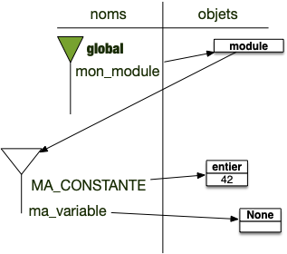

Les modules python sont des fichiers (on l'a vu) ou des dossiers (on le verra) que l'on peut _importer_ dans un fichier en cours d'exécution. Il y a essentiellement 2 manières d'importer un module en python soit directement :

```python
import math
```

L'importation du module crée, comme on l'a vu, [des espaces de noms](../espace-noms){.interne} utilisables dans le programme qui importe :

```python
import math

print(math.pi)
```

Soit en important un nom du module dans l'espace de nom `global`{.langage-} :

```python
from math import pi
```

Le nom `pi`{.language-} de l'espace de nom du module `math`{.language-} est importé dans l'espace de nom `global`{.langage-} :

```python
from math import pi

print(pi)
```

Enfin on peut importer tout un espace de nom dans l'espace de nom `global`{.langage-} :

```python
from math import *
```

Cette pratique est **fortement déconseillée** car on ne sait pas ce qu'on importe :

```python
from math import *

print(pi)
```

## Mécanisme d'importation de modules

Importer un module revient à exécuter un fichier python et à renommer son espace de nom `global`{.langage-} dans le nom du fichier. Par exemple supposons que l'on ait dans le même dossier les fichier `mon_module.py`{.fichier} et `programme_principal.py`{.fichier} tels que :

- `mon_module.py`{.fichier} vale :

    ```python#
    MA_CONSTANTE = 42
    va_variable = None
    ```

- `programme_principal.py`{.fichier} vale :

    ```python#
    import mon_module

    print(mon_module.MA_CONSTANTE)
    ```

À la fin de l'exécution de la ligne 1 du fichier `programme_principal.py`{.fichier}, on a les différents espaces de noms suivant :



Le nom `mon_module`{.language-} correspond à un objet de type module, contenant un espace de nom. On peut accéder aux noms de son espace avec la notation pointée :

```python
mon_module.MA_CONSTANTE
```

On cherche le nom `MA_CONSTANTE`{.language-} dans l'espace de nom associé à l'objet de nom `mon_module`{.language-}.

### Type d'un module

> TBD : `globals()`

> si module python, parfois un fichier reel : random, parfois un so. math par un réel fichier mais quelque chose de compilé pour aller plus vite

### Exécution du fichier module

> TBD : mettre un print
> python -m module
> différence entre exécution et import -> cout du if name == main

## Modules python et dossiers

> on a vu avec un fichier et l'espace de nom associé
> parfois nested. Travailler avec des dossiers et `__init__.py`{.fichier}

> tout un tas lui même (math, pathlib, etc) et on peut en installer d'autre avec pip.
> aller sur le site de pip pour voir tous les modules installés
> On peut facilement ajouter des modules à pip.

### Installation et usage

> dépendant de l'interpréteur python
> c'est pourquoi on les installe via celui ci et pas directement avec pip qui peut être lié à un tout autre interpréteur.

### Où sont les modules ?

Les dossiers où python va cherchez les modules sont listés dans la variable `sys.path`.

vous pouvez le voir en exécutant le code :

```python
import sys
for dossier in sys.path:
   print(dossier)
```

Chez moi, sur un mac où python est installé avec [brew](https://brew.sh/) ce programme rend :

```shell
/opt/homebrew/Cellar/python@3.11/3.11.5/Frameworks/Python.framework/Versions/3.11/lib/python311.zip
/opt/homebrew/Cellar/python@3.11/3.11.5/Frameworks/Python.framework/Versions/3.11/lib/python3.11
/opt/homebrew/Cellar/python@3.11/3.11.5/Frameworks/Python.framework/Versions/3.11/lib/python3.11/lib-dynload
/Users/fbrucker/Library/Python/3.11/lib/python/site-packages
/opt/homebrew/lib/python3.11/site-packages
/opt/homebrew/lib/python3.11/site-packages/gpg-1.22.0-py3.11-macosx-13-arm64.egg
/opt/homebrew/opt/python-tk@3.11/libexec
```

Il y a plusieurs dossiers :

- `/opt/homebrew/Cellar/python@3.11/3.11.5/Frameworks/Python.framework/Versions/3.11/lib/python3.11`{.fichier} contient les packages de bibliothèque standard (il contient par exemple un fichier _"random.py"_ qui contient le code du package `random`)
- `/opt/homebrew/Cellar/python@3.11/3.11.5/Frameworks/Python.framework/Versions/3.11/lib/python3.11/lib-dynload`{.fichier} contient les packages python qui ne sont pas écrit en python mais en C
- `/opt/homebrew/lib/python3.11/site-packages`{.fichier} qui contient les packages qui seront installés par pip.


La gestion des packages peut être compliquée. Normalement, si vous vous y prenez comme indiqué ici et en utilisant votre ordinateur personnel, tout devrait bien se passer. Si cela commence à ne plus aller, vous pouvez essayer d'installer les packages à un autre en endroit en suivant [ce tuto](https://opensource.com/article/19/4/managing-python-packages), ou, comme on le fera plus tard en utilisant un environnement virtuel. Mais, dans le doute, consultez un prof qui s'y connaît.

