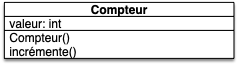

Un objet est un bout de code auquel est associé :

- des fonctionnalités (des méthodes) qui sont communes à tous les objets de sa classe
- des choses à lui tout seul (sa structure de donnée interne qui constitue ses attributs) qui lui permettent de se différentier des autres objets de sa classe même s'il a les mêmes fonctionnalités.

Un objet, n'est donc pas isolé, il partage ses fonctionnalités avec tous les objets de sa _classe_. Pour s'y retrouver entre, classes, objets méthode et attribut et trouver qui appartient à qui, python utilise les [espaces de noms](../../mémoire-espace-nommage#espace-nommage){.interne} (_namespaces_). Cela lui permet de réutiliser le même code pour plusieurs objets.

## Classes et objets

Lorsque l'on écrit du code python, on ne fait que manipuler des objets. Les entiers, les chaines de caractères et même les fonctions peuvent être considérées comme des objets.

De façon générale, on peut définir un objet et une classe comme :


Un **_objet_** est une structure de données (les champs de la structure de donnée sont appelés **_attributs_**) sur laquelle on peut effectuer des opérations (appelées **_méthodes_**).

Pour pouvoir facilement créer une structure particulière et donner un moyen simple d'effectuer les opérations sur celle-ci, on utilise des **_classes_** comme patron de ces objets.



Pour résumer, une classe :

- permet de créer un type d'objet (une structure de donnée précise)
- définit les opérations (méthodes) utilisables par ces objets.

Un objet issu d'une certaine classe :

- possède la même structure de données que les autres objets de la classe mais les valeurs de celle-ci lui sont uniques : ses **attributs**
- possède un lien vers les **méthodes** (définies dans sa classe) qu'il peut utiliser via la [notation pointée](../../mémoire-espace-nommage#notation-pointée){.interne} : `objet.méthode(paramètre_1, ..., paramètre_n)`{.language-}

### But

La programmation objet n'a pas pour but de révolutionner votre façon de programmer. Elle permet juste de bien mettre en œuvre les paradigmes de développement que l'on a vus jusqu'à présent. Il est fortement conseillé de _coder objet_ car :

- cela favorise la factorisation du code ([on ne se répète pas](../../développement/coder#DRY){.interne}) : on ne définit ses méthodes qu'une seule fois dans les classes
- lisibilité avec la notation `.`{.language-} : on sait clairement à qui s'applique telle ou telle méthode
- compartimentation du code : chaque partie du code et chaque opération est compartimentée, ce qui permet de les tester et des améliorer indépendamment du reste du code.
- plutôt que de créer un gros programme complexe, on crée plein de petits programmes indépendants (les objets) qui interagissent entre eux.


Ces principes sont mis en œuvre de façon différentes selon les langages mais on retrouvera toujours ces notions.


### Exemple d'objets en python

#### Chaîne de caractères

Les chaines de caractères sont des objets de la classe ([str](https://docs.python.org/fr/3/library/string.html)) :

```python
>>> type("une chaîne")
<class 'str'>
```

Les méthodes définies dans la classe `str`{.language-}, comme `upper()`{.language-} par exemple sont utilisables par tous les objets de la classe `str`{.language-} (dans l'exemple ci-après par l'objet `"coucou"`{.language-} et l'objet `"toi"`{.language-}) :

```python
>>> "coucou".upper()
'COUCOU'
>>> "toi".upper()
'TOI'
```

La notation pointée permet de dire que c'est la méthode à droite du `.`{.language-} que l'on cherche dans l'objet à gauche du point.


Le code suivant produit une erreur. Pourquoi ?

```python
>>> upper("coucou")
Traceback (most recent call last):
  File "<stdin>", line 1, in <module>
NameError: name 'upper' is not defined
```



C'est la méthode définie dans la classe `str`{.language-} qui s'appelle `upper`{.language-} qui existe...


Le résultat est différent lorsque l'on applique la méthode `upper`{.language-} à la chaîne de caractères `"bonjour"`{.language-} ou à la chaîne de caractères `"toi"`{.language-} car ces deux chaînes de caractères, bien que de la même classe (`str`{.language-}), sont différents : dans l'un il y a la chaîne "bonjour", dans l'autres la chaîne "toi".

Un objet `str`{.language-} est bien plus que juste ses caractères ! C'est aussi un ensemble de méthodes permettant de les manipuler.

#### Entiers

Les entiers sont aussi des objets d'une classe : `int`{.language-}.

```python
>>> type(1)
<class 'int'>
```

Contrairement à la classe `str`{.language-}, la classe `int`{.language-} ne définit pas de méthode mais des opérations. Par exemple `__add__`{.language-} définit l'addition d'un entier par un autre objet. C'est pratique que tout soit défini dans la classe , cela nous permettra à nous aussi de faire nos propres additions.

Les deux écritures sont identiques en python, mais bien sur, nous préférerons la première, bien plus simple à écrire et à comprendre :

1. `1 + 2`{.language-}
2. `(1).__add__(2)`{.language-}


Remarquez que l'opération `+`{.language-} n'est pas identique pour `1 + 2`{.language-} et `1.0 + 2`{.language-}. Dans le premier cas c'est l'addition définie dans `int`{.language-} qui est utilisé, dans le second cas c'est celle définie dans `float`{.language-}.


### Créer des objets


Pour créer des objets d'une classe, on utilise un **_constructeur_**.

En python, le retour de l'**_exécution d'une classe_** (l'utilisation de la classe comme si c'était une fonction) produit un objet. Par exemple :

```python
NomDeLaClasse(paramètre_1, ..., paramètre_n)
```



Ainsi :

- `list()`{.language-} : crée un objet de type `list`{.language-} (une liste), sans paramètre.
- `int()`{.language-} : crée un objet de type `int`{.language-} (un entier) sans paramètre (c'est 0).
- `int(3.1415)`{.language-} : crée un un objet de type `int`{.language-} avec un paramètre, valant le réel 3.1415 (c'est 3)
- `float("3.1415")`{.language-} : crée un objet de type `float`{.language-} (un réel) avec un paramètre valant la chaîne de caractères `"3.1415"`{.language-}.
- `list(range(5))`{.language-} : crée un objet de type `list`{.language-} avec comme unique paramètre le résultat de la fonction `range`


Certains objets se créent juste avec leur valeur comme les entiers, les réels ou encore les chaines de caractères. En python `3`{.language-} est équivalent à `int(3)`{.language-} par exemple.


## Outils

On va utiliser un outil _papier_ (l'[UML](<https://fr.wikipedia.org/wiki/UML_(informatique)>)) et un outil clavier (le python) pour écrire nos classes.

### UML

L'UML est une façon de représenter des objets et des classes. Nous allons l'utiliser pour décrire les classes que nous allons créer.


Vous pouvez suivre ce petit [tutoriel UML](https://www.sparxsystems.fr/resources/tutorials/uml/datamodel.html) pour comprendre sa notation et son utilité.


L'UML peut être très compliqué. Nous allons uniquement l'utiliser ici comme une représentation synthétique d'une classe/objet. Vous le verrez dans les exemples ci-dessous mais, en gros, une classe en UML c'est le diagramme :


- pour chaque attribut on pourra préciser le _type_ (entier, chaîne de caractères, une classe particulière d'objet, ...) si c'est important
- pour chaque méthode on donnera sa [signature](https://developer.mozilla.org/fr/docs/Glossaire/Signature/Fonction) complète (son nom et ses paramètres) pour que l'on puisse l'utiliser.

### Python

Comme le python va être notre langage de programmation, regardons quelques convention d'usage lorsque l'on programme objet en python.


En python, beaucoup de choses sont des [conventions](https://en.wikipedia.org/wiki/Convention_over_configuration) (variable privée, premier nom est self, ...) mais tout le monde s'y tient car la lecture du code en devient aisée.


N'hésitez pas à jeter un coup d'œil au [tutoriel de python sur ses classes](https://docs.python.org/fr/3/tutorial/classes.html). Ce cours est là pour vous montrer tout ce qu'il y a dedans, à part (peut-être) la partie sur l'héritage et les itérateurs.

#### Constructeur

En python, le constructeur d'une classe sera **toujours** la méthode : `__init__`{.language-}. C'est une méthode spéciale.


La méthode `__init__`{.language-} n'a pas de `return`{.language-}, mais elle est utilisée dans le processus de création d'un objet.


#### Espace de noms (namespaces)

La gestion des noms en python se fait via des [espaces de noms](../../mémoire-espace-nommage#espace-nommage){.interne}. L'ordre dans lequel ces noms sont cherchés pour être associés à un objet est logique et se règle en sachant quel namespace est utilisé.

#### Processus de création d'un objet

En python, on construit et rend un objet en **_appelant sa classe_**. Par exemple pour créer un objet de la classe `MaClasse`{.language-}, on exécute l'instruction :

```python
mon_objet = MaClasse(paramètre 1, ..., paramètre n)
```

Python exécute cette instruction en :

1. créant un objet vide `o`{.language-} de type `MaClasse`{.language-}
2. il associe à l'objet un espace de nom dont le parent est l'espace de nom de sa classe
3. il exécute le constructeur `__init__`{.language-} sur l'objet : `MaClasse.__init__(o, paramètre 1, ..., paramètre n)`{.language-} (c'est pour ça que la méthode `__init__`{.language-} n'a pas de retour)
4. il rend l'objet `o`{.language-}

## Exemple : le Compteur

On souhaite créer un objet `Compteur`{.language-} qui retient le compte de quelque chose et est capable d'ajouter 1 à son compte quand on le lui demande.

On va tenter de proposer une modélisation UML de cet objet simple, puis de le coder en python.

A partir d'un exemple de code, on va essayer de :

- voir ce que pourrait faire le code
- en déduire les attributs et les méthodes de la classe

### Code d'utilisation

Cette modélisation doit être capable de répondre au code suivant, dans le fichier `main.py`{.fichier} :

```python/
from compteur import Compteur

c1 = Compteur()
c2 = Compteur()
c1.incrémente()
c2.incrémente()
c1.incrémente()

print(c2.valeur)
```

#### Analyse du programme

C'est du python. On va essayer de comprendre le code pour produire une représentation UML de la classe `Compteur`{.language-}.

Le programme commence par importer le mot `Compteur`{.language-} et on l'exécute 2 fois pour l'affecter à 2 noms différents. Pour voir ce que peut être `Compteur`{.language-}, plusieurs indices :

- cela **ne doit pas être** une fonction normale, sinon `c1`{.language-} et `c2`{.language-} seraient identiques.
- le mot `Compteur`{.language-} à une majuscule, ce qui correspond en python à des noms de classes


Il est facile de savoir de quel type est le nom rencontré en python si l'on utilise les façons de faire classiques, décrites dans la [PEP 8](https://peps.python.org/pep-0008/) de python.




En résumé :

- les noms de variables, de fonctions et de méthodes sont écrites :
  - tout en minuscules
  - utilisent le [_Snake case_](https://fr.wikipedia.org/wiki/Snake_case) où les mots sont séparés par des _underscores_ (`_`{.language-})
- les constantes sont écrites tout en majuscule
- le noms de classes sont écrites :
  - avec une majuscule
  - utilisent le [_Camel case_](https://fr.wikipedia.org/wiki/Camel_case) où les mots sont séparés par des _underscores_ (`_`{.language-})
- les noms commençant par `__` et se finissant par `__` (comme `__name__`) ont des significations précises



Toutes les [conventions de nommage de python](https://peps.python.org/pep-0008/#prescriptive-naming-conventions).


On suppose donc que `Compteur`{.language-} est une _classe_, par conséquent son exécution correspond à la création d'objets : `c1`{.language-} et `c2`{.language-} des objets de type `Compteur`{.language-}.

De là, `incrémente`{.language-} est une méthode de la classe `Compteur`{.language-} et `valeur`{.language-} un attribut des objets `c1`{.language-} et `c2`{.language-}

- Les objets d'une classe **partagent les mêmes méthodes**, donc `incrémente()`{.language-} doit faire la même chose pour `c1`{.language-} et `c2`{.language-}
- Les objets d'une même classe partagent la même structure de donnée (les **noms** des attributs sont les mêmes), je dois donc pouvoir écrire : `c1.valeur`{.language-}, même si ce n'est pas écrit dans le code.

Enfin, comme le code appelle `c1.incrémente()`{.language-} et `c2.incrémente()`{.language-} sans paramètre et que le retour de la méthode n'est pas conservée, cette méthode doit sûrement modifier un attribut des objets `c1`{.language-} et `c2`{.language-}, probablement `valeur`{.language-}


Un code dont les objets sont bien nommés doit pouvoir se lire et être interprétable sans connaître le corps des fonctions et méthodes utilisées.


#### Exécution du programme

A la lecture du code, on a donc _envie_ que le code :

1. création de deux compteurs
2. en incrémente un deux fois et l'autre qu'une seule fois
3. affiche à l'écran la valeur d'un des compteurs (celui qui a été incrémenté une fois) qu'on suppose égale à 1

### Schéma UML

Un objet est un ensemble de fonctionnalités récurrentes dans un programme. Ici un compteur. Les fonctionnalités sont :

- ajouter une unité à un compteur
- connaître la valeur du compteur.

Pour que l'on puisse avoir plusieurs compteurs (si on n'a qu'un seul compteur, ce n'est pas la peine de faire des objets), il faut que chaque compteur ait une valeur à lui.

On a donc ce qu'il faut pour notre classe :

- un nom : Compteur
- une méthode (**= fonctionnalités = ce qui est pareil pour tous les objets**) : `incrémente()`{.language-}
- un attribut (**= structure de donnée = ce qui est différent pour chaque objet**) : `valeur`{.language-}



1. on commence toujours par le nom de la classe
2. on explicite ses méthodes, c'est à dire comment on va utiliser les objets (ici incrémenter un compteur).
3. on crée la structure de données qui va permettre de stocker les informations nécessaires à son utilisation : ce sont les attributs (ici un entier pour stocker le nombre de fois où on l'a incrémenté).
   

Ce qui donne le diagramme UML du compteur :



### Code python

La classe python qui correspond à l'UML précédent est celle-ci, contenu dans le fichier `compteur.py`{.fichier}, placé dans le même dossier que le fichier `main.py`{.fichier} :

```python
class Compteur:
    def __init__(self):
        self.valeur = 0

    def incrémente(self):
        self.valeur = self.valeur + 1

```

La définition d'une classe est un bloc python :

```python

class <nom de la classe>:
    def __init__(self, paramètre 1, ..., paramètre n):
        instruction 1
        ...
        instruction p
    def méthode 1(self, paramètre 1, ..., paramètre n_1):
        instruction 1
        ...
        instruction p_1
        ...
    def méthode m(self, paramètre 1, ..., paramètre n_m):
        instruction 1
        ...
        instruction p_m
```

La classe `Compteur`{.language-} contient :

- `__init__`{.language-} est le constructeur : **on déclare tous les attributs d'un objet dans celui-ci**.
- une méthode : `incrémente`{.language-}


En python, lorsque l'on définit une méthode d'une classe, le 1er paramètre de chaque méthode est **toujours** `self`{.language-}. A l'exécution, python donnera à ce paramètre l'objet qui appelle la méthode, on ne le voit pas lorsque l'on écrit le code.


Par exemple dans le code la ligne `c1.incrémente()`{.language-} sera transformée par python en : `Compteur.incrémente(c1)`{.language-} qui peut se lire : on exécute la fonction `incrémente`{.language-} de l'espace de noms du bloc `Compteur`{.language-} avec comme paramètre `c1`{.language-}.

La première façon d'écrire (`c1.incrémente()`{.language-}) est plus simple à comprendre **pour un humain** et évite les erreurs (la méthode est appliquée à l'objet à gauche du point), alors que la seconde est plus facile à comprendre **pour un ordinateur** en utilisant les espaces de noms et le passage explicite de l'objet appelant.

`self`{.language-} peut souvent paraître magique. Une façon simple de comprendre ce qu'il fait est :


le premier paramètre de la définition d'une méthode noté `self`{.language-}, est l'objet à gauche du `.`{.language-} lors de l'appel à celle-ci par une notation pointée.

C'est la manière explicite de python de montrer quel objet est utilisé lors de l'appel de méthodes.


Vous pouvez appeler ce premier paramètre comme vous voulez, mais c'est **très très** déconseillé car votre code en deviendra moins lisible (tout le monde utilise le nom `self`{.language-}).

Par exemple, considérons la ligne de code `"coucou".upper().count("U")`{.language-} :

1. on exécute la méthode `count`{.language-} de l'objet à gauche du `.`, c'est à dire `"coucou".upper()`{.language-}. **Attention** C'est bien toute la partie gauche, pas seulement jusqu'au `.`{.language-} suivant.
2. l'objet `"coucou".upper()`{.language-} est le résultat de la méthode `upper`{.language-} appliquée à l'objet à gauche du `.`, c'est à dire la chaîne de caractères `"coucou"`{.language-}.
3. le résultat de `"coucou".upper()`{.language-} est ainsi égal à l'objet `"COUCOU"`{.language-}
4. donc `"coucou".upper().count("U")`{.language-} est égal à `"COUCOU".count("U")`{.language-} qui vaut 2

### Exécution du code


Lorsque l'on définit une classe, python lui associe un espace de noms. Les différents noms définit dans la classes y seront consignés.


Dans l'exemple du compteur, lorsque le fichier `main.py`{.fichier} importe le fichier `compteur.py`{.fichier}, la classe `Compteur`{.language-} y est définie. Dans son namespace seront alors placés les noms :

- `__init__`{.language-}
- `incrémente`{.language-}

Qui correspondent aux noms des 2 méthodes définies dans la classe.

De même :


Lorsque l'on crée un objet, python lui associe un espace de noms.

Son espace de noms parent est celui de sa classe.


L'espace de noms de l'objet est important, il est utilisé à chaque notation pointée. Par exemple dans la méthode `__init__`{.language-}, la ligne `self.valeur = 0`{.language-} crée un objet entier (valant 0) et l'affecte au nom `valeur`{.language-} dans l'espace de noms de l'objet nommé `self`{.language-}.

Reprenons le code de `main.py`{.fichier}, et exécutons le ligne à ligne :

1. lorsque python commence l'exécution du fichier, il crée le namespace global. C'est le namespace le plus haut.
2. `from compteur import Compteur`{.language-} :
   1. cherche un fichier `compteur.py`{.fichier} dans le répertoire courant.
   2. on crée un espace de noms `compteur`
   3. Python exécute le fichier `compteur.py`{.fichier} (il lit chaque ligne) dans l'espace de noms `compteur`.
   4. Une fois ceci fait, il prend le nom `Compteur`{.language-} dans cet espace et l'ajoute dans l'espace de noms `global`. On peut donc utiliser le nom `Compteur`{.language-}
3. `c1 = Compteur()`{.language-} :
   - en informatique `=`{.language-} n'est pas symétrique. A gauche un nom à droite un objet. Ici ceci signifie que l'on ajoute le nom `c1`{.language-} au namespace global et que sa valeur sera le résultat de `Compteur()`{.language-}
   - `Compteur()`{.language-} : est le résultat de l'exécution du nom `Compteur`{.language-}. Les parenthèses (et les paramètres éventuels) après un nom l'exécute. (si on avait juste écrit `c1 = Compteur`{.language-} on aurait alors eu un nom `c1`{.language-} qui sera égal à la classe `Compteur`{.language-}).
   - `Compteur()`{.language-} Exécuter une classe revient à :
     - créer un objet vide et lui associer un espace de noms vierge
     - chercher la méthode `__init__`{.language-} de la classe et l'exécuter en passant le nouvel objet en premier paramètre :
       - pour exécuter une fonction on crée un namespace pour elle.
       - on place le nom `self`{.language-} qui vaut ici le nouveau namespace créé
       - la première ligne crée le nom `valeur`{.language-} dans l'espace de noms de l'objet `self`{.language-}
       - la fonction étant terminée, on supprime l'espace de noms de la fonction (qui contenait le nom `self`{.language-})
       - on rend l'objet
   - l'objet créé est associé au nom `c1`{.language-} dans le namespace `global`
4. idem que la ligne précédente avec un nouvel objet
5. `c1.incrémente()`{.language-} : python cherche le nom `incrémente`{.language-} dans l'espace de noms de l'objet nommé `c1`{.language-}.
   1. Il regarde d'abord dans l'objet de nom `c1`{.language-}. Ça n'y est pas (dans l'espace de noms de `c1` il n'y a que le nom `valeur`{.language-}).
   2. Il regarde donc dans l'espace de noms parent : l'espace de noms de de la classe. Il y est puisqu'`incrémente`{.language-} est une fonction définie.
   3. On peut maintenant exécuter cette fonction. Comme pour toutes les fonctions définies dans une classe et utilisée par un objet, le premier paramètre est l'objet (le self). Ce mécanisme permet d'utiliser les noms définis dans l'espace de noms de l'objet (ici la valeur de l'objet).
6. idem que la ligne d'avant
7. idem que la ligne d'avant
8. `print(c1.valeur)`{.language-} : comme pour la ligne 5, python cherche le nom `valeur`{.language-} dans l'espace de noms de l'objet nommé `c1`{.language-}. Il le trouve et le rend.


`objet.nom`{.language-} est **toujours** résolu de façon identique en python : on commence par chercher le nom dans l'objet et si on ne le trouve pas on cherche dans sa classe.

