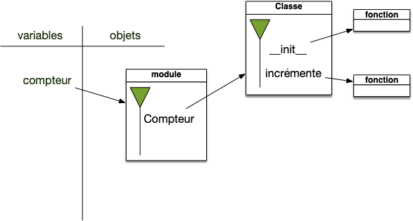
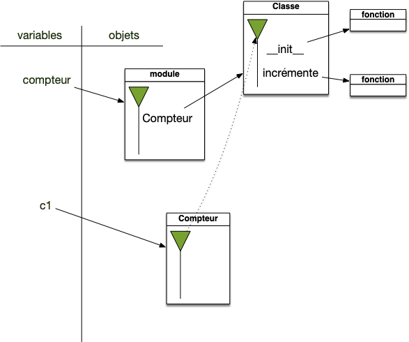
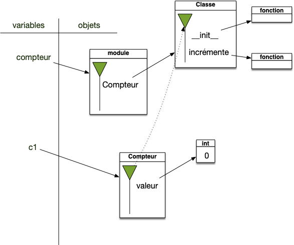
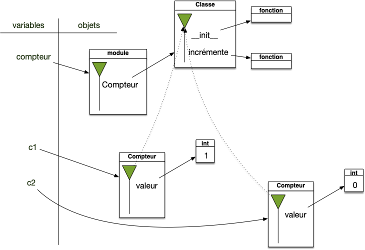

Un objet est un bout de code auquel est associé :

- des fonctionnalités (des méthodes) qui sont communes à tous les objets de sa classe
- des choses à lui tout seul (sa structure de donnée interne qui constitue ses attributs) qui lui permettent de se différentier des autres objets de sa classe même s'il a les mêmes fonctionnalités.

Un objet, n'est donc pas isolé, il partage ses fonctionnalités avec tous les objets de sa _classe_.

## <span id="compteur"></span>Créer ses propres classes

De façon générale, on peut définir un objet et une classe comme :


Un **_objet_** est une structure de données (les champs de la structure de donnée sont appelés **_attributs_**) sur laquelle on peut effectuer des opérations (appelées **_méthodes_**).

Pour pouvoir facilement créer une structure particulière et donner un moyen simple d'effectuer les opérations sur celle-ci, on utilise des **_classes_** comme patron de ces objets :
- elles vont gérer la création des objets via un **_constructeur_**.
- elles contiennent dans leur espace de noms les différentes **_méthodes_** que l'on pourra appliquer



<div id="compteur-code"></div>

On crée une classe par rapport à un besoin que l'on veut satisfaire. Supposons que l'on veuille créer une classe compteur qui permettent d'exécuter le code suivant :

```python/
from compteur import Compteur

c1 = Compteur()
c2 = Compteur()
c1.incrémente()
c2.incrémente()
c1.incrémente()

print(c2.valeur)
```

Pour construire cette cette classe, il faut se poser la question :

- _"que dois-je pouvoir faire avec mon compteur ? "_ ce qui permettra de déterminer les méthodes de la classe
- _"que dois-je stocker comme information pour que les méthodes fonctionnent ?"_ ce qui permettra de déterminer les attributs de chaque objet.

### Analyse du besoin

Ici notre besoin c'est de faire marcher le bout de code d'une façon plausible. Il faut se demander ce que veut l'utilisateur de ce code python.

Le programme commence par importer le mot `Compteur`{.language-} d'un module nommé `compteur`{.language-} (donc placé dans un fichier  nommé `compteur.py` dans le dossier du projet) et on l'exécute 2 fois pour l'affecter à 2 noms différents. Pour voir ce que peut être `Compteur`{.language-}, plusieurs indices :

- cela **ne doit pas être** une fonction normale, sinon `c1`{.language-} et `c2`{.language-} seraient identiques.
- le mot `Compteur`{.language-} à une majuscule, ce qui correspond (par convention) en python à des noms de classes 

A la lecture du code, on a donc _envie_ que le code :

1. création de deux compteurs
2. en incrémente un deux fois et l'autre qu'une seule fois
3. affiche à l'écran la valeur d'un des compteurs (celui qui a été incrémenté une fois) qu'on suppose égale à 1


Un code dont les objets sont bien nommés doit pouvoir se lire et être interprétable sans connaître le corps des fonctions et méthodes utilisées.



Les fonctionnalités que notre compteur doit avoir sont :

- ajouter une unité à un compteur
- connaître la valeur du compteur.

Pour que l'on puisse avoir plusieurs compteurs (si on n'a qu'un seul compteur, ce n'est pas la peine de faire des objets), il faut que chaque compteur ait une valeur à lui : `valeur`{.language-} est un attribut. En revanche, on veut pouvoir incrémenter tous les compteurs : `incrémente()`{.language-} est une méthode.


### Modélisation UML

Pour représenter les différentes possibilités offertes par une classe on utilise l'[Unified Modeling Language (UML)](<https://fr.wikipedia.org/wiki/UML_(informatique)>)


Vous pouvez suivre ce petit [tutoriel UML](https://www.sparxsystems.fr/resources/tutorials/uml/datamodel.html) pour comprendre sa notation et son utilité.


L'UML peut être très compliqué. Nous allons uniquement l'utiliser ici comme une représentation synthétique d'une classe/objet. Vous le verrez dans les exemples ci-dessous mais, en gros, une classe en UML c'est le diagramme :


- pour chaque attribut on pourra préciser le _type_ (entier, chaîne de caractères, une classe particulière d'objet, ...) si c'est important
- pour chaque méthode on donnera sa [signature](https://developer.mozilla.org/fr/docs/Glossaire/Signature/Fonction) complète (son nom et ses paramètres) pour que l'on puisse l'utiliser.
- le constructeur de la classe sera désigné par le nom de la classe

On peut même combiner les diagramme UML ensemble. Par exemple un point et un polygone :


Ou le classique personne et compte bancaire :


#### UML du Compteur

On va essayer de comprendre le code pour produire une représentation UML de la classe `Compteur`{.language-}. L'analyse du besoin que l'on a effectué nous a permit de définir l'usage ue l'on veut faire du compteur :

- ajouter une unité à un compteur via la méthode `incrémente`{.language-}
- connaître la valeur du compteur via l'attribut `valeur`{.language-}

Ce qui donne le diagramme UML du compteur :




Pour créer un diagramme UML :

1. on commence toujours par le nom de la classe
2. on explicite ses méthodes, c'est à dire comment on va utiliser les objets (ici incrémenter un compteur).
3. on crée la structure de données qui va permettre de stocker les informations nécessaires à son utilisation : ce sont les attributs (ici un entier pour stocker le nombre de fois où on l'a incrémenté).



### Implémentation en python

La modélisation UML ne nous indique pas l'implémentation des différentes méthodes, il nous indique juste comment on peut les utiliser. Pour exécuter et utiliser notre compteur, il faut le coder.


N'hésitez pas à jeter un coup d'œil au [tutoriel de python sur ses classes](https://docs.python.org/fr/3/tutorial/classes.html). Ce cours est là pour vous montrer tout ce qu'il y a dedans, à part (peut-être) la partie sur l'héritage et les itérateurs.



<div id="compteur-classe"></div>

La modélisation UML se transcrit presque mot pour mot en python. En codant la classe suivante dans un fichier nommé `compteur.py`{.fichier} l'exemple va fonctionner :

```python/
class Compteur:
    def __init__(self):
        self.valeur = 0

    def incrémente(self):
        self.valeur = self.valeur + 1

```

On va détailler plus tard les méthodes et moyens de construire des classes en python mais de l'écriture de la classe compteur on peut d'ores et déjà en déduire que :

- une classe est un bloc python
- le constructeur est une fonction définie dans le bloc de classe et qui s'appelle `__init__`{.language-}
- les attributs sont assignés dans l'espace de nom d'un objet nommé `self`{.language-} qui est le premier paramètres de toutes les fonctions définies dans la classe
- les méthodes sont des fonctions définies dans la classe

## Classes en python

### Définition de classes

La définition d'une classe est un bloc python contenant deux parties :

```python

class <nom de la classe>:
    def __init__(self, paramètre 1, ..., paramètre n):
        # création des attributs
        # initialisation de l'objet
    def méthode(self, paramètre 1, ..., paramètre n_1):
        # ...
        # instructions de la méthode
        # ...
    # autres méthodes
```

- La première partie est constituée du constructeur nommé `__init__`{.language-}
- La seconde parties est constituées des différentes méthodes

En python, toutes les méthodes sont des fonctions définies dans le bloc classe :

- le constructeur d'une classe sera **toujours** la méthode : `__init__`{.language-}. C'est une méthode spéciale.
- le 1er paramètre de chaque méthode est **toujours** `self`{.language-}. A l'exécution, python donnera à ce paramètre l'objet qui appelle la méthode, on ne le voit pas lorsque l'on écrit le code.


La méthode `__init__`{.language-} n'a pas de `return`{.language-}, mais elle est utilisée dans le processus de création d'un objet.


De façon formelle :


Une classe en python est un **_objet de type classe_** contenant [un espace de nommage](../../bases-programmation/espace-nommage/){.interne}.



Reprenons [l'exemple de la classe compteur](./#compteur-code){.interne} et examinons son exécution. à la fin de la ligne 1, on vient d'importer le module `compteur`{.language-} qui [contient uniquement une définition de classe](./#compteur-classe){.interne}, on est dans le cas suivant :



L'espace de nommage de la classe `Compteur`{.language-} contient deux méthodes (les fonctions définies dans une classes sont appelées méthodes) :

- `__init__`{.language-} qui est le constructeur de la classe
- `incrémente`{.language-} qui est une méthode

Les deux méthodes prennent comme premier paramètre un objet nommé `self`{.language-}, qui est la manière explicite de python de montrer quel objet est utilisé lors de l'appel de méthodes :


le premier paramètre de toute méthode, noté `self`{.language-}, est l'objet sur lequel on va appliquer la méthode (l'objet à gauche du `.`{.language-} lors de l'appel à celle-ci par une notation pointée).



Vous pouvez appeler ce premier paramètre comme vous voulez, mais il est **très très** déconseillé de le faire car votre code en deviendra moins lisible (tout le monde utilise le nom `self`{.language-}).



### Création d'un objet

En python, le retour de l'**_exécution d'une classe_** (l'utilisation de la classe comme si c'était une fonction) produit un objet. Par exemple :

- `list()`{.language-} : crée un objet de type `list`{.language-} (une liste), sans paramètre.
- `int()`{.language-} : crée un objet de type `int`{.language-} (un entier) sans paramètre (c'est 0).
- `int(3.1415)`{.language-} : crée un un objet de type `int`{.language-} avec un paramètre, valant le réel 3.1415 (c'est 3)
- `float("3.1415")`{.language-} : crée un objet de type `float`{.language-} (un réel) avec un paramètre valant la chaîne de caractères `"3.1415"`{.language-}.
- `list(range(5))`{.language-} : crée un objet de type `list`{.language-} avec comme unique paramètre le résultat de la fonction `range`


Certains objets se créent juste avec leur valeur comme les entiers, les réels ou encore les chaines de caractères. En python `3`{.language-} est équivalent à `int(3)`{.language-} par exemple.


Le code suivant :

```python
o = MaClasse(paramètre_1, ..., paramètre_n)
```

Va créer un objet de type `MaClasse`{.language-} en effectuant les différentes étapes suivantes :

1. créant un objet vide `o`{.language-} de type `MaClasse`{.language-} contenant un espace de nommage dont le parent est l'espace de nommage de sa classe
2. il exécute le constructeur `__init__`{.language-} sur l'objet : `MaClasse.__init__(o, paramètre 1, ..., paramètre n)`{.language-} (c'est pour ça que la méthode `__init__`{.language-} n'a pas de retour)

En prenant [l'exemple du compteur](./#compteur-code){.interne}. l'exécution de la ligne 3 (`c1 = Compteur()`{.language-}) se déroule comme suit :

1. Création d'un nouvel objet :
    
2. Exécution du constructeur `__init__`{.language-} avec le nouvel objet en paramètre. À la fon de l'exécution du constructeur on est dans la configuration suivante :
    

On refait pareil pour la ligne 4 (`c2 = Compteur()`{.language-}), ce qui fait qu'on se trouve dans l'état suivant :


Comme le constructeur est toujours appliqué au nouvel objet créé chaque objet va bien avoir des attributs distincts !


En python, les attributs d'un objet **sont explicitement créés** dans le constructeur.



### Exécution de méthodes

L'exécution de méthodes se fait simplement en utilisant les règles des espaces de nommages et de la notation pointée.

1. on cherche le nom (potentiellement récursivement) dans l'espace de nommage 
2. l'objet appelant est donné comme premier paramètre de la méthode.

Ainsi pour [l'exemple du compteur](./#compteur-code){.interne}, l'exécution de la ligne 5 (`c1.incrémente()`{.language-}) se déroule comme suit :

1. on cherche le nom `incrémente`{.language-} dans l'espace de nommage de `c1`{.language-}. Il n'y est pas
2. on cherche alors le nom `incrémente`{.language-} dans l'espace de nommage parent, c'est celui de sa classe et on le trouve !
3. on exécute la méthode `incrémente`{.language-} en plaçant l'objet appelant (ici `c1`{.language-}) en premier paramètre de la méthode
4. La méthode accède aux différents attributs de l'objet en utilisant la notation pointée ((ici `self.valeur`{.language-}))

Le résultat de l'exécution de la ligne 5 est alors :



À vous pour vérifier que vous avez compris :


Donnez le schéma des espaces de nommages jusqu'après l'exécution de la ligne 7 de [l'exemple du compteur](./#compteur-code){.interne}.





Détaillez l'exécution de la ligne 9 de [l'exemple du compteur](./#compteur-code){.interne} (`print(c2.valeur)`{.language-}).



1. on cherche à exécuter la fonction `print`{.language-} : il faut trouver l'objet qui est son premier paramètre
2. son paramètre est l'objet associé au nom `valeur`{.language-} dans l'espace de nommage de l'objet associé au nom `c2`{.language-}
3. le nom `c2`{.language-} existe dans l'espace des variables, c'est un objet de la classe `Compteur`{.language-}
4. L'espace de nommage de cet objet contient le nom `valeur`{.language-} qui est associé à un entier valant 1 : c'est notre paramètre de la fonction `print`{.language-}
5. on affiche à l'écran un entier valant 1.
