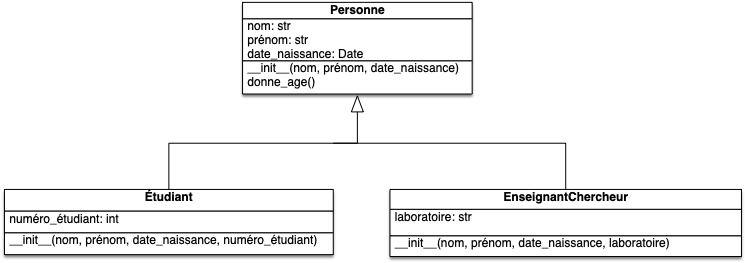
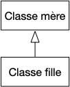
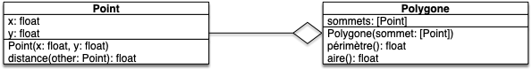
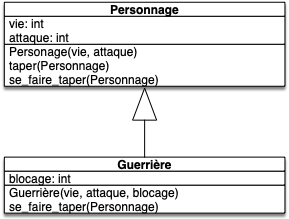

Le mécanisme d'héritage permet d'organiser les classes entre elles et de réutiliser certaines parties du code sans les réécrire: le code est factorisé. Il faut considérer qu'une classe fille désigne des objets plus *spécifiques* que ceux de la classe mère. Quelques exemples qui seront dévelopés par la suite:

- dans un contexte de base de données pour gérer une université, on peut envisager
    - une classe mère `Personne`{.language-} comprenant les attributs prénom, nom, date de naissance et une méthode permettant de calculer l'age.
    - des classe filles `Étudiant`{.language-} et `EnseignantChercheur`{.language-} ayant des attributs spécifiques: numéro d'étudiant pour les uns, laboratoire de rattachement pour les autres.
- dans un contexte mathématique, un polygone est une notion générale avec des cas particuliers: triangle, quadrilatère, pentagone, etc. On peut donc concevoir 
    - une classe mère `Polygone`{.language-} composée d'une liste de sommets et de méthodes pour calculer le périmètre, l'aire, etc.
    - des classes filles `Triangle`{.language-}, `Quadrilatère`{.language-}, `Pentagone`{.language-}, etc. La classe `Triangle`{.language-} est plus spécifique, et dispose à ce titre de méthodes spécifiques, supplémentaires, qui calculent l'orthocentre, tracent le cercle circonscrit et le cercle inscrit, détermine si le triangle est rectangle, isocèle, équilatéral, etc.
- dans un contexte de jeu, un personnage est une notion générique qui se décline en plusieurs catégories spécifiques: magicien, guerrière, gobelin, etc.:
    - la classe mère `Personnage`{.language-} définit des points de vie, un score d'attaque, etc.
    - les classes filles `Magicien`{.language-}, `Guerrière`{.language-}, `Gobelin`{.language-} y ajoutent des comportements spécifiques à chaque catégorie (sorts, défense, etc.

## Utilisation de l'héritage

L'héritage permet d'utiliser les attributs et méthodes créées dans les classes mères de façon simple :

1. soit en cherchant dans la hiérarchie des classes l'attribut ou la méthode appelé depuis une classe fille
2. soit en appelant directement un attribut ou une méthode de la classe mère.


L'héritage permet de factoriser du code entre classes similaires :

- lorsque l'on veut rendre plus spécifique une classe : la nouvelle classe est un cas particulier de la classe mère
- lors de l'utilisation de bibliothèques : on particularise à nos besoins une classe générique donnée par un module que l'on n'a pas écrit.

La règle est que lorsque l'héritage doit ré-écrire toutes les méthodes de sa classe mère pour qu'il n'y ait pas de conflit, alors il faut changer d'approche. Une classe et sa classe mère doivent partager beaucoup de méthodes (ou que les méthodes soient des cas particuliers).

## Exemple 1 : personnel de l'université

Ce premier exemple va nous permettre de comprendre le mécanisme mis en œuvre dans l'héritage.

Le diagramme UML représentant sa description dans l'introduction est celle-ci :



Les relations d'héritages sont explicités par une flèche spéciale :


La flèche qui montre la relation d'héritage est :



Toutes les classes filles  ***héritent*** des propriétés (attributs et méthodes des parents) en supposant le code des classes écrites dans le fichier `personnel.py`{.fichier} on peut alors très bien écrire le code suivant bien que la méthode `donne_age`{.language-} ne soit pas définie dans la classe `EnseignantChercheur`{.language-} :

```python
from datetime import date
from personnel import EnseignantChercheur


prof_info = EnseignantChercheur("Turing", "Alan", "Mathématiques de Cambridge", date(1936, 6, 23))
print(prof_info.donne_age())

```

Le principe même de l'héritage est de pouvoir facilement utiliser dans des classes filles des éléments définies dans les classes mères.

### Code de la classe mère

Ce code est classique :

```python
from  datetime import date


class Personne:
    def __init__(self, nom, prénom, date_naissance):
        self.nom = nom
        self.prénom = prénom
        self.date_naissance = date_naissance

    def donne_age(self):
        return int(abs((self.date_naissance - date.today()).days / 365))

```


On a utilisé [le module `datetime`{.language-} de python](https://docs.python.org/fr/3/library/datetime.html#) qui est fait pour gérer les dates. Utilisez **toujours** des modules spécifique pour gérer les dates et ne cédez pas à la tentation d'utiliser des chaines de caractères par exemple, vous le payerez tôt ou tard car il y a trop de cas particuliers et de bizarrerie de formats de date (format Américain ? Français ? Chinois ?) pour faire attention à tous les cas soit-même.


### Classes filles

Pour écrire le code des classes filles il faut pouvoir faire deux choses :

1. expliciter le fait qu'une classe hérite de l'autre
2. utiliser le code de la classe mère dans une classe fille

Voyons comment tout ça est fait en python (on ajoute les classes filles dans le fichier contenant la classe mère) :

```python#
class Étudiant(Personne):
    def __init__(self, nom, prénom, date_naissance, numéro_étudiant):
        super().__init__(nom, prénom, date_naissance)
        self.numéro_étudiant = numéro_étudiant


class EnseignantChercheur(Personne):
    def __init__(self, nom, prénom, date_naissance, laboratoire):
        super().__init__(nom, prénom, date_naissance)
        self.laboratoire = laboratoire

```
### Définir la classe mère

On définit la classe mère d'une classe en faisant suivre le nom de la classe fille, lors de sa définition, par le nom de la classe mère entre parenthèses :

```python
class Fille(Mère):
    ...

```

### Appels de fonctions de la classe mère

Utiliser une méthode de la classe mère dans la classe fille on utilise le mot clé `super()`{.language-} suivi du nom de la méthode à utiliser. Dans l'exemple, le constructeur de la classe fille appelle le constructeur de la classe mère. Remarquez que l'on utilise la méthode `__init__`{.language-} sans utiliser le premier paramètre (`self`{.language-}) qui est implicitement l'objet courant.


Un petit tuto sur [la fonction super](https://he-arc.github.io/livre-python/super/index.html )


L'appel des fonctions de la classe mère est obligatoire en python. Si on omettait la ligne 3 dans le code de définition de la classe `Étudiant`{.language-}, ces derniers n'auraient pas d'attributs `nom`{.language-} `prénom`{.language-}, ni `année_naissance`{.language-} définis dans le constructeur de la classe mère, `Personne`{.language-}.

### Appels de méthodes

L'appel de méthodes se fait en "remontant" la hiérarchie jusqu'à trouver la méthode à exécuter. Lors de l'exécution de la ligne `print(prof_info.donne_age())`{.language-}, celà se passe ainsi :

1. l'interpréteur python regarde si le nom `donne_age`{.language-} est défini dans l'objet de nom `prof_info`{.language-} : ce n'est pas le cas
2. il remonte alors d'un étage dans la hiérarchie et regarde si le nom `donne_age`{.language-} est présent dans la classe de `prof_info`{.language-}, `EnseignantChercheur`{.language-} : ce n'est toujours pas le cas
3. on peut encore remonter d'un cran et regarder la classe mère de `EnseignantChercheur`{.language-}, `Personne`{.language-}. Bingo : le nom `donne_age`{.language-} est présent et il est exécuté.


## Hiérarchie des classes

Dans un langage objet, les classes sont organisées hiérarchiquement, la classe *racine* étant la classe la plus haute (ici elle s'appelle `object`).


Dans la figure précédente :

- la classe `object` est la *racine* de la hiérarchie, c'est la classe la plus haute
- la `classe 1` est la *classe mère* de la `classe 2`
- la `classe 2` est une *classe fille* de la `classe 1`

La figure montre également la désignation UML de l'héritage : une flèche avec un triangle vide.


En python, toutes les classes héritent de la classe `object`{.language-}. Par exemple `issubclass(list, object)`{.language-} répond `True`{.language-}.


Le fait que toutes les classes héritent d'`object`{.language-} est très pratique puisque cela permet de créer des comportements par défaut à tous les objets : si une méthode existe dans la classe alors qu'on ne l'a pas définie explicitement, c'est qu'elle est définie dans la classe `object`{.language-}. C'est le cas de la méthode `__str__`{.language-} par exemple.

### Chercher dans la hiérarchie

Supposons que j'ai un objet nommé `obj`{.language-} de classe `classe 2` qui veut appeler la méthode 1 : `obj.méthode1()`{.language-}

1. `méthode1`{.language-} est d'abord cherchée dans l'espace de nom de `obj`{.language-} : elle n'y est pas.
2. elle est alors cherchée dans sa classe, `classe 2` : celle-ci ne définit pas `méthode1`{.language-}
3. elle est alors cherchée dans la classe mère de `classe 2`, `classe 1` : `méthode1`{.language-} est définie, c'est son code qui est finalement utilisé.


Si l'on arrive jusqu'à la classe `object` et qu'elle ne contient pas le nom recherché une erreur est lancée.


### Appeler directement une sous/sur-classe

Supposons que dans la définition de `méthode1`{.language-} de la `classe 2'`, on particularise la méthode `méthode1`{.language-} de la `classe 1`. On peut alors appeler la méthode `méthode1`{.language-} de la `classe 1` dans la définition de la `méthode1`{.language-} de la `classe 2'`.



Si l'on ne retrouve pas la méthode dans la classe mère, on remonte la hiérarchie. De là, tenter d'utiliser la méthode `méthode1`  de la `classe 1'` en définissant la  méthode `méthode1`  de la `classe 2''` va en fait exécuter la méthode  méthode `méthode1`  de la classe `object`.



### Connaître la hiérarchie

En python, si l'on veut connaître l'ordre dans lequel les classes vont être examinées lors de la remontée de la hiérarchie, on peut utiliser la méthode `mro()`{.language-}. Par exemple, dans un interpréteur :

```python
>>> str.mro()
[<class 'str'>, <class 'object'>]
```

L'ordre dans lequel sont examinées les classes pour les chaines de caractères est donc : d'abord la classe `str`{.language-} puis la classe `object`{.language-}


La classe `object`{.language-} est toujours le dernier élément de la liste.


Notez bien que la méthode `mro`{.language-} est appliquée **à la classe** et nom à l'objet. Par exemple pour la classe `EnseignantChercheur`{.language-} de l'exemple 1, on aurait :

```python
>>> EnseignantChercheur.mro()
[<class '__main__.EnseignantChercheur'>, <class '__main__.Personne'>, <class 'object'>]
```

Alors qu'avec un objet :

```python
>>> prof_info.mro()
Traceback (most recent call last):
  File "<stdin>", line 1, in <module>
AttributeError: 'EnseignantChercheur' object has no attribute 'mro'
```


## Exemple 2 : héritage simple

L'héritage est une technique objet qui n'est pas utilisée indépendamment du reste. On l'utilise souvent en combinaison d'autres techniques comme la composition.

On va ici manipuler des polygones. On veut pouvoir :

- créer un polygone à partir d'une liste de sommets donnée
- calculer l'aire du polygone
- calculer le périmètre du polygone

### classes Point et Polygone

Pour cela, on va créer une classe `Point`{.language-} et une classe `Polygone`{.language-} :

- classe `Point`{.language-} :
  - on se restreint à la 2D
  - coordonnées cartésiennes
  - distance à un autre point pour pouvoir plus facilement calculer le périmètre ensuite
- classe `Polygone`{.language-} :
  - création avec une liste de Point
  - calcul du périmètre
  - calcul de l'aire

On va supposer que le [polygone est simple](https://fr.wikipedia.org/wiki/Polygone_simple) pour simplifier le calcul de l'aire...

#### Uml


Comme un point n'est **pas** un cas particulier de polygone, ni réciproquement, ces deux classes ne peuvent pas avoir de lien d'héritage.


Point et polygone entretiennent un lien d'agrégation (les points sont passés au polygone à sa construction). Le modèle UML suivant :



#### Code python

On peut alors avoir le code python suivant pour créer les classes :

```python
from math import sqrt


class Point:
    def __init__(self, x, y):
        self.x = x
        self.y = y

    def distance(self, other):
        x1 = self.x
        x2 = other.x

        y1 = self.y
        y2 = other.y

        return sqrt((x2 - x1) ** 2 + (y2 - y1) ** 2)


class Polygone:
    def __init__(self, points):
        self.points = tuple(points)

    def périmètre(self):
        d = 0
        pivot = self.points[0]
        for point in self.points[1:]:
            d += pivot.distance(point)
            pivot = point
        d += pivot.distance(self.points[0])

        return d

    def aire(self):
        a = 0
        pivot = self.points[0]
        for point in self.points[1:]:
            a += pivot.x * point.y - pivot.y * point.x
            pivot = point

        point = self.points[0]
        a += pivot.x * point.y - pivot.y * point.x

        return 0.5 * abs(a)

```

Remarques :

1. Dans le constructeur de la classe polygone, on recrée une liste de points pour être sûr que le nombre de points reste constant (la liste est passée en paramètre et peut donc être modifiée à l'extérieur de la classe)
2. Notez que l'on ne recrée pas les points, ils peuvent donc changer car ils sont passés en paramètre de la construction du polygone

On peut tester le code avec, par exemple :

```python
points = [Point(0, 0), Point(0, 2), Point(1, 2), Point(1, 0)]
polygone = Polygone(points)
print(polygone.périmètre())
print(polygone.aire())
```

### Un polygone particulier

Comment modéliser une classe triangle ?

Comme un triangle **est un** polygone simple, on peut utiliser l'héritage pour cela.

#### Modélisation UML

Elle est très simple :


Notez que pour l'héritage, on ne remet pas les attributs/méthodes définis dans les classes mères.

#### Code python du Triangle

La classe `Triangle`{.language-} hérite de `Polygon`{.language-}, on appelle donc le constructeur de ce dernier lors de la création d'un `Triangle`{.language-}.

Ceci est explicite en python :

```python
class Triangle(Polygone):
    def __init__(self, point1, point2, point3):
        super().__init__([point1, point2, point3])
```

On peut maintenant utiliser toutes les méthodes définies dans Polygone puisque le constructeur de `Triangle`{.language-} appelle directement le constructeur de `Polygone`{.language-} : à la fin du constructeur, il existera une liste de points dans le triangle.

```python
triangle = Triangle(Point(0, 0), Point(1, 1), Point(2, 0))
print(triangle.périmètre())
print(triangle.aire())
```

Pour trouver le périmètre, python fonctionne ainsi :

1. existe-t-il un nom `périmètre`{.language-} dans l'objet `triangle`{.language-} : NON
2. existe-t-il un nom `périmètre`{.language-} dans la classe de l'objet `triangle`{.language-}, `Triangle`{.language-} : NON
3. existe-t-il un nom `périmètre`{.language-} dans la classe mère de `Triangle`{.language-}, `Polygone`{.language-} : OUI

Une fois la méthode trouvée, on l'exécute en plaçant l'objet (ici notre `triangle`{.language-} en 1er paramètre, c'est à dire `self`{.language-} de la méthode `périmètre`{.language-} définie dans `Polygone`{.language-}).


Les objets de type `Triangle`{.language-} sont **aussi** des objets de type `Polygone`{.language-} :

```python
>>> triangle = Triangle(Point(0, 0), Point(0, 2), Point(1, 2))
>>> print(isinstance(triangle, Triangle))
True
>>> print(isinstance(triangle, Polygone))
True
>>> 
```



## <span id="exemple-D&D"></span> Exemple 3 : donjons et dragons

On va simuler des personnage d'*heroic fantasy*. Pour cela, on commence par créer une classe `Personnage`{.language-} qui sera particularisée petit à petit.

### Classe Personnage

Le personnage générique doit :

- avoir un score d'attaque
- avoir des points de vie
- pouvoir modifier son score d'attaque et ses points de vie
- taper un autre personnage (lui faire perdre un nombre de point de vie égale à son score d'attaque)
- se faire taper par un autre personnage

#### UML du personnage


#### Code python du personnage

On a décidé ici de ne pas mettre de méthode get et set, mais de laisser libre accès aux attributs. C'est un choix possible. L'UML dérive donc un peu du code python ce qui est normal, chaque langage ayant ses spécificités.

```python
class Personnage:
    def __init__(self, vie, attaque):
        self.vie = vie
        self.attaque = attaque

    def se_faire_taper(self, personnage):
        self.vie -= personnage.attaque

    def taper(self, personnage):
        personnage.se_faire_taper(self)
```

Voyez comment on a utilisé la méthode `se_faire_taper`{.language-} pour définir la méthode `taper`{.language-}.

### La classe guerrière

La guerrière dispose d'un score de blocage qui représente son pourcentage de chances de ne pas perdre de vie quand un autre personnage l'attaque.

#### Modèle UML de la guerrière

c'est un personnage, on peut donc utiliser l'héritage.



On ne met que les méthodes qui changent, donc le constructeur et se faire taper.

#### Code python de la guerrière

```python
# ... 

import random

#...

class Guerrière(Personnage):
    def __init__(self, vie, attaque, blocage):
        super().__init__(vie, attaque)
        self.blocage = blocage

    def se_faire_taper(self, personnage):
        if self.blocage < random.randrange(0, 101):
            super().se_faire_taper(personnage)
```

Comprenez bien le code :

- On commence par appeler le constructeur de la classe mère (`super().__init__()`{.language-}) puis on applique le cas particulier de notre classe (`self.blocage = blocage`{.language-}).
- on ajoute un attribut à la guerrière par rapport au personnage normal,
- la méthode `se_faire_taper(personnage)`{.language-} utilise la méthode `se_faire_taper`{.language-} de la classe `Personnage`{.language-} seulement si la guerrière ne bloque pas le coup. Le `super().méthode_de_la_mere()`{.language-} permet d'accéder à la méthode de la classe mère même de même nom qu'une méthode (différente) de la classe fille.



On utilise **toujours** le constructeur de la classe mère pour garantir que les méthodes définies dans la classe mère fonctionnent avec les objets de la classe fille. Sinon ici, `se_faire_taper`{.language-} ne fonctionnerait pas puisque vie et attaque ne seraient pas définies



### Le magicien

Le magicien peut faire tout ce que peut faire un personnage normal mais il dispose en plus d'un score d'attaque magique qui détermine les dégâts qu'il fait en lançant un sort.

#### Modèle UML du magicien

On ajoute une nouvelle méthode qui n'existe pas dans la classe mère :


#### Code python du magicien

```python
class Magicien(Personnage):
    def __init__(self, vie, attaque, attaque_magique):
        super().__init__(vie, attaque)
        self.attaque_magique = attaque_magique

    def lancer_sort(self, personnage):
        personnage.vie -= self.attaque_magique
```

### Pour aller plus loin

Dans l'implémentation de notre classe `Personnage`{.language-}, on ne vérifie pas que notre vie passe en dessous de zéro. Il faut donc vérifier à chaque modification de l'attribut s'il est en dessous de zéro ou pas. Pour cela, on utilise en python les `@property`{.language-} vues dans le [projet objets : Dés](../projet-objets-dés#property){.interne} :


Remplacez la manipulation directe de l'attribut `vie`{.language-} par un `@property`{.language-}.



```python
class Personnage:
    def __init__(self, vie, attaque):
        self._vie = vie
        self.attaque = attaque

    def se_faire_taper(self, personnage):
        self.vie = self.vie - personnage.attaque

    def taper(self, personnage):
        personnage.se_faire_taper(self)

    @property
    def vie(self):
        return self._vie

    @vie.setter
    def vie(self, valeur):
        self._vie = valeur
        if self._vie <= 0:
            self._vie = 0
            print("je suis mort")
```



## Héritage multiple


[Héritage multiple en Pyton](https://docs.python.org/fr/3/tutorial/classes.html#multiple-inheritance)


Il est parfois tentant de faire hériter une classe de plusieurs autres. Par exemple, en reprenant l'exemple 1, on pourrait définir une classe `Thésard`{.language-} qui serait **à la fois** `Étudiant`{.language-} et `EnseignantChercheur`{.language-} :


Ceci est tout à fait possible en python, en mettant plusieurs classes mères suivies par des virgules :

```python#
class Thésard(Étudiant, EnseignantChercheur):
    def __init__(self, nom, prénom, date_naissance, numéro_étudiant, laboratoire):
        ...  
```

Ceci pose toutefois une foultitude de possibles problèmes lorsque la même méthode ou attribut est définie dans plusieurs classes mères. 


Python règle le problème en ordonnant les classes mères grace au mro :

```python
>>> Thésard.mro()
[<class '__main__.Thésard'>, <class '__main__.Étudiant'>, <class '__main__.EnseignantChercheur'>, <class '__main__.Personne'>, <class 'object'>]

```

Python suit cet ordre et s'arrête à la première classe définissant le nom recherché.


Les problèmes d'ordre en héritage multiple sont décrits sous le nom de [problème du diamant](https://fr.wikipedia.org/wiki/Probl%C3%A8me_du_diamant).


Ceci ne règle cependant pas le problème du constructeur puisque l'on veut que les 2 constructeurs soient exécutés et pas juste le premier trouvé. Il n'y a pas de solution simple à ce problème (voir par exemple [cette étude](https://realpython.com/python-super/#super-in-multiple-inheritance)), c'est pourquoi on préfère souvent remplacer l'héritage multiple par une composition :

```python#
class Thésard:
    def __init__(self, nom, prénom, date_naissance, numéro_étudiant, laboratoire):
        self.étudiant = Étudiant(nom, prénom, date_naissance, numéro_étudiant)
        self.enseignant_chercheur = EnseignantChercheur(nom, prénom, date_naissance, laboratoire)

```

L'exemple précédent nécessitera toutefois de redéfinir toutes les méthodes, et -- surtout -- le nom et le prénom sont dupliqués. Lorsque ce genre de chose arrive c'est souvent le signe qu'il faut redesigner notre programme et déconstruire ses classes pour séparer clairement les responsabilités et supprimer les duplications.

## On vérifie qu'on a compris

Quelques petit tests qui ne servent à rien en pratique mais qui permettent de vérifier qu'on a bien compris.

### Héritage de méthodes


Comment faire une classe `A`{.language-} qui a :

- un attribut `a`{.language-}
- une méthode `truc_que_fait_a()`{.language-} qui affiche "Truc défini dans la classe mère"
- une méthode `autre_truc()`{.language-} qui affiche "Autre truc dans la classe mère"



```python
class A:
    def __init__(self, a):
        self.a = a

    def truc_que_fait_a(self):
        print("Truc défini dans la classe mère")

    def truc_que_fait_a(self):
        print("Autre truc dans la classe mère")  
```




Écrivez une classe `B`{.language-} qui hérite de `A`{.language-} et qui a :

- un attribut `b`{.language-}
- le constructeur à 2 paramètres (a et b), un qui est initialisé dans la classe A (a), l'autre initialisé dans B (b)
- une méthode `autre_truc()`{.language-} qui affiche "C'est mon autre truc à moi"
- une méthode `que_de_b()`{.language-} qui affiche "Méthode seulement de la classe fille"



```python
class B(A):
    def __init__(self, a, b):
        super().__init__(a)
        self.b = b

    def autre_truc(self):
        print("C'est mon autre truc à moi")

    def que_de_b(self):
        print("Méthode seulement de la classe fille")
```

Faites bien attention à utiliser proprement le mot-clé `super`{.language-} dans le constructeur de la classe fille.



### Attribut de classe


Ajoutez dans `A`{.language-} un attribut de classe `CTE`{.language-} constante valant `un attribut de classe`{.language-}



```python
class A:
    CTE = "un attribut de classe"

    def __init__(self, a):
        self.a = a
    
    def truc_que_fait_a(self):
        print("Truc défini dans la classe mère")
    
    def truc_que_fait_a(self):
        print("Autre truc dans la classe mère")  
```



### Combinaison de méthodes


Ajoutez :

- dans la  classe `A`{.language-} : une méthode `j_hérite(x)`{.language-} qui prend un paramètre `x`{.language-} qui est une chaîne de caractère et affiche la valeur de x
- dans la  classe `B`{.language-} : une méthode `j_hérite(x)`{.language-} qui commence par appeler la méthode de la classe mère puis affiche la valeur de x en majuscules



```python
class A:
    CTE = "un attribut de classe"

    def __init__(self, a):
        self.a = a

    def truc_que_fait_a(self):
        print("Truc défini dans la classe mère")

    def truc_que_fait_a(self):
        print("Autre truc dans la classe mère")

    def j_hérite(self, x):
        print(x)


class B(A):
    def __init__(self, a, b):
        super().__init__(a)
        self.b = b

    def autre_truc(self):
        print("C'est mon autre truc à moi")

    def que_de_b(self):
        print("Méthode seulement de la classe fille")

    def j_hérite(self, x):
        super().j_herite(x)
        print(x.upper())
```


