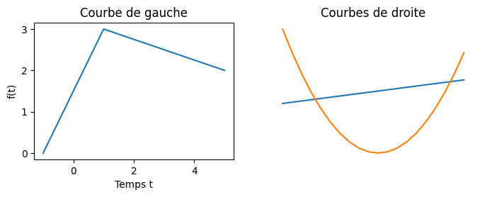

Lorsque l'on écrit du code python, on ne fait que manipuler des objets.

## Les objets sont partout

Les entiers, les chaines de caractères, les listes et même les fonctions **sont** des objets :

```python
i = 43
s = "coucou"
l = [1, 2, 3]
f = lambda x: x - 1
```

On peut utiliser des objets via des opérateurs ou des fonctions. Par exemple :

```python
print(f(i))
```


Que fait le code précédent ?



Dans un interpréteur :

```python
>>> i = 43
>>> s = "coucou"
>>> l = [1, 2, 3]
>>> f = lambda x: x - 1
>>> print(f(i))
42

```

Il affiche le résultat de la fonction `f`{.language-} (qui rend un entier valant son paramètre d'entrée moins 1) avec comme paramètre l'entier associé à la variable `i`{.language-} (un entier valant 43).


Mais un objet est plus que ça. Il contient à la fois **des données** (les différents caractères d'une chaîne de caractères par exemple) et **des méthodes** permettant d'opérer dessus. Par exemple :

```python
print(s.upper())
```


Que fait le code précédent ?



Dans un interpréteur :

```python
>>> i = 43
>>> s = "coucou"
>>> l = [1, 2, 3]
>>> f = lambda x: x - 1
>>> print(s.upper())
COUCOU

```

Il affiche le résultat de la méthode `upper`{.language-} appliquée à l'objet associé à la variable `s`{.language-}.


Les méthodes sont spécifiques à des types d'objets particulier, ainsi le code suivant ne fonctionne pas, la méthode `upper`{.language-} n'**est pas définie** pour les entiers :

```python
print(i.upper())
```



Que fait le code précédent ?



Dans un interpréteur :

```python
>>> print(i.upper())
Traceback (most recent call last):
  File "<python-input-12>", line 1, in <module>
    print(i.upper())
          ^^^^^^^
AttributeError: 'int' object has no attribute 'upper'
```

Python rend une erreur. Nous comprendrons sa signification profonde plus tard, pour l'instant cela nous indique juste que la méthode `upper`{.language-} n'existe pas pour les entiers : `'int' object has no attribute 'upper'`{.language-}


Les méthodes sont ainsi associées au type de l'objet. Ce sont des fonctions définis dans l'espace de nom de la classe associé. Ainsi comme le type d'une chaîne de caractères est `str`{.language-} en python :

```python
>>> type(s)
<class 'str'>
```

On peut tout à fait écrire :

```python
print(str.upper(s))
```

Où on utilise directement la fonction `upper` des chaînes de caractères. Remarquez que dans ce cas il faut expliciter le paramètre. 

Une classe :

- permet de créer un type d'objet (une structure de donnée précise)
- définit les opérations (méthodes) utilisables par ces objets.

Un objet issu d'une certaine classe :

- possède la même structure de données que les autres objets de la classe mais les valeurs de celle-ci lui sont uniques : ses **attributs**
- possède un lien vers les **méthodes** (définies dans sa classe) qu'il peut utiliser via la [notation pointée](../../bases-programmation/espace-nommage/#notation-pointée){.interne} : `objet.méthode(paramètre_1, ..., paramètre_n)`{.language-}


La programmation objet n'a pas pour but de révolutionner votre façon de programmer. Elle permet juste de bien mettre en œuvre les paradigmes de développement que l'on a vus jusqu'à présent. Il est fortement conseillé de _coder objet_ car :

- cela favorise la factorisation du code ([on ne se répète pas](../../écrire-code/coder#DRY){.interne}) : on ne définit ses méthodes qu'une seule fois dans les classes
- lisibilité avec la notation `.`{.language-} : on sait clairement à qui s'applique telle ou telle méthode
- compartimentation du code : chaque partie du code et chaque opération est compartimentée, ce qui permet de les tester et des améliorer indépendamment du reste du code.
- plutôt que de créer un gros programme complexe, on crée plein de petits programmes indépendants (les objets) qui interagissent entre eux.



Ces principes sont mis en œuvre de façon différentes selon les langages mais on retrouvera toujours ces notions.


## Exemples de classes en python

Ce qui caractérise un objet est ce qu'on peut faire avec, c'est à dire ses méthodes. Une classe regroupe un ensemble de méthodes permettant de résoudre un problème spécifique. Que ce problème soit lié au type de données (chaîne de caractères, entier, ...) qu'à leurs usages (mesurer le temps, graphiques, ...).

Voyons quelques exemple de classes python et leurs usages.

### Chaîne de caractères

Les chaines de caractères sont des objets de la classe ([str](https://docs.python.org/fr/3/library/string.html)) :

```python
>>> type("une chaîne")
<class 'str'>
```

Les méthodes définies dans la classe `str`{.language-}, comme `capitalize()`{.language-} par exemple sont utilisables par tous les objets de la classe `str`{.language-} (dans l'exemple ci-après par l'objet `"coucou"`{.language-} et l'objet `"toi"`{.language-}) :

```python
>>> "coucou".capitalize()
'Coucou'
>>> "toi".capitalize()
'Toi'
```

La notation pointée permet de dire que c'est la méthode à droite du `.`{.language-} que l'on cherche dans l'objet à gauche du point.


Le code suivant produit une erreur. Pourquoi ?

```python
>>> capitalize("coucou")
Traceback (most recent call last):
  File "<stdin>", line 1, in <module>
NameError: name 'capitalize' is not defined
```



C'est la méthode définie dans la classe `str`{.language-} qui s'appelle `capitalize`{.language-} qui existe...


Le résultat est différent lorsque l'on applique la méthode `capitalize`{.language-} à la chaîne de caractères `"bonjour"`{.language-} ou à la chaîne de caractères `"toi"`{.language-} car ces deux chaînes de caractères, bien que de la même classe (`str`{.language-}), sont différents : dans l'un il y a la chaîne "bonjour", dans l'autres la chaîne "toi".

Remarquez que l'application de la méthode ne change pas sa valeur :

```python
>>> s = "coucou"
>>> s.upper()
'COUCOU'
>>> print(s)
coucou
```

Pour conserver le résultat de la méthode, il faut le placer dans une autre variable :

```python
>>> s_prim = s.upper()
>>> print(s_prim)
COUCOU
>>> print(s)
coucou

```

Enfin, une méthode peut avoir des paramètres  comme la méthode [`str.center`{.language-}](https://docs.python.org/fr/3.14/library/stdtypes.html#str.center) :

```python
>>> print(s.center(25, "*"))
**********coucou*********
```

Et même rendre autre chose que son type d'origine comme la méthode [`str.count`{.language-}](https://docs.python.org/fr/3.14/library/stdtypes.html#str.count)  :

```python
>>> print(s.count("c"))
2
```

La notation pointée est très pratique puisque l'on peut chaîner les instruction. Par exemple, considérons la ligne de code :

```python
"coucou".upper().count("U")
```

Pour comprendre son exécution, on analyse la ligne :

1. on exécute la méthode `count`{.language-} de l'objet à gauche du `.`, c'est à dire `"coucou".upper()`{.language-}. **Attention** C'est bien toute la partie gauche, pas seulement jusqu'au `.`{.language-} suivant.
2. l'objet `"coucou".upper()`{.language-} est le résultat de la méthode `upper`{.language-} appliquée à l'objet à gauche du `.`, c'est à dire la chaîne de caractères `"coucou"`{.language-}.
3. le résultat de `"coucou".upper()`{.language-} est ainsi égal à l'objet `"COUCOU"`{.language-}
4. donc `"coucou".upper().count("U")`{.language-} est égal à `"COUCOU".count("U")`{.language-} qui vaut 2


### Entiers

Les entiers sont aussi des objets d'une classe : `int`{.language-}.

```python
>>> type(1)
<class 'int'>
```

Contrairement à la classe `str`{.language-}, la classe `int`{.language-} ne définit pas de méthode mais des opérations. Par exemple `__add__`{.language-} définit l'addition d'un entier par un autre objet. C'est pratique que tout soit défini dans la classe , cela nous permettra à nous aussi de faire nos propres additions.

Les trois écritures sont identiques en python, mais bien sur, nous préférerons la première, bien plus simple à écrire et à comprendre :

1. `1 + 2`{.language-}
2. `int.__add__(1, 2)`{.language-}
3. `(1).__add__(2)`{.language-}


Remarquez que l'opération `+`{.language-} n'est pas identique pour `1 + 2`{.language-} et `1.0 + 2`{.language-}. Dans le premier cas c'est l'addition définie dans `int`{.language-} qui est utilisé, dans le second cas c'est celle définie dans `float`{.language-}.


En python les méthodes qui commencent et finissent par deux underscores (le caractère `_`, aussi parfois improprement appelé _tiret-du-huit_ car c'est ce caractère qui est sous le 8 pour des claviers français PC (ce n'est pas vrai sur mac et encore moins pour d'autres types de claviers)) sont des méthodes utilisées par python dans des cas spécifiques, on ne les utilisera quasi-jamais de façon explicite.

### Listes

Les entiers et les chaînes de caractères sont des objet dit **_immutable_** c'est à dire qu'aucune de leurs méthodes ne les modifient : elles ne font que rendre de nouveaux objets. Ce n'est pas le cas des listes.

```python
>>> l = [1, 2, 3]
>>> l.extend([4, 5, 6])
>>> print(l)
[1, 2, 3, 4, 5, 6]

```

La liste `l`{.language-} est **modifiée** par la méthode [`list.extend`{.language-}](https://docs.python.org/fr/3.14/library/stdtypes.html#list.extend). Le fait qu'une méthode modifie ou pas l'objet passé en paramètre n'est pas réglementé. Certaines le font d'autres non :


```python
>>> l = [1, 2, 3]
>>> l + [4, 5, 6]
[1, 2, 3, 4, 5, 6]
>>> print(l)
[1, 2, 3]

```

Mais souvent les méthodes qui ne rendent rien (donc qui rendent `None`) modifient les objets :

```python
>>> l = [1, 2, 3]
>>> print(l.extend([4, 5, 6]))
None

```

Terminons cette partie par deux petit exercices pour voir si vous avez compris :


Que produit le code suivant :

```python
[1, 2, 3] + "nous irons au bois"
```


Une erreur :

```python
>>> [1, 2, 3] + "nous irons au bois"
Traceback (most recent call last):
  File "<python-input-39>", line 1, in <module>
    [1, 2, 3] + "nous irons au bois"
    ~~~~~~~~~~^~~~~~~~~~~~~~~~~~~~~~
TypeError: can only concatenate list (not "str") to list

```

Car on ne peut additionner que deux listes.



Que produit le code suivant :

```python
[1, 2, 3] + "nous irons au bois".split()
```



Là ça marche car le résultat de [`str.split`{.language-}](https://docs.python.org/fr/3.14/library/stdtypes.html#str.split) est une liste :

```python
>>> [1, 2, 3] + "nous irons au bois".split()
[1, 2, 3, 'nous', 'irons', 'au', 'bois']
```



### Complexes

Saviez-vous qu'il y a une classe pour les complexes ?

```python
>>> print(1j ** 2)
(-1+0j)
>>> z = 2 - 1j *0.5
>>> print(z)
(2-0.5j)
>>> print(type(z))
<class 'complex'>

```

Un complexe se caractérise par sa partie réelle et sa partie imaginaire. Comment y accéder?

```python
>>> x = z.real
>>> y = z.imag
>>> print(x, y)
2.0 -0.5
>>> print(type(x), type(y))
<class 'float'> <class 'float'>

```

Comment calculer le conjugué ?

```python
>>> zc = z.conjugate()
>>> print(zc, type(zc))
(2+0.5j) <class 'complex'>

```

### Dates

Ça existe et c'est très pratique !

```python
import datetime
année_scolaire = datetime.datetime(day=3, month=9, year=2024, hour=9, minute=0, second=0)
print(type(année_scolaire))
print(année_scolaire)
```

Le code précédent va afficher :

```python
<class 'datetime.datetime'>
2024-09-03 09:00:00
```

Les attributs de la date sont accessibles :

```python
print(année_scolaire.day)
print(année_scolaire.month)
print(année_scolaire.year)
print(année_scolaire.hour, année_scolaire.minute, année_scolaire.second)
```

Qui va afficher :

```python
3
9
2024
9 0 0
```

Enfin, on peut prendre la date actuelle :

```python
now = datetime.datetime.today()
print(type(now))
print(now)
```

Ce qui produira :

```python
<class 'datetime.datetime'>
2025-03-19 10:49:34.921872
```

Et on peut manipuler des dates comme des nombres :

```python
d = now - année_scolaire
print("Mon année scolaire a commencé depuis", d.days, "jours et", d.seconds, "secondes.")
```

Bref, l'usage de d'objets et de classes permet une utilisation intuitive de concepts compliqués à implémenter 


N'essayez pas de faire des manipulation de dates à la main, il y a plein d'exceptions qui fait que c'est l'enfer à faire correctement.


### Graphiques

Là aussi, ce sont des objet et des classes :

```python
import matplotlib.pyplot as plt

fig, axes = plt.subplots(1,2, figsize=(8, 2.5))
axes[0].plot([-1, 1, 5], [0, 3, 2])
axes[0].set_xlabel('Temps t')
axes[0].set_ylabel('f(t)')
axes[0].set_title('Courbe de gauche')
axes[1].plot([x for x in range(-10, 10)])
axes[1].plot([x ** 2 - 50 for x in range(-10, 10)])
axes[1].set_axis_off()
axes[1].set_title('Courbes de droite')
print(type(fig))
print(type(axes), axes.shape)
print(type(axes[0]))
plt.show()

```

Qui va écrire dans le terminal :

```python
<class 'matplotlib.figure.Figure'>
<class 'numpy.ndarray'> (2,)
<class 'matplotlib.axes._axes.Axes'>

```

Et ouvrir une nouvelle fenêtre avec le graphique suivant :


